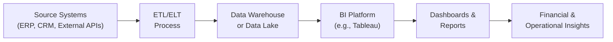

## 14.2 Visualization Tools and Reporting Dashboards

Data visualization tools and reporting dashboards are critical components of modern information systems and analytics. In the accounting and finance world, CPAs increasingly rely on visuals to quickly interpret data, identify trends, and make strategic decisions. Having the right visualization platform and designing clear, user-centric dashboards can significantly enhance how stakeholders consume and act on financial and operational information.

This section covers the major Business Intelligence (BI) platforms and offers design tips to ensure dashboards highlight key insights quickly. By the end of this section, you will understand how to select tools that align with organizational needs, create intuitive dashboards, and leverage best practices to maximize the impact of visual analytics.

## The Role of Visualization in Financial and Accounting Contexts

Visualization is the bridge between raw or aggregated data and decision-makers who need timely, actionable insights. In a financial context, well-structured visuals help CPAs and other professionals:

• Quickly identify variances in financial statements.  
• Track performance metrics, such as revenue growth, expense ratios, and profit margins.  
• Examine liquidity, solvency, and other key ratios in real-time.  
• Manage risks and detect anomalies in transactions or operational workflows.  
• Communicate insights to non-technical stakeholders (e.g., board members or executives).  

Modern organizations require dashboards that combine data from multiple sources—Enterprise Resource Planning (ERP) systems, accounting information systems, marketing platforms, social media feeds, and more. A cohesive dashboard environment can provide an integrated view of the entire enterprise, simplifying oversight and strategic planning.

## Overview of Major BI Platforms

Over the last decade, numerous BI platforms have emerged, each offering different features, user experiences, and areas of specialization. Below are several platforms commonly adopted by organizations:

Power BI (Microsoft)  
• Seamlessly integrates with the Microsoft ecosystem, particularly Excel, SharePoint, and Azure.  
• Provides robust built-in analytics and AI-driven features for data preparation.  
• Offers a user-friendly drag-and-drop interface for building dashboards.  
• Publishes interactive visualizations easily in web and mobile formats.  

Tableau  
• Known for intuitive data exploration, visual best practices, and advanced charting capabilities.  
• Employs “live” connections to various data sources, supporting real-time dashboards.  
• Includes strong storytelling capabilities through dashboards and “stories” features.  
• Maintains an active community offering a vast repository of shared visualizations.  

Qlik Sense and QlikView  
• Provides an in-memory associative data model, allowing quick exploration and “drill-down” analysis.  
• Allows dynamic data linking, so end-users can easily see relationships between different data sets.  
• Employs a unique approach to data indexing that can enhance advanced analytics projects.  

Looker (Google Cloud)  
• Focuses on governance and modeling layer (LookML) to unify business logic.  
• Offers embedded analytics features, making it possible to integrate dashboards into external applications.  
• Facilitates collaboration by integrating with popular third-party communication and workflow tools.  

Other Notable Platforms  
• IBM Cognos Analytics, Oracle Analytics, SAP BusinessObjects, and Sisense each provide specialized features like embedded AI insights, flexible deployments, and large enterprise-focused governance capabilities.

### Selecting the Right BI Platform

Selecting the most suitable BI platform for your organization requires evaluating specific factors:  
• Data Sources and Complexity: Can the BI platform easily connect to all sources—ERP, cloud databases, spreadsheets, external APIs?  
• Scalability: Will the system handle an increasing volume of data and more concurrent users?  
• Budget: What is the cost structure (subscription model, perpetual licensing) and does it align with the project scope?  
• Ease of Use: Can non-technical staff quickly learn to create and modify dashboards?  
• Integration: Does it fit into the existing IT stack—especially for security, single sign-on, or data ingestion processes?  

A well-coordinated selection process typically involves stakeholders across finance, IT, and executive management to ensure alignment with strategic goals and data governance policies.

## Typical Data Flow for Visualization

Below is a conceptual diagram outlining a simplified data flow for creating and maintaining reporting dashboards:

Each step in this pipeline is critical:  
• Extract, Transform, Load (ETL/ELT) ensures data is cleansed, standardized, and optimized for analysis.  
• A data warehouse or data lake acts as a centralized repository to unify disparate data sets.  
• The BI platform then draws upon this repository to create dynamic dashboards and visualizations used by end-users.

## Principles of Effective Dashboard Design

An effective dashboard should empower the CPA, auditor, or manager to comprehend crucial metrics at a glance and quickly act on outliers or anomalies. Key best practices include:

Focus on Core KPIs and Metrics  
• Identify the essential KPIs—such as gross margin, operating expenses, or current ratio—that align with organizational objectives.  
• Avoid crowding a single dashboard with too many metrics; concentrate on what drives key decisions.

Streamlined, Minimalist Layout  
• Keep design elements clean and consistent.  
• Employ white space, borders, and grouping to visually organize related elements.  
• Use consistent color palettes and fonts aligned with brand guidelines for a professional look.

Hierarchy of Attention  
• Place the most critical information at the top-left, following typical reading patterns.  
• Emphasize outliers or urgent data points using color coding or iconography (e.g., arrow up/down icons).  
• Use slightly larger font sizes or bolder visuals for the most significant figures that require immediate attention.

Interactive Drill-Down  
• Give users the capability to drill deeper into charts for additional granularity.  
• Include filters or slicers to slice the data by region, product line, or time period.  
• Employ dynamic parameters so viewers can customize the analysis in real-time without requiring changes in the underlying data model.

Effective Use of Color and Visual Encodings  
• Reserve bright colors for highlighting anomalies or extremely critical measures.  
• Select chart types that best fit the data—bar charts for comparisons, line charts for trends, pie/donut charts for portions of a whole, etc.  
• Provide consistent legends or labels to avoid confusion, and ensure adequate contrast for readability.

Device Compatibility  
• Design dashboards to be mobile-responsive if end-users require on-the-go updates.  
• Consider screen resolution constraints and ensure layout components resize gracefully.  

Clear and Actionable Insights  
• Provide context around metrics, such as variance from previous periods, industry benchmarks, or budget forecasts.  
• Use descriptive titles that inform users about the data’s purpose—avoid generic titles like “Chart 1” or “Sales.”  
• Add notes and disclaimers where necessary, especially for data definitions or unusual fluctuations.

## Real-World Examples and Use Cases

Dashboards deliver enormous value across many accounting and finance scenarios. Here are a few illustrative examples:

FP&A Consolidated Dashboard  
A finance and planning department may design a dashboard featuring:  
• Monthly revenue, operating expense ratio, and net income.  
• Year-over-year comparisons of key performance indicators (KPIs).  
• Waterfall charts explaining major variances in operating income.  

Audit and Compliance Dashboard  
For auditors, a specialized dashboard can show:  
• Transaction volumes and outlier detection flags for fraud risk or compliance breaks.  
• Access controls data comparing user permissions with actual system logs.  
• Drill-down to highlight any suspicious segregation of duties violations.  

Cash Flow and Liquidity Monitoring  
Treasury teams often track:  
• Current cash balances, short-term investments, and liquidity ratios.  
• Estimated inflows and outflows over the next quarter.  
• Alarm thresholds that trigger alerts if balances drop or exceed certain limits.  

Sales Performance Dashboard  
Sales data, combined with production capacity and cost information, can give finance departments the ability to:  
• Monitor top customers and see revenue contribution by product line.  
• Evaluate shipping lead times and potential supply chain delays.  
• Track sales velocity and trending performance against monthly targets.

## Common Pitfalls and Strategies for Improvement

While dashboards can be transformative, certain pitfalls can limit efficacy:

Too Many KPIs and Visual Clutter  
• “Data smog” occurs when an interface is overloaded with charts, tables, or text.  
• Strategy: Limit each dashboard to essential metrics and encourage deeper exploration via drill-down or additional tabs.

Lack of Version Control and Inconsistent Data  
• Conflicting definitions of metrics and unusual data transformations can cause confusion.  
• Strategy: Establish a single version of truth, storing business logic in a governed environment. Provide data dictionaries and alignment with enterprise reference data.

Poor User Adoption  
• Even the best dashboard will have limited impact if end-users are not trained or do not perceive its value.  
• Strategy: Conduct demonstrations, user training, and maintain open feedback channels. Update dashboards regularly based on user input.

Outdated or Inaccessible Data  
• A “snapshot” that is outdated by weeks or months undermines the entire concept of real-time monitoring.  
• Strategy: Automate and schedule data refreshes. Implement alerts or triggers for data integration failures.

## Practical Steps for Dashboard Implementation

Though each organization’s approach will vary, a typical journey might include:

• Requirements Gathering: Identify the key questions management needs answered.  
• Data Inventory: Determine which systems hold relevant data (see Chapter 13 on data warehousing).  
• Define KPIs and Layout: Sketch potential layouts, label each metric, and define how it will be measured.  
• Build a Prototype: Start small with a minimal viable dashboard so stakeholders can evaluate clarity and functionality.  
• Iterate and Enhance: Incorporate feedback, add drill-down layers, or refine data connections for performance.  
• Deploy and Train: Publish the dashboard to a central location. Provide hands-on workshops or documentation.  

Maintaining iterative cycles and continued engagement with end-users ensures dashboards remain relevant as business needs evolve.

## Integrating Dashboards with Other Systems

Dashboards rarely stand alone. They often serve as a launchpad to deeper analysis, linking back to:  
• ERP systems (see Chapter 6) for real-time financial data.  
• Data governance solutions (see Chapter 11) to ensure consistent definitions and lineage.  
• Security modules (see Chapters 16–21) that enforce access control at the dataset and report level.  

When designing your dashboard environment, confirm that user authentication, data encryption, and role-based privileges are intact to protect sensitive information.

## Conclusion

Visualization tools and reporting dashboards are indispensable for CPAs, auditors, and managers seeking quick, actionable insights. From consolidating a company’s financials to detecting compliance anomalies, modern BI platforms can empower decision-makers to move from data overload to clarity. Success hinges on a combination of selecting the right tool, organizing and preparing data consistently, and designing dashboards that emphasize the most critical metrics.

Investing in user-centric design, governance, and iterative improvements ensures a dashboard culture that drives real collaboration, efficiency, and informed decision-making across the organization.

## Additional References

• Few, S. (2012). Information Dashboard Design: Displaying Data for At-a-Glance Monitoring (2nd ed.).  
• Tableau Public Gallery: https://public.tableau.com/en-us/s/gallery  
• Microsoft Power BI Guidance: https://docs.microsoft.com/en-us/power-bi/  
• Qlik Community: https://community.qlik.com/  
• Looker (Google Cloud) Documentation: https://cloud.google.com/looker/docs  

## Test Your Knowledge of Visualization Tools and Reporting Dashboards



### Which of the following best describes the purpose of BI platforms in a finance environment?

- [ ] They store transactional data for ERP systems.  
- [x] They convert raw data into actionable insights through dashboards and visualizations.  
- [ ] They are used exclusively for advanced audit sampling.  
- [ ] They replace all data warehousing needs.  

> **Explanation:** BI platforms enable organizations to aggregate, analyze, and visualize data so that finance professionals can make more informed decisions.

### Which BI platform is renowned for its strong associative data model that facilitates intuitive drill-down analysis?

- [ ] Microsoft Power BI  
- [ ] Tableau  
- [x] Qlik Sense or QlikView  
- [ ] Oracle Analytics  

> **Explanation:** Qlik’s unique in-memory associative model helps users uncover hidden insights by associating multiple data points.

### A well-designed dashboard should typically do which of the following?

- [x] Highlight essential KPIs and allow drill-down for added detail  
- [ ] Present every possible metric on one screen for completeness  
- [ ] Minimize white space to include more charts  
- [ ] Use multiple bright colors for aesthetic purposes  

> **Explanation:** Effective dashboards prioritize clarity by focusing on key measures and letting users access additional details through interactive elements.

### What is a common pitfall when building an enterprise dashboard?

- [ ] Ensuring alignment of KPIs with strategic goals  
- [x] Overloading a dashboard with excessive visuals and irrelevant data  
- [ ] Providing context for performance metrics  
- [ ] Using a standard color scheme for branding  

> **Explanation:** Overly complex dashboards cause “data smog,” making it challenging for users to identify important insights quickly.

### Which statement best describes a “single source of truth” in BI environments?

- [x] A single, authoritative data repository or layer ensuring consistent definitions of KPIs  
- [ ] A single server that is used to store and run all company applications  
- [x] Using multiple data sources with varying definitions of the same metrics  
- [ ] No data warehouses, only real-time ERP exports  

> **Explanation:** A “single source of truth” standardizes data, definitions, and metrics across the organization to reduce conflicting information.

### What role does color typically play in dashboard design?

- [x] Highlight exceptions or critical metrics  
- [ ] Render aesthetic elements unrelated to data  
- [ ] Obscure data to encourage deeper analysis  
- [ ] Replace labels for clarity  

> **Explanation:** Color should be used strategically to emphasize important values or changes that demand user attention.

### In data visualization, what is a major advantage of using interactive drill-down features?

- [x] Users can explore detailed views of metrics without additional reports.  
- [ ] It automatically corrects data inconsistencies across sources.  
- [x] Dashboard design no longer needs to be minimalistic.  
- [ ] It eliminates the need for updates or data refreshes.  

> **Explanation:** Interactive drill-down empowers end-users to customize their analysis and delve deeper into underlying trends without needing multiple static reports.

### Which of the following is a recommended strategy to increase user adoption of BI dashboards?

- [x] Conduct training sessions and collect feedback for iterative improvements  
- [ ] Provide minimal documentation to encourage self-exploration  
- [ ] Restrict access to senior-level users only  
- [ ] Update dashboards annually  

> **Explanation:** Training and gathering feedback fosters a sense of ownership and ensures the dashboard meets user requirements, boosting adoption.

### What is the primary goal of implementing real-time dashboards in an organization?

- [x] To monitor up-to-the-minute data and accelerate decision-making  
- [ ] To replace data backups and archiving procedures  
- [ ] To eliminate all manual data entry processes  
- [ ] To minimize hardware costs  

> **Explanation:** Real-time dashboards present the most current data, allowing teams to respond faster to emerging risks or opportunities.

### A finance team wants to track monthly revenue vs. budget, highlight anomalies, and see trending results by product category. Which chart types would be most effective to display these respective data points?

- [x] Bar/column charts for monthly revenue vs. budget, color-coded for anomalies, and line charts for trends  
- [ ] Pie charts exclusively for both revenue and trends  
- [ ] Scatter plots for revenue vs. budget  
- [ ] Funnels for monthly revenue and bubble charts for trends  

> **Explanation:** Bar or column charts are suitable for comparing values (like actual vs. budget), while line charts clarify trends over time. Color coding or conditional formatting can highlight anomalies.



---

## For Additional Practice and Deeper Preparation

### [Information Systems and Controls (ISC)](https://www.udemy.com/course/isc-cpa-mock-exams/?referralCode=E1217303222935C5E464)

**Information Systems and Controls (ISC) CPA Mocks:** 6 Full (1,500 Qs), Harder Than Real! In-Depth & Clear. Crush With Confidence!

- Tackle full-length mock exams designed to mirror real ISC questions.  
- Refine your exam-day strategies with detailed, step-by-step solutions for every scenario.  
- Explore in-depth rationales that reinforce higher-level concepts, giving you an edge on test day.  
- Boost confidence and minimize anxiety by mastering every corner of the ISC blueprint.  
- Perfect for those seeking exceptionally hard mocks and real-world readiness.

_Disclaimer: This course is not endorsed by or affiliated with the AICPA, NASBA, or any official CPA Examination authority. All content is for educational and preparatory purposes only._
