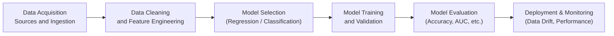

## 14.3 Predictive Analytics, Machine Learning, and AI Fundamentals

Predictive analytics, machine learning (ML), and artificial intelligence (AI) are reshaping the professional landscape for Certified Public Accountants (CPAs). What began as niche research areas for data scientists has now become a mainstream necessity across industries, including accounting, auditing, finance, and advisory services. By integrating advanced analytical techniques, financial professionals can gain data-driven insights into business processes, automate specific routine tasks, uncover material risks in complex data sets, and enhance overall decision-making. This section provides a foundational overview of predictive analytics, ML, and AI, with emphasis on core concepts like classification versus regression and the importance of addressing hidden biases or data drift.

Building on concepts presented in previous chapters—particularly those on data architecture (Chapter 12: Database Structures and Administration) and data integration (Chapter 14: Data Integration and Analytics)—this section guides readers through fundamental definitions, methodologies, and real-world applications specifically relevant to CPAs. We also highlight potential controls, best practices, and ethical concerns to ensure reliable, transparent, and lawful use of these evolving technologies.

------------------------------

### The Importance of Predictive Analytics in Accounting and Assurance

Predictive analytics centers on employing historical data patterns to forecast or estimate future outcomes. CPAs can benefit significantly from these techniques. For example:

• Detecting anomalies in financial transactions or ledger entries.  
• Predicting cash flow shortfalls or budget overruns.  
• Forecasting sales trends and revenue performance for budgeting and auditing.  
• Assessing credit risk or vendor default probabilities in procurement processes.  
• Boosting risk-based auditing by identifying accounts or transactions most prone to misstatement.

Predictive analytics leverages statistical and computational methods to help auditors and finance professionals prioritize resources for the highest areas of risk, streamline business processes, and strengthen internal controls.

------------------------------

### Foundations of Machine Learning (ML)

Machine learning is a subset of AI focused on algorithms that learn from data and refine their outputs over time. Instead of manually programming each decision rule, ML methods identify and adapt to patterns in historical data. ML is broadly classified into:

• Supervised learning – Uses labeled data to learn relationships. For example, training a model to detect fraudulent transactions based on previously labeled fraudulent vs. legitimate records.  
• Unsupervised learning – Finds hidden structures in unlabeled data. For instance, clustering transactions or clients by similarity to pinpoint outlier behavior.  
• Reinforcement learning – Involves an agent that learns optimal actions via rewards and punishments. Though less common in finance and audits, it remains a key area in complex operational optimizations.

------------------------------

### Classification vs. Regression: Two Key Predictive Tasks

Within supervised learning, two of the most common tasks are:

**Classification**  
• Used to assign data into discrete categories (often binary, such as “fraudulent” vs. “legitimate,” or multiple classes, such as “low,” “medium,” “high” risk).  
• Common techniques: Logistic Regression, Decision Trees, Random Forests, Support Vector Machines, and neural networks.  
• Example (Audit): Flagging a suspicious transaction as “potentially fraudulent” based on a threshold probability (e.g., >70% chance of fraud).

**Regression**  
• Used to predict continuous numeric values.  
• Best suited for time-series forecasts (e.g., revenue forecasts, cost projections) or metric predictions (e.g., inventory levels).  
• Common techniques: Linear Regression, ARIMA (AutoRegressive Integrated Moving Average), Gradient Boosting, and neural networks.  
• Example (Finance): Forecasting next quarter’s net revenue using a regression model trained on historical revenues, marketing spend, and seasonal data.

------------------------------

### AI Fundamentals and the Role of Neural Networks

Artificial intelligence is a broader field encompassing systems capable of tasks that normally require human intelligence. Neural networks—loosely inspired by the human brain—are a popular subset of AI algorithms that excel at recognizing complex patterns.

• **Deep Learning:** A family of neural networks with multiple processing layers. These have led to breakthroughs in image recognition and natural language processing. In finance and accounting, deep learning can be used for advanced document analysis, unstructured data classification, or forecasting with very large data sets.  
• **Expert Systems:** AI programs based on predefined rules (“if-then” statements). They were popular in early AI applications like tax advisory or compliance checks. Although powerful, they can be inflexible, requiring constant updates from domain experts.  
• **Hybrid Models:** Some solutions blend rule-based approaches, machine learning algorithms, and deep learning to achieve better results, such as performing initial screening with classification models and then applying a rules-based approach to finalize decisions—useful, for instance, in regulatory compliance reviews.

------------------------------

### Typical Machine Learning Workflow

A standard approach to ML projects, from data gathering to deployment, might look like the following:

1. **Data Acquisition**: Gather relevant data from ERP systems, external economic indicators, or proprietary ledgers.  
2. **Data Cleaning and Feature Engineering**: Deal with missing values, outliers, and transform raw fields (e.g., transaction date/time) into meaningful features (e.g., day-of-week or quarter).  
3. **Model Selection**: Choose algorithms based on the nature of the problem—classification or regression—along with domain constraints like interpretability or computational resources.  
4. **Model Training and Validation**: Split data into training, validation, and test sets to diagnose overfitting. Adjust hyperparameters and ensure the model generalizes well.  
5. **Model Evaluation**: Use performance metrics like accuracy, precision/recall, AUC (Area Under the Curve), RMSE (Root Mean Squared Error), or MAPE (Mean Absolute Percentage Error).  
6. **Deployment and Monitoring**: Implement the model in production to generate new predictions. Track model performance for data drift or concept drift and regularly fine-tune or retrain as necessary.

------------------------------

### Hidden Biases and Ethical Considerations

Although AI and ML present exciting opportunities, they also introduce significant ethical and compliance challenges. Among the most concerning are hidden biases and data drift:

**Hidden Biases**  
• If historical data reflects societal or organizational biases (e.g., certain demographics systematically underrepresented in credit approvals), the model may perpetuate them.  
• Biased features also arise from incomplete data or incorrect labeling.  
• CPAs engaged in IT audits or advisory services should evaluate data collection methods, feature selection, and model outputs for discriminatory patterns.

**Data Drift**  
• As business processes, market conditions, or client behavior evolve, the relationships in the training data may no longer represent the current environment.  
• A model that once accurately predicted certain types of fraud may degrade if criminals adopt new tactics.  
• Continuous monitoring—regularly revalidating the model with recent data—is essential to maintain accuracy and reduce misstatements or missed risks.

**Regulatory and Legal Implications**  
• Several jurisdictions require explainability in ML models, especially for lending, medical diagnostics, or other sensitive areas.  
• Ethical AI frameworks emphasize transparency, accountability, and fairness. Internal audit teams may need to verify that AI vendors or in-house teams comply with relevant regulations (e.g., GDPR in the EU around automated decision-making and personal data usage).  
• The AICPA’s professional standards and guidance on AI usage increasingly highlight the importance of documentation, governance, and internal controls.

------------------------------

### Practical Financial Examples of Predictive Modeling

Incorporating these technologies often involves case-specific scenarios:

• **Accounts Receivable (AR) Collections**: Building a regression model to predict the likelihood of delayed payments. Companies can allocate resources more efficiently by accurately identifying overdue invoices likely to become bad debts.  
• **Audit Risk Assessment**: Classifying transactions or clients into “high-risk” vs. “normal” categories. Auditors can focus their efforts on suspicious items while devoting fewer resources to transactions with a low-risk score.  
• **Fraud Detection**: Neural networks can learn complex transaction patterns, flagging wire transfers that deviate from typical behavior. Over time, the model refines its thresholds and reduces false positives/negatives.  
• **Financial Forecasting**: Time-series deep learning models for quarter-over-quarter or year-over-year revenue predictions, integrating external factors (market indices, consumer sentiment data) and internal metrics (sales pipeline, marketing campaigns).

------------------------------

### Merging Predictive Analytics with Existing Corporate Systems

CPAs are increasingly called upon to evaluate how well these predictive techniques integrate into broader enterprise resource planning (ERP) systems and IT infrastructures (see Chapter 6: Enterprise Resource Planning (ERP) and Accounting Information Systems). Key factors include:

• **Data Quality**: Ensure source systems provide reliable, timely data for modeling.  
• **ITGC (IT General Controls)**: Verify that the environment supporting model deployment adheres to access, change, and operations controls (Chapter 8: IT General Controls).  
• **System Availability**: Confirm business continuity and disaster recovery plans (Chapter 9: System Availability and Business Continuity) cover critical modeling processes.  
• **GDPR, PCI DSS, and Privacy Laws**: Confirm that personally identifiable information (PII) used in predictive models is properly de-identified, encrypted, and stored according to relevant regulations (Chapters 3 and 19).

------------------------------

### Addressing Common Pitfalls

• **Overfitting**: A model that performs exceedingly well on training data but fails in production. Mitigation strategies include cross-validation, regularization, or simpler models.  
• **Lack of Explainability**: Complex models (e.g., deep neural networks) can be opaque. CPAs might require more interpretable or rule-based surrogates, especially for compliance reviews.  
• **Poor Data Governance**: Missing or inconsistent data might compromise the entire modeling process. Ensure robust data governance (Chapter 11: Data Life Cycle and Governance) for consistent results.  
• **Insufficient Change Management**: Without structured procedures (Chapter 10: IT Change Management), re-deploying or updating an existing model can create confusion or errors in the production environment.

------------------------------

### Strategies for Implementing Predictive Analytics in Accounting Workflows

1. **Start Small and Build Momentum**  
   Implement a pilot project—like revenue forecasting or invoice anomaly detection—to demonstrate ROI and gain stakeholder buy-in.

2. **Assemble Cross-Functional Teams**  
   Combine domain expertise (CPAs, auditors) with technical talent (data scientists, IT professionals) to ensure alignment with business goals and regulatory constraints.

3. **Focus on Data Integrity and Security**  
   Strong data integrity is a foundation for successful models. Roles-based access, proper encryption, and thorough logging of data transformations help avoid data quality pitfalls.

4. **Auditability and Transparency**  
   Document the model’s intended use, data sources, assumptions, and evaluations. For auditors, having a clear record fosters trust in the final predictions.

5. **Ongoing Monitoring**  
   ML models degrade over time. Regular performance and drift checks ensure they remain accurate. Incorporate robust feedback loops—e.g., flagged transactions that turn out to be false positives can help refine the model.

------------------------------

### Case Study: Proactive Fraud Detection in a Financial Services Firm

A regional financial services company faced escalating fraud losses. Rather than relying solely on retrospective detection, they introduced a predictive analytics solution to flag inherently risky transactions. Key steps included:

• **Data Collection**: Aggregated historical transaction logs, known fraud instances, and customer profiles from a legacy data warehouse and CRM system.  
• **Choice of Model**: Initially used a gradient boosting classifier due to its balance of accuracy and interpretability.  
• **Evaluation**: Found that the model significantly reduced missed fraud by 30% while keeping false positives at a manageable level.  
• **Governance**: Incorporated daily rechecks to detect data drift, and engaged an independent audit team to verify model fairness and compliance with anti-discrimination guidelines.  
• **Result**: An estimated $3M in annual fraud reduction, plus improved regulatory compliance reporting thanks to robust internal controls and thorough documentation.

------------------------------

### Looking Ahead

As AI and ML continue to evolve, CPAs will benefit from developing competencies in data analytics and forging deeper collaboration with data scientists and IT professionals. Familiarity with analytics-lifecycle best practices and control frameworks—along with an appreciation for explainability and bias prevention—empowers CPAs to guide organizations toward responsible innovation.  

When approached strategically, predictive analytics can enhance an accountant’s effectiveness in assurance, risk detection, financial forecasting, and compliance monitoring. By building on the fundamentals covered here, readers will be well-prepared for more advanced explorations of AI-driven transformations in the finance and accounting profession.

------------------------------

## Mastering Predictive Analytics, ML, and AI: Knowledge Check



### Which predictive technique is most appropriate for estimating a continuous numerical value, such as future quarterly revenue?
- [ ] Classification
- [x] Regression
- [ ] Clustering
- [ ] Reinforcement Learning

> **Explanation:** Estimating a continuous numeric value typically involves regression models (e.g., linear regression) rather than classification models.  

### Which of the following describes the phenomenon where an ML model performs exceptionally on training data but fails to generalize to new data?
- [x] Overfitting
- [ ] Underfitting
- [ ] Model Bias
- [ ] Data Drift

> **Explanation:** Overfitting is when the model learns specifics and noise for the training set to the detriment of broader applicability.  

### Which of the following is a valid reason to monitor an ML model’s performance in production over time?
- [x] Data drift
- [ ] There is no need for ongoing monitoring if the model performed well at rollout
- [ ] Model interpretability rarely changes after deployment
- [ ] Regulation changes have no effect on model performance

> **Explanation:** Data drift occurs when real-world data evolves, causing the model’s predictions to degrade, making ongoing monitoring essential.  

### What is an example of a classification problem in accounting and financial analytics?
- [x] Flagging transactions as either “potentially fraudulent” or “legitimate”
- [ ] Forecasting revenue for next quarter
- [ ] Estimating a real estate property’s numerical appraisal value
- [ ] Calculating correlation between two numeric variables

> **Explanation:** Classifying transactions into categories (e.g., possible fraud vs. normal) is a typical classification problem.  

### Which of the following best defines the term “hidden bias” in the context of machine learning?
- [x] Situations where historical or training data unintentionally perpetuates prejudices or skewed outcomes
- [ ] A known, intentional adjustment to the model to improve prediction
- [ ] The incomplete of data that leads to missing features in the model
- [ ] Systemic differences in the hardware environment used for training

> **Explanation:** Hidden biases often arise from skewed or unintentionally biased data and can lead to unfair or inaccurate predictions.  

### Which of the following is a key difference between classification and regression in the predictive analytics context?
- [x] Classification predicts discrete labels, while regression predicts continuous numeric values.
- [ ] Classification only applies in tax calculations, whereas regression is used for auditing.
- [ ] Classification focuses on unsupervised data, whereas regression is purely rule-based.
- [ ] Classification cannot involve machine learning, whereas regression always does.

> **Explanation:** Classification and regression are distinct tasks: classification for discrete outcomes, regression for continuous outcomes.  

### Which method is best suited for grouping data points when no labeled dataset exists to train a model?
- [ ] Regression
- [x] Clustering (Unsupervised Learning)
- [ ] Classification
- [ ] Reinforcement Learning

> **Explanation:** Clustering is a classic unsupervised learning approach that groups unlabeled data into distinct categories or clusters.  

### Which statement best describes a neural network used in AI?
- [x] A computational model inspired by the human brain’s interconnected neurons
- [ ] A purely symbolic system of if-then rules known as an expert system
- [ ] A type of encryption algorithm for data security
- [ ] An older technology no longer relevant to modern predictive analytics

> **Explanation:** Neural networks mimic the structure and function of the brain’s neurons, making them powerful for many predictive and pattern-recognition tasks.  

### Which aspect of an ML model’s performance measures how accurately it returns positive findings when those positives are indeed correct?
- [x] Precision
- [ ] Recall
- [ ] F-Score
- [ ] Specificity

> **Explanation:** Precision relates to the proportion of model-flagged positives that are true positives, indicating the model’s accuracy among predicted positives.  

### True or False: Regularly retraining and recalibrating a model over time helps mitigate issues related to data drift.
- [x] True
- [ ] False

> **Explanation:** As real-world data changes, regularly retraining or recalibrating the model ensures that its predictions remain accurate and relevant.  



---

## For Additional Practice and Deeper Preparation

### [Information Systems and Controls (ISC)](https://www.udemy.com/course/isc-cpa-mock-exams/?referralCode=E1217303222935C5E464)

**Information Systems and Controls (ISC) CPA Mocks:** 6 Full (1,500 Qs), Harder Than Real! In-Depth & Clear. Crush With Confidence!

- Tackle full-length mock exams designed to mirror real ISC questions.  
- Refine your exam-day strategies with detailed, step-by-step solutions for every scenario.  
- Explore in-depth rationales that reinforce higher-level concepts, giving you an edge on test day.  
- Boost confidence and minimize anxiety by mastering every corner of the ISC blueprint.  
- Perfect for those seeking exceptionally hard mocks and real-world readiness.  

_Disclaimer: This course is not endorsed by or affiliated with the AICPA, NASBA, or any official CPA Examination authority. All content is for educational and preparatory purposes only._
