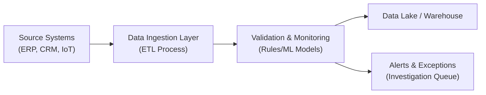
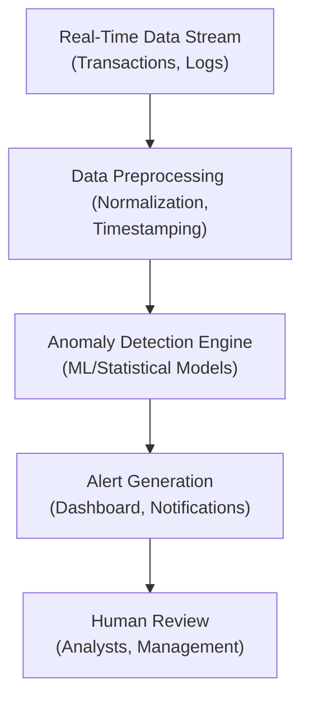

## 14.4 Identifying Control Risks in Data Analytics and Continuous Monitoring

Data analytics and continuous monitoring have become indispensable tools for organizations striving to maintain strong internal controls, comply with regulatory expectations, and enhance operational efficiency. As discussed in earlier sections of this book, the integration of data analytics with core financial processes can transform the way CPAs identify, evaluate, and respond to risks. However, the increased reliance on data-driven insights means that organizations must remain vigilant about the integrity, completeness, and accuracy of the underlying datasets. This section explores the most common control risks arising in data analytics and continuous monitoring, along with strategies to prevent, detect, and remediate these risks. Real-world scenarios, diagrams, and practical examples illustrate how advanced monitoring can help detect anomalies in real time, minimizing the impact of data issues on crucial business decisions.

### Understanding the Intersection of Data Analytics and Controls

Organizations that deploy data analytics solutions often focus on gathering large volumes of data from various systems—Enterprise Resource Planning (ERP) modules, third-party applications, and IoT devices—without fully considering the governance and control implications. Whenever data is aggregated, transformed, and analyzed, there are inherent risks such as:

• Data quality issues (e.g., incomplete or incorrect data)  
• Unauthorized or inappropriate system access  
• Over-reliance on automated tools without robust validation  
• Fragmented data sources with inconsistent formatting  

When these problems remain undetected, they can lead to erroneous conclusions, improper financial reporting, and unwanted regulatory consequences. Continuous monitoring—often enabled by machine learning and automated analytics—seeks to mitigate these challenges by providing real-time visibility into data flows and transactions. This proactive approach enables auditors and IT control personnel to detect problems as they arise and take swift remedial action.

### Common Control Risks in Data Analytics

It is essential to recognize that data analytics risks are not purely technical issues. They can manifest due to governance failures, procedural oversight, or a combination of both. Outlined below are some of the most commonly encountered risks:

• Data Completeness Risk: Missing records or incomplete input data can undermine the accuracy of any analytics process. When essential customer or vendor data is absent, business processes like credit analysis or procurement assessments may yield biased or misleading conclusions.

• Data Accuracy Risk: Erroneous data fields, transcription errors, or replicated data can dilute insights and distort key metrics. Even small inaccuracies, such as an off-by-one error in an inventory quantity, can cascade into large-scale mistakes in enterprise-wide analytics.

• Integrity of Data Definitions: Data elements may be inconsistently or ambiguously defined in different subsystems, leading to confusion or misinterpretation. For instance, “net sales” might be computed differently in an e-commerce application versus an ERP general ledger module.

• Unauthorized Data Access: Without robust access controls, individuals could intentionally or inadvertently alter, delete, or leak critical data. These breaches threaten not only the accuracy of analytics but also the organization’s ethical and regulatory compliance posture.

• Lack of Data Timeliness: Delays in data ingestion or updates can produce outdated analytics results, effectively hindering real-time decision-making. This risk is especially pronounced in high-frequency trading environments, supply chain optimization, and large-scale e-commerce platforms.

• Overreliance on Automated Models: Machine learning (ML) and artificial intelligence (AI) solutions offer efficiency gains but can become “black boxes” if not carefully monitored. Undetected training biases or data drifts can create significant control exposures, leading to inaccurate findings or discriminatory outcomes.

### Potential Impact of Incomplete or Inaccurate Data

Incomplete or inaccurate data can lead to serious repercussions for organizational decision-making and compliance. Although these errors may initially appear small or localized, they can cause systemic control failures if left unaddressed. Some examples include:

• Financial Statement Misstatements: If transactional data is not properly recorded or aggregated, the organization risks misstating revenue, expense, or asset balances, which may result in qualified opinions from auditors or regulatory penalties.

• Operational Interruptions: Anomalous data—perhaps from a glitch in device sensors—can trigger false alerts or disable entire systems (such as shutting down a production line). Over time, these interruptions can erode trust in automated processes and negatively impact performance.

• Reputational Damage: Customers, suppliers, and regulators may lose confidence in an organization that appears unable to handle its data responsibly. This damage can be particularly severe in industries handling sensitive data, such as healthcare (HIPAA) or financial services (GLBA).

• Noncompliance with Regulations: Regulators increasingly demand robust data integrity and real-time monitoring. Incomplete or inaccurate data processes can place organizations in violation of statutes such as GDPR, PCI DSS, or SOX. This noncompliance may result in costly fines and legal consequences.

### Real-World Example: Incomplete Data in Vendor Payments

Imagine a mid-sized manufacturing firm that wants to centralize vendor payment analytics across multiple geographic locations. Each location uses a slightly different ERP configuration to store vendor details and invoice data. When the organization’s headquarters runs consolidated analytics, they detect that approximately 10% of vendor invoices are missing timely payment records. 

This partial coverage not only distorts liquidity projections but also triggers confusion and friction with vendors. Delayed vendor payments require the company to pay late fees, while vendors become apprehensive about the organization’s ability to manage its obligations. In this scenario, incomplete data directly impacts the financial performance, vendor relationships, and management’s ability to forecast cash flow accurately.

### Advanced Monitoring Principles for Continuous Assurance

Continuous monitoring encompasses tools and processes that collect, evaluate, and correlate data in near real time to detect anomalies and control weaknesses. The objective is to serve as an “always-on” analysis engine, enabling management and auditors to capture emergent risks before they escalate. Key principles of an effective continuous monitoring program include:

• Define a Threshold for Alerts: Establish tolerance levels (e.g., threshold percentages for data anomalies or transaction volume variances) that will trigger alerts. Setting overly strict thresholds can overwhelm staff with false positives, whereas overly lenient thresholds may allow real issues to remain undetected.

• Automate Data Validation Checks: Leverage scripts, rules-based engines, or ML algorithms to continuously verify the quality, format, and integrity of incoming data. These validation checks might compare data fields across subsystems, recalculate aggregates in real time, or look for missing or out-of-range values.

• Integrate with Logging and Event Management: Feed application and network logs into a central Security Information and Event Management (SIEM) system to detect unauthorized accesses or suspicious system behaviors in real time. This also supports incident response and forensic investigations (see Chapter 20 on Incident Response and Recovery).

• Robust Exception Management Workflow: Develop a structured process for investigating anomalies detected by the continuous monitoring systems. This workflow should involve relevant stakeholders (e.g., finance, IT, compliance) and maintain a clear audit trail to document findings and remediation actions.

• Periodic Review and Calibration: Continuous monitoring tools must be reviewed and refined on a regular basis, particularly when organizational processes, data sources, or business models undergo significant changes.

### Diagram: Data Validation and Monitoring Workflow

Below is an illustrative Mermaid.js diagram that demonstrates how data flows through validation and monitoring layers. This example depicts a simplified system where data is captured from multiple sources (e.g., transactional systems or IoT devices), validated, and then stored or flagged for investigation.

• Source Systems: ERPs, CRM platforms, sensors, and IoT devices.  
• Data Ingestion Layer: An ETL (Extract, Transform, Load) pipeline that unifies data into a standardized schema.  
• Validation & Monitoring: Scripts and ML models that check data completeness and accuracy, raising alerts when anomalies are detected.  
• Data Lake / Warehouse: Repository for cleansed and validated data used in analytics.  
• Alerts & Exceptions: Flagged entries requiring manual or automated investigation.

### How Advanced Monitoring Detects Real-Time Anomalies

Modern continuous monitoring solutions often apply patterns, thresholds, and algorithmic models to discover anomalies in vast datasets—far beyond what a manual review could accomplish. Common techniques include:

• Statistical Analysis: Identifying outliers by comparing real-time data to historical norms or standard deviations. For example, an extreme spike in employee expense claims within a particular department could indicate potential fraud or data entry errors.

• Machine Learning Anomaly Detection: Algorithms like Isolation Forest, One-Class SVM, or autoencoders learn normal patterns in transactional data and flag divergences. As new data points feed into the model, it dynamically recalibrates its understanding of “normal.” This approach is especially useful when large volumes of data must be monitored continuously.

• Time-Series Forecasting: Monitoring system logs, sales transactions, or manufacturing sensor readings for significant deviations from predicted trends. Real-time forecasting can highlight performance bottlenecks or quality control issues in near real time.

• Pattern Matching and Rule Engines: Many operational scenarios can be captured by established rules. For instance, a rule-based system could raise an alert whenever a new vendor is created and approved by the same user, circumventing separation of duties protocols.

### Real-World Example: Detecting Anomalies in Sales Transactions

A multinational retailer that processes hundreds of thousands of transactions every hour employs a real-time continuous monitoring tool. This system analyzes each transaction, comparing it to historical sales patterns in a particular store or region. One afternoon, the system flags that several stores in one region are prematurely marking transactions as “returned” without an accompanying refund entry. On closer inspection, management finds a software glitch in the POS system that is not correctly tracking subsequent refund actions. This glitch could have led to overstated sales returns and compromised the integrity of daily financial statements.

By identifying these erroneous “returns” within minutes, the company’s finance and IT teams collaborate to issue a patch on the same day. Early detection and swift correction prevent significant cumulative inaccuracies in monthly reports and preserve the reliability of financial data.

### Data Structuring Risks in Continuous Monitoring

Proper structuring of real-time data streams is critical for effective continuous monitoring. If data streams are poorly defined or not aligned with master data management protocols (see Chapter 11 on Data Life Cycle and Governance), anomalies may be missed or mis-categorized. Consider the following structuring risks:

• Metadata Mismatch: When descriptive information (metadata) is missing or inconsistent, it’s more difficult to correlate data across different sources accurately.  
• Improper Date/Time Stamps: Discrepancies in time zones or inaccurate timestamping can hamper real-time synchronization and hamper root cause analysis.  
• Overaggregation or Underaggregation: Excessive summarization may hide relevant details, while insufficient aggregation can generate “noise” and spurious alerts.  

A robust continuous monitoring solution should harmonize these structures to ensure that data is standardized before analysis, enabling consistent comparisons over time.

### Diagram: Real-Time Anomaly Detection with Continuous Monitoring

The next Mermaid.js diagram illustrates a high-level workflow for real-time anomaly detection where data is fed from operational systems to anomaly detection engines, and any deviations from normal patterns are escalated to analysts or management.

• Real-Time Data Stream: Data flows derived from operational systems, IoT sensors, or online customer transactions.  
• Data Preprocessing: Conversion to consistent formats, alignment of timestamps, and elimination of duplicate records.  
• Anomaly Detection Engine: Using ML/statistical techniques to identify deviations from typical patterns.  
• Alert Generation: The system automatically pushes notifications or dashboards.  
• Human Review: Analysts evaluate alerts and determine corrective actions.

### Mitigating Control Risks: Best Practices

Organizations can adopt the following best practices to mitigate control risks in data analytics and continuous monitoring:

• Establish Clear Governance and Ownership: Designate business or IT owners for data quality and continuous monitoring initiatives to ensure accountability.  

• Implement Data Quality Metrics: Maintain defined metrics (e.g., completeness ratio, accuracy rate) and track them over time to measure improvements or emerging issues.  

• Utilize Automated Data Validation: Build rules that cross-verify various data points (e.g., checking total invoice amounts against itemized entries) in near real time.  

• Enforce Robust Access Management: Align with principles from Chapter 18 (Authentication and Access Management) to restrict entry points to continuous monitoring tools.  

• Perform Regular Reconciliations: Reconcile analytics results with independent data or financial statements to confirm accuracy and completeness.  

• Engage in Ongoing Education: Provide targeted training for staff on data analytics, anomaly detection tools, and the basics of data governance. A well-informed workforce can serve as the first line of defense against data mishaps.  

### Practical Case Study: Proactive Anomaly Detection in Accounts Receivable

A global manufacturing company experiences frequent challenges reconciling accounts receivable (A/R) data across multiple subsidiaries. In particular, some invoices are occasionally double-counted when the local subsidiary merges partial payments with the original invoice incorrectly.

After implementing a continuous monitoring solution with real-time anomaly detection, whenever an invoice shows a 50% payment that is later combined with a full payment from a different date, the system highlights this as a potential duplication. Alerts are immediately triggered, and the finance team investigates the cause. Over time, the organization refines its data ingestion processes and reduces misposted entries by over 80%. This leads to stronger control over A/R, more accurate daily cash flow visibility, and improved working capital management.

### Handling False Positives and Ensuring Process Efficiency

Even the most effective anomaly detection and monitoring systems can generate false positives—alerts for events that do not signify genuine errors or fraud. A high volume of false positives can desensitize users, causing them to ignore or neglect legitimate warnings. To reduce alert fatigue while maintaining vigilance:

• Continually Refine Thresholds: Adjust tolerance levels based on historical data and incident metrics.  
• Employ Escalation Protocols: Prioritize critical alerts (e.g., potential fraud or material misstatement) for immediate management review.  
• Use Contextual Filters: Enhance manual investigation tools with additional data or context so that analysts can confirm an alert’s significance quickly.  
• Collaborate with Business Units: Solicit feedback from functional experts to validate anomalies flagged by the system.  

Developing a robust feedback loop between auditors, data scientists, and end-users ensures that your continuous monitoring environment remains both effective and efficient over the long run.

### Recommendations for Implementation

1. Start with High-Risk Areas  
   Focus on processes where data integrity is essential, such as revenue recognition, treasury, or regulatory reporting.

2. Define Clear Objectives  
   Align continuous monitoring projects with specific goals, such as minimizing financial reporting misstatements or detecting procurement fraud.

3. Balance Automation and Human Oversight  
   Automated anomaly detection can highlight red flags, but experienced professionals should evaluate flagged transactions or patterns to determine the underlying cause.

4. Foster a Culture of Data Stewardship  
   Reinforce the message that data quality is an organizational priority. Encourage users to report issues promptly and reward employees who proactively identify data anomalies.

### References for Further Exploration

• AICPA Audit Data Analytics Guide: Offers broad guidance on integrating data analytics into the financial statement audit process.  
• ISACA’s COBIT 2019 Framework: Provides IT governance structures relevant to implementing continuous monitoring.  
• NIST Special Publication 800-137: Offers insights into information security continuous monitoring (ISCM).

Use these references to expand your understanding of current best practices and theoretical underpinnings related to data analytics and continuous monitoring.

---

## Quiz on Identifying Control Risks in Data Analytics and Continuous Monitoring



### Which of the following best describes a key purpose of continuous monitoring in data analytics?
- [ ] Eliminating the need for manual audits altogether
- [x] Detecting anomalies in data flows in real time
- [ ] Reducing the total volume of transactional data
- [ ] Preventing all forms of regulatory compliance issues by default

> **Explanation:** Continuous monitoring focuses on identifying unusual patterns or control breaches as they occur, so organizations can mitigate risks quickly, rather than eliminating manual audits altogether.

### When data is incomplete or inaccurate, which of the following is a likely result?
- [ ] Reduced vendor payment cycles
- [x] Misstatements in financial or operational reporting
- [ ] Elimination of the need for disclaimers
- [ ] Automatic compliance with major regulations

> **Explanation:** Incomplete or inaccurate data puts the entity at risk of reporting errors and potentially undermines the reliability of any metrics informed by that data.

### What is an example of a data accuracy issue in analytics?
- [ ] An excessive number of routine transactions
- [ ] Lack of a centralized SIEM tool
- [x] Duplicate records that distort key metrics
- [ ] Using both machine learning and manual processes

> **Explanation:** Accuracy issues arise when the data itself is flawed—duplicate or conflicting entries can easily skew calculated metrics or lead to erroneous decisions.

### How does anomaly detection using machine learning typically work?
- [x] By recognizing typical patterns and flagging significant deviations
- [ ] By automatically reconciling eradicated data points
- [ ] By removing historical data altogether to avoid bias
- [ ] By restricting valid transactions to a single threshold

> **Explanation:** ML-based anomaly detection learns baseline behavior and flags data points or transactions that vary significantly from normal patterns.

### Why should organizations be cautious with extremely strict anomaly detection thresholds?
- [ ] They risk missing actual anomalies.
- [x] They may trigger a high volume of false positives.
- [ ] They become legally binding thresholds.
- [ ] They reduce the accuracy of manual transactions.

> **Explanation:** Excessively strict thresholds can overwhelm the team with alerts that turn out to be harmless variations, leading to “alert fatigue.”

### What is the primary advantage of using real-time data preprocessing before feeding it into an anomaly detection engine?
- [x] Ensuring data is normalized and timestamped for accurate comparisons
- [ ] Preventing any new data from entering the data lake
- [ ] Eliminating human oversight in data analysis
- [ ] Restricting user access to the entire system

> **Explanation:** Real-time preprocessing helps cleanse and standardize data, making it more comparable across different time frames and systems. This accuracy is crucial for reliable anomaly detection.

### Which of the following best describes “overaggregation” in data analytics?
- [x] Summarizing data to a level that hides significant trends or anomalies
- [ ] Breaking down data into too many detailed segments
- [ ] Using disparate data sources to confirm anomalies
- [ ] Configuring a system to capture data continuously

> **Explanation:** Overaggregation can obscure meaningful insights by lumping detailed transactions into overly broad summaries, potentially missing important anomalies.

### Why is it important to calibrate ML-based continuous monitoring systems periodically?
- [ ] To give all employees enough time for manual spot checks
- [ ] Because the systems might turn themselves off
- [x] Patterns in data may evolve, requiring updated baselines
- [ ] Next-day reconciliations are no longer needed

> **Explanation:** Organizations and data streams change. Over time, what was once anomalous might become normal, requiring ML models and thresholds to be recalibrated.

### What is a key outcome of implementing an effective exception management workflow for anomalies?
- [ ] Anomalies are automatically fixed without human intervention.
- [ ] All user access privileges revert to default settings.
- [x] Clear ownership of investigations and a traceable audit trail
- [ ] Continuous generation of new anomalies each day

> **Explanation:** An exception management workflow ensures each anomaly is reviewed by the right stakeholders, documented properly, and resolved or escalated as needed.

### True or False: An continuously monitored environment eliminates the risk of inaccurate data altogether.
- [x] True
- [ ] False

> **Explanation:** This statement is actually false. While continuous monitoring can greatly reduce the risk of inaccurate data going undetected, it cannot entirely eliminate the possibility of errors or unique anomalies. Human oversight and proper governance remain crucial.



---

## For Additional Practice and Deeper Preparation

### [Information Systems and Controls (ISC)](https://www.udemy.com/course/isc-cpa-mock-exams/?referralCode=E1217303222935C5E464)

**Information Systems and Controls (ISC) CPA Mocks:** 6 Full (1,500 Qs), Harder Than Real! In-Depth & Clear. Crush With Confidence!

- Tackle full-length mock exams designed to mirror real ISC questions.  
- Refine your exam-day strategies with detailed, step-by-step solutions for every scenario.  
- Explore in-depth rationales that reinforce higher-level concepts, giving you an edge on test day.  
- Boost confidence and minimize anxiety by mastering every corner of the ISC blueprint.  
- Perfect for those seeking exceptionally hard mocks and real-world readiness.

_Disclaimer: This course is not endorsed by or affiliated with the AICPA, NASBA, or any official CPA Examination authority. All content is for educational and preparatory purposes only._
