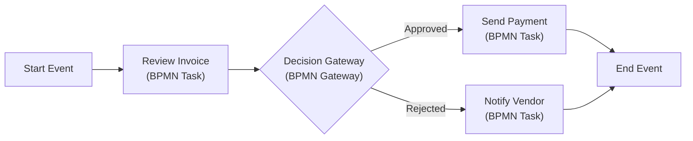

## 15.1 BPMN (Business Process Model and Notation) Use Cases

Business Process Model and Notation (BPMN) is a standardized graphical language designed to model and map out business processes in a clear, intuitive manner. For CPAs and business professionals working in auditing and advisory services, BPMN helps illuminate the flow of information, tasks, and decision points, ultimately leading to better governance, streamlined operations, and improved risk management. In this section, we will explore the fundamentals of BPMN syntax, demonstrate how to apply BPMN to typical accounting and finance use cases, and present strategies for integrating BPMN into larger risk-based frameworks and continuous improvement initiatives.

Effective BPMN implementations can enhance the transparency of key processes—including accounts payable (A/P), accounts receivable (A/R), payroll, financial close, and compliance obligations—providing a powerful tool for internal control evaluations. By visualizing end-to-end workflows, CPAs can pinpoint redundant steps, identify control gaps, and develop improvement roadmaps. This chapter also serves as a bridge to other discussions in this book, such as core transaction cycles (Chapter 7) and IT General Controls (Chapter 8), by illustrating how BPMN models clarify the underlying process mechanics that drive key financial and operational outcomes.

--------------------------------------------------------------------------------

### The Importance of BPMN for CPAs

BPMN (currently at version 2.0 as defined by the Object Management Group) has consistently gained traction among financial and operational auditors for several reasons:
• Clear process visualizations help you see where data flows and how tasks fit together.  
• Standardized notation is recognized across industries, increasing collaboration among IT, finance, and compliance teams.  
• BPMN diagrams can demonstrate how controls are implemented at each step and where potential risks might arise.  
• The notation system supports procedural detail, event triggers, parallel flows, and complex decision logic—elements that commonly occur in financial applications such as payment approvals, payroll processing, and supply chain transactions.  

In the CPA landscape, BPMN can fulfill these multidisciplinary needs:
• Auditing and Assurance: Creating standardized process flows for inventory valuation, revenue recognition, or even third-party collaboration in an IT environment.  
• Advisory Services: Helping clients streamline workflows by identifying inefficiencies, manual interventions, and overlapping tasks through a structured approach.  
• SOC Engagements: Communicating critical processes in SOC 1® or SOC 2® engagements (see Chapters 23 and 24) in a visually consistent format, allowing service organizations and user entities to better understand dependencies and responsibilities.  

--------------------------------------------------------------------------------

### Fundamental BPMN Syntax

Though BPMN can represent sophisticated workflows, the core elements of BPMN are straightforward. The following are essential constructs that CPAs should be familiar with:

• Events:  
  – **Start Event** (depicted as a circle with a thin border) indicates where a process begins.  
  – **Intermediate Event** (a circle with a double border) represents something that occurs between start and end events. These can be triggers like a message, timer, or conditional flow.  
  – **End Event** (a thick-bordered circle) signifies the end of a process flow.  

• Activities (Tasks and Subprocesses): Represent work performed as part of a process.  
  – **Task** (rounded rectangle) is an atomic activity within the process. For example, “Authorize Payment.”  
  – **Subprocess** (rounded rectangle with a plus sign) is a larger grouping of tasks that can be expanded or collapsed.  

• Gateways:  
  – **Exclusive Gateway** (diamond shape, often with an X marker) splits or merges process flows, ensuring only one path is taken.  
  – **Parallel Gateway** (diamond shape with a plus sign) allows multiple processes to occur simultaneously.  
  – **Event-Based Gateway** triggers a path based on an incoming event (e.g., receiving an invoice vs. a credit memo).  

• Pools and Lanes:  
  – **Pools** represent distinct organizational entities or participants in a process, such as a company or an external vendor.  
  – **Lanes** subdivide a pool into roles or departments, such as “Accounting Department” vs. “Purchasing Department.”  

• Data Objects and Artifacts:  
  – **Data Objects** visually indicate documents or information used or produced by an activity (e.g., an invoice or purchase order).  
  – **Annotations** add explanatory text or commentary within a process.  

These elements allow BPMN to capture important aspects of processes at a level of detail suited for auditing and IT control evaluations. By showing each participant, flow, decision point, and data interaction, BPMN ensures that every stakeholder, from internal auditors to CFOs, has a shared understanding of how the process operates.

--------------------------------------------------------------------------------

### Typical Use Cases in Finance and Accounting

1. **Purchase-to-Pay (P2P) Process**  
   The P2P cycle typically involves requisitioning, approval, ordering, receipt of goods or services, and final payment. BPMN diagrams reveal the movement of invoices between departments and highlight manual tasks (e.g., scanning invoice PDF documents) that might threaten data integrity or delay approvals.

2. **Order-to-Cash (O2C) Process**  
   The O2C cycle comprises sales order creation, credit checks, invoicing, revenue recognition, and cash collection. BPMN’s gateways help delineate credit approval thresholds and route orders accordingly (e.g., typical credit limit vs. large orders requiring additional review).

3. **Month-End Close**  
   Accounting professionals can use BPMN to map enforceable checkpoints in the month-end closing process—collecting final adjustments, reconciling bank statements, resolving suspense accounts, verifying journal entries, and generating financial statements. Gateways identify tasks that cannot proceed until certain reconciliations are approved.

4. **Payroll Processing**  
   BPMN models in payroll might show the interaction between HR systems (for timesheets), the finance department (for payroll disbursement), and external third parties (e.g., tax authorities). Including data objects clarifies tax forms, payroll slips, and authorization documents that must be accurately exchanged.

5. **Financial Reporting and Compliance**  
   By mapping compliance processes (like Sarbanes-Oxley or anti-money laundering checks) in BPMN, CPAs can see control points, responsible roles, and escalation triggers all in one model. Flow-based visuals facilitate risk assessment and clarify readiness for audits.

By capturing these processes visually, organizations can systematically identify cost bottlenecks and control lapses, forming the foundation for continuous improvement.	

--------------------------------------------------------------------------------

### Demonstration of a BPMN Diagram: Invoice Approval Use Case

Below is a simplified example of a BPMN diagram modeled using Mermaid syntax. Although BPMN and Mermaid flowcharts differ slightly in visual representation, the flowchart effectively represents the same concept, enabling you to see how core BPMN elements can be depicted for an invoice approval process.

**How to Read This Diagram**  
• **Start Event (A)**: The trigger for the invoice approval process may be the receipt of a new invoice from a vendor or an internal request for payment.  
• **Task (B)**: The “Review Invoice” task involves validating invoice details (matching PO numbers, verifying amounts, etc.).  
• **Gateway (C)**: An exclusive decision gateway checks if the invoice is valid, free of errors, and authorized under spending limits.  
• **Approved Path (C → D)**: If approved, the next task is “Send Payment,” which might involve issuing an automated bank transfer or paying by check.  
• **Rejected Path (C → E)**: If rejected, the entity might generate an automatic rejection notice or escalate to a more senior authority.  
• **End Event (F)**: The process concludes either with a successful payment or a formal rejection/notification to the vendor.  

In a full BPMN 2.0 diagram, you would see more nuanced events, data references (e.g., the invoice document as a data object), and possibly multiple lanes for “Accounts Payable Clerk,” “Accounting Manager,” and “Vendor” or “Purchasing Department.” Additional intermediate events, like a timer event for late payment reminders or a message event for vendor queries, might also be included.

--------------------------------------------------------------------------------

### Expanding the Diagram: Pools, Lanes, and Subprocesses

One of BPMN’s strengths is that it accommodates highly complex workflows through pools, lanes, and subprocesses:

• **Pools**: If you want to depict how an external vendor interacts with your organization, you can create two pools: “Vendor” and “Your Company.” Arrows or “message flows” between these pools show how documents, invoices, or requests pass back and forth.

• **Lanes**: Inside your company’s pool, you can break down the roles (e.g., accounts payable, purchasing, treasury) or positions (e.g., “AP Clerk,” “AP Manager,” “CFO”) into lanes, clarifying responsibilities.

• **Subprocesses**: If some part of the invoice approval process, such as exception handling or auditing, warrants additional detail, you can create a subprocess that, when collapsed, appears as a single shape (a rectangle with a plus sign). When expanded, it reveals a more detailed BPMN flow for that subprocess alone.

By harnessing these elements, you create a comprehensive depiction that helps everyone involved—from junior accountants to external auditors—understand how data flows, who is responsible, and which controls are in place at each step.

--------------------------------------------------------------------------------

### Best Practices in BPMN Modeling for CPA Engagements

1. **Define the Scope Clearly**  
   Before creating a BPMN diagram, clarify the boundaries of the process. Are you only focusing on invoice approval? Or do you also want to incorporate the vendor onboarding process? A well-defined scope keeps diagrams manageable.

2. **Identify All Relevant Stakeholders and Roles**  
   Work with process owners, IT, compliance teams, and finance teams to ensure that lanes and pools accurately reflect real organizational structures.  
   
3. **Start with a High-Level View**  
   Begin with broad tasks and major decision gateways. Detailed tasks can be added later as subprocesses or extended tasks if needed.

4. **Align BPMN with Control Objectives**  
   Integrate control activities explicitly into tasks in the diagram. For instance, designate a lane for “Control Owner” or add annotation to highlight key controls that mitigate financial reporting risks.

5. **Utilize Consistent Notation and Labeling**  
   BPMN relies heavily on recognizable shapes and symbols. Label tasks, events, and data flows clearly so auditors and other stakeholders can interpret them with minimal confusion.

6. **Validate the Model with Actual Users**  
   Engage employees who execute or oversee the process daily. They can identify missing tasks, confirm timing, and refine gateways.

7. **Iterate and Refine**  
   BPMN models are living documents. Use them to highlight progress, incorporate system changes, and ensure continuous improvement.

8. **Keep Visuals Readable**  
   If diagrams become too busy, use subprocesses or additional diagrams. Overcrowding can make BPMN less accessible and defeat its purpose of providing clarity.

--------------------------------------------------------------------------------

### Common Pitfalls and Mitigation

• **Overcomplicating the Diagram**: Trying to capture every single detail in one diagram can overwhelm viewers. Use hierarchical subprocesses or multiple BPMN diagrams at different levels of granularity.

• **Unclear Naming Conventions**: Ambiguous activity labels, such as “Process Data,” can be confusing. Instead, prefer “Calculate Sales Tax” or “Reconcile Bank Statement.”  

• **Neglected Gateways**: Missing or incorrectly implemented gateways can lead to “orphans” in the diagram, where a path is never completed. Always ensure each outgoing path returns to the main flow or is intentionally ended.

• **Omitting Key Data Elements**: Data objects like invoices, purchase orders, or batch files are often critical to understanding an accounting process flow. Their omission can reduce the diagram’s value in control evaluations.

• **No Validation with Real-World Users**: CPAs can inadvertently construct a “wishful process” that does not reflect reality. Always validate BPMN diagrams with the actual staff who execute the tasks.

--------------------------------------------------------------------------------

### Leveraging BPMN for Continuous Improvement and Analytics

Once a BPMN diagram is validated and complete, CPAs and management can leverage it to drive several initiatives:

• **Process Mining and Analytics**: Tools can extract log data from ERP or accounting systems to confirm if actual process executions match the BPMN model. Discrepancies can reveal compliance issues or opportunities for automation.

• **Risk and Control Matrices**: By overlaying BPMN diagrams with control objectives, organizations can quickly see coverage for each risk or identify missing controls.  

• **Robotic Process Automation (RPA)**: A well-documented BPMN model can help identify tasks suitable for automation, such as data entry or repetitive calculations (see Chapter 6 for more on RPA).

• **Training and Onboarding**: BPMN diagrams serve as an excellent training tool for new employees, ensuring they understand not just their individual function but also the broader organizational context.

• **Scenario Modeling**: Companies can create “as-is” and “to-be” BPMN diagrams to compare current processes versus proposed improvements, or to test changes to IT systems before incurring large-scale costs.

--------------------------------------------------------------------------------

### Future Developments in BPMN

As organizations adopt advanced data analytics, artificial intelligence (AI), and agile methods, BPMN remains highly adaptable:

• **Integration with Agile/DevOps**: BPMN can align with DevOps pipelines by illustrating how IT deployments flow from development to quality assurance to production, thereby bridging process modeling with IT change management (Chapter 10).

• **Incorporating Real-Time Data**: An evolving area of BPMN usage is real-time monitoring, where events in the diagram reflect system triggers or IoT (Internet of Things) signals, providing near-real-time insight for auditing and compliance.

• **Extended Collaboration Platforms**: Cloud-based BPMN solutions allow teams in different geographies to co-author and update process flows in real time, fostering a culture of continuous improvement.

• **BPMN for ESG Reporting**: As Environmental, Social, and Governance considerations (Chapter 30) become increasingly important, BPMN can assist in modeling sustainable processes, from carbon tracking to ethical data handling.

--------------------------------------------------------------------------------

### Conclusion

BPMN stands out as a standardized, flexible, and collaborative tool to visualize, analyze, and optimize critical business processes. For CPAs, leveraging BPMN offers distinct advantages in recognizing control points, evaluating risks, and streamlining workflows related to finance, operations, and compliance. By adhering to best practices—scoping effectively, maintaining clarity through lanes and pools, and integrating feedback from frontline users—CPAs can transform “as-is” processes into efficient, well-controlled systems.

Whether you are planning an internal audit, designing a new accounting process in your ERP, or undertaking a major transformation initiative at a client, BPMN provides an essential blueprint for success. As the complexities of digital transformation grow, so too does the value of accurate, standardized process notation. With BPMN as part of your professional toolkit, you are better equipped to ensure that your organization’s financial and IT systems align with strategic objectives, robust governance, and regulatory requirements.

--------------------------------------------------------------------------------

## Evaluate Your BPMN Mastery: A Business Process Modeling & Notation Quiz



### Which BPMN construct typically indicates the start of a process flow?

- [ ] Gateway
- [ ] Lane
- [x] Start Event
- [ ] Intermediate Event

> **Explanation:** A Start Event, usually depicted as a circle with a thin border, marks the beginning of a BPMN process. Gateways, lanes, and intermediate events all occur after the initial start.

### What is the primary purpose of pools in BPMN models?

- [x] To represent distinct participants or organizations in a single collaborative process.
- [ ] To show decision logic alignment.
- [ ] To display optional tasks or events.
- [ ] To show concurrency among tasks.

> **Explanation:** Pools in BPMN separate different participants and organizations, such as a company and its vendor. They are useful in clarifying boundaries and responsibilities.

### Why are gateways important in BPMN modeling?

- [x] They control the divergence and convergence of process flows.
- [ ] They define user roles.
- [ ] They visualize data objects.
- [ ] They provide annotation space for clarifications.

> **Explanation:** Gateways, represented by diamonds, help direct process flows based on conditions (exclusive, parallel, or event-triggered). They do not specify roles or data objects, but rather define how flows split or converge.

### Which element is used to group multiple related BPMN activities into a single, collapsible unit?

- [ ] Lanes
- [ ] Data objects
- [x] Subprocess
- [ ] Annotation

> **Explanation:** A subprocess contains related tasks under one encompassing activity. This helps simplify the main diagram while allowing you to expand the subprocess when more detailed analysis is needed.

### In a BPMN-based invoice approval workflow, where would you most likely define the account sign-off threshold?

- [x] In an exclusive gateway’s condition.
- [ ] In the Start Event labeling.
- [x] In a data object attached to the decision task.
- [ ] Within the End Event.

> **Explanation:** Account sign-off thresholds typically appear in exclusive gateway conditions to decide which approval route to follow. You can also annotate those conditions in a data object, but not in the start or end events, which only mark boundaries of the process.

### What role do data objects play in BPMN?

- [ ] Control branching conditions.
- [x] Represent documents or information used or produced by tasks.
- [ ] Define participants in a process.
- [ ] Schedule tasks dynamically.

> **Explanation:** Data objects visually represent information—like forms, invoices, or records—flowing in or out of a task. They do not define how the process splits or merges, nor do they introduce new participants.

### When a process flow in BPMN requires multiple approvals simultaneously, which gateway type is most applicable?

- [x] Parallel Gateway
- [ ] Exclusive Gateway
- [x] Event-Based Gateway
- [ ] Inclusive Gateway

> **Explanation:** A Parallel Gateway (diamond shape with a plus sign) allows simultaneous approvals or tasks to run in parallel. An Event-Based Gateway triggers branching based on incoming events, and an Exclusive Gateway only allows one path. An Inclusive Gateway supports one or more paths but is less common in strictly simultaneous tasks.

### What is a recommended best practice when constructing BPMN diagrams?

- [ ] Include every possible exception in a single primary diagram.
- [x] Use lanes to clarify departmental responsibilities.
- [ ] Rely exclusively on annotation text and avoid splitting tasks.
- [ ] Avoid verifying with end users to prevent bias.

> **Explanation:** Best practice is to segment responsibilities using lanes, making it easier to see accountability. Overly complex single diagrams, underutilized tasks, or ignoring user feedback can diminish clarity and accuracy.

### Why might a CPA use BPMN for internal controls mapping?

- [ ] It replaces all testing requirements for ITGC.
- [ ] BPMN is mandatory under all regulatory frameworks.
- [x] BPMN provides a visual representation of control points and data flow.
- [ ] BPMN is only relevant for agile software development.

> **Explanation:** BPMN excels at depicting how activities and decisions interrelate. By linking tasks to control points, CPAs can quickly understand system vulnerabilities, which is essential for internal control mapping.

### BPMN can help organizations prepare for:

- [x] Improved workflow designs and risk management
- [ ] Elimination of all compliance obligations
- [ ] Formatting corporate documents in Word
- [ ] Excluding vendors from the purchasing process

> **Explanation:** BPMN visualizes and clarifies processes to facilitate improvements in workflows and control structures. It does not remove compliance responsibilities or typical business steps (like vendor engagement).



--------------------------------------------------------------------------------

## For Additional Practice and Deeper Preparation

### [Information Systems and Controls (ISC)](https://www.udemy.com/course/isc-cpa-mock-exams/?referralCode=E1217303222935C5E464)

**Information Systems and Controls (ISC) CPA Mocks:** 6 Full (1,500 Qs), Harder Than Real! In-Depth & Clear. Crush With Confidence! 

- Tackle full-length mock exams designed to mirror real ISC questions.  
- Refine your exam-day strategies with detailed, step-by-step solutions for every scenario.  
- Explore in-depth rationales that reinforce higher-level concepts, giving you an edge on test day.  
- Boost confidence and minimize anxiety by mastering every corner of the ISC blueprint.  
- Perfect for those seeking exceptionally hard mocks and real-world readiness.  

_Disclaimer: This course is not endorsed by or affiliated with the AICPA, NASBA, or any official CPA Examination authority. All content is for educational and preparatory purposes only._
