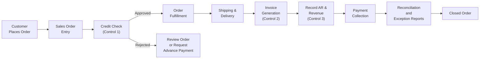
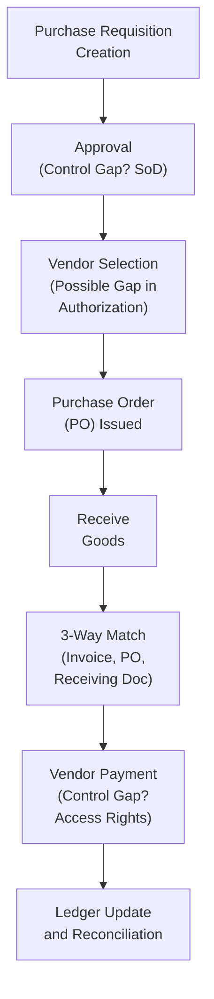

## 15.2 Analyzing Process Bottlenecks and Control Gaps

A business process consists of interdependent activities that convert inputs (e.g., materials, data, or requests) into outputs (products or services) for internal or external stakeholders. Even when carefully designed, processes may encounter bottlenecks and control gaps. Bottlenecks slow down or disrupt the process flow. Control gaps, on the other hand, expose the organization to risk by failing to prevent or detect process irregularities—whether operational, financial, or regulatory. Both bottlenecks and control gaps undermine efficiency, increase costs, and create the potential for financial misstatement or non-compliance.

When viewed through the lens of CPA responsibilities, analyzing process bottlenecks and exposing control gaps is essential for internal audits, external assurance engagements, management advisory services, and everyday finance operations. This section covers best practices, frameworks, and techniques to help you identify inefficiencies, overlay effective internal controls, and propose improvements that promote compliance and add business value.

  
Introduction to Process Bottlenecks

A bottleneck is any point in a process where the flow of work is impeded, resulting in slower or variable throughput. In some cases, bottlenecks are caused by limited resources, suboptimal workflows, or poorly structured decision checkpoints. In other cases, they arise due to unforeseen constraints such as regulatory requirements, hardware limitations, or staffing shortfalls. When processes become bottlenecked, the entire organization can experience consequences that include:

• Increased operating costs due to workflow backlogs and overtime.  
• Missed deadlines on financial closings and reporting cycles.  
• Lower customer satisfaction due to delays or errors.  
• Elevated risk of non-compliance and inaccurate financial data.  

When a process bottleneck exists long enough, employees often create manual workarounds. These unapproved “shortcuts” or customized solutions can create new control gaps and erode standardization. Identifying and resolving bottlenecks before they embed themselves in an organization’s culture is crucial for mitigating risk and ensuring operational excellence.

Common Symptoms of Bottlenecks

While each industry has its unique challenges, there are common warning signs that signal a process may be experiencing a bottleneck:

• Excessive Operating Cycle Times. Tasks that consistently take longer than planned, causing lateness in subsequent steps of the process.  
• Large Backlogs or Queues. Work items or transactional documents accumulating and awaiting action or approval.  
• Frequent Overtime or Temporary Staff. Employees must work extra hours to catch up with tasks.  
• High Rate of Errors or Rework. Process participants correct mistakes frequently, which disrupts flow and causes more delays.  
• Low Staff Morale. Employees become frustrated and report feeling constantly overwhelmed, as workflow is not balanced.  

A skilled CPA or IT auditor looks for these indicators when reviewing operational or financial processes, especially those closely tied to cash flow (e.g., procurement-to-pay, order-to-cash, payroll). By identifying these patterns early, organizations can respond strategically instead of merely reacting to problems.

Overlaying Internal Controls on a Process Map

Overlaying internal controls on a process map is an effective technique for locating both bottlenecks and control gaps. By visualizing interactions, data flows, decision points, and control checkpoints, auditors and management can pinpoint areas that need closer attention or redesign.

Below is a simple illustration of an “Order to Cash” process flowchart in Mermaid format, with examples of where controls might be inserted. Notice how each activity is labeled, and each control overlay highlights a critical governance or risk mitigation measure.

• Credit Check (Control 1). Preventive control ensuring that only valid, creditworthy orders proceed. Delays might occur if the credit review process is manual or if there is insufficient staffing for large orders.  
• Invoice Generation (Control 2). Preventive and detective control generating an invoice directly from the order data, reducing the risk of billing errors. Bottlenecks can arise due to integration issues among different enterprise systems.  
• Recording AR & Revenue (Control 3). Preventive control if automation is used for accurate ledger entries, or detective if manual reviews are required. A backlog here could result from manual journal entries or system errors.  

Over these points, you can assess:

1. The time spent (or queue length) at each control checkpoint.  
2. The frequency of rejections or exceptions indicating potential training or policy gaps.  
3. The degree of automation and system integration for real-time data flow.  

If a particular control step accumulates a large queue, it might be a powerful indicator of a bottleneck. However, removing or weakening a control merely to speed up processing can create new risks. The objective is a balanced approach: a robust control environment that also promotes efficiency.  

Key Approaches to Identifying Bottlenecks

1. Process Mapping and Flowcharting  
   Developing a visual blueprint of the process is paramount. Flowcharts and swimlane diagrams help identify task dependencies, possible rework loops, redundancies, and waiting points.

2. Data-Driven Analysis  
   Measure key performance metrics such as throughput time, queue length, error rates, and backlog size. If you notice days-sales-outstanding significantly exceed benchmarks or if orders wait multiple business days in “pending” status, you likely have a bottleneck.

3. Interviews and Observations  
   Engage employees who regularly perform or supervise the process. They can often pinpoint constraints, hidden rework, and areas that lack clarity or standard operating procedures. Direct observation—sometimes referred to as “walking the process”—allows you to see real-life delays or duplications.

4. Root-Cause Analysis  
   Techniques like the “Five Whys” or cause-and-effect (fishbone) diagrams help peel back symptoms to find underlying reasons for slowdowns. Is the issue undertrained staff, an antiquated IT system, or conflicting departmental metrics that fail to align?

5. Technology Assessment  
   Evaluate both hardware and software. For instance, if older printers or servers slow the processing of invoices at peak times, consider whether investing in upgrades or adopting a cloud solution is beneficial. Limitations in software integration can also cause manual re-entry of data.

Pinpointing Control Gaps

While a bottleneck can hamper operational efficiency, a control gap jeopardizes the reliability, accuracy, or completeness of data. Both issues are serious, and each can amplify the other. Common areas where control gaps arise include:

• Segregation of Duties (SoD). A single individual may have authority over creating, approving, and reconciling transactions, increasing the risk of fraud and errors.  
• Authorization and Review. If critical steps (e.g., disbursement approvals) lack thorough sign-off, a material misstatement or fraud attempt might go undetected.  
• Access Controls. Inadequate user authentication and role-based access can allow unauthorized data manipulation.  
• Change Management. Absence of formal policies and procedures around system updates or process changes can introduce errors into the production environment.  
• Monitoring and Reporting. Limited or non-existent exception reporting and KPI tracking hamper management’s ability to detect anomalies.  

The following Mermaid chart offers an example that overlays potential control gaps onto a “Purchase to Pay” process map. Note how each potential gap is labeled:

• Potential Gap in Approval (SoD). The same individual might approve their own requisitions without a second review.  
• Gap in Authorization. Vendor selection might be done without a qualified vendor list or competitive quotes.  
• Weak Access Rights. Payment runs could be initiated and confirmed by the same user, bypassing dual authorization.  

By visually marking potential gaps on process steps, you can systematically evaluate whether controls are adequate, whether documented policies match practice, and whether technology solutions (like automated approval workflows) are fully leveraged.

Case Example: Bottleneck and Gap in the Approval Process

Scenario: A mid-sized manufacturer experiences consistent delays and build-up in its purchasing queue. An internal audit reveals:

• Delayed Approvals. Purchase requisitions University-wide wait in the system for a week on average, as managers are busy or out of the office.  
• Same-User Authorization. A purchasing clerk, under pressure from production deadlines, routinely overrides the system’s SoD setting with a seldom-monitored backdoor.  

Impact & Resolution:

• By implementing a rule that delegates approval authority based on purchase amounts and requiring managerial backup in the system, the organization drastically cut waiting times.  
• IT fixed the system override, preventing any single individual from approving requisitions above a certain threshold.  
• A real-time dashboard that tracks approval queues was introduced, allowing senior management to monitor aging requisitions.  

Results included faster turn-around time for key materials and a reduction in unapproved purchases, mitigating both operational and compliance risks.

Real-World Steps for Process Bottleneck and Control Gap Analysis

Define Process Scope and Purpose  
Clarify which functional area or transaction cycle you will analyze. Focus on processes critical to financial reporting (e.g., revenue recognition) or risk-heavy areas (e.g., inventory management).

Develop or Refine Process Maps  
Collaborate with process owners, using flowcharts or BPMN diagrams. Include every major task, data input, decision node, and control checkpoint.

Assess Performance Measures  
Gather data on process cycle times, backlog volumes, error rates, and overall throughput. Track historical trends to see if bottlenecks correlate with specific periods.

Review Existing Controls  
Systematically list all controls. Match them to relevant risks and verify if they effectively mitigate potential misstatements, errors, or fraud. Document whether each control is preventive, detective, or corrective.

Use Technology Tools  
Employ workflow tools or analytics software to monitor queues, identify repeated rework or exception codes, and measure how frequently items are flagged for manual intervention.

Interview Stakeholders  
Conduct formal or informal interviews with employees responsible for or affected by the bottleneck. Ask about challenges, workaround tactics, or any confusion regarding standard procedures.

Recommend and Document Improvements  
Propose strategies—like automating data entry, implementing e-signatures, or establishing a new approval matrix. Document how each recommendation addresses bottlenecks and control gaps.

Follow-Up Activities  
After implementing improvements, track key metrics again. Confirm that the process flows more smoothly and that the control environment is strengthened without inadvertently creating new bottlenecks in other areas.

Balancing Efficiency and Control

When addressing process bottlenecks, it may be tempting to remove controls that contribute to friction. However, weakening or eliminating internal controls can expose the organization to larger financial, regulatory, or operational risks. Instead, focus on building efficient yet robust controls:

• Segregate Approvals to Distribute Workload. If managers are overloaded, delegate lower-value approvals to supervisors with established authority and training.  
• Automate Routine Checks. Deploy scripts or system logic to handle recurring tasks (e.g., verifying vendor tax IDs), freeing staff to handle exceptions.  
• Ensure Real-Time Monitoring. Dashboards and sensors can provide up-to-date metrics on backlog, exceptions, and control usage.  
• Perform Continuous Improvement. Adopt a mindset of incremental, ongoing refinement—especially with technology that can reduce manual tasks.  

Common Pitfalls

• Underdefining Roles and Responsibilities. You risk ongoing confusion and overlapping tasks, which can create rework loops and accountability gaps.  
• Missing the Human Element. Even advanced technology can fail if staff are inadequately trained or if organizational culture discourages timely approvals.  
• Focusing on Silos Instead of End-to-End Flow. An isolated push for efficiency in a single department can cause unintentional bottlenecks elsewhere in the process.  
• Overreliance on Manual Controls. While a quick fix, manual controls are slow, prone to human error, and can exacerbate process bottlenecks.  
• Neglecting Post-Implementation Checks. Failing to evaluate improvements after they are launched can undermine sustainability and hamper continuous optimization efforts.  

Conclusion

Analyzing process bottlenecks and identifying control gaps is a critical component of ensuring that business processes remain efficient, secure, and compliant. As a CPA or accounting professional, your expertise in financial analysis and internal controls is invaluable for driving both the operational effectiveness and the reliability of reported financial data.

By mapping out processes, overlaying controls, using data analytics, and conducting root-cause analysis, organizations can reduce risk exposure while optimizing workflows. The result is an enterprise that operates with greater agility, lower costs, and improved stakeholder confidence—aligning service delivery and financial reporting with the high standards expected of modern businesses.

## Test Your Knowledge: Process Bottlenecks and Control Gaps



### Which of the following best describes a process bottleneck?

- [x] A point in the workflow that slows or halts throughput due to limited capacity or undue complexity.
- [ ] A control gap that leads to fraud risk.
- [ ] An automated step that validates large transactions.
- [ ] A minor software bug that requires patching.

> **Explanation:** A bottleneck is any point in a process where throughput is impeded and accumulations of work result. This is distinct from a control gap, which raises different types of risk.

### Which symptom below commonly indicates a bottleneck?

- [x] Pervasive backlogs and repeated overtime to catch up on delayed tasks.
- [ ] Large operating profit margins in the long term.
- [ ] Decreased focus on data-driven decisions.
- [ ] Excess capacity in production lines.

> **Explanation:** One of the key identifiers of a bottleneck is the presence of accumulating tasks and the need for extra labor to meet deadlines.

### What is the primary purpose of overlaying internal controls on a process map?

- [ ] To generate more complicated flowcharts that highlight design complexity.
- [x] To visually identify control checkpoints, potential inefficiencies, and gaps in risk mitigation.
- [ ] To ensure financial statements are prepared only by external auditors.
- [ ] To disregard any rework loops present in the process.

> **Explanation:** By overlaying controls onto a process flow, you can detect redundancy, queue buildup, and any unmitigated risks.

### Which of the following is a “red flag” that a control gap may exist in the Purchase to Pay cycle?

- [ ] Excessive cancellations of customer orders.
- [x] The same individual creating, approving, and reconciling purchase orders without oversight.
- [ ] High turnover among junior staff in customer service.
- [ ] Low accounts payable days outstanding (APDO).

> **Explanation:** Combining multiple steps, such as creating and approving payments, poses a segregation of duties risk, signaling a probable control gap.

### Which method focuses on repeatedly asking “Why?” to dig deeper into the root cause of an issue?

- [ ] Kanban
- [ ] BPMN
- [x] The Five Whys
- [ ] Segregation of Duties

> **Explanation:** The Five Whys technique is a simple but powerful tool for uncovering why a bottleneck or error is happening by continually iterating the question “Why?”.

### Which of the following statements is TRUE about balancing efficiency and control?

- [x] Removing crucial controls to speed up process flow can result in greater financial or regulatory risks.
- [ ] Placing many layers of control rarely impacts process speed and employee morale.
- [ ] Automation always reduces both risks and cycle times simultaneously.
- [ ] Delegating approvals always increases the chance of fraud.

> **Explanation:** A key challenge is to keep controls robust without adding unnecessary friction; removing critical controls can exacerbate risk.

### What is an effective way to monitor ongoing process performance and detect emerging bottlenecks quickly?

- [ ] Rely solely on annual audits.  
- [x] Maintain real-time dashboards with metrics like backlog size and cycle time.  
- [ ] Only interview employees once every 3 years.  
- [ ] Assume that any new IT system solves all process issues.  

> **Explanation:** Real-time dashboards convey timely performance information, allowing managers to detect issues early and prevent significant backlogs.

### Which of the following common pitfalls can create hidden inefficiencies?

- [x] Underdefining roles and responsibilities in a process.
- [ ] Assigning clear backups for each approval step.
- [ ] Setting up well-established intrusion detection systems.
- [ ] Using continuous monitoring to track transaction volumes.

> **Explanation:** Unclear roles often result in duplication of efforts, confusion, and unowned tasks, leading to inefficiencies or bottlenecks in the process.

### In a “Purchase to Pay” process, which control ideally prevents unauthorized vendors from being selected?

- [x] Maintaining an approved vendor list and requiring justification for exceptions.
- [ ] Permitting buyers to select any vendor at their discretion.
- [ ] Allowing management to review new vendors only once a year.
- [ ] Relying solely on vendor-provided references without further checks.

> **Explanation:** An approved vendor list and a rigorous vendor vetting process help prevent unauthorized or high-risk parties from entering the procurement pipeline.

### True or False: A properly balanced process aims to eliminate all controls to maximize speed.

- [x] False
- [ ] True

> **Explanation:** Removing all controls may increase speed temporarily but leads to elevated operational and financial risks. The aim is a well-controlled yet efficient process.



## For Additional Practice and Deeper Preparation

### [Information Systems and Controls (ISC)](https://www.udemy.com/course/isc-cpa-mock-exams/?referralCode=E1217303222935C5E464)

**Information Systems and Controls (ISC) CPA Mocks:** 6 Full (1,500 Qs), Harder Than Real! In-Depth & Clear. Crush With Confidence!

- Tackle full-length mock exams designed to mirror real ISC questions.  
- Refine your exam-day strategies with detailed, step-by-step solutions for every scenario.  
- Explore in-depth rationales that reinforce higher-level concepts, giving you an edge on test day.  
- Boost confidence and minimize anxiety by mastering every corner of the ISC blueprint.  
- Perfect for those seeking exceptionally hard mocks and real-world readiness.

_Disclaimer: This course is not endorsed by or affiliated with the AICPA, NASBA, or any official CPA Examination authority. All content is for educational and preparatory purposes only._
