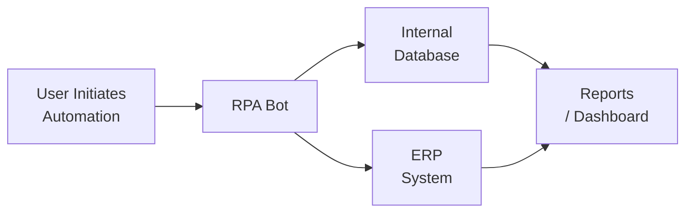

## 15.3 Leveraging Process Automation for Enhanced Efficiency

Process automation has transformed the way organizations conduct day-to-day operations, reducing human error, cutting down cycle times, and freeing professionals to focus on higher-value tasks. By automating repetitive, rules-based activities, companies can achieve greater consistency, streamline workflows, and enhance overall productivity. In this section, we explore how Robotic Process Automation (RPA) and other automation tools can significantly reduce manual burden, illustrate success metrics to measure improvements, and highlight best practices to ensure successful implementations.

Automation initiatives closely align with the themes discussed throughout this guide, including governance frameworks (see Chapter 3 for an overview), IT general controls (Chapter 8), and data analytics capabilities (Chapters 13 and 14). Because automation often integrates with corporate systems such as ERPs (Chapter 6) and other accounting information systems, it is crucial for CPAs and IT professionals to understand potential risks, controls, and performance indicators tied to automation solutions.

  
### Understanding Robotic Process Automation (RPA)

RPA refers to software “robots” or scripts configured to mimic human actions in interacting with digital systems. These bots can navigate GUIs (graphical user interfaces), input data, fetch information from designated sources, and trigger subsequent processes (e.g., sending emails, generating reports). RPA solutions excel at handling:

• High-volume, repetitive tasks  
• Structured data and standardized workflows  
• Transactional activities where standard rules apply 

Examples of use cases in finance functions include automating reconciliations, processing invoices, extracting billing data, and initializing journal entries. By reducing manual effort, RPA can mitigate the risk of manual errors and enhance data consistency.

  
### Key Benefits of Process Automation

1. Reduced Human Error:  
   Bots consistently follow defined steps without deviation. This consistency lowers error rates, particularly in critical financial tasks such as invoice posting or bank reconciliations.

2. Improved Efficiency and Throughput:  
   Automated processes often run much faster than their human-driven counterparts, allowing organizations to handle higher transaction volumes without proportional increases in headcount.

3. Enhanced Compliance:  
   Bots strictly adhere to predefined business rules and workflows, enabling more robust recording and documentation of each step for audit trails (see Chapter 4 on IT Audit Responsibilities).

4. Employee Satisfaction and Upskilling:  
   Automation relieves staff from mundane tasks, allowing them to undertake more strategic assignments that tap into analytical and creative skill sets.

5. Scalability and Flexibility:  
   RPA can typically be deployed or reconfigured quickly as processes change, enabling organizations to scale automation rapidly when necessary.

  
### Common Automation Tools and Technologies

While RPA is one of the most prevalent solutions for automating workflows, additional tools can deliver similar or complementary benefits:

• Workflow Automation Platforms: These platforms streamline task handoffs among departments, ensuring consistent application of business rules and real-time progress monitoring.  
• Macro-based Tools and Scripts: For smaller or simpler automations, organizations sometimes rely on spreadsheets and macros to reduce repetitive data entry or analysis.  
• Low-Code and No-Code Platforms: These solutions enable business users without advanced development experience to build automation workflows through drag-and-drop interfaces.  
• AI-Enhanced RPA: Advances in artificial intelligence allow bots to handle relatively unstructured tasks, such as reading scanned documents via optical character recognition (OCR) or predicting data classifications using machine learning models.

  
### Selecting a Process for Automation

Before implementing automation, organizations should prioritize processes based on:

• High Volume and Repetitiveness: The tasks that most frequently occur with consistent input-output structures are prime candidates for automation.  
• Clear Rules and Low Exception Rates: Workflows that require minimal judgment, variable reasoning, or irregular data are better suited for RPA.  
• Identifiable Pain Points: Processes with known bottlenecks, backlogs, or high human error rates typically yield the best return on automation.  
• Measurable Impact: Automating processes that drive core business results—e.g., accelerating the financial close or improving customer satisfaction—often produce the most significant impact.

  
### Implementation Lifecycle of RPA

Implementation of an RPA or similar automation initiative can follow a structured approach closely aligned to systems development life cycle (SDLC) concepts (see Chapter 10.5 on SDLC):

• Process Assessment: Identify the tasks targeted for automation, document pain points, and assess feasibility. Key inputs: existing procedural documentation, error logs, and staff interviews.  
• Design and Development: Create the automation scripts based on documented process flows, standard operating procedures, and business rules.  
• Testing and Validation: Verify that bots work as expected. Testing phases typically include unit testing, user acceptance testing, and pilot runs.  
• Deployment: Move the automation solution to a production environment, ensuring that necessary access controls (Chapter 8.1 on Access to Programs and Data) and logging functionalities are in place.  
• Maintenance and Monitoring: Monitor the automation performance, gather feedback from end-users, and iterate to address issues or adapt to process changes.

  
### Best Practices in Process Automation

• Governance and Oversight:  
  Ensure executive sponsorship and robust governance structures (see Chapter 3 on Governance Frameworks) to prioritize processes, allocate resources, and address risks.

• Integration with Existing Controls:  
  Align automated workflows with existing IT general controls (ITGC) principles covered in Chapter 8—particularly security, change management, and operational practices.

• Collaboration Between Finance, IT, and Operations:  
  RPA solutions intersect multiple departments. Involve cross-functional stakeholders to ensure the automation reflects business needs and mitigates friction when rolled out.

• Change Management and Training:  
  Train employees on the new workflow and changes to their responsibilities. Emphasize the benefits of automation to encourage buy-in and acceptance.

• Manage Exceptions Carefully:  
  Some processes involve a subset of scenarios requiring human judgment. Ensure individuals responsible for exception handling are well-trained, and the handoff from bots to humans is clearly defined.

  
### Measuring Success and KPI Tracking  

Establishing relevant metrics is crucial for demonstrating the value of automation. The table below provides examples of key performance indicators (KPIs) relevant to process automation:

| KPI                          | Description                                        | Calculation / Approach                                                      |
|------------------------------|----------------------------------------------------|-----------------------------------------------------------------------------|
| Cycle Time Reduction         | Measures how much faster the process is completed | Compare new process completion time vs. baseline manual approach            |
| Error Rate                   | Assesses rate of inaccuracies in automated tasks  | (Number of errors detected ÷ total transactions) before vs. after RPA       |
| Cost Savings                 | Estimates labor and overhead savings              | Compare labor costs and overhead before vs. after automation implementation |
| ROI (Return on Investment)   | Evaluates profitability of the automation project | (Net benefit from automation ÷ total cost of the initiative) × 100%         |
| Throughput Increase          | Measures transaction volume capacity improvement  | Number of transactions completed in a period after automation vs. before    |
| Employee Satisfaction        | Assesses staff morale and perception of routine   | Employee survey results, turnover rates, and direct feedback                |

Monitoring these metrics ensures the organization realizes tangible benefits and provides opportunities to adjust as processes evolve.

  
### Real-World Use Case: Accounts Payable Automation

Consider a mid-sized manufacturing company where the accounting department handles hundreds of supplier invoices daily:

• Original Process:  
  Staff manually read and enter invoice details into the ERP, verify purchase orders, route the invoice for approval, and track email notifications. This led to potential delays, missing invoices, and inconsistent application of approval thresholds.  

• Automated Process with RPA:  
  RPA bots identify new invoices from a centralized email inbox. The bot reads invoice data using OCR, checks the PO match in the ERP system, applies built-in logic to direct it for further review if amounts exceed a certain threshold, and updates records automatically upon approval.  

• Results:  
  – Reduced the average time per invoice from five minutes to less than one minute  
  – Lowered error rates by 70%  
  – Freed staff to analyze invoice discrepancies and vendor terms instead of repetitive data entry  

This case highlights typical benefits—reduced manual tasks, improved process consistency, and faster completion times—while also illustrating the best practices of focusing on process bottlenecks, high-volume transactions, and tasks with clear decision thresholds.

  
### Potential Challenges and Pitfalls

• Over-Automation:  
  Organizations sometimes attempt to automate highly complex tasks with significant variability and exceptions, leading to frequent bot failures.

• Insufficient Documentation:  
  Automations depend on well-documented process steps. Organizations that lack standard operating procedures (SOPs) or have frequent process variations may struggle to establish stable automations.

• Security and Access Risks:  
  RPA bots require credentials and permissions; any oversight in managing these can create security gaps. Adherence to identity and access management protocols (Chapter 18) is critical.

• Regulatory Requirements:  
  Certain industries or jurisdictions have strict data handling laws (see Chapter 19 on Privacy Laws). Automated solutions must comply with data protection and privacy standards.

• Lack of Ongoing Governance:  
  Failing to monitor performance over time can lead to issues such as “bot drift,” where changes in the environment cause the automation to fail or produce incorrect results.

  
### Integrating Automation with Data Analytics

As introduced in Chapter 14, data analytics plays a significant role in identifying trends, forecasting procurement needs, and driving more informed decision-making. RPA can serve as a robust data gathering layer. By automating data extraction from multiple systems, RPA can feed analytics platforms with near-real-time information, enabling advanced reporting and dashboards. This synergy between automation and analytics helps organizations achieve continuous monitoring and fosters proactive decision-making.

  
### Visualizing an Automation Architecture

Below is a Mermaid diagram illustrating how a simplified RPA workflow might integrate with an organization’s systems:

In this flow:
• The user initiates the automation, providing necessary triggers or parameters.  
• The RPA bot interacts with both the ERP and an internal database to gather and process data.  
• Results from both systems converge into an analytics/reporting layer, offering insights into process performance, transaction details, and other metrics.

  
### Case Study of a Typical Rollout

1. Planning Phase:  
   – Identify the team: CFO, controller, IT lead, and process owners  
   – Document the current state: Manual tasks, redundancies, major pain points  
   – Define success metrics leveraging the table shown above  

2. Piloting Automation:  
   – Implement RPA for a small subset of invoice processing tasks  
   – Validate performance in a real-world environment  
   – Gather end-user feedback  

3. Expansion and Integration:  
   – Expand automation to related tasks (e.g., vendor master data updates, digital matching of purchase orders)  
   – Integrate with company’s analytics platform to generate real-time financial and operational insights  

4. Ongoing Maintenance:  
   – Schedule frequent check-ins to ensure the bot adjusts to new business requirements  
   – Utilize robust logging tools to track any exceptions or anomalies  

This phased approach ensures that the organization addresses potential issues early and integrates changes into a broader automation strategy.

  
### Practical Guidance for CPAs

CPAs frequently have roles in process documentation, controls assessment, and compliance. In automation projects, CPAs can:

• Help Document Processes:  
  Leverage their understanding of control objectives and risk factors to shape stable, consistent workflows for automation.  

• Assess Risk and Control Implications:  
  Identify how automation may alter the control environment, especially around segregation of duties and security.  

• Influence Metrics:  
  Provide financial impact analysis—quantifying time saved, error reduction, and potential compliance cost savings.  

• Guide Ethical and Regulatory Compliance:  
  Ensure data captured and processed by RPA is appropriately handled and stored, complying with relevant laws and regulations (see Chapter 19 on confidentiality and privacy).

  
### Continuous Improvement

Automation should be treated as an iterative process, continually refined as organizational needs evolve. RPA solutions can be quickly adapted to accommodate new system configurations or changing data flows. This agile mindset helps sustain automation benefits in the long term.

  
## Test Your Knowledge: RPA & Process Automation Quiz



### One major advantage of introducing RPA into accounting processes is:
- [ ] Increased manual oversight of transactions
- [ ] Higher exception rates
- [x] Reduced human error in routine tasks
- [ ] None of the above

> **Explanation:** RPA bots operate consistently based on established rules, minimizing the risk of common human errors such as data entry mistakes.

### Which of these processes is most likely to be successfully automated using RPA?
- [x] High-volume invoice data entry with well-defined rules
- [ ] Complex financial analysis requiring extensive human judgment
- [ ] Strategic budgeting decisions
- [ ] Performance evaluations of employees

> **Explanation:** RPA excels at handling repetitive tasks governed by standardized workflows and data inputs, such as invoice data entry.

### Which key performance indicator (KPI) specifically measures how quickly a task is completed after automation?
- [ ] Employee Satisfaction
- [ ] Error Rate
- [ ] ROI
- [x] Cycle Time Reduction

> **Explanation:** Cycle Time Reduction tracks how much faster a function or process is completed relative to its baseline, directly reflecting time-based efficiency gains.

### A primary role of CPAs in process automation initiatives is to:
- [ ] Design software robots themselves
- [x] Document processes and assess control risks
- [ ] Eliminate all manual processes
- [ ] Patch network vulnerabilities in the software code

> **Explanation:** CPAs have extensive knowledge of internal controls and risk mitigation. They help ensure that new automated workflows align with sound financial and compliance obligations.

### Which of the following might indicate an over-automation pitfall?
- [x] Frequent bot failures handling complex, variable tasks
- [ ] Reduced staff turnover in the accounting department
- [ ] Higher compliance with data privacy
- [ ] Fewer system outages overall

> **Explanation:** Over-automation happens when organizations apply RPA to processes with high variability, leading to repeated failures and inefficiencies.

### Which of the following metrics would best measure the financial value of an RPA initiative?
- [ ] Error Rate
- [x] ROI
- [ ] Cycle Time
- [ ] Employee Satisfaction

> **Explanation:** ROI (Return on Investment) calculates the net benefits compared to total costs, indicating the financial viability and profitability of the project.

### An effective approach to pilot an automation initiative is to:
- [ ] Install bots into every process immediately
- [x] Start small with a limited scope and monitor performance
- [ ] Replace all employees involved
- [ ] Announce automation after it is fully implemented company-wide

> **Explanation:** Piloting on a smaller scale allows organizations to work out major issues, gather feedback, and measure initial success prior to a broader rollout.

### In an RPA environment, which factor is critical for securing automated workflows?
- [ ] Completely removing user access credentials
- [ ] Using the same login for multiple applications
- [ ] Allowing robots to run without any authentication
- [x] Properly managing and controlling bot credentials

> **Explanation:** RPA bots need appropriate credentials to interact with systems. Mishandling of these credentials can create serious security risks.

### Which is true about integrating RPA with data analytics tools?
- [ ] RPA and data analytics are mutually exclusive
- [ ] RPA cannot capture structured data
- [x] RPA can feed near-real-time data into analytics platforms
- [ ] RPA reduces the availability of data for analysis

> **Explanation:** By automating data extraction, RPA can expedite the flow of information into analytics solutions, enabling advanced reporting and continuous monitoring.

### Implementing RPA in accounts payable has often led to cycle time reductions of:
- [x] True
- [ ] False

> **Explanation:** Many organizations have showcased measurable reductions in invoice processing times (and other high-volume tasks) through RPA, delivering faster cycle times and improved productivity.



## For Additional Practice and Deeper Preparation

### [Information Systems and Controls (ISC)](https://www.udemy.com/course/isc-cpa-mock-exams/?referralCode=E1217303222935C5E464)

Information Systems and Controls (ISC) CPA Mocks: 6 Full (1,500 Qs), Harder Than Real! In-Depth & Clear. Crush With Confidence!

- Tackle full-length mock exams designed to mirror real ISC questions.  
- Refine your exam-day strategies with detailed, step-by-step solutions for every scenario.  
- Explore in-depth rationales that reinforce higher-level concepts, giving you an edge on test day.  
- Boost confidence and minimize anxiety by mastering every corner of the ISC blueprint.  
- Perfect for those seeking exceptionally hard mocks and real-world readiness.  

_Disclaimer: This course is not endorsed by or affiliated with the AICPA, NASBA, or any official CPA Examination authority. All content is for educational and preparatory purposes only._
