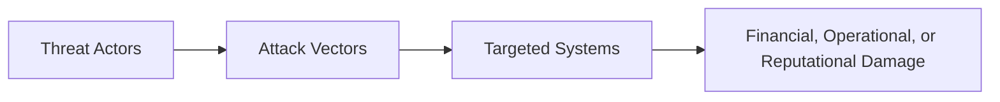

## 16.1 Threat Actors, Attack Vectors, and Evolving Landscapes

Cybersecurity threats continue to escalate, with adversaries employing sophisticated methods to compromise systems and exfiltrate confidential data. From a Certified Public Accountant (CPA) perspective, it is imperative to understand who the adversaries are (threat actors), how attacks occur (attack vectors), and the dynamic nature of the risk environment (the evolving cyber landscape). This knowledge enables CPAs to effectively identify critical threats, assess internal controls, and recommend strategies to safeguard financial and operational assets in line with the AICPA’s Information Systems and Controls (ISC) Blueprint. 

While Chapter 3 (Governance, Frameworks, and Regulatory Environment) introduced general frameworks for internal control and risk management, and Chapter 4 (Key Concepts of IT Audit and Assurance) underscored the importance of assessing risks in IT audits, this section focuses on understanding and categorizing the threats themselves. It examines the root causes of cyber intrusions and highlights practical strategies CPAs can use to provide robust cybersecurity oversight and advisory services.

  
### Understanding the Threat Landscape

The threat landscape includes a diverse set of adversaries, each motivated by different goals, techniques, and resources. CPAs working on securing financial data, accounting information systems, and broader enterprise processes must maintain an awareness of how these threats change over time. Attackers are constantly finding new ways to exploit vulnerabilities, rendering outdated security measures ineffective.

  
### Categories of Threat Actors

Threat actors—sometimes referred to as threat agents or adversaries—range from lone hobbyists to state-sponsored groups backed by extensive resources. Understanding their varying motivations, capabilities, and typical targets helps CPAs and other financial professionals anticipate the nature of potential attacks.

• Hacktivists  
  These are individuals or groups driven by political, social, or ideological motives. Hacktivists typically aim to disrupt organizations that conflict with their beliefs. Their methods can range from website defacements and Distributed Denial-of-Service (DDoS) attacks to the theft and public release of sensitive data (e.g., “doxing”). While they may not always wield advanced techniques, their attacks leverage publicity and can undermine confidence in a company’s brand or financial stability.

• Cybercriminals and Organized Crime Groups  
  Cybercriminals primarily operate for financial gain. Their methods include phishing, ransomware deployment, credit card data theft, and identity fraud, often undertaken as part of robust criminal organizations. With the potential to resell stolen data on underground markets, these groups are motivated by monetary rewards and can pose a significant risk to financial entities, including accounting firms with valuable client information.

• Insider Threats  
  Insiders, whether employees or trusted contractors, can pose a unique risk because they already have legitimate access to organizational systems. They may steal data for personal profit, sabotage systems due to workplace grievances, or inadvertently compromise security through negligence. Insiders are especially dangerous because detecting unauthorized internal actions is often more difficult than blocking external intrusions.

• State-Sponsored Actors and Advanced Persistent Threats (APTs)  
  Some attackers are affiliated with or funded by nation-states. Known as “Advanced Persistent Threats (APTs),” they operate sophisticated campaigns, often seeking intellectual property, strategic assets, or geopolitical leverage. APTs can remain undetected for extended periods, employing zero-day exploits (previously unknown vulnerabilities) and stealthy infiltration tactics. Organizations considered part of critical infrastructure (e.g., the financial sector) are particularly at risk.

• Script Kiddies  
  Script kiddies are inexperienced hackers who rely heavily on readily available tools and scripts rather than developed expertise. Although they typically lack advanced knowledge, they can still cause harm through volumetric attacks or by exploiting unpatched, well-known vulnerabilities. These actors underscore the importance of maintaining regular security patches and staying current with basic cybersecurity hygiene.

• Hackers-for-Hire and Cybermercenaries  
  A growing subset of threat actors offers hacking services for a fee. Ranging from corporate espionage to targeted attacks aimed at crippling competition, these individuals or groups can effectively sell specialized capabilities to unethical clients. Financial institutions and large corporations can be prime targets in these scenarios, even if they are not the original instigator’s primary interest.

  
### Common Attack Vectors

Attack vectors are the pathways or methods used by adversaries to gain entry into a system. Modern organizations must implement layered security controls to prevent, detect, and respond to intrusions across multiple potential entry points.

• Phishing and Social Engineering  
  • Phishing: Mass emails crafted to trick recipients into revealing passwords or installing malware.  
  • Spear Phishing: Highly targeted emails using recipient-specific information to gain trust.  
  • Whaling: Phishing attempts directed at senior executives (“big fish”), often with a financial or strategic aim.  
  • Voice Phishing (Vishing) and SMS Phishing (Smishing): Exploits trust in phone or text communication.  

  For CPAs with privileged access to financial information, social engineering attacks pose a major risk. Attacks often impersonate senior leaders requesting sensitive data or urgent wire transfers, capitalizing on the hierarchical trust structure common in organizations.

• Malware Infecting Systems  
  • Ransomware: Encrypts user data and demands payment. Particularly devastating for accounting systems that rely on data integrity and availability.  
  • Trojans: Disguised as legitimate software to embed malicious code.  
  • Worms: Self-replicating malware that exploits network vulnerabilities.  
  • Remote Access Trojans (RATs): Provide attackers clandestine control over systems.  

  Malware distribution methods vary, but infected email attachments, compromised websites, and removable media (e.g., USB drives) are common channels.

• Web Application Attacks  
  • SQL Injection (SQLi): Exploits poorly secured databases through forms or URL parameters.  
  • Cross-Site Scripting (XSS): Injects malicious scripts into web pages viewed by other users.  
  • Cross-Site Request Forgery (CSRF): Tricks authenticated users into unwittingly executing actions on a web application.  

  As many companies now depend on cloud-based and web-based financial management systems, web application security is critical to protect transactions and sensitive records.

• Distributed Denial-of-Service (DDoS)  
  Leveraging botnets comprising thousands or even millions of compromised devices, attackers can flood a targeted system with excessive requests. For financial firms that depend on 24/7 availability, a DDoS attack can disrupt services, damage reputation, and incur financial losses.

• Supply Chain Attacks  
  Compromising a vendor, software provider, or other third-party in the organization’s supply chain can create a backdoor into the organization’s environment. The famous SolarWinds breach has underlined the potential ripple effects across industries when a widely used product update is compromised.

• Zero-Day Exploits  
  Zero-day exploits target vulnerabilities unknown to the software vendor or users, leaving no time for patching. Attackers can gain access to systems without any known defense once these vulnerabilities are discovered but before universal fixes are available.

• Insider Threat Exploits  
  While not always considered an “attack vector” in a technical sense, insiders can circumvent security controls by leveraging legitimate permissions. They might store sensitive data on personal devices or fail to observe data handling procedures, leading to unintentional or intentional leaks.

  
### The Evolving Cyber Threat Landscape

Global and industry-specific regulations are increasingly emphasizing cybersecurity practices. At the same time, threat actors continue to innovate. Key factors driving the evolving landscape include:

• Proliferation of Ransomware as a Service (RaaS)  
  Organized groups now provide “toolkits” that lower the barrier to entry for aspiring cybercriminals. This crimeware model has led to an exponential rise in ransomware incidents.

• Remote Work and Cloud Adoption  
  As remote work becomes engrained in everyday business operations, employees often connect through home networks that may lack enterprise-grade security. Cloud-based collaboration tools further expand the potential attack surface, requiring careful configuration and monitoring.

• Growth of the Internet of Things (IoT)  
  IoT devices—such as smart thermostats, security cameras, and specialized industrial sensors—often lack robust security features. Cyberattacks can propagate through these devices as an indirect way to access primary systems.

• Targeted Financial Attacks  
  Financial data, intellectual property, and personally identifiable information (PII) remain prime targets due to their inherent value on the black market. CPAs, who regularly handle sensitive data, must be aware of the increased risk of targeted attacks.

• Artificial Intelligence (AI) and Machine Learning (ML) Tools  
  Attackers and defenders alike are adopting AI-driven approaches. Automated scripting and advanced reconnaissance can be employed for malicious purposes, while defensive AI can help detect anomalies faster. This arms race continuously shifts the threat paradigm.

  
### Real-World Examples and Case Studies

1. Equifax Data Breach (2017)  
   Attackers exploited a known, unpatched vulnerability in the Apache Struts web application framework. Over 147 million sensitive personal records were compromised, emphasizing the significance of timely patch management.

2. WannaCry Ransomware (2017)  
   Leveraging an EternalBlue exploit attributed to state-sponsored actors, WannaCry spread rapidly across global networks, crippling hospitals, businesses, and government agencies. This example highlights how quickly organizations can be devastated without robust network segmentation and backup processes.

3. SolarWinds Supply Chain Attack (2020)  
   State-sponsored actors implanted malicious code in a routine software update. Thousands of organizations, including governmental agencies and critical infrastructure providers, unknowingly installed tainted updates, demonstrating how a single compromised supplier can expose multiple enterprises.

  
### Practical Guidance for CPAs and Financial Professionals

CPAs, in their capacity as auditors and advisors, can add tremendous value by incorporating cybersecurity risk assessments into their work. Key practices include:

• Assessing Risk:  
  Integrate cyber risk factors into the broader enterprise risk management (ERM) framework (see Chapter 3.2). This involves weighing the likelihood and impact of various threat actors specifically targeting financial data.

• Evaluating IT General Controls (ITGCs):  
  As covered in Chapter 8, effective access controls, change management processes, and computer operations controls help reduce the likelihood of successful attacks.

• Reviewing Third-Party Agreements:  
  Examine third-party vendor controls, service-level agreements (SLAs), and reporting requirements (e.g., SOC 1®, SOC 2®) to ensure that partners and suppliers meet cybersecurity expectations.

• Promoting a Security Culture:  
  Train employees to recognize phishing attempts and enforce strong password policies. Human error remains a leading cause of breaches; continuous education is crucial to mitigate this risk.

• Incident Response and Business Continuity Planning:  
  Coordinate with organizational leadership to ensure readiness in the event of a breach. Chapter 20 discusses incident response best practices; these plans are vital to limit damage and expedite recovery.

• Leveraging COBIT and COSO:  
  COBIT 2019, COSO Internal Control – Integrated Framework, and COSO ERM offer useful structures for standing up or evaluating robust governance over information security processes and controls.

  
### Visualizing the Cyber Attack Flow

Below is a simplified representation of how threat actors approach their targets through various attack vectors, ultimately leading to potential damage:

• A: Threat actors (hacktivists, cybercriminals, insiders, etc.) select targets based on motivation and potential gain.  
• B: Attack vectors (phishing, malware, zero-day exploits) enable adversaries to infiltrate systems.  
• C: Once inside, attackers move laterally or exfiltrate data within targeted systems.  
• D: The final outcome may impact the organization’s financial stability, operational continuity, and reputation.

  
### Conclusion

An organization’s cybersecurity posture is only as strong as the collective measures taken to deter, detect, and contain threats across all potential attack vectors. As essential stewards of an entity’s financial integrity, CPAs must develop and maintain a strong understanding of emerging cyber threats and the controls designed to mitigate them. Building this knowledge base is critical not only for compliance with professional standards but also to safeguard the enterprise’s finances and reputation.

Staying informed about the nuances of different threat actors, emerging technologies, and best practices in cybersecurity helps CPAs advise clients and organizations on proactive strategies. Ultimately, an integrated approach to cybersecurity—rooted in robust governance, layered defenses, and continuous monitoring—is the cornerstone of modern financial risk management.

  
## Strengthen Your Cybersecurity Knowledge: Threat Actors & Attack Vectors



### Which of the following describes a motivation of a hacktivist?
- [ ] Solely financial gain
- [x] Ideological or political objectives
- [ ] Selling access to compromised systems
- [ ] Nation-state espionage

> **Explanation:** Hacktivists generally carry out attacks for ideological, political, or social causes, rather than purely for financial gain or espionage.

### Which category of attacker is most likely to conduct espionage on behalf of a national government?
- [ ] Script kiddies
- [ ] Cybercriminal syndicates
- [ ] Insider threats
- [x] State-sponsored actors

> **Explanation:** State-sponsored actors have government-level resources and strategic objectives, which commonly include espionage or intelligence gathering.

### In a phishing attack, what is the primary method used to trick victims?
- [ ] Exploiting zero-day vulnerabilities
- [x] Manipulative or deceptive communications
- [ ] Physical access to the network
- [ ] Hardware tampering

> **Explanation:** Phishing relies heavily on social engineering techniques by sending deceptive communications such as emails or messages to trick recipients into revealing sensitive information.

### How does a ransomware attack typically affect an organization?
- [ ] It replaces the organization’s software with open-source versions
- [ ] It only disables internet connectivity
- [x] It encrypts data and demands payment for decryption
- [ ] It steals credentials without altering the system

> **Explanation:** Ransomware encrypts victims’ critical data and instructs them to pay a ransom to restore access, posing a severe threat to data integrity and availability.

### Which of the following is a primary characteristic of a zero-day exploit?
- [x] It exploits a vulnerability not publicly known or patched
- [ ] It uses purely physical methods to steal data
- [x] It remains undetected until widely publicized
- [ ] It only targets large corporations

> **Explanation:** A zero-day exploit leverages a fresh, undisclosed vulnerability in software, meaning patches are unavailable at the time of the attack, and the exploit can remain undetected for an extended period.

### What is one common aim of a Distributed Denial-of-Service (DDoS) attack against an organization’s systems?
- [ ] One-time code injection
- [x] Overwhelm the target’s bandwidth or resources
- [ ] Long-term persistence on the system
- [ ] Data exfiltration

> **Explanation:** DDoS attacks typically bombard a target with massive amounts of traffic or requests, rendering services inaccessible.

### Which scenario is most representative of an insider threat?
- [x] An employee sharing company data with an external party
- [ ] A cybercriminal group targeting customer credit cards
- [x] An attacker scanning a network for publicly exposed ports
- [ ] A competitor paying for a denial-of-service attack

> **Explanation:** An insider threat involves a legitimate user or employee misusing their credentials—often exposing or modifying data in unauthorized ways.

### Why are supply chain attacks particularly challenging to detect?
- [ ] They always involve physical tampering with hardware
- [ ] They only use well-known vulnerabilities
- [ ] They are perpetrated by ethical hackers
- [x] They can originate from trusted third-party vendors or software updates

> **Explanation:** Supply chain attacks compromise trusted software providers or vendors. The infected software or service then gets deployed by the customer, making it difficult to identify as malicious.

### When a CPA evaluates change management as part of IT General Controls (ITGC), which risk is most pertinent?
- [ ] Incorrect marketing strategies
- [x] Unauthorized or poorly tested code leading to vulnerabilities
- [ ] Reduced data storage capacity
- [ ] Excessive executive salaries

> **Explanation:** Effective change management ensures that new or modified systems are properly reviewed, tested, and authorized to prevent accidental introduction of security weaknesses or data integrity errors.

### True or False: Remote work arrangements have reduced the attack surface for many organizations because employees are no longer on the corporate network.
- [x] True
- [ ] False

> **Explanation:** This statement is actually false; remote work often expands the attack surface because employees connect from home networks or personal devices that may not have enterprise-level security, thus introducing more vulnerabilities.



## For Additional Practice and Deeper Preparation

### [Information Systems and Controls (ISC)](https://www.udemy.com/course/isc-cpa-mock-exams/?referralCode=E1217303222935C5E464)

**Information Systems and Controls (ISC) CPA Mocks:** 6 Full (1,500 Qs), Harder Than Real! In-Depth & Clear. Crush With Confidence!  

- Tackle full-length mock exams designed to mirror real ISC questions.  
- Refine your exam-day strategies with detailed, step-by-step solutions for every scenario.  
- Explore in-depth rationales that reinforce higher-level concepts, giving you an edge on test day.  
- Boost confidence and minimize anxiety by mastering every corner of the ISC blueprint.  
- Perfect for those seeking exceptionally hard mocks and real-world readiness.  

_Disclaimer: This course is not endorsed by or affiliated with the AICPA, NASBA, or any official CPA Examination authority. All content is for educational and preparatory purposes only._
