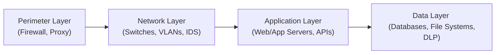
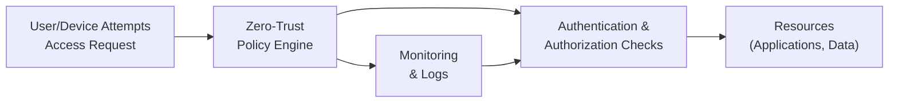

## 16.2 Cybersecurity Strategies: Layers, Defense‑in‑Depth, Zero‑Trust

In an environment where attacks on digital systems grow more sophisticated by the day, organizations must protect not only their networks but also their applications, data repositories, and user endpoints. These efforts are particularly vital for CPAs who handle large sets of confidential financial information. Because even a single security lapse can lead to costly losses, reputational damage, and regulatory repercussions, understanding comprehensive cybersecurity principles is essential. This section examines proven approaches to cybersecurity, focusing on layered security, the concept of “defense‑in‑depth,” and the increasingly popular zero‑trust model. It builds upon the threat awareness introduced in Section 16.1 and lays the foundation for deeper discussions in subsequent chapters like Chapter 17 (Security Architecture and Network Management) and Chapter 18 (Authentication and Access Management).

--------------------------------------------------------------------------------

### The Rationale Behind Layered Cybersecurity

Cybersecurity rarely depends on a single, one-size-fits-all control. Threat landscapes evolve quickly, and adversaries continually look for the path of least resistance. A layered approach adds multiple barriers between a malicious actor and the critical assets they seek, increasing the probability of detecting and stopping attacks before substantial damage occurs.

Many organizations once adopted a purely perimeter-based approach, focusing on external firewalls and basic anti-virus software. However, relying solely on perimeter defenses leaves systems vulnerable if an attacker gains internal access—through phishing emails, stolen credentials, or compromised user devices. By dividing defenses into several layers, each with its own specialized tools and policies, an organization reduces the likelihood that a single compromised control can topple the entire security structure.

#### Key Drivers for Layered Cybersecurity

• Rapidly Evolving Threats: Malware, ransomware, and phishing attacks continuously adapt. Multiple layers make it more difficult for novel threats to breach every point of defense.  
• Protecting Unique Assets: Different system layers (network devices, applications, and sensitive financial data repositories) each require distinct forms of protection.  
• Regulatory Requirements: Sector-specific regulations (e.g., HIPAA, PCI DSS, GDPR) often mandate layered safeguards for the systems and data they govern.  
• Reduced Attack Surface: With properly implemented layered controls, even if threat actors penetrate one layer, the next layers can detect and deter them.

--------------------------------------------------------------------------------

### Defense‑in‑Depth: A Comprehensive Overview

“Defense‑in‑depth” is closely aligned with layered security but goes one step further by rigorously examining the interplay between controls at each layer. Consider how the concepts from COSO’s Internal Control – Integrated Framework (see Chapter 3.1) are applied to IT systems. In a defense-in-depth strategy, several control layers exist in parallel, each featuring technical, operational, and administrative measures that collectively protect critical data resources.

Defense‑in‑depth often includes:

• Multiple Firewalls and Intrusion Detection Systems (IDS): Firewalls regulating incoming and outgoing traffic at different points in the network. IDS solutions may be placed both outside and inside the “perimeter” to identify malicious traffic patterns.  
• Layered Access Controls: At network, system, and data levels, each with individualized authentication requirements (see Chapter 18 for details).  
• Redundant and Overlapping Controls: Tools like advanced endpoint protection, encryption, and network segmentation that combine to form a robust and multifaceted security ecosystem.  
• Process and Procedure Overlays: Formalized incident response steps, employee training, vendor management protocols, and tabletop drills that ensure human factors are addressed.

By spreading security responsibilities across multiple controls, defense‑in‑depth significantly elevates an organization’s ability to detect malicious activities at various stages of an attack.

--------------------------------------------------------------------------------

### Layered Approach in Practice: Perimeter, Network, Application, and Data Controls

A layered model can be visualized with concentric rings—each deeper ring demanding more robust credentials and stricter access policies. The four primary layers typically include:  

1. Perimeter and Endpoint Security  
2. Network Security and Segmentation  
3. Application Security and Middleware Controls  
4. Data Protection Mechanisms  

Below is a Mermaid diagram illustrating these layers and highlighting the multifaceted nature of a layered security approach:

Each segment in this layered model employs tools and policies tailored for its unique threats. Let’s break each down:

#### 1. Perimeter and Endpoint Security
• Firewalls: Traditional and next-generation firewalls establish the first line of defense, filtering incoming and outgoing traffic based on predefined rules.  
• Endpoint Security: Anti‑virus solutions, patch management, and device hardening are critical to protecting user devices (e.g., desktops, laptops, mobile devices).  
• Proxy Servers: Proxies regulate web activities, block untrusted URLs, and enforce content filtering.  
• Secure Email Gateways: Focused on preventing phishing, spam, and malware from gaining a foothold.  

#### 2. Network Security and Segmentation
• Segmented Networks: VLANs (Virtual Local Area Networks) or micro-segmentation containing vital systems help limit the scope of potential breaches.  
• Intrusion Detection/Prevention Systems (IDS/IPS): Monitor traffic patterns to flag anomalies.  
• Internal Firewalls or Access Control Lists (ACLs): Ensure that services are available only to approved internal members and not to the entire network.  
• Virtual Private Networks (VPNs): Protect remote connections, typically for employees accessing corporate systems off-site.

#### 3. Application Security and Middleware Controls
• Secure Development Practices (SDLC): Building security into software development, employing code reviews and scanning tools. (See Chapter 10 for SDLC details.)  
• Application Firewalls (WAFs): Inspect and filter traffic to/from specific applications, such as ERP portals.  
• Middleware Controls: Tools and policies for controlling data flow between front-end and back-end systems, ensuring no malicious data injection occurs.  
• Role-Based Access Controls: Extended to the application layer, ensuring individuals only have privileges necessary for their job function.

#### 4. Data Protection Mechanisms
• Encryption: Encrypting data at rest (in databases) and in transit (between systems) to prevent unauthorized viewing.  
• Data Loss Prevention (DLP) Tools: Monitoring data flows to detect potential exfiltration.  
• Access Logging and Monitoring: Logging access attempts and analyzing them for suspicious trends.  
• Backup and Recovery Plans: Ensuring regular, versioned backups exist in case of malicious corruption or accidental data deletions.

This four-layer structure requires cohesive management and monitoring. The human element—employee awareness, best practices, training, and quick response protocols—remains critical. An internal control deficiency at any of these layers, such as poor oversight of database encryption keys or a misconfigured firewall, can open a hole for attackers to exploit.

--------------------------------------------------------------------------------

### Incorporating Zero‑Trust Principles

#### Why Zero‑Trust Is Gaining Momentum

Organizations today are often geographically dispersed, with a remote workforce, third-party-hosted applications, and extensive cloud environments. The traditional idea of a network boundary—inside is “trusted,” outside is “untrusted”—no longer reflects operational realities. Zero‑trust architecture assumes no trust, regardless of whether a device is inside or outside the corporate perimeter. Every user and device must be verified and validated at each access point.

Zero‑trust aligns well with the defense‑in‑depth concept by pushing granular security policies throughout the entire architecture, ensuring minimal privileges and continuous validation. From a CPA’s perspective, zero‑trust helps address the substantial risk that arises from shared credentials, minimal auditing, or improperly managed third-party vendors.

#### Core Tenets of Zero‑Trust

1. Never Trust, Always Verify  
   Every request for access or data retrieval must include robust verification—e.g., multi‑factor authentication (MFA), device checks, or location-based authentication.

2. Least Privilege Access  
   Users only get the permissions required for their job functions, with no lateral movement within the system. If data in a particular financial application is irrelevant to an employee’s role, they simply do not see it.

3. Micro-Segmentation  
   Even within a single network, zero‑trust employs segments so that an attacker who compromises one area cannot easily traverse the entire system. Sensitive financial data might reside in one segment with tight access controls, while less sensitive marketing data resides in another segment.

4. Continuous Monitoring and Analytics  
   Zero‑trust depends on real-time analysis of user behavior, device posture, and network traffic. Anomalies might trigger automatic lock-outs or escalations to security teams.

5. Automation Where Possible  
   Automated workflows and policy enforcement reduce human error and speed up responses to threats. Tools that integrate with directory services and policies help ensure consistent enforcement across on-premises and cloud infrastructures.

Below is a simplified Mermaid diagram showing how zero-trust validation might function.

In this model, before any resource is granted, the zero-trust policy engine confirms the validity of user and device credentials. Logs feed back into the monitoring systems, enabling ongoing inspection of behavioral patterns. If the user or device posture changes (for example, if the device software is out of date or the user logs in from an unusual location), additional security checks or denial of access is enforced.

--------------------------------------------------------------------------------

### Real-World Case Studies and CPA Perspectives

#### Case Study 1: Accounting Firm Upgrades to Zero‑Trust
A mid-sized accounting firm primarily relying on perimeter defenses realized that the pandemic sharply raised remote work. Phishing emails compromised a staff member’s credentials, enabling attackers to access an internal file server storing client financial statements. Although no data was exfiltrated, the incident revealed significant vulnerabilities.

• Response: The firm adopted a zero‑trust framework, implementing multi-factor authentication across the board, segmenting critical financial data behind additional policy-based controls, and requiring continuous endpoint health checks (such as up-to-date software).  
• Outcome: Subsequent phishing attempts led to staff credentials being invalid, as the attacker’s device did not meet the zero‑trust policy requirements and was denied access.

#### Case Study 2: Financial Services Company Embraces Micro-Segmentation
A leading financial services provider discovered employees had extensive lateral movement privileges to facilitate quick transaction processing in a core banking application. Penetration tests found that if a staffer’s workstation was compromised, attackers could delve into various systems, including high-value payment systems.

• Response: The organization implemented network micro-segmentation. Employees only obtained limited access to the specific systems relevant to their roles, and those systems were segregated from others.  
• Outcome: An attempted ransomware attack was thwarted when the malware tried to expand beyond an infected workstation but was blocked by the micro-segmented environment.

In both instances, a comprehensive, layered strategy—coupled with zero-trust principles—proved instrumental in managing, minimizing, and responding to evolving cyber threats.

--------------------------------------------------------------------------------

### Implementation Challenges and Best Practices

#### Common Challenges
• Cultural Resistance: Shifting an organization’s mindset away from conventional “trusted/inside” vs. “untrusted/outside” can be met with resistance.  
• Complexity and Cost: Implementing a layered approach, micro-segmentation, user authentication systems, and continuous scoping for zero-trust can be expensive. Balancing ROI while addressing compliance demands is critical.  
• Legacy Systems: Older software may not support modern identity and access protocols, complicating zero-trust deployments.  
• Skills and Training Gaps: IT and security teams must have updated skill sets encompassing automation, advanced encryption, network segmentation, and security analytics.

#### Best Practices for Layered Security and Zero‑Trust
• Robust Policy and Governance: Align cybersecurity initiatives with enterprise risk management (see Chapter 3.2 on COSO ERM for IT). Create clear guidelines that can be uniformly enforced across all systems.  
• Comprehensive Network Segmentation: Use VLANS, subnets, or micro-segmentation to contain potential breaches to smaller zones.  
• Adopt a Formal SDLC: Incorporate secure coding and rigorous testing cycles (see Chapter 10 on IT Change Management and SDLC) to address vulnerabilities early in the development process.  
• Strong Authentication Mechanisms: Implement MFA or adaptive authentication to reduce risks associated with compromised passwords (see Chapter 18 for details).  
• Continual Monitoring: Real-time logging, threat detection, analytics, and anomaly detection ensure incidents can be rapidly identified and mitigated.  
• Ongoing Security Assessments: Regular vulnerability scans and penetration tests (discussed further in Chapter 21) help uncover weaknesses before adversaries exploit them.

--------------------------------------------------------------------------------

### Practical Examples and Further Guidance

CPAs working in advisory roles can help clients or employers evaluate the maturity of their cybersecurity strategy by looking at each layer of security. A typical engagement might involve:

• Reviewing the firewall ruleset to ensure only necessary ports are open.  
• Verifying that developer environments are separated from production systems.  
• Checking encryption protocols for data in transit and at rest.  
• Ensuring that backups are regularly tested for reliability and that they meet the organization’s Recovery Time Objectives (covered in Chapter 9: System Availability and Business Continuity).  
• Confirming that access logs are thoroughly reviewed, especially for systems housing sensitive financial data.

Organizations can reference additional frameworks, such as the NIST Cybersecurity Framework or COBIT 2019 (outlined in Chapter 3.3), for overarching best practices. These frameworks often highlight defense‑in‑depth and zero‑trust as key pillars for robust security.

--------------------------------------------------------------------------------

### Conclusion

Layered security and defense‑in‑depth strategies remain the foundation of sound cyber defense. Whether an entity is seeking the strong perimeter defenses typical of small businesses or implementing advanced micro-segmentation, applying multiple protective rings around critical data is invaluable. A zero‑trust mindset further tightens controls by rejecting the old presumption that anything “inside the firewall” can be automatically trusted. 

Together, these approaches aim to preserve data confidentiality, integrity, and availability—vital goals for CPAs and any professional managing sensitive financial information. As you explore Chapter 17 and beyond, you will uncover more details about applying these principles to real-world architectures, thereby solidifying an audit-ready cybersecurity posture.

--------------------------------------------------------------------------------

## Secure Your Cybersecurity Knowledge with Our Interactive Quiz



### Which cybersecurity concept centers on implementing multiple layers of controls at various system levels?

- [x] Defense-in-depth
- [ ] Single sign-on
- [ ] Just-in-time access
- [ ] Software development life cycle

> **Explanation:** Defense-in-depth uses multiple layers of security controls—from endpoints and network layers to application and data mechanisms—to deter, detect, and delay attackers.

### Which of the following best defines what the perimeter layer in a layered cybersecurity model includes?

- [ ] Network micro-segmentation
- [ ] Application firewalls for ERP systems
- [x] External firewalls, proxy servers, and endpoint protection
- [ ] Database encryption

> **Explanation:** The perimeter layer typically includes devices and services such as firewalls, proxy servers, and endpoint solutions designed to filter all external traffic entering or leaving the network.

### What is a prime motivation behind adopting micro-segmentation?

- [x] Limiting lateral movement within the network
- [ ] Reducing the need for monitoring logs
- [ ] Eliminating user authentication problems
- [ ] Increasing the number of perimeter controls

> **Explanation:** Micro-segmentation confines attackers to small network segments, hindering their ability to pivot to other systems. This approach strengthens network security and reduces the blast radius of an attack.

### Which principle under zero-trust architecture requires that users only get the rights needed for their role?

- [x] Least privilege access
- [ ] Role elimination
- [ ] Mobile device management
- [ ] Open sharing principle

> **Explanation:** Under least privilege, individuals can only access the minimum set of data and systems necessary to perform their duties, preventing excessive access and reducing insider threat risk.

### What is the main difference between a layered security approach and a zero-trust model?

- [ ] Layered security focuses on user training, while zero-trust is solely technical
- [x] Layered security involves multiple controls at different tiers, while zero-trust emphasizes continuous verification and strict access across all layers
- [ ] They are the same concept
- [ ] Zero-trust relies on device encryption, and layered security does not

> **Explanation:** A layered approach ensures multiple security measures protect the same systems, while zero-trust insists on continuous authentication and authorization, regardless of a device’s location or network segment.

### An organization’s database encryption and DLP solutions primarily fall under which security layer?

- [x] Data protection layer
- [ ] Perimeter layer
- [ ] Network layer
- [ ] Application layer

> **Explanation:** Database encryption and DLP (Data Loss Prevention) tools primarily operate within the data protection and confidentiality layer, safeguarding critical information at rest and in motion.

### Which tool or process would best fit the application security layer?

- [x] Web application firewall (WAF)
- [ ] TLS/SSL encryption
- [x] Code review in the SDLC
- [ ] Data classification policies

> **Explanation:** The application security layer prioritizes controlling access and securing data as it’s processed by software. A web application firewall and code reviews in the SDLC protect applications from misuse and vulnerabilities.

### In a defense-in-depth strategy, if an external firewall fails or is compromised, what prevents hackers from immediately accessing sensitive data?

- [x] Additional network segmentation and internal controls
- [ ] Single VPN entry points
- [ ] Lack of data backup procedures
- [ ] Automatic user logoffs

> **Explanation:** Defense-in-depth ensures multiple layers exist. If the perimeter fails, attackers still face additional layers—like network segmentation, internal firewalls, or endpoint controls—before reaching critical data.

### Which is a key driver behind zero-trust adoption for modern businesses?

- [x] Disappearance of a clear perimeter and extensive remote workforce
- [ ] Reduced costs in firewall hardware
- [ ] Elimination of encryption requirements in the cloud
- [ ] Government mandates that replace firewalls with containerization

> **Explanation:** Zero-trust emerges from the reality that organizations increasingly operate beyond traditional perimeters, with remote employees, cloud services, and third-party applications; trusting “inside” systems is no longer viable.

### Under the zero-trust framework, is it correct to assume the internal network should be implicitly trusted?

- [x] False
- [ ] True

> **Explanation:** Zero-trust principles mandate verifying every request and access attempt, regardless of whether the user or device is inside or outside the corporate network perimeter.



--------------------------------------------------------------------------------
