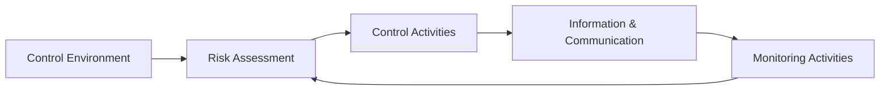

## 16.3 COSO Framework Applied to Cybersecurity Risks

Effective cybersecurity risk management programs often draw on well-established internal control frameworks to ensure consistency, reliability, and thoroughness in design and execution. One of the most widely recognized frameworks in this space is the Committee of Sponsoring Organizations of the Treadway Commission (COSO) Internal Control – Integrated Framework (“the COSO Framework”). Although traditionally leveraged for financial reporting and operational effectiveness, the COSO Framework provides valuable guidance for evaluating and addressing cybersecurity risks.

This section explores how organizations can apply each of the five COSO components to strengthen their cybersecurity posture. We will present a comprehensive crosswalk linking COSO components to common cybersecurity controls, highlight practical scenarios, and outline best practices and pitfalls to avoid.

  
Understanding the COSO Framework

The COSO Framework is built on five integrated components, each supporting a robust system of internal control:  
• Control Environment  
• Risk Assessment  
• Control Activities  
• Information & Communication  
• Monitoring Activities  

These components are interdependent and function collectively to help organizations achieve key objectives. When mapped to cybersecurity, they guide the creation of policies, structures, and processes designed to prevent, detect, respond to, and recover from cyber threats.  

Below is a high-level Mermaid diagram illustrating the flow among these components when applied to cybersecurity:

The cyclical flow in the diagram emphasizes continual feedback and iterative improvement. While the graphic simplifies complex interconnections, it highlights the fundamental COSO principle that controls must be monitored and evaluated consistently, with the results feeding back into ongoing risk assessments.

  
Crosswalk of COSO Components to Cybersecurity Controls

Organizations commonly use the following crosswalk to align COSO components with cybersecurity controls and processes:

| COSO Component             | Cybersecurity Application                                                                                                                          |
|----------------------------|-----------------------------------------------------------------------------------------------------------------------------------------------------|
| Control Environment        | Senior leadership sets a “tone at the top,” emphasizing ethical behavior, accountability, and the importance of cybersecurity. A clear organizational structure ensures defined roles for cybersecurity oversight. Establishing a code of conduct addresses cyber awareness and expectations (e.g., password handling).                                           |
| Risk Assessment            | Ongoing identification of cyber threats and vulnerabilities. Formal risk analyses measure the likelihood and potential impact of cyber events. Dynamically updated enterprise risk management (ERM) processes, including scenario planning for ransomware, data breaches, and insider threats.                                                              |
| Control Activities         | Cybersecurity policies, procedures, access control mechanisms, network segmentation, multifactor authentication (MFA), and regular patching. Protocols for secure configurations of systems and devices. Structured software development lifecycles (SDLC) with embedded security reviews at each stage.                                                         |
| Information & Communication| Clear channels that inform relevant stakeholders about cyber risks. Regular security awareness training, phishing simulations, and communications about discovered vulnerabilities. Open feedback loops to facilitate threat intelligence sharing. Reporting lines to senior management and the board regarding cyber risks and mitigation results.                                    |
| Monitoring Activities      | Continuous assessment of control effectiveness through automated monitoring, vulnerability scans, and penetration testing. Independent audits evaluating compliance with established frameworks (e.g., NIST, COBIT). Real-time dashboards and incident alerts. Post-incident evaluation of controls, including root cause analysis.                                   |

This table shows how the COSO Framework’s generic concepts translate into day-to-day cybersecurity practices, ensuring each component contributes to the overarching cybersecurity strategy.

  
Breaking Down Each Component in a Cybersecurity Context

Control Environment  
At its core, the control environment establishes values, beliefs, and a culture that supports cybersecurity. Leaders promote an ethical culture and underscore the importance of following technology policies. Clear organizational structures—such as a Chief Information Security Officer (CISO) or innovation committees—demonstrate top management’s commitment. In addition, the presence of robust IT governance, per COBIT (discussed in Chapter 3: Governance, Frameworks, and Regulatory Environment), reinforces the alignment of cybersecurity goals with organizational objectives.

  
Risk Assessment  
Cyber risk assessment means identifying, prioritizing, and evaluating the threats and vulnerabilities relevant to an organization. From mapping possible ransomware vectors to analyzing emerging risks posed by cloud environments, risk assessment drives strategic decisions on budget allocations and control implementations. The exercise typically involves modeling the following relationship:

$$
\text{Cyber Risk} = \text{Threat Actor Sophistication} \times \text{Vulnerability Exposure} \times \text{Impact Severity}
$$

Although simplified, this highlights that even a low-probability or seemingly minor threat can become critical if the impact severity is large enough (e.g., a significant data breach of sensitive financial records). Periodic updates to risk assessment processes ensure that new technologies—such as IoT devices or AI-based analytics—do not introduce blind spots.

  
Control Activities  
These are the specific cybersecurity “tools in the toolbox.” They encompass:  
• Preventive Controls: Firewalls, MFA, network segmentation, encryption.  
• Detective Controls: Intrusion detection systems, log monitoring, security incident event management (SIEM) tools.  
• Corrective Controls: Patch management programs, vulnerability remediation, automated quarantine of infected endpoints.  

Developing or leveraging standardized frameworks (like ISO 27001 or NIST SP 800-53) can guide organizations in selecting the right controls. Generally, organizations start with baseline controls, then tailor them to unique operational risks. For example, banks may invest extensively in encryption and advanced anomaly detection tools, while manufacturers may focus on network segregation for production lines secured from corporate networks.

  
Information & Communication  
Cyber threats thrive on a lack of transparency and information flow. Clear, consistent, and reliable channels of communication are essential. Effective security awareness programs are a prime example: employees are regularly trained on proper handling of confidential data, responding to phishing attempts, and reporting suspicious activities. Additionally, leadership must be updated on the status of cybersecurity initiatives at scheduled intervals (e.g., board meetings).  

Real-time communication tools, such as centralized threat intelligence platforms or vulnerability management dashboards, also enhance situational awareness. A well-informed workforce stands as one of the most cost-effective ways to mitigate cybersecurity incidents.

  
Monitoring Activities  
Cyber threats evolve constantly, requiring continuous oversight and evaluation of control effectiveness. Monitoring activities generally occur through:  
• Automated Tools: SIEM solutions that correlate log data, vulnerability scanners that continuously probe networks and systems for weaknesses, or advanced endpoint detection and response (EDR) suites with real-time alerting.  
• Independent Assessments: Internal/external audits, IT security reviews, penetration tests, compliance checks.  
• Real-Time Dashboards: Provide management insights into the organization’s cyber posture, including open vulnerabilities, incident response status, and key metrics (e.g., mean time to detect or respond).  

Monitoring activities facilitate ongoing improvements in control measures, thereby creating a feedback loop to the risk assessment component. If new weaknesses are found, the risk register is updated, control implementations are reassessed, and the entire system is better aligned with organizational needs and threat landscapes.

  
Practical Example: Mid-Sized Manufacturing Firm

To see how these COSO components work in practice, imagine a mid-sized manufacturing company—“FabricMakers Ltd.”—concerned about intellectual property theft and potential downtime from ransomware attacks.  

1. Control Environment: The CFO and CEO openly emphasize a security-first culture, establishing a cross-departmental cybersecurity committee. They invest in staff training, unify the messaging about security expectations, and allocate budget to essential cybersecurity measures.  

2. Risk Assessment: FabricMakers Ltd. conducts external threat intelligence analysis to identify top concerns specific to the manufacturing industry—such as sabotage of production schedules or targeted ransomware. Then they calculate potential financial losses if proprietary design files were stolen or if production was shut down.  

3. Control Activities: Based on assessed risks, the organization installs multifactor authentication for user logins, segments the corporate network from the production line, and deploys next-generation antivirus solutions. They also adopt a rigorous patch management schedule, ensuring the latest security updates are applied on all critical servers.  

4. Information & Communication: Management issues monthly security bulletins describing recent phishing attempts. They also use an internal portal to share updated security policies, list top threats spotted by the IT security team, and highlight examples of successful staff vigilance (e.g., employee who reported suspicious email attachments).  

5. Monitoring Activities: FabricMakers Ltd. engages a third-party penetration testing firm annually. The IT department utilizes automated vulnerability management scanners weekly to detect misconfigurations or outdated software. Results are fed into dashboards that generate real-time alerts for system administrators. Regular reviews identify recurring control gaps and feed that knowledge back into the risk assessment cycle.  

This example underscores how each COSO component can be meaningfully integrated into an operational environment, helping ensure reliable cybersecurity practices that enable smooth production operations while safeguarding digital assets.

  
Benefits of Applying COSO to Cybersecurity

• Holistic Integration: COSO grounds cybersecurity within a broader framework of governance, risk, and control considerations.  
• Accountability and Culture: It clarifies roles and elevates cybersecurity to a leadership-level issue, preventing siloed approaches.  
• Scalability: Applicable to organizations of various sizes and industries, each can tailor the framework to specific risk profiles.  
• Continuous Improvement: Emphasizes iterative monitoring and feedback loops ensuring evolving threats are not ignored.  
• Alignment with Other Frameworks: COSO is not used in isolation; it dovetails with frameworks like COBIT (for IT governance), NIST Cybersecurity Framework, or ISO 27001, creating synergy and consistency.

  
Common Pitfalls

• Treating Cybersecurity in Isolation: Organizations focusing solely on IT without leadership buy-in risk inadequate resource allocation and cultural support.  
• Overwhelming Complexity: Implementing too many controls without strategic prioritization can create confusion, compliance fatigue, and resource inefficiency.  
• Inadequate Monitoring: Controls that are not continuously tested or updated become stale, leaving organizations vulnerable to emerging attacks.  
• Incomplete Communication Channels: If security policies don’t filter down effectively, employees may neglect critical cybersecurity safeguards.

  
Best Practices and Implementation Strategies

• Executive Sponsorship: Ensure the board and C-suite champion security initiatives. Tie cybersecurity metrics to performance indicators for accountability.  
• Routine Risk Analysis: Schedule quarterly evaluations or real-time scanning for dynamic, high-risk environments.  
• Layered Controls: Employ a defense-in-depth strategy (see also Section 16.2 for more on defense-in-depth approaches). For instance, combine strong passwords with MFA, network segmentation, encryption at rest and in transit, and EDR solutions.  
• Continuous Learning: Encourage staff to attend frequent training sessions, and incorporate threat intelligence updates to keep the workforce vigilant.  
• Documentation & Evidence: Maintain thorough records of control changes, test results, and incident response activities. This documentation is critical for audits, insurance claims, and compliance reporting.

  
References and Further Reading

• COSO: “Internal Control – Integrated Framework” (2013) – Official guidance document.  
• AICPA: “SOC for Cybersecurity” – Provides an approach to communicate about cybersecurity risk management efforts.  
• NIST Special Publication 800-53 – Catalog of security and privacy controls.  
• COBIT 2019 – Framework for IT governance and management, aligned with COSO.  
• ISO/IEC 27001 – International Standard for information security management systems.

  
By weaving the COSO framework’s five components into their cybersecurity programs, organizations gain a powerful structure for identifying cyber risks, implementing appropriate controls, and ensuring continuous improvement. This approach reinforces a top-down culture of security, systematic risk evaluation, robust control activities, transparent communication, and essential monitoring practices—all vital in today’s increasingly complex and high-stakes threat landscape.

  
## Fortify Your Cybersecurity Knowledge: COSO Framework Quiz



### Under the COSO Framework, the “tone at the top” concept is best represented by which component?  
- [ ] Risk Assessment  
- [x] Control Environment  
- [ ] Control Activities  
- [ ] Monitoring Activities  

> **Explanation:** The “tone at the top” describes leadership’s commitment to ethical values, integrity, and control, which directly pertains to the Control Environment.

### Which of the following is considered a detective cybersecurity control aligned with COSO’s Control Activities?  
- [ ] Firewall rules that block malicious traffic  
- [ ] Two-factor authentication  
- [x] Intrusion detection system (IDS)  
- [ ] Security awareness training  

> **Explanation:** While firewall rules and MFA are preventive controls, an intrusion detection system monitors network and system activities to detect threats, making it a detective control.

### For effective management of cybersecurity risks under COSO’s Risk Assessment component, an organization should:  
- [x] Conduct regular threat and vulnerability assessments  
- [ ] Immediately implement all possible security controls  
- [ ] Focus only on external threats  
- [ ] Defer decisions to the IT department alone  

> **Explanation:** Ongoing risk assessment requires a holistic view of both internal and external threats. Implementing all controls blindly can be inefficient; the goal is to address prioritized risks systematically.

### Which COSO component ensures clear and consistent communication of cybersecurity policies across all organizational levels?  
- [ ] Control Environment  
- [ ] Risk Assessment  
- [x] Information & Communication  
- [ ] Monitoring Activities  

> **Explanation:** Information & Communication deals with disseminating relevant, timely information across the organization. This includes security updates, training, and effective policy communication.

### How do Monitoring Activities strengthen a cybersecurity program in alignment with COSO principles?  
- [ ] By eliminating the need for internal audits  
- [ ] By ending iterative risk assessments  
- [x] By continuously measuring the effectiveness of controls in place  
- [ ] By transferring all risk to a third-party vendor  

> **Explanation:** Monitoring Activities involve ongoing evaluations, audits, and reviews that test how well controls work in practice, leading to improvements over time.

### Which scenario best illustrates the Control Environment supporting cybersecurity initiatives?  
- [x] Senior executives publicly prioritizing cybersecurity and allocating necessary budgets  
- [ ] A single departmental manager implementing encryption on one server  
- [ ] A focus on cost savings by avoiding advanced cybersecurity tools  
- [ ] Individual employees deciding if they want to comply with security policies  

> **Explanation:** Control Environment begins with leadership emphasis and resource commitment, signaling organizational seriousness about cybersecurity culture.

### Why is a strong feedback loop among COSO’s components critical for cyber risk management?  
- [x] It ensures emerging threats are reassessed, and controls are updated accordingly  
- [ ] It eliminates the need for third-party risk assessments  
- [ ] It provides a shortcut for bypassing risk assessment steps  
- [ ] It focuses the organization solely on compliance tasks  

> **Explanation:** Cyber threats evolve rapidly, and maintaining a feedback loop among COSO components helps keep the organization’s protective measures current.

### Which of the following best describes a shortcoming if the organization’s COSO “Information & Communication” component is weak?  
- [ ] Excessive security policy documentation  
- [ ] Overstaffing in the IT department  
- [x] Employees remain unaware of threat reports and cannot respond adequately  
- [ ] Overreliance on anti-malware software  

> **Explanation:** When Information & Communication is weak, employees and stakeholders may not receive timely updates, leaving them illequipped to handle threats effectively.

### In the context of COSO’s Control Activities, which measure is both detective and corrective when implemented properly?  
- [ ] Firewalls  
- [ ] Encryption at rest  
- [x] Intrusion detection and response system  
- [ ] Password policy  

> **Explanation:** Intrusion detection and response systems can detect ongoing breaches (detective) while also isolating or neutralizing threats in real-time (corrective).

### True or False: Applying the COSO Framework to cybersecurity allows organizations to ignore other recognized frameworks, such as NIST or COBIT.  
- [ ] True  
- [x] False  

> **Explanation:** COSO can coexist with other frameworks. In practice, organizations often integrate COSO with NIST or COBIT to create a comprehensive cybersecurity management program.



  
## For Additional Practice and Deeper Preparation

### [Information Systems and Controls (ISC)](https://www.udemy.com/course/isc-cpa-mock-exams/?referralCode=E1217303222935C5E464)

**Information Systems and Controls (ISC) CPA Mocks:** 6 Full (1,500 Qs), Harder Than Real! In-Depth & Clear. Crush With Confidence!

- Tackle full-length mock exams designed to mirror real ISC questions.  
- Refine your exam-day strategies with detailed, step-by-step solutions for every scenario.  
- Explore in-depth rationales that reinforce higher-level concepts, giving you an edge on test day.  
- Boost confidence and minimize anxiety by mastering every corner of the ISC blueprint.  
- Perfect for those seeking exceptionally hard mocks and real-world readiness.  

_Disclaimer: This course is not endorsed by or affiliated with the AICPA, NASBA, or any official CPA Examination authority. All content is for educational and preparatory purposes only._
