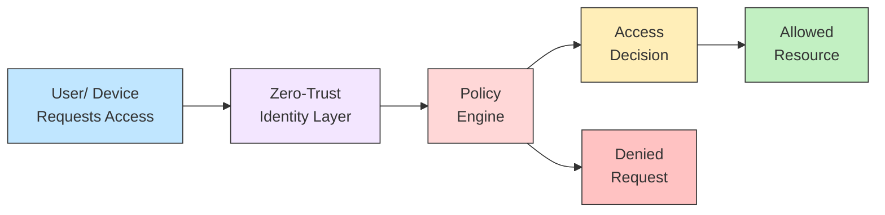

## 16.4 Zero‑Trust Approach to Security

Zero‑Trust security is an evolving cybersecurity framework that upends the traditional notion of a perimeter‑centric defense. Rather than implicitly trusting anything or anyone inside the corporate network, Zero‑Trust starts from the principle of “trust no one, verify everything.” This short phrase encapsulates a seismic shift in how organizations approach security, requiring verification of user and device identities, continual analysis of system behaviors, and dynamic segmentation of network resources.

A Zero‑Trust model can be beneficial to CPAs, auditors, and other professionals who advise organizations on safeguarding financial and operational data. This chapter addresses how Zero‑Trust differs from perimeter-focused defenses, explores its core principles, highlights real-world deployment steps, and discusses key considerations essential for CPAs evaluating an organization’s cybersecurity posture. By adopting Zero‑Trust, organizations can transform from a static defensive perimeter to a continuously adaptive and granular system of access controls.

---

Understanding how Zero‑Trust works—especially as it pertains to internal audits, financial reporting, and compliance assessments—enables CPAs to offer more practical advice to clients seeking to protect corporate data, comply with regulations, and preempt security incidents. This section builds upon earlier foundational security strategies in this chapter (see 16.2 Cybersecurity Strategies: Layers, Defense-in-Depth, Zero-Trust), expanding the discussion on zero-trust concepts, practical deployment guidelines, and critical considerations for assurance engagements.

  
Introduction to the Zero‑Trust Concept

The Zero‑Trust concept rose to prominence as the scale and sophistication of cyber threats escalated. Traditional perimeter-based security models often rely on robust firewalls and network gateways, assuming that malicious activity primarily originates outside the corporate environment. Once a user or system is inside the perimeter (physically or virtually), they are largely granted extensive trust—often more than necessary. This “castle-and-moat” design leaves organizations vulnerable when attackers or malicious insiders gain internal footholds, allowing them to move laterally across an environment with minimal oversight.

Zero‑Trust removes this inherent trust, requiring every request for access to resources—whether from inside or outside the network—to be explicitly authenticated, authorized, and continuously inspected. By micro-segmenting networks and controlling all east-west (lateral) and north-south (inbound/outbound) traffic, organizations can minimize the risk of large-scale breaches and better protect sensitive data assets. This micro-segmentation is especially relevant to CPAs and assurance professionals who need evidence that an organization has strong internal controls around financial and operational data.

Key Principles of Zero‑Trust

Continuous Verification and Authentication  
Zero‑Trust environments demand perpetual validation of user identities, device health, and session contexts. Instead of a single login event granting broad privileges, each resource request must be re-verified to ensure current compliance with access policies. This might include requiring Multi-Factor Authentication (MFA) for even routine tasks or verifying whether a device meets endpoint security criteria.

Least Privilege Access  
Granting the least amount of privilege necessary for a user or system to perform a specific task is a cornerstone of Zero‑Trust. When integrated with role-based access controls (RBAC) and the principle of least privilege, the environment drastically reduces the attack surface. For instance, a junior accountant in the Payables department should not have read or write privileges to the ledger system that only senior accountants in the Receivables department require.

Micro-Segmentation  
Organizations adopting Zero‑Trust typically segment their networks into smaller, granular zones based on functions, security risk, or regulatory requirements. By creating “trust boundaries” around critical data repositories (like an ERP system or an accounting information system), attackers who compromise one segment cannot easily pivot to another.

Advanced Monitoring and Analytics  
Zero‑Trust typically leverages behavioral analytics, machine learning, or AI-driven platforms to detect anomalies and suspicious activities. Coupled with continuous real-time monitoring, these systems help security teams flag potential breaches or anomalies in user behavior—for instance, if a user’s account attempts to access a sensitive database at an unusual time or from an unrecognized device.

Automation and Orchestration  
Zero‑Trust strategies often rely on automated processes to enforce policies. For example, advanced orchestration tools might automatically quarantine suspicious endpoints, trigger identity re-verification, or create detailed audit logs for compliance reviews. For CPAs, these auto-generated logs and audit trails are powerful tools to validate internal controls over financial reporting, especially relevant in SOC 1® or SOC 2® engagements (see Chapters 23–24).

How Zero‑Trust Differs from Traditional Perimeter Defenses

Traditional approaches to cybersecurity have typically operated on the assumption that there is a boundary between an “internal network” and the “outside world.” Firewalls, intrusion prevention systems (IPS), and other perimeter technologies form a fortress at the boundary. Users or devices with access to the internal network are implicitly trusted to move freely inside.

The Zero‑Trust approach, by contrast, takes for granted that internal networks are not inherently safe. Whether a user is logging in from an office desk or a public Wi-Fi hotspot, they get the same level of continuous scrutiny. With broader adoption of cloud services, remote work, offshore BPO (Business Process Outsourcing) partners, and third-party vendors connecting to the environment, the perimeter line has blurred to the point of irrelevance. Under Zero‑Trust:

• Every user is authenticated, every device is validated, and every request is authorized—even if originating internally.  
• Access is segmented and minimized to only what is needed.  
• Monitoring spans not only perimeter gateways but also internal east-west traffic and user/device behavior.  

From a CPA perspective, Zero‑Trust fosters controls that align well with COSO’s Internal Control – Integrated Framework and COBIT 2019’s governance to continuously monitor and evaluate risks and controls surrounding information systems. This approach creates layers of certainty about who is accessing which business processes, ensuring that potential malicious activities are contained or deterred at an early stage.

Zero‑Trust Implementation Roadmap

Shifting to a Zero‑Trust model requires strategic planning, robust change management, and collaboration across departments. Below is a high-level roadmap that organizations often follow:

Assess Current State and Gaps  
Organizations begin by inventorying their existing IT environment and reviewing the state of user access rights, device management, and network segmentation. The goal is to identify critical assets (e.g., ERP modules, financial statement data, or personally identifiable information regulated by the GDPR), as well as legacy systems that may not natively support zero-trust features.

Define Policies and Classify Assets  
Organizations create or refine their security policies and data classification models. This ensures that all assets—from top-tier financial databases to departmental file shares—are placed in the right segments with the right access rules. Policies might set more stringent authentication requirements for systems containing financial data subject to external audit.

Select Technological Solutions  
Zero‑Trust often necessitates new or upgraded technologies, such as identity and access management (IAM) solutions, software-defined perimeter (SDP) technology, micro-segmentation tools, and advanced endpoint detection and response (EDR) solutions. CPA professionals may find that these solutions integrate well into broader IT control frameworks, generating robust audit logs that facilitate testing for SOC engagements.

Pilot, Test, and Iterate  
It is generally best practice to conduct a Zero‑Trust pilot in a confined environment. For example, an organization might begin with micro-segmentation of just one business unit, such as payroll systems or the financial reporting module. This pilot allows for iterative adjustments and ensures minimal disruption to daily operations.

Roll Out in Phases and Offer Training  
Once the pilot is assessed, the approach can be deployed across other areas of the enterprise. Proper change management is essential: employees, internal auditors, and third-party vendors must understand new security procedures, multi-factor authentication steps, device posture checks, and potential restrictions on network access.

Ongoing Monitoring and Improvement  
A true Zero‑Trust architecture requires continual refinement. Threat landscapes evolve, business operations change, and new technologies emerge. Regular internal audits, vulnerability scans, and penetration tests should be performed to validate that policies remain current. Log reviews and anomaly detection will help identify misuse or suspicious activity early.

Diagram: Zero‑Trust Architecture Example

Below is a simplified Mermaid.js diagram illustrating a Zero‑Trust architecture in action, focusing on how users and devices authenticate to reach protected resources:

Explanation of the Diagram  
• User/Device Requests Access: A person or machine seeks to connect to a system or data repository.  
• Zero‑Trust Identity Layer: Verifies credentials, device compliance, location, and security posture.  
• Policy Engine: Evaluates contextual details—such as user role, time of access, or endpoint integrity—against defined policies and risk thresholds.  
• Access Decision: The outcome based on policy evaluation, resulting in either granting or denying access.  
• Allowed Resource: Users pass the checks and gain only the specifically required permissions, thus ensuring principle of least privilege.  
• Denied Request: If conditions fail to meet policy requirements, the user or device is blocked, and logs record the event for security audits.

Practical Deployment Guidelines

Start Micro  
Rather than implementing an entire Zero‑Trust framework at once, organizations typically start small. For example, an enterprise may first require multi-factor authentication for all access to the main financial ledger or restrict lateral movement within the cloud environment where ERP transactions occur. This allows teams to fix critical gaps without overwhelming employees with constant prompts or overhead.

Refine Identity and Access Management (IAM)  
IAM solutions form the backbone of a Zero‑Trust approach. A robust IAM system ensures that identities—whether for end users, service accounts, or third-party contractors—are managed consistently. Automatic provisioning and de-provisioning routines should align with HR records to ensure that only active employees retain access.

Segment High‑Value Assets  
Given that many compliance and assurance engagements focus on systems with financial data, micro-segmenting around these high-value assets is crucial. Segments should require stricter authentication steps (like context-aware MFA) and continuous monitoring for suspicious behaviors.  

Use Device Posture Checks  
Apart from verifying user credentials, a Zero‑Trust model also assesses the device posture. This includes verifying security software, verifying patches on operating systems, scanning for known malware, and ensuring that the device meets minimum security standards.

Log and Monitor Everything  
A hallmark of Zero‑Trust is pervasive visibility. Organizations log authentication attempts, device connections, and traffic flows. Specialized Security Information and Event Management (SIEM) tools are then applied to analyze these logs, flag anomalies, and trigger alerts. From a CPA perspective, these logs serve as audit evidence when testing controls.

Real‑World Example

Consider a mid-sized manufacturer that is diversifying into online sales. Historically, the company’s security relied on a single firewall and an Intrusion Detection System (IDS) for inbound traffic. Internally, employees accessed a shared network with minimal segmentation. As the company expands, they face an increased threat from phishing attacks, ransomware, and potential insider risks.

With Zero‑Trust, the manufacturer:  
• Enforces MFA for all remote employees logging into accounting software.  
• Segments the internal network so that design engineers cannot access production finance data without additional approval.  
• Deploys a cloud-based Policy Engine that checks each device’s security compliance.  
• Installs advanced endpoint protection that, upon detecting anomalies, instructs the identity layer to restrict further actions on compromised devices.  

This multi-layered approach pays immediate dividends when a malicious email carrying ransomware attempts to exploit an unpatched Windows laptop. The device posture check identifies a missing critical patch, quarantines the laptop from sensitive resources, and alerts the IT security team. The organization thereby avoids a large-scale breach that would have compromised the ERP system and potentially led to material misstatements in financial records.

Challenges and Common Pitfalls

Complexity and Cost  
Deploying Zero‑Trust can be sophisticated and resource-intensive. Organizations must invest in upgraded identity management tools, potentially overhaul legacy applications, and train staff extensively. Without proper planning, this complexity can slow adoption and create confusion.

Cultural Resistance  
Employees unfamiliar with Zero‑Trust may bristle at repeated MFA prompts or restricted network paths. Executive sponsorship and change management programs are essential to reduce friction and encourage acceptance.

Integration with Legacy Systems  
Established systems and specialized industrial control systems often do not integrate easily with Zero‑Trust frameworks. Workarounds, such as segmented enclaves or custom middleware, may be necessary.

Overreliance on Technology Alone  
Zero‑Trust is as much a process and mindset as it is a technology. Treating it as merely another security tool can result in incomplete adoption. Comprehensive policies, user training, and continuous improvement cycles remain critical to success.

Lack of Executive Buy-In  
To remain effective, Zero‑Trust must be endorsed at a top management level, with adequate funding for modernization. Without leadership-level commitment, Zero‑Trust initiatives can become under-resourced pilot programs, failing to deliver the intended benefits.

Implications for CPAs and Auditors

From a CPA’s standpoint, Zero‑Trust directly impacts the assessment of internal controls over financial reporting, risk management, and IT governance:

• Improved Auditable Evidence: Continuous logging and identity verification produce robust audit trails. This data can simplify evidence collection during SOC 1® and SOC 2® engagements, allowing auditors to see how and when financial data was accessed.  
• Enhanced Segregation of Duties: By integrating Zero‑Trust with RBAC, organizations can better enforce segregation of duties for financial processes, a central COSO principle. Access to certain modules or transactions can be systematically restricted and rigorously monitored.  
• Increased Need for Specialized Skills: Auditing Zero‑Trust deployments requires a higher level of technical proficiency. CPAs may need to develop or source expertise in network segmentation, IAM solutions, and SIEM analytics.  
• Alignment with Regulatory Requirements: Regulations like HIPAA, PCI DSS, and GDPR often mandate strict data access controls. Zero‑Trust can streamline compliance by design, ensuring that privacy and confidentiality safeguards are continuously enforced.  
• Higher Accountability: Automations within Zero‑Trust systems log changes in real-time, making it easier to identify control weaknesses or fraudulent activities. This heightened traceability can mitigate liability for organizations in the event of data breaches or financial inaccuracies.

As zero-trust frameworks align strongly with COSO’s Internal Control Components (Control Environment, Risk Assessment, Control Activities, Information & Communication, and Monitoring), CPAs can play a pivotal role in guiding strategic decisions, testing relevant controls, and providing assurance around these advanced security deployments.

Continuous Improvement and the Future of Zero‑Trust

Zero‑Trust is not a static concept; instead, it is continually evolving to meet emerging threats and business changes. Future expansions might integrate artificial intelligence (AI) more deeply, providing instantaneous control responses to anomalies, or incorporate zero-knowledge proofs that secure cryptographic transactions. As remote work, hybrid cloud models, and partner networks continue to blur organizational boundaries, the Zero‑Trust paradigm is poised to become a security mainstay.

For CPAs and finance professionals, staying informed about Zero‑Trust technologies and frameworks became increasingly relevant as organizations shift from standard perimeter-based controls to more dynamic, user-centric models. By understanding how Zero‑Trust fosters robust IT governance and aligns with recognized best practices (such as COBIT 2019, COSO ERM, and AICPA trust services criteria), finance and audit professionals can offer forward-looking guidance that secures not only data but also enterprise value.

References and Further Reading

• NIST Special Publication 800-207: Zero Trust Architecture.  
• AICPA’s Trust Services Criteria (Relevant for SOC 2® Engagements).  
• COBIT 2019 Framework for IT Governance and Management.  
• Cloud Security Alliance (CSA) Guidelines on Zero Trust.  
• “Zero-Trust Security: A Model for the Future of Information Security,” by Forrester Research.  

## Test Your Knowledge of Zero‑Trust Security



### Which principle best captures the essence of a Zero‑Trust approach?

- [ ] Implicit trust for all internal devices.  
- [ ] One-time verification at the perimeter.  
- [x] Continuous verification of all users and devices.  
- [ ] Multi-level encryption without monitoring.  

> **Explanation:** Zero‑Trust continuously verifies every user, device, and network request, ensuring that access is explicitly granted rather than assumed.

### Which of the following is a defining characteristic of Zero‑Trust versus a traditional perimeter defense?

- [x] Authentication and access control occur for each individual resource request.  
- [ ] The firewall is placed only at the boundary of the network.  
- [ ] Zero‑Trust supports unlimited lateral movement.  
- [ ] Users inside the network are inherently trusted.  

> **Explanation:** In Zero‑Trust architectures, resources require continuous authentication and authorization, significantly reducing the implicit trust often granted in perimeter-centric models.

### When preparing a Zero‑Trust pilot, which area is typically the first to consider?

- [x] A highly critical segment containing financial or operational data.  
- [ ] Low-value marketing data accessible by everyone.  
- [ ] Fully deprecated systems with no operational dependencies.  
- [ ] Nonessential personal data used for testing.  

> **Explanation:** Starting with a critical segment ensures that the Zero‑Trust pilot adds immediate risk reduction and demonstrates tangible benefits to the organization.

### What is an essential protection mechanism in Zero‑Trust models?

- [ ] Deploying a single company-wide password.  
- [ ] Relying solely on encryption with no monitoring.  
- [x] Micro-segmentation of the network.  
- [ ] Providing administrative rights to all end users for flexibility.  

> **Explanation:** Micro-segmentation controls lateral movement and limits the scope of a compromise, aligning with the bedrock principle of Zero‑Trust security.

### Which statement best describes how CPAs can benefit from an organization’s Zero‑Trust adoption?

- [x] CPAs can utilize detailed audit logs and traceability to validate internal controls.  
- [ ] CPAs generally cannot assess Zero‑Trust-equipped systems.  
- [ ] CPAs only focus on cost-benefit analysis and not on technical controls.  
- [ ] Zero‑Trust systems eliminate the need for external audits.  

> **Explanation:** Zero‑Trust produces comprehensive logs and traceable access controls, thereby simplifying evidence gathering and improving assurance engagements.

### Which of the following might help reduce employee pushback when rolling out Zero‑Trust?

- [ ] Removing all MFA requirements immediately to build trust.  
- [x] Outlining new security, access processes, and providing training sessions.  
- [ ] Providing direct administrative privileges to everyone initially.  
- [ ] Implementing Zero‑Trust without prior communication.  

> **Explanation:** Proper communication, training, and executive sponsorship help employees adapt to changes that accompany Zero‑Trust deployments.

### What is the primary distinction in Zero‑Trust enforcement?

- [ ] Only external networks require security controls.  
- [ ] Only internal networks require security controls.  
- [ ] Separate teams for perimeter and internal networks.  
- [x] Treat both internal and external requests equally for authentication.  

> **Explanation:** Zero‑Trust treats every access attempt with the same rigor, regardless of whether the request is initiated internally or externally.

### What is a recommended approach for rolling out Zero‑Trust in an organization?

- [ ] A single-step enterprise-wide launch.  
- [x] Phased, starting with critical assets or limited business units.  
- [ ] Installing multiple physical firewalls without user training.  
- [ ] Implementing all advanced features simultaneously to minimize time.  

> **Explanation:** Phasing in Zero‑Trust gradually allows for controlled pilot testing, reduces disruptions, and offers opportunities for iterative improvements.

### In a Zero‑Trust environment, which component typically enforces access policies?

- [ ] Only the perimeter network firewall.  
- [x] A policy engine that assesses user identity, device posture, and context.  
- [ ] Legacy routers that block inbound IP addresses.  
- [ ] Standalone antivirus software on endpoints.  

> **Explanation:** A policy engine is central to Zero‑Trust, evaluating each request’s context (user, device, location, etc.) against the organization’s security policies.

### Zero‑Trust can be summarized by which statement?

- [x] “Never trust, always verify.”  
- [ ] “Trust but verify.”  
- [ ] “Perimeter defense is always enough.”  
- [ ] “Most employees should have administrative privileges.”  

> **Explanation:** A core Zero‑Trust mantra is “never trust, always verify,” emphasizing continuous authentication and authorization for every resource request.



## For Additional Practice and Deeper Preparation

### [Information Systems and Controls (ISC)](https://www.udemy.com/course/isc-cpa-mock-exams/?referralCode=E1217303222935C5E464)

Information Systems and Controls (ISC) CPA Mocks: 6 Full (1,500 Qs), Harder Than Real! In-Depth & Clear. Crush With Confidence!

• Tackle full-length mock exams designed to mirror real ISC questions.  
• Refine your exam-day strategies with detailed, step-by-step solutions for every scenario.  
• Explore in-depth rationales that reinforce higher-level concepts, giving you an edge on test day.  
• Boost confidence and minimize anxiety by mastering every corner of the ISC blueprint.  
• Perfect for those seeking exceptionally hard mocks and real-world readiness.  

_Disclaimer: This course is not endorsed by or affiliated with the AICPA, NASBA, or any official CPA Examination authority. All content is for educational and preparatory purposes only._
