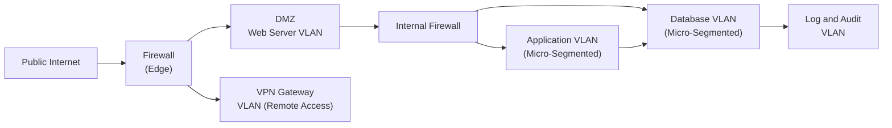

## 17.1 Network Segmentation and Isolation

Network segmentation and isolation are critical components of an effective security architecture. By dividing a network into discrete segments and strictly controlling communication among them, organizations dramatically reduce the scope and impact of potential security breaches. This concept is particularly important for Certified Public Accountants (CPAs) and IT auditors who assess the security and reliability of information systems handling sensitive financial data. Proper segmentation (using methods such as VLANs, DMZs, and micro-segmentation) not only limits threat actor movement but also enhances compliance with frameworks and standards ranging from COSO and COBIT to PCI DSS and HIPAA.

This section details the most common approaches to segmentation, discusses how these methods reinforce the broader IT control environment, and emphasizes best practices for auditors and CPAs when evaluating network security as part of an engagement.

-------------------------------------------------------------------------------

### Overview of Network Segmentation Principles

Network segmentation is the practice of dividing a large, flat network into multiple layers or segments with carefully regulated access rules (e.g., firewalls, access control lists, router configurations). The goal is to reduce the attack surface and limit lateral movement. When properly implemented, segmentation ensures that even if a malicious actor gains unauthorized access to one part of the network, they have no—or very limited—means of moving to other segments containing sensitive data or mission-critical systems. 

Key benefits of network segmentation:
• Containment of threats and malware.  
• Reduced scope for compliance audits (e.g., PCI DSS, SOC 2®).  
• Enhanced performance by reducing broadcast traffic in large networks.  
• Granular control over user and system access to resources.  
• Improved monitoring, as traffic within and between segments can be more effectively logged and analyzed.  

Segmentation can be done at multiple layers—from physical separation of networks (air-gapped or dedicated hardware) to logical segmentation via VLANs, ACLs, and emerging technologies like micro-segmentation with software-defined networking (SDN). Below, we examine each key segmentation strategy.

-------------------------------------------------------------------------------

### VLANs (Virtual Local Area Networks)

A Virtual Local Area Network (VLAN) is a logical subdivision of a physical network. VLANs allow network administrators to allocate different network segments on the same physical switch infrastructure, grouping devices by function, user group, or security requirements—rather than by physical location. VLAN technology is based on the IEEE 802.1Q standard, which applies “tags” to Ethernet frames.

Key points:  
• VLAN tagging and trunking: In multi-switch environments, trunk ports carry traffic from several VLANs simultaneously, with tags identifying which VLAN a data frame belongs to.  
• Security implications: By restricting traffic within each VLAN and controlling inter-VLAN routing via firewalls or routing policies, administrators limit lateral movement.  
• Common scenarios: Separating finance teams from the rest of the corporate network; creating a dedicated VLAN for guest Wi-Fi; isolating manufacturing control systems or IoT devices; or segregating sensitive environments (e.g., an HR server with PII).  
• Best practices: Keep VLAN design simple, enforce strict policies for inter-VLAN communication, implement strong authentication for administrative access to VLAN configuration, and regularly audit VLAN membership to avoid “VLAN hopping” attacks or misconfigurations.

-------------------------------------------------------------------------------

### DMZ (Demilitarized Zone)

A DMZ (Demilitarized Zone) is a perimeter network or subnetwork designed to expose an organization’s external-facing services (such as web, email, DNS, or e-commerce servers) to the internet while shielding the internal network from direct exposure. A DMZ typically has its own firewall or set of firewall rules, limiting inbound and outbound traffic to only what is necessary.

Common DMZ design:
• A perimeter (or external) firewall separates the DMZ from the internet.  
• A second firewall (or an internal interface on the same device) separates the DMZ from the trusted internal network.  
• Traffic that traverses from the internet to a DMZ server cannot directly route into the internal segment unless explicitly allowed by firewall rules.  

This isolation ensures that if a DMZ server is compromised, attackers will have more difficulty accessing critical internal resources. For CPAs auditing e-commerce or financial systems, the presence of a well-designed DMZ is often a fundamental requirement, especially for PCI DSS compliance where cardholder data must remain in a secure, segregated zone.

-------------------------------------------------------------------------------

### Micro-Segmentation

Micro-segmentation is a more granular approach, often implemented within virtualized or cloud environments. It provides isolation at the workload or application level. Using software-defined networking (SDN) and policy-based controls, each virtual machine, container, or application is restricted to communicate only with specifically authorized entities.

Key aspects of micro-segmentation:
• Software-defined controls: Instead of deploying multiple hardware firewalls for each network segment, organizations rely on hypervisors, virtual firewalls, or SDN controllers to enforce segmentation policies.  
• Granular rule sets: Each application or service can have custom traffic policies, drastically reducing the risk of lateral spread if one application is compromised.  
• Dynamic environments: Automated orchestration (e.g., DevOps, containers) can modify or spin up new workloads, with policies applying instantly per micro-segment.  
• Monitoring and logging: Micro-segmentation technologies often provide detailed visibility into east-west traffic, capturing anomalies more efficiently.  

Micro-segmentation is particularly useful for organizations adopting cloud-based ERP environments, container orchestration platforms (like Kubernetes), or advanced analytics clusters (e.g., Hadoop). By confining each workload to only necessary communication paths, micro-segmentation supports compliance with stricter data protection regulations and provides more granular security.

-------------------------------------------------------------------------------

### Diagram: Example of Layered Segmentation

The following Mermaid diagram illustrates a simplified network with VLANs, a DMZ, and micro-segmentation in the internal data center.

• “DMZ Web Server VLAN” hosts only front-end web servers exposed to the internet.  
• “Application VLAN (Micro-Segmented)” is restricted to communicate solely with its relevant DB tier. Each application instance might be further segmented.  
• “Database VLAN (Micro-Segmented)” is locked down; only approved ports from the application tier are accessible.  
• A separate “Log and Audit VLAN” stores system event logs and security audits for analysis, isolated to prevent tampering.  

-------------------------------------------------------------------------------

### Importance for Auditors and CPAs

1. Compliance and Accountability:  
   • **PCI DSS** requires that cardholder data is segmented away from other network assets (“CHD environment” or “CDE”). Proper segmentation also reduces the scope of PCI audits.  
   • **HIPAA** demands rigorous controls around protected health information (PHI). Segmenting servers hosting PHI away from general-purpose IT assets can help mitigate compliance risks.  
   • **GDPR** imposes strict data protection requirements. By applying network segmentation, organizations can prevent personal data leakage and demonstrate compliance.  

2. Risk Assessment:  
   • IT audit teams and CPAs should confirm that network segmentation aligns with the organization’s broader risk management strategies, referencing frameworks like COSO ERM or COBIT 2019.  
   • Evaluate whether the segmentation approach is documented, consistently enforced, and up-to-date with changing business needs.  

3. Testing Segmentation Controls:  
   • Penetration tests: Evaluate whether attackers can move laterally across segments.  
   • Configuration reviews: Inspect VLAN settings, firewall rules, or micro-segmentation policy definitions.  
   • Monitoring logs: Confirm that segmentation success/fail logs are captured; verify if alarms are generated when unauthorized traffic crosses boundaries.  

4. SOC Engagements and Audits:  
   • In **SOC 2®** examinations under the Security trust services criterion, network segmentation is frequently cited as an example of a preventive control. Service organizations that can demonstrate a robust segmentation strategy often experience smoother audits.  
   • In **SOC 1®** engagements, holistically evaluating controls that protect financial reporting systems may involve confirming that key systems—general ledgers, ERP modules, or payroll systems—are isolated from non-financial workloads.

-------------------------------------------------------------------------------

### Common Pitfalls and Mitigation Strategies

1. Overcomplication:  
   • Designing a segmentation scheme with too many VLANs or an exceedingly granular micro-segmentation policy can cause misconfigurations, increased administrative burden, and potential confusion.  
   • Mitigation: Adhere to business-driven segmentation, focusing on critical data flows and risk areas. Adopt a structured approach to environment labeling.  

2. Insufficient Firewall Rule Maintenance:  
   • Even the most sophisticated design can be undermined by permissive rules, stale configurations, or broad default “allow-all” policies between segments.  
   • Mitigation: Implement a strict change management process for firewall and ACL updates, and regularly audit rule sets for redundancies or incorrect permissions.  

3. VLAN Hopping Attacks:  
   • Attackers may exploit misconfigured trunk ports or double-tagging vulnerabilities to break out of their assigned VLAN.  
   • Mitigation: Ensure trunk ports are carefully managed, disable unused ports, and implement best practices (e.g., Native VLAN = 0 or a dedicated VLAN for trunks, disallow dynamic trunking protocols if not required).  

4. Lack of Testing and Monitoring:  
   • Firewalls, VLANs, and micro-segmentation policies require constant vigilance. If logs and alerts are not routinely monitored, internal breaches can go unnoticed.  
   • Mitigation: Set up robust SIEM (Security Information and Event Management) or monitoring solutions, and empower security teams to promptly investigate anomalies.  

5. Poor Documentation:  
   • Neglected or outdated network diagrams hamper the effectiveness of audits and incident response.  
   • Mitigation: Maintain an up-to-date network topology with clear labeling of VLANs, DMZ subnets, firewall rules, and micro-segmentation policies.  

-------------------------------------------------------------------------------

### Real-World Case Study

A mid-size financial services firm experienced a ransomware attack that gained entry via a compromised employee’s VPN credentials. The attacker accessed the corporate network and attempted to move laterally. However, the firm had segmented its environment into multiple VLANs, each protected by strict access controls:

• The finance VLAN containing accounting software and client data was accessible only to finance staff using multi-factor authentication.  
• The attacker quickly realized that the finance VLAN was off-limits without elevated permissions. Lacking further footholds or privileges, they could not exfiltrate sensitive data.  
• Although the firm incurred some downtime reimaging employee endpoints, the ransomware was confined to a single VLAN with minimal damage.  

This real-world scenario illustrates the power of effective network segmentation. By preventing lateral movement and isolating critical data, the firm avoided a devastating outcome.

-------------------------------------------------------------------------------

### Best Practices Checklist

• Conduct a **business impact analysis (BIA)** to identify which systems or data require tighter segmentation.  
• Use **consistent naming and labeling** conventions across switches, firewalls, virtual routers, etc.  
• Periodically **review and remediate** firewall rules, ACLs, and micro-segmentation policies.  
• **Automate** policy enforcement where possible (e.g., SDN orchestration or container security platforms).  
• Ensure alignment with **COSO Internal Control—Integrated Framework** and **COBIT 2019** governance standards.  
• Train staff in **basic network concept**s to spot and report suspicious behaviors or misconfigurations.  
• **Test** segmentation controls via regular penetration tests, vulnerability scans, and internal audits.  

-------------------------------------------------------------------------------

### Additional References

• **NIST SP 800-53**: Provides security control guidelines, including controls for network segmentation.  
• **CIS Critical Security Controls**: Emphasize segmentation as a key protective measure.  
• **ISACA Publications**: Offer comprehensive materials and audit programs related to network security and COBIT alignment.  
• **PCI DSS Standards**: Provide guidance on implementing secure network segmentation to reduce the scope of cardholder data environment audits.  

-------------------------------------------------------------------------------

## Test Your Knowledge: Network Segmentation and Isolation Quiz



### Which of the following is the primary purpose of network segmentation? 
- [ ] Improving wireless access speed
- [ ] Reducing hardware costs
- [x] Limiting lateral movement and containing threats
- [ ] Increasing VPN user counts

> **Explanation:** The chief goal of network segmentation is to limit sideways movement by attackers and contain threats, thereby improving overall security.  

### In the context of VLANs, which of the following statements is most accurate?
- [ ] A VLAN always requires physically separate switches.
- [x] VLANs operate logically to subdivide networks, often using tagging.
- [ ] VLANs work only with wireless networks.
- [ ] VLANs must be deployed in a DMZ.

> **Explanation:** VLANs are a logical segmentation approach. They rely on tagging (e.g., IEEE 802.1Q) rather than requiring physically separate devices.  

### What is the main advantage of placing public-facing services in a DMZ?
- [x] It shields the internal network by restricting direct inbound traffic.
- [ ] It reduces the need for firewalls across the entire network.
- [ ] It eliminates the risk of data breaches.
- [ ] It disables encryption due to performance gains.

> **Explanation:** A DMZ restricts internet-facing servers to an isolated zone, preventing direct connections to the trusted internal network.  

### Which of the following best describes micro-segmentation?
- [ ] Segmenting only desktop computers from mobile devices
- [x] Applying controls at a granular, application or workload level
- [ ] Using VLANs across multiple physical switches
- [ ] Separating trusted internal from untrusted external users

> **Explanation:** Micro-segmentation employs a granular approach at the workload or application level, often using software-defined policies to restrict communication paths.  

### What is a key benefit of micro-segmentation in virtualized environments?
- [x] Real-time adaptation to dynamic workloads
- [ ] Elimination of all firewall appliances
- [x] Detailed visibility into east-west traffic
- [ ] Lack of any continuous monitoring

> **Explanation:** Micro-segmentation enables both real-time adaptation to dynamic environments and in-depth visibility. It does not necessarily eliminate physical firewalls, but it complements them with granular software-based controls.  

### A “double-tagging” attack is primarily associated with which segmentation technology?
- [x] VLANs
- [ ] DMZs
- [ ] Micro-segmentation frameworks
- [ ] Air-gapped networks

> **Explanation:** Double-tagging is a VLAN-specific attack exploiting improper handling of VLAN tags, typically on unprotected trunk ports.  

### Which firewall practice can undermine a strong network segmentation plan?
- [x] Implementing overly permissive “allow-all” rules between segments
- [ ] Logging all inbound and outbound traffic
- [x] Forgetting to prune old or unused firewall rules
- [ ] Segmenting external traffic away from critical assets

> **Explanation:** Overly permissive firewall rules and failing to clean up stale ACLs weaken segmentation by allowing too much inter-network communication.  

### In a SOC 2® engagement evaluating “Security” as a trust service category, how might an auditor verify proper network segmentation?
- [x] Reviewing firewall and VLAN configuration settings
- [ ] Checking only physical security cameras
- [ ] Ensuring antivirus software is installed
- [ ] Bypassing all logs and focusing solely on incident response plans

> **Explanation:** SOC 2® auditors often review network architecture, including firewall rules and VLAN configurations, to confirm that logical segmentation is in place and functional.  

### One common pitfall for an organization implementing micro-segmentation is:
- [x] Creating excessively granular policies that are difficult to manage
- [ ] Using VLAN trunk ports on core switches
- [ ] Placing a web server behind a DMZ
- [ ] Regularly auditing software-defined network policies

> **Explanation:** Overly granular segmentation rules can significantly strain operational teams. A balanced, well-documented approach ensures manageability while maintaining security.  

### True or False: Properly segmented networks can limit the scope of regulatory audits, such as PCI DSS.
- [x] True 
- [ ] False

> **Explanation:** Correct segmentation can isolate cardholder data environments or other regulated data from the rest of the infrastructure, thus reducing the scope and cost of compliance audits.  



-------------------------------------------------------------------------------

## For Additional Practice and Deeper Preparation

### [Information Systems and Controls (ISC)](https://www.udemy.com/course/isc-cpa-mock-exams/?referralCode=E1217303222935C5E464)  

**Information Systems and Controls (ISC) CPA Mocks:** 6 Full (1,500 Qs), Harder Than Real! In-Depth & Clear. Crush With Confidence!

- Tackle full-length mock exams designed to mirror real ISC questions.  
- Refine your exam-day strategies with detailed, step-by-step solutions for every scenario.  
- Explore in-depth rationales that reinforce higher-level concepts, giving you an edge on test day.  
- Boost confidence and minimize anxiety by mastering every corner of the ISC blueprint.  
- Perfect for those seeking exceptionally hard mocks and real-world readiness.  

_Disclaimer: This course is not endorsed by or affiliated with the AICPA, NASBA, or any official CPA Examination authority. All content is for educational and preparatory purposes only._
