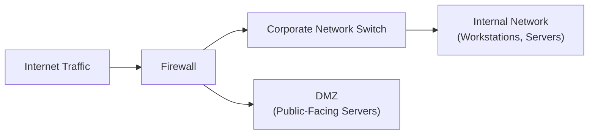

## 17.2 Firewalls, Intrusion Detection and Prevention Systems (IDPS)

Effective control of network traffic—for both incoming and outgoing data—remains a cornerstone of robust cybersecurity. Firewalls, along with Intrusion Detection and Prevention Systems (IDPS), form a primary defensive layer in corporate networks, significantly mitigating the risk of unauthorized access and data breaches. Given their critical role in supporting IT general controls (see Chapter 8) and protecting data confidentiality (see Chapter 19), understanding firewalls and IDPS is essential for CPAs involved in IT audits, SOC engagements, or any advisory roles related to cybersecurity risk management.

This section delves into the principles and types of firewalls, explains how stateless and stateful firewalls differ, and explores the functionalities of IDPS, including signature and anomaly-based detection methods. By the end of this chapter, readers will have a clear view of how these technologies enhance network security, how to evaluate their controls during an audit or advisory engagement, and the common pitfalls companies face in their deployment.

-------------------------------------------------------------------------------

### The Importance of Network Perimeter Security

Network perimeter security focuses on safeguarding an organization’s digital assets by monitoring, controlling, and filtering traffic as it traverses network boundaries. Although the traditional concept of a “perimeter” is evolving (especially with cloud adoption, remote work, and mobile devices), firewalls and IDPS continue to be indispensable. They provide:

• A foundational layer of defense against external threats seeking entry into internal networks.  
• Reduced risk of data breaches that could lead to significant financial and reputational harm.  
• A robust point of control for compliance with regulations such as HIPAA, GDPR, and PCI DSS.  
• Real-time detection and prevention capabilities for threats passing through or originating within the network.

In the context of financial auditing, a compromised network environment can lead to unauthorized transactions, data manipulation affecting financial statements, and costly regulatory non-compliance. Therefore, CPAs advising or auditing an organization’s IT environment often evaluate the effectiveness of firewalls and IDPS controls as part of a broader IT risk assessment.

-------------------------------------------------------------------------------

### Overview of Firewall Fundamentals

A firewall is a system (hardware-based, software-based, or both) that monitors and controls incoming and outgoing network traffic according to predetermined security rules. Think of it as a “gatekeeper” at the boundary between different zones of trust, such as the Internet (untrusted zone) and an internal corporate network (trusted zone).

#### Common Firewall Types

1. Packet-Filtering Firewalls  
   • Operate mostly at the network layer of the OSI model.  
   • Inspect simple packet attributes: source IP, destination IP, ports, and protocols.  
   • Can be stateless or stateful (discussed below).  
   • Typically less resource-intensive but provide limited context, making them susceptible to sophisticated attacks.

2. Proxy Firewalls  
   • Intercept all messages entering and leaving the network, functioning as a middleman.  
   • Often used to ensure in-depth inspection by understanding the application-layer data.  
   • Can introduce performance bottlenecks but provide granular control.

3. Next-Generation Firewalls (NGFW)  
   • Combine traditional firewall capabilities with advanced threat detection.  
   • May include application inspection, intrusion prevention (IDPS functionality), and cloud service defenses.  
   • Offer broader context, analyzing traffic content in real time to detect modern threats more effectively.

Each type addresses different organizational needs, ranging from cost and performance considerations to the level of security required. The choice also depends on whether the organization needs deep packet inspection, application-awareness, or integrated threat intelligence.

-------------------------------------------------------------------------------

### Comparing Stateless vs. Stateful Firewalls

Among common firewall implementations, one key distinction is how they manage the “state” of network connections.

#### Stateless Firewalls

• Functionality: Stateless firewalls examine each incoming or outgoing packet independently, with no awareness of the packet's preceding or subsequent packets.  
• Advantages:  
  – Simpler, often faster to process large volumes of traffic.  
  – Lower overhead for real-time analysis.  
  – Less expensive in terms of deployment and ongoing management.  
• Disadvantages:  
  – Cannot recognize or remember the context of ongoing connections.  
  – Vulnerable to spoofing and advanced attacks that exploit multiple-packet sequences.  
  – Limited granularity in policy enforcement.

Stateless firewalls might be adequate for smaller networks with relatively predictable traffic, or as a secondary defensive layer to complement a more advanced solution. However, they provide only minimal defense against sophisticated attacks.

#### Stateful Firewalls

• Functionality: Stateful firewalls track active connections, retaining context about the nature of a flow between source and destination IP addresses. This tracking is often called a “state table.”  
• Advantages:  
  – Deeper analysis of traffic flows thanks to an awareness of connection states (e.g., initialization, established connections, termination).  
  – Can block unsolicited packets that are not part of an established session.  
  – More effective at preventing a wide range of malicious activity, especially those requiring multiple-packet sequences.  
• Disadvantages:  
  – Greater computational and memory overhead due to stateful tracking of connections.  
  – Slightly higher cost and complexity compared to stateless variants.  
  – Certain attacks (e.g., state table exhaustion or high-volume denial-of-service attacks) may require additional specialized defense mechanisms.

In many modern corporate environments, stateful or next-generation firewalls are considered standard, given the often sophisticated nature of external threats. From an auditor’s perspective, verifying that a firewall’s logging, alerting, and policy configuration are properly aligned with the organization’s risk profile is crucial.

-------------------------------------------------------------------------------

### Firewalls in Practice

To visualize how a firewall commonly sits in a network, consider the following Mermaid diagram:

• Internet Traffic (A): Represents various external sources, including legitimate user requests and potential malicious threats.  
• Firewall (B): Inspects packets at the perimeter, applying security policies.  
• Corporate Network Switch (C): Distributes incoming requests and internal network traffic.  
• Internal Network (D): Hosts critical servers (accounting, ERP, HR) and user workstations, typically more protected.  
• DMZ (E): A “demilitarized zone” containing servers publicly accessible without giving users direct access to the internal network.

In practice, CPAs may help evaluate the firewall’s effectiveness by reviewing:  
• Configuration rules (e.g., blocking inbound ports that are not explicitly needed).  
• Security logs for suspicious activity or repeated intrusion attempts.  
• Change management procedures (see Chapter 10) to ensure all firewall changes are authorized, tested, and documented.  

-------------------------------------------------------------------------------

### Introduction to Intrusion Detection and Prevention Systems (IDPS)

An IDPS works in concert with a firewall to detect and often block malicious traffic. While a firewall primarily relies on policy-based rules, an IDPS uses signatures or statistical anomaly analysis to identify suspicious activity that could signal an intrusion attempt or malicious act in progress.

#### Intrusion Detection Systems (IDS)

IDS solutions focus on monitoring network traffic and alerting administrators to potential threats. They do not usually block or reroute activity on their own (unless closely integrated with another tool), making them primarily detective controls as opposed to preventative ones. Organizations that want to avoid false positives blocking legitimate business processes might implement IDS in a passive monitoring setup before adjusting controls to a prevention mode.

#### Intrusion Prevention Systems (IPS)

IPS solutions go one step further: they have the capability to actively block or reject detected malicious traffic. By combining detection strategies with proactive enforcement, IPS solutions reduce the time between threat detection and response.

-------------------------------------------------------------------------------

### Typical IDPS Detection Methods

IDPS solutions generally employ two key detection paradigms—signature-based and anomaly-based detection. Many modern solutions combine both, leveraging the strengths of each.

#### 1. Signature-Based Detection

• Approach: Compares network traffic against a database of known “signatures” or indicators of compromise (IOCs).  
• Pros:  
  – Highly effective at detecting known threats or exploits.  
  – Low false positives if signature definitions are comprehensive and accurate.  
• Cons:  
  – Ineffective against zero-day attacks or novel exploits that do not match an existing signature.  
  – Requires frequent updates to signature databases.  
• Example: A retail organization configures an IDPS with signatures for known point-of-sale malware. If an attempt is made to inject that specific piece of malware, the IDPS recognizes the pattern and raises an alert or blocks the traffic.

#### 2. Anomaly-Based Detection

• Approach: Learns normal network behavior over time and flags deviations from this baseline.  
• Pros:  
  – Potentially identifies unknown or zero-day attacks, including suspicious patterns not matched to any known signature.  
  – Good at spotting insider threats if user/app behavior shifts abnormally.  
• Cons:  
  – High false positives, especially during initial learning phases or if the network environment changes rapidly.  
  – Requires a more robust, often resource-intensive setup.  
• Example: In a financial services firm, the IDPS notices unusual large outbound data transfers at 2:00 AM—an anomaly compared to normal usage. The system raises an alert, prompting further investigation of potential data exfiltration.

In practice, many organizations use a “hybrid approach” that leverages both signature and anomaly-based techniques, thus improving detection coverage across diverse threats.

-------------------------------------------------------------------------------

### Placement of IDPS in the Network

IDPS solutions can be deployed at multiple points: on a dedicated network segment, on host systems (HIDS/HIPS—host intrusion detection/prevention systems), or integrated into other security devices like next-generation firewalls.

• **Network-Based IDPS (NIDS/NIPS):** Typically placed at key transit points, such as the edge of the network or between key segments (e.g., between the DMZ and internal network) to analyze traffic flows.  
• **Host-Based IDPS (HIDS/HIPS):** Resides on individual servers or workstations, monitoring system calls, application logs, and local events for malicious behavior.

Auditors need to consider coverage and the “depth” of monitoring when assessing an IDPS strategy. Some attacks may remain hidden if they occur on network segments not monitored by the IDPS or on endpoints without host-based solutions.

-------------------------------------------------------------------------------

### Real-World Case Study

Consider a mid-sized healthcare organization subject to HIPAA data protection requirements. The internal audit found that while the organization’s boundary firewall was configured correctly, employee laptops within the network were targeted via phishing emails. Once an employee opened a malicious link and installed malware, the attacker began lateral movement across the internal network.

• The intrusion was not immediately detected because the external firewall never saw suspicious “outbound” activity to the Internet.  
• Anomaly-based IDPS deployed inside the network eventually flagged erratic behavior: unusual domain controller queries and large data transfers to an unfamiliar IP address.  
• Quick action to block the malicious connections prevented a massive data breach of patient records, reducing both the financial and reputational impact.

This example highlights the critical role of IDPS in offering defense in depth (discussed in Chapter 16.2). A properly configured IDPS likely saved this organization from incurring substantial HIPAA violation penalties and associated remediation costs.

-------------------------------------------------------------------------------

### Financial Considerations in Implementing Firewalls and IDPS

Although the primary motivation behind firewall and IDPS adoption is risk mitigation, budgeting and ROI are also critical from a financial perspective:

• **CapEx vs. OpEx**: Purchasing hardware-based firewalls or dedicated IDPS appliances can represent substantial capital expenditures (CapEx). Conversely, adopting a managed or cloud-based firewall/IDPS service leads to operating expenditures (OpEx). CPAs assisting in budgeting must weigh the overall operating model that best aligns with the organization’s financial and strategic objectives.  
• **Maintenance and Subscription Costs**: Signature updates, hardware refreshes, and annual maintenance fees can be significant expense lines. Timely updates are crucial for addressing new threats, so consistent funding needs to be budgeted.  
• **Return on Security Investment (ROSI)**: Although intangible, the potential cost avoidance from preventing data breaches, loss of customer trust, and regulatory fines can be substantial. CPAs might help estimate the financial impact of a large-scale breach to underscore the business value of robust network security.

-------------------------------------------------------------------------------

### Best Practices and Common Pitfalls

Below are strategies to enhance the effectiveness of firewalls and IDPS, along with pitfalls that organizations often encounter.

#### Best Practices

1. **Rule Base Management**  
   – Regularly review firewall rules to eliminate obsolete or redundant entries.  
   – Adopt a default “deny all” posture, allowing only explicitly needed services.  
2. **Segmentation and Defense in Depth**  
   – Segment networks to isolate critical system zones (e.g., financial data servers).  
   – Deploy multiple layers of security (DMZ, internal firewalls, host-based IDPS) in line with zero-trust principles (discussed in Chapter 16.4).  
3. **Continuous Monitoring and Logging**  
   – Integrate firewall and IDPS logs with centralized SIEM solutions for real-time analysis.  
   – Configure alerts to notify responsible teams or Managed Security Service Providers (MSSPs) for immediate action.  
4. **Regular Updates to Signature Databases**  
   – Automate signature database updates to address recently discovered vulnerabilities.  
   – Treat update disruptions as part of patch management (see Chapter 10.3).  
5. **Training and Awareness**  
   – Educate employees on common attack vectors (e.g., phishing) to reduce inadvertent insider threats.  
   – Cross-train security teams on IDPS configuration and tuning to minimize false positives.

#### Common Pitfalls

1. **Overly Complex Rule Sets**  
   – A large, unorganized rule set leads to misconfigurations and inadvertently open ports, increasing risk.  
2. **Neglected Internal Segments**  
   – Assuming threats only come from “outside” is short-sighted. Lateral movement by attackers already inside is a major risk.  
3. **Failure to Continuously Tune Anomaly-Based Detection**  
   – Without routine tuning, anomaly-based systems may drown security teams in false positives. This can lead to “alert fatigue,” where real threats get overlooked.  
4. **Insufficient Logging and Alerting**  
   – Failing to log or promptly review IDPS events undermines intrusion detection effectiveness.  
5. **Inadequate Testing and Audits**  
   – Not testing firewall rules or IDPS configurations (e.g., through vulnerability scans or penetration tests) leaves blind spots that attackers can exploit.

-------------------------------------------------------------------------------

### Audit and Advisory Considerations

For CPAs and IT auditors, performing a systematic evaluation of firewall and IDPS controls might involve steps such as:

• **Policy and Procedures Review**: Do the written guidelines align with frameworks like NIST, COBIT (see Chapter 3.3), or trust services criteria for SOC 2® (see Chapter 24)?  
• **Configuration Review**: Is the firewall rule set consistent with the principle of least privilege? Are IDPS thresholds for detection tuned to normal operational baselines?  
• **Change Management Evidence**: Does the organization properly track firewall rule changes in line with established policies (see Chapter 10)?  
• **Log and Alert Analysis**: Is there a clear chain of responsibility within the organization for investigating, escalating, and resolving high-priority alerts?  
• **Third-Party Services**: If any part of the firewall/IDPS is outsourced, has management verified the adequacy of the service provider’s controls via a SOC report (chapters 22–27)?

Given the evolving threat landscape and the potential for sophisticated cyberattacks, the deployment of robust firewalls and IDPS solutions remains a high priority. Continuous governance, updated policies, and thorough audits provide strong assurance that these security measures effectively reduce the risk of financial misstatements and compliance violations.

-------------------------------------------------------------------------------

### Conclusion

Firewalls and Intrusion Detection/Prevention Systems are bedrock technologies for safeguarding an organization’s network perimeter, detecting malicious activities, and stopping potential breaches in real time. Whether you are a financial professional advising on cybersecurity budgets or an IT auditor evaluating the effectiveness of controls, understanding the nuances of stateless vs. stateful firewalls, as well as the differences between signature and anomaly-based IDPS detection, is critical.

Leveraging these systems effectively requires not only technological acumen but also a governance approach grounded in strong IT general controls, robust change management, and continuous risk assessment. When implemented and monitored correctly, firewalls and IDPS serve as valuable defenders of sensitive financial data and help maintain integrity across critical financial systems.

-------------------------------------------------------------------------------
## Test Your Knowledge: Firewalls and IDPS



### A network-based intrusion detection system (NIDS) can best be described as:
- [ ] A system that only scans endpoints for malware.  
- [ ] A firewall that denies all traffic by default.  
- [x] A solution positioned to monitor network traffic for potential malicious behavior.  
- [ ] A host-based system that only monitors CPU usage and memory.  

> **Explanation:** A NIDS inspects traffic across network segments to detect abnormal or malicious activity, distinguishing it from host-based systems that run specifically on individual servers or workstations.

### The primary difference between a stateless firewall and a stateful firewall is:
- [ ] Utilization of signature-based detection.  
- [ ] The type of hardware used for processing.  
- [x] Whether the firewall retains contextual information about active connections.  
- [ ] Their dependence on AI and machine learning.  

> **Explanation:** Stateless firewalls inspect packets in isolation, while stateful firewalls track ongoing sessions, maintaining a state table for each active connection.

### Which of the following is not a benefit of applying a “default deny” policy on a stateful firewall?
- [ ] It reduces the likelihood of inadvertently allowing malicious traffic.  
- [ ] It enforces the principle of least privilege by blocking all non-essential services.  
- [x] It automatically updates signatures to block known threats.  
- [ ] It simplifies risk assessment by focusing on only necessary access.  

> **Explanation:** A “default deny” policy does not inherently update or manage threat signatures; it limits access to strictly defined rules and rejects all other traffic.

### Signature-based IDPS is particularly effective for:
- [x] Blocking attacks that match known malicious patterns.  
- [ ] Detecting brand-new, zero-day threats.  
- [ ] Identifying anomalies in typical network usage.  
- [ ] Blocking only outbound connections.  

> **Explanation:** Signature-based detection matches traffic patterns against a database of known attack vectors. It is not as effective against unknown or zero-day threats, which require anomaly or behavior-based detection.

### An anomaly-based IDPS is more likely to:
- [ ] Relay known viruses to a quarantine server.  
- [x] Trigger alerts for unusual traffic patterns even if they are not part of known exploits.  
- [x] Produce false positives without proper tuning over time.  
- [ ] Rely solely on a curated signature database.  

> **Explanation:** Anomaly-based systems flag deviations from a baseline, which may include new attacks or legitimate traffic shifts, leading to higher false positives if not managed carefully. They do not rely solely on a signature database.

### A key challenge when deploying a host-based IDPS (HIDS/HIPS) is:
- [x] Ensuring that every critical endpoint or server is covered effectively.  
- [ ] Disabling encryption for all traffic to simplify monitoring.  
- [ ] Eliminating the need for network-based security.  
- [ ] Creating a stateless environment that modifies the firewall dynamically.  

> **Explanation:** HIDS/HIPS must be installed and maintained on each endpoint, which can be resource-intensive. They do not eliminate the need for other security layers, nor do they require traffic encryption to be disabled.

### An organization wants to protect its public-facing web servers in a DMZ from volumetric Distributed Denial of Service (DDoS) attacks. Which of the following is a valid control approach?
- [x] Using a network-based IPS with rate-limiting rules on inbound traffic to the DMZ.  
- [ ] Relying on stateless packet filters without threshold alerts.  
- [x] Incorporating anomaly detection to sense sudden spikes in traffic flow.  
- [ ] Avoiding any intrusion detection because of potential false positives.  

> **Explanation:** A network IPS with rate-limiting and anomaly detection can help mitigate DDoS attacks by recognizing abnormal traffic spikes. Stateless firewalls alone cannot adequately manage volumetric attacks.

### A long-standing pitfall in firewall administration is:
- [x] Poorly maintained rule sets leading to unneeded open ports.  
- [ ] Excessive performance from overly restrictive traffic policies.  
- [ ] Immediate detection of insider threats.  
- [ ] Universal protection against all advanced threats.  

> **Explanation:** Over time, unreviewed firewall rules can accumulate and create security gaps. Firewalls should be part of a layered approach, as they do not guarantee complete protection against every threat.

### CPAs reviewing firewall and IDPS controls should:
- [x] Assess whether the rule sets align with the organization’s risk appetite and compliance requirements.  
- [ ] Establish new firewall policies without management’s input.  
- [ ] Disable all logging to minimize overhead.  
- [ ] Grant every system full access for testing.  

> **Explanation:** Auditors and advisors should evaluate the alignment of firewall and IDPS configurations with the organization’s security posture and regulatory demands while ensuring logs are available for investigation and oversight.

### Firewalls and IDPS primarily help organizations:
- [x] Secure the network perimeter and detect/block malicious activities.  
- [ ] Eliminate all social engineering attacks.  
- [ ] Guarantee 100% availability and zero intrusions.  
- [ ] Replace encryption solutions.  

> **Explanation:** Firewalls and IDPS form key defensive layers for monitoring and mitigating threats, but they cannot eliminate social engineering or guarantee perfect uptime without additional controls.



-------------------------------------------------------------------------------

## For Additional Practice and Deeper Preparation

### [Information Systems and Controls (ISC)](https://www.udemy.com/course/isc-cpa-mock-exams/?referralCode=E1217303222935C5E464)

**Information Systems and Controls (ISC) CPA Mocks:** 6 Full (1,500 Qs), Harder Than Real! In-Depth & Clear. Crush With Confidence!

- Tackle full-length mock exams designed to mirror real ISC questions.  
- Refine your exam-day strategies with detailed, step-by-step solutions for every scenario.  
- Explore in-depth rationales that reinforce higher-level concepts, giving you an edge on test day.  
- Boost confidence and minimize anxiety by mastering every corner of the ISC blueprint.  
- Perfect for those seeking exceptionally hard mocks and real-world readiness.

_Disclaimer: This course is not endorsed by or affiliated with the AICPA, NASBA, or any official CPA Examination authority. All content is for educational and preparatory purposes only._
