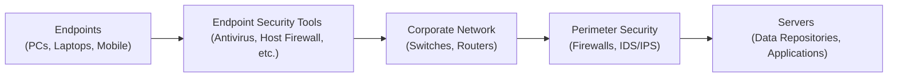

## 17.3 Endpoint Security, System Hardening, and Patch Management

Securing endpoints and ensuring that systems are regularly hardened and patched is a cornerstone of any robust information security architecture. In the financial and accounting environment, endpoints serve as critical access points to sensitive data, client information, and core financial processes. This section explores essential endpoint security controls, system hardening strategies, and the significance of timely patch management—factors that collectively help ensure the confidentiality, integrity, and availability of vital organizational assets.

Effective endpoint security practices extend beyond merely installing antivirus software. Comprehensive endpoint protection includes host-based firewalls, application whitelisting, intrusion prevention, encryption of data at rest, and secure configurations. These measures mitigate many of the risks identified in earlier sections of this guide, including unauthorized data access, malware infiltration, and system exploitation by malicious actors—risks that can disrupt financial reporting and compromise sensitive information.

Readers are encouraged to leverage the frameworks discussed in Chapter 3 (Governance, Frameworks, and Regulatory Environment), ensuring alignment with organizational policies, regulatory requirements such as PCI DSS or GDPR, and best practice frameworks like COBIT 2019. This alignment is critical for CPA professionals advising clients or performing IT audits where endpoints and system configurations are a growing area of focus.

Overview of Endpoint Security

Endpoint security is the practice of securing end-user devices—such as desktops, laptops, mobile devices, and specialized computing platforms—against internal and external threats. Attackers frequently target endpoints because they are often less robustly defended than centralized servers. Consequently, endpoints become prime vectors for malware, phishing attempts, and ransomware.

While many traditional endpoint security measures evolved from virus scanning and local firewalls, modern solutions span a wide array of defenses. Techniques such as machine learning-based malware detection, heuristic analysis, zero-day exploit prevention, and integration with extended detection and response (XDR) platforms have bolstered endpoint security capabilities.

Below is an illustrative diagram showing how endpoint security measures integrate within an organization:

In this diagram, endpoints feed into a chain of security layers, each providing a unique defense. This cascaded approach leverages both host-based and network-centric security controls, reinforcing the layered security or defense-in-depth strategy discussed in Chapter 16 (Foundations of Cybersecurity).

Common Endpoint Security Tools

Antivirus and Anti-Malware Solutions  
Modern antivirus software provides real-time scanning, scheduled scans, and heuristic threat detection, helping identify and block known malware, ransomware, and trojans. These tools often rely on signature databases, behavior-based detection, and cloud-based threat intelligence. In financial environments, running daily or continuous endpoint scans helps reduce exposure to malicious software that could compromise sensitive accounting data or degrade system performance.  

Host-Based Firewalls  
Host-based firewalls monitor inbound and outbound network traffic on individual endpoints, filtering packets before data is sent or received. By enforcing network policies at the device level, organizations gain finer control over what network ports and protocols are used. This is particularly relevant in distributed or hybrid work environments where employees frequently connect from remote locations, potentially exposing devices to untrusted networks.  

Application Whitelisting  
Application whitelisting ensures that only approved applications can execute on the endpoint. Instead of blocking known malicious programs, application whitelisting enforces a business-approved list of permitted software, automatically blocking unknown or unauthorized programs. This approach is highly effective at preventing zero-day malware and the introduction of rogue software into a corporate environment. For CPAs working with third-party vendor solutions, application whitelisting can significantly reduce unauthorized or risky software installations that might compromise the integrity of financial data.  

System Hardening

System hardening is the process of reducing an operating system’s attack surface, making it more resilient against breaches and malicious exploitation. Though some general hardening techniques overlap across platforms, many are unique to specific operating systems (e.g., Windows, Linux, macOS). Key methods include:

• Secure Default Configurations: Disable unneeded services, functions, and default accounts. Unused services create opportunities for attackers to exploit vulnerabilities.  
• Principle of Least Functionality: Restrict endpoints and servers to only the necessary services, applications, and user privileges required to fulfill a specific role.  
• Enforce Strong Password Policies: Mandate strong, lengthy passwords or passphrases. Coupled with multi-factor authentication (MFA), this reduces the chance of compromised credentials.  
• Disable or Remove Phase-Out Protocols: Turn off protocols like SMBv1 (in Windows environments) or unencrypted Telnet in networking environments. Evaluate older or deprecated cryptographic ciphers.  
• Configure Secure Policies: Adopt group policy objects (GPOs) for centralized control in Windows domains, ensuring consistent and secure settings across user devices.  
• Encrypt Data at Rest: At a minimum, enforce disk encryption on notebooks containing critical financial data. Full-disk encryption or file/folder-level encryption helps protect data if a device is lost or stolen.  

In the context of IT audits, hardened systems often show evidence of careful change control (see Chapter 10: IT Change Management) and robust alignment with the organization’s risk management processes (see Chapter 3: Governance, Frameworks, and Regulatory Environment). By default, many operating systems ship with services and features enabled that organizations do not need. Trimming these unnecessary elements goes a long way toward avoiding large risk exposures and potential leadership headaches in the event of a security breach.

Patch Management and Frequency of Updates

Patch management refers to the systematic approach of identifying, acquiring, testing, and installing software patches (including operating system updates, application patches, and firmware updates) to address known vulnerabilities and improve performance. For CPAs, the importance of frequent patching cannot be overstated. Delayed or neglected software updates remain a leading cause of cybersecurity incidents worldwide; high-profile examples include the infamous WannaCry ransomware exploit, which capitalized on outdated Windows systems left unpatched despite a widely available fix.

Key steps in patch management include:

• Monitoring Vendor Announcements: Vendors and developers (e.g., Microsoft, Apple, Red Hat, Adobe) frequently release patches. Monitoring these advisories ensures timely awareness of critical fixes.  
• Centralizing Patch Deployment: Use automated patch management solutions, such as Microsoft Endpoint Configuration Manager (formerly SCCM) or third-party deployment tools, to push updates at scale for consistent coverage.  
• Testing Before Deployment: Test patches in a staging environment that mirrors production to avoid unintended disruptions, especially critical for financial applications that handle large volumes of transactional data.  
• Prioritizing Critical and Security Updates: Not all patches carry the same urgency. Focus on security-critical updates that address vulnerabilities exploited in the wild. Use vulnerability scoring systems (e.g., CVSS) to rank patch importance.  
• Documenting Patch Actions: Keep a log of patch activities and successes/failures, facilitating compliance (e.g., SOX, PCI DSS) and ensuring traceability of changes if an IT audit or external regulatory review occurs.  

Timely patching reduces the likelihood of zero-day exploits becoming successful attacks. In turn, this diminishes the external, internal, and vendor risk associated with unpatched systems—a concept further explored in Chapter 7 (Business Processes in Information Systems) and Chapter 19 (Data Confidentiality and Privacy Controls).

Integrated Endpoint Security, Hardening, and Patching in Financial Environments

In a finance and accounting setting, endpoints are often the first line of defense against both routine and sophisticated attacks aimed at seizing confidential data. Hardening these endpoints through effective security measures, configurations, and frequent patching helps ensure that CPAs and finance professionals can fulfill their duties without interruption or data compromise. Additionally, as organizations move toward remote and hybrid work models, robust endpoint security helps maintain trust with stakeholders who demand strong IT controls for financial reporting.

Many organizations adopt a risk-based approach to endpoint security, focusing on areas that could have the greatest impact on financial reporting or confidentiality of stakeholders’ data. For instance, organizations may use multi-factor authentication for staff members who have privileged access to ERP systems, or deploy advanced endpoint detection and response (EDR) solutions on devices belonging to C-suite executives or finance leadership. By connecting risk-based prioritizations with a strong patch and system hardening strategy, organizations create a resilient environment aligned with both internal policies and external regulations.

Common Pitfalls and Best Practices

Common Pitfalls  
• Delayed Patching: Postponing or ignoring critical patches leaves systems open to known exploits, allowing attackers easy entry into critical systems.  
• Excessive Privileges: Users often have more permissions than they need, increasing the likelihood of accidental or intentional security breaches.  
• Lack of Endpoint Visibility: Without centralized monitoring, security teams might miss suspicious activities or fail to maintain consistent configurations across multiple endpoints.  
• Overlooking Non-Traditional Endpoints: Printers, IoT devices, and other embedded systems can become the weakest link if they remain unpatched or are poorly secured.  

Best Practices  
• Automate Patching Processes: Leverage automated tools for scanning available updates, testing them, and pushing them to endpoints in a controlled manner.  
• Employ Zero-Trust Principles: Assume every endpoint is potentially compromised. Apply segmentation, strict access controls, and continuous verification.  
• Conduct Regular Security Assessments: Perform vulnerability scans, host-based intrusion detection, and penetration testing to assess configuration weaknesses.  
• Enforce Encryption: Use disk-level encryption for portable devices containing any financial or confidential data.  
• Maintain Detailed Documentation: Ensure logs and audit trails exist for system changes, patch updates, and unusual security events to facilitate effective internal and external auditing processes.  

Practical Case Study

A mid-sized accounting firm experiences a ransomware attack that originated from an unpatched laptop that allowed an attacker to gain remote access. The malware quickly spread through the network, encrypting critical accounting databases. Due to a combination of weak endpoint security, unsegmented networks, and inconsistent patching, the firm could not halt the infection before significant damage was done. In assessing this incident, investigators found that:

• The responsible endpoint had missed critical patches for three months.  
• There was no application whitelisting, allowing the ransomware to execute.  
• Host-based firewall rules had not been updated to block suspicious inbound ping commands and remote desktop connections.  
• The firm lacked a formal system-hardening policy, leaving numerous default Windows services running.  

Mitigation steps included developing a disciplined patch management schedule, enforcing application whitelisting on all employee devices, and segmenting the network to contain infection spread. The firm also implemented a revised training program for staff, emphasizing endpoint security hygiene and common phishing tactics.  

Conclusion

Endpoint security, system hardening, and patch management are interdependent elements of a holistic cybersecurity framework. By combining these technical controls with strong policies, aligned governance, and frequent user training, organizations can substantially reduce the risk of security breaches. For CPAs, these measures translate into safer financial reporting, heightened trust with clients and partners, and demonstrable alignment with regulatory and professional standards. Readers seeking to deepen their expertise should consult the references below, leverage the best practices shared throughout this guide, and continuously monitor the evolving landscape of attack vectors and regulatory demands.

References and Further Exploration

• The Center for Internet Security (CIS) Benchmarks: Offers detailed system hardening guidelines for various operating systems.  
• SANS Institute: Provides research papers, webcasts, and training on endpoint security, penetration testing, and incident response.  
• NIST Special Publication 800-123 (Guide to General Server Security): Discusses many systems hardening best practices applicable to workstations and servers alike.  
• Chapter 16 (Foundations of Cybersecurity): Offers foundational threat intelligence and risk assessment insights.  
• Chapter 3 (Governance, Frameworks, and Regulatory Environment): Highlights the frameworks aligning IT controls with business objectives.  

## Secure Your Knowledge: Endpoint Security & Patch Management Quiz



### Which of the following is a primary benefit of application whitelisting?
- [x] It prevents unapproved software from executing by default.
- [ ] It blocks only known malicious applications.
- [ ] It automatically updates all endpoint operating systems.
- [ ] It replaces the need for host-based firewalls.

> **Explanation:** Application whitelisting enforces a policy where only authorized applications can run. This significantly reduces the possibility of malware or unknown programs executing on the endpoint.

### Which statement best describes system hardening?
- [x] Reducing an operating system’s attack surface by disabling unnecessary services, privileges, and features.
- [ ] Upgrading hardware to increase processing power.
- [ ] Installing only antivirus software.
- [ ] Restricting network traffic with perimeter firewalls alone.

> **Explanation:** System hardening means configuring systems to minimize vulnerabilities, which includes removing unnecessary services, enforcing principle of least privilege, and applying secure configuration benchmarks.

### What is the main advantage of frequently applying software patches?
- [x] Vulnerabilities are remediated promptly, reducing the attack window for exploits.
- [ ] A patch always introduces new functionality.
- [x] It ensures the system remains operational with minimal user intervention.
- [ ] Patches replace the need for encryption.

> **Explanation:** Frequent patching minimizes exposure to known exploits. It also helps limit unplanned downtime from attempted attacks. While patches sometimes add features or performance improvements, their main goal is to fix security and stability issues.

### An organization wants finer control over network traffic on individual endpoints. Which solution is most appropriate?
- [x] Host-based firewalls on each device.
- [ ] Network-only firewalls at the perimeter.
- [ ] Relying solely on IDS/IPS systems.
- [ ] Removing all user-installed software.

> **Explanation:** Host-based firewalls provide granular controls on individual endpoints, managing allowed and blocked connections on a per-device basis.

### What is the most critical factor when choosing which patches to deploy first?
- [x] Vulnerability severity, especially if exploited in the wild.
- [ ] Patch file size.
- [x] Software vendor brand recognition.
- [ ] Availability of hardware upgrades.

> **Explanation:** Security teams typically prioritize patches based on their severity and exploitability status, applying critical security updates before less urgent patches.

### Which approach best describes the principle behind application whitelisting?
- [x] “Default deny” and only allow specifically approved applications.
- [ ] “Default allow” to facilitate user convenience.
- [ ] “Block all websites” to ensure minimal data usage.
- [ ] “Allow unknown processes” to increase user flexibility.

> **Explanation:** Application whitelisting follows a “default deny” approach, granting execution rights solely to software explicitly approved.

### What is the main function of a host-based firewall compared to a network firewall?
- [x] Monitors inbound and outbound traffic at the device level to enforce policies per endpoint.
- [ ] Filters traffic only at the organizational perimeter.
- [x] Replaces all hardware-based security devices.
- [ ] Provides internet connectivity.

> **Explanation:** A host-based firewall enforces network access policies specifically for each individual endpoint. This granular control complements a network firewall and does not serve as a replacement for hardware-based security devices.

### A CPA firm was compromised because an employee’s laptop was missing critical patches for three months. Which key control was most clearly absent?
- [x] Timely patch management facilitated by centralized deployment.
- [ ] Network segmentation to limit lateral movement.
- [ ] Detailed encryption standards.
- [ ] Wireless network access.

> **Explanation:** In this scenario, the outdated laptop was the initial point of compromise, indicating a shortcoming in the firm’s patch management strategy.

### Which of the following is a fundamental system hardening practice?
- [x] Disabling unnecessary services and accounts according to the principle of least functionality.
- [ ] Permitting all services to ensure maximum availability.
- [ ] Allowing administrator privileges for all users.
- [ ] Relying solely on group chat security features.

> **Explanation:** Minimizing active services and restricting accounts to the least privilege required is a core principle of system hardening.

### For an information system that contains sensitive financial data, which of the following is true?
- [x] Frequent patching helps close known security gaps.
- [ ] Patching is only necessary if the software vendor explicitly notifies the users.
- [ ] Automation of patching is prohibited by most regulatory standards.
- [ ] Patches only fix UI elements and not security vulnerabilities.

> **Explanation:** Frequent and proactive patching of systems that store sensitive financial data is critical to protect against exploitable weaknesses, as many regulatory frameworks also require timely patch updates.



## For Additional Practice and Deeper Preparation

### [Information Systems and Controls (ISC)](https://www.udemy.com/course/isc-cpa-mock-exams/?referralCode=E1217303222935C5E464)

Information Systems and Controls (ISC) CPA Mocks: 6 Full (1,500 Qs), Harder Than Real! In-Depth & Clear. Crush With Confidence!

- Tackle full-length mock exams designed to mirror real ISC questions.  
- Refine your exam-day strategies with detailed, step-by-step solutions for every scenario.  
- Explore in-depth rationales that reinforce higher-level concepts, giving you an edge on test day.  
- Boost confidence and minimize anxiety by mastering every corner of the ISC blueprint.  
- Perfect for those seeking exceptionally hard mocks and real-world readiness.

_Disclaimer: This course is not endorsed by or affiliated with the AICPA, NASBA, or any official CPA Examination authority. All content is for educational and preparatory purposes only._
