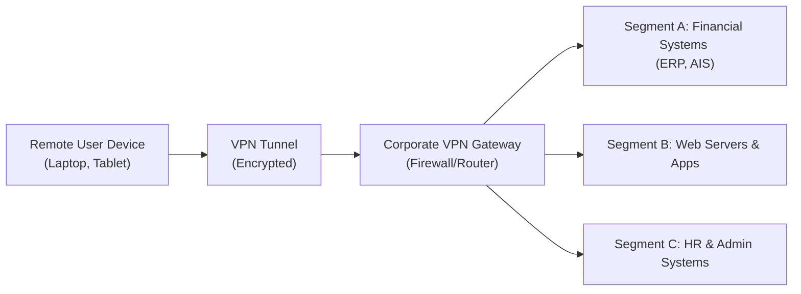

## 17.4 Secure VPNs, Wireless Networks, and Remote Access

Secure remote connectivity has become essential in modern organizations—especially for finance and accounting professionals who often work across locations or manage confidential data within Enterprise Resource Planning (ERP) systems and other platforms. Controlling data in motion through a secure Virtual Private Network (VPN), configuring wireless networks with robust encryption, and implementing secure remote access solutions bolster both operational efficiency and data security. This section explores recommended best practices, common pitfalls, potential threats, and real-world scenarios for designing and maintaining secure external connectivity in alignment with broader governance frameworks such as COBIT 2019 or COSO.

--------------------------------------------------------------------------------
### Overview and Relevance
Remote access security is vital to CPAs and other finance professionals, as it directly impacts the confidentiality, integrity, and availability of systems that store and process financial transactions and sensitive business data. A single misconfiguration in VPN or wireless access point security could expose an entire corporate network to unauthorized individuals, risking financial fraud, reputational damage, or noncompliance with regulations such as HIPAA or GDPR. CPA firms that provide audit or advisory services have a professional duty to establish best-in-class security controls for remote connectivity.

--------------------------------------------------------------------------------
### Understanding VPN Tunneling
A Virtual Private Network (VPN) introduces a secure "tunnel" between a client device outside the organizational perimeter and a protected internal network segment (such as a corporate LAN). By encrypting network traffic, VPNs enable data in transit to remain confidential, mitigating eavesdropping or interception. VPNs support the transfer of financial records, client data, and other sensitive information with minimal risk.

Key VPN Tunneling Protocols:

• Internet Protocol Security (IPsec) – Provides end-to-end encryption and authentication at the network layer. It commonly works in tunnel mode (encrypting entire IP packets) or transport mode (encrypting only the payload). IPsec remains popular for site-to-site VPNs and for secure connections to perimeter devices such as routers or firewalls.

• Secure Sockets Layer (SSL)/Transport Layer Security (TLS) VPN – Operates at the application layer. SSL/TLS VPNs are popular for client-based or portable remote access solutions because they can traverse common internet ports (e.g., 443) without complex firewall configuration.

• OpenVPN – An open-source technology leveraging SSL/TLS for encryption. It offers flexible configuration and strong security while being compatible with multiple platforms.

• WireGuard – A newer protocol emphasizing performance and simplicity. It offers fast rekeying and uses state-of-the-art cryptographic primitives while being less complex than some older protocols.

--------------------------------------------------------------------------------
### VPN Protocol Lifecycle and Maintenance
Organizations should define and maintain a clear lifecycle for their VPN technologies:

• Protocol Selection and Implementation: Choose VPN protocols that align with organizational business needs, regulatory requirements, and system architecture. Consider the degree of encryption strength, performance overhead, and management complexity.

• Authentication and Authorization: Use multi-factor authentication (MFA) in tandem with VPN gateways. This added layer—such as requiring a time-based one-time password (TOTP)—dramatically reduces risk by making password-only logins insufficient for attackers.

• Key Management: Periodically rotate cryptographic keys used in VPN implementations and ensure robust certificate management, especially in IPsec environments.

• Monitoring and Audit Logs: Log successful and failed connection attempts, protocol negotiation events, and abnormal usage. Correlate these logs within Security Information and Event Management (SIEM) solutions to identify patterns of unauthorized usage.

• Patch and Update Strategy: As with other IT assets, VPN devices and client software must be regularly patched. Postponing patches or running end-of-life VPN solutions invites known vulnerabilities to be exploited.

--------------------------------------------------------------------------------
### Best Practices for Implementing Secure VPNs
Below are essential practices that CPAs and IT teams should follow when standing up or reviewing a secure VPN implementation:

• Zero-Trust Context (Cross-reference Chapter 16.2 & 16.4): Even with VPN usage, adopt a zero-trust approach (do not assume a successful VPN connection equals trusted access to all resources). Apply network segmentation at the VPN gateway and implement role-based access controls.

• Split Tunneling vs. Full Tunneling: In split tunneling, only traffic destined for corporate resources travels through the VPN, while all other internet traffic is unencrypted. Full tunnel, by contrast, routes all traffic through the corporate network. Evaluate these approaches for security, user experience, and corporate oversight.

• Device Compliance Checks: Incorporate endpoint security checks at connection time to validate antivirus status, operating system patches, or encryption states prior to granting VPN access.

• Logging and Alerting: Centralize VPN connection logs, correlate them with identity and access management (IAM) logs, and set up alerts for suspicious anomalies, such as repeated connection attempts from unknown sources.

• Policy Enforcement: Clear Acceptable Use Policies (AUPs) define permitted user conduct while connected. Examples include disallowing usage of personal devices for corporate VPN unless they meet security baselines.

--------------------------------------------------------------------------------
### Wireless Networks: Recommended Security Protocols
Wireless Access Points (WAPs) can be a convenient gateway for employees, vendors, and visitors, but they also raise unique security challenges. Poor wireless encryption or default factory settings provide cybercriminals an easy path into the corporate network.

Recommended Protocols:
• WPA3: The newest Wi-Fi Protected Access standard that offers robust encryption (192-bit in enterprise mode) and improved handshake security (Simultaneous Authentication of Equals or SAE).  
• WPA2: Stronger than WEP, but only includes AES-based encryption if properly configured as WPA2-AES. Consider it a fallback if WPA3 is unavailable; remain wary of WPA/WPA2 mixed modes.  
• 802.1X/EAP (Enterprise Authentication): For corporate environments, pairing WPA2/WPA3 with 802.1X ensures users authenticate with unique credentials, adding an extra layer of security.

Deprecated/Insecure Protocols:
• WEP (Wired Equivalent Privacy): Easily compromised; never use for business-critical networks.  
• WPA (TKIP): Outdated encryption standard with known vulnerabilities.

--------------------------------------------------------------------------------
### Risks of Default Configurations
Despite strong protocol availability, default configurations on wireless access points or VPN gateways often remain the weakest link. Vendors sometimes ship devices with:

• Default SSIDs or broadcast names (e.g., “Linksys,” “Netgear”); Attackers easily identify default configurations with known hardware vulnerabilities.  
• Default Username and Password: Many devices use “admin/admin” or similar combinations, making unauthorized access straightforward.  
• Unpatched Firmware: Out-of-date router or access point firmware can have critical security holes.  

Practical Steps to Mitigate Default Configuration Weaknesses:
• Immediately change administrative login credentials.  
• Modify the SSID to not broadcast brand or model details.  
• Apply the latest firmware/patches upon installation.  
• Disable remote management if not strictly necessary.

--------------------------------------------------------------------------------
### Remote Access Techniques Beyond VPN
While VPN remains a primary remote access method, other solutions exist and must also be secured:

• Virtual Desktop Infrastructure (VDI): Users “stream” their desktop environment from a secure data center. This arrangement helps ensure data never leaves the corporate perimeter. However, if VDI is misconfigured, it can be vulnerable to session hijacking or man-in-the-middle attacks.

• Cloud-based Remote Access: Cloud platforms often provide remote environment setups that bypass corporate perimeter hardware. Still, robust identity and access management (IAM) and strong encryption remain critical.

• Direct Application Access: Some organizations implementing Zero Trust might provide direct, least-privilege access to specific applications. The principle is to reduce the internal “attack surface” by narrowing the scope of remote user privileges.

--------------------------------------------------------------------------------
### Diagram: VPN Tunneling and Network Segmentation
Below is a simplified diagram showing a remote user connecting to the corporate network via a VPN tunnel, emphasizing segmentation.

Explanation:  
1. The remote user device initiates a secure VPN tunnel to the corporate VPN gateway.  
2. Upon successful authentication, traffic is granted only to authorized network segments. For instance, a finance user may have access to Segment A (ERP/AIS) but be restricted from HR data.  
3. The corporate gateway enforces segmentation and monitors traffic crossing network boundaries.

--------------------------------------------------------------------------------
### Real-World Case Study: Accounting Firm Implements Remote Access
Background: A mid-sized CPA firm specializing in tax, accounting, and advisory services needed a remote work solution for traveling auditors and staff. 

Challenges:  
• Staff handling confidential client data in shared offices or public spaces posed risks of data sniffing over insecure Wi-Fi.  
• Pressure from clients to provide 24/7 access to ERP or accounting workflows.  

Solution:  
• Deployed an SSL VPN with MFA for remote access to corporate resources.  
• Configured strict WPA3 for in-house wireless networks and placed guest networks in a quarantined VLAN.  
• Hardened the default router configurations, changed administrator passwords, and deployed patch management software to keep firmware up to date.  

Outcome:  
• Zero known security breaches in three years.  
• Higher productivity from staff who can securely work from client sites or home.  
• Favorable feedback from client IT teams, who rely on the CPA firm’s robust security posture.

--------------------------------------------------------------------------------
### Governance and Regulatory Considerations
Maintaining a secure VPN and wireless environment aligns with various governance frameworks:

• COSO and COBIT 2019: Emphasize risk management, control activities, and monitoring. VPN usage and wireless security controls map directly into “Control Environment” and “Information & Communication” aspects.  
• NIST Cybersecurity Framework: Encourages protecting networks with strong authentication, encryption, and continuous monitoring.  
• Regulatory Mandates: HIPAA (healthcare data), PCI DSS (payment card data), and GDPR (personal data protection) each contain remote access and encryption requirements. Noncompliance can lead to penalties and reputational damage.  

--------------------------------------------------------------------------------
### Common Pitfalls and Remediation Strategies
• Pitfall: Overlooking Endpoints  
  • Strategy: Mandate antivirus/anti-malware scans on devices, ensure OS patches, restrict personal devices with insecure configurations.

• Pitfall: Using Legacy Protocols  
  • Strategy: Phase out insecure VPN protocols (like PPTP) and wireless protocols (WEP). Upgrade to modern alternatives with stronger ciphers.

• Pitfall: ITGC Misalignment  
  • Strategy: Map remote access controls to IT General Controls (ITGC) in alignment with COSO for consistent governance.

• Pitfall: Improper Network Segmentation  
  • Strategy: Implement VLANs or subnets to isolate critical financial data from other network resources. Restrict lateral movement with host-based firewalls and strict access controls.

--------------------------------------------------------------------------------
### Key Takeaways
1. Use robust encryption protocols (IPsec, SSL/TLS, and next-gen standards like WireGuard) for VPN tunnels.  
2. Configure wireless networks with WPA3 or, at minimum, WPA2 with AES.  
3. Avoid default settings on network devices and enforce rigorous patch practices.  
4. Incorporate zero-trust principles and network segmentation to limit exposure if a breach occurs.  
5. Align solutions with frameworks such as COBIT 2019, NIST, and COSO to ensure comprehensive coverage of risk, control, and compliance requirements.

--------------------------------------------------------------------------------
## Evaluate Your Expertise in Secure VPNs, Wireless Networks, and Remote Access



### Which of the following statements best describes VPN tunneling?
- [ ] A method of physically connecting two networks without encryption.
- [x] A technique that encrypts traffic between a remote user and the corporate network.
- [ ] A framework for monitoring firewall performance in real time.
- [ ] A mandatory requirement only for organizations subject to HIPAA.

> **Explanation:** VPNs create an encrypted tunnel that shields data in transit from interception.

### What is the primary advantage of SSL/TLS-based VPNs for remote access?
- [x] They can traverse firewalls using standard ports (e.g., 443).
- [ ] They require minimal encryption and offer higher speeds.
- [ ] They are only supported by older devices.
- [ ] They eliminate the need for a secure authentication method.

> **Explanation:** SSL/TLS VPNs typically use common HTTPS ports, making it easier for users to connect from various networks.

### Which of the following is a recommended wireless security protocol for modern enterprise environments?
- [ ] WEP
- [x] WPA3
- [ ] WPA-TKIP
- [ ] No encryption, relies on physical security

> **Explanation:** WPA3 is the current industry standard for secure wireless encryption, offering substantial improvements over older methods.

### What is a common risk of leaving wireless devices in default configurations?
- [ ] Enhanced encryption
- [ ] Improved network speed
- [x] Default passwords and SSIDs that attackers can easily exploit
- [ ] Guaranteeing cross-platform compatibility

> **Explanation:** Default passwords and SSID settings are widely documented, leaving networks vulnerable to unauthorized access.

### Which statement about split-tunneling vs. full-tunneling is correct?
- [x] Split-tunneling sends only corporate traffic over the VPN, while full-tunneling routes all traffic through the VPN.
- [ ] Split-tunneling offers more security than full-tunneling.
- [x] Full-tunneling can minimize the chance of data leakage.
- [ ] Full-tunneling encrypts public Wi-Fi traffic without affecting performance.

> **Explanation:** With split-tunneling, non-corporate traffic goes directly to the internet. Full-tunneling provides centralized security but adds bandwidth overhead.

### Zero-trust network principles recommend which of the following?
- [x] Restricting user access by default until trust factors are proven.
- [ ] Allowing any authenticated VPN user to access all subnets.
- [ ] Eliminating encryption to reduce overhead.
- [ ] Relying exclusively on MAC address whitelisting for access control.

> **Explanation:** Zero-trust requires verification at every stage, minimizing the attack surface.

### Which of the following best describes a suitable method to detect VPN anomalies?
- [x] Centralize logs using a Security Information and Event Management (SIEM) system.
- [ ] Disable logging to preserve user privacy.
- [x] Track successful vs. failed logins and correlate with user accounts.
- [ ] Only review logs when an incident is reported.

> **Explanation:** A SIEM allows real-time analysis of security events and helps identify suspicious trends or anomalies.

### What is a recommended measure to secure wireless networks for guests?
- [x] Isolate guests on a separate VLAN.
- [ ] Use a shared password for guest and corporate access.
- [ ] Keep the default SSID for ease of identification.
- [ ] Implement older WEP encryption for simplicity.

> **Explanation:** Guest networks should be segmented and isolated from critical corporate resources to prevent lateral movement.

### In the context of VPN security, what is the significance of key management?
- [x] Periodically rotating and protecting cryptographic keys enhances security.
- [ ] Ensuring that all users share a single static key.
- [ ] Auto-generating keys every twenty years to minimize overhead.
- [ ] Using vendor-provided default keys for brand awareness.

> **Explanation:** Strong key management practices are essential; older or static keys can be compromised, weakening the entire VPN.

### A true statement about wireless protection and WPA3 is:
- [x] WPA3 offers enhanced encryption and a more secure handshake compared to WPA2.
- [ ] WPA3 has been phased out in favor of WEP.
- [ ] WPA3 only works on Linux operating systems.
- [ ] WPA3 is designed solely for small office/home office use.

> **Explanation:** WPA3 supports better encryption methods and a new key exchange protocol (SAE) that closes many vulnerabilities found in WPA2.



--------------------------------------------------------------------------------

## For Additional Practice and Deeper Preparation

### [Information Systems and Controls (ISC)](https://www.udemy.com/course/isc-cpa-mock-exams/?referralCode=E1217303222935C5E464)

**Information Systems and Controls (ISC) CPA Mocks:** 6 Full (1,500 Qs), Harder Than Real! In-Depth & Clear. Crush With Confidence!

- Tackle full-length mock exams designed to mirror real ISC questions.  
- Refine your exam-day strategies with detailed, step-by-step solutions for every scenario.  
- Explore in-depth rationales that reinforce higher-level concepts, giving you an edge on test day.  
- Boost confidence and minimize anxiety by mastering every corner of the ISC blueprint.  
- Perfect for those seeking exceptionally hard mocks and real-world readiness.  

_Disclaimer: This course is not endorsed by or affiliated with the AICPA, NASBA, or any official CPA Examination authority. All content is for educational and preparatory purposes only._
