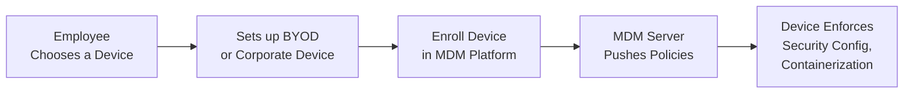

## 17.5 Mobile Device Management (MDM) and BYOD

As organizational workforces increasingly rely on smartphones, tablets, and other mobile devices, organizations and CPAs must understand how to manage the risks associated with mobile technology. In corporate settings, Bring Your Own Device (BYOD) programs enable employees to use their personal devices for professional tasks. However, BYOD introduces specific security risks and compliance challenges that demand robust security architectures. Mobile Device Management (MDM) solutions offer centralized administration, allowing organizations to deploy, manage, and secure devices, whether corporately owned or employee-owned. This section explores MDM, the BYOD model, and the concept of “containerization,” highlighting how these elements collectively help protect sensitive organizational data while maintaining user privacy.

  
### Understanding BYOD and Its Implications

BYOD refers to policies allowing employees to bring and use personal devices for organizational tasks. Common benefits of BYOD include cost savings for the organization (fewer devices to purchase) and increased flexibility or familiarity for employees. However, mixing corporate and personal data on the same device raises several concerns:

• Security: Personal devices may not always meet enterprise security requirements, such as data encryption, strong password policies, or timely patch updates.  
• Privacy Conflicts: Organizations must safeguard business assets on personal devices without infringing on employees’ personal data privacy.  
• Compliance: Various industries are subject to regulations such as HIPAA, GDPR, and PCI DSS. These frameworks require rigorous data protection measures, which can be complex to enforce on personal devices.  
• Data Ownership: Questions may arise regarding which data belongs to the business vs. which belongs to the individual.  

Such concerns create the need for a systematic approach—MDM—to align corporate security requirements with the user experience of personal devices.

  
### Overview of Mobile Device Management (MDM)

Mobile Device Management (MDM) solutions provide a framework for organizations to manage and secure mobile devices from a central console. Key features and capabilities of MDM solutions commonly include:

• Enrollment and Registration: Each mobile device must be enrolled in the MDM solution, typically via a dedicated app or configuration profile. Once enrolled, the device can receive policies and restrictions.  
• Policy Enforcement: Organizations can configure password policies, encryption requirements, and application restrictions, among other settings. These policies are then pushed to the device automatically.  
• Application Management: Certain MDM solutions also offer Mobile Application Management (MAM), allowing administrators to control approved and restricted apps, enforce updates or patches, and remove malicious or unauthorized software.  
• Remote Wipe and Lock: If a device is lost, stolen, or compromised, administrators can remotely wipe corporate data or lock the device to prevent unauthorized access.  
• Monitoring and Reporting: MDM dashboards provide visibility into device status, compliance alerts, and usage statistics, facilitating prompt risk identification and faster incident response.  

While both corporate-owned and personally owned devices can be managed via MDM, BYOD typically requires additional considerations to respect employee privacy.

  
### Enforcing Corporate Policies and Ensuring Compliance

To understand how MDM solutions enforce corporate policies on personal devices, consider a scenario where employees routinely access company email and financial files through their smartphones. From an auditing and compliance perspective:

1. Policy Configuration: The organization’s IT security team or designated MDM administrator sets requirements for device security. Examples include mandatory device encryption, strong passcodes, automatic screen locks, and usage of only approved business applications.  
2. Automated Push of Policies: Once devices are enrolled, the MDM solution forces these policies onto each device. If an employee disables encryption or uninstalls a required security application, the device is flagged as non-compliant.  
3. Real-Time Monitoring: MDM platforms continuously monitor policy compliance. Administrators receive alerts about non-compliant devices, such as those lacking critical security updates.  
4. Enforcement Actions: Based on the organization’s risk tolerance, enforcement can range from warning notifications to partial or full device lockouts. If the device remains non-compliant, administrators can revoke access to corporate resources (e.g., blocking email access or forcing the user to re-enroll).  

From a CPA or auditor’s perspective, an MDM policy helps ensure that financial and operational data handled through mobile devices meets the necessary security and confidentiality controls, thereby reducing the risk of data breaches and non-compliance with regulatory standards such as HIPAA, GDPR, or SOX.

  
### Containerization: A Practical Safeguard

One specific technique MDM solutions use to protect organizational data on personal devices is containerization. Containerization partitions or “containers” the corporate apps and data within a secure environment separate from the personal side of the device. This approach helps safeguard business data while preserving user privacy for personal apps, photos, and messages.

Imagine the device as having dual identities. The corporate-side container typically includes:

• Corporate Email App: Configured to meet strict encryption requirements and remote wipe capabilities.  
• Secure Browser or VPN Tools: Ensures safe and auditable browsing when accessing company intranet sites.  
• Document and File-Sharing Apps: Ensures corporate data remains within a secure sandbox and cannot mix with personal apps.  

Meanwhile, the personal side remains under the user’s control for private apps and content. The container can be locked or wiped without affecting the user’s personal data. This separation can enhance trust between employees and management, encouraging BYOD adoption without undermining security or privacy.  

#### Real Examples of Containerization

• Samsung Knox: Samsung smartphones offer a built-in “Knox” container where users tap an icon to switch from personal mode to a “Knox” workspace that is fully encrypted and secured.  
• VMware Workspace ONE (formerly AirWatch): This solution provides separate profiles for business and personal use, effectively siloing corporate email or other sensitive applications from personal content.  
• BlackBerry Dynamics: Historically known for secure messaging, BlackBerry extends containerization features to manage emails, calendars, and intranet access via a dedicated secure workspace on any smartphone or tablet.  

Such solutions ensure that if a device is lost or stolen, only the container—with the corporate data—can be wiped without deleting personal files like family photos, text messages, or personal emails.

  
### Balancing Security and Privacy

One of the greatest challenges with MDM is striking a balance between an organization’s need for data protection and an employee’s expectation of personal privacy. Overly intrusive monitoring of user activity can erode employee morale and potentially violate data protection regulations. Best practices for balancing these concerns include:

• Transparent Privacy Disclosures: Provide a clear explanation of which data will be collected and which actions the organization can take (such as remote wiping only corporate data rather than personal files).  
• Minimal Data Collection: Limit collection of personal data (e.g., personal browsing history or personal GPS location) unless strictly necessary.  
• Written BYOD Agreements: Formalize acceptable use and the scope of MDM capabilities (e.g., disclaimers about remote wipe of corporate data in the event of potential compromise).  
• Periodic Communication and Training: Educate employees on how MDM works, the corporate policies in effect, and the importance of consistent compliance to safeguard sensitive data.  

  
### MDM and BYOD in Practice: A Finance Department Example

A regional accounting firm, “Greenfield & Co.,” opts for a BYOD policy for cost-efficiency and workforce flexibility. Many auditors, managers, and staff accountants use personal mobile phones to receive client emails or access proprietary auditing tools. During a client’s quarterly review, an accountant attempts to open a company spreadsheet outside the containerized business environment.

Under the firm’s MDM settings, the device denies access, and sends a notice that the user must re-open the file within the secured container. Company administrators immediately see a policy violation alert but recognize it as a user mistake rather than malicious intent. They contact the employee to confirm future compliance. In the event of a theft or device misplacement, remote wipe is automatically restricted to the container only, preserving the accountant’s personal photos, messages, and other data while erasing all sensitive firm information.

This scenario highlights how MDM solutions can effectively ensure compliance with internal risk management policies and external regulatory requirements. Additionally, it protects both the user’s personal data and the organization’s sensitive financial information without creating an overly invasive monitoring environment.

  
### Common Pitfalls and How to Avoid Them

• Insufficient Onboarding: If employees are not thoroughly trained on how to enroll and use containerized apps, policy enforcement and user adoption may suffer.  
• Overly Complex Policies: If MDM rules are too restrictive, employees may find workarounds (e.g., using personal email for corporate data), neutralizing security best practices.  
• Lack of Continuous Monitoring: Deploying MDM is not a one-time event. Organizations should maintain real-time dashboards and frequent reporting to ensure ongoing compliance.  
• Neglecting Device Lifecycle Management: Personal devices are upgraded or replaced frequently. A robust policy must address deprovisioning, ensuring corporate data is wiped upon employee exit or device disposal.  
• Ignoring Global Data Privacy Regulations: Multinational organizations must consider local data privacy laws. MDM capabilities should be configured to comply with regions that have strict laws around data transfer, personal data storage, and user consent.

  
### Best Practices for Auditors and CPAs

1. Verify Policies and Procedures: Confirm that the mobile policies align with documented IT security guidelines (e.g., those mandated by COSO or COBIT), ensuring a consistent governance structure.  
2. Check Encryption and Access Controls: Inspect whether containerized environments are encrypted properly and if access controls adhere to the principle of least privilege.  
3. Review Monitoring and Alert Mechanisms: Ensure that the MDM platform is set up to automatically notify stakeholders of non-compliance or suspicious device usage.  
4. Audit User Training: Evaluate the consistency and quality of user training on MDM, BYOD policies, and procedures for lost or stolen devices, as these directly impact compliance.  
5. Assess Vendor Contracts and SLAs: For organizations using third-party MDM services, scrutinize service-level agreements to confirm that the vendor’s offerings meet regulatory and internal security requirements.

  
### Visual Representation: MDM and BYOD Lifecycle

Below is a high-level flowchart that illustrates the typical lifecycle of a BYOD deployment managed by an MDM solution:

• Step A: Employee selects a device that meets baseline hardware and OS requirements.  
• Step B: The device is guided through a registration or setup process, entering the organization’s BYOD program.  
• Step C: Enrollment completes when the user installs an MDM agent or configuration profile.  
• Step D: The MDM server pushes corporate security policies, such as requiring encryption or passcodes.  
• Step E: The device enforces these policies, often via a container, separating corporate data from personal applications.

  
### Conclusion

MDM and BYOD strategies play an essential role in modern information security, enabling employees to remain productive while ensuring the confidentiality, integrity, and availability of corporate data. By leveraging containerization techniques, organizations can minimize data leakage risks, reduce non-compliance incidents, and provide a degree of privacy protection for personal device usage. From a CPA or IT auditor standpoint, these solutions help maintain internal controls critical for reliable financial reporting and safeguarding company and client information.

To effectively implement MDM and BYOD, organizations must develop transparent, well-defined policies and provide ongoing training programs. They also must periodically review and update policies, ensuring alignment with evolving regulatory requirements and newly emerging threat landscapes. In tandem, containerization secures sensitive assets without alienating employees who prefer the convenience of a single device for both personal and professional use.  

----------

## Test Your Knowledge: MDM and BYOD Security Essentials



### Which of the following is a primary concern when using personal devices for corporate tasks in a BYOD program?

- [ ] Increase in device cost for the organization
- [ ] Lower employee productivity
- [x] Potential privacy and security risks
- [ ] Excessive device firmware updates

> **Explanation:** BYOD programs inherently risk exposing corporate data on devices not fully controlled by the organization, raising significant privacy and security concerns.

### What is containerization in the context of mobile device management?

- [x] The practice of separating corporate data and apps in a secure sandbox on a personal device
- [ ] The use of external memory drives to store corporate data
- [ ] The consolidation of multiple operating systems on a single device
- [ ] The packaging of hardware in rugged containers for deployments

> **Explanation:** Containerization involves putting corporate resources (e.g., email, documents) in a secured “container” separate from personal data, reducing the risk of data leakage and preserving user privacy.

### Which MDM feature enables an organization to protect confidential corporate data in the event a device is lost or stolen?

- [ ] Speed limiting high-bandwidth applications
- [x] Remote wipe capability
- [ ] Auto-denial-of-service for the device
- [ ] Mandatory antivirus scanning on personal devices

> **Explanation:** Remote wipe capability allows the organization to erase sensitive corporate data on a lost or stolen device, thus preventing unauthorized access.

### In a BYOD environment, which issue can arise if security policies are overly complex or restrictive?

- [x] Employees find workarounds that undermine security
- [ ] Complete employee acceptance of policies
- [ ] Reduction in the need for compliance measures
- [ ] Elimination of the need for containerization

> **Explanation:** Overly complex policies often prompt users to circumvent official processes, which can increase security risks rather than mitigate them.

### Which of the following processes ensures a newly purchased device receives the correct MDM policies upon activation?

- [x] Enrollment
- [ ] Patch synchronization
- [x] Configuration provisioning
- [ ] Transfer pricing

> **Explanation:** During the enrollment and configuration provisioning process, devices install profiles or apps that enforce corporate MDM policies.

### What is the main difference between corporate-owned devices and BYOD devices under MDM?

- [ ] BYOD devices cannot be enrolled in MDM
- [x] Corporate-owned devices typically allow deeper administrative control and oversight
- [ ] Corporate-owned devices are exempt from all security policies
- [ ] BYOD devices utilize separate hardware for corporate use

> **Explanation:** Corporate-owned devices are fully controlled by the organization, whereas BYOD devices have shared control, with MDM primarily focusing on the secure corporate container.

### Why is ongoing monitoring important in an MDM-managed environment?

- [x] It ensures continuous compliance and identifies vulnerabilities or non-compliance quickly
- [ ] It eliminates the need for any initial enrollment
- [ ] It allows employees to access corporate data without restrictions
- [ ] It reduces the need for containerization

> **Explanation:** Active monitoring allows real-time detection and resolution of any non-compliance or security issues, ensuring the organization’s MDM policies remain effective and enforced.

### Which step is vital for offboarding an employee in a BYOD setting?

- [ ] Retrieving physical devices from the employee
- [ ] Deleting their social media accounts
- [x] Remotely wiping or disabling access to corporate data
- [ ] Disabling personal data services like SMS or phone calls

> **Explanation:** Proper device deprovisioning and remote removal of corporate apps and data are critical to prevent potential data breaches after an employee’s departure.

### When examining containerization, which of the following best characterizes the user’s personal environment?

- [ ] It is wholly managed by the corporate IT team  
- [ ] It mirrors the corporate container’s strict security policies  
- [ ] It is automatically encrypted alongside corporate data  
- [x] It remains separate and generally unaffected by corporate policies

> **Explanation:** Containerization isolates corporate data and applications, leaving the user’s private apps and data relatively free from corporate management.

### When attempting to mitigate security risks in a BYOD program, which of the following statements is correct?

- [x] True
- [ ] False

> **Explanation:** True. Mitigating security risks often involves containerization and well-defined BYOD policies to balance data protection with employee privacy.



----------

## For Additional Practice and Deeper Preparation

### [Information Systems and Controls (ISC)](https://www.udemy.com/course/isc-cpa-mock-exams/?referralCode=E1217303222935C5E464)

Information Systems and Controls (ISC) CPA Mocks: 6 Full (1,500 Qs), Harder Than Real! In-Depth & Clear. Crush With Confidence!

- Tackle full-length mock exams designed to mirror real ISC questions.  
- Refine your exam-day strategies with detailed, step-by-step solutions for every scenario.  
- Explore in-depth rationales that reinforce higher-level concepts, giving you an edge on test day.  
- Boost confidence and minimize anxiety by mastering every corner of the ISC blueprint.  
- Perfect for those seeking exceptionally hard mocks and real-world readiness.  

_Disclaimer: This course is not endorsed by or affiliated with the AICPA, NASBA, or any official CPA Examination authority. All content is for educational and preparatory purposes only._
