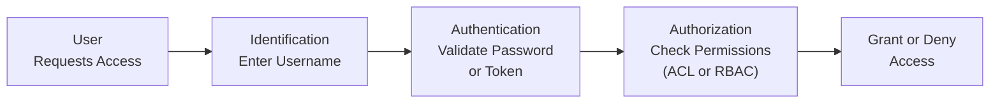

## 18.1 Identification vs. Authentication vs. Authorization

Ensuring the right individuals have access to the right data and systems is a fundamental component of any secure and well-governed information environment. In the context of CPAs and audit professionals, lapses in controlling who can interact with sensitive financial data can lead to compromised integrity of financial statements, compliance failures, and reputational damage. This section delves into three essential pillars of Information Systems Security: Identification, Authentication, and Authorization. Though often referenced collectively, each concept plays a distinct role in securing technology and data assets.

  
### Distinguishing the Three Concepts

The trio of Identification, Authentication, and Authorization (often referred to simply as “I-A-A”) forms a layered process that organizations must design and monitor carefully. Here’s a succinct breakdown:

• Identification: “Who are you?”  
• Authentication: “Prove it!”  
• Authorization: “What can you do once you’re in?”

Understanding how these steps interrelate is vital to constructing a robust security strategy. Even if a user is properly identified, they still need to be authenticated (via passwords, tokens, biometric data, etc.) to confirm their identity. Only after successful authentication are they granted the privileges they are authorized to have.  

This layered approach to access management ensures that organizations safeguard sensitive data—particularly critical in scenarios involving financial records, compliance data, or stakeholder information.

  
### Identification: Laying the Foundation

Identification is the starting point where an individual (or entity, process, or automated script) declares an identity. Commonly, you see this in everyday computing with username prompts. In an ERP system, for example, a user might enter “JSanchezCPA” as their username.

• Purpose: Identification associates each user with a unique label (e.g., username, account number, employee ID) so the system can differentiate one user from another.  
• Process: The system typically checks whether the declared identity exists within its registry, directory, or identity provider database.  
• Example: An employee at a large CPA firm uses “JaneDoeAudit” as her username.  

From a CPA and audit standpoint, correct user identification is central to tracking and auditing who initiates transactions or modifies financial information. Weak identification schemes, such as shared user IDs or generic “admin” accounts, make it difficult to hold individuals accountable—a direct threat to internal control requirements under frameworks like COSO or COBIT.

  
### Authentication: Verifying the Claimed Identity

After a user has identified themselves, the next step is Authentication—often summarized as “Prove you are who you say you are.” This step usually involves validating something the user knows (password or PIN), something the user has (smart card, token), or something the user is (fingerprint, facial geometry).

• Passwords, PINs, and Passphrases: The most commonly used method—though susceptible to social engineering, brute force attacks, and poor user practices.  
• Tokens or Smart Cards: Physical or digital tokens that generate time-sensitive codes. These may be integrated with Multi-Factor Authentication (MFA).  
• Biometrics: Unique biological traits (fingerprint, facial recognition, iris scan) that serve as a high-level security measure.  
• MFA/2FA (e.g., Password + One-Time Code): Enhances security by requiring more than one method for verification.  

Weak authentication remains a major control deficiency. CPAs, when involved in IT audits, look for security gaps in password policies (e.g., short minimum lengths, no complexity requirements, infrequent mandatory resets). They also assess whether critical financial systems mandate MFA, particularly for remote logins or high-privilege accounts. This step is crucial in preventing unauthorized access to sensitive data such as general ledger entries or payroll details.

  
### Authorization: Defining Access and Privileges

Even after a user or system is authenticated, the final gatekeeper is Authorization—deciding what the authenticated user or process can see and do. By properly configuring authorization, organizations ensure that employees only have the access and functionalities necessary for their roles.

• Role-Based Access Control (RBAC): Permissions are grouped by job role (e.g., “Accounts Payable Clerk,” “Audit Manager,” “Database Administrator”).  
• Attribute-Based Access Control (ABAC): Rules evaluate attributes of the user (e.g., department, location, clearance level), attributes of the resource, and contextual conditions.  
• Access Control Lists (ACLs): A listing of which users or system processes can access specific objects or functions and the nature of that access (e.g., read-only, write, execute).  

From an audit perspective, authorization often intertwines with the concept of “segregation of duties.” For instance, an employee creating vendor records in Accounts Payable usually should not be the same person who approves or pays those invoices. Proper authorization controls mitigate internal fraud and unintentional errors that could produce misstatements in financial reports.

  
### Relationship to Other Security Controls

Identification, Authentication, and Authorization operate in the context of broader IT General Controls (ITGC) domains introduced in Chapter 8. They underpin the reliability of system availability, change control processes, and data protection measures. Without robust user access management, incident response, business continuity, and auditing logs lose much of their effectiveness.  

  
### Importance for CPAs and IT Auditors

While I-A-A is primarily a technical concept, the implications for financial reporting are profound. Failure to implement clear identification, authentication, and authorization controls can lead to:  

• Unauthorized transactions that undermine the integrity of financial statements.  
• Inability to enforce segregation of duties, thereby weakening internal controls.  
• Vulnerabilities in data confidentiality, particularly private client or stakeholder information.  
• Difficulty in maintaining an audit trail, impacting the reliability of evidence.  

In addition, various control frameworks demanded by regulatory authorities (e.g., PCI DSS, HIPAA, GDPR) require demonstration of comprehensive user access controls. CPAs offering advisory or assurance services must be conversant in these frameworks and capable of assessing how effectively organizations implement and monitor I-A-A controls.

  
### Practical Examples and Case Studies

1. Retail Chain’s ERP Access: A large retail corporation uses an ERP system for processing sales and managing inventory. CPAs identify weaknesses in user setup: multiple employees share the same departmental account, making it impossible to hold individuals accountable for erroneous or fraudulent entries. Through an improved identification process, each staff member now has a unique username, linked to their role. The auditor then examines authentication policies (strong password requirements) and ensures that employees only have read/write privileges relevant to their role (authorization).

2. Online Banking Platform: A CPA firm offering advisory services to a regional bank identifies that the online banking’s authentication process includes only username and password. The recommendation is to implement multi-factor authentication (MFA), adding something the user “has,” like a token or push notification, to reduce unauthorized access risk. Strengthening authorization ensures that employees in the operations department cannot view confidential investment details from wealth management accounts.

3. Cloud-Based Accounting Software: An emerging CPA practice migrates to a Software-as-a-Service (SaaS) platform. The owners implement role-based access to ensure new interns cannot delete financial records. They also integrate single sign-on (SSO) for convenience and standardized authentication across all applications. The SaaS platform’s logs provide a secure audit trail aligned with the practice’s compliance obligations.

  
### Diagram: User Access Flow

Below is a Mermaid diagram illustrating Identification, Authentication, and Authorization flow:

Explanation:  
• A["User  Requests Access"] – The user initiates a request.  
• B["Identification  Enter Username"] – The system prompts the user to declare an identity.  
• C["Authentication  Validate Password  or Token"] – The system verifies authenticity (e.g., password or MFA).  
• D["Authorization  Check Permissions  (ACL or RBAC)"] – The system checks the user's assigned privileges.  
• E["Grant or Deny  Access"] – Final decision point based on the user’s established permissions.  

  
### Common Pitfalls and Best Practices

Pitfalls:  
• Using default or shared admin accounts: Weakens accountability, making audit trails nearly useless.  
• Overly permissive authorization: Users gain unauthorized access to sensitive data or critical functions.  
• Weak or static password policies: Simplifies brute force or credential-stuffing attacks.  
• Failure to terminate accounts promptly: Departing employees or contractors might retain active credentials.  

Best Practices:  
• Enforce strong password policies and MFA, especially for high-privilege or remote access accounts.  
• Apply the principle of least privilege, granting minimal rights required for job responsibilities.  
• Conduct periodic user access reviews and recertification to remove excessive or outdated privileges.  
• Integrate logs from authentication mechanisms with Security Information and Event Management (SIEM) tools for continuous monitoring.  
• Document policies precisely, including procedures for handling lost or compromised credentials.  

  
### Financial and Regulatory Perspectives

Well-designed I-A-A mechanisms are integral in meeting compliance requirements and internal control standards:

• COSO Internal Control – Integrated Framework: Emphasizes technological controls and segregation of duties.  
• COBIT 2019: Governance and management objectives for alignment of IT and business, with specific focus on access controls.  
• HIPAA and PCI DSS: Demand robust identity proofing and restricted access to sensitive medical or payment data.  
• SOC 1® and SOC 2®: Often require demonstration of effective access management in the Description Criteria.  

Beyond compliance, these controls foster trust among stakeholders, reduce the risk of financial fraud, and maintain a trail of accountability—essentials for CPAs and auditors in preparing or examining financial statements.

  
### Strategies for Ongoing Improvement

• Continuous Training and Awareness: Educate employees on the significance of secure identification and authentication processes, especially regarding social engineering risks (phishing, pretexting).  
• Automated Provisioning and Deprovisioning: Use identity management software to automatically grant or revoke user rights.  
• Adaptive Authentication: Systems can implement risk-based logic, applying more stringent verification methods for high-risk transactions or access attempts from unknown devices.  
• Regular Audits and Penetration Testing: Validate that nobody can bypass authentication controls or escalate privileges without authorization.  

  
### Key Takeaways

Identification, Authentication, and Authorization serve as the backbone of Information Systems Security. For CPAs, these concepts transcend mere technology implementations: they help safeguard financial transactions, preserve data confidentiality, and uphold the integrity of accounting records. Auditors and finance professionals must remain vigilant, ensuring each of these processes is meticulously designed, maintained, and continuously improved.

  
## Quiz: Strengthen Your Access Management Expertise



### Which of the following best describes Identification in an access control process?

- [x] The act of declaring who you are, such as entering a username.  
- [ ] The process that confirms your password is correct.  
- [ ] The method by which a user is assigned privileges.  
- [ ] The systematic logging of transaction data for audit.  

> **Explanation:** Identification is about declaring identity—for example, entering your username to let the system know who is requesting access.

### Which factor is most commonly associated with Authentication?

- [x] Password or other form of secret verification.  
- [ ] User role assignment.  
- [ ] Checking data encryption keys.  
- [ ] Logging user activity.  

> **Explanation:** Authentication focuses on verifying the user’s declared identity. A password, token, or biometric goes beyond mere identification to confirm that the user actually “is” that identity.

### In the context of Authorization, which of the following best illustrates a Role-Based Access Control (RBAC) framework?

- [x] Assigning specific permissions to “Payroll Clerks” rather than to individual users.  
- [ ] Every user having the same level of privileges across the system.  
- [ ] Using only fingerprint recognition for login.  
- [ ] Storing password hashes in a secure server.  

> **Explanation:** RBAC groups users by role (like “Payroll Clerks”), granting a standard set of privileges collectively instead of setting permissions individually.

### What is a commonly cited reason for employing Authorization controls in an accounting environment?

- [x] To ensure segregation of duties.  
- [ ] To speed up administrative tasks for system administrators.  
- [ ] To allow all employees to modify financial statement data.  
- [ ] To eliminate the need for logging or monitoring.  

> **Explanation:** Authorization controls help organizations implement segregation of duties by granting access to only those functions required for an employee’s role.

### Which of the following is a best practice for passwords?

- [x] Enforcing complexity rules and mandatory periodic changes.  
- [ ] Allowing users to reuse old passwords.  
- [x] Requiring multi-factor authentication on high-privilege accounts.  
- [ ] Storing passwords in plain text for easy lookup.  

> **Explanation:** Strong password policies include complexity rules (length, special characters, etc.), periodic resets, and encouraging multi-factor authentication for high-privilege accounts.

### Which concept is primarily concerned with preventing or detecting unauthorized escalation of user privileges?

- [x] Authorization  
- [ ] Identification  
- [ ] Authentication  
- [ ] Aggregation  

> **Explanation:** Authorization ensures that a user whose identity is verified can only exercise the rights appropriate to that role, preventing unauthorized escalation of privileges.

### Which step of the I-A-A process is typically validated through password, token, or biometric measures?

- [x] Authentication  
- [ ] Identification  
- [x] Authorization  
- [ ] Logging  

> **Explanation:** Authentication is the verification step, often requiring a password, token, or biometric data to confirm the user’s claimed identity.

### Why is it important to avoid generic “admin” accounts in a financial management system?

- [x] Accountability is compromised, making audit trails less reliable.  
- [ ] Administrators feel too restricted.  
- [ ] It is mandatory by all regulatory frameworks.  
- [ ] An admin account can’t access backups.  

> **Explanation:** Generic admin accounts remove individual accountability, which undermines one of the primary objectives of a well-audited environment.

### What is the principal difference between Identification and Authorization?

- [x] Identification states “who you are,” while Authorization defines “what you can do.”  
- [ ] Identification is optional, but Authorization is mandatory.  
- [ ] Identification is only relevant for system administrators.  
- [ ] Authorization only applies to system-level changes.  

> **Explanation:** Identification is simply calling out who you are (like a username), whereas Authorization is granting or denying the validated user certain capabilities.

### True or False: A system can grant Authorization privileges even if Authentication fails.

- [x] True  
- [ ] False  

> **Explanation:** In poorly configured or legacy systems, it can happen if checks are not correctly sequenced. While it shouldn’t happen in a well-designed system, it’s theoretically possible if the access control logic is flawed.



---

## For Additional Practice and Deeper Preparation

### [Information Systems and Controls (ISC)](https://www.udemy.com/course/isc-cpa-mock-exams/?referralCode=E1217303222935C5E464)  

**Information Systems and Controls (ISC) CPA Mocks:** 6 Full (1,500 Qs), Harder Than Real! In-Depth & Clear. Crush With Confidence!

- Tackle full-length mock exams designed to mirror real ISC questions.  
- Refine your exam-day strategies with detailed, step-by-step solutions for every scenario.  
- Explore in-depth rationales that reinforce higher-level concepts, giving you an edge on test day.  
- Boost confidence and minimize anxiety by mastering every corner of the ISC blueprint.  
- Perfect for those seeking exceptionally hard mocks and real-world readiness.  

_Disclaimer: This course is not endorsed by or affiliated with the AICPA, NASBA, or any official CPA Examination authority. All content is for educational and preparatory purposes only._
