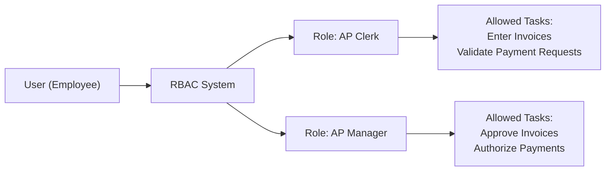

## 18.3 Role‑Based Access and the Principle of Least Privilege

Role‑Based Access Control (RBAC) and the Principle of Least Privilege are vital concepts in authentication and access management. These strategies ensure that authorized individuals within an organization gain sufficient access to perform their job functions while minimizing security and compliance risks. As CPAs increasingly engage in technology audits and advisory work, having a deep understanding of RBAC and the principle of least privilege becomes essential. This section explores how to design and tailor roles around job responsibilities, emphasizing the importance of limiting privileges strictly to what is required.

Building on the core concepts introduced in the earlier parts of this chapter—identification, authentication, and authorization—this section serves as a practical guide to structuring effective access controls in alignment with recognized frameworks such as COSO Internal Control – Integrated Framework and COBIT 2019. By following RBAC principles, organizations can improve operational efficiency, reduce the likelihood of fraud or misappropriation of resources, protect sensitive financial information, and align with various regulatory requirements.

Understanding these core approaches will enable CPAs and other stakeholders to identify the optimal division of duties, drive accountability in financial processes, and enhance the organization’s security posture.

Designing roles around specific job functions ensures employees have the precise permissions they need, while the principle of least privilege mandates that any entitlements granted align strictly with essential duties. Together, these concepts promote balanced stewardship of systems, data, and processes.

Improperly assigned privileges can undermine an otherwise robust control environment. This extensive discussion offers authoritative guidance, actionable examples, and practical tools for implementing role-based access structures effectively.

  
Key Topics Covered in This Section  
• Defining Role‑Based Access Control (RBAC)  
• Principle of Least Privilege and Its Importance  
• Designing Roles Around Job Functions  
• Implementing and Maintaining RBAC Systems  
• Common Pitfalls and Best Practices  
• Case Study and Practical Examples  
• Conclusion and Further Reading  

Role‑Based Access Control (RBAC)

Role‑Based Access Control (RBAC) is a systematic method for assigning access privileges to users based on their roles within an organization. Instead of granting individual permissions one by one, RBAC saves time and reduces errors by grouping privileges according to functional responsibilities (e.g., Accounts Payable Clerk, AP Manager, System Administrator). Each correctly defined role incorporates only those capabilities essential to complete the job effectively.

Below are key elements of RBAC:

Clarity in Role Definition  
Clearly defined roles ensure that privileges granted to each role match the actual needs of users in that position. Typical business functions—such as accounts payable, accounts receivable, payroll, financial reporting, and system administration—often require unique types of access privileges to enterprise resource planning (ERP) systems and cloud platforms.

Separation of Duties  
Separation of duties (SoD) is a cornerstone concept that can be enforced and validated through RBAC. Instead of allowing a single person to handle an entire process from start to finish (e.g., invoice creation, approval, and payment), dividing tasks across multiple roles significantly reduces the potential for fraud or errors.  

Efficient User Provisioning  
When onboarding a new employee or transitioning an existing employee to a different position, assigning or revoking privileges can be accomplished simply by adding or removing them from the role group(s) that correspond with their new duties. This approach streamlines user lifecycle management and significantly reduces administrative overhead.  

Risk Mitigation and Compliance  
Courts, regulators, and auditing bodies increasingly require robust access control measures. RBAC’s traceable and standardized structure supports compliance efforts under regulations such as PCI DSS, HIPAA, GDPR, and internal audit frameworks like COSO.  

Principle of Least Privilege

The principle of least privilege states that each individual, program, or system process should only be granted the minimum access rights needed to perform assigned tasks. By limiting excessive or extraneous privileges, organizations decrease their overall attack surface and lower the potential for data breaches, system misuse, or control failures.  

Key benefits of least privilege include:

• Enhanced Security: Limits the blast radius of compromised accounts by restricting user rights.  
• Reduced Unauthorized Access: Lowers potential for accidental or malicious misuse of high-level privileges.  
• Regulatory Compliance: Many standards explicitly require that only essential privileges be granted to sensitive systems and data.  
• Auditor-Friendly: Demonstrates that managers have exercised due diligence in safeguarding systems and information.  

On a practical level, applying the principle of least privilege complements a robust RBAC environment by ensuring each role is carefully scoped, devoid of superfluous permissions.

Designing Roles Around Job Functions

Mapping roles to specific job duties is the heart of RBAC. This approach provides employees and third-party consultants with the correct level of access without confusion or redundancy. Below are recommended steps for designing roles around job functions:

Identify the Organization’s Key Job Functions  
Start by listing out each role or function within the finance, accounting, and IT department. For instance:  
• Accounts Payable Clerk  
• Accounts Payable Manager  
• Accounts Receivable Clerk  
• System Administrator  
• IT Audit Consultant  

Define Required Tasks and Permissions  
Next, identify the system tasks that each role is expected to accomplish. For an Accounts Payable Clerk, tasks might include:  
1. Enter vendor invoices  
2. Initiate invoice approvals  
3. Review basic vendor data  

For an Accounts Payable Manager, tasks might include:  
1. Approve invoices entered by Clerk  
2. Manage vendor master records  
3. Authorize payments above a certain limit  

Grouping Common Permissions  
Group similar permissions and tasks into separate roles. For instance, vendor invoice processing tasks can be consolidated under the “AP Clerk” role, while the “AP Manager” role ensures management oversight and final approval.  

Review and Validate with Stakeholders  
Collaborate with department heads, process owners, and internal auditors. Validate the newly created roles against real-world operational requirements to ensure they meet the principle of least privilege. Engaging key stakeholders early prevents misalignment and fosters organization-wide acceptance.  

Conduct a Separation of Duties Review  
Cross-check that roles designed for tasks requiring separation of duties do not overlap. For example, a role with the ability to create and approve payments invites a conflict of interest and violates SoD guidelines.  

Assign Roles and Implement in Systems  
Once validated, implement the roles within access control systems, including Active Directory groups, ERP systems, and cloud identity providers. Document each role thoroughly so that auditors and future administrators can understand associated privileges and responsibilities.  

Testing and Ongoing Maintenance  
Continuously monitor to ensure users only have roles matching their job needs. Execute periodic access reviews, especially prior to external audits or regulatory inspections. Revisit the roles if business functions evolve.  

Sample Diagram: RBAC with AP Clerk and Manager Roles

Below is a Mermaid diagram illustrating a simplified representation of an RBAC process within an Accounts Payable function:

In this model:  
• The AP Clerk role includes tasks involving invoice entry.  
• The AP Manager role includes tasks for invoice approval and payment authorization.  
• The RBAC System automatically grants or denies privileges based on the assigned roles.  

Implementing the Principle of Least Privilege in RBAC

The RBAC framework provides a convenient way to implement least privilege, but it requires consistent oversight:

Analyze Actual Task Requirements  
Avoid relying on broad approaches like “IT Admin” or “Power User” roles with excessive permissions. Continually peel back any unnecessary privileges and align them with actual job requirements.  

Periodic Access Reviews  
Conduct frequent reviews to see if employees maintain outdated roles that they no longer need. Removing these can mitigate insider threats or reduce vulnerabilities if an account is compromised.  

Granting Elevated Access Only When Needed  
For emergencies or special projects requiring elevated privileges, create time-bound or event-driven access. Once the task completes, revoke the higher-level role. Some organizations employ “break-glass” accounts or privileged session management solutions to handle urgent requirements while tracking actions.  

Monitoring Operations in Real Time  
Use monitoring tools with automatic alerts that identify suspicious privilege escalations or unusual access attempts. This helps detect misconfigurations and potential attacks, supporting real-time reaction and remediation.  

Ensuring SoD Compliance  
Organizations should address SoD by layering the principle of least privilege into roles that never allow a single user to control an entire financial process. If conflicts are unavoidable due to staff constraints, mitigate risk with compensating controls, such as additional managerial review or daily transaction reports.  

Documenting Everything  
Maintain thorough documentation of each role’s responsibilities, as well as approval workflows for granting or modifying privileges. Comprehensive documentation is critical during IT audits and when demonstrating compliance to regulators or external stakeholders.  

Practical Examples and Case Studies

Accounts Payable in a Mid-Sized Manufacturing Company  
An internal audit discovered that the AP Department Manager had broad system rights, including creating vendor records and issuing payments. Through applying RBAC and least privilege principles, management split tasks into distinct roles—Clerk, Manager, and Payment Reviewer. As a result, the Manager lost direct ability to create new vendor records, but gained oversight responsibilities to approve or reject new vendor proposals. This reorganization reduced the risk of fraudulent payments and provided clearer lines of accountability.

Healthcare Provider with HIPAA Compliance  
A hospital’s patient accounting system required multiple users to perform claims submissions and insurance follow-ups. RBAC was employed to create roles such as “Claims Processor,” “Claims Reviewer,” and “Billing Supervisor.” Peer reviews, restricted data access, and separate oversight protected patient health information (PHI). Least privilege principles were enforced by requiring additional authentication factors for roles dealing with particularly sensitive billing data.  

Financial Institution Handling Customer Loans  
At a bank, loan officers could previously approve small business loans without a secondary check. By implementing SoD and least privilege, all high-value loans required separate roles for initial review and final approval. The restructure ensured that no single individual could unilaterally approve significant loans, mitigating potential fraud risk while satisfying enhanced controls demanded by internal risk management.  

Common Pitfalls and Best Practices

Common Pitfalls  
• Overly Broad Roles: “Catch-all” roles that lump multiple functions are a risk, creating unnecessary exposure.  
• Failure to Document: Lacking documentation leads to confusion and complicates audits.  
• Neglecting Maintenance: Unused roles remain assigned far beyond their need. Stale privileges pose security and compliance risks.  
• Lack of SoD Considerations: Permitting single users to both initiate and authorize financial transactions subverts RBAC’s protective effect.  
• Underestimating Training Needs: Employees and system administrators must be trained on the significance of responsibilities and how to request or revoke access properly.  

Best Practices  
• Create Detailed Role Definitions: Enumerate permissions within each role to align them with real tasks.  
• Validate Roles with Stakeholders: Engage process owners, internal auditors, and IT professionals.  
• Implement Regular Access Reviews: Schedule reviews monthly or quarterly to stay ahead of changes in job roles.  
• Employ Automatic Provisioning Tools: Integrate HR systems with identity and access management (IAM) platforms to simplify onboarding, offboarding, and role changes.  
• Document Everything: Keep a repository of role definitions, approvals, SoD analyses, and access review outcomes.  
• Integrate with Broader Governance: Align RBAC design to overarching frameworks such as COSO, COBIT, or NIST for consistent risk management and compliance.  

Maintaining RBAC and the Least Privilege Standard

RBAC is not a one-time project but an ongoing process that requires continuous governance. Periodic or scenario-based changes—such as staff restructuring, the introduction of new systems, or expansions into new lines of business—necessitate corresponding updates to roles. Additionally, the principle of least privilege must remain an active consideration across all new initiatives.  

Suggested maintenance strategies include:

• Scheduled Role Review: Perform annual or semi-annual role evaluations to confirm that privileges remain current and necessary.  
• Automated Reporting: Leverage system-generated reports identifying users with excessive permissions or roles with overlapping privileges.  
• Attestation Campaigns: Require department heads and system owners to attest that assigned roles for their teams are still valid and aligned with business needs.  
• Audit Log Reviews: Regularly scan system audit logs for suspicious activity or instances in which privileges appear to have been misused.  
• Continuous Awareness Training: Ensure employees—especially those in roles with sensitive data access—understand their responsibilities in upholding least privilege.  

Conclusion and Further Reading

Role‑Based Access Control and the principle of least privilege serve as the bedrock for a mature access management environment. Properly designed roles promote clarity, efficiency, and strong internal controls. By carefully mapping rights to organizational responsibilities, CPAs and IT professionals can reduce risk, enhance accountability, and maintain compliance with diverse regulatory mandates.

When paired with designated oversight and ongoing reviews, RBAC and least privilege ensure that the right people have access to the right information at the right time—no more, no less. As you delve deeper into advanced access management strategies, remember that effective governance depends on a culture of continuous learning, shared responsibility, and proactive problem-solving.

Recommended Resources for Further Exploration  
• COBIT 2019 Framework for Governance and Management of Enterprise IT  
• NIST Special Publication 800‑53 on Security and Privacy Controls  
• AICPA Trust Services Criteria for Security, Confidentiality, and Privacy  
• SANS Institute Materials on Access Control Best Practices  

## Test Your Knowledge: Role-Based Access and Least Privilege



### Which best describes the principle of least privilege in an organization?

- [ ] Grant employees maximum access for potential unforeseen tasks.
- [x] Ensure users have only the minimal access required to perform job functions.
- [ ] Eliminate all access for third-party contractors and vendors.
- [ ] Provide temporary administrative rights to all employees.

> **Explanation:** The principle of least privilege restricts user rights to only what is essential to perform assigned duties. Any unnecessary privilege poses an unnecessary security and compliance risk.

### What is a key benefit of using role-based access control (RBAC)?

- [ ] Eliminating all user restrictions.  
- [x] Simplifying user provisioning by assigning adequate permissions at once.  
- [ ] Allowing employees to define their own roles based on personal preference.  
- [ ] Bypassing the need for periodic access reviews.  

> **Explanation:** RBAC simplifies user provisioning because permissions are grouped under predefined roles. Administrators can move employees into or out of these roles as job responsibilities change.

### In a finance department, how can RBAC facilitate separation of duties (SoD)?

- [x] By distributing key finance tasks (e.g., payment creation and payment approval) across different roles.
- [ ] By centralizing all duties into a single superuser role.
- [ ] By granting full administrative privileges to everyone on the finance team.
- [ ] By allowing employees to swap roles based on daily workload.

> **Explanation:** SoD requires that no single user have end-to-end control over critical financial processes. RBAC enforces this by assigning distinct roles and prohibiting conflicting permissions within a single role.

### Which of the following is considered a best practice for designing roles in RBAC?

- [ ] Making the roles so broad that they accommodate nearly every scenario.  
- [x] Consulting department heads and internal auditors to determine actual privileges needed.  
- [ ] Defining a standard set of permissions without consultation.  
- [ ] Allowing each user to modify role definitions as needed.  

> **Explanation:** Consulting process owners and internal auditors ensures that roles align with real job responsibilities, strengthening the internal control system.

### Which statement accurately illustrates the principle of least privilege for a database administrator?

- [x] The administrator can perform routine tasks but requires separate approval for system-wide changes.  
- [ ] The administrator automatically receives full universal privileges over all enterprise systems.  
- [ ] All employees, including administrators, must share one login credential.  
- [ ] The administrator has no access to production systems at any time.  

> **Explanation:** Even administrative roles should be segmented so that higher-level changes or modifications are subject to additional oversight or separate approval processes, thus aligning with least privilege principles.

### What is a recommended approach when granting elevated privileges for urgent or special projects?

- [x] Implement time-bound access or “break-glass” accounts that expire once the project concludes.  
- [ ] Add elevated privileges to all employees in anticipation of potential needs.  
- [ ] Avoid any documentation or monitoring to speed up deployment.  
- [ ] Never grant elevated privileges under any circumstances.  

> **Explanation:** Time-bound, event-driven access ensures administrators can grant critical permissions temporarily, mitigating abuse risk and maintaining alignment with least privilege.

### Why are frequent user access reviews essential?

- [ ] They replace the need for documented role definitions.  
- [x] They help identify and remove outdated or unnecessary privileges.  
- [x] They signal to employees that management is monitoring compliance.  
- [ ] They eliminate the need for identity and access management (IAM) solutions.  

> **Explanation:** Periodic reviews highlight privilege creep, unused roles, and potential policy violations. They also reinforce a culture of compliance.

### What step should an organization take to ensure newly created roles continue to match real business needs?

- [x] Conduct continuous validation with relevant stakeholders and process owners.  
- [ ] Assign the broadest possible privileges from the outset.  
- [ ] Eliminate the roles after the first use.  
- [ ] Rely strictly on the IT department to maintain the roles.  

> **Explanation:** Active collaboration with the business ensures role definitions remain current. This is especially crucial if new tasks arise or systems are introduced.

### One common pitfall in RBAC is:

- [ ] Assigning each user to the correct role.  
- [x] Creating broad “catch-all” roles that exceed actual job responsibilities.  
- [ ] Restricting all users to read-only access.  
- [ ] Allowing employees to request additional permissions through a formal process.  

> **Explanation:** Overbroad roles undermine RBAC’s purpose because they grant more privileges than necessary, expanding the organization’s attack surface.

### Using role-based access to implement least privilege is:

- [x] A core strategy to reduce unauthorized activities.  
- [ ] Never recommended in financial environments.  
- [ ] Irrelevant to internal audit concerns.  
- [ ] Always replaced by single sign-on solutions.  

> **Explanation:** RBAC and least privilege reduce the risk of unauthorized transactions, data mishandling, and compliance issues, making them highly relevant to financial and audit environments.



## For Additional Practice and Deeper Preparation

### [Information Systems and Controls (ISC)](https://www.udemy.com/course/isc-cpa-mock-exams/?referralCode=E1217303222935C5E464)

**Information Systems and Controls (ISC) CPA Mocks:** 6 Full (1,500 Qs), Harder Than Real! In-Depth & Clear. Crush With Confidence!

- Tackle full-length mock exams designed to mirror real ISC questions.  
- Refine your exam-day strategies with detailed, step-by-step solutions for every scenario.  
- Explore in-depth rationales that reinforce higher-level concepts, giving you an edge on test day.  
- Boost confidence and minimize anxiety by mastering every corner of the ISC blueprint.  
- Perfect for those seeking exceptionally hard mocks and real-world readiness.

_Disclaimer: This course is not endorsed by or affiliated with the AICPA, NASBA, or any official CPA Examination authority. All content is for educational and preparatory purposes only._
