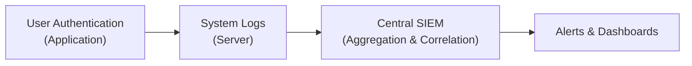

## 18.4 Monitoring Tools: Logging and Access Reviews

Monitoring tools, logging practices, and systematic access reviews constitute a critical part of an effective Identity and Access Management (IAM) strategy. In the context of the CPA profession, these elements are essential to ensure the security of sensitive financial data, compliance with applicable laws and regulations, and alignment with broader internal control frameworks. This section explores key concepts, methodologies, and best practices for robust monitoring within information systems, including how to detect abnormal login patterns and conduct periodic user entitlements reviews.

Ultimately, the objective is to help CPAs and other professionals involved in IT audits or advisory services to evaluate whether an organization’s monitoring controls are sufficiently designed and operating effectively, mitigating the risks of:

• Unauthorized data access.  
• Fraudulent financial transactions.  
• Noncompliance with regulations or internal policies.  
• Potential conflicts with privacy standards (e.g., GDPR, HIPAA).  

---------------------------------------------------------------------------------------------------
  
Monitoring tools often operate in conjunction with security incident and event management (SIEM) systems or log management platforms. These solutions enable you to gain visibility into network activities, user logins, access requests, and changes to critical system or application files. While the software and hardware used for logging can vary significantly depending on an entity’s size and complexity, the underlying principles remain consistent.

Below, we discuss how logging and monitoring fit into a cohesive control environment, relevant frameworks, and how CPAs can verify and test their effectiveness.

---------------------------------------------------------------------------------------------------
  
### The Role of Logging in Access Management

Logging is the process of recording events that occur within an organization’s IT environment. It is foundational for:

• Establishing accountability: Logs help trace activities to specific user accounts.  
• Investigating security breaches: Audit trails are indispensable for identifying root causes.  
• Supporting regulatory compliance: Many frameworks (e.g., SOC 2® Trust Services Criteria, PCI DSS, GDPR) require evidence of log retention and review.  
• Evaluating the effectiveness of controls: IT auditors frequently rely on logs to confirm that controls are consistent with internal policies and external guidelines.

Logs should capture essential event details such as the date and time of the activity, the user or system account involved, the nature of the event, and, ideally, location and system-specific metadata. This data can be analyzed to determine whether user access was appropriate and within the limits of organizational policies.

##### Key Types of Logs

• Authentication Logs: Record login attempts, successful authentications, and login failures.  
• Application and Transaction Logs: Reflect user interactions at the application level, including critical financial transactions or postings.  
• Security System Logs: Generated by firewalls, intrusion detection/prevention systems (IDS/IPS), and antivirus programs.  
• System Event Logs: Monitor changes to system files, configurations, or relevant background processes (e.g., scheduled tasks).  

A centralized approach to log collection—sometimes via a SIEM platform—facilitates real-time analysis and correlated alerts, helping organizations identify suspicious patterns faster.

---------------------------------------------------------------------------------------------------
  
### Key Components of a Logging Infrastructure

While specifics vary, a typical logging environment involves:

• Log Generators: Servers, applications, network devices, operating systems, endpoints, and other resources configured to produce logs.  
• Log Collectors: On-premise or cloud-based agents that gather logs from different systems.  
• Log Aggregation or Storage: Repositories (or data lakes) where logs are consolidated and stored securely.  
• Analytics Engine (SIEM): Specialized software that processes and correlates logs to identify anomalies or security events.  
• Alerting and Reporting Tools: Dashboards or automated messaging systems that notify security teams of high-risk activities or unusual user behavior.  

The diagram below illustrates a high-level flow of logging data into a SIEM or similar solution:

In this flow:
• User activities generated at an application or operating system level are recorded as system logs.  
• These logs are forwarded to a centralized SIEM for aggregation and correlation.  
• The SIEM identifies potential security or compliance events.  
• Real-time alerts and dashboards display key findings for prompt investigation.

---------------------------------------------------------------------------------------------------
  
### Detecting Abnormal Login Patterns

One of the core objectives of logging is to detect anomalies that could indicate compromised accounts, insider threats, or brute force attacks. Below are common indicators and strategies:

1. Excessive Failed Logins  
   - Repeated failed login attempts on a single account (e.g., more than five times) may trigger alerts.  
   - A consistent pattern of lockouts could indicate either forgetful users or malicious actors attempting credential stuffing.

2. Geographic Discrepancies  
   - Logins from two distant geographic regions within an improbable time span (e.g., a user logging in from New York and then an hour later from Hong Kong).  
   - Certain security solutions use IP intelligence or geolocation data to flag such events for further scrutiny.

3. Time-of-Day Alerts  
   - Users logging in at unusual hours (e.g., after midnight for a standard business role) might raise suspicion.  
   - Defining user-specific or role-based thresholds is a best practice.

4. Device and Network Anomalies  
   - Unexpected devices connecting to the network or repeated attempts from a non-corporate IP range.  
   - This also includes analyzing known device IDs for each user.

5. High-Risk Access Attempts  
   - Repeated access attempts to privileged or sensitive systems (e.g., financial transaction systems).  
   - Following Chapter 16’s discussion on threat landscapes, these attempts may indicate an external adversary or an insider with malicious intent.

##### Analytic Techniques

• Statistical Baselines: The SIEM establishes a baseline for each user’s typical behavior (e.g., usual login times, IP ranges). Deviations from the baseline are flagged.  
• Machine Learning (ML) Algorithms: Advanced solutions leverage ML to detect subtle outliers, especially for large enterprises with heavy log volumes.  
• Correlation Rules: A known suspicious pattern (e.g., repeated login failures across multiple user accounts from the same IP) triggers attached alerts.

##### Case Example:  
Imagine an accountant in the Cleveland office typically logs in to the system at 8:00 AM local time. At 3:00 AM, a successful login from a foreign IP address occurs. The system logs a second login from Cleveland at 7:58 AM on the same day. The SIEM recognizes an impossible travel scenario. Investigations reveal that a stolen credential was used, prompting password resets and an immediate security review.

---------------------------------------------------------------------------------------------------
  
### Best Practices for Effective Logging

1. Comprehensive Coverage  
   - Log all critical systems, particularly those hosting sensitive financial data.  
   - Even minor systems, such as development or user acceptance testing environments, can be exploited as pivot points.

2. Log Integrity and Tamper Protection  
   - Use hashing or digital signatures to ensure logs have not been altered.  
   - Restrict access to logs to authorized personnel only, and store backups offline.

3. Log Retention and Archival  
   - Retain logs as required by applicable regulations (e.g., SOX in the United States may require extended retention for financial audits).  
   - Define a systematic archiving process to ensure older logs remain accessible, if needed for historical audits or investigations.

4. Event Prioritization  
   - Assign severity levels or categories (e.g., Info, Warning, Critical).  
   - Triage high-severity alerts more quickly to reduce the window of potential compromise.

5. Alignment with Frameworks and Compliance  
   - Ensure logging is mapped to the controls expected in COBIT, COSO, or industry-specific standards.  
   - For instance, COBIT 2019 emphasizes design factors such as risk context, threat landscape, and compliance requirements.  

---------------------------------------------------------------------------------------------------
  
### Access Reviews and User Entitlements

Logs alone are insufficient if underlying user entitlements are not routinely verified. Over time, employees change roles or leave the organization. Vendors or contractors may also maintain accounts. Without periodic reviews, orphaned accounts or excessive privileges can create significant security risks and lead to compliance issues.

Access reviews (also called user entitlement reviews) aim to validate that each user’s level of access remains:

• Current and aligned to their job function.  
• Authorized by management.  
• Segregated such that no single individual can make and approve significant financial transactions.

Periodic reviews often involve collaboration among IT security teams, department managers, and internal/external auditors. The objective is to reduce the risk of unauthorized transactions or data manipulation, ensuring that each user has only what they need and nothing more.

---------------------------------------------------------------------------------------------------
  
### Steps for a Periodic User Entitlements Review

Below is a recommended process for conducting entitlement reviews. Although customizations are often necessary based on organizational size and complexity, these steps capture fundamental best practices:

1. Collect User Access Records  
   - Generate a full listing of user accounts from relevant systems (e.g., ERP, CRM, finance applications, database accounts).  
   - Include dormant accounts (inactive for 90+ days) to determine if they should be disabled or removed.

2. Map Permissions to Roles  
   - Align existing permissions to explicitly documented roles or functional responsibilities.  
   - Check for “privilege creep,” where individuals accumulate additional access over time without formally relinquishing outdated privileges.

3. Engage Department Heads and Data Owners  
   - Provide department managers with the user listings for their teams.  
   - Request verification or revocation of privileges for each user.  
   - Validate cross-functional users who may need broader access.

4. Identify and Document Exceptions  
   - Log exceptions (e.g., users requiring special privileges).  
   - Assess the rationale for each exception to ensure proper authorization.

5. Remediate as Needed  
   - Disable, remove, or adjust permissions of users who no longer need them.  
   - Address any role-based model inconsistencies or discovered anomalies.

6. Update Policies and Procedures  
   - Revise IAM guidelines or HR offboarding steps to prevent recurring mistakes.  
   - Communicate changes to affected users and provide training where needed.

7. Review and Audit  
   - Document the results of entitlement reviews for internal and external auditors.  
   - Incorporate SAP (Segregation of Duties) testing or other automated checks in ongoing processes, drawing on the risk-based approach from Chapter 4’s IT Audit methodology.

##### Case Example:  
A large insurance firm discovered that nearly 20% of its employees maintained access to a claims processing system even after changing departments. The entitlements review uncovered these discrepancies, thus preventing future unauthorized adjustments to claims data. After remediation, the firm updated their automated HR system feed to trigger access removal once an employee’s role changed.

---------------------------------------------------------------------------------------------------
  
### Monitoring Tools in Action: From Alerts to Access Reviews

A holistic monitoring approach effectively combines real-time event analyses with periodic management reviews:

• **Real-time Monitoring**: SIEM systems and intrusion detection software generate alerts based on correlation rules. Suspicious events—like repeated failed logins—are immediately escalated.  
• **Monthly or Quarterly Reporting**: Summaries of login anomalies, system access logs, and aggregated compliance metrics are shared with management.  
• **Periodic Entitlements Reviews**: At predefined intervals (e.g., quarterly), a thorough user privilege review is performed in collaboration with department managers.  
• **Remediation & Policy Updates**: Observations from both real-time monitoring and scheduled reviews drive continuous improvement of security controls.

---------------------------------------------------------------------------------------------------
  
### Challenges and Common Pitfalls

1. **Overwhelming Volume of Data**  
   - Large organizations can generate millions of events daily. Failure to implement effective filtering and correlation rules can lead to alert fatigue.

2. **Lack of Skilled Personnel**  
   - SIEMs require regular tuning and expert analysts. Many organizations lack resources to maintain a mature monitoring posture.

3. **Weak Logging Configurations**  
   - Inconsistent or incomplete logging fields hamper investigations and may lead to compliance gaps.

4. **Neglected User Review Cycles**  
   - Rapid growth or organizational changes can result in missed entitlements reviews, leading to stagnant or redundant privileges.

5. **Failure to Communicate**  
   - Security teams and business owners sometimes operate in silos, leading to a disconnect in actions required post-review.

---------------------------------------------------------------------------------------------------
  
### Practical Recommendations and Best Practices

• **Automate Where Possible**  
  - Automated tools for collecting, normalizing, and analyzing logs save time and improve consistency.  
  - Automated processes can flag accounts for review upon role change or inactivity.

• **Implement Role-Based Access Control (RBAC)**  
  - Standardize roles and permissions to reduce complexities.  
  - Ensure dynamic provisioning and deprovisioning processes are clearly documented.  

• **Adopt a Risk-Based Focus**  
  - Concentrate on key financial systems first, as misuse can have material impacts on financial statements.  
  - Evaluate risk appetite in alignment with the COSO ERM framework to guide resource allocation.

• **Maintain Clear Audit Trails and Documentation**  
  - CPAs, especially in SOC 1®/SOC 2® engagements, rely on well-documented policies and log data for testing.  
  - Thorough documentation of entitlements reviews can strengthen both internal oversight and external audit readiness.

• **Perform Continuous Testing**  
  - Random checks or targeted spot-checks of privileged accounts throughout the year help validate the consistency of monitoring and user access practices.  
  - Tie these checks to the Chapter 21 guidance on testing security and privacy controls.

---------------------------------------------------------------------------------------------------
  
### Real-World Scenario: Financial Statement Integrity

Consider a scenario where a mid-sized brewery migrates to a modern cloud-based ERP system. The finance director is responsible for journaling transactions and reconciling the accounts each month. After the migration:

1. **Initial Setup**: IT configures logging across the ERP’s general ledger module, capturing user actions for all transactions above a certain threshold.  
2. **Real-Time Alerts**: The system is set to raise notifications if journals exceed $100,000 or if entries are posted outside standard timeframes.  
3. **Access Review**: Quarterly, the finance director reviews user permissions with the head of IT. They discover multiple employees in marketing have the “Financial Journal Entry” role, which once was needed for cross-functional testing but is no longer required.  
4. **Remediation**: Those privileges are revoked, the policy on user provisioning is updated, and all logs remain archived for potential external audit.  

This scenario underscores how combining proactive alerts with routine reviews helps maintain financial statement integrity, preventing unauthorized or fraudulent entries from slipping through.

---------------------------------------------------------------------------------------------------
  
### References and Further Exploration

1. **COBIT 2019 Framework** – A thorough resource for IT governance and management; includes guidance on the importance of logging and monitoring.  
2. **NIST SP 800-53** – Specifies security controls for information systems, detailing the need for audit and accountability controls.  
3. **ISO/IEC 27002** – An international standard detailing best practices for information security, including logging and monitoring.  
4. **AICPA SOC 2®** – The Trust Services Criteria highlight the role of logging and monitoring under the Security and Availability categories.  
5. **“Security Monitoring” (SANS Institute)** – Provides white papers on effectively deploying SIEMs and analyzing logs.  

---------------------------------------------------------------------------------------------------
  
## Test Your Knowledge: Monitoring & Access Logging Quiz



### Which of the following is most essential for detecting geographic-based anomalies in user logins?

- [ ] Recording only the user’s login time and success/failure status
- [x] Collecting IP address or location details in the log data
- [ ] Reviewing logs manually once a year
- [ ] Using one centralized database without analysis tools

> **Explanation:** Detecting geographic anomalies requires details about the source IP or user location. Without that information, the organization cannot differentiate suspicious login locations from normal activities.

### What is the term for a security solution that collects and correlates logs from multiple sources to identify unusual patterns?

- [ ] Firewall
- [ ] Intrusion Prevention System (IPS)
- [x] Security Information and Event Management (SIEM)
- [ ] Endpoint Detection and Response (EDR)

> **Explanation:** A SIEM platform is designed specifically to aggregate logs from various locations and correlate events to detect anomalies, including suspicious login patterns.

### Which of the following is a typical outcome of a periodic user entitlements review?

- [ ] More employees are granted wide-ranging administrative privileges
- [x] Unnecessary access rights or dormant accounts are revoked
- [ ] The creation of new privileged user accounts by default
- [ ] Permissions are never changed; the review is for documentation only

> **Explanation:** User entitlements reviews focus on ensuring the right people have the right level of access. The review typically leads to revoking or adjusting unnecessary privileges.

### A user’s account is frequently locking out with multiple failed password attempts. Which best practice should you implement to reduce false positives while still detecting genuine attacks?

- [ ] Disable the account permanently upon the first violation
- [ ] Stop logging failed login attempts
- [x] Configure a threshold for lockouts and enable alerts for exceptions
- [ ] Reset the password daily

> **Explanation:** Having a threshold, such as five failed login attempts within a certain timeframe, helps distinguish between genuine malicious activity and a legitimate user accidentally typing a wrong password once or twice.

### During an entitlement review, you discover 10 employees who left the company three months ago but still have active user accounts. Which step should follow immediately?

- [ ] Retain the accounts for historical logs
- [x] Revoke or disable those accounts and investigate why they were not removed
- [ ] Ignore them until the next audit
- [ ] Grant them additional privileges to complete the review

> **Explanation:** Orphaned accounts pose a significant security risk. They should be promptly disabled, and the offboarding process should be reviewed to prevent this issue in the future.

### Which is considered a strong log management best practice?

- [x] Using hashing or digital signatures to preserve log integrity
- [ ] Configuring logs to periodically overwrite themselves every 24 hours
- [ ] Disabling logs for backup servers
- [ ] Only logging successful user logins

> **Explanation:** Protecting logs against tampering—often done via hashing or cryptographic techniques—ensures their integrity and reliability for investigations.

### In a zero-trust security model, what does logging focus on to support continuous monitoring?

- [x] Validating every request and recording all access events
- [ ] Relying solely on perimeter security
- [x] Establishing trust based on user location alone
- [ ] Allowing indefinite user sessions without re-authentication

> **Explanation:** Zero-trust practices demand continuous validation of user actions, with comprehensive logging in place to verify each request and quickly identify anomalies. (Note: Two correct answers above reflect continuous monitoring and re-validation are key zero-trust principles. Location alone is insufficient.)

### What is the PRIMARY role of a SIEM alert system?

- [x] Notify security teams in real-time of potential threats
- [ ] Permit unauthorized changes if flagged low severity
- [ ] Automatically fix vulnerabilities in the source code
- [ ] Replace the need for user entitlements reviews

> **Explanation:** SIEM alerting’s main purpose is to raise awareness of suspicious events in real-time. It doesn’t replace fundamental processes such as user entitlements reviews or code remediation.

### Which of the following scenarios indicates an abnormal login pattern?

- [ ] A user logs in at 8:00 AM each business day
- [ ] A user logs in from two cities in 16 hours during personal travel
- [x] A user logs in from two continents within the same hour
- [ ] A contractor uses a VPN to silently connect from a known IP daily

> **Explanation:** Logins from two continents within a very short time frame signal a nearly impossible travel scenario, which is a strong indicator of compromised credentials or suspicious behavior.

### Regular user access reviews should be performed:

- [x] True
- [ ] False

> **Explanation:** Regular (e.g., quarterly or semi-annually) access reviews are crucial for identifying unauthorized or excessive privileges, especially in dynamic organizations where roles and responsibilities change frequently.



---------------------------------------------------------------------------------------------------

## For Additional Practice and Deeper Preparation

### [Information Systems and Controls (ISC)](https://www.udemy.com/course/isc-cpa-mock-exams/?referralCode=E1217303222935C5E464)

**Information Systems and Controls (ISC) CPA Mocks:** 6 Full (1,500 Qs), Harder Than Real! In-Depth & Clear. Crush With Confidence!

- Tackle full-length mock exams designed to mirror real ISC questions.  
- Refine your exam-day strategies with detailed, step-by-step solutions for every scenario.  
- Explore in-depth rationales that reinforce higher-level concepts, giving you an edge on test day.  
- Boost confidence and minimize anxiety by mastering every corner of the ISC blueprint.  
- Perfect for those seeking exceptionally hard mocks and real-world readiness.  

_Disclaimer: This course is not endorsed by or affiliated with the AICPA, NASBA, or any official CPA Examination authority. All content is for educational and preparatory purposes only._
