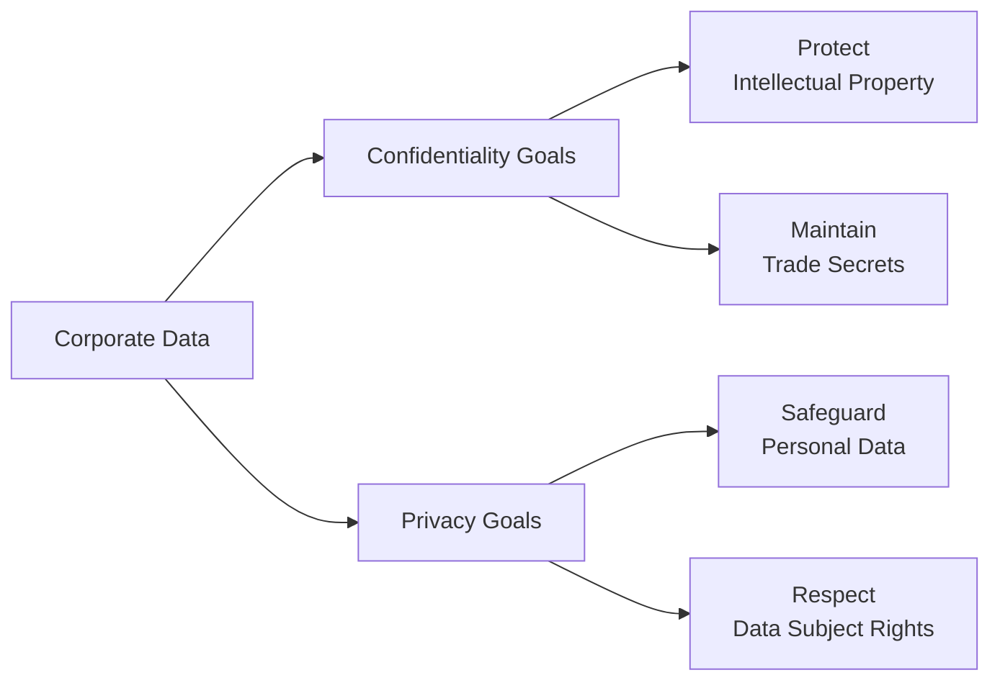

## 19.1 Distinctions Between Confidentiality and Privacy

In today’s interconnected world, data is treasured as both an asset and a liability. As highlighted in Chapter 16 (Foundations of Cybersecurity) and in earlier discussions around data protection in Chapter 14 (Data Integration and Analytics), professionals in accounting, auditing, and advisory roles must ensure that sensitive data remains secure and is handled ethically. Yet the nature of “sensitive data” can vary significantly, raising two distinct but frequently confused concepts: confidentiality and privacy. Understanding the differences between confidentiality and privacy is crucial for Certified Public Accountants (CPAs) operating in complex information technology (IT) environments. This section examines these core concepts, provides examples of corporate versus personal data, explores common regulatory and compliance triggers, and highlights business constraints that affect how organizations manage their data.

------------------------------------------------------------------------------
## Understanding Confidentiality

Confidentiality refers fundamentally to the prevention of unauthorized disclosure of information. It revolves around safeguarding data against unauthorized access, viewing, sharing, or use, irrespective of whether that data is personally sensitive or purely commercial in nature. When organizations speak of “confidential data,” they typically mean information that requires controlled access due to its business value or strategic significance. Examples include the following:

• Strategic Plans and Proprietary Information: This can encompass merger and acquisition (M&A) plans, product roadmaps, market analyses, or any data that provides a competitive edge.  
• Trade Secrets and Intellectual Property (IP): Formulas, research-and-development (R&D) findings, unique operational procedures, or engineering blueprints.  
• Corporate Financial Data: Budget forecasts, revenue details, or financial performance figures that are not disclosed publicly.  
• Internal Communications: Meeting minutes, strategic memos, or internal emails that management deems restricted or sensitive.  

### Typical Controls to Maintain Confidentiality

Businesses often implement various controls to ensure confidential data remains protected. From an auditing standpoint, CPAs should verify the existence and operation of the following controls:

• Access Controls: Enforcing the principle of least privilege and using tools such as role-based access control (RBAC) to ensure that only authorized personnel can read, edit, or delete specific data.  
• Encryption (Refer to 19.2): Employing strong encryption (e.g., AES-256) at rest and in transit to protect data if it is intercepted or stolen.  
• Network Segregation: Splitting critical systems or data repositories into segregated networks or virtual private cloud instances where only designated users or devices can gain entry.  
• Monitoring and Alerting: Implementing intrusion detection/prevention systems, security information and event management (SIEM), or other monitoring solutions that log access attempts and raise alerts for suspicious behavior.  

### Case Example: Corporate Data under NDA

Imagine a start-up software company preparing to merge with a larger tech firm. Both parties agree to share sensitive engineering designs and financial projections. These documents are typically disclosed under a Non-Disclosure Agreement (NDA) that enforces confidentiality. While the information revealed might not always contain personal data (e.g., names or addresses), its business value is high. A breach of confidentiality in this context could lead to lost competitive advantage or even legal liabilities.

------------------------------------------------------------------------------
## Understanding Privacy

Privacy, by contrast, centers specifically on personal or identifiable information—data about individuals, whether employees, customers, or other stakeholders—and how that data is collected, used, stored, and shared. Privacy is best understood as an individual’s right to control their personal information and to know how it is handled. Key attributes include:

• Personal Data, Personally Identifiable Information (PII), and Sensitive Personal Information (SPI): Examples might include social security numbers, health information, or credit-card details. Laws like HIPAA in the U.S. regulate health-related data, while PCI DSS focuses on cardholder data.  
• Consent and Data Subject Rights: Under regulations such as the EU’s General Data Protection Regulation (GDPR), individuals have the right to access, correct, and delete their personal data.  
• Data Minimization and Purpose Limitation: Collecting only the data that is strictly needed for the stated purpose and ensuring that it is not repurposed for undisclosed objectives.  

### Key Regulations Governing Privacy

Although the regulatory environment varies across jurisdictions, there are common frameworks and laws:

• GDPR (European Union): Broad coverage of personal data, imposing strict rules on data handling, breach notifications, consent, and data subject rights.  
• CCPA/CPRA (California, U.S.): Mandates transparency in how businesses collect, use, and share personal information, giving consumers the right to opt out of data sales.  
• HIPAA (U.S. Health Data): Protective measures around personal health information, requiring “covered entities” and their partners to uphold stringent privacy and security standards.  
• Other Jurisdictional Mandates: Examples include Canada’s PIPEDA, Australia’s Privacy Act, and Japan’s Act on the Protection of Personal Information (APPI).  

### Case Example: Handling an Individual’s Private Data

A multinational retailer collects personal data—including demographics, browsing history, and purchase history—from customers to facilitate online purchases. Privacy controls dictate that the retailer can process this information only for fulfilling orders, improving customer experience, or other stated and consented-to purposes. Should the retailer decide to sell or share this data with third-party partners for advertising, it must comply with privacy regulations (e.g., GDPR’s consent requirements) and maintain transparency about how data is repurposed.

------------------------------------------------------------------------------
## Contrasting Confidentiality and Privacy

While confidentiality and privacy often overlap in practice, especially since personal data (the realm of privacy) is also typically considered confidential, there are distinct differences in scope and intention:

1. **Scope of Data**  
   - Confidentiality: Can apply to any sensitive business or organizational information regardless of whether it is personal, financial, or strategic.  
   - Privacy: Focuses specifically on individuals’ personal data, including sensitive information that identifies or can be used to identify a person.

2. **Regulatory Imperatives**  
   - Confidentiality: Driven by internal governance frameworks, contracts such as NDAs, trade secret laws, and standards for safeguarding corporate information.  
   - Privacy: Driven heavily by data protection regulations (GDPR, HIPAA, etc.) that mandate not only the protection but also the permissible usage, retention, and sharing of personal data.  

3. **Ethical and Rights-Based Considerations**  
   - Confidentiality: Often an ethical or fiduciary duty (e.g., CPAs sign confidentiality agreements with clients; employees abide by confidentiality clauses) primarily aimed at protecting the organization’s or stakeholder’s interests.  
   - Privacy: Viewed as a fundamental human right in many jurisdictions, emphasizing individual autonomy, informed consent, and data subject rights.

4. **Enforcement and Consequences**  
   - Confidentiality: Violations can lead to lawsuits, loss of brand trust, or breach of contract damages.  
   - Privacy: Breaches can incur hefty regulatory fines (especially under GDPR), class-action lawsuits, or severe reputational harm if an organization is found misusing or carelessly handling personal data.

The following diagram visually differentiates confidentiality versus privacy:

-------------------------------------------------------------------------------
## Blurring Lines: Corporate vs. Personal Data

In many business contexts—especially those involving large-scale consumer-facing operations—personal data forms part of a company’s broader data ecosystem. An organization may have:

• Corporate Data: Strategic, operational, or financial data that may or may not incorporate confidential aspects.  
• Personal/Consumer Data: Names, addresses, payment details, social media profiles, buying preferences, or health/lifestyle metrics.  

These lines can blur when corporate data systems contain personal information, such as employee payroll databases or customer loyalty systems. In such scenarios, the confidentiality of certain sensitive corporate data overlaps directly with the privacy of the individuals whose information is stored.

### Example: Corporate Database Containing Both Confidential and Private Data
A payroll department’s internal accounting system showcases this overlap. The payroll records are considered confidential corporate records, but they also include employees’ bank information and home addresses. If the system is breached, the organization faces both confidentiality risks (exposing sensitive corporate data such as executive compensation) and privacy risks (revealing personal employee data).

------------------------------------------------------------------------------
## Compliance Triggers and Business Constraints

As CPAs evaluate internal controls and advise on data governance strategies, they must assess various compliance triggers that arise from confidentiality and privacy obligations. Failure to recognize these triggers can lead to financial, legal, and reputational damage.

### Compliance Triggers

1. **Data Classification**  
   - Identifying when data is labeled as “confidential,” “highly confidential,” or “restricted” can trigger specific handling requirements such as encryption, strict access controls, or mandatory monitoring.

2. **Presence of Personal Data**  
   - Whenever an organization’s data sets contain PII, it invokes privacy regulations (e.g., GDPR’s lawful bases for processing personal data).  

3. **Industry-Specific Regulations**  
   - Healthcare organizations must comply with HIPAA. Financial institutions must adhere to GLBA in the U.S., or similar national regulations that protect customer financial data, as well as the relevant sections of the AICPA standards for safeguarding client records.

4. **Contractual Requirements**  
   - NDAs, vendor or client contracts, and strategic partnerships often specify how data must be safeguarded, who has authorized access, and what recourse exists for breaches.

### Common Business Constraints

1. **Costs of Implementing Controls**  
   - Implementing constant monitoring, strong encryption (Chapter 19.2), and robust IT General Controls (Chapters 8 and 10) can be expensive. Organizations must balance costs against risk exposures and compliance mandates.

2. **Operational Efficiency**  
   - Stringent privacy and confidentiality constraints can slow down processes, particularly in data-intensive departments such as marketing. Gathering consent, anonymizing records, or restricting queries might reduce agility in decision-making.

3. **Vendor and Third-Party Interactions**  
   - External agencies, outsourced service providers, or cloud-based technologies (Chapters 29.1 and 29.2) must abide by the same or stricter confidentiality and privacy standards. This often necessitates contractual clauses, audits, or third-party risk assessments.

4. **Global vs. Local Regulations**  
   - Multinational entities face a patchwork of regulations. Data flows crossing borders can introduce additional compliance requirements, such as the need for standard contractual clauses or additional administrative overhead for cross-border data transfers.

------------------------------------------------------------------------------
## Practical Examples and Case Studies

1. **Financial Services Industry**  
   A regional bank handles both commercial (corporate) and personal client information. Failure to protect corporate data under confidentiality agreements could result in litigation. Additionally, personal account data falls under privacy regulations like GDPR (if some customers are EU citizens) and domestic privacy laws. The organization is forced to design layered controls—encryption of personal data in motion and at rest, strict physical controls in data centers, and carefully vetted vendor contracts for credit-card processing.

2. **Manufacturing Firm with International Operations**  
   A global manufacturer might hold design schematics (highly confidential) and client data, including personal contact details for after-sales service and warranty. When these schematics are stored in an ERP (Chapter 6), there is a confidentiality dimension to shield trade secrets from unauthorized competitors. Meanwhile, the personal data of global customers triggers privacy obligations in multiple jurisdictions.

3. **Healthcare Providers**  
   Hospitals and clinics manage electronic health records, which not only need to be kept confidential but also abide by broadly recognized privacy statutes (e.g., HIPAA, GDPR’s data concerning health). Here, confidentiality pertains to professional obligations, while privacy includes informed consent, limits on data reuse, and patient rights to access, correct, or delete personal health data.

------------------------------------------------------------------------------
## Best Practices for Managing Confidentiality and Privacy

• **Develop a Comprehensive Data Governance Framework**  
  - Incorporate data classification, retention policies, and roles and responsibilities (see Chapter 34 for Sample IT Policies).  
  - Maintain strong alignment with standards such as COBIT, NIST, and ISO 27001.  

• **Risk Assessment and Ongoing Monitoring**  
  - Regularly conduct risk assessments to identify evolving threats.  
  - Align with COSO ERM (Chapter 3) to ensure that IT and data risks are included in the overall corporate risk management matrix.

• **Holistic Security and Privacy Policies**  
  - Implement integrated policies that address both confidentiality and privacy demands.  
  - Ensure that policies map to regulatory frameworks, including GDPR, HIPAA, PCI DSS, and other relevant mandates.

• **Data Minimization and Access Restrictions**  
  - For personal data, collect only what is necessary for the stated purpose, encrypt it, and store it securely in minimal-access compartments.  
  - For corporate data, enforce least-privileged access at the level of user groups, ensuring only essential team members can read or modify that information.

• **Training and Awareness**  
  - Develop programs that train employees to recognize the importance of confidentiality and privacy obligations.  
  - Encourage a culture of “security by design,” where confidentiality and privacy are actively considered in all new business processes.

------------------------------------------------------------------------------
## Common Pitfalls

1. **Assuming Confidential Equates to Private**  
   Not all confidential data has direct privacy implications. Failing to differentiate them can cause frustration, confusion, and misallocation of resources.

2. **Over-Collecting Data**  
   Gathering more personal data than necessary can invite additional operational burdens, compliance risks, and potential liability in the event of data breaches.

3. **Underestimating Third-Party Risks**  
   Even if an organization has strong in-house practices, poor vendor security can undermine confidentiality and privacy, as third parties often handle or store critical organizational data.

4. **Neglecting End-of-Life Data Disposal**  
   When equipment or files are retired, organizations must ensure that data is securely destroyed or anonymized. Inadequate disposal can lead to inadvertent disclosures.

------------------------------------------------------------------------------
## Strategies to Overcome Challenges

• **Automation and Tooling**  
  - Employ robust data discovery and classification tools for automatically labeling data at creation or ingestion.  
  - Use specialized Data Loss Prevention (DLP) software (Chapter 19.3) to identify and prevent unauthorized transmission of sensitive data.

• **Privacy by Design and Default**  
  - Incorporate privacy considerations into system design from the outset, ensuring that personal data handling adheres to regulations like GDPR.  
  - Use pseudonymization or anonymization for analytics tasks whenever possible.

• **Confidentiality via Encryption and Access Control**  
  - Adopt strong encryption techniques to protect high-value corporate and personal data.  
  - Implement multi-factor authentication (MFA) for employees with privileged access (see Chapter 18: Authentication and Access Management).

• **Regular Audits and Compliance Reviews**  
  - Utilize SOC engagements (Part V) to evaluate controls, ensuring that confidentiality and privacy measures meet the evolving demands of clients and regulators.  
  - Engage external specialists or internal audit teams to perform penetration tests, vulnerability scans, and compliance checks.

------------------------------------------------------------------------------
## References and Further Exploration

• AICPA Trust Services Criteria (TSC): Covers Security, Availability, Processing Integrity, Confidentiality, and Privacy—helpful for understanding how privacy and confidentiality intersect.  
• GDPR Website (https://gdpr-info.eu): Comprehensive summary of European Union data protection requirements.  
• NIST Privacy Framework (https://www.nist.gov/privacy-framework): Guidance for better identifying and managing privacy risks.  
• ISO 27701: Extension to ISO 27001 for Privacy Information Management Systems to align with global privacy requirements.  

For a more in-depth look, readers can consult additional materials in Chapters 19.2 (Encryption Techniques and Key Management), 19.3 (Data Loss Prevention), and 19.4 (Privacy Laws and Rules) to understand how confidentiality and privacy overlay with specific technical and regulatory controls.  

------------------------------------------------------------------------------

## Enhance Your Knowledge: Confidentiality vs. Privacy Quiz



### Which of the following best defines the concept of confidentiality?  
- [ ] It solely refers to compliance with GDPR and other privacy laws.  
- [x] It involves preventing unauthorized disclosure of sensitive information.  
- [ ] It ensures individuals have control over their personal data.  
- [ ] It deals exclusively with encryption technology.

> **Explanation:** Confidentiality focuses on preventing unauthorized distribution or exposure of sensitive data. It applies broadly to all types of sensitive organizational data, not just personal information.

### Which attribute is generally associated with privacy rather than confidentiality?  
- [ ] Preventing trade secrets from being disclosed  
- [x] Respecting individual data subject rights and obtaining consent  
- [ ] Protecting an organization’s financial forecasts  
- [ ] Limiting access to highly sensitive corporate documents

> **Explanation:** Privacy centers on personal or identifiable information and how individuals’ data rights—initial collection, storage, sharing, and consent—are accommodated.

### Data classification as “confidential” triggers which primary organizational obligation?  
- [x] Restricting unauthorized access through measures like monitoring and encryption  
- [ ] Marketing the data to external clients  
- [ ] Publishing the data publicly to ensure transparency  
- [ ] Eliminating all references to personal identity

> **Explanation:** When data is classified as confidential, entities must deploy controls such as encryption, strict access management, and monitoring to prevent unauthorized disclosure.

### A corporate payroll database that includes employee names, addresses, and bank information most clearly highlights which overlap?  
- [x] Corporate confidentiality and individual privacy  
- [ ] Audit compliance and cost management  
- [ ] Marketing analytics and encryption  
- [ ] Supply chain management and vendor risk

> **Explanation:** Payroll systems contain both high-level corporate data (e.g., salary budgeting) and employees’ personal information (names, addresses, bank details). As such, confidentiality and privacy requirements intersect.

### Under privacy regulations like GDPR, which principle must organizations follow when collecting personal data?  
- [x] Data minimization and purpose limitation  
- [ ] Providing maximum data to third-party vendors for synergy  
- [x] Ensuring data subjects have rights to access and rectify their data  
- [ ] Leveraging all obtained data without restriction

> **Explanation:** GDPR requires organizations to limit data collection to what is essential (data minimization) and use it only for stated and lawfully disclosed purposes (purpose limitation). Data subject rights (like the right to access or delete data) are also central to GDPR compliance.

### Confidential data in a manufacturing firm may include:  
- [x] Intellectual property such as product design documentation  
- [ ] National census data for the entire population  
- [ ] Publicly announced product prices  
- [ ] Generic marketing brochures

> **Explanation:** Product design documentation is proprietary and potentially trade-secret. Disclosing it could damage competitive advantages, thus it is treated as confidential data.

### Which of the following outcomes suggests a breach of privacy, specifically?  
- [x] Unauthorized release of customers’ personal information to third-party advertisers  
- [ ] Disclosure of out-of-date corporate financial statements through an annual report  
- [x] Using personal data for unsanctioned profiling or research  
- [ ] Password-protecting the CFO’s upcoming conference presentation

> **Explanation:** Breaches of privacy occur when an organization improperly handles or shares personal information, violating individual rights to data consent and control. Using data for unauthorized profiling or releasing it to third parties without consent falls squarely under privacy violations.

### Organizational constraints that can affect both confidentiality and privacy initiatives include:  
- [x] Limited budgets and cost considerations  
- [ ] Elimination of all encryption methods  
- [ ] Lack of regulatory frameworks in certain industries  
- [ ] Guarantee of zero risk in all data processes

> **Explanation:** Implementing robust security and privacy programs can be resource-intensive. Budgetary constraints, for example, often limit the sophistication of data protection measures an organization can adopt.

### Which business scenario requires both confidentiality and privacy considerations?  
- [x] A healthcare provider storing patient records electronically  
- [ ] A public library sharing publicly available literature  
- [ ] An e-commerce site selling only household goods with no personal data  
- [ ] A nonprofit handing out public brochures at a local event

> **Explanation:** Patient records involve both corporate obligations (safeguarding medical practice data) and privacy obligations (sensitive health data about individuals). HIPAA and other regulations also apply.

### True or False?  
Confidentiality focuses on preventing unauthorized access to data, while privacy focuses on the rights of individuals over their personal information.  
- [x] True  
- [ ] False  

> **Explanation:** Confidentiality is about controlling access to sensitive information (whether corporate or personal). Privacy is about individuals’ rights and consent regarding their own personal data. Both are critical but serve different objectives.



------------------------------------------------------------------------------

## For Additional Practice and Deeper Preparation

### [Information Systems and Controls (ISC)](https://www.udemy.com/course/isc-cpa-mock-exams/?referralCode=E1217303222935C5E464)

Information Systems and Controls (ISC) CPA Mocks: 6 Full (1,500 Qs), Harder Than Real! In-Depth & Clear. Crush With Confidence!

- Tackle full-length mock exams designed to mirror real ISC questions.  
- Refine your exam-day strategies with detailed, step-by-step solutions for every scenario.  
- Explore in-depth rationales that reinforce higher-level concepts, giving you an edge on test day.  
- Boost confidence and minimize anxiety by mastering every corner of the ISC blueprint.  
- Perfect for those seeking exceptionally hard mocks and real-world readiness.

_Disclaimer: This course is not endorsed by or affiliated with the AICPA, NASBA, or any official CPA Examination authority. All content is for educational and preparatory purposes only._
