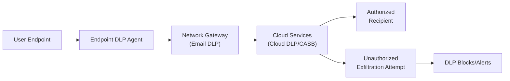

## 19.3 Data Loss Prevention (DLP) Tools and Strategies

Data Loss Prevention (DLP) is a systematic approach to identifying, monitoring, and preventing unauthorized use, transmission, or exfiltration of sensitive data. Accountants, auditors, and information systems (IS) professionals rely on DLP tools and strategies to protect confidential information, ensure regulatory compliance, and reinforce stakeholder trust. While DLP solutions have existed for many years, evolving threats and technologies require continuous updates and new approaches—particularly in cloud environments, mobile endpoints, and integrated enterprise systems.

DLP is especially critical for organizations handling large volumes of personally identifiable information (PII), financial data, intellectual property, or proprietary research. Governing frameworks such as the AICPA Trust Services Criteria and regulatory mandates like HIPAA, PCI DSS, or GDPR demand demonstrable controls over data privacy and confidentiality. This section explores how DLP solutions function, examines various implementation strategies, and provides examples of how unauthorized data exfiltration can occur across email, endpoints, and cloud services.

### The Importance of DLP in Modern Organizations
Modern organizations face an array of challenges as technology extends beyond traditional on-premises IT infrastructure—encompassing remote workforces, cloud-based solutions, third-party integrations, and mobile platforms. Sensitive data moves fluidly across internal networks, endpoints, email channels, and cloud storage. Without robust DLP controls, organizations risk:

• Regulatory fines and sanctions for compliance violations.  
• Reputational harm due to data breaches or unintentional disclosure.  
• Competitive disadvantages if trade secrets or proprietary data leak.  
• Legal and financial liabilities resulting from identity theft or fraud.  

### Key Concepts and Types of DLP
DLP solutions typically categorize data as “in motion,” “at rest,” or “in use”:

• Data in Motion: Data traveling across networks (e.g., email attachments, file transfers to cloud).  
• Data at Rest: Data stored in databases, file repositories, local drives, or backup media.  
• Data in Use: Data currently accessed or modified on endpoints, applications, or processes.  

By continually inspecting and analyzing data across these stages, DLP tools can automatically block unauthorized transmissions, alert security personnel to suspicious activity, or trigger encryption policies to secure data.

At a high level, DLP platforms use defined policies, pattern recognition (e.g., matching of Social Security Numbers, credit card data), and contextual analysis to detect sensitive information. They then apply rules to enforce protective actions, such as blocking data transfers or notifying administrators of suspicious behavior.

### Common Data Exfiltration Scenarios
Data loss or exfiltration can happen intentionally through malicious insiders or unintentionally via negligent employees unaware of corporate data policies. Understanding common scenarios helps professionals build proactive strategies:

• Sending Sensitive Information to Personal Email: An employee might try to forward confidential reports to a personal email address for convenience.  
• USB Drive Exfiltration: A contractor plugs in a USB thumb drive to copy large customer databases or financial records.  
• Cloud Storage Upload: An employee syncs files containing PII to unauthorized cloud services without encryption.  
• Insider Threat for Competitive Gain: A departing employee with privileged access stealthily downloads client lists or proprietary designs.  
• Phishing-Induced Disclosure: An unwitting employee is tricked into uploading internal data to a spoofed website.  

DLP tools mitigate such threats by monitoring file transfers, analyzing content, and restricting unauthorized user actions based on organizational policies.

### DLP Monitoring in Email, Endpoints, and Cloud
DLP capabilities extend across various information channels. Below are three primary areas where DLP monitoring proves essential:

#### Email DLP
Email remains one of the most frequent avenues for data exfiltration—both malicious and accidental. DLP solutions configured on the email gateway or integrated into cloud-based email services can scan attachments and message bodies for sensitive keywords, patterns (e.g., credit card regex), or metadata. When a policy violation is detected (e.g., an email containing client account numbers is being sent outside the approved domain), the DLP system can:

• Block or quarantine the email.  
• Mask/redact sensitive data.  
• Encrypt attachments automatically.  
• Notify compliance or security teams.

A typical scenario might involve an accountant inadvertently attaching a spreadsheet with non-redacted Social Security Numbers to an external email for a client. An email-based DLP system would flag or block this transmission, promoting safer handling of confidential data.

#### Endpoint DLP
Endpoint DLP addresses data exfiltration or misuse at the user’s workstation, laptop, or mobile device. The software agents installed on endpoints continuously monitor file activities, clipboard usage, and attempts to transfer files to external media (USB drives, DVD writers, etc.) or to external sites. Key capabilities include:

• Identifying files containing restricted keywords or sensitive content.  
• Preventing or logging unauthorized copy/paste actions.  
• Blocking uploads to unapproved websites.  
• Alerting administrators if specific file types (e.g., .pdf, .xlsx) are transferred to personal devices.  

For example, an employee attempting to upload large volumes of customer data to a personal Dropbox account would trigger an alert, as the agent examines both file size and content. Such preventative measures thwart exfiltration at the endpoint level, often before data even leaves the corporate network.

#### Cloud DLP
As organizations embrace cloud-based services (e.g., SaaS platforms, IaaS solutions), DLP systems integrate with Cloud Access Security Brokers (CASBs) or native cloud security features to monitor and secure data in transit and at rest in third-party environments. Cloud DLP:

• Inspects data as it moves between on-premises and cloud apps.  
• Identifies exposed data in cloud repositories (e.g., misconfigured S3 buckets).  
• Applies encryption or redaction within cloud file stores.  
• Monitors collaboration tools (SharePoint, Google Drive, Microsoft Teams) for unauthorized data sharing.  

This approach ensures consistent enforcement of corporate data policies regardless of where data resides. For instance, if a user attempts to share a spreadsheet containing unmasked credit card details with an external partner, the DLP system can quarantine the document or alert the governance team based on established rules.

### Core DLP Components and Functionality

#### Data Discovery and Classification
Successful DLP programs begin with robust data discovery—locating all instances of sensitive data, whether stored on servers, endpoints, or cloud drives. Classification tags (e.g., “Confidential,” “Restricted,” “Public”) are then applied to ensure consistent handling per regulatory or organizational standards. Classical or AI-enabled scanning tools parse unstructured content (e.g., Word documents, PDFs) and structured content (databases, spreadsheets) to identify data requiring protection.

#### Policy Creation and Customization
DLP policies define the rules and thresholds that trigger protective actions. These policies can reference:

• Specific data types (e.g., health records, payment card information).  
• Keywords or patterns (regex for tax IDs).  
• User roles or access levels (managers, HR staff, external contractors).  
• Compliance mandates (HIPAA, GDPR, PCI DSS).  

By tailoring policies to reflect regulatory requirements and a company’s risk appetite, organizations mitigate false positives and ensure only truly sensitive material is flagged.

#### Detection Techniques
DLP solutions employ multiple detection techniques, including:

• Rule-Based/Regex Matching: Searching for patterns like social security numbers or credit card info.  
• Exact Data Matching (EDM): Comparing data against known sensitive datasets (e.g., exact match of account numbers).  
• Contextual Analysis: Examining file metadata, location, or user privileges.  
• Machine Learning/Heuristics: Identifying suspicious activity based on user behavior patterns.

Using a layered approach to detection increases accuracy and reduces annoyance from unneeded blocks or alerts.

#### Incident Response and Remediation
When DLP systems detect a violation, they can block, quarantine, or automatically encrypt the data before transmission. Equally important is the workflow that notifies stakeholders and logs incidents for further review. Tying DLP alerts into an incident response system (see Chapter 20: Incident Response and Recovery) ensures immediate triage and escalation. Remediation efforts may include user training, reclassification of data, or deeper forensic analysis if malicious intent is suspected.

### Visualizing a DLP Ecosystem

Below is a simplified Mermaid diagram illustrating how DLP integrates across an organization's email, endpoint, and cloud workflows:

• User Endpoint: Where data is created or edited.  
• Endpoint DLP Agent: Monitors local actions and enforces policy.  
• Network Gateway (Email DLP): Examines email traffic, attachments, and content.  
• Cloud Services (DLP/CASB): Protects data as it enters or leaves cloud repositories.  
• Authorized Recipient: Intended secure path.  
• Unauthorized Exfiltration Attempt: Triggered if policy violation is detected, leading to block or alert.

### Integration with Governance and Regulatory Frameworks
DLP aligns with broader internal control frameworks such as COSO Internal Control – Integrated Framework and COBIT 2019. DLP serves as a detective and preventative control, contributing to objectives within the Control Environment, Risk Assessment, and Control Activities components. When integrated with the organization’s Enterprise Risk Management (ERM) strategy, DLP helps identify and measure the risks tied to data handling and exfiltration:


\text{Risk} = \text{Probability of Occurrence} \times \text{Potential Impact}


For CPAs performing IT audits, verifying that an entity has robust DLP and is following relevant standards provides an added layer of assurance that organizational data remains protected, thus reducing the likelihood of financial misstatement due to data manipulation or theft.

### Best Practices for Implementing DLP
• Start with Data Mapping and Classification: Comprehensive data discovery sets the foundation for meaningful classification and accurate DLP policies.  
• Focus on High-Risk Data and Channels: Tailor DLP to critical assets and business processes (e.g., payment processing, customer support).  
• Collaborate with Cross-Functional Teams: Involve legal, compliance, HR, and internal audit to refine policies that balance security with usability.  
• Train Employees Regularly: Emphasize the importance of proper data handling to reduce accidental leaks.  
• Integrate with Identity and Access Management (IAM): Align user privileges and group memberships with DLP policies for consistent enforcement.  
• Conduct Tests and Tune Policies: Periodically test DLP rules (e.g., “red team” exercises) and refine to address false positives or coverage gaps.  
• Maintain an Incident Response Plan: Ensure DLP alerts feed directly into established workflows for triage, containment, and remediation (see Chapter 20).

### Common Pitfalls and Challenges
• Overly Restrictive Policies: Excessive blocking can hamper daily operations and frustrate users.  
• Lack of Data Context: Focusing on keywords alone can yield too many false positives.  
• Insufficient Ongoing Maintenance: Data classification and DLP policies must stay updated as the business evolves.  
• Failure to Monitor Insider Threats: Managing privileged users requires advanced DLP controls and user behavior analytics.  
• Poor User Training: The best DLP tools are less effective if employees don’t understand how to comply with policies.

### Real-World Example
A mid-sized financial services firm discovered during an internal audit that employees commonly emailed spreadsheets containing customers’ partial account details to personal accounts for after-hours work. Although staff used partial masking, the DLP discovered repeated transmissions of unmasked fields. Once aware of the risk, management revised the DLP policies to block any document referencing partial account details sent to external domains, train employees on secure remote access, and permanently ban personal cloud usage for sensitive data. As a direct result, unauthorized exfiltration attempts decreased, and the firm significantly improved its regulatory compliance posture.

### Looking Ahead
Just as cyber threats evolve, DLP must advance to accommodate new vectors such as collaboration tools, AI-based communication platforms, and remote workforce expansions. Modern solutions incorporate machine learning for enhanced anomaly detection and integrate with Zero-Trust architectures (see Chapter 16.4) to shrink potential attack surfaces. CPAs and IT auditors who understand these developments can provide valuable insights in designing an architectural approach that balances security, productivity, and compliance.

Organizations should anticipate continuous enhancements in DLP posture, including improved cloud integration and real-time monitoring of user behaviors, to safeguard data confidentiality well into the future.

## Test Your Knowledge: Data Loss Prevention Tools and Strategies



### What is the primary purpose of implementing a DLP solution?
- [ ] To accelerate the backup process
- [x] To prevent unauthorized exfiltration or disclosure of sensitive data
- [ ] To streamline software development workflows
- [ ] To eliminate all insider threats in an organization

> **Explanation:** DLP solutions focus on protecting sensitive information by preventing unauthorized transmission, mitigating leaks, and enforcing compliance with data security policies.

### Which is an example of data in motion monitored by a DLP system?
- [x] An email attachment containing personally identifiable information
- [ ] A file stored on a network share folder
- [ ] A local spreadsheet saved on an employee’s laptop
- [ ] A report archived in an off-site storage unit

> **Explanation:** Data in motion refers to data actively traveling across networks or between systems (e.g., email attachments). Files stored on local devices or in archives are considered data at rest.

### Which technique is commonly used in DLP to detect sensitive information like credit card numbers or Social Security Numbers?
- [ ] Blacklisting IP addresses
- [x] Regex or pattern-based scanning
- [ ] Full-stack application logging
- [ ] Dynamic Trojan detection

> **Explanation:** DLP tools often rely on regex or pattern-based matching to identify structured data (e.g., credit card or social security numbering schemes).

### Which of the following is true about endpoint DLP?
- [x] It prevents users from copying sensitive information to USB or external drives
- [ ] It only monitors emails
- [ ] It has no capability to block local file transfers
- [ ] It works only for cloud-based applications

> **Explanation:** Endpoint DLP agents can monitor and restrict actions on end-user devices, including file transfers to external media and uploads to unauthorized websites.

### For a company that frequently shares spreadsheets with client data, which best practice strengthens DLP effectiveness?  
- [x] Classifying data by sensitivity and configuring DLP policies to block high-risk file sharing
- [ ] Deleting all spreadsheets monthly to reduce data volume
- [x] Training employees to recognize and handle confidential data responsibly
- [ ] Allowing unencrypted file sharing as long as the user logs the activity

> **Explanation:** Organizations increase DLP effectiveness by classifying data, applying relevant controls, and training employees on data security protocols.

### What is a common pitfall of DLP implementations that leads to false positives?
- [x] Relying heavily on single keyword detection
- [ ] Maintaining multiple detection modes (regex, ML, context)
- [ ] Updating the classification schema regularly
- [ ] Using advanced encryption protocols

> **Explanation:** Overly simplistic keyword detection can flag benign communications or block normal workflows. Multi-layered detection and routine tuning help reduce false positives.

### Which entity often provides DLP guidance and related cybersecurity standards?
- [x] NIST
- [ ] The World Trade Organization
- [x] COBIT
- [ ] The United Nations

> **Explanation:** Both NIST and COBIT (through ISACA) offer DLP and cybersecurity frameworks. NIST publishes guidelines such as SP 800-53, and COBIT provides IT governance principles. 

### How do cloud DLP solutions protect data on external platforms?
- [ ] By blocking all data flows to the cloud
- [x] By integrating with CASBs or cloud-native tools to monitor and control access  
- [ ] By scanning only data at rest in on-prem databases
- [ ] By necessarily replacing email DLP solutions

> **Explanation:** Cloud DLP solutions work alongside CASBs or use native features to inspect data flows to/from the cloud and apply protective actions accordingly.

### Which statement characterizes a strong DLP incident response process?
- [x] Alerts are triaged systematically, and remediation involves blocking or encrypting data
- [ ] DLP alerts are handled exclusively by third-party vendors
- [ ] Incidents are tracked manually using paper logs
- [ ] Users are never informed of policy violations to avoid panic

> **Explanation:** Effective DLP incident response includes automated alerting, prompt triage, defined escalation paths, and correct remediation measures (e.g., blocking, quarantine).

### True or False: DLP can eliminate all insider threats.
- [x] True
- [ ] False

> **Explanation:** This is a trick statement. The assumption might be that insider threats cannot be fully eliminated; however, a comprehensive DLP strategy combined with user behavior analytics and strong controls can significantly reduce insider threat risk. If we interpret “eliminate all insider threats” strictly, no security measure is absolute. The question states “True or False,” but the best practice is to note that DLP cannot guarantee zero insider threat, though it mitigates them substantially. 



## For Additional Practice and Deeper Preparation

### [Information Systems and Controls (ISC)](https://www.udemy.com/course/isc-cpa-mock-exams/?referralCode=E1217303222935C5E464)

Information Systems and Controls (ISC) CPA Mocks: 6 Full (1,500 Qs), Harder Than Real! In-Depth & Clear. Crush With Confidence!  

• Tackle full-length mock exams designed to mirror real ISC questions.  
• Refine your exam-day strategies with detailed, step-by-step solutions for every scenario.  
• Explore in-depth rationales that reinforce higher-level concepts, giving you an edge on test day.  
• Boost confidence and minimize anxiety by mastering every corner of the ISC blueprint.  
• Perfect for those seeking exceptionally hard mocks and real-world readiness.  

_Disclaimer: This course is not endorsed by or affiliated with the AICPA, NASBA, or any official CPA Examination authority. All content is for educational and preparatory purposes only._
