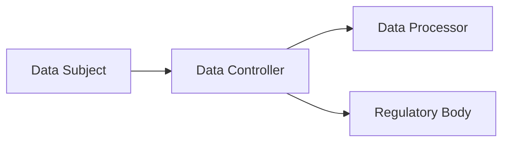

## 19.4 Privacy Laws and Rules (HIPAA, GDPR, Other Jurisdictional Mandates)

Privacy regulations have become a crucial focus for organizations worldwide, especially in the context of complex information systems that process sensitive data. This section examines key privacy laws and rules, highlighting the Health Insurance Portability and Accountability Act (HIPAA), the General Data Protection Regulation (GDPR), and other major jurisdictional mandates. We will address compliance considerations, data subject rights (particularly under GDPR), penalties for noncompliance, and the role CPAs can play in ensuring robust privacy and data protection controls.

Organizations handling consumers’ data—whether related to health, financial, or personal identifiers—must blend technical, legal, and operational strategies to minimize risks. Data confidentiality and privacy, introduced in earlier sections of this chapter, set the foundation for understanding how these robust regulatory frameworks intertwine with IT controls and governance systems (refer to Chapters 16 and 17 for security architecture, and Chapter 18 for authentication and access management methods).

-------------------------------------------------------------------------------
## HIPAA: An Overview

### Purpose and Scope
The Health Insurance Portability and Accountability Act (HIPAA) governs the safeguarding of Protected Health Information (PHI) in the United States. HIPAA applies primarily to covered entities (health plans, healthcare providers, and healthcare clearinghouses) and their business associates (organizations handling PHI on behalf of a covered entity). This law ensures that health data remains confidential, accessible only to authorized parties, and protected against unauthorized disclosure or alteration.

HIPAA comprises several components, including:
• Privacy Rule: Establishes guidelines to protect individuals’ medical records and other personal health information.  
• Security Rule: Sets security standards for handling ePHI (electronic Protected Health Information).  
• Breach Notification Rule: Mandates prompt reporting to affected individuals and the government when a data breach occurs.

### Key Requirements for Organizations
1. Administrative Safeguards: Implement policies and procedures defining workforce responsibilities in handling PHI.  
2. Physical Safeguards: Deploy facility access controls, workstation protection, and secure device disposal measures.  
3. Technical Safeguards: Use encryption, access controls, and audit logs to secure ePHI.

### Quick Compliance Tips
• Conduct Regular Risk Assessments: Evaluate vulnerabilities in systems and processes to identify areas requiring remediation.  
• Implement Strong Access Controls: Restrict PHI access through role-based access management, multi-factor authentication, and employee training (see Chapter 18 for deeper guidance).  
• Encrypt Sensitive Data: Store and transmit ePHI with secure encryption algorithms.  
• Maintain Policies and Procedures: Keep clear documentation for privacy, security, and breach response. Update them as the regulatory environment evolves.  
• Monitor and Audit Systems: Leverage logging and monitoring tools to detect unauthorized access or suspicious activity promptly.

### Enforcement and Penalties
Civil penalties can range into millions of dollars per year, depending on the violation’s seriousness and frequency. In extreme cases, criminal penalties may include fines and imprisonment. Examples include significant settlements with hospital systems that fail to adequately protect ePHI due to weak access controls or persistent unaddressed vulnerabilities.

### Real-World Case Study
A mid-sized healthcare clinic experienced a ransomware attack that compromised patient records. Upon investigation, regulators discovered the clinic lacked a proper risk analysis, had minimal staff training, and stored unencrypted sensitive data on shared drives accessible to non-medical personnel. The resulting settlement emphasized the need for robust technical safeguards and a well-documented HIPAA compliance program.

-------------------------------------------------------------------------------
## GDPR: An Overview

### Purpose and Scope
The General Data Protection Regulation (GDPR) is a European Union (EU) regulation governing the processing of personal data of EU residents, regardless of where the processing organization is located. Its extraterritorial reach means that if an organization offers goods or services to EU residents or monitors their behavior, it must comply with GDPR’s requirements. This wide scope signals a global shift toward stringent data protection standards.

GDPR enforces transparency, accountability, and strong user rights concerning the processing of personal data. In this context, personal data refers to any information relating to an identified or identifiable natural person, such as name, identification number, location data, or online identifiers.

### Data Subject Rights Under GDPR
A hallmark of GDPR is the comprehensive set of rights it guarantees to data subjects. These rights are essential for organizations to acknowledge, protect, and operationalize through well-designed IT controls:

• Right to Be Informed: Organizations must inform individuals about how their data is collected, processed, and stored, typically through a clear privacy notice.  
• Right to Access: Data subjects can request to view the personal data an organization holds about them.  
• Right to Rectification: Users can request corrections to inaccurate or incomplete personal data.  
• Right to Erasure ("Right to Be Forgotten"): Data subjects can request their personal data be erased under certain circumstances (e.g., data no longer needed for the original purpose).  
• Right to Restrict Processing: Individuals can limit how their data is processed in specific scenarios, such as when data accuracy is contested.  
• Right to Data Portability: Data subjects may obtain and reuse their personal data across different services.  
• Right to Object: Users can object to data processing for reasons such as direct marketing or certain public interest tasks.  
• Rights Related to Automated Decision-Making: Data subjects can request human intervention and challenge decisions made solely through automated processes, including profiling.

### Accountability Principle
GDPR’s Accountability Principle compels organizations to not only comply with the regulation but to be able to demonstrate this compliance at every level of data processing. Documented policies and procedures, robust IT controls (refer to Chapter 7 on business processes and Chapter 8 on IT general controls), and continual auditing and reporting are vital components.

### Visualizing GDPR Data Flows

Below is a sample diagram illustrating a high-level flow of personal data, from the data subject to the data controller and data processor, under regulatory oversight:

• The Data Subject (A) is the individual whose personal data is being collected.  
• The Data Controller (B) determines the purposes and means of processing personal data.  
• The Data Processor (C) acts on behalf of the controller, following its instructions.  
• The Regulatory Body (D) enforces GDPR and addresses noncompliance.

### Quick Compliance Tips
• Maintain a Complete Data Inventory: Identify and categorize personal data to understand the scope of GDPR obligations.  
• Ensure Lawful Basis for Processing: Determine whether consent, contractual necessity, legal obligation, vital interests, public task, or legitimate interest applies.  
• Implement Privacy by Design and Default: Bake privacy considerations into system development and configurations from the outset (see Chapter 10 for change management considerations).  
• Appoint a Data Protection Officer (DPO) (if required): The DPO is responsible for advising on GDPR obligations, monitoring compliance, and acting as a liaison with the regulatory authority.  
• Conduct Data Protection Impact Assessments (DPIAs): Evaluate risks for any new data processing activities that might significantly impact individual rights and freedoms.

### Penalties for Noncompliance
GDPR imposes significant fines for violations. Fines can reach up to €20 million or 4% of annual global turnover (whichever is higher). Some well-known cases of noncompliance have included multinational corporations and large-scale data breaches, highlighting the severity with which EU data protection authorities enforce these regulations.

### Real-World Example
An e-commerce retailer processing the personal data of EU residents for marketing purposes inadvertently shared user browsing history with third-party advertisers without user consent. The lack of a lawful basis for processing and inadequate privacy notices led to a substantial fine. The retailer then implemented a robust data subject request (DSR) workflow and updated privacy notices, underscoring the importance of transparency and valid consent mechanisms.

-------------------------------------------------------------------------------
## Other Jurisdictional Mandates

While HIPAA and GDPR remain prominent, other regions have enacted privacy regulations that organizations must account for, particularly if they engage with individuals residing in these jurisdictions.

### Common Examples
• CCPA (California Consumer Privacy Act): Grants California residents data privacy rights, including the right to know, delete, and opt-out of the sale of personal information. The newly introduced California Privacy Rights Act (CPRA) further expands these protections.  
• PIPEDA (Personal Information Protection and Electronic Documents Act) in Canada: Governs how private-sector organizations collect, use, and disclose personal information in the course of commercial activities.  
• LGPD (Lei Geral de Proteção de Dados) in Brazil: Resembles GDPR’s framework for data protection and imposes similar rights and obligations on data processing activities.  
• APPI (Act on the Protection of Personal Information) in Japan: Emphasizes consent and disclosure obligations and sets standards for handling personal data.

### Quick Compliance Tips
• Conduct a Jurisdictional Analysis: Map out where data is collected, where it is stored, and which regulations might therefore apply.  
• Adapt Privacy Notices and Consent Mechanisms: Ensure compliance across multiple legal regimes by including the relevant disclosures and opt-in/out clauses for each region.  
• Maintain Consistency in Internal Controls: Alignment with established frameworks (e.g., NIST Privacy Framework, ISO 27701) helps harmonize requirements and reduce duplication of efforts.  
• Stay Alert to Emerging Regulations: As countries worldwide introduce or update privacy laws, building flexible, scalable data governance processes is paramount.

### Real-World Example
A financial services firm with customers in the United States, Canada, and the EU initially viewed CCPA, PIPEDA, and GDPR compliance efforts as separate. Over time, the repetitive nature of compliance tasks (e.g., data mapping, privacy notices, breach response) prompted the firm to adopt a unified data privacy strategy. By implementing a comprehensive privacy program that accounted for the core principles shared by these regulations, the firm curtailed administrative overhead and reduced regulatory risks.

-------------------------------------------------------------------------------
## Best Practices for CPA Involvement

CPAs often serve as trusted advisors on compliance matters, given their emphasis on internal controls and auditing principles. CPAs can support organizations in several ways:

• Assessing the Design and Effectiveness of Controls: Evaluate whether privacy controls meet the relevant regulatory requirements (see Chapter 8 on IT General Controls).  
• Advising on Risk Management: Identify how noncompliance can impact financial statements, brand reputation, and legal liabilities, applying frameworks like COSO ERM (see Chapter 3).  
• Coordinating with Legal and IT: Bridge communication gaps between privacy counsel, IT teams, and executive leadership.  
• Auditing and Reporting: Prepare or review compliance-related documentation, ensuring completeness and accuracy for examinations, due diligence, or external audits.

-------------------------------------------------------------------------------
## Common Pitfalls and Potential Challenges

1. Overlooking Applicability: Small organizations sometimes assume they are exempt, but even minimal processing of certain data may trigger compliance.  
2. Inconsistent Recordkeeping: Failing to keep updated records of processing activities can undermine breach investigations and hamper compliance demonstrations.  
3. Underestimating Data Flow Complexity: Modern hybrid or multi-cloud architectures (see Chapter 29) can obscure data lineage, complicating compliance activities.  
4. Underfunded Privacy Programs: Without proper personnel, tools, or training, organizations tend to encounter compliance gaps, often only identified after a breach or an audit.  
5. Lack of Ongoing Monitoring: Privacy regulations are not static; new rulings, guidance, or enforcement priorities arise frequently. Organizations must remain vigilant and agile.

-------------------------------------------------------------------------------
## Conclusion

Navigating a proliferating landscape of privacy regulations requires a holistic approach, integrating solid governance, proven IT controls, and well-trained personnel. HIPAA demands focused protections for healthcare data, while GDPR sets a broad global standard for transparent and rights-based data processing. In addition, other regional mandates like CCPA, PIPEDA, and Brazil’s LGPD highlight the need for multinational businesses to adapt to multiple legal frameworks simultaneously.

CPAs, with their deep expertise in controls, risk assessment, and compliance reporting, are uniquely positioned to guide organizations toward robust data privacy practices. By proactively establishing strong data governance, identifying potential control weaknesses, and aligning organizational policies with regulatory requirements, CPAs help ensure that privacy risks remain mitigated and stakeholder trust remains secure.

Organizations that embrace a comprehensive, forward-thinking privacy strategy are more likely to maintain compliance, reduce risk exposure, and strengthen their reputations in the evolving digital marketplace.

-------------------------------------------------------------------------------
## Privacy Laws and Rules Knowledge Check



### Under HIPAA, which of the following is a core emphasis when securing protected health information (PHI)?
- [ ] Relying on manual processes without clear policies
- [x] Ensuring appropriate administrative, physical, and technical safeguards
- [ ] Delegating all responsibilities to third-party service providers
- [ ] Avoiding role-based access and focusing on open access
> **Explanation:** HIPAA requires administrative, physical, and technical safeguards to protect electronic PHI from unauthorized access or disclosures.

### Which GDPR principle compels organizations to demonstrate that they have taken steps to comply with data protection requirements?
- [ ] The Valid Consent Principle
- [ ] The Retention Principle
- [ ] The Minimization Principle
- [x] The Accountability Principle
> **Explanation:** The Accountability Principle requires organizations to not only comply but also provide evidence of their compliance efforts.

### What is the maximum financial penalty for a GDPR violation, depending on the offense category?
- [ ] €500,000
- [ ] No applicable limit
- [ ] 2% of global turnover or €4,000,000
- [x] 4% of annual global turnover or €20 million, whichever is higher
> **Explanation:** GDPR fines can be as high as 4% of annual global revenue or €20 million, whichever is larger.

### Under the GDPR, a data subject’s right to have personal data deleted under certain grounds is known as:
- [ ] Right to Access
- [x] Right to Erasure ("Right to Be Forgotten")
- [ ] Right to Restrict Processing
- [ ] Right to Object
> **Explanation:** The Right to Erasure allows individuals to request deletion of their data when certain conditions are met (e.g., data is no longer necessary).

### Which statement best describes a common pitfall in privacy compliance?
- [x] Failing to perform or update data inventories leads to unknown privacy risks
- [ ] Overcommunicating transparent privacy policies to customers
- [x] Relying solely on advanced encryption without governance or organizational policies
- [ ] Conducting risk assessments at least once a year
> **Explanation:** Not conducting comprehensive data inventories or having incomplete policies can result in significant blind spots in privacy compliance. Also, relying exclusively on technical measures without strong governance can create gaps in policy enforcement.

### Which regulation primarily governs the protection of electronic Protected Health Information (ePHI) in the U.S. healthcare sector?
- [x] HIPAA
- [ ] GDPR
- [ ] CCPA
- [ ] LGPD
> **Explanation:** HIPAA sets standards for securing, handling, and disclosing PHI within healthcare-related industries in the United States.

### In a multinational organization, which measure helps unify compliance across regulations like GDPR, CCPA, and PIPEDA?
- [ ] Outsourcing all IT services to unregulated third parties
- [ ] Developing a narrow, single-country information governance strategy
- [x] Adopting comprehensive, scalable data governance frameworks
- [ ] Delaying compliance until an actual breach occurs
> **Explanation:** Employing a scalable data governance approach can streamline compliance with various regulatory frameworks by embedding core principles into policies and procedures.

### Under GDPR’s data portability right, a data subject can request:
- [ ] A random selection of their data without explanation
- [x] A commonly used, machine-readable copy of their data to transfer to another service
- [ ] The immediate deletion of all data from all systems worldwide
- [ ] Unlimited restitution for intangible damages
> **Explanation:** Data portability allows individuals to receive their personal data in a commonly used, machine-readable format to reuse or transfer to another controller.

### Which of the following is a key benefit of running Data Protection Impact Assessments (DPIAs) under GDPR?
- [ ] Eliminating the need to comply with data breach notifications
- [ ] Replacing all internal audits with a single assessment
- [x] Identifying and mitigating high-risk data processing activities early
- [ ] Exempting an organization from administrative fines
> **Explanation:** DPIAs analyze the necessity and proportionality of data processing, helping detect and address high risks before they materialize.

### Under HIPAA and GDPR, organizations may face penalties if:
- [x] They fail to implement and maintain appropriate security controls for sensitive data
- [ ] They exceed their marketing budget
- [ ] They hire professionals to manage compliance
- [ ] They provide staff with annual privacy trainings
> **Explanation:** Both HIPAA and GDPR penalize inadequate security measures or negligence in maintaining data protection standards, regardless of other unrelated metrics like marketing budgets or training frequency (though lack of adequate training can be a factor in demonstrating noncompliance).



-------------------------------------------------------------------------------

## For Additional Practice and Deeper Preparation

### [Information Systems and Controls (ISC)](https://www.udemy.com/course/isc-cpa-mock-exams/?referralCode=E1217303222935C5E464)  

**Information Systems and Controls (ISC) CPA Mocks:** 6 Full (1,500 Qs), Harder Than Real! In-Depth & Clear. Crush With Confidence!

- Tackle full-length mock exams designed to mirror real ISC questions.  
- Refine your exam-day strategies with detailed, step-by-step solutions for every scenario.  
- Explore in-depth rationales that reinforce higher-level concepts, giving you an edge on test day.  
- Boost confidence and minimize anxiety by mastering every corner of the ISC blueprint.  
- Perfect for those seeking exceptionally hard mocks and real-world readiness.  

_Disclaimer: This course is not endorsed by or affiliated with the AICPA, NASBA, or any official CPA Examination authority. All content is for educational and preparatory purposes only._
