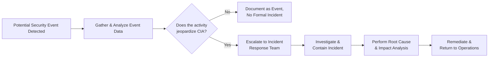

## 20.1 Events vs. Incidents: Definition and Escalation

Organizations, especially those within highly regulated financial environments, must be prepared to encounter a range of potential security issues. Not all unusual or suspicious activities require an all-out incident response; much can be a simple “event,” which is an observation that may or may not be harmful. A full-blown “incident,” however, demands immediate, structured attention and often triggers an official incident response process. In this section, we explore the differences between events and incidents, clarify why this distinction matters to CPAs, and illustrate an escalating flow for timely and effective triage.

Understanding the difference between a mere security event and a genuine incident is essential for several reasons:  
• Proper resource allocation: Responding to every event as though it were a major breach can overwhelm an organization and lead to alert fatigue.  
• Compliance and audit responsibilities: Regulatory frameworks often require documentation of both events and incidents, but only incidents typically necessitate notifications to stakeholders, regulators, or management committees.  
• Financial statement impact: Certain security incidents can have a material impact on financial statements (for instance, if a breach exposes sensitive customer financial data). CPAs and engagement teams must be aware of these distinctions when performing risk assessments or evaluating IT general controls (as covered in Chapter 8).  

Below, we define security events and security incidents, explain how to differentiate them, and introduce a tiered escalation flowchart to ensure that CPAs and IT professionals can coordinate a clear line of action when something out of the ordinary arises in the environment.

### Defining a Security Event

A security event is any observable occurrence in a system or network. Events can be harmless anomalies (e.g., a series of failed login attempts by an employee mistyping a password) or potential threats (e.g., suspicious network ports opening unexpectedly). Event sources may include:

• System logs from intrusion detection systems (IDS) or intrusion prevention systems (IPS)  
• Firewall logs indicating blocked or allowed traffic  
• Application error logs  
• User or system-generated messages, such as emails or alerts in a Security Information and Event Management (SIEM) platform  

Most security operations team members (or managed service providers) continuously monitor these events to flag unusual behavior. Events might be routine or extraordinary; the key is to identify whether an event poses any real risk to the organization’s confidentiality, integrity, or availability (the “CIA triad” mentioned in Chapters 16 and 17 on cybersecurity basics).

### Defining a Security Incident

A security incident is a confirmed event (or sequence of events) that jeopardizes, or is reasonably believed to jeopardize, the CIA triad of an organization’s information systems. Incidents typically require immediate investigation, coordinated response measures, and — in many cases — notification to stakeholders or regulatory bodies. Examples of security incidents include:

• Unauthorized access to confidential data, such as client information or financial records  
• Malware or ransomware infections that disrupt system operations or encrypt crucial files  
• Distributed Denial-of-Service (DDoS) attacks that severely degrade system availability  
• Insider threats leading to data leaks or manipulation of financial ledger entries  
• Evidence of large-scale compromise, such as malicious user creation or tampering with system privileges  

Unlike simple security events that can often be addressed through routine operational procedures, security incidents demand targeted action steps, such as invoking the incident response plan, performing forensic analysis, updating management, and potentially disclosing the incident to regulators if it meets certain materiality or statutory thresholds.

### Why the Distinction Matters for CPAs

Certified Public Accountants (CPAs) work closely with IT departments to assess risks within enterprise systems, as these systems directly or indirectly impact financial reporting and compliance. Distinguishing events from incidents ensures:

• Accuracy in risk assessment: If every minor event is treated as a material incident, the risk landscape can become distorted, leading to misguided audit focus or inflated resource needs.  
• Appropriate documentation: Incidents require detailed investigation, potential system or control enhancements, and possibly the engagement of third-party forensic auditors. Failing to document and address an actual incident in a timely manner can lead to compliance breaches and reputational damage.  
• Alignment with frameworks: As discussed in Chapter 3 (Governance, Frameworks, and Regulatory Environment), frameworks like NIST SP 800-61 highlight the importance of precise incident definition to streamline the resolution process. Similarly, COBIT’s best practices underscore incident prioritization, which helps in effective control monitoring.

### Moving From Event to Incident

Organizations often rely on multi-tiered response teams — such as a Security Operations Center (SOC) — responsible for collating and analyzing security logs, investigating suspicious behaviors, and categorizing observations as either events or incidents. Once categorized as an incident, further escalation is typically triggered per the organization’s incident response protocols.  

Below is a common approach to triage:

• Identify and log: The system or analyst identifies unusual activity and logs an event in a ticketing platform or SIEM.  
• Preliminary analysis: The analyst reviews whether the event is likely harmless, a potential threat, or a confirmed security breach.  
• Escalate or close: If deemed non-threatening, the event record gets closed (with documentation). If there is evidence of compromised data or systems, the incident response plan is activated, and more specialized teams (IT security, legal, compliance) step in.  

### Triage and Escalation Flowchart

The following Mermaid diagram illustrates a simplified triage process. Note the branching logic that distinguishes a normal event from one requiring deeper incident response:

• Potential Security Event Detected (Node A): This can be triggered by automated alerts or user reporting suspicious activities, such as unexpected system prompts, unusual transaction logs, or repeated login failure attempts.  
• Gather & Analyze Event Data (Node B): Security analysts or an automated system (e.g., advanced SIEM) examine the event’s details. Does it appear malicious or simply the result of an operational anomaly?  
• Does the activity jeopardize CIA? (Node C): If no direct confidentiality, integrity, or availability risk is found, the event is usually documented and resolved. If concerns remain, the situation escalates.  
• Escalate to Incident Response Team (Node E): If the event suggests malicious behavior, unauthorized access, or compromised data, it becomes an incident.  
• Investigate & Contain Incident (Node F): Specialized teams investigate infiltration points, gather forensic evidence, and implement containment measures such as isolating compromised systems.  
• Perform Root Cause & Impact Analysis (Node G): Next, the organization determines how the incident occurred, documents all impacted systems or data, and evaluates the magnitude of damage.  
• Remediate & Return to Operations (Node H): Finally, the team implements eradication steps for threats (e.g., removing malware, closing vulnerabilities) and restores normal functionality. A post-incident review is typically conducted to prevent recurrence.

### Practical Financial Examples and Case Studies

1. Repeated Failed Logins  
   A financial services company notices repeated login failures for a critical accounting platform. Initially, this is classified as a security event. A deeper analysis finds that the IP address belongs to an ex-employee attempting unauthorized access. The event escalates into an incident due to the direct risk to system integrity and potential theft of proprietary data.

2. Suspicious Vendor Invoice  
   An accounts payable department employee spots an invoice from an unknown vendor. The invoice might be flagged as an event (leading to a quick check of vendor records). If that invoice is discovered to be part of a phishing scheme that successfully compromised payment details, it becomes an incident potentially requiring immediate response, system isolation, refunds, and notifications of the impacted parties.

3. Firewall Block Prompt  
   A corporate firewall blocks a large volume of traffic from an external IP address. The connection attempt, while unusual, is automatically dropped and logged. If analysis shows there is no direct harm (the firewall effectively protected the network), it remains a security event. If deeper inspection finds actual infiltration attempts, the organization categorizes it as an incident, triggering further steps for remediation.

### Best Practices for Risk and Escalation

• Establish Clear Criteria: Define thresholds where events escalate into incidents. Criteria can reference data sensitivity (see Chapter 19 on Data Confidentiality and Privacy Controls), system criticality, and potential financial impact.  
• Align with Regulatory Requirements: Certain industries mandate immediate notification or mandated forensics upon discovering a breach. Ensure that your incident escalation path includes compliance checkpoints.  
• Maintain Documentation: Even events that do not escalate to incidents should be documented thoroughly. Regular review helps identify recurring patterns that may indicate persistent threats.  
• Conduct Tabletop Exercises: Annual or semi-annual tabletop sessions allow CPAs, IT staff, and executive leadership to rehearse escalation procedures for hypothetical scenarios, ensuring quick response when a real incident emerges.  
• Continuous Improvement: Post-incident analyses (PIAs) are critical. They not only resolve the immediate threat but also serve as lessons for refining incident response strategies, bridging any discovered control gaps, and shoring up vulnerabilities.

### Common Pitfalls and Challenges

• Over-Escalation or Under-Escalation: Treating every event as though it were an incident can result in alert fatigue. On the other hand, ignoring or discounting suspicious events can lead to unmitigated breaches with regulatory and reputational fallout.  
• Poor Communication Channels: Without a clearly documented escalation path, valuable time may be lost in identifying who is responsible for responding to a potential security threat.  
• Lack of Management Buy-In: If senior management does not prioritize incident response readiness, the resources and authority necessary to act swiftly may be lacking.  
• Insufficient Auditing and Logging: Without robust logs, investigating a suspicious event becomes nearly impossible. CPAs especially rely on audit logs to confirm the completeness and accuracy of financial records.  

### Looking Ahead

Knowing whether an event warrants an incident response is an essential skill for both IT and CPA professionals. Beyond classification, it is equally important to manage the escalation path: ensuring the correct people are involved at the right time. The next subsections in Chapter 20 (namely, planning incident response, forensic procedures, and root cause analysis) build on the framework outlined here to form a complete incident lifecycle management strategy. CPAs often collaborate with IT teams to ensure that containment and remediation activities do not negatively affect the reliability of financial data or the organization’s compliance posture.

When uncertain, always err on the side of caution. By establishing clear definitions, refining triage processes, and employing a structured escalation workflow, you can ensure that true incidents receive the prompt attention and resources they need—without overrunning your operations for benign events that pose little or no risk.

## Assess Your Understanding of Security Events vs. Incidents



### Which statement best encapsulates a security event in an organization’s IT environment?
- [x] An observable occurrence or anomaly that may or may not pose a direct threat.  
- [ ] A breach that requires active intervention by external forensic investigators.  
- [ ] A confirmed exfiltration of financial data from the general ledger.  
- [ ] A mandatory notification item for regulatory bodies.  

> **Explanation:** A security event is any observable occurrence, which could be an anomaly, potential probe, or simply a technical error. It does not necessarily require a formal forensic investigation unless it is confirmed to be an incident.

### When does a security event typically escalate to a security incident?
- [x] When analysis reveals actual or imminent risk to confidentiality, integrity, or availability.  
- [ ] Immediately after any event is logged in the SIEM.  
- [ ] Only when the board of directors mandates an official investigation.  
- [ ] As soon as a vendor invoice is found suspicious, regardless of deeper analysis.  

> **Explanation:** The pivotal factor is the verified threat to the organization’s data or systems. If the system’s CIA is at risk, the event becomes an incident, requiring an official response.

### Which of the following best illustrates a security event that remains a non-incident?
- [x] A firewall log shows a blocked connection attempt from a foreign IP, with no confirmed data compromise.  
- [ ] A malicious macro in a spreadsheet that successfully executes on a user’s workstation.  
- [ ] An employee uses stolen credentials to make unauthorized entries in the general ledger.  
- [ ] A distributed denial-of-service (DDoS) attack that halts e-Commerce operations.  

> **Explanation:** A blocked connection attempt indicates a security event (the firewall did its job). The other examples describe confirmed compromises or disruptions, meeting the definition of security incidents.

### Which aspect is crucial for distinguishing events from incidents?
- [x] Assessing actual or potential harm to critical systems or data.  
- [ ] The identity of the user who discovered the issue.  
- [ ] The time of day, irrespective of any risk involved.  
- [ ] The number of software licenses purchased by the organization.  

> **Explanation:** The core question revolves around harm to the organization’s CIA triad. Without potential or actual harm, the situation remains an event and not an incident.

### What is one core advantage of clearly separating events from incidents?
- [x] Saving resources by addressing benign anomalies appropriately while focusing on true threats.  
- [ ] Allowing the organization to ignore all events and save on logging costs.  
- [ ] Simplifying IT operations by classifying all abnormalities as immediate incidents.  
- [ ] Eliminating the need for management oversight in routine anomalies.  

> **Explanation:** By focusing on potential or verified harm, organizations avoid “alert fatigue” and direct the appropriate resources to real threats—ultimately improving efficiency and ensuring critical issues are handled swiftly.

### Which of the following is a potential pitfall if every event is escalated as an incident?
- [x] Alert fatigue and inefficient use of security and accounting resources.  
- [ ] Strengthened collaboration between IT security and finance.  
- [ ] Improved detection of every possible vulnerability in real time.  
- [ ] Automatic resolution of all operational glitches without human intervention.  

> **Explanation:** Over-escalating events to incidents overwhelms response teams (alert fatigue), creating inefficiencies and possibly causing actual incidents to be overlooked.

### What is the main purpose of the “Gather & Analyze Event Data” stage in the escalation flowchart?
- [x] To determine whether an observed anomaly represents a risk to the organization's information.  
- [ ] To immediately notify external regulators about potential scanning attempts.  
- [ ] To skip containment if the issue is only partially understood.  
- [ ] To remove logs of suspicious activities so they do not clutter the SIEM.  

> **Explanation:** Gathering and analyzing data is the step where security professionals decide if the potential risk is significant. Without this analysis, the organization may either overreact or fail to react in time.

### If a suspicious invoice from an unrecognized vendor is flagged in an accounts payable system, which initial step should occur?
- [x] Treat it as a security event and conduct immediate verification of vendor legitimacy.  
- [ ] Assume the worst with no investigative effort and declare a full-blown incident.  
- [ ] Instruct employees to delete the invoice and ignore further due diligence.  
- [ ] Skip to the remediation phase.  

> **Explanation:** The first move is to verify if the invoice is legitimate (some events turn out to be benign). If confirmed malicious (e.g., leading to unauthorized transfers), the situation escalates to an incident.

### Which framework is especially relevant for structuring incident responses in the context of U.S. federal guidelines?
- [x] NIST SP 800-61, Computer Security Incident Handling Guide.  
- [ ] COBOL standards for legacy mainframe programming.  
- [ ] HIPAA physical safeguard requirements.  
- [ ] None of the above.  

> **Explanation:** NIST SP 800-61 provides comprehensive guidelines for incident detection, escalation, and response, making it particularly relevant for U.S. organizations.

### In an escalation flowchart, what generally happens immediately after an event is deemed to threaten the CIA triad?
- [x] The event is promoted to an incident and investigated by the incident response team.  
- [ ] Nothing; the event is logged and no further action is ever taken.  
- [ ] Financial statements automatically lock to prevent further ledger changes.  
- [ ] External auditors immediately produce a qualified opinion.  

> **Explanation:** Once deemed risky, the event is treated as an incident, triggering formal incident response steps, which include analysis, containment, and notifications, as applicable.



## For Additional Practice and Deeper Preparation

### [Information Systems and Controls (ISC)](https://www.udemy.com/course/isc-cpa-mock-exams/?referralCode=E1217303222935C5E464)

**Information Systems and Controls (ISC) CPA Mocks:** 6 Full (1,500 Qs), Harder Than Real! In-Depth & Clear. Crush With Confidence!

- Tackle full-length mock exams designed to mirror real ISC questions.  
- Refine your exam-day strategies with detailed, step-by-step solutions for every scenario.  
- Explore in-depth rationales that reinforce higher-level concepts, giving you an edge on test day.  
- Boost confidence and minimize anxiety by mastering every corner of the ISC blueprint.  
- Perfect for those seeking exceptionally hard mocks and real-world readiness.

_Disclaimer: This course is not endorsed by or affiliated with the AICPA, NASBA, or any official CPA Examination authority. All content is for educational and preparatory purposes only._
