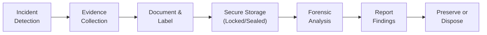

## 20.3 Forensic Investigations and Chain of Custody

In modern business environments, cyber incidents can rapidly evolve from simple system glitches into full-scale financial, reputational, or legal crises. When malicious activity such as fraud, data breaches, or insider threats is suspected, organizations initiate specialized procedures known as forensic investigations. These investigations aim to establish facts—often for legal or regulatory purposes—and rely on the principle that evidence must be gathered, preserved, and analyzed according to rigorous standards.  

From the perspective of Certified Public Accountants (CPAs), understanding digital forensic methods is increasingly critical. Financial audits and advisory services often touch upon digitized processes and stored information, so ensuring the integrity and credibility of digital evidence has become a must-have skill. This section explores the fundamentals of forensic investigations, emphasizing the urgent importance of preserving the chain of custody in any evidence-handling scenario.  

-------------------------------------------------------------------

### Overview of Digital Forensic Investigations

Digital forensic investigations primarily focus on identifying, collecting, preserving, examining, analyzing, and reporting data artifacts in electronic environments. These artifacts might include system logs, emails, database records, network traffic, system snapshots, or other digital traces. During an incident response, forensic investigators distinguish between day-to-day troubleshooting and evidence gathering suitable for legal or regulatory scrutiny.

Key drivers for digital forensic investigations include:
• Financial fraud or embezzlement where electronic records hold key evidence  
• Intellectual property theft via unauthorized downloads or exfiltration  
• Cyber intrusion or hacking incidents that necessitate root-cause analysis  
• Violations of organizational policies (IT acceptable-use policies, data handling protocols, etc.)  

#### Distinguishing Forensic Investigations from Routine IT Analysis

Routine IT troubleshooting might involve restoring normal operations as fast as possible—particularly when faced with downtime or compromised system performance. While that approach can be appropriate for minor outages, it is inadequate for cases where formal evidence collection is required. Forensic investigations, by contrast, seek to preserve every relevant artifact in a legally defensible format.  

Other topics in this chapter, such as 20.1 (Events vs. Incidents) and 20.2 (Incident Response Plans and Crisis Management), discussed how to identify and classify security events. Once an event is escalated to an incident with potential legal or regulatory impact, organizations must adopt strict forensic measures.  

-------------------------------------------------------------------

### Core Principles of Digital Forensic Investigations

Digital forensic methodologies often align with recognized industry guidelines (e.g., National Institute of Standards and Technology (NIST) SP 800-86). While minor variations may exist across organizations, most forensic processes adhere to the following principles:

1. Identify the Scope of Investigation  
   Investigators define the systems, databases, network segments, and individuals potentially involved. This scoping is informed by incident response data, user reports, automated alerts, or suspicious transactions from financial systems.

2. Acquire and Preserve Evidence  
   Investigators collect data from relevant sources—workstations, mobile devices, servers, cloud platforms—while ensuring no accidental alteration. The aim is to gather all potential evidence before starting any analysis that might risk data integrity.

3. Examine and Analyze Data  
   Using specialized software tools, investigators isolate suspicious files, reconstruct timelines, or correlate logs to find hidden patterns. If relevant, advanced techniques (e.g., memory forensics, deep packet analysis) are utilized.

4. Interpret and Document Findings  
   Investigators compile results into a format suitable for internal audiences (e.g., an audit committee) or external audiences (e.g., regulatory agencies, courts). Detailed documentation includes methods, tools, and chain-of-custody details.

5. Present Evidence  
   Whenever legal action is pursued, investigators must be prepared to explain how the evidence was obtained and maintained in a manner that upholds integrity. Chain-of-custody logs play a central role in these legal proceedings.

The bedrock upon which all these steps rest is evidence preservation—maintaining the integrity of data from the moment of collection to the eventual disposal or archival.

-------------------------------------------------------------------

### Importance of Chain of Custody

The chain of custody is the chronological documentation or paper trail showing the collection, control, transfer, and analysis of evidence. It certifies that the evidence presented in an investigation remains unaltered from its initial collection to its final disposition. Maintaining a meticulously documented chain of custody is crucial for ensuring that evidence is admissible in legal and regulatory dealings.

A robust chain-of-custody procedure typically includes:
• Precise timestamps (date/time/zone) when evidence is acquired or transferred  
• Details on who collected the evidence and under what conditions  
• Summary of handling measures (e.g., hashing, sealed evidence bags, locked cabinets)  
• Signatures or electronic equivalents for all evidence transfers  
• Evidence location and secured storage throughout the entire process  

These detailed logs prove that the evidence has been in trusted hands only and that no unauthorized party had the opportunity to tamper with or compromise it.

-------------------------------------------------------------------

### Chain-of-Custody Workflow Visualization

Below is a simple Mermaid diagram illustrating a high-level chain-of-custody workflow. The diagram shows how evidence typically flows from the initial collection stage to final preservation:

• Incident Detection: The trigger event that initiates the forensic investigation.  
• Evidence Collection: Gathering potential data from relevant systems, devices, or logs.  
• Document & Label: Assigning unique identifiers and creating the official chain-of-custody record.  
• Secure Storage: Physically or digitally securing evidence in a tamper-proof environment.  
• Forensic Analysis: Examining the evidence with appropriate tools, ensuring no spoliation occurs.  
• Report Findings: Compiling and communicating relevant results.  
• Preserve or Dispose: Retaining evidence as required by regulations or disposing of it safely when allowed.  

-------------------------------------------------------------------

### Techniques for Preserving Evidence

Evidence preservation is the linchpin of a successful forensic process. If investigators inadvertently alter critical files or fail to document the movement of devices, the entire investigation’s credibility can be compromised. Effective preservation methods include:

1. Imaging and Hashing  
   Creation of bit-by-bit images of hard drives or memory states. The original media is then sealed, and investigators work on the copy. Hashing (e.g., using SHA-256) verifies that no alterations occur to the original or the working copy.

2. Write-Blocking Hardware  
   Write-blockers prevent data from being written to storage media during analysis. This ensures that the original data remains intact. Investigators work on mirrored copies or images only.

3. Metadata Preservation  
   Metadata (e.g., file creation dates, time stamps, user IDs) provides critical contextual clues. Tools must preserve file system attributes, server logs, and device metadata. Even small changes in file system data can compromise reliability.

4. Comprehensive Documentation  
   Every action taken on the evidence must be noted in a log or a specialized case management system. Entries typically detail the date, time, individuals involved, reason for the action, and changes to evidence status.

5. Secured Storage Facilities  
   Physical constraints like locked cabinets, sealed evidence bags, or restricted labs—combined with digital access restrictions—limit the possibility of tampering and unauthorized viewing.

Through these measures, CPAs, internal auditors, or security professionals ensure that digital evidence remains untarnished and legally sound.

-------------------------------------------------------------------

### Typical Mistakes that Compromise Forensics

Despite best efforts, organizations may inadvertently make critical errors that jeopardize the validity of forensic findings. Some common mistakes include:

• Failure to Isolate the Affected System  
  Investigators might keep a compromised system connected to production networks instead of isolating it, risking further infiltration or data loss. Even well-intentioned attempts to “keep the business running” can destroy valuable evidence.

• Unintentional Alteration of Log Files  
  Routine maintenance scripts or normal system usage can overwrite relevant logs. A lack of real-time log forwarding or appropriate backup scheduling often results in lost data.

• Using Non-Forensic Methods of Copying Data  
  Copying files with everyday utilities (e.g., basic “copy and paste”) can inadvertently skip hidden directories or obscure file attributes, ultimately affecting content integrity. Proper forensic imaging is essential.

• Poor Documentation  
  Even if all evidence is preserved, improper tracking of who accessed or handled it can raise doubts about authenticity. Inconsistencies in timestamps or missing confirmations can heavily undermine the chain-of-custody record.

• Mixing Evidence from Multiple Cases  
  Storing or labeling evidence from separate incidents in a shared, unsegregated area can cause confusion about ownership and authenticity. Each investigation should maintain a distinct evidence repository.

• Failing to Hash and Verify Image Copies  
  Without cryptographic hashing techniques to verify copies, it is nearly impossible to confirm that the evidence remained unchanged from retrieval through analysis.

When any of these pitfalls occur, the risk of evidence being challenged—whether in legal proceedings, regulatory inquiries, or internal reviews—escalates dramatically.

-------------------------------------------------------------------

### Practical Example: Financial Data Theft

Consider an organization discovering unusual transactions in its accounting system. The organization suspects that a staff accountant manipulated financial records. A forensic team is dispatched to:

• Acquire the suspect’s workstation, imaging the device’s drive for evidence.  
• Isolate and secure server backups from the period in question.  
• Catalog all user access logs across relevant systems.  
• Verify user roles and permissions (refer to Chapter 18: Authentication and Access Management).  

Suppose a typical mistake is made: Over the weekend, IT staff back up and compress the log files—accidentally corrupting the file metadata or discarding certain date-time stamps critical for correlating suspicious entries. As a result, the integrity of the timeline is compromised, reducing the evidentiary value of the data.  

In this scenario, had forensic procedures been in place prior to backup routines, IT staff would have implemented a write-blocked backup solution or an unaltered bit-by-bit imaging approach that preserves file attributes. The chain-of-custody log would record each backup set’s hash value, the date of creation, and the party responsible, ensuring that no one could later question the authenticity or completeness of the evidence.

-------------------------------------------------------------------

### Tips for CPAs and Audit Professionals

Although digital forensics may seem like a purely technical field, CPAs and financial audit specialists require an awareness of forensic principles for multiple reasons:

• Enhanced Fraud Detection: As gatekeepers of financial data, CPAs can quickly spot anomalies indicative of fraudulent activity.  
• Collaborative Engagement: Working in tandem with IT security teams ensures that evidence of any wrongdoing or control failures is captured thoroughly.  
• Regulatory Compliance: CPAs may be tasked with ensuring that chain-of-custody documentation meets relevant laws and standards, especially in fields like healthcare (HIPAA) or Payment Card Industry (PCI DSS).  
• Reputation and Reliability: Properly handled forensic evidence builds trust with stakeholders, from shareholders to regulators, safeguarding the accountant’s and the firm’s reputation.

-------------------------------------------------------------------

### Aligning with COSO and Other Frameworks

While digital forensics is not a core element of COSO’s Internal Control–Integrated Framework or COSO ERM, these standards do emphasize risk assessment and the reliability of information within an organization’s processes. The ability to investigate and respond to suspected fraud or data breaches directly supports:

• Control Environment (COSO): Management’s commitment to integrity and ethical values includes consistent handling of investigations.  
• Risk Assessment (COSO): Identifying risks of fraud or data exfiltration and planning appropriate responses can reduce the exposure.  
• Information & Communication (COSO): Ensuring relevant, high-quality information can facilitate better decision-making during forensic analysis.  
• Monitoring Activities (COSO): Periodic reviews of security logs and forensic readiness posture can detect improper data handling early.  

Similarly, frameworks like COBIT tie forensic readiness into governance and oversight for IT processes, ensuring alignment with organizational objectives.

-------------------------------------------------------------------

### Recommended Documentation Steps

A consistent, easy-to-follow documentation procedure ensures that all team members (CPAs, IT staff, and external forensic specialists) remain aligned on evidence-handling requirements. Key steps may include:

• Incident Cataloging: Assign a unique ID for each incident or sub-incident.  
• Evidence Labeling: Tag each piece of evidence with a unique identifier referencing the incident ID.  
• Chain-of-Custody Form: Include fields for date/time, collector’s name, collector’s signature, reason for evidence collection, location of evidence, and final disposition steps.  
• Hash Verification: Document cryptographic hash details for each file or data set collected.  
• Transfer Logs: If physically transferring storage devices or digitally transferring authority of the evidence, ensure sign-off from the receiving official.  
• Final Disposition: State how and when evidence is archived, returned, or destroyed according to legal and organizational retention policies.  

-------------------------------------------------------------------

### Case Study: Chain-of-Custody Breach

Imagine a large national retailer suffers a credit card breach suspected to originate from an internal system administrator. After initial analysis, the security team collects server images but stores them temporarily on a shared folder without write protection. Over the weekend, an unauthorized internal user inadvertently accesses the folder, modifies a system log file, and inadvertently saves it back.  

On discovering the discrepancy, investigators cannot prove what changes were made or when. Defense counsel for the individual under investigation challenges the integrity and authenticity of the evidence.  

Consequences:

1. The entire digital forensics process is questioned, and the organization faces difficulty proving wrongdoing.  
2. Additional resources (time, forensic specialists, attorneys) are spent trying to recover or validate alternative sources of data to justify the investigation.  
3. The questionable handling of evidence erodes internal stakeholder and regulator confidence in the organization’s control environment.

The key lesson here: a break in the chain of custody—even if unintentional—can be devastating to the credibility of both the evidence and those involved in handling it.  

-------------------------------------------------------------------

### Advanced Forensic Techniques

Though this section primarily focuses on evidence preservation and chain of custody, it is worth noting some advanced forensic techniques often employed after evidence is properly preserved:

• Memory Forensics: Analyzing the random-access memory (RAM) of suspect machines to capture ephemeral data (e.g., running processes, decryption keys).  
• Network Forensics: Collecting and analyzing packet captures, NetFlow logs, or firewall audits to track suspicious data flows.  
• Mobile Device Forensics: Recovering messages, application data, or location data from smartphones and tablets.  
• Cloud Forensics: Navigating distributed environments, metadata logs, and service provider agreements to ensure lawful data acquisition.  

Each of these areas requires adherence to strict protocols that align with preserving evidence authenticity.

-------------------------------------------------------------------

### Conclusion

Forensic investigations provide organizations with a structured means of seeking truth amidst digital complexity, often in high-stakes circumstances such as financial fraud or legal disputes. Above all else, preserving evidence and properly maintaining a chain of custody are indispensable for ensuring credibility. Even well-trained investigators can unintentionally undermine case integrity if standard forensic protocols are not strictly observed.

CPAs, auditors, and cybersecurity professionals share a vested interest in protecting the confidentiality, integrity, and availability of organizational data. By embracing best practices—especially around chain-of-custody documentation, evidence preservation, and investigative rigor—professionals can better serve stakeholders in times of crisis and maintain public confidence in institutional processes.

-------------------------------------------------------------------

## Test Your Knowledge of Forensic Investigations and Chain of Custody



### Which step is most critical to ensure evidence integrity during a digital forensic investigation?
- [ ] Deleting suspect files immediately to prevent further compromise
- [x] Creating a forensically sound image before starting analysis
- [ ] Quickly restoring normal operations
- [ ] Revising the organization’s security policy

> **Explanation:** The creation of a forensically sound image (bit-by-bit copy) is essential. It ensures that the original evidence remains unaltered, preserving the opportunity for valid and repeatable analysis.

### What is the primary function of the chain of custody?
- [ ] To expedite the incident response process
- [ ] To document how costs are allocated among investigative teams
- [x] To maintain a documented, secure history of the evidence and its handlers
- [ ] To reduce the overall storage footprint by compressing old evidence

> **Explanation:** Chain of custody records who has handled the evidence, when it was handled, and how it was preserved. This is vital for proving that evidence has not been tampered with.

### Which scenario best illustrates a potential chain-of-custody breach?
- [ ] A forensic investigator tags each device and updates a digital log after collection
- [ ] Investigators store an imaged drive in a locked evidence room and seal it properly
- [ ] An accountant views the evidence under direct, documented supervision
- [x] A shared network folder contains evidence files that multiple employees can edit

> **Explanation:** Storing evidence on a shared network folder accessible to multiple employees increases the risk of tampering. This is a clear breach of chain-of-custody best practices.

### What is a common mistake that leads to forensic evidence spoliation?
- [ ] Disconnecting the compromised system from the network
- [x] Performing a routine file copy instead of a forensic imaging process
- [ ] Generating cryptographic hash values for the copied data
- [ ] Using a write-blocker for evidence drive retrieval

> **Explanation:** Copying files through everyday methods may modify timestamps and miss hidden data. A forensic imaging process, ideally combined with write-blocking technology, preserves the original data.

### Which of the following should always be included in chain-of-custody documentation?
- [x] The date/time of evidence transfer and the handler’s signature
- [ ] Preferred encryption protocols used by the investigator
- [x] Unique identifiers associated with each piece of evidence
- [ ] Antivirus logs from the workstation

> **Explanation:** Chain-of-custody documentation requires precise tracking information including unique evidence IDs and the date/time of transfers with authorized signatures. While antivirus logs may be useful artifacts, they are not mandatory components of the chain-of-custody log.

### Why are cryptographic hash values important in forensic investigations?
- [x] They allow verification that evidence remains unchanged
- [ ] They speed up the evidence collection process
- [ ] They replace the need for manual documentation
- [ ] They prevent unauthorized collection

> **Explanation:** A verified cryptographic hash (e.g., SHA-256 or SHA-3) provides mathematical proof that no alteration has occurred, preserving the integrity of the evidence.

### What is the main reason for using a write-blocker during evidence collection?
- [x] To prevent any writes or modifications to the original media
- [ ] To accelerate data transfer
- [x] To maintain the authenticity of the original drive content
- [ ] To index files more efficiently

> **Explanation:** A write-blocker ensures no accidental modifications occur when acquiring data from the original drive or device, preserving the evidence’s authenticity.

### How can CPAs most effectively contribute to forensic investigations?
- [x] By quickly detecting anomalies in financial records that may indicate fraud
- [ ] By performing all digital forensics independently
- [ ] By limiting the scope of the investigation to reduce costs
- [ ] By just overseeing the chain-of-custody procedure

> **Explanation:** CPAs are proficient in spotting unusual financial patterns. Their direct collaboration with forensic investigators—while employing their accounting expertise—enhances the quality and speed of identifying potential fraud.

### Which of the following statements is most accurate regarding incident scoping?
- [x] Determining relevant systems and individuals is critical before collecting evidence
- [ ] Only servers require forensic analysis, as endpoints hold no valuable data
- [ ] All organizational assets must be imaged, regardless of cost or relevance
- [ ] Incident scoping is irrelevant if chain-of-custody is maintained

> **Explanation:** Properly defining which systems, individuals, and transactions are relevant to the investigation avoids wasted resources and preserves only data that matters for the case at hand.

### True or False: If digital evidence is not handled properly, it can be rendered inadmissible in legal proceedings.
- [x] True
- [ ] False

> **Explanation:** Courts often dismiss or discount improperly handled digital evidence, rendering it inadmissible or unreliable due to chain-of-custody or integrity concerns.



-------------------------------------------------------------------

## For Additional Practice and Deeper Preparation

### [Information Systems and Controls (ISC)](https://www.udemy.com/course/isc-cpa-mock-exams/?referralCode=E1217303222935C5E464)

Information Systems and Controls (ISC) CPA Mocks: 6 Full (1,500 Qs), Harder Than Real! In-Depth & Clear. Crush With Confidence!

- Tackle full-length mock exams designed to mirror real ISC questions.  
- Refine your exam-day strategies with detailed, step-by-step solutions for every scenario.  
- Explore in-depth rationales that reinforce higher-level concepts, giving you an edge on test day.  
- Boost confidence and minimize anxiety by mastering every corner of the ISC blueprint.  
- Perfect for those seeking exceptionally hard mocks and real-world readiness.  

_Disclaimer: This course is not endorsed by or affiliated with the AICPA, NASBA, or any official CPA Examination authority. All content is for educational and preparatory purposes only._
