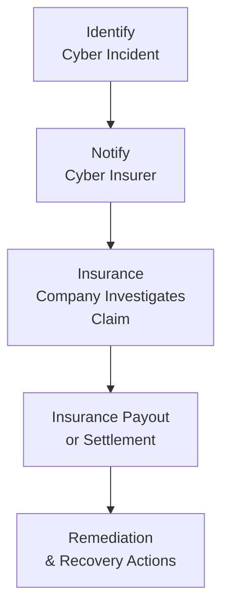

## 20.4 Cyber Insurance as a Risk Mitigation Strategy

Cybersecurity risks continue to grow in complexity, affecting businesses of every size and sector. Organizations face myriad threats—from sophisticated ransomware attacks to data breaches by insider threats. Where traditional incident response (see sections 20.1–20.3) focuses on detection, containment, and remediation of a cybersecurity event, cyber insurance provides an additional layer of financial and operational protection, allowing companies to cope with the ever-increasing cost of a breach or outage. This section explores the mechanics of cyber insurance: coverage types, typical exclusions, underwriting processes, and real-world examples illustrating how a proper policy can offset cyber risk.

### The Role of Cyber Insurance in a Holistic Security Strategy

Cyber insurance complements technical and administrative controls. While the best approach to cybersecurity is a comprehensive strategy involving strict access controls, robust network monitoring, incident response planning, and business continuity measures, a dedicated insurance policy adds an essential layer of financial risk transfer. This synergy allows an organization to:

• Recover more quickly from a breach by covering costs such as forensic investigations, crisis communications, and legal expenses.  
• Sustain business operations even under duress, mitigating far-reaching financial and reputational repercussions.  
• Promote a culture of accountability where insurance carriers often require best practice controls and periodic assessments.

Cyber insurance is not a substitute for strong technical and organizational measures—it is one piece of a multifaceted approach. Managed effectively, it safeguards the business’s financial well-being, especially valuable to small or medium-sized enterprises that may lack the liquidity to handle a significant cyber event on their own.

### Common Cyber Insurance Coverage Types

Cyber insurance policies vary widely, but coverage typically falls into two broad categories: first-party coverage and third-party liability. Additionally, specialized coverages address more nuanced threats such as ransomware, social engineering, and business interruption from cyber incidents.

#### First-Party Coverage

First-party coverage addresses direct losses incurred by the policyholder. Examples include:

• Data Breach Response Costs: Covers expenses for forensic investigations, external legal counsel, breach notification, credit monitoring services, and public relations efforts.  
• Business Interruption Loss: Provides reimbursement for lost income and extra expenses necessary to maintain business operations when critical IT resources are compromised or taken offline.  
• Data or Software Restoration Costs: Covers costs of restoring or re-creating data and software damage caused by malicious attacks.  
• Cyber Extortion (Ransomware) Coverage: May cover ransomware payments, negotiation services, or extortion-related expenses if such payments are legally permissible.  

#### Third-Party Liability

Third-party coverage deals with liabilities to external parties or regulatory bodies. Examples include:

• Defense Costs and Damages: Covers litigation expenses, settlements, and judgments if an organization is sued for failing to adequately protect data or systems.  
• Regulatory Fines and Penalties: In certain jurisdictions, policies may cover regulatory fines—though some laws prohibit the transfer of these penalties to insurance. Coverage often includes legal defense costs associated with investigations by regulatory authorities (e.g., GDPR or HIPAA violations).  
• Media Liability: Covers claims for defamation, intellectual property infringement, or other wrongful media activity, which may extend to websites, social media channels, and marketing materials.  

#### Specialized or Optional Coverages

Depending on the insurer, policies may include optional riders or specialized coverage:

• Social Engineering and Fraud: Addresses financial losses from deceptive tactics like phishing or pretexting.  
• Reputational Harm Coverage: May reimburse costs associated with reputational recovery, brand marketing, or third-party consulting.  
• Contingent Business Interruption: Covers income loss resulting from cybersecurity incidents affecting third-party providers or vendors essential to your operations.  

### Typical Exclusions and Limitations

While cyber insurance can be invaluable, knowing what your policy does not cover is equally critical. Common exclusions and limitations include:

• Acts of War/Terrorism: Many policies exclude coverage for acts deemed to be war, terrorism, or nation-state-sponsored attacks. This became a major issue in the aftermath of certain large-scale global malware outbreaks.  
• Pre-Existing or Known Vulnerabilities: Damages resulting from known security weaknesses that remained unaddressed may be excluded or lead to reduced claims payouts.  
• Failure to Maintain Minimum Security Standards: If insurers require basic controls—such as installing patches, implementing multifactor authentication, or having hardened systems—and your organization fails to comply, coverage may be partially or fully revoked.  
• Insider Threat and Dishonest Acts: Some policies exclude coverage for malicious acts by senior employees or coverage is limited if the event involved gross negligence.  
• Physical Damage to Hardware: While the cost of data or software restoration may be included, physical damage to servers or equipment could be excluded or covered only under separate property insurance.  

The exact scope of exclusions depends on both the policy and the insurer. It is vital to clarify these pitfalls during the underwriting stage and update policies as the threat landscape evolves.

### Underwriting Process and Cost Factors

Insurers evaluate several factors to determine premium costs and coverage limits. Companies must demonstrate strong cybersecurity practices and compliance with relevant standards (see Chapter 19 on Data Confidentiality and Privacy Controls). The underwriting process typically involves:

• Security Questionnaire or Assessment: Organizations answer detailed questions about security policies, controls, and risk management frameworks (e.g., NIST Cybersecurity Framework or COBIT).  
• External Vulnerability Scans: Insurers may analyze an applicant’s external network posture using scanning tools to identify open ports, outdated software, or misconfigurations.  
• Review of Incident History: A pattern of recurrent cyber incidents suggests higher risk.  
• Governance and Compliance Posture: Demonstrating robust governance frameworks (COSO, SEC guidance, ISO 27001) can reduce premiums by indicating a mature risk management approach.  

Policy costs vary depending on organizational size, industry, and the scope of coverage. Highly regulated sectors such as healthcare and finance could face higher premiums due to stricter compliance requirements and higher risk profiles. Additionally, insurers may set sub-limits on certain coverage areas—for instance, capping payouts for ransomware or social engineering.

### Real-World Examples: Cyber Insurance in Action

Cyber insurance has proven its value in countless scenarios. Below are two examples illustrating how coverage can significantly offset detrimental outcomes:

• Retail Data Breach: A national retailer’s payment card system was compromised, exposing customers’ credit card data. The company’s cyber insurance addressed costs for forensics, breach notification, credit monitoring, and most legal defense expenses. While not all costs were fully covered—owing to policy sub-limits—the insurer’s coverage alleviated millions of dollars in direct remediation costs.  

• SMB Ransomware Attack: A mid-sized medical practice fell victim to ransomware. The attackers demanded a large sum in cryptocurrency. Because the practice had a cyber extortion provision, their insurer paid for an expert negotiator and—after legal clearance—for the ransom itself, allowing the practice to quickly regain control of patient health data. The insurance claim also covered the practice’s subsequent investments in data recovery and security enhancements.  

In both cases, prompt notification to the insurer was crucial for receiving immediate incident response services and containing total costs. These cases highlight the importance of thoroughly understanding your policy’s coverage triggers and timelines.

### Integrating Cyber Insurance into Your Risk Mitigation Strategy

Comprehensive risk mitigation means layering organizational controls with robust insurance coverage. From an accounting perspective, the benefits are clear: by transferring some event-related costs to an insurer, you protect liquidity and potentially smooth out cash flow volatility. As with all insurance, you get “coverage from the unexpected,” but you must ensure coverage adequately matches your risk profile.

• Align Coverage with Identified Risks: Conduct a thorough risk assessment (see Chapter 4 on IT Audit and Assurance) to identify the organization’s most pressing threats, and ensure the insurance policy addresses these risks directly.  
• Broaden Incident Response Plans: Integrate insurance notification procedures into your incident response plan (refer to Section 20.2). Include insurer contacts in crisis communication plans so claims are filed promptly, and coverage processes can begin immediately.  
• Review and Update Regularly: As technology evolves, so do risks. Policy renewal is an opportunity to reassess coverage levels, new threat vectors, and business expansions or acquisitions that could increase your risk profile.  
• Negotiate Terms: Policy details can sometimes be flexible. Work with brokers or specialists who understand both IT environments and insurance markets to better negotiate coverage sub-limits and expansions for critical areas (like ransomware).

### Illustrative Flow of Cyber Insurance Claims

Below is a Mermaid diagram depicting a high-level workflow for filing and processing a cyber insurance claim following an incident.  

From initial detection and insurer notification to final payouts and remediation, each step requires clear roles, responsibilities, and documentation. Failure to notify in a timely manner can lead to claim denials or delayed payouts.

### Best Practices and Pitfalls

Implementing cyber insurance effectively involves several best practices and considerations:

• Document Security Measures: Keep proof of up-to-date patches, periodic employee training, and continuous vulnerability scans. Evidence of strong controls can reduce premiums and improve the likelihood of successful claims.  
• Understand Policy Language: Carefully review triggers for coverage—such as how a “breach” is defined—and what your responsibilities are in terms of notification timelines.  
• Maintain Third-Party Vendor Oversight: If a key vendor is compromised and causes you losses, coverage may hinge on your risk management of that vendor (see Chapter 7.5 on Third-Party and Vendor Risk Management).  
• Avoid Over-Reliance: Insurance is not a free pass to neglect other forms of security; insurers expect a reasonable baseline of protection.  
• Prepare for Potential Disputes: Some insurers invoke controversial exclusions (e.g., war exclusions) to limit liability for large-scale attacks. Legal counsel can help interpret policy language and pursue claims in contested scenarios.  

### Practical Considerations for CPAs and Assurance Professionals

For CPAs advising clients or working in organizations that handle sensitive data, assessing cyber insurance coverage is an increasingly critical part of corporate governance and enterprise risk management. Assurance professionals should:

• Encourage formal risk assessments in line with frameworks like COBIT, COSO, and NIST to identify cybersecurity vulnerabilities that are insurable.  
• Verify that policy terms align with the operational realities of the client or organization, especially sub-limits and exclusions.  
• Recognize that insurers often require an attestation of cybersecurity controls—a potential area where CPAs can offer compliance and advisory services, ensuring controls are both effective and documented.  
• Integrate insurance considerations into SOC engagements where relevant (see Part V: System and Organization Controls [SOC] Engagements).  

Just as general liability insurance became a standard for business operations, cyber insurance is quickly becoming an essential component of any mature cybersecurity and risk management program.

### References and Further Reading

• National Institute of Standards and Technology (NIST) Cybersecurity Framework: https://www.nist.gov/cyberframework  
• Center for Internet Security (CIS) Controls: https://www.cisecurity.org/controls/  
• Ponemon Institute Research on Data Breaches: https://www.ponemon.org/  

---

## Test Your Knowledge of Cyber Insurance Claims and Coverage



### Cyber insurance primarily helps organizations by:
- [x] Transferring certain financial risks associated with data breaches.
- [ ] Eliminating the need for strong cybersecurity controls.
- [ ] Improving software development cycles.
- [ ] Managing physical property damage due to natural disasters.

> **Explanation:** Cyber insurance does not eliminate the need for security controls but helps transfer specific financial risks from cyber incidents.

### Which of the following is an example of first-party coverage under a cyber insurance policy?
- [ ] Covering regulatory fines imposed by national authorities.
- [ ] Responding to customer lawsuits and settlement negotiations.
- [x] Paying for breach notification and forensics after a security incident.
- [ ] Indemnifying third parties affected by a data breach.

> **Explanation:** First-party coverage is for direct losses incurred by the policyholder, such as breach notification and forensic costs.

### Many cyber insurance policies exclude coverage for:
- [x] Acts of war or large-scale terrorism campaigns.
- [x] Incidents caused by known vulnerabilities left unpatched.
- [ ] Breaches that occur due to employee oversight of annual training.
- [ ] Costs related to internal security audits.

> **Explanation:** Common exclusions include acts of war, terrorism, and pre-existing vulnerabilities.

### Business interruption coverage under a cyber policy helps:
- [x] Pay for lost income if a cyberattack shuts down critical IT systems.
- [ ] Fund a complete rebuild of all corporate infrastructure.
- [ ] Cover legal costs for third-party claims only.
- [ ] Eliminate the possibility of a data breach.

> **Explanation:** Business interruption coverage compensates an organization for lost revenue and additional expenses due to system downtime.

### When negotiating cyber insurance coverage:
- [x] It is important to align sub-limits with high-risk areas such as ransomware.
- [ ] Never discuss coverage limits with legal counsel.
- [x] Businesses should regularly reassess policy limits to account for evolving threats.
- [ ] The underwriting process rarely requires proof of security controls.

> **Explanation:** Adjusting sub-limits and conducting regular policy reviews keep coverage aligned with the current threat landscape.

### Which statement best describes a war exclusion in cyber insurance?
- [x] Excludes coverage of attacks deemed to be state-sponsored or terrorist in nature.
- [ ] Automatically applies to all attacks from any foreign IP address.
- [ ] Mandates full coverage for any politically motivated incident.
- [ ] Is rarely found in modern cyber insurance policies.

> **Explanation:** War exclusions often limit or deny coverage for incidents officially classified as acts of war or terrorism.

### An example of third-party liability coverage is:
- [x] Defending against a class-action lawsuit from affected customers.
- [ ] Recovering employee salaries lost during downtime.
- [x] Paying court-mandated settlements for a data breach lawsuit.
- [ ] Covering the cost of new encryption software.

> **Explanation:** Third-party coverage handles liabilities that an organization owes to external parties, such as lawsuits or regulatory fines.

### Which factor is most likely to reduce the premium for a cyber insurance policy?
- [x] Implementing comprehensive security frameworks like ISO 27001.
- [ ] Decentralizing all critical data across insecure devices.
- [ ] Frequently postponing required software patches.
- [ ] Having a history of repeated, unresolved cybersecurity incidents.

> **Explanation:** Systems certified against reputable security frameworks generally reassure insurers that risks are well managed.

### A critical step when filing a cyber insurance claim is:
- [x] Notifying the insurer promptly per the policy requirements.
- [ ] Consulting the insurer only after full remediation is complete.
- [ ] Avoiding collaboration with any forensic investigation teams.
- [ ] Relying solely on generic incident response processes.

> **Explanation:** Prompt notification is essential to avoid denial of claims or delayed payouts and to coordinate third-party experts the insurer may provide.

### Cyber insurance policies:
- [x] Are not a blanket solution and must be combined with robust security controls.
- [ ] Guarantee that no cyber event will ever occur.
- [ ] Cover all costs, including intangible reputational losses, without question.
- [ ] Are only applicable to manufacturing or industrial operations.

> **Explanation:** Cyber insurance supplements but does not replace robust cybersecurity measures. Coverage is available to various industries and has specific exclusions.



---

## For Additional Practice and Deeper Preparation

### [Information Systems and Controls (ISC)](https://www.udemy.com/course/isc-cpa-mock-exams/?referralCode=E1217303222935C5E464)

**Information Systems and Controls (ISC) CPA Mocks:** 6 Full (1,500 Qs), Harder Than Real! In-Depth & Clear. Crush With Confidence!

• Tackle full-length mock exams designed to mirror real ISC questions.  
• Refine your exam-day strategies with detailed, step-by-step solutions for every scenario.  
• Explore in-depth rationales that reinforce higher-level concepts, giving you an edge on test day.  
• Boost confidence and minimize anxiety by mastering every corner of the ISC blueprint.  
• Perfect for those seeking exceptionally hard mocks and real-world readiness.

_Disclaimer: This course is not endorsed by or affiliated with the AICPA, NASBA, or any official CPA Examination authority. All content is for educational and preparatory purposes only._
