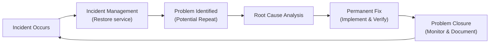

## 20.5 Problem Management – Root Cause Analysis and Permanent Fix

Problem management is a critical discipline within the broader framework of Information Systems and Controls (ISC) that aims to identify and address the underlying causes of incidents, ultimately preventing repeat occurrences. Organizations often spend most of their time dealing with high-priority incidents—focusing on immediate resolution and restoration of service. While incident management is important to keep businesses running, its scope usually ends once the problem is temporarily solved. Problem management goes a step further: it focuses on understanding why incidents occurred and implementing permanent fixes to eliminate them at the source.

This section distinguishes problem management from incident management, offers practical methodologies for root cause analysis, and provides insights on how to achieve long-term resolution. We will reference the relevant chapters in this guide—such as Incident Response (Chapter 20), Risk Management (Chapter 3), and IT General Controls (Chapter 8)—to show how problem management integrates with these areas. We will also include real-world scenarios to illustrate key concepts.

  
Overview of Problem Management and Its Importance  
------------------------------------------------

Problem management systematically analyzes recurring or high-impact incidents to uncover fundamental weaknesses in IT environments, business processes, or controls. While incident management aims to resolve immediate operational disruptions (refer to Sections 20.1–20.4 for details on incident response planning and escalation), problem management seeks to:

• Determine root causes behind incidents.  
• Identify corrective measures that eliminate or reduce risk of recurrence.  
• Document lessons learned and share best practices to continuously improve.  

The distinction is crucial: an unresolved problem eventually leads to repeated interruptions, which can erode stakeholder confidence and cause financial, reputational, or regulatory harm. For CPAs, especially those working in audit and assurance, underestimating the importance of problem management can lead to unaddressed control deficiencies, incomplete risk analysis, and inaccurate financial reporting. Because problem management promotes structural and procedural improvements, it is vital for maintaining the integrity and reliability of financial systems.

Understanding the Lifecycle of Problem Management  
------------------------------------------------

Different frameworks such as ITIL, COBIT 2019, and ISO/IEC 20000 offer guidance on structuring a formal problem management process. While terminology and specific steps may vary, most models include the following stages:

1. Problem Detection and Logging  
2. Problem Analysis and Root Cause Discovery  
3. Permanent Fix or Workaround Implementation  
4. Verification and Closure  
5. Ongoing Monitoring and Continuous Improvement  

By understanding these stages, organizations can develop a robust approach to tackling underlying system issues. This, in turn, enhances system reliability, data integrity (see Chapter 12 on Database Structures and Chapter 14 on Data Analytics), and overall operational sustainability.

  
Distinguishing Problem Management from Incident Management  
----------------------------------------------------------

• Incident Management  
  – Objective: Restore service quickly after an incident.  
  – Scope: Typically a single disruptive event with immediate actions.  
  – Focus: Short-term solutions such as reboots, patches, or failover to backup systems.  
  – Indicators of Success: Minimizing downtime, quick restoration of normal operations.  

• Problem Management  
  – Objective: Determine root causes and implement permanent solutions.  
  – Scope: May address one or multiple incidents with similar patterns, focusing on prevention.  
  – Focus: Long-term fixes, systemic improvements, and control enhancements.  
  – Indicators of Success: Reducing or eliminating recurrence, improving system stability.  

Organizations with mature IT governance frameworks establish dedicated teams or roles for each. This ensures that once critical operations are restored, resources are allocated to investigate the incident’s cause. If problems remain unaddressed, the same or related incidents may recur, signaling a systemic deficiency.

  
Key Concepts in Root Cause Analysis  
-----------------------------------

Root cause analysis (RCA) is the cornerstone of effective problem management. RCA involves investigating beyond symptomatic fixes to uncover the fundamental reasons a problem occurred. Several methodologies exist, each suitable for different contexts:

1. Five Whys  
   – Involves asking “Why?” repeatedly until a deeper, systemic cause of the problem emerges.  
   – Simple, effective for smaller to medium complexity issues involving human errors or process breakdowns.  
   – For example, an organization experiences frequent system downtime:  

     1) Why did the system go down? – A misconfigured firewall blocked legitimate network traffic.  
     2) Why was it misconfigured? – A vendor patch incorrectly enabled a rule.  
     3) Why did the patch incorrectly enable the rule? – Internal policy for patch testing was incomplete.  
     4) Why was the policy incomplete? – The patch management SOP does not mandate configurations be reviewed.  
     5) Why not? – Because no one updated the SOP after the last security audit.  

   – Root cause: Inadequate patch management policy and associated SOP.  
   – Permanent fix: Update the patch management SOP, train staff, and enforce a mandatory testing procedure.

2. Fishbone (Ishikawa) Diagram  
   – Enables a structured exploration of causes, typically categorized by aspects like People, Processes, Tools, and Environment.  
   – Visual approach that helps teams systematically examine multiple variables contributing to an issue.  
   – Often used in manufacturing and software development, it delineates the sources of problems into categories, making it easier to identify patterns or overlooked factors.

3. Pareto Analysis  
   – Based on the 80/20 rule, which posits that 80% of problems stem from 20% of causes.  
   – Encourages focusing on the small number of root causes most likely to prevent a majority of incidents.  
   – Useful in large-scale data environments (see Chapter 13 on Big Data Environments), where patterns may help isolate common breakdowns.

4. Fault Tree Analysis (FTA)  
   – A top-down, deductive failure analysis where an undesired event is broken down into broad categories of possible failures.  
   – Well-suited for complex systems with multiple interdependent components—commonly used in engineering, but also valuable for IT system architecture (Chapters 5 and 6).

  
Problem Management Lifecycle Diagram  
------------------------------------

Below is a simplified Mermaid diagram representing the interplay between Incident Management and Problem Management. This illustration underscores how a resolved incident can trigger a deeper investigation, culminating in a permanent fix.

In this diagram:

• Incident Management focuses on quick resolution.  
• Once the immediate incident is resolved and flagged as a potential problem, Problem Management engages in a thorough probe.  
• A permanent fix is then implemented and verified to ensure the underlying cause is effectively addressed.  
• The process relies on continuous feedback loops, where lessons learned inform future prevention strategies.

  
Methodologies for Arriving at Permanent Fixes  
---------------------------------------------

Implementing a permanent fix involves more than applying a patch or adjusting a configuration. It must also consider organizational culture, documentation, training, and control frameworks:

• Organizational Culture and Policies  
  – Encourage a non-blaming, learning-oriented culture, ensuring employees or third-party vendors can freely report near-misses or recurrent issues.  
  – Maintain up-to-date documentation of policies, procedures, and changes. 

• Matching the Right Control with the Root Cause  
  – Align permanent solutions with established frameworks like COBIT 2019 (see Chapter 3.3) and COSO (Chapters 3.1, 3.2).  
  – Strengthen IT General Controls (ITGC) (Chapter 8) to ensure robust foundations for availability, integrity, and confidentiality.  

• Testing and Validation  
  – Use controlled environments like development or staging to validate the effectiveness of the fix.  
  – Confirm that changes do not introduce new risks (see Chapter 10 on IT Change Management).  

• Long-Term Monitoring  
  – Deploy continuous monitoring tools (Chapter 14 on Data Analytics) and regularly review system logs.  
  – Incorporate key performance indicators (KPIs) tied to problem management, such as Mean Time to Identify Root Cause (MTIRC) and Time to Correct (TTC).  

  
Real-World Scenario: Recurring System Outage in a Financial Institution  
----------------------------------------------------------------------

Consider a global financial institution that relies on a high-availability online banking platform. Occasionally, the platform experiences random and intermittent outages. Each time an outage happens, the IT team reboots servers and applies panic fixes, which restores service but does not prevent recurrence. The repeated outages escalate to the point where customers lose trust, and the bank’s brand reputation suffers.

• Incident Management: The helpdesk notes multiple user complaints about service unavailability. The immediate action is to reboot the servers and re-route traffic to backup nodes. While services return promptly, no deeper analysis is done.

• Trigger for Problem Management: After four such incidents in three months, the executive team mandates a problem management initiative. A cross-functional taskforce launches a root cause analysis to determine what’s truly happening.

• Root Cause Analysis: Log analysis reveals that each outage coincides with high memory utilization triggered by a third-party user authentication module. Delving deeper into system architecture shows that patches issued for the third-party module were not tested adequately before deployment.

• Permanent Fix: A revised DevOps pipeline is implemented, requiring robust regression testing for all third-party software updates. The fix includes updated patch management policies, staff training, and enforced load-testing procedures before changes go live. Metrics are tracked to ensure memory usage remains stable post-deployment.

• Outcome: Over six months, no further outages occur related to the module. Customer trust is restored, and the bank’s incident metrics improve substantially, reflecting proactive risk management.

  
Practical Considerations in Finance and Accounting  
--------------------------------------------------

For CPA practitioners, problem management is particularly important in the following contexts:

• Revenue-Impacting Systems  
  – Repeated disruptions in payment gateways or e-commerce platforms can significantly affect revenue recognition (Chapter 7 on business processes).  
  – A thorough root cause analysis can preserve revenue streams and reduce risk of financial misstatement.

• ERP (Enterprise Resource Planning) Modules  
  – ERP disruptions can lead to delayed financial close processes, inaccurate general ledger entries, or compliance violations.  
  – Problem management ensures the long-term stability of ERP components, improving trust and reliability of financial data (Chapter 6).

• Regulatory and Compliance Implications  
  – Repeated system issues may draw attention from regulators, auditors, or compliance officers.  
  – A well-documented root cause analysis and permanent fix demonstrates due diligence and can mitigate legal risks.

• Material Financial Events  
  – A large or repetitive system error that causes incorrect valuation or classification of financial instruments could lead to material misstatements.  
  – Problem management helps identify these issues early, supporting more accurate financial reporting.

  
Critical Success Factors for Effective Problem Management  
--------------------------------------------------------

1. Leadership Commitment  
   – Allocate dedicated resources and time for post-incident review and root cause analysis.  
   – Empower team members to pursue thorough investigations that lead to constructive improvements.

2. Integrated Knowledge Base  
   – Document solutions, logs of repeated issues, and standard operating procedures (SOPs) in a centralized repository for future reference.  
   – Promote organizational learning by making these documents accessible to all relevant stakeholders.

3. Timely Escalation  
   – Escalate persistent or high-risk issues promptly to the appropriate oversight forums, such as a risk committee or an IT governance board.

4. Continuous Improvement  
   – Embed metrics for problem detection, resolution time, and recurrence rates into executive dashboards.  
   – Periodically verify that implemented permanent fixes remain robust as technology and regulations evolve.

5. Measurable Benefits  
   – Measure the impact of problem management on downtime reduction, cost avoidance, and stakeholder satisfaction.  
   – Track intangible benefits such as staff morale, operational efficiency, and brand reputation.

  
Common Pitfalls in Root Cause Analysis  
--------------------------------------

While problem management is beneficial, it is not without potential pitfalls:

• Narrow Scopes: Only addressing the symptomatic root cause without scrutinizing broader environmental or organizational issues can leave other vulnerabilities open.  
• Overreliance on Single RCA Technique: Different problems call for different investigative methods. Using only Five Whys for a highly complex network outage might be insufficient.  
• Blame Culture: Fear of repercussions can lead to incomplete or inaccurate data gathering, hindering the entire process.  
• Lack of Follow-Through: Conducting root cause analysis without implementing the recommended fixes, or ignoring the verification phase, negates the benefits of problem management.  

  
Conclusion  
----------

By focusing on problem management, organizations can fortify their IT landscapes against repeat failures, improve overall control structures, and uphold the reliability of financial reporting. Properly executed problem management transcends firefighting techniques and forges a culture of continuous improvement, risk mitigation, and accountability. Aligning with guidelines from COSO, COBIT 2019, and relevant industry standards helps ensure these processes are systematic and auditable.

For CPAs, especially those in assurance roles, adopting problem management practices helps safeguard the integrity of financial data and fosters trust in a company’s system of internal controls. Whether it is a small bookkeeping software or a company-wide ERP, ensuring the root causes of incidents are thoroughly understood and fixed is paramount to sustainable operations and reliable financial reporting.

  
## Test Your Knowledge: Root Cause Analysis & Permanent Fix Strategies



### Which statement best distinguishes problem management from incident management?

- [x] Problem management focuses on identifying and eliminating the underlying cause, while incident management aims to restore normal service quickly.
- [ ] Problem management and incident management are essentially the same processes.
- [ ] Incident management requires root cause analysis, but problem management does not.
- [ ] Problem management aims to implement temporary solutions, while incident management implements permanent solutions.

> **Explanation:** Incident management is concerned with restoring service as fast as possible, whereas problem management aims to eliminate the root cause to prevent future incidents.

### Which of the following is a key advantage of performing a comprehensive root cause analysis?

- [x] It reduces the likelihood of recurring incidents.
- [ ] It makes incident management unnecessary.
- [ ] It addresses only the technical aspects of a problem.
- [ ] It prioritizes short-term resolutions exclusively.

> **Explanation:** By finding the underlying causes of an issue, organizations can enact long-term solutions that prevent repeated disruptions.

### During a review, you discover that the root cause of a critical outage stems from an outdated patch management policy. What should you prioritize for a permanent fix?

- [x] Update the patch management SOP and enforce mandatory testing before applying patches in production.
- [ ] Send a reminder email to staff to be more careful during patch deployments.
- [ ] Reboot the entire system whenever a new patch is applied.
- [ ] Move all patch deployments to an outsourced vendor without oversight.

> **Explanation:** A permanent fix needs to address policy gaps and enforce robust testing protocols. Merely reminding staff or rebooting servers does not address the fundamental weakness.

### Which investigative technique is often referred to as the “5 Whys”?

- [x] A method in which you repeatedly ask “Why?” until the true root cause is uncovered.
- [ ] A method for categorizing potential causes into workflow, technology, management, etc.
- [ ] A method based on the 80/20 principle that 80% of incidents come from 20% of root causes.
- [ ] A top-down analysis breaking down the system into interconnected components.

> **Explanation:** The “5 Whys” technique systematically digs deeper into an issue by continually questioning the explanation for each factor discovered.

### If an organization discovers repeated server reboots are caused by insufficient memory during peak loads, which of the following solutions is most aligned with problem management’s objective?

- [x] Identifying and fixing the process or configuration causing memory leaks, then retesting to confirm stability.
- [ ] Scheduling automatic nightly reboots to clear memory caches.
- [x] Enforcing capacity planning and regularly monitoring memory usage to anticipate future demands.
- [ ] Expanding the hardware at random intervals without structured review.

> **Explanation:** Problem management involves addressing the root cause and instituting ongoing governance—two of the most effective ways to prevent repeated memory issue outages.

### Which technique is particularly useful when attempting to visualize and group the causes of an issue into categories like People, Process, Tools, and Environment?

- [x] Fishbone (Ishikawa) Diagram
- [ ] Five Whys
- [ ] Pareto Analysis
- [ ] Fault Tree Analysis

> **Explanation:** A fishbone diagram helps teams systematically explore and visualize different contributing factors in separate categories.

### In a financial institution, repeated interruptions of the payment gateway highlight that a third-party module fails under high load. Which permanent fix approach best reduces the risk of future outages?

- [x] Implement comprehensive load-testing in a QA environment and revise vendor patch management procedures.
- [ ] Deploy an additional backup server without investigating why the module fails.
- [x] Include contractual requirements for vendor patches to be tested with high concurrency scenarios.
- [ ] Continue to resolve each outage by restarting the third-party module.

> **Explanation:** Permanent fixes focus on robust testing and stronger controls around patching, along with vendor compliance, making them more resilient to repeat incidents.

### Which of the following is considered the final step in the problem management cycle?

- [x] Monitoring and documenting post-implementation effectiveness.
- [ ] Identifying new incidents.
- [ ] Immediately closing the problem record after the fix is deployed.
- [ ] Scheduling additional system outages to test performance.

> **Explanation:** The problem management cycle is not complete until the fix is validated, documented, and its effectiveness is confirmed.

### Why is organizational culture critical for successful root cause analysis in financial workflows?

- [x] Because a blame-free approach encourages transparent reporting and deeper investigation of system failures.
- [ ] It ensures that top management does not question the costs of system improvements.
- [ ] It disallows employees from proposing modifications to existing policies.
- [ ] It creates additional bureaucracy, leading to fewer incidents overall.

> **Explanation:** A culture that fosters learning and openness enables personnel to conduct unbiased investigations and implement robust solutions without fear of punishment.

### Problem management, when effectively carried out, is primarily designed to eliminate the root causes of incidents for the long term.

- [x] True
- [ ] False

> **Explanation:** Yes, the primary aim of problem management is to resolve underlying issues so that they do not recur, ensuring long-term stability.



## For Additional Practice and Deeper Preparation

### [Information Systems and Controls (ISC)](https://www.udemy.com/course/isc-cpa-mock-exams/?referralCode=E1217303222935C5E464)

Information Systems and Controls (ISC) CPA Mocks: 6 Full (1,500 Qs), Harder Than Real! In-Depth & Clear. Crush With Confidence!

• Tackle full-length mock exams designed to mirror real ISC questions.  
• Refine your exam-day strategies with detailed, step-by-step solutions for every scenario.  
• Explore in-depth rationales that reinforce higher-level concepts, giving you an edge on test day.  
• Boost confidence and minimize anxiety by mastering every corner of the ISC blueprint.  
• Perfect for those seeking exceptionally hard mocks and real-world readiness.  

_Disclaimer: This course is not endorsed by or affiliated with the AICPA, NASBA, or any official CPA Examination authority. All content is for educational and preparatory purposes only._
