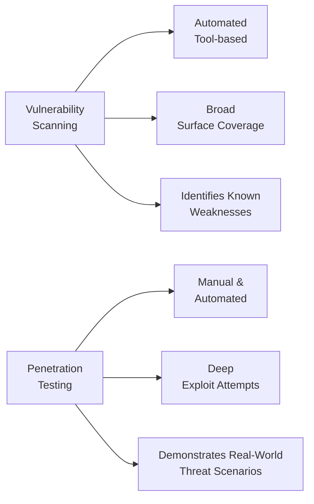

## 21.1 Types of Security Assessments (Vulnerability Scans, Penetration Testing)

In the modern technology and regulatory landscape, organizations are required to provide ongoing assurances about their security, confidentiality, and privacy controls. CPAs performing IT audits, advisory services, or SOC engagements (discussed in Chapters 22–27) must be proficient in understanding and evaluating the various security assessment techniques an enterprise employs. Two critical types of tests are (1) vulnerability scanning and (2) penetration testing. Although these terms are sometimes used interchangeably, they differ in methodology, depth, and overall objective. This section explores both forms of testing in detail, with particular emphasis on the importance of properly defining the scope for each engagement. 

--------------------------------------------------------------------------------
### Introduction to Security Assessments
Security assessments are systematic evaluations of an organization’s IT environment, aimed at identifying potential weaknesses that threat actors could exploit. These evaluations help stakeholders answer the following questions:

• Where do vulnerabilities exist within the system?  
• How critical are these vulnerabilities to the organization?  
• What are the remediation steps, timelines, and resource requirements?  

Security assessments can be narrow, focusing on a single system, or broad, examining an entire corporate network, including third-party connections (see Chapter 7 for third-party risk management considerations). As technology rapidly evolves, these assessments must be repeated periodically and integrated into continuous improvement processes.

--------------------------------------------------------------------------------
### Vulnerability Scans
Vulnerability scans are typically automated tests that identify known weaknesses in servers, network devices, applications, and other IT assets. These scans rely on up-to-date databases of known vulnerabilities, such as entries from the Common Vulnerabilities and Exposures (CVE) system or vendor-specific advisories. A vulnerability scanner probes network ports, services, and management interfaces to flag misconfigurations, outdated patches, or known software flaws.

#### Characteristics of Vulnerability Scans
• Automated: Rely on specialized tools (e.g., Nessus, Qualys, OpenVAS) that systematically examine hosts, servers, firewalls, and other infrastructure.  
• Breadth Over Depth: Tend to cover a large surface area across multiple systems rapidly.  
• Repetitive and Scheduled: Easily integrated into scheduled maintenance tasks, performed weekly, monthly, or even daily if the organization requires tighter security thresholds.  
• Focus on Known Issues: Identify newly published vulnerabilities or commonly exploited misconfigurations but do not typically delve into creative or unknown exploit paths.  

Because vulnerability scans are relatively easy to run and produce standardized reports, they form the backbone of many chain-of-custody checks and IT compliance efforts. However, the reliance on known vulnerabilities means that zero-day exploits or undiscovered threats might not be reported, and false positives can be common.

--------------------------------------------------------------------------------
### Key Steps in Vulnerability Scanning
While the specific processes vary by tool and organizational procedures, a typical workflow for vulnerability scanning involves the following steps:

1. Asset Discovery  
   • Identify all devices and endpoints within the target environment.  
   • Clarify the IP address ranges and subnets to be scanned.  
   • For organizations with multiple business units, verify boundaries and sensitive zones.

2. Scanner Configuration  
   • Authenticate the scanner to gain deeper access to system settings.  
   • Tailor scanning modes based on the environment (e.g., production vs. staging).  
   • Define the network segments allowed for scanning to avoid disruptions.

3. Scan Execution  
   • Initiate either an internal or external scan using the chosen tool.  
   • Monitor the scan to ensure it does not overload or crash critical systems.  

4. Reporting and Analysis  
   • Analyze scan results for critical vulnerabilities (e.g., CVSS high or critical scores).  
   • Validate potential false positives via manual testing or consulting tool documentation.  
   • Prioritize confirmed vulnerabilities based on severity and asset criticality.  

5. Remediation  
   • Assign remediation actions to the appropriate owners.  
   • Apply patches, reconfigure systems, or update firmware as determined.  
   • Conduct follow-up scans to confirm closure.  

6. Documentation  
   • Document findings, remediation steps, and any residual risk.  
   • Retain evidence for audit purposes (see Chapter 21.2 for more on evidence collection).  

Vulnerability scans fit naturally into repeatable processes, giving organizations a baseline for how their security posture evolves over time.

--------------------------------------------------------------------------------
### Penetration Testing
Penetration testing, often referred to as pen testing, is a more thorough and manual approach that simulates real-world attacks on specific systems, applications, or networks. This type of assessment goes beyond simply detecting potential vulnerabilities. It actively exploits them (under controlled conditions) to assess the possible impact, demonstrate exploitability, and evaluate how security defenses respond.

#### Characteristics of Penetration Testing
• Manual Exploration: Although automated tools can be involved, significant portions of the test are performed by skilled ethical hackers who employ a mix of creativity, knowledge, and caution.  
• Depth Over Breadth: Typically focuses deeply on a set of critical systems, applications, or environments rather than scanning everything.  
• Risk-Focused: Analyzes potential attack vectors specific to the organization’s business context, considering risk tolerance, threat models, and data sensitivity.  
• Human-Driven: Real attackers are innovative and can exploit unknown vulnerabilities or combine multiple flaws to gain access. Pen testers aim to replicate that mindset within a legal framework.  

A well-executed penetration test provides evidence of how effectively current security measures detect, alert, or prevent malicious activity. This includes determining if an attacker can pivot from one compromised system or account to another, eventually reaching higher-value data or system components.

--------------------------------------------------------------------------------
### Methodologies in Penetration Testing
Penetration testers use different approaches depending on the scope, constraints, and objectives:

• Black Box Testing: The testing team has no prior knowledge of the target’s internal architecture, mimicking an external attacker with limited information.  
• White Box Testing: The organization provides the testers with full details, including source code, network diagrams, and credentials. This approach is more in-depth but less reflective of an uninitiated attacker’s perspective.  
• Gray Box Testing: The testers start with limited knowledge or user-level credentials, approximating attacks from a malicious insider or compromised user account.  

Typical stages of the testing lifecycle include reconnaissance, scanning, gaining access, maintaining access, and covering tracks. In addition, testers often simulate lateral movements across the network to illustrate how an attacker might progress.

--------------------------------------------------------------------------------
### Comparing Vulnerability Scanning vs. Penetration Testing
The following Mermaid diagram highlights the comparative flow of a vulnerability scan versus a penetration test:

Despite both being essential facets of security assessments, each method serves different needs:

• Time and Cost: Vulnerability scans run quickly at minimal cost, especially when integrated into monthly or weekly routines. Penetration tests are more resource-intensive, requiring skilled personnel or specialized service providers for thorough coverage.  
• Depth and Insights: Scans reveal vulnerabilities and highlight potential misconfigurations; however, they may not prove exploitability. Pen tests validate whether a vulnerability can be exploited and whether additional steps can be taken to escalate privileges or move laterally.  
• Frequency: Vulnerability scanning can be repeated frequently, sometimes even continuously, while penetration testing often occurs annually or semi-annually due to cost and logistical considerations.  

In many organizations, vulnerability scanning precedes penetration testing. The scans identify general weaknesses that can be addressed proactively, while the subsequent pen tests explore deeper risks and tailor remediation to real-world attack scenarios.

--------------------------------------------------------------------------------
### Importance of Proper Scope Definition
One critical element shared by both vulnerability scanning and penetration testing is the need for setting a well-defined scope of work. Proper scope definition ensures:

• Clear Objectives: Aligns the assessment with business goals, risk tolerance, and regulatory constraints.  
• Controlled Testing: Prevents accidental damage to production systems or unintentional interruptions of critical services.  
• Legal Clarity: Ensures that ethical hackers or testers have explicit authorization to perform tests, reducing the risk of legal entanglements or friction with service providers.  
• Budget Allocation: Helps organizations direct resources effectively, focusing on high-impact systems like financial databases, ERP platforms (see Chapter 6), and sensitive third-party connections.  

A typical scope definition process includes:  
1. Identifying the assets or environments to target.  
2. Documenting the testing boundaries (for instance, restricting certain production servers or user data).  
3. Defining success criteria, such as methods used, data access required, or specific vulnerabilities of interest.  
4. Agreement on timelines and communication protocols for critical or zero-day findings.  

When the scope is accurate and comprehensive, both vulnerability scans and penetration tests can be performed efficiently, yielding actionable insights.

--------------------------------------------------------------------------------
### Real-World Examples and Case Studies
Case studies often highlight how organizations deploy scanning or testing improperly because they fail to define scope correctly or rely too heavily on one approach:

• Bank A runs monthly vulnerability scans on externally facing systems. However, a third-party vendor environment remains unscanned due to poor network inventory documentation. Later, an attacker exploited vulnerabilities in the vendor’s system to access sensitive bank data. A simple scope extension to third parties could have prevented this issue (see Chapter 7.5 on Vendor Risk Management).  
• Insurance Company B invests in annual penetration tests for thorough coverage of critical claims systems and customer portals. Despite that, the time-consuming process leads them to skip monthly vulnerability scans. A newly discovered flaw in their web framework remains unpatched for months. An attacker exploits it, demonstrating that combining frequent scans with periodic, in-depth pen tests is crucial.  

In both examples, the combination of scanning and testing—and ensuring those processes are well-scoped—could have improved the organization’s defensive posture, protecting financial data and maintaining trust with stakeholders.

--------------------------------------------------------------------------------
### Tools and Techniques
Many commercial and open-source tools exist to facilitate scanning and penetration testing. The selection of tools is often driven by compliance requirements (e.g., PCI DSS scans of e-commerce environments) and organizational capacity. Below are a few examples:

• Automated Scanning Tools (Vulnerability Scanning):  
  - Nessus  
  - QualysGuard  
  - OpenVAS  
  - Rapid7 InsightVM  

• Penetration Testing Frameworks:  
  - Metasploit Framework (for exploit development and testing)  
  - Burp Suite (commonly used for web application security testing)  
  - Nmap (network exploration and mapping tool)  
  - Wireshark (protocol analysis to understand traffic flows)  

In either scenario, testers frequently supplement commercial tools with scripts, custom code, or specialized methods to investigate potential security weaknesses.

--------------------------------------------------------------------------------
### Key Considerations for Auditors and CPAs
Within the CPA’s scope of evaluating information systems and controls (see Chapter 4 for foundational IT audit considerations), security assessment results often factor into risk assessments and the forming of an audit opinion. Here are some recommendations:

• Independence and Objectivity: When performing or evaluating penetration testing, auditors should ensure they maintain independence and avoid conflicts of interest. If the in-house audit team is too close to IT operations, consider an independent specialist.  
• Frequency and Timing: Align the frequency of vulnerability scanning with major updates or scheduled maintenance windows. For penetration testing, ensure the timing is appropriate—e.g., new system rollouts, major ERP upgrades, or after high-impact incidents.  
• Evidence Collection: Document findings and verify that reported vulnerabilities and exploited paths are credible. Cross-check with system logs, event managers, or intrusion detection systems (see Chapter 17 for more on IDPS).  
• Remediation Follow-Up: Assess the timeliness and effectiveness of remediation. Sometimes, the real test is whether repeated vulnerabilities are discovered in subsequent scans or tests, indicating a flawed patch management lifecycle (Chapter 10 addresses change management and patch management processes).  

--------------------------------------------------------------------------------
### Bringing It All Together
Vulnerability scans and penetration tests form complementary layers of assurance. Vulnerability scanning enables routine and scalable identification of issues, while penetration testing delves deeper, mirroring real-world attacker behavior to reveal potential business impacts. Both approaches hinge on a properly articulated scope, which guarantees that testing efforts align with organizational objectives, budgets, and risk appetite.

Considering the high stakes of security breaches—especially for organizations that handle financial data, personally identifiable information (PII), or intellectual property—CPAs need to understand these testing mechanisms thoroughly. By reviewing the results, strategy, and implementation of vulnerability scans and penetration tests, auditors can gauge the maturity of an organization’s security posture.

--------------------------------------------------------------------------------

## Quiz: Assess Your Knowledge of Security Assessments



### Which of the following best describes vulnerability scanning?
- [x] It systematically identifies known weaknesses in systems using automated tools.  
- [ ] It focuses primarily on attempting to exploit unknown vulnerabilities in targeted systems.  
- [ ] It always involves manual exploitation of identified security flaws.  
- [ ] It requires user-level credentials but no automated scripts.  

> **Explanation:** Vulnerability scanning relies on an automated approach to identify known weaknesses (e.g., unpatched software, common misconfigurations) rather than focusing on unknown exploits.

### Which statement accurately captures the difference between vulnerability scans and penetration tests?
- [ ] Vulnerability scans apply only to external devices, while penetration tests apply only to internal devices.  
- [x] Vulnerability scans identify potential flaws quickly using automated tools, whereas penetration tests involve deeper investigations that may include manual exploit attempts.  
- [ ] Penetration tests always run faster than vulnerability scans.  
- [ ] Vulnerability scans are not legally acceptable while penetration tests are.  

> **Explanation:** Vulnerability scanning takes a broad, automated approach. Penetration testing is more targeted, often using manual strategies to exploit identified weaknesses.

### In the context of scope definition for security assessments, which of the following is most critical?
- [x] Ensuring authorized boundaries and objectives for all testing activities are clearly documented.  
- [ ] Running scans and tests without limitation to uncover all possible flaws within the global network.  
- [ ] Outsourcing the entire process to a third party without verifying scope or coverage.  
- [ ] Ignoring production environments to avoid operational risk.  

> **Explanation:** Proper scope definition clarifies the assets to be tested, acceptable testing methods, and legal authorizations, which is essential for avoiding unintended damage or legal complications.

### Which approach to penetration testing most closely simulates an external attacker with no prior knowledge?
- [ ] White box penetration testing  
- [ ] Gray box penetration testing  
- [x] Black box penetration testing  
- [ ] Red teaming  

> **Explanation:** In black box testing, the tester lacks any inside information, simulating an external hacker’s perspective.

### What is a primary advantage of vulnerability scanning over penetration testing?
- [x] It is typically faster and can be scheduled regularly at lower cost.  
- [ ] It allows testers to perform advanced exploitation of zero-day vulnerabilities.  
- [x] It provides the broadest possible range of real-time exploit attempts.  
- [ ] It definitively proves exploitability of each concern.  

> **Explanation:** Vulnerability scanning covers a wide range of systems quickly and can be repeated frequently. However, it doesn’t provide proof of exploitability; that is left to penetration tests.

### Why might an organization perform vulnerability scans more frequently than penetration tests?
- [x] Vulnerability scans are automated, cheaper, and can be incorporated into routine checks.  
- [ ] Penetration tests are not recognized by industry standards or best practices.  
- [ ] Vulnerability scans require a higher level of specialized expertise to carry out.  
- [ ] Penetration tests can only be executed on cloud-based systems.  

> **Explanation:** Automated scanners are easy to run on a scheduled basis, and they are generally more cost-effective and less disruptive compared to a pen test.

### What is an essential next step after reviewing the results of a vulnerability scan?
- [x] Validate critical findings to rule out false positives and prioritize remediation.  
- [ ] Ignore the issues if they appear minor or difficult to exploit.  
- [ ] Immediately conduct an unrelated black box penetration test.  
- [ ] Retain the worst vulnerabilities and fix the minor ones first.  

> **Explanation:** Once the scan is complete, organizations must validate the results to ensure accuracy and plan remediation based on criticality and risk priority.

### How does a penetration test add value beyond a simple scan?
- [x] It can demonstrate chain-of-attack scenarios and provide insights into how multiple vulnerabilities might be combined to escalate privileges.  
- [ ] It only reports vulnerabilities in operating system patches.  
- [ ] It discards any issues identified by vulnerability scanners.  
- [ ] It automatically fixes the vulnerabilities in real time.  

> **Explanation:** Pen testers often explore creative ways to combine vulnerabilities, showing how attackers might move laterally or escalate privileges.

### Which is the best justification for implementing both vulnerability scanning and penetration testing?
- [x] They complement each other by covering both broad and deep security evaluations, providing a comprehensive risk analysis.  
- [ ] Penetration testing alone suffices to fulfill all audit and compliance requirements.  
- [ ] Vulnerability scanning alone is sufficient and cheaper to implement.  
- [ ] Both are outdated methods no longer recommended by security best practices.  

> **Explanation:** Scans identify a wide range of known vulnerabilities, while pen tests delve deeper to mimic sophisticated attacks, meaning both are crucial for comprehensive security assurance.

### True or False: Scoping is irrelevant to penetration testing as the tester should have unlimited access to discover all possible vulnerabilities.
- [ ] True  
- [x] False  

> **Explanation:** Scoping is paramount; unrestricted access can cause operational disruptions, legal issues, or challenges in focusing on the most critical systems.



--------------------------------------------------------------------------------

## For Additional Practice and Deeper Preparation

### [Information Systems and Controls (ISC)](https://www.udemy.com/course/isc-cpa-mock-exams/?referralCode=E1217303222935C5E464)

**Information Systems and Controls (ISC) CPA Mocks:** 6 Full (1,500 Qs), Harder Than Real! In-Depth & Clear. Crush With Confidence!

- Tackle full-length mock exams designed to mirror real ISC questions.  
- Refine your exam-day strategies with detailed, step-by-step solutions for every scenario.  
- Explore in-depth rationales that reinforce higher-level concepts, giving you an edge on test day.  
- Boost confidence and minimize anxiety by mastering every corner of the ISC blueprint.  
- Perfect for those seeking exceptionally hard mocks and real-world readiness.  

_Disclaimer: This course is not endorsed by or affiliated with the AICPA, NASBA, or any official CPA Examination authority. All content is for educational and preparatory purposes only._
