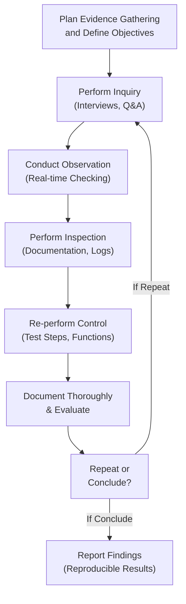

## 21.2 Gathering Evidence of Control Operation

Ensuring that security, confidentiality, and privacy controls are functioning as intended requires evidence. Gathering and evaluating this evidence with care, consistency, and reproducibility enables auditors and assurance professionals to validate control effectiveness. Evidence collection in this context goes beyond a one-size-fits-all approach: it requires adaptation to the specifics of each environment, control objective, and applicable standards (e.g., COSO, COBIT, NIST). The most common evidence-gathering techniques are inquiry, observation, inspection, and re-performance. Each method has its own strengths, potential limitations, and best practices, which we shall explore in detail below.

In addition to the four main techniques, we will highlight how to make processes reproducible so that conclusions reached can be verified and confidently reported. Reproducible results mean that another suitably qualified professional should be able to follow the same evidence-gathering steps and reach the same conclusions. This principle underpins much of audit and assurance professionalism, ensuring transparency and credibility for all stakeholders.

--------------------------------------------------------------------------------

### Understanding Evidence Types

Before diving into the four major techniques, it is helpful to recognize how evidence fits into the broader framework of an IT audit or advisory engagement. Evidence can be derived from multiple sources:

• Internal sources (e.g., system logs, policies, firewall rules).  
• External or third-party sources (e.g., confirmations from vendors, SOC reports from subservice organizations).  
• Physical inspections (e.g., inspections of hardware or server rooms).  
• Digital or virtual evidence (e.g., cloud configurations, screenshots of system settings).  

No single piece of evidence is typically conclusive on its own; combining different forms of evidence is a best practice. Tying all evidence collection back to the defined control objectives—whether related to security, confidentiality, or privacy—helps ensure a focused, efficient, and meaningful process.

--------------------------------------------------------------------------------

### The Role of Reproducible Results

“Reproducible” results foster consistency and reliability in any IT control testing scenario. This principle ensures that:

1. Other auditors, especially in collaborative or subsequent engagements, can systematically verify your findings.  
2. Stakeholders (management, regulators, or external auditors) can trust that findings are not idiosyncratic or overly dependent on a single auditor’s viewpoint or short-term conditions.  
3. Evidence can be re-examined if new questions arise about the control’s operation, scope, or design.

In practice, reproducibility requires maintaining excellent documentation of each step taken, the data sources assessed, and how conclusions were drawn. It also calls for standardized testing protocols: same data sets, consistent test scripts, and repeated test scheduling as needed. This principle becomes even more pertinent when verifying automated controls in ERP environments or cloud-based systems, where system settings can update rapidly, and versions or patches might change frequently.

--------------------------------------------------------------------------------

### 1) Inquiry

Inquiry is often the most accessible and straightforward evidence-gathering technique. It involves asking staff or other relevant personnel about how controls are performed within their daily tasks. Inquiry can be formal (e.g., structured interviews with prepared questionnaires) or informal (e.g., ad-hoc clarifications during an on-site visit).

#### Pros and Cons

• Pros:  
  – Quick and cost-effective means of obtaining initial or high-level data.  
  – Gathers context, clarifications, and insights that might not be evident from documentation alone.  

• Cons:  
  – Relies heavily on interviewees’ honesty, knowledge, and memory.  
  – Potentially biased answers if individuals feel pressured or uncertain (risk of incomplete or intentionally skewed information).

#### Best Practices

• Pose open-ended questions that prompt detailed responses.  
• Verify statements from multiple individuals to reduce dependency on a single viewpoint.  
• Corroborate answers with additional methods of evidence collection whenever possible.  
• Document the exact questions, the individuals interviewed (name, title, date), and the answers that were provided.

--------------------------------------------------------------------------------

### 2) Observation

Observation involves directly watching a process or control in action. Examples include watching a help desk professional respond to an incident call, or reviewing how data center staff follow established security measures (e.g., entry via smart card, use of secure server racks).

#### Example of an Observation Scenario

Picture a scenario where your organization’s data center is protected by a biometric entry system. As part of an IT general controls audit (see Chapter 8: IT General Controls for more context), you want to ensure that only authorized employees gain entry. By standing near the data center for a defined period, you can watch how employees enter and whether the control is actually enforced (e.g., staff never holding the door open for “tailgaters,” validating card badges, etc.).

#### Pros and Cons

• Pros:  
  – Offers direct insight into how the control truly operates in practice.  
  – Allows the auditor to observe exceptions or noncompliance in real time.  

• Cons:  
  – Employees may alter behavior when they know they are being observed.  
  – One-time observation may not reflect day-to-day patterns or events that occur outside the observation window.

#### Best Practices

• Conduct observations unannounced or with minimal advance warning to prevent stage-managed compliance.  
• If possible, observe in multiple time windows and across multiple days to capture a representative snapshot.  
• Document the date/time, individuals involved, environment conditions, and any notable exceptions or processes discovered.  
• Combine with complementary evidence-gathering techniques (e.g., inquiry, inspection) for more robust conclusions.

--------------------------------------------------------------------------------

### 3) Inspection

Inspection entails examining documents, records, or other tangible or digital artifacts that can prove control operation. This type of evidence ranges from reviewing incident logs, system change management tickets, or firewall configurations to physically checking that data backups have been made as indicated in policy and stored in offsite facilities.

#### Examples of Inspection Targets

• Reviewing written policy documents to ensure they match actual procedures.  
• Examining system logs for user account creations, deletions, and modifications.  
• Checking data backups from mission-critical servers for completeness, verifying they match the scheduled frequency.  
• Inspecting user access rights to confirm they align with the principle of least privilege.

#### Pros and Cons

• Pros:  
  – More objective than inquiry or observation, as it covers records of historical events.  
  – Can provide large amounts of data if logs and records are detailed.  
  – Often used to corroborate or refute statements obtained via inquiry.

• Cons:  
  – May not reflect real-time operation of the controls (documentation can be outdated).  
  – Potential for counterfeit or incomplete records if internal controls are weak.  
  – Requires skillful review and sampling techniques to ensure completeness.

#### Best Practices

• Clearly define the sampling methodology (e.g., random, systematic, risk-based) to avoid bias.  
• Validate the integrity and reliability of the documentation sources.  
• Use data analytics tools, where appropriate, to analyze large volumes of records efficiently.  
• Maintain a clear audit trail: note the exact documents examined, their location, and any reasons for believing they are authentic and complete.

--------------------------------------------------------------------------------

### 4) Re‑performance

Re-performance stands out as one of the most powerful and reliable methods of testing if, in practice, the control consistently produces the desired result. It involves executing the same steps or processes that the control operator would follow. If you, as the auditor, can perform the same procedure under the supervision or guidance of the control owner and generate the same outcomes they claim, you have a strong indicator that the control is both functional and reproducible.

#### Real-World Re-performance Example

Suppose an organization’s password-reset process requires that the help desk verifies user identity by requesting a unique PIN or answer to a security question before allowing password changes. As an auditor, you might follow the same steps as a help desk staff member by pulling up the user’s profile in the system, verifying how the system enforces these protocols, and confirming that the system will not permit a reset without the required verification. If your attempt at re-performing the control results in the same steps and outcomes, the procedure likely operates as intended, and the system is robust.

#### Pros and Cons

• Pros:  
  – Evidence that is highly reliable since you are testing the control outcomes directly.  
  – Useful for complex or automated controls where observation or inspection might not capture the full dynamic.  
  – Allows for thorough validation that each step of the control is functioning properly.

• Cons:  
  – Time-consuming, especially if the processes are intricate or require specialized permissions and test environments.  
  – Might require hands-on system knowledge and controlled test conditions to avoid interfering with production environments.

#### Best Practices

• Coordinate closely with control owners to ensure you have the necessary permissions and test environment.  
• Document each step meticulously for reproducibility.  
• Whenever possible, conduct re-performance in a non-production setting or during a low-activity window to avoid service disruptions.  
• Compare your outcomes to logs, documentation, or expected results for discrepancies that may indicate control weaknesses.

--------------------------------------------------------------------------------

### Combining Multiple Evidence Collection Methods

Using a single collection method in isolation introduces reliance on only one form of evidence, which could be misleading. A combination of inquiry, observation, inspection, and re-performance offers a well-rounded view of how controls truly operate.

Consider an example of testing logical access to a set of financial reporting applications:

1. **Inquiry**: Speak to the IT access manager regarding how access is granted, modified, and revoked.  
2. **Observation**: Watch a user requesting access in real-time, verifying if the manager adheres to the stated procedure.  
3. **Inspection**: Inspect system logs, change approval tickets, and role matrices to see if the user’s new permissions match the manager’s documentation.  
4. **Re-performance**: Attempt to provision or revoke access following the same procedure, checking if the system enforces the mandatory steps (e.g., manager approval, security question, multi-factor authentication setup).

By triangulating these results, the auditor gains stronger confidence in the overall reliability of the logical access control. If inquiry and observation show a well-defined process, but inspection finds missing or incomplete documentation, or re-performance fails to replicate results, you have a strong indicator of a control deficiency.

--------------------------------------------------------------------------------

### Ensuring Reproducible Results

Below is a simple flow diagram using Mermaid.js to illustrate the typical lifecycle of evidence gathering and reproducibility:

1. **Plan Evidence Gathering and Define Objectives**: Clarify which controls you need to test, and establish your approach.  
2. **Perform Inquiry**: Gather preliminary, contextual information from individuals knowledgeable about the process.  
3. **Conduct Observation**: Confirm whether control activities occur as described in a live environment.  
4. **Perform Inspection**: Examine existing records for historical, documented evidence of the control.  
5. **Re-perform the Control**: Mimic or replicate the procedure to confirm the outcome.  
6. **Document Thoroughly & Evaluate**: Capture the methods, data sources, and steps to produce reproducible conclusions.  
7. **Repeat or Conclude?**: Determine if further testing is needed or proceed with forming a final conclusion.  
8. **Report Findings**: Present results in a manner that another professional could replicate the steps or analyses.

This cyclical nature (Step 7: “Repeat or Conclude?”) highlights that auditing and assurance engagements often require iterative testing and follow-up if inconsistencies arise. Maintaining a well-documented audit trail is essential for reproducibility and for enabling subsequent audits to rely on your findings.

--------------------------------------------------------------------------------

### Common Pitfalls and Challenges

1. **Inadequate Documentation**: Missing, incomplete, or inconsistent documentation can undermine the reliability of your evidence and hamper reproducibility.  
2. **Limited Scope of Observation**: Observing only once might cause you to miss sporadic exceptions. Consider multiple observation sessions at different times if possible.  
3. **Over-Reliance on Inquiry**: Although talking with personnel is useful, avoid concluding on controls based on inquiry alone. Seek corroboration via inspection or re-performance.  
4. **Production Interference Risks**: When re-performing controls in live production environments, you risk disruptive changes if not carefully coordinated with IT staff.  
5. **Control Owner Bias**: Relying solely on staff-based instructions or demonstrations can be misleading if staff consciously or unconsciously deviate from normal operating procedures under scrutiny (“show me your best day” phenomenon).

--------------------------------------------------------------------------------

### Practical Insights and Case Studies

• **Case Study #1: Disaster Recovery Testing**  
  – A financial services provider had to confirm the operation of its disaster recovery plan (refer to Chapter 9: System Availability and Business Continuity). After inquiring about the plan with relevant staff, the auditor observed a live drill. They then inspected server backup logs spanning six months. Finally, a partial re-performance was conducted by restoring selected databases to an alternate environment. This combination of methods produced a consistent, reproducible chain of evidence confirming that the plan was functional and staff were properly trained.

• **Case Study #2: Vendor Risk Management**  
  – A retail entity required validation that all critical third-party vendors undergo periodic security audits. Inquiry suggested a three-step vendor security review. Observation discovered that some staff occasionally skipped or rushed steps under pressure. Inspection of vendor attestations and checklists indicated compliance in only 70% of reviewed cases. Re-performance, by following the vendor review steps exactly as policy stated, revealed that the official process took longer than staff were prepared to spend, contributing to incomplete performance. This indicated a design or operational deficiency that management needed to address (see Chapter 7.5 Third-Party and Vendor Risk Management for more detail).

--------------------------------------------------------------------------------

### Linking Evidence to Control Assessments

Gathering evidence is ultimately about building a story of how controls operate in real-life contexts. By linking each piece of evidence to specific control objectives—whether these objectives relate to data integrity, confidentiality, availability, or privacy requirements as discussed in prior chapters—auditors can more precisely conclude whether a control is:

• **Effective** (e.g., properly designed and operating as intended).  
• **Ineffective** (e.g., flawed design or inconsistent operation).  
• **Only partially effective** (e.g., certain circumstances or times where the control breaks down).

The final step is to integrate these findings into reports or advisory deliverables (see Chapter 21.4 Documenting Findings in Audit or Advisory Reports). The effectiveness of each control, and the sufficiency of the evidence supporting that conclusion, should be transparently documented. Stakeholders need to understand not just the result (pass/fail) but also the nature of the evidence and testing procedures that led to that conclusion.

--------------------------------------------------------------------------------

### Ensuring Alignment with Overall Audit Objectives

Gathering evidence of control operation is a pivotal component of attestation and assurance engagements. However, always keep the larger picture in mind. IT controls do not operate in a vacuum; they should align with overarching compliance obligations (e.g., HIPAA, GDPR) and enterprise strategies (as discussed in Chapter 3: Governance, Frameworks, and Regulatory Environment). For instance, you might find that while a control is effectively designed from a technology perspective, the enterprise has not fully aligned it with relevant data privacy regulations. In such cases, your evidence-gathering process can inform not only the technical posture but also the broader strategic or compliance posture of the organization.

--------------------------------------------------------------------------------

### References and Further Reading

• AICPA. (2023). Guide to Audit Data Analytics.  
• ISACA. (2019). COBIT 2019 Framework: Governance and Management Objectives.  
• Institute of Internal Auditors (IIA). (2020). Internal Auditing and Evidence Collection.  
• COSO. (2013). Internal Control – Integrated Framework.  
• International Standards for the Professional Practice of Internal Auditing (Standards).

--------------------------------------------------------------------------------

## Quiz: Assessing Evidence-Gathering Techniques for Control Operation



### Which of the following best describes the purpose of "reproducible results" within an IT audit?

- [x] Ensuring that a different auditor can follow the same steps and reach similar conclusions
- [ ] Verifying that management’s assertions are always correct
- [ ] Guaranteeing 100% security in all systems
- [ ] Reducing the number of steps used in testing

> **Explanation:** Reproducible results ensure that the audit methodology is consistent and transparent so that another professional could replicate the test and arrive at similar conclusions.

### Inquiry as an evidence-gathering technique is most effective when:

- [ ] Used as the sole basis for concluding on control design
- [x] Combined with methods such as inspection and re-performance
- [ ] Performed only with staff in lower-level positions
- [ ] Done anonymously to prevent bias

> **Explanation:** Inquiry provides qualitative insights that need to be corroborated through objective measures like inspection or re-performance to achieve robust evidence.

### What is a common drawback of observation as an audit technique?

- [x] Employees may modify their behavior when they know they are being observed
- [ ] It is impossible to conduct observation unannounced
- [ ] Observation is always more time-consuming than inspection
- [ ] It cannot be used for verifying physical processes

> **Explanation:** Auditee behavior may not reflect normal operating conditions if observed staff consciously or unconsciously change their actions under scrutiny.

### Inspection of documentation is particularly useful for:

- [ ] Observing real-time workflow activities
- [ ] Gathering people’s perspectives on how controls should function
- [x] Verifying historical records of control execution
- [ ] Performing hands-on testing of automated controls

> **Explanation:** Inspection involves examining logs, change tickets, audit trails, and other evidence that reflect past events. It is less suited to real-time observation.

### In which scenario is re-performance especially beneficial?

- [ ] When the control’s operation is already manually verified by observation
- [x] When confirming that the control consistently produces the same outputs for given inputs
- [ ] When employees are unwilling to participate in interviews
- [ ] When new regulations prohibit direct system testing

> **Explanation:** Re-performance helps validate automated or manual processes by replicating the control owner’s actions to determine whether the outcomes are consistent.

### One key best practice for achieving reproducible results is:

- [x] Thoroughly documenting each step of the testing procedure
- [ ] Delegating evidence collection to inexperienced staff
- [ ] Conducting all tests at random times without any plan
- [ ] Avoiding the use of data analytics

> **Explanation:** Detailed documentation of test steps, data sets, and results ensures that future auditors or reviewers can replicate the process and verify findings.

### Why is it important to combine different evidence-gathering techniques?

- [x] A single technique could miss critical risk elements or exceptions
- [ ] Multiple techniques typically cancel each other out
- [ ] It is a mandatory requirement by all regulatory authorities
- [ ] It ensures faster completion of an audit

> **Explanation:** Relying on multiple methods (inquiry, observation, inspection, re-performance) helps provide a comprehensive view of the control environment and reduces the risk of oversight.

### A potential pitfall of excessive reliance on inquiry alone is:

- [x] Relying solely on subjective statements or incomplete recollections
- [ ] Ensuring that other procedures become unnecessary
- [ ] Having to gather too much objective evidence
- [ ] Overlooking user interviews and staff feedback

> **Explanation:** Inquiry can yield important context but is subjective and should be corroborated by more objective methods like inspection or re-performance.

### For re-performance testing, auditors should:

- [x] Ensure they have appropriate permissions and a safe testing environment
- [ ] Avoid coordinating with control owners to preserve independence
- [ ] Only perform these tests in front of executive management
- [ ] Never document their steps to preserve confidentiality

> **Explanation:** Proper coordination and careful documentation are necessary to avoid disruptions, protect the control environment, and keep a clear record of each action.

### True or False: Observations are always more reliable than inspections.

- [ ] True
- [x] False

> **Explanation:** Observations and inspections each have strengths and limitations. Observations show real-time behavior but may not capture historical context. Inspections validate historical evidence but may not reflect current practices. Neither is universally superior.



--------------------------------------------------------------------------------

## For Additional Practice and Deeper Preparation

### [Information Systems and Controls (ISC)](https://www.udemy.com/course/isc-cpa-mock-exams/?referralCode=E1217303222935C5E464)

**Information Systems and Controls (ISC) CPA Mocks:** 6 Full (1,500 Qs), Harder Than Real! In-Depth & Clear. Crush With Confidence!

• Tackle full-length mock exams designed to mirror real ISC questions.  
• Refine your exam-day strategies with detailed, step-by-step solutions for every scenario.  
• Explore in-depth rationales that reinforce higher-level concepts, giving you an edge on test day.  
• Boost confidence and minimize anxiety by mastering every corner of the ISC blueprint.  
• Perfect for those seeking exceptionally hard mocks and real-world readiness.  

_Disclaimer: This course is not endorsed by or affiliated with the AICPA, NASBA, or any official CPA Examination authority. All content is for educational and preparatory purposes only._
