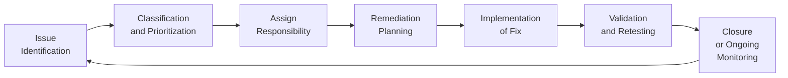

## 21.3 Remediation Tracking and Ongoing Monitoring

Remediation tracking and ongoing monitoring form key pillars of an effective cybersecurity, confidentiality, and privacy program. In many organizations, the discovery of control gaps or deficiencies marks only the first step in strengthening the overall security posture. Ensuring that corrective measures are implemented, validated, and maintained over time is an ongoing challenge—one that significantly impacts both compliance efforts and risk mitigation. This section explores best practices, frameworks, and real-world approaches for tracking remediation and implementing robust, continuous monitoring processes that align with professional standards such as those from the AICPA, COSO, COBIT, and other relevant guidelines.

In tandem with earlier sections on testing security, confidentiality, and privacy controls (Sections 21.1 and 21.2), the crucial next steps involve closing the loop on identified gaps. As CPAs, IT auditors, or assurance specialists, one must ensure that recommendations are acted upon swiftly, tracked thoroughly, and revisited to confirm proper closure. This cyclical approach underpins many industry-recognized compliance frameworks and fosters a culture of accountability and integrity.

-------------------------

### Importance of Remediation Tracking in the IT Audit Lifecycle

When an assessment or audit uncovers a control deficiency—be it a misconfigured firewall setting, missing encryption process, or unauthorized user’s access to sensitive financial applications—the initial reaction may be to fix the issue immediately. However, without a structured method to systematically track and prioritize remediation efforts, organizations risk overlooking or delaying critical fixes. Effective remediation tracking ensures:

• Clear Accountability: Identifies who is responsible for addressing the deficiency and managing the timelines.  
• Prioritization Based on Risk: Focuses resources on high-risk, high-impact issues first.  
• Documentation: Maintains an audit trail of remediation steps taken, decisions made, and final results.  
• Transparency to Stakeholders: Allows internal stakeholders (e.g., senior management) and external stakeholders (e.g., regulators, external auditors) to evaluate progress.

In the context of the COSO Internal Control – Integrated Framework (see Chapter 3.1) and COBIT 2019 (see Chapter 3.3), control deficiencies must be linked to enterprise objectives and risk appetites. From an assurance perspective, the significance (or materiality) of those deficiencies can affect financial statements and disclosures, underscoring the importance of swift remediation to avoid compounding risks.

-------------------------

### Common Steps in the Remediation Process

Although each organization’s approach to remediation varies, a generally accepted life cycle for remediation involves:

• Issue Identification: Often traced to audits, risk assessments, vulnerability scans, penetration tests, or incident responses.  
• Classification and Prioritization: Assigning a risk level (e.g., high, medium, low) and evaluating the potential impact on business operations or financial reporting.  
• Responsibility Assignment: Designating a single owner and assigning contributing team members to follow up on the issue.  
• Remediation Planning: Documenting how exactly the deficiency will be addressed, with a timeline that conforms to organizational risk tolerance.  
• Implementation: Executing the agreed-upon corrective strategies.  
• Validation and Retesting: Confirming that the fix is operating as intended.  
• Closure or Ongoing Monitoring: Officially closing the issue if it is resolved. For issues that warrant continuous monitoring, adding them to the broader monitoring framework.

Below is a visual representation of the remediation life cycle:

This cyclical approach ensures that the completion of remediation tasks feeds into a continuous improvement process. Lessons learned during each remediation cycle provide useful insights for better controls design, proactive risk detection, and refined monitoring strategies.

-------------------------

### Practical Tools for Remediation Tracking

Organizations frequently use specialized platforms or integrated toolsets for managing security and compliance issues. Examples include:

• GRC (Governance, Risk, and Compliance) Tools: Provide centralized dashboards, risk scoring, and automated alerts when deadlines are missed or risk thresholds are exceeded.  
• Ticketing & Workflow Systems: Tools such as ServiceNow, JIRA, or Microsoft Azure Boards facilitate assignment, progress tracking, and status visualization.  
• Spreadsheets and Shared Folders: Smaller or less mature organizations may use well-structured spreadsheets, though these can become unwieldy and prone to version-control issues as the environment grows.  
• Automation Integrations: Some systems integrate with scanning tools and logs to automatically create remediation tickets based on vulnerability scans or anomaly detections.

Regardless of the chosen medium, all effective solutions share one characteristic: they track the “who,” “what,” “when,” and “why” of an issue throughout its remediation cycle, reflecting managerial accountability and thorough oversight.

-------------------------

### Linking Remediation to Risk Appetite and Materiality

In Section 4.3, we introduced the concept of materiality and risk assessment. Once a deficiency has been revealed, it is crucial to determine whether the issue represents a critical risk that jeopardizes the achievement of organizational objectives or compliance obligations. This approach ensures that resources are allocated effectively, and it correlates with accepted internal controls principles (COSO) and IT governance guidance (COBIT).

• Critical (High-Risk) Issues: Typically include vulnerabilities that may expose financial data to cyber threats, hamper system availability for core services, or lead to significantly inaccurate financial statements. These generally require immediate action.  
• Medium-Risk Issues: Could degrade efficiency or pose potential threats to the organization in the future, warranting remedial measures according to established timelines.  
• Low-Risk Issues: Might have minimal financial or operational impact if exploited. Although still addressed, their remediation can often be scheduled after high-risk items receive focus and resources.

By aligning remediation priorities with the organization’s tolerance for risk, finance professionals and IT teams can ensure that urgent issues do not remain open for long. Moreover, these priorities help auditors determine the scope of subsequent testing to provide assurance regarding the elimination or reduction of high-risk issues.

-------------------------

### Ongoing Monitoring for Sustained Compliance

Once remediation is complete, the final—and arguably most critical—step is periodically verifying that the control deficiency does not re-emerge. In some cases, especially in complex IT environments, an issue may appear resolved but re-surface later due to changing system configurations, patches, or expansions into new business lines. As a result, robust ongoing monitoring practices are key. These can include:

• Periodic Retesting: Scheduling follow-up vulnerability scans or control tests on a monthly, quarterly, or semi-annual basis.  
• Continuous Auditing: Using automated diagnostics and real-time analytics (see Chapter 14 on Data Integration and Analytics for examples) to detect anomalies or non-compliance events as they occur.  
• Business Process Monitoring: Tracking the operational metrics and data flows in critical processes—like revenue recognition or payment disbursements—to pinpoint deviations early.  
• Internal Dashboards and KPIs: Creating dashboards that reflect the status of controls, flagged exceptions, and newly detected issues, aligning with performance indicators that matter most to the organization (e.g., time to remediate, open vs. closed tickets, residual risk scores).

COSO’s monitoring component stresses the importance of establishing baseline expectations for control performance and comparing ongoing results to those benchmarks. Moreover, frameworks like COBIT 2019 emphasize continuous improvement: measuring performance over time, learning from process gaps, and adapting governance structures to remain current with technological shifts.

-------------------------

### The Role of CPAs in Remediation Oversight

CPAs operating in IT assurance or advisory capacities must play an integral role in reviewing the effectiveness of an organization’s remediation processes. While independence concerns may limit the depth of direct testing in certain engagements, CPAs often:

• Assess the design and implementation of remediation tracking systems.  
• Verify the completeness and accuracy of the issue log and associated documentation.  
• Ensure that remediation owners are held accountable, particularly for high-risk findings that could affect financial reporting or compliance obligations.  
• Provide guidance on risk prioritization, often by leveraging knowledge of financial statement materiality thresholds.  
• Review or test a sample of closed remediation tickets to confirm they address the initially noted deficiency.

Collaborating with IT and compliance teams, CPAs bridge the gap between technical vulnerabilities and financial or regulatory exposures. This synergy ensures that the organization meets not only IT security standards but also remains aligned with broader finance and accounting principles.

-------------------------

### Common Pitfalls and Mitigation Strategies

1. Overlooking Documentation: Failing to maintain evidence of remediation work can lead to confusion about whether an issue was truly addressed.  
   – Mitigation: Implement a policy that all remediation tasks include detailed notes, screenshots (where feasible), or sign-offs from control owners.

2. Underestimating Resource Requirements: Organizations may under-allocate time or budget for remediating critical vulnerabilities.  
   – Mitigation: Leverage risk-scoring methods and resource-planning, ensuring high-risk issues receive the greatest attention.

3. Delayed Testing: Waiting too long to verify fixes can lead to prolonged exposure.  
   – Mitigation: Integrate partial retesting for major issues soon after they are remediated. This ensures that new or reconfigured systems function as intended.

4. Inadequate Communication: Some teams may not be informed of open remediation items that affect them.  
   – Mitigation: Use a centralized, transparent issue-tracking system with alerting features and routine synchronization meetings among stakeholders.

5. Lack of Executive Support: Without senior leadership buy-in, remediation may stall or fail to align with strategic objectives.  
   – Mitigation: Present relevant risks in business terms to show the financial or reputational impact of failing to act. Introduce incentives or accountability metrics at a high organizational level.

-------------------------

### Real-World Example: Unauthorized Access to ERP System

Consider a mid-sized manufacturing company reliant on an Enterprise Resource Planning (ERP) system to process financial transactions and manage inventory (see Chapter 6 for background on ERP ecosystems). An internal audit uncovers that dozens of high-privilege accounts were never deactivated after employees left the firm, exposing the ERP to potential misuse or fraudulent transactions. The deficiency is rated High-Risk as it could result in misstated financial statements or direct theft of assets.

1. Identification & Classification: The internal audit logs the issue in the company’s GRC platform and classifies it as severe.  
2. Responsibility Assignment: The ERP System Manager becomes the remediation owner, working alongside the IT Security team and HR.  
3. Remediation Plan: Develop automated scripts to deactivate user accounts upon HR system termination, schedule routine access reviews, and implement multi-factor authentication (MFA).  
4. Implementation: The scripts and automated workflows go live, HR integrates new-offboarding procedures, and reporting tools are set up in the ERP system to highlight inactive employee accounts.  
5. Validation & Retesting: The auditors revisit the user access logs. They confirm that ex-employees are now removed automatically, and the company’s access review processes are updated.  
6. Closure & Ongoing Monitoring: After this validation, the system manager marks the issue as “closed.” However, it remains on the monitoring log, and the organization decides to incorporate quarterly account recertification checks into its normal operations.  

-------------------------

### Integration with Continuous Monitoring and Emerging Technologies

Advancements in data analytics, artificial intelligence, and continuous monitoring are transforming how remediation and control oversight are performed. Some progressive organizations employ automated engines that:

• Continuously sweep system logs, transaction data, and other security feeds for anomalies.  
• Trigger alerts and open remediation tickets preemptively before a vulnerability is exploited.  
• Apply machine learning algorithms to detect user behavior inconsistencies that may indicate security risks in real time.

For example, a potential phishing campaign might trigger unusual logins from distant geographic locations, automatically initiating a critical remediation ticket assigned to an incident response team. This dynamic approach shortens the time lag between identifying and containing threats, thereby aligning strongly with the real-time needs of modern business.

-------------------------

### Case Study: Continuous Monitoring in a Financial Services Firm

A global financial services firm implemented continuous monitoring as part of its regulatory compliance obligations. Using an AI-driven Security Information and Event Management (SIEM) system, the firm aggregated data from multiple sources:

• Financial applications handling sensitive transactions.  
• External SaaS solutions for customer relationship management.  
• Cloud-based services for data analytics.  
• On-premises services handling payment systems.

Whenever suspicious activities—like repeated failed login attempts, a surge in nighttime transactions, or privileged user changes—were identified, the system automatically raised a “High-Priority” remediation task. Because this approach seamlessly integrated with the firm’s existing GRC tool, responsible parties received immediate alerts, tracked follow-up tasks, and performed quick retests once an issue was resolved. The result was a dramatic reduction in dwell time for critical vulnerabilities, compliance with regulatory guidelines for data security, and improved assurance for the firm’s external auditors.

-------------------------

### Best Practices for Building a Successful Remediation Culture

• Emphasize Risk Awareness: Continuous training and communication about risk appetite help employees understand why swift issue resolution is a critical business necessity.  
• Involve Cross-Functional Teams: Encourage coordination between IT, finance, legal, HR, and other stakeholders. Cybersecurity is not solely an “IT problem.”  
• Celebrate Milestones: Acknowledge quick turnaround times for high-risk issue closures or successful adoption of continuous monitoring solutions.  
• Align with Corporate Strategy: Present remediation efforts in the context of strategic goals (e.g., promoting brand trust, enhancing investor confidence).  
• Encourage Proactiveness: Reward employees who identify emerging risks and propose solutions instead of waiting for an audit to discover issues.

-------------------------

### References and Further Reading

• AICPA, “SOC for Cybersecurity” – Guidance on implementing and assessing cybersecurity risk management programs.  
• COSO, “Internal Control – Integrated Framework” – Principles for designing and evaluating the effectiveness of controls.  
• COBIT 2019 – Detailed coverage of IT governance and management, focusing on performance management and continuous improvement.  
• NIST SP 800-53 – Security and privacy controls useful for comparing or enhancing ongoing monitoring processes.  

-------------------------

## Quiz: Mastering Remediation and Monitoring of IT Control Deficiencies



### Which phase of the remediation life cycle ensures that the corrective fix addresses the initially identified deficiency effectively?

- [ ] Classification and Prioritization
- [ ] Assign Responsibility
- [x] Validation and Retesting
- [ ] Closure or Ongoing Monitoring

> **Explanation:** Validation and retesting confirm that the control deficiency has been corrected appropriately and operates as intended, ensuring that risks have been mitigated.

### What is one major advantage of a GRC platform in remediation tracking?

- [x] It centralizes issue management and provides dashboards for oversight.
- [ ] It automatically prevents all forms of cyberattacks.
- [ ] It requires less stakeholder input than spreadsheets.
- [ ] It generates indefinite audit logs on external servers.

> **Explanation:** Governance, Risk, and Compliance (GRC) tools offer a centralized approach, visibility, and coordinated workflows for managing security and compliance issues throughout the remediation process.

### In relation to remediation efforts, "closure" should ideally happen:

- [ ] Immediately after the fix is deployed, even if untested.
- [x] After validation efforts confirm that the fix resolves the risk.
- [ ] Before determining whether risk has been eliminated.
- [ ] Only when external auditors have been notified.

> **Explanation:** Closure occurs once a sufficient level of assurance has been gained through validation and retesting. This ensures that the original deficiency is no longer present or is properly mitigated.

### Why is priority-setting critical when addressing multiple control deficiencies?

- [ ] It provides a way to skip addressing nongovernmental controls.
- [x] It ensures that high-risk issues receive timely remediation resources first.
- [ ] It allows for more thorough classification of low-risk issues only.
- [ ] It purely satisfies regulatory frameworks irrespective of actual risk.

> **Explanation:** Prioritizing tasks ensures that the most significant or higher-risk issues are allocated the appropriate resources and resolved promptly to avoid extensive business impact.

### Which of the following best describes the outcome of ongoing monitoring?

- [x] Continuous oversight of remediated areas to ensure that issues do not recur.
- [ ] Immediate and guaranteed resolution of all operational risks.
- [x] Ability to identify re-emerging or new issues promptly.
- [ ] Complete elimination of the need for future auditing.

> **Explanation:** Ongoing monitoring allows organizations to periodically or continuously track control effectiveness, detect new or recurring issues, and maintain constant alignment with risk appetite.

### According to COSO principles, what is the primary reason for periodic retesting after remediation?

- [x] It validates that the corrective measures remain effective over time.
- [ ] It enables immediate external reporting of all vulnerabilities.
- [ ] It indefinitely automates audit tasks.
- [ ] It guarantees that no new risks can ever arise.

> **Explanation:** Periodic retesting confirms that remediation efforts remain adequate and addresses any potential drift from desired control performance due to changing conditions.

### Which challenge can arise if documentation for remediation efforts is not maintained?

- [x] Stakeholders may question whether the deficiency was truly resolved.
- [ ] Teams receive too many notifications to track.
- [x] Regulators are automatically satisfied with partial evidence.
- [ ] External auditors have no interest in final outcomes.

> **Explanation:** Proper documentation is crucial for accountability and future audits. Without it, there is no proof that the issue was resolved, leading to lack of trust or repeated deficiencies.

### A common pitfall in remediation tracking is delayed testing. What can organizations do to mitigate this?

- [x] Conduct targeted retesting of fixes soon after they are implemented.
- [ ] Defer all retesting until the annual audit.
- [ ] Only rely on management’s statement that fixes were completed.
- [ ] Wait for external auditors to request re-verification.

> **Explanation:** Prompt retesting helps confirm that the remediation efforts are indeed effective, reducing the window of exposure if the initial fix was incomplete or improperly executed.

### From a CPA’s perspective, which statement is true regarding remediation oversight?

- [x] CPAs may review the completeness of an organization’s remediation log and verify testing of resolved items.
- [ ] CPAs have no role in verifying remediation status if independence rules apply.
- [ ] CPAs only care about the remediation after the annual financial audit begins.
- [ ] CPAs should serve as the owners responsible for all technical remediations.

> **Explanation:** While CPAs do maintain independence for specific audits, their advisory role frequently includes observing and evaluating how effectively remediation is tracked, tested, and documented.

### A continuous monitoring system can generate automatic remediation tasks when:

- [x] It detects events or anomalies indicating potential security risks.
- [ ] It completes a daily backup of financial data.
- [ ] The system is offline due to maintenance.
- [ ] The external regulator demands immediate remediation.

> **Explanation:** Continuous monitoring tools can flag unusual or suspicious activities in real time, often triggering an automated ticket or alert to investigate and remediate potential threats.



-------------------------

## For Additional Practice and Deeper Preparation

### [Information Systems and Controls (ISC)](https://www.udemy.com/course/isc-cpa-mock-exams/?referralCode=E1217303222935C5E464)

**Information Systems and Controls (ISC) CPA Mocks:** 6 Full (1,500 Qs), Harder Than Real! In-Depth & Clear. Crush With Confidence!

- Tackle full-length mock exams designed to mirror real ISC questions.  
- Refine your exam-day strategies with detailed, step-by-step solutions for every scenario.  
- Explore in-depth rationales that reinforce higher-level concepts, giving you an edge on test day.  
- Boost confidence and minimize anxiety by mastering every corner of the ISC blueprint.  
- Perfect for those seeking exceptionally hard mocks and real-world readiness.

_Disclaimer: This course is not endorsed by or affiliated with the AICPA, NASBA, or any official CPA Examination authority. All content is for educational and preparatory purposes only._
