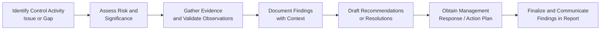

## 21.4 Documenting Findings in Audit or Advisory Reports

Clear, consistent, and carefully crafted documentation of audit or advisory findings forms the cornerstone of any successful security, confidentiality, and privacy assessment. In accounting and IT assurance contexts, precisely documented findings not only guide an organization’s remediation efforts but also provide stakeholders with actionable insights into the state of internal controls. Properly drafted reports help stakeholders understand how each identified control gap or deficiency impacts business operations, financial integrity, and overall risk exposure. 

This section brings into focus best practices regarding the structure, content, and presentation of documented findings. It also stresses the importance of providing an appropriate level of technical and business context, which ensures that readers at different levels of technical proficiency can fully appreciate the identified risks and recommended corrective actions. Whether you are providing an external attestation (e.g., SOC engagement) or an internal advisory service, the overarching principles of accuracy, clarity, completeness, and consistency apply.

  
Clarity ensures that findings are well understood and not open to misinterpretation. Business context makes each finding relevant to organizational objectives, while risk categorization is crucial for prioritizing remediation efforts. Finally, suggestions, recommendations, or management response sections typically round out a documented finding, offering a roadmap for improvement.

Effective Documentation Objectives

• Provide clear, succinct descriptions of issues discovered during testing.  
• Relate these issues directly to their potential impact on business processes, data integrity, and system security.  
• Categorize findings by severity of risk to guide the organization on prioritizing remediation.  
• Offer actionable recommendations or references to best practices, frameworks, or industry standards.  
• Celebrate strengths alongside gaps—highlight strong controls and effective remedial actions already in place.  

  
Writing in a manner that blends technical detail with business acumen can be challenging. Nonetheless, the ability to translate raw data insights and complex technical diagnoses into actionable business language is a key differentiator for professionals in the Information Systems and Controls (ISC) domain.  

Purpose and Importance of Findings Documentation

Audit reports in the context of security, confidentiality, and privacy controls differ greatly depending on the nature of the engagement (e.g., external audit, internal audit, advisory) and the particular framework(s) applied to guide testing (such as COBIT, COSO, or Trust Services Criteria). Regardless, effective findings documentation typically fosters:

• A shared understanding of the significance and root causes of control gaps.  
• Alignment on remediation actions between stakeholders such as executive management, IT teams, and auditors.  
• A historical record that can be used to verify the efficacy of corrective actions over time.  
• Transparency and accountability around who bears responsibility for addressing each identified issue.  

This section builds upon the foundational principles set forth in Chapter 4 (Key Concepts of IT Audit and Assurance) and Chapter 21 (Testing Security, Confidentiality, and Privacy Controls). Leveraging the risk-based approaches espoused in chapters 8 (IT General Controls) and 16 (Foundations of Cybersecurity) can also inform your narrative.  

Key Elements of Effectively Documented Findings

1. Observation or Finding Statement  
2. Background or Context  
3. Criteria  
4. Condition  
5. Cause  
6. Consequence or Potential Impact  
7. Risk Rating or Categorization  
8. Recommendation or Remediation Advice  
9. Management Response (where applicable)  

These elements combine to paint a holistic picture of each control gap. While the specific structure and sequencing may vary in practice, consistency is paramount. You may adapt or reorder these elements depending on the standard or mandate under which the engagement is being performed, but each piece is typically essential for robust findings documentation.

Observation or Finding Statement

This concise statement forms the crux of your documented finding. It should clearly articulate what was observed, typically referencing a specific control objective or security requirement. For example, a direct statement might read: “Passwords for critical financial applications are set to never expire, contravening the established password policy.” This opening statement is designed to be direct, unambiguous, and broad enough to serve as the anchor for the rest of the report section.  

  
Background or Context

The subject matter here focuses on explaining the rationale behind the test or why the specific control is relevant in a business context. When you present background, you address questions like: “Why does this control exist?” and “How does it align with organizational objectives or standards?” For instance, you might illustrate that password expiration policies align with the organization’s data protection program to mitigate unauthorized access. Proving relevance to enterprise objectives and referencing relevant frameworks such as COBIT or COSO clarifies why the observed gap is critical.

  
Criteria

Criteria stipulate the expected condition or standard against which the observation is compared. This might be a reference to:  
• Internal policy (e.g., corporate information security policies).  
• Industry standard (ISO 27001, PCI DSS, NIST Special Publications).  
• Regulatory requirement (HIPAA, GDPR).  
• Contractual obligations (service-level agreements, data-sharing agreements).  

Citing the relevant criteria underscores the objective basis for each finding.  

  
Condition

Condition captures the actual state discovered through testing. This step codifies what your testing procedures revealed. The difference between “Criteria” (what should be) and “Condition” (what is) frames the control gap. This contrast helps stakeholders identify precisely where the shortfall or deficiency lies.  

  
Cause

Cause addresses the potential reasons behind the discrepancy between criteria and condition. Root causes could stem from a lack of awareness, resource constraints, system misconfigurations, or inadequate monitoring. Pinpointing the cause provides insight into how the gap emerged and guides targeted remediation.

  
Consequence or Potential Impact

This section highlights the likely repercussions if the issue remains unaddressed. Framing this in the context of mission-critical activities helps management understand tangible risks to data privacy, business continuity, operational efficiency, or financial reporting integrity. For instance: “Unauthorized access to the financial reporting module may allow the alteration of transaction data, leading to misstated financial statements and potential regulatory non-compliance.”  

  
Risk Rating or Categorization

This step involves assigning a risk rating (e.g., High, Medium, Low) or other descriptor that highlights severity or criticality. In Chapter 3 (Governance, Frameworks, and Regulatory Environment), you explored frameworks—like COSO ERM—that provide guidelines on risk identification and quantification. Utilizing consistent rating frameworks ensures that all findings are comparable and can be ranked objectively.  

Different organizations may use a variety of classification systems:  
• High, Medium, Low.  
• Critical, High, Medium, Low.  
• Red, Amber, Green.  
• Numerical scoring (1 to 5).  

As an auditor or advisor, consistency in describing the risk scale and providing examples for each category can help management weigh where to dedicate their remediation resources first.

  
Recommendation or Remediation Advice

This section delineates the suggested actions. Effective remediation advice links directly to the observed condition, cause, and potential impacts. Whenever possible, align recommendations with recognized best practices or frameworks (e.g., referencing NIST 800-53 controls for comprehensive security design). Recommend short-term tactical fixes (e.g., a patch) as well as strategic improvements (e.g., revising identity and access management processes).  

Where relevant, estimate the cost or complexity of implementations, balancing practicality with thorough risk mitigation. Provide multiple remediation options, if feasible, to allow management some latitude. For example, an organization may choose to address a critical patch immediately, but require more extended development cycles to implement a new, robust identity management platform.  

  
Management Response

The final piece is management’s official stance on the finding—agreement, disagreement, or partial acknowledgement. For internal audit reports, capturing management’s planned action items, timelines, and assigned responsibilities fosters accountability. For certain attestation reports (e.g., SOC engagements), the management response section fosters transparency, clarifies the service organization’s position, and outlines how they intend to address, remediate, or accept the risk.

Diagram: Flow of Documenting Findings

Below is a flowchart illustrating the progression from identifying an issue to finalizing a documented finding. Each step clarifies how test results evolve into a fully developed audit or advisory report component.

Structuring the Audit or Advisory Report

An effectively structured report typically presents findings within a broader context of the engagement’s scope, objectives, and methodology. In practice, the front section of the report may include an executive summary (particularly for large, complex engagements), background on the systems or processes under review, and a summary of the risk environment. Then, for each finding, include the categories defined in previous sections.

  
Executive Summary

• High-level overview of critical or high-risk findings.  
• Summaries of remediation progress or achievements (if it’s a follow-up audit).  
• Scope and coverage of testing.  
• A high-level statement of overall risk posture.  

  
Detailed Findings

Each finding is usually documented in a standalone format for clarity and direct referencing. This is where the nine elements (Observation, Background, Criteria, Condition, Cause, Consequence, Risk, Recommendation, and Management Response) are explained in detail.

  
Report Summary and Conclusion

Conclude by summarizing the overarching security posture, highlighting major themes or trends. This may link back to relevant governance frameworks such as COBIT or COSO for broader context. Alternatively, in an advisory-focused engagement, you might delve deeper into suggestions for continued improvement or alignment with industry best practices.

Risk Categorization in Business Context

Risk categorization is often the anchor for subsequent management decisions. Tie the severity or priority rating of each finding directly to how it can derail or compromise critical processes or compliance obligations. Incorporating relevant metrics—like potential financial losses, brand damage, or operational downtime—adds weight to the justification for change.

Consider referencing relevant sections from Chapter 19 (Data Confidentiality and Privacy Controls) when discussing threats to personal information or Chapter 9 (System Availability and Business Continuity) for discussing threats to uptime. Aligning the categorization with these chapters helps underscore the potential scope of each deficiency.

  
Examples of Common Risk Categories

• Operational Risk: The risk that processes break down or fail.  
• Compliance Risk: The risk of non-adherence to laws, regulations, or standards.  
• Financial Risk: The risk of monetary or financial statement implications.  
• Reputational Risk: The risk to an organization’s public image, goodwill, or trust.  
• Strategic Risk: The risk that a control deficiency undermines the achievement of broader business goals.  

  
Templates for Documenting Findings

Below is a sample template with placeholder language you can adapt in your audit or advisory engagements:

---------------------------------------------------------------------------------
Finding Title:  
Risk Rating: [High/Medium/Low or other appropriate categorization]

Observation/Condition:  
Describe the deficiency discovered. Summarize relevant test procedures and key evidence showing how the deficiency was identified.  

Criteria:  
Cite the policy, framework, or regulatory standards that the existing control environment is failing to meet.

Cause:  
Explain underlying reasons such as process gaps, training issues, resource constraints, or lacking oversight.

Potential Impact:  
Outline plausible scenarios where the deficiency could lead to financial misstatements, data breaches, system unavailability, etc.

Recommendations:  
• Short-Term: Quick fixes or immediate steps to mitigate the risk.  
• Long-Term: More significant process or system changes to prevent recurrence.

Management Response (if applicable):  
Record management’s acceptance, planned remediation timeline, assigned ownership, or if they choose to accept the risk.

Supporting Evidence / References:  
Add documentation references, screenshots, logs, or other supporting materials that illustrate the condition.
---------------------------------------------------------------------------------

Sample Language Adaptation

• “During our review of user access controls, we observed that privileged access rights were not revoked from personnel who had shifted to non-technical roles.”  
• “The organization’s policy requires all privileged accounts be reviewed quarterly; however, the last documented review for these accounts was completed over 12 months ago.”  
• “Without timely revocation or review of these privileges, unauthorized data manipulation may occur, culminating in compromised financial reporting integrity.”  
• “We recommend implementing an automated access review process to validate each user’s necessity for elevated privileges, followed by mandatory sign-offs from department heads.”  

Best Practices and Common Pitfalls

Best Practices  
• Keep findings self-contained and consistent. Overly technical jargon may obscure main points.  
• Share partial positives or mitigating controls that are working well—providing balance fosters credibility.  
• Encourage management involvement early. Preemptively socializing preliminary findings or observations helps prevent last-minute disagreements.  
• Reference widely accepted frameworks or standards to reinforce the validity of your approach.  

Common Pitfalls  
• Vagueness or ambiguity in describing the issue.  
• Failing to tie the issue to business impact.  
• Lack of context around how or where data/evidence was collected.  
• Overstating severity without sufficient evidence.  
• Using inconsistent rating systems across different findings within the same report.  

  
Case Study Example

A mid-size financial institution engaged in an internal audit of its account-opening process. The scope covered user onboarding and identity verification controls (see also Chapter 18: Authentication and Access Management). Upon testing, the audit team observed a misalignment in how the system handled new account creation:

• Criteria: Corporate Policy A requires a multi-factor verification to open customer accounts.  
• Condition: 35% of new accounts were created via a legacy platform that only required a single-factor verification, contravening the multi-factor policy.  
• Cause: The institution had not updated this legacy system to meet new security policies due to the platform’s complexity and lack of vendor support.  
• Potential Impact: The risk of fraudulent account creation. This could trigger regulatory sanctions under KYC (Know Your Customer) mandates and undermine trust in the organization’s services.  
• Risk Rating: High (Due to potential legal, operational, and reputational impact).  
• Recommendation: Migrate or update the legacy system to align with multi-factor requirements and develop a risk-based approach to flag high-risk accounts for additional verification.  
• Management Response: Agreed. Timeline set for major system upgrades over six months, with an interim process controlling high-risk account creation.  

In this example, the final audit report pinned the discrepancy to the relevant policy, described the root cause (legacy system constraints), outlined the consequences for compliance, and delivered actionable guidance. Management’s response signaled acceptance and accountability, making the final documentation more enforceable and transparent.

Linking to Broader Controls Testing

In earlier sections of Chapter 21 (Testing Security, Confidentiality, and Privacy Controls), we focused on how to plan, scope, and perform various testing procedures such as vulnerability scans, penetration tests, and reviewing logs. The bridging activity from raw test results to a cohesive narrative in your report is essential. Whether you’re analyzing an unauthorized system change (refer to Chapter 10: IT Change Management) or identifying a shortfall in data privacy controls (Chapter 19), the approach to documenting the resulting findings remains consistent: clarity, context, and risk-based prioritization.

  
Maintaining an Audit Trail

As a CPA or IT auditor, you must preserve an audit trail that links your reported findings back to the evidence gathered during fieldwork. Audit documentation must remain sufficiently detailed to allow a more senior professional or peer reviewer to trace the derived conclusion. This ensures compliance with professional standards and fosters trust—especially if the findings are challenged. Keeping track of your working papers, test scripts, sampling methods, and relevant screenshots or system logs will help you substantiate your documented findings.

  
Communicating Your Findings

Ultimately, your findings must be communicated effectively, both in written format and verbally, if you are participating in closeout or exit meetings with stakeholders. Gain alignment with them on the severity of each finding, obtain management responses, and suggest an estimated timeline for remediation. Communication best practices include:

• Presenting each finding in business-friendly language first, with technical details appended for more thoroughly trained readers.  
• Using bullet points, tables, or charts where necessary to enhance readability.  
• Employing visual aids like flowcharts (see above) for clarity.  
• Highlighting whether the issue was previously identified in prior audits and if prior recommendations were acted upon.  

  
Conclusion

Documenting findings in audit or advisory reports demands discipline, consistency, and a deep appreciation of both business operations and technical specifics. By providing a systematic overview of each issue—supported by evidence, anchored in recognized criteria, assessed for risk, and embedded with management’s reaction—the final output becomes a vital tool for steering meaningful improvements. In many respects, the clarity and thoroughness of your documentation can be as important as the testing procedures themselves: if management cannot discern the magnitude of the risks or the steps required to address them, even the most rigorous testing may prove insufficient.

Use this guidance, combined with your knowledge of relevant frameworks (e.g., COBIT, COSO, NIST), to produce reports that resonate with both technical teams and executive leadership. Doing so fortifies the line of communication between auditors and organizations, enabling more rapid and effective resolutions to control gaps.

## Documenting Findings in Audit or Advisory Reports: Knowledge Check



### How does risk categorization in a report help stakeholders prioritize remediation efforts?

- [x] It clarifies the severity level, helping allocate resources to the most critical items first.
- [ ] It lowers the extent of evidence needed to substantiate a finding.
- [ ] It automatically resolves any gaps identified in the audit.
- [ ] It removes the need for any additional testing or fieldwork.

> **Explanation:** Risk categorization (e.g., High, Medium, Low) helps stakeholders identify which issues to address urgently and which can be deferred, ensuring efficient use of resources.

### Which element of a finding statement directly addresses the root cause of a deficiency?

- [ ] Criteria
- [ ] Condition
- [x] Cause
- [ ] Observation

> **Explanation:** The “Cause” describes underlying reasons for the gap, such as resource constraints or process errors.

### What is the primary goal of including business context in an audit finding?

- [x] To explain how the finding impacts specific organizational goals or processes.
- [ ] To replace technical jargon with completely non-technical terms.
- [ ] To reduce the need for a management response.
- [ ] To eliminate the risk rating classification.

> **Explanation:** Business context helps stakeholders understand the operational or strategic significance of the issue, thereby motivating appropriate remediation efforts.

### Why is it essential to reference recognized frameworks (COBIT, COSO, etc.) within findings documentation?

- [ ] They provide standardized templates for financial disclosures.
- [ ] They are required for external audits only.
- [x] They establish credibility and substantiate the relevance of the control criteria.
- [ ] They eliminate the need for a management response.

> **Explanation:** Referencing accepted frameworks underlines that the standard or benchmark used is widely recognized, reinforcing the validity of the auditor’s conclusion.

### Which is a best practice for presenting technical details in a mainstream audit or advisory report?

- [ ] Omitting technical details entirely.
- [ ] Inserting technical details at the beginning of the report.
- [x] Presenting critical items in business-friendly language and reserving technical details for a dedicated appendix or separate section.
- [ ] Using only general statements without data backing.

> **Explanation:** Presenting key issues in user-friendly language first, then providing technical specifics in an appendix, helps both technical and non-technical audiences understand the findings.

### What is a potential consequence of failing to provide a consistent risk rating methodology across multiple findings?

- [ ] It leads to universally inflated risk scores.
- [ ] It automatically improves the organization’s security posture.
- [ ] It clarifies how each issue should be prioritized over others.
- [x] It causes confusion, making it harder for management to compare and prioritize issues.

> **Explanation:** Inconsistency in risk ratings can undermine the credibility and usability of the audit report, hindering management’s decision-making process.

### Which statement best describes the role of “Management Response” in findings documentation?

- [ ] An optional suggestion if managers have time.
- [ ] A separate confidential addendum shared only with external auditors.
- [ ] A place to record final conclusions from external regulators.
- [x] A documented statement from management clarifying their agreement or disagreement and planned remediation steps.

> **Explanation:** Management responses indicate whether they accept the finding, how they plan to address it, and who is accountable, adding accountability and clarity.

### In a typical audit finding, what does “Condition” refer to?

- [ ] The severity rating of the deficiency.
- [ ] The potential consequences if remediation is not undertaken.
- [ ] The relevant industry standards or frameworks.
- [x] The actual state revealed by testing, representing the current situation.

> **Explanation:** “Condition” focuses on what the evidence shows about the system or process as it exists at the time of testing.

### Which best describes the difference between “Criteria” and “Condition”?

- [x] Criteria define the standard or policy, while Condition defines the actual observed situation.
- [ ] Criteria indicate the cause, and Condition indicates a recommendation.
- [ ] Criteria are optional, while Condition must always be included for clarity.
- [ ] Criteria label the deficiency as high or low risk, and Condition describes management’s response.

> **Explanation:** Criteria specifically outline the standard or expected control state, while Condition indicates the actual finding identified by the audit.

### True or False: The auditor should finalize all findings and risk ratings before discussing them with management or other stakeholders.

- [x] True
- [ ] False

> **Explanation:** While some interim discussions can take place, the final step is to ensure documented findings and associated risk ratings are well-supported. Typically, preliminary findings may be shared, but official finalization of the rating and language often occurs after discussions with management to ensure clarity and factual accuracy.



## For Additional Practice and Deeper Preparation

### [Information Systems and Controls (ISC)](https://www.udemy.com/course/isc-cpa-mock-exams/?referralCode=E1217303222935C5E464)  

Information Systems and Controls (ISC) CPA Mocks: 6 Full (1,500 Qs), Harder Than Real! In-Depth & Clear. Crush With Confidence!

- Tackle full-length mock exams designed to mirror real ISC questions.  
- Refine your exam-day strategies with detailed, step-by-step solutions for every scenario.  
- Explore in-depth rationales that reinforce higher-level concepts, giving you an edge on test day.  
- Boost confidence and minimize anxiety by mastering every corner of the ISC blueprint.  
- Perfect for those seeking exceptionally hard mocks and real-world readiness.  

_Disclaimer: This course is not endorsed by or affiliated with the AICPA, NASBA, or any official CPA Examination authority. All content is for educational and preparatory purposes only._
