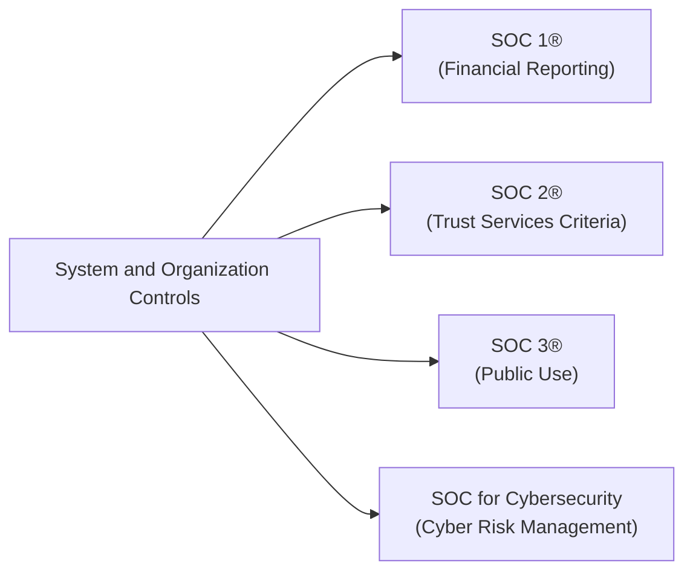
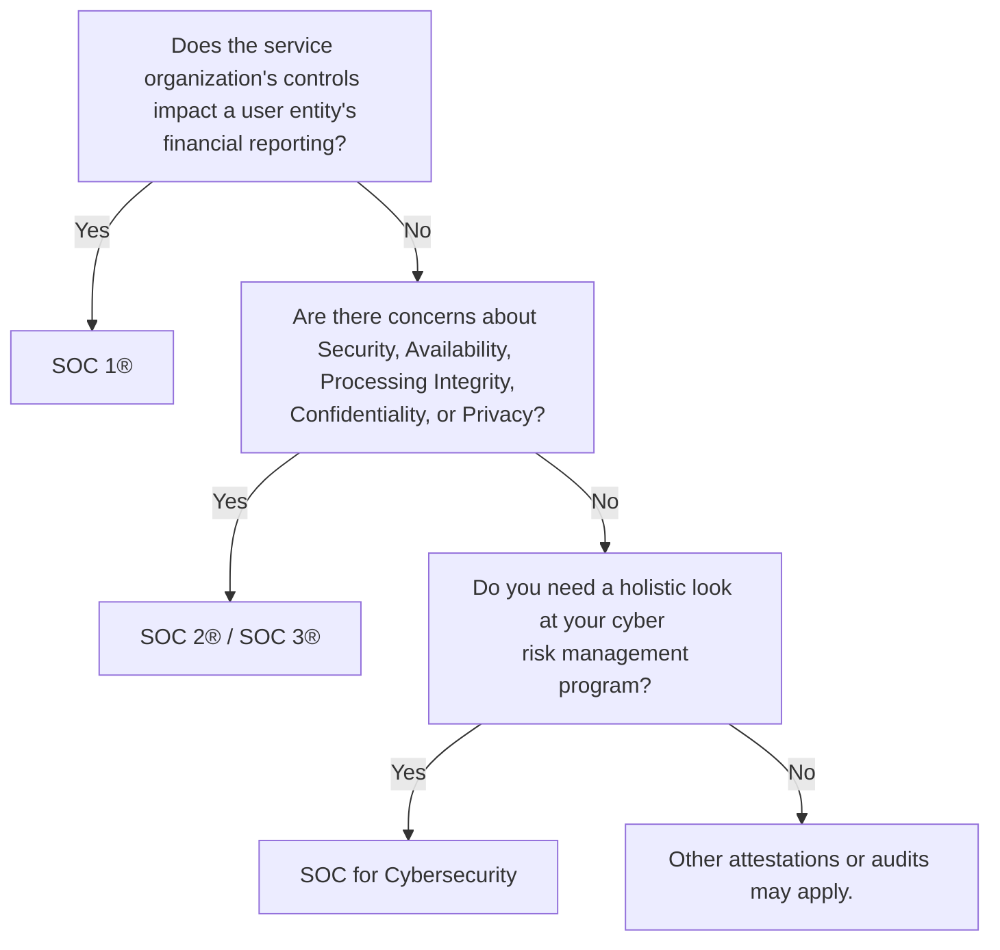

## 22.1 Purpose and Types of SOC Reports (SOC 1®, SOC 2®, SOC 3®, SOC for Cybersecurity)

Service organizations frequently host critical processes, store sensitive data, and provide essential functions for user entities across various industries. To address stakeholder concerns about the controls in place at these service organizations, the American Institute of Certified Public Accountants (AICPA) has developed frameworks and guidelines under the System and Organization Controls (SOC) suite of engagements. These SOC reports help provide assurance over different aspects of internal controls, ranging from financial reporting to cybersecurity risk management.

This section explores the purpose and scope of each type of SOC report—SOC 1®, SOC 2®, SOC 3®, and SOC for Cybersecurity. It also discusses the key distinctions among them, including their intended audience, deliverables, and typical use cases. Subsequent chapters will delve deeper into the specifics of SOC engagements (see Chapter 23 for SOC 1® and Chapter 24 for SOC 2®), while Chapter 27 expands on SOC for Cybersecurity.

------------------

### Understanding the Role of SOC Reports

System and Organization Controls (SOC) reports serve as independent attestations or assurance mechanisms guided by AICPA standards. A CPA performs these engagements to evaluate how well a service organization designs, implements, and enforces controls that meet specified criteria (e.g., financial, security, confidentiality) or reflect industry best practices.

Stakeholders (e.g., client management, auditors of user entities, and regulators) rely on these SOC reports to:

• Gain confidence that the service organization’s controls are operating effectively.  
• Reduce the burden of multiple audits by different stakeholder groups.  
• Provide transparency into the services that can impact user entities’ financial statements, compliance, or security posture.  
• Address specialized needs such as cybersecurity risk management and privacy.

------------------

### Overview of Key SOC Report Variants

SOC 1®, SOC 2®, SOC 3®, and SOC for Cybersecurity each target different needs. Below is a high-level Mermaid diagram illustrating these four report types under the broad umbrella of System and Organization Controls.

Each type of report has a distinct purpose, scope, and relevance, which we will examine more closely.

------------------

### SOC 1® — Focus on Internal Controls over Financial Reporting

#### Purpose and Scope

• **Primary Objective**: Provide assurance on the design and operational effectiveness of a service organization’s controls that are relevant to user entities’ financial reporting.  
• **Standards**: Performed under the AICPA’s Statements on Standards for Attestation Engagements (SSAE), specifically AT-C Section 320.  
• **Key Concern**: How do controls at the service organization impact the financial statements of the user entity?  

SOC 1® reports are typically requested by user auditors who must evaluate whether the service organization’s controls might affect the user entity’s financial statements. These reports can be critical when organizations outsource activities such as payroll processing, transaction processing, claims management, or other high-impact financial processes.

#### Intended Audience and Common Use Cases

• **Audience**: External financial statement auditors, CFOs, controllers, and finance teams at user entities.  
• **For Example**: A large retailer outsourcing credit card transaction processing might rely on a payment processor’s SOC 1® report to ensure transaction data reconciliations are accurate for the retailer’s financial statements.  

SOC 1® addresses internal control over financial reporting (ICFR). Many references in corporate governance frameworks (such as Sarbanes-Oxley in the U.S.) highlight the importance of robust internal controls that can be relied upon by external auditors.

#### Types of SOC 1® Reports

• **Type I**: Evaluates the design and implementation of controls as of a specific point in time.  
• **Type II**: Evaluates the design, implementation, and operating effectiveness of controls over a period (often 6–12 months).  

SOC 1® Type II reports are more extensive and generally considered standard because they provide information about how controls performed over time rather than at just one point.

------------------

### SOC 2® — Focus on Trust Services Criteria (TSC)

#### Purpose and Scope

• **Primary Objective**: Evaluate controls at a service organization related to one or more of the AICPA’s Trust Services Categories: Security, Availability, Processing Integrity, Confidentiality, and Privacy.  
• **Standards**: Conducted under AT-C Section 105 and 205, with additional guidance from the Trust Services Criteria framework.  
• **Key Concern**: Does the service organization have appropriate controls in place to secure data, maintain system availability, protect sensitive data, and ensure integrity when processing?

SOC 2® engagements have broader applicability than SOC 1® because they can address non-financial risks such as cybersecurity, privacy, and operational resilience. SOC 2® is demanded across many industries, especially cloud service providers, SaaS platforms, and data centers.

#### Intended Audience and Common Use Cases

• **Audience**: User organizations’ IT management, compliance teams, regulators, and sometimes clients or business partners.  
• **For Example**: A SaaS company offers a billing platform handling sensitive client data. Prospective customers want assurance that the platform has robust security (e.g., encrypting data in transit and at rest), availability (e.g., redundancy and robust backup strategies), processing integrity (e.g., accurate transaction processing), confidentiality, and privacy controls.  

#### Flexibility and Customization

• **Choice of TSC Categories**: Organizations may choose to be examined on only Security (required) or combine Security with any of the other categories that are relevant (Availability, Processing Integrity, Confidentiality, Privacy).  
• **Type of Report**: Similar to SOC 1®, a SOC 2® can be Type I (design of controls) or Type II (design and operating effectiveness over a period).  
• **User Considerations**: An organization might prioritize security and availability, whereas a healthcare provider may emphasize privacy and confidentiality. This customization makes SOC 2® versatile but requires careful scoping.  

#### Practical Example

A data processing and analytics company that stores large volumes of personal data might undergo a SOC 2® Type II covering Security, Confidentiality, and Privacy. Clients, especially in the health or finance sectors, expect such a report to ensure the safety of sensitive data.  

------------------

### SOC 3® — A Publicly Available Summary of SOC 2®

#### Purpose and Scope

• **Primary Objective**: Offer a summary-level, general-use report that covers the same Trust Services Criteria (TSC) as SOC 2®, but without detailed descriptions of tests and results.  
• **Standards**: Maintained under the same guidance as SOC 2®, though it serves a broader audience with less technical or confidential detail.  
• **Key Concern**: Provide a high-level overview of an organization’s TSC-related controls and the auditor’s opinion on their effectiveness without disclosing proprietary or sensitive testing data.  

SOC 3® is considered “short and sweet.” It omits the granular testing details and is therefore suitable for marketing or public-facing disclosure. Organizations that want to demonstrate their compliance or cybersecurity posture publicly—yet do not want to share confidential test results—often opt for a SOC 3®.

#### Intended Audience and Common Use Cases

• **Audience**: Potential customers, business partners, or the public at large.  
• **For Example**: A SaaS platform might publish its SOC 3® to reassure website visitors that an independent CPA has tested the environment for compliance with relevant Trust Services Criteria.

#### Key Distinctions from SOC 2®

• **Detail Level**: SOC 3® lacks the same detail as SOC 2®. Control descriptions, test samples, and results are absent, making it less useful for an in-depth assessment.  
• **Distribution**: May be made freely available on a website or marketing collateral.  
• **Opinion**: Provides a CPA’s report stating that controls meet the TSC requirements—useful for trust-building but not sufficient for detailed due diligence.

------------------

### SOC for Cybersecurity — Holistic Cyber Risk Management

#### Purpose and Scope

• **Primary Objective**: Provide assurance about the effectiveness of an entity’s cybersecurity risk management program.  
• **Scope Drivers**: This service goes beyond the scope of SOC 2® Security by focusing on the organization’s entire cybersecurity posture, risk assessment processes, and the controls deployed to mitigate identified cyber risks.  
• **Key Concern**: Does the organization have a well-defined cybersecurity risk management program that includes policies, procedures, and technologies designed to protect systems and sensitive data from cybersecurity threats?

This report is not restricted to service organizations alone. Entities of all types—whether they are service organizations to others or simply want to communicate the strength of their cybersecurity risk management—can utilize SOC for Cybersecurity.

#### Intended Audience and Common Use Cases

• **Audience**: Corporate boards, executive management, regulators, stakeholders seeking insight into an organization’s overall cyber defense strategy.  
• **For Example**: A manufacturing conglomerate implementing industrial IoT solutions with complex cyber risk vectors might obtain a SOC for Cybersecurity report to reassure investors, regulators, and strategic partners regarding its protective measures and incident response capabilities.

Where SOC 2® focuses on specific system controls aligned with TSC categories, SOC for Cybersecurity casts a broader net, examining the overarching cybersecurity risk management program. Components typically include threat identification, vulnerability management, incident response, and user awareness training, among others (see Chapter 16: Foundations of Cybersecurity and Chapter 27: SOC for Cybersecurity for deeper discussions).

#### Key Report Features

1. **Description of Cybersecurity Risk Management Program**  
   Management provides a narrative that details the company’s risk management objectives, threat landscape, governance, and critical controls.

2. **Management’s Assertions**  
   Management asserts that the program meets certain cybersecurity frameworks or best practices and is suitably designed and operating effectively.

3. **CPA’s Opinion**  
   The practitioner issues an opinion on the fairness of management’s description and whether the controls are effectively designed and implemented.

#### Comparing SOC 2® Security vs. SOC for Cybersecurity

While both may cover “security” as a concept, SOC for Cybersecurity is broader. SOC 2® Security focuses on controls within a defined system or set of systems. SOC for Cybersecurity expands to study the entire organization’s approach to risk management, including governance, threat intelligence, incident response, and more.  

------------------

### Choosing the Right SOC Report

Determining which SOC report meets a specific need requires analyzing the nature of the services, stakeholder concerns, legal or regulatory mandates, and the intended use of the report:

• **SOC 1®**  
  - Best suited when the user entity’s auditors need assurance about internal controls over financial reporting.  
  - Example: Payroll processors, loan servicing companies, claims processing as part of insurance operations.

• **SOC 2®**  
  - Optimal for demonstrating robust controls around data security, availability, processing integrity, confidentiality, and/or privacy.  
  - Mostly relevant to technology and cloud-based service providers, or any entity seeking to validate operational and security controls.

• **SOC 3®**  
  - Great for public distribution, offering a marketing-friendly overview.  
  - Less depth—but an easy way to quickly showcase an independently verified compliance posture.

• **SOC for Cybersecurity**  
  - Comprehensive cybersecurity risk management assurance across an entire organization.  
  - Ideal for organizations that need to evidence strong cybersecurity programs to executives, regulators, and the broader public.

------------------

### Real-World Scenarios and Case Studies

1. **Payroll Services Company (SOC 1®)**  
   A traditional payroll services provider handles millions of salary disbursements annually. Their clients’ external auditors need confidence that the payroll data reflected in the clients’ financial statements is accurate and complete. A SOC 1® Type II report is commissioned, examining how access controls, batch processing, and reconciliation processes are managed and tested.

2. **Cloud Storage Provider (SOC 2®)**  
   A business offering cloud-based data storage and archiving obtains a SOC 2® Type II report covering Security, Availability, and Confidentiality. Clients in regulated industries, such as healthcare or finance, demand strong encryption, backup strategies, and restricted logical access. The SOC 2® opinion, with details of testing, addresses these client queries comprehensively.

3. **Global E-Commerce Platform (SOC 3®)**  
   An e-commerce giant invests in obtaining a SOC 2® Type II for internal stakeholder reviews but also publishes a SOC 3® to assure the general public that it meets the high-level trust criteria. The SOC 3® is placed on their official website, accessible to any shopper or business partner who wants reassurance without needing the granular details from the SOC 2® test procedures.

4. **Manufacturing Company with Emerging IoT Threats (SOC for Cybersecurity)**  
   A manufacturing enterprise that has digitized its supply chain and uses sensor-laden devices (IoT) to track real-time production obtains a SOC for Cybersecurity report. The reportage covers how corporate governance is aligned with cybersecurity, how systems are monitored for threats, and what incident management process is in place. C-suite executives and the board use the report to communicate the company’s maturity and defense capabilities to regulators and major investors.

------------------

### Best Practices and Pitfalls to Avoid

• **Clearly Define Scope**  
  - One of the most critical steps is to delineate the boundaries of the system or processes under examination.  
  - Pitfall: Overly broad or vague scope leads to incomplete testing or confusion among stakeholders.

• **Engage Early with Stakeholders**  
  - Identify who will rely on the report—user auditors, regulators, clients, or your own management?  
  - Pitfall: Misalignment between the report’s intended purpose and the actual audience’s needs.

• **Maintain Ongoing Readiness**  
  - SOC engagements often require a “clean” operating period (6–12 months). Regularly track incidents, changes, and control effectiveness.  
  - Pitfall: A disorganized approach to evidence collection can delay the final report or reveal unaddressed exceptions too late.

• **Understand Type I vs. Type II**  
  - Type I only provides a point-in-time assessment of control design and implementation, while Type II includes operating effectiveness.  
  - Pitfall: Believing a Type I release is sufficient for user auditors who usually demand proof of operation over a period.

• **Consider Complementary User Entity Controls (CUECs)**  
  - For many controls to function, user entities must configure or operate them correctly (e.g., a client must create strong password policies).  
  - Pitfall: Neglecting to communicate these responsibilities can lead to misunderstandings about which party is accountable for which aspect of security or financial outcomes.

• **Leverage Additional Frameworks**  
  - Some organizations pair SOC reporting with industry-specific frameworks (e.g., ISO 27001, PCI DSS) for broader compliance coverage.  
  - Pitfall: Attempting to stack too many frameworks without adequate resources can strain internal teams and generate confusion.

------------------

### Practical Diagram: Selecting a SOC Report

Below is a simplified decision-flow diagram providing a broad illustration of when an organization might opt for each type of SOC report:

------------------

### Final Thoughts

SOC reports have become a near-ubiquitous requirement for service providers handling critical processes or data. They not only demonstrate accountability but also streamline the audit process for user entities and regulators. Understanding which SOC report is appropriate under what circumstances ensures that stakeholders get relevant and reliable information to make informed decisions about risk, governance, and compliance.

In summary, SOC 1® highlights the financial reporting aspect of internal controls, SOC 2® focuses on trust services criteria, SOC 3® is a high-level promotional version of SOC 2®, while SOC for Cybersecurity covers an organization’s broader cyber risk management strategies. By thoughtfully planning and executing SOC engagements, organizations can present validated, independent assurance regarding their controls to a wide variety of stakeholders, thereby strengthening trust and competitive positioning.

------------------

## Test Your Understanding of SOC 1®, SOC 2®, SOC 3®, and SOC for Cybersecurity



### Which SOC report is specifically designed to address internal controls over financial reporting?

- [x] SOC 1®
- [ ] SOC 2®
- [ ] SOC 3®
- [ ] SOC for Cybersecurity

> **Explanation:** SOC 1® focuses on controls relevant to user entities’ financial statements. It’s commonly used in scenarios where organizations outsource key financial processes.

### What types of controls do SOC 2® reports address?

- [ ] Financial controls only
- [ ] Controls for public distribution
- [x] Trust Services Criteria (Security, Availability, Processing Integrity, Confidentiality, Privacy)
- [ ] Entire organizational cybersecurity risk management

> **Explanation:** SOC 2® reports address controls aligned to the AICPA’s Trust Services Criteria, which includes Security, Availability, Processing Integrity, Confidentiality, and Privacy.

### Which statement best characterizes a SOC 3® report?

- [x] It is a high-level summary of a SOC 2® report intended for general (public) use.
- [ ] It is only relevant to financial statement auditors.
- [ ] It covers a comprehensive cybersecurity risk management program.
- [ ] It is only available for internal use within the service organization.

> **Explanation:** SOC 3® offers a shorter, simplified version of a SOC 2® that organizations can freely share with a broader audience, without providing detailed test results.

### In which scenario would a user entity most likely request a SOC 1® Type II report?

- [x] When a service organization’s system can materially affect the user entity’s financial statements.
- [ ] When a user entity only needs a high-level overview of security controls. 
- [ ] When the service organization handles no financial data but stores personal data.
- [ ] When the user entity wants a personal branding statement.

> **Explanation:** SOC 1® Type II is relevant if the controls at the service organization can materially impact the user entity’s financial statements, providing assurance over design and operating effectiveness over time.

### Which SOC engagement is most appropriate for demonstrating a service organization’s overarching security posture to both internal and external stakeholders?

- [x] SOC 2®
- [ ] SOC 1®
- [x] SOC 3®
- [ ] SOC for Cybersecurity

> **Explanation:** A SOC 2® addresses security posture in detail, while SOC 3® provides a summarized version for external audiences. Both can be relevant simultaneously, depending on the depth of information needed.

### What is the primary difference between SOC for Cybersecurity and SOC 2® Security?

- [x] SOC for Cybersecurity addresses the entire cybersecurity risk management program; SOC 2® Security focuses on system controls aligned to security.
- [ ] They are identical in scope and criteria.
- [ ] SOC 2® only assesses privacy, while SOC for Cybersecurity covers financial reporting.
- [ ] SOC 2® is performed under different professional standards compared to SOC for Cybersecurity.

> **Explanation:** SOC for Cybersecurity broadly encompasses an organization’s holistic cyber risk management approach, while SOC 2® Security is narrower, targeting security controls for a defined system.

### Why might an organization opt for both SOC 2® and SOC 3® reports?

- [x] SOC 2® provides detailed test results for internal stakeholders; SOC 3® offers a general-use summary suitable for public distribution.
- [ ] SOC 3® is always required by regulators.
- [x] SOC 3® is needed for detailed third-party audits.
- [ ] SOC 2® is not recognized by external auditors.

> **Explanation:** An organization might use a SOC 2® for in-depth stakeholder analysis and a SOC 3® for broader, public-facing assurance without revealing sensitive details.

### What is the main focus of SOC 1® relative to SOC 2®?

- [x] SOC 1® focuses on financial reporting controls, while SOC 2® focuses on operational and IT-related controls.
- [ ] SOC 1® and SOC 2® are interchangeable, focusing mostly on IT security controls.
- [ ] SOC 2® is more relevant to financial statement audits, while SOC 1® deals solely with privacy.
- [ ] SOC 1® is used only by the general public, while SOC 2® is for external auditors.

> **Explanation:** SOC 1® deals specifically with controls impacting user entities’ financial statements. SOC 2® addresses broader systems and processes tied to the Trust Services Criteria.

### Which factor is most critical for determining whether an organization should undergo a SOC 1® or SOC 2® engagement?

- [x] Whether the outsourced service has a direct impact on user entities’ financial statements or not.
- [ ] Whether the organization is publicly traded.
- [ ] The length of time the organization has been in business.
- [ ] The preference of the user entity’s shareholders.

> **Explanation:** The main deciding factor is whether financial statement auditors require assurance on controls affecting financial reporting (SOC 1®) or if the focus is on trust services criteria (SOC 2®).

### An organization wishes to demonstrate its enterprise-wide cyber risk management capabilities across all departments, including governance, threat intelligence, and incident response. Which type of SOC engagement is most suitable?

- [x] True
- [ ] False

> **Explanation:** SOC for Cybersecurity (True) thoroughly covers an organization’s cyber risk management framework, not just the controls in a specific system like SOC 2®.



------------------

## For Additional Practice and Deeper Preparation

### [Information Systems and Controls (ISC)](https://www.udemy.com/course/isc-cpa-mock-exams/?referralCode=E1217303222935C5E464)  

**Information Systems and Controls (ISC) CPA Mocks:** 6 Full (1,500 Qs), Harder Than Real! In-Depth & Clear. Crush With Confidence!

- Tackle full-length mock exams designed to mirror real ISC questions.  
- Refine your exam-day strategies with detailed, step-by-step solutions for every scenario.  
- Explore in-depth rationales that reinforce higher-level concepts, giving you an edge on test day.  
- Boost confidence and minimize anxiety by mastering every corner of the ISC blueprint.  
- Perfect for those seeking exceptionally hard mocks and real-world readiness.  

_Disclaimer: This course is not endorsed by or affiliated with the AICPA, NASBA, or any official CPA Examination authority. All content is for educational and preparatory purposes only._
