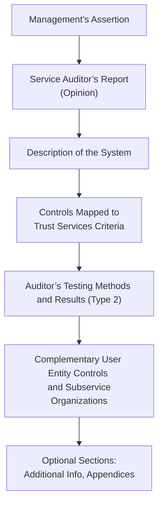

## 22.2 Form and Content of SOC Reports

Service Organization Control (SOC) reports are designed to provide assurance to stakeholders—both internal and external to the organization—that a service organization’s controls are suitably designed and operating effectively (in a Type 2 engagement) over a specified period. Whether you are dealing with SOC 1®, SOC 2®, or other specialized SOC engagements, these reports have a consistent structure reflecting two critical components: (1) the service organization’s description of its system and (2) the service auditor’s opinion on the effectiveness of the controls. 

This section focuses on the major sections of a SOC report. The form and content generally revolve around:  
• Management’s Assertion  
• Service Auditor’s Report (Opinion)  
• Description of the System  
• Applicable Control Objectives and/or Trust Services Criteria  
• Tests of Controls and Results  
• Other Relevant Information (complementary user entity controls, subservice organizations, etc.)  

Understanding the layout and essential information within each of these sections equips CPAs, auditors, and other assurance professionals to analyze SOC reports effectively. Below, we will dive into each component in detail, discuss typical forms of representation, cite any variations you might see in practice (e.g., SOC 1® vs. SOC 2®), and offer practical tips for interpreting the information.

--------------------------------------------------------------------------------
### The Role of SOC Reports in Assurance Engagements

Before dissecting the form and content, it is essential to understand the underlying purpose of SOC engagements briefly. As highlighted in Section 22.1 of this guide, SOC reports respond to user organization and stakeholder demands for transparency in critical service providers’ internal controls. While SOC 1® deals with controls relevant to user entities’ financial statements, SOC 2® focuses on the Trust Services Criteria (Security, Availability, Processing Integrity, Confidentiality, and Privacy), and SOC 3® provides a shortened, general-use version of the SOC 2® results for broad distribution.

Each report is intended to meet a different degree of assurance, distribution, and reliance needs. Despite slight differences in objectives, the structural elements covered in this chapter remain largely consistent across all types of SOC reports.

--------------------------------------------------------------------------------
### 1. Management’s Assertion

Management’s assertion is a statement by the service organization’s management that accepts responsibility for describing the system and providing an accurate account of whether controls are suitably designed (and, for a Type 2 engagement, are operating effectively). Key points include:

• **Responsibility:** Management is responsible for preparing and presenting the description of the system. It asserts that the description is a fair representation of how processes and controls operate.  
• **Criteria Referenced:** The assertion typically cites specific criteria—for example, SOC 1® may reference the AICPA’s description criteria and relevant control objectives. SOC 2® revolves around the AICPA’s description criteria for Trust Services Principles and Criteria.  
• **Timeframe:** For Type 1 reports, the assertion covers the fairness of the description and design of controls at a point in time; for Type 2 reports, it addresses design and operating effectiveness over a specified review period.  
• **Accuracy, Completeness, and Suitability:** Management claims that the controls described in the report are accurately and comprehensively disclosed and aligned with the engagement’s scope (financial reporting controls for SOC 1®, Trust Services Criteria for SOC 2®, etc.).  

When reading management’s assertion, consider the following:

• Does it appropriately state responsibility for both the system description and controls?  
• Does it reference the correct periods and criteria for the type of SOC report issued?  
• Are there any unique limitations, disclaimers, or high-level caveats mentioned (e.g., certain components out of scope, reliance on subservice organizations, etc.)?

--------------------------------------------------------------------------------
### 2. Service Auditor’s Report (Opinion)

The service auditor’s opinion is one of the most critical sections of a SOC report. In essence, the auditor provides a conclusion on whether:

• The description of the system **fairly presents** the service organization’s system.  
• Controls are **suitably designed** to achieve the control objectives stated in the description (or meet the Trust Services Criteria, in the context of SOC 2®).  
• For Type 2 engagements, the controls **operated effectively** throughout the specified review period.

The form of opinion typically follows a standardized structure:

• **Title and Addressee:** The report is usually titled “Independent Service Auditor’s Report” and addressed to management of the service organization.  
• **Scope and Purpose:** Describes the nature of the engagement, referencing the professional standards applied (e.g., AICPA SSAE No. 21) and clarifying that the engagement covers either design effectiveness only (Type 1) or both design and operating effectiveness (Type 2).  
• **Auditor’s Responsibility:** Highlights that the auditor obtains reasonable assurance about whether the system is fairly presented, controls are suitably designed, and—if a Type 2—operating effectively.  
• **Basis for Opinion:** Outlines the evidence gathered, testing approach, and conformance with relevant standards (SSAE 18 in the United States).  
• **Opinion Paragraph:** Conveys the auditor’s conclusion using phrases such as:  
  - “In our opinion, in all material respects…”  
  - “The description is fairly stated based on the description criteria…”  
  - “The controls related to the control objectives stated in management’s description were suitably designed …” (Type 1)  
  - “The controls were operating effectively …” (Type 2)  
• **Other Information or Emphasis of Matter (if applicable):** May address subservice organizations excluded from the scope, new systems or processes introduced shortly before or during the audit period, and other disclaimers.  

When reading the auditor’s opinion, it is crucial to note if it is a modified opinion (qualified, adverse, or disclaimer), which indicates deficiencies or barriers that inhibited the auditor’s ability to provide a standard unqualified opinion. Users should pay special attention to these modifications as they may affect reliance on the service organization’s controls.

--------------------------------------------------------------------------------
### 3. Description of the System

The system description is the heart of the SOC report. It explains how the service organization’s processes and technology environment are structured to meet objectives. While specific requirements for the description vary between SOC 1® and SOC 2®, as well as the nature of different industries, common elements generally include:

• **Services Provided:** High-level overview of services offered, including a discussion of the flow of transactions.  
• **Components of the System:**  
  - Infrastructure (e.g., hardware, data centers, network architecture).  
  - Software (applications supporting the services, including operating systems, ERP modules, or custom solutions).  
  - People (key roles, responsibilities, and how individuals interact with processes and controls).  
  - Procedures (the day-to-day procedures carried out to fulfill the organization’s objectives).  
  - Data (the types of data processed, stored, transmitted, and relevant data flows).  
• **Control Objectives or Trust Services Criteria Addressed:** A mapping of the system’s controls to the relevant criteria (financial reporting control objectives in SOC 1® or Trust Services Criteria in SOC 2®).  
• **Boundaries of the System:** Any subservice organizations, outsourced activities, or third-party vendors, specifying if they are included directly or included under the “carve-out” or “inclusive” method. For subservice organizations under a carve-out approach, the service organization is not taking direct responsibility for certain controls, and they are excluded from the service auditor’s testing.  
• **Relevant Aspects of Control Environment:** Highlights governance, risk assessment, control activities, information and communication, and monitoring activities as relevant to IT or organizational controls.  

Readers should review the system description carefully to:

• Determine if the described processes align with their expectations.  
• Understand the control environment’s scope, including subservice relationships.  
• Gain insight into potential risks and how they are mitigated within the system.  

--------------------------------------------------------------------------------
### 4. Control Objectives and Related Controls (SOC 1®), or Trust Services Criteria (SOC 2®)

A critical portion of the SOC report is the mapping of control objectives (SOC 1®) or Trust Services Criteria (SOC 2®) to the underlying controls. Each control objective or criterion is associated with one or more key controls aimed at achieving or supporting that objective. For example:

• **SOC 1® Control Objective Example:** “Controls provide reasonable assurance that only authorized changes are made to the system and these changes are appropriately tested and approved prior to implementation.”  
• **SOC 2® Criterion (Security)—Logical Access Controls:** The entity has implemented logical access security measures to protect information assets against unauthorized access, consistent with the Security principle.

In turn, the report will feature a list or table of each control objective (or TSC criterion), a description of the controls in place, and (in a Type 2 engagement) the service auditor’s tests and results.

--------------------------------------------------------------------------------
### 5. Tests of Controls and Results (Type 2 Only)

For SOC 1® or SOC 2® Type 2 engagements, the service auditor assesses whether controls operate effectively over the review period. Hence, the SOC report details:

• **Testing Procedures:** The nature of tests, sampling methods, and coverage period (e.g., “Inquiry, observation, inspection of documentation, and re-performance”).  
• **Control Activities Examined:** Each control is listed along with an explanation of how it was tested—for example, the auditor might inspect system access logs, observe a backup process, or review change management tickets.  
• **Results:** For each test, the auditor discusses whether the control “operated as described” or notes exceptions (i.e., deviations from expected performance). Where relevant, the auditor may provide the severity of findings (e.g., significant deficiency, material weakness) or remedial actions taken by the organization.

The “Tests of Controls” section is extremely important for users of Type 2 reports seeking assurance about the ongoing reliability of the organization’s control environment.

--------------------------------------------------------------------------------
### 6. Other Relevant Information: Complementary User Entity Controls and Subservice Organizations

Beyond the core sections, SOC reports often address user entity responsibilities and subservice organizations:

• **Complementary User Entity Controls (CUECs):** Many controls within the service organization’s environment depend on the user entity’s controls to operate effectively. The report may list recommended or required controls for the user entity to implement. For instance, if the service organization enforces strong password rules only after user entity provisioning is completed, then the user entity must ensure users are onboarded properly and meet certain security requirements.  
• **Subservice Organizations:** Organizations that manage certain functions or processes for the service organization, such as a data center provider. The “inclusive” method incorporates subservice organizations’ controls in the scope of the SOC engagement, while the “carve-out” method excludes them from testing and places the responsibility on the user organization to evaluate those third parties separately.

Understanding these dependencies is crucial because it informs user entities about additional controls they must operate or validate to have a complete control framework.

--------------------------------------------------------------------------------
### 7. Presentation of the Report

SOC reports typically include:

• **Table of Contents and Overview:** Summaries that help readers locate specific details quickly.  
• **Sections or Appendices for Additional Context:** Sometimes, organizations add references to corporate policies, standards, or strategic objectives.  
• **User Control Considerations:** A summarizing statement advising how a user entity should interpret and use the report. Usually, it reminds the user that certain controls must be in place at their own organization to fully mitigate identified risks.  
• **Auditor’s Signature and Report Date:** Signals the official completion of the engagement and the timeframe covered.  

Although the SOC 1® and SOC 2® reports have distinct focuses, both follow a common flow: from management’s assertion, through the auditor’s opinion, to a comprehensive narrative of the system description, control objectives or TSC, and the results of detailed testing.

--------------------------------------------------------------------------------
### Practical Examples and Real-World Scenarios

1. **Payroll Outsourcing Provider (SOC 1® Context):** A large corporation uses a third-party payroll service. The payroll service engages a practitioner to prepare a SOC 1® Type 2 report. The system description might outline the processes for time-card collection, validations, payroll calculation, compliance with tax regulations, direct deposit, and reconciliation. Control objectives could include ensuring accurate tax withholdings and timely paycheck distribution. The auditor’s test results would show whether the payroll service’s internal controls consistently functioned as intended.  

2. **Cloud Hosting Provider (SOC 2® Context):** A SaaS company relies on a major cloud provider for data hosting. The cloud provider produces an annual SOC 2® Type 2 report covering Security, Availability, and Confidentiality. The system description might detail data center architecture, network segmentation, employee access controls, and incident response processes. The relevant Trust Services Criteria are mapped to the cloud provider’s controls—such as intrusion detection systems, backup protocols, and encryption. Auditors perform tests over the entire year to determine whether these security controls remained effective.  

In both cases, user entities utilize these SOC reports to strengthen their vendor risk management, comply with external regulations, and gain assurance about the reliability and integrity of outsourced processes.

--------------------------------------------------------------------------------
### Best Practices, Pitfalls, and Challenges

• **Best Practices:**  
  - Carefully clarify the **scope** of the system description before the engagement starts.  
  - Provide robust evidence for testing, including logs, documentation, and thorough cross-referencing to ensure all controls are addressed.  
  - Align with currently published description criteria from the AICPA or other advisory bodies to maintain an authoritative reference.  

• **Common Pitfalls:**  
  - **Incomplete System Description:** Omitting certain aspects of the environment (e.g., major subcontractors or technologies) can undermine user entities’ reliance on the report.  
  - **Confusion Over Subservice Orgs:** Failing to clearly designate carve-out vs. inclusive methods and the resulting responsibilities leaves user entities in the dark about coverage.  
  - **Insufficient Evidence:** If management cannot provide logs, policies, or other evidence, the auditor may issue a qualified opinion or disclaim coverage for that control.  

• **Potential Challenges:**  
  - **Rapidly Changing Environments:** In dynamic IT environments, especially those leveraging continuous integration/continuous deployment (CI/CD), maintaining consistency and completeness of the system description can be difficult.  
  - **Global Data Privacy Regulations (e.g., GDPR):** If the system handles data from individuals in multiple jurisdictions, the description and controls may need to incorporate compliance with local regulations, adding complexity to the report.  
  - **Multiple Stakeholders with Divergent Needs:** Different user entities may have different concerns. A carefully worded system description helps balance the varied requirements.

--------------------------------------------------------------------------------
### Diagram: Typical Layout of a SOC 2® Report

Below is a Mermaid diagram illustrating the high-level structure of a SOC 2® report. Note that many of these sections are also applicable to a SOC 1® engagement, though with different underlying control objectives.

In practice, each of these boxes represents a section of the final report that the user entity can examine.

--------------------------------------------------------------------------------
### Table: Summary of Key SOC 1® vs. SOC 2® Sections

Below is a simplified table to emphasize shared elements across both SOC 1® and SOC 2®:

| Section or Topic                  | SOC 1® Type 1 or 2          | SOC 2® Type 1 or 2                        |
|-----------------------------------|-----------------------------|--------------------------------------------|
| Management’s Assertion            | Required                    | Required                                   |
| Service Auditor’s Report (Opinion)| Addresses internal controls over financial reporting | Addresses controls mapped to TSC (e.g., Security, Availability) |
| System Description                | Focus on financial transaction flows | Focus on overarching system and TSC coverage  |
| Control Objectives / TSC          | Financial objectives        | Security, Availability, etc.               |
| Tests of Controls (Type 2)        | Operating effectiveness over review period | Operating effectiveness over review period   |
| Complementary User Entity Controls| Typically present           | Typically present                          |

--------------------------------------------------------------------------------
### References and Further Reading

• **AICPA SOC for Service Organizations:** Official AICPA site for SOC reports, guidance, and additional resources.  
• **SSAE No. 21 (Statements on Standards for Attestation Engagements):** Governs how auditors conduct attestation engagements.  
• **Trust Services Criteria (TSC):** Updated framework for SOC 2® engagements, issued by the AICPA.  
• **Relevant Sections of this Guide:**  
  - Chapter 22.1 for overview and types of SOC Reports  
  - Chapter 23.1 for SOC 1® objectives  
  - Chapter 24.1 for SOC 2® Trust Services Criteria  

--------------------------------------------------------------------------------
## Quiz: Mastering the Form and Content of SOC Reports



### Which section of the SOC report contains management's statement of responsibility and the fair presentation of the system?
- [ ] Service Auditor’s Report  
- [x] Management’s Assertion  
- [ ] Description of the System  
- [ ] Control Objectives / Trust Services Criteria  

> **Explanation:** Management’s Assertion is where the service organization takes responsibility for the accurate description of the system and affirms whether controls are suitably designed (and operating effectively for Type 2).

### Which of the following is unique to a SOC 2® Type 2 report compared to a SOC 2® Type 1?
- [ ] Description of the system’s components  
- [ ] Trust Services Criteria mapping  
- [x] Operating effectiveness testing over a specific review period  
- [ ] Management’s assertion  

> **Explanation:** A SOC 2® Type 2 report includes both design and operating effectiveness assessment over a set timeframe. A Type 1 report only addresses design at a point in time.

### In a SOC report, where would you most likely find details about subservice organizations and whether they are included via the inclusive or carve-out method?
- [ ] Service Auditor’s Opinion  
- [ ] Tests of Controls Results  
- [x] Description of the System  
- [ ] Management’s Assertion  

> **Explanation:** The service organization's system description typically includes information on subservice organizations, clarifying whether they are fully included in the scope or carved out.

### Which of the following is the best description of the Service Auditor’s Opinion section within a SOC report?
- [ ] It presents the results of each individual control test.  
- [x] It states whether the controls are fairly presented, suitably designed, and (for Type 2) operating effectively.  
- [ ] It is a list of complementary user entity controls.  
- [ ] It outlines the technology infrastructure of the service organization.  

> **Explanation:** The Service Auditor’s Opinion provides the auditor’s official conclusion about the fairness of the system description and controls design (Type 1), and operating effectiveness over time (Type 2).

### Which best characterizes a material exception in the Tests of Controls section?
- [x] A deviation indicating a control did not operate as intended and could affect user assurance.  
- [ ] A minor inconsistency that does not impact the overall opinion.  
- [x] A repeated nonconformity that may require management remediation.  
- [ ] No deviation is found.  

> **Explanation:** Material exceptions indicate significant issues in control operation. They may reduce reliance on the controls and require mitigation efforts.

### How do Complementary User Entity Controls (CUECs) impact the user organization’s control environment?
- [x] They outline controls that the user organization must implement to fully mitigate risks.  
- [ ] They automatically ensure compliance no matter what environment the user has in place.  
- [ ] They are optional recommendations without any consequences.  
- [ ] They only apply to subservice organizations.  

> **Explanation:** CUECs are controls that must be present within the user entity to achieve intended objectives; if the user organization fails to implement them, security or processing risks may remain unaddressed.

### Which Soc 1® component focuses specifically on controls over financial transaction flows?
- [x] Control Objectives  
- [ ] Trust Services Criteria  
- [x] Complementary User Entity Controls  
- [ ] Testing and Results  

> **Explanation:** SOC 1® is primarily concerned with financial reporting control objectives. While the user entity may also need to use additional complementary controls, the main focus is ensuring the integrity of financial data processing.

### In a SOC 2® report, the System Description typically includes information about:
- [x] Infrastructure, software, people, procedures, and data  
- [ ] Only the physical components but not software or procedures  
- [ ] Only the hardware and network architecture  
- [ ] A strictly financial process narrative  

> **Explanation:** The description covers the holistic system environment, including the technical and operational aspects (infrastructure, software, people, procedures, and data).

### What is one benefit of an “Inclusive Method” for subservice organizations?
- [x] The service auditor’s opinion encompasses controls at the subservice organization’s environment.  
- [ ] The subservice organization is automatically assumed to have perfect controls.  
- [ ] No additional testing is needed by the user organization.  
- [ ] It eliminates the need for a management assertion.  

> **Explanation:** In an inclusive method, the subservice organization's controls are tested and included in the service auditor’s opinion, providing broader assurance coverage.

### True or False: A SOC 2® report is primarily focused on controls relevant to user entities’ financial statements.
- [ ] True  
- [x] False  

> **Explanation:** SOC 2® reports assess controls against the Trust Services Criteria (Security, Availability, Processing Integrity, Confidentiality, and Privacy). SOC 1® reports address controls relevant to financial statement reporting.



--------------------------------------------------------------------------------
## For Additional Practice and Deeper Preparation

### [Information Systems and Controls (ISC)](https://www.udemy.com/course/isc-cpa-mock-exams/?referralCode=E1217303222935C5E464)

**Information Systems and Controls (ISC) CPA Mocks:** 6 Full (1,500 Qs), Harder Than Real! In-Depth & Clear. Crush With Confidence!

- Tackle full-length mock exams designed to mirror real ISC questions.  
- Refine your exam-day strategies with detailed, step-by-step solutions for every scenario.  
- Explore in-depth rationales that reinforce higher-level concepts, giving you an edge on test day.  
- Boost confidence and minimize anxiety by mastering every corner of the ISC blueprint.  
- Perfect for those seeking exceptionally hard mocks and real-world readiness.  

_Disclaimer: This course is not endorsed by or affiliated with the AICPA, NASBA, or any official CPA Examination authority. All content is for educational and preparatory purposes only._
