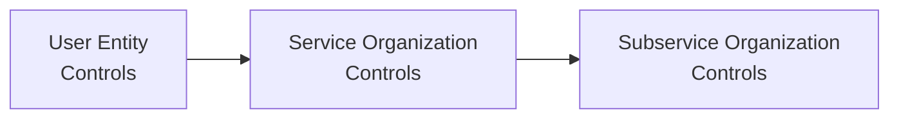

## 22.3 Comparing User Entity Controls and Subservice Organization Controls

In many Service Organization Control (SOC) engagements, one of the most crucial areas to comprehend is how controls are divided between users of the service (user entities), the primary service organization itself, and any subservice organizations engaged in delivering part of the overall service. These divisions of responsibilities and controls directly influence the scope of a SOC examination, the reliability of the control environment, and how users of the resulting SOC reports should interpret and apply the findings.

This chapter section offers a detailed examination of complementary user entity controls and subservice organization controls, shedding light on their purposes, differences, and interrelationships. We will explore real-world examples, discuss disclaimers in reporting, highlight the carve-out and inclusive approaches, and walk through best practices and potential pitfalls. By building a robust understanding of these control domains, CPAs and other stakeholders can effectively design, assess, and rely upon SOC reports.

--------------------------------------------------------------------------------

## Understanding User Entity Controls

User entity controls (often referred to as “complementary user entity controls” or CUECs) are the policies, procedures, and corresponding control activities that the client organization (i.e., the user entity) must implement for the service organization’s controls to operate effectively. A user entity’s in-house processes, resources, and oversight mechanisms typically support the controls at the service organization by:

• Ensuring the integrity of user-access management (e.g., providing accurate lists of authorized personnel).  
• Performing periodic reconciliations of data processed or hosted by the service organization.  
• Reviewing and responding to exception reports generated by the service provider’s systems.  
• Implementing adequate information security training for employees who interact with the service.  
• Retaining final responsibility for data that is handed over to the service organization.  

The term “complementary” underscores that, without these properly designed and implemented controls at the user entity level, the service organization’s controls alone may not meet control objectives or mitigate relevant risks. When a service organization issues a SOC report—whether it is a SOC 1®, SOC 2®, or another variant—this document commonly highlights a list of assumptions about user entity responsibilities. These assumptions effectively serve as prerequisites for the service’s internal controls to prove successful in minimizing risks or errors.

### Why User Entity Controls Matter

1. Shared Responsibility: In an outsourced arrangement, it is rarely the sole burden of the service organization to manage and mitigate all risks around the services provided. A portion of risks generally remains with the user entity.  
2. Transparency and Alignment: Knowing which controls are the user’s responsibility helps clarify roles and foster ongoing communication between the user entity and the service organization.  
3. Effective Mitigation: Many control objectives—particularly those around data accuracy, completeness, and consistency—depend on correct data inputs from the user entity and the user’s own internal review and approval processes.  

--------------------------------------------------------------------------------

## Understanding Subservice Organization Controls

A subservice organization is engaged by the primary service organization to fulfill part of the latter’s commitments to user entities. This might include a data center provider hosting the service organization’s servers, a cloud-based backup provider storing encrypted offsite data, or a payroll processing engine that the main service organization relies upon to process transactions. In each scenario, the subservice organization contributes its own controls that may be integral to achieving the overall control objectives.

### Real-World Example of a Subservice Organization

• A payroll outsourcing firm (the service organization) uses a specialized background-check provider (the subservice organization) to screen new employees being onboarded on behalf of user entities.  
• A software-as-a-service (SaaS) platform (the service organization) contracts a data center provider (the subservice organization) for physical security, environmental controls, and redundancy.  
• A healthcare claim processing service (the service organization) engages a third-party cloud hosting environment (the subservice organization) for near real-time scalability and system availability.

### Approaches to Reporting on Subservice Organizations

When preparing a SOC report, service organizations may handle subservice organizations using either:  
• The Carve-Out Method, or  
• The Inclusive Method  

#### Carve-Out Method
Under the carve-out method, the service organization’s SOC report excludes the design and operating effectiveness of the subservice organization’s controls from the scope of the examination. The service organization typically states assumptions about what those subservice organization controls are meant to accomplish, disclaiming direct responsibility for them. However, the service auditor still assesses whether the subservice organization’s activities could significantly impact control objectives and whether management at the service organization monitors subservice performance.

#### Inclusive Method
In the inclusive method, the subservice organization’s controls are included directly in the scope of the SOC examination. The service auditor evaluates these controls in conjunction with those of the service organization. The subservice organization’s control environment, testing procedures, and results are integrated into the final SOC report. This approach often demands a higher level of coordination among all parties and typically entails more comprehensive disclosures about how the subservice organization interacts with the service organization.

### Why Subservice Organization Controls Matter

• Extended Chain of Accountability: By engaging a subservice organization, the service organization is effectively extending its risk environment. It must ensure that the subservice organization’s controls remain robust and address relevant operational, compliance, or financial statement risks.  
• Potential Gaps and Overlaps: Without proper oversight of subservice organizations, there may be blind spots or duplicated efforts. Clear documentation and representation of who is responsible for which control activities help eliminate ineffective or overlooked controls.  
• Transparency for Users: Having insight into subservice organization controls (especially under an inclusive method) can significantly enhance a user entity’s trust and reduce due diligence burdens.  

--------------------------------------------------------------------------------

## Comparing User Entity Controls and Subservice Organization Controls

Even though both user entity controls and subservice organization controls lie outside the direct purview of the primary service organization’s day-to-day operations, their interplay is instrumental to the overall control environment’s success. The figure below provides a conceptual view of how these different control sets fit together within a typical SOC engagement.

In this diagram:

• A represents the user entity controls. These are often documented as “complementary user entity controls” in a SOC report.  
• B is the service organization’s own controls, under the direct scope of the SOC engagement.  
• C represents the subservice organization’s controls, which may or may not be included in the scope of the SOC report, depending on whether the carve-out or inclusive method is used.  

### Key Points of Comparison

• Ownership: User entity controls are owned and operated by the client organization (i.e., the user), while subservice organization controls are managed by external third parties engaged by the service organization.  
• Scope of SOC Examination: Whether subservice organization controls are fully evaluated in the SOC report depends on the chosen methodology (carve-out vs. inclusive). User entity controls are generally referenced but not tested by the service auditor, as these remain under the purview of the client’s own audit.  
• Risk Dependencies: If user entity controls fail, the effectiveness of the service organization’s controls on data accuracy or confidentiality may be compromised. If subservice organization controls fail, this can similarly undermine the service organization’s controls in fulfilling contract obligations or meeting internal control objectives.  

--------------------------------------------------------------------------------

## Complementary User Entity Controls (CUECs)

### Nature of CUECs
Complementary user entity controls are integral to achieving intended control objectives; if not properly designed or performed, the service organization’s overall control environment may prove ineffective. Examples of CUECs might include:

• Providing accurate and authorized data to the service organization.  
• Terminating access rights for employees who leave the user entity.  
• Reconciling user entity’s internal records with reports received from the service organization.  
• Engaging in a timely review of exceptions or flagged transactions.  

### Documentation in SOC Reports
Service organizations customarily include a section in their SOC reports detailing the relevant CUECs. These disclosures specify the responsibilities of the user entity so that prospective and existing clients understand the additional internal controls they must maintain.

### Practical Example
A healthcare claims processing company (service organization) states in its SOC 2® that user entities must implement robust verification and validation controls for the insurance claim data they submit. If the user entities’ staff fail to enter the correct patient or policy information, the processing system’s automated integrity checks can only do so much. In other words, if the raw data is wrong, accurate outputs will not be achievable, no matter how well the service organization’s system is designed.

--------------------------------------------------------------------------------

## Subservice Organization Controls

### Common Control Areas

1. **Physical Security and Environmental Controls**  
   Subservice organizations that house data centers typically maintain physical security (e.g., access badges, surveillance) and environmental systems (e.g., HVAC, fire suppression).  
2. **Network and Infrastructure Security**  
   Subservice providers offering cloud services or servers may be responsible for patch management, network monitoring, firewall configurations, and backup routines.  
3. **Specialized Processing**  
   Some subservice organizations handle niche processes such as identity verification, payment card processing, or claims adjudication. Partial or incomplete controls in these specialized areas could severely compromise the service organization’s final deliverables.  

### Carve-Out Versus Inclusive: A Closer Look

• **Carve-Out Method**  
  - Subservice organization’s control environment is briefly summarized but not thoroughly tested in the service organization’s SOC report.  
  - The service organization’s management typically discloses that certain downstream activities are performed by a subservice organization.  
  - The burden often lies on user entities to conduct additional due diligence on subservice organization controls if they deem it necessary.

• **Inclusive Method**  
  - Subservice organization’s controls are fully integrated into the description of the service organization’s system.  
  - The service auditor’s tests of controls extend to the subservice organization.  
  - Offers a single unified report but requires a higher degree of coordination and cooperation among all parties.

### Practical Example: Payroll Firm with Multiple Subservice Providers
A payroll outsourcing firm (acting as the service organization) uses two subservice organizations:  
• A call center to handle inquiries from user entities’ employees about benefits and payroll issues.  
• A third-party vendor to print and mail paychecks for employees who have not opted for direct deposit.  

If the carve-out method is used, these subservice controls are not tested; the SOC report merely states “XYZ call center and ABC printing vendor are subservice providers not included in this examination.” If the inclusive method is used, the description of the system includes how the call center’s scripts, staff training, quality assurance checks, and the printing vendor’s security, data integrity, and production controls are tested and form part of the overall SOC report.

--------------------------------------------------------------------------------

## Detailed Comparison: User Entity vs. Subservice Organization Controls

Below is a simplified comparison table to illustrate the distinctions:

| Aspect                             | User Entity Controls (CUECs)                                     | Subservice Organization Controls                                      |
|------------------------------------|-------------------------------------------------------------------|------------------------------------------------------------------------|
| **Ownership**                      | Owned and operated by the user entity                            | Owned and operated by the subservice organization                      |
| **Focus**                          | Ensuring accuracy, completeness, and appropriate use of service   | Delivering specific service components (e.g., data center ops, payroll)|
| **Scope in SOC Report**            | Referenced as complementary controls, typically not tested        | May be carved out or included (inclusive method)                        |
| **Responsibility**                 | User entity remains accountable for implementing these controls   | Subservice organization must maintain controls that meet service org’s standards|
| **Impact if Inadequate**           | Data or transaction errors, security breaches, or unauthorized access may go undetected or unaddressed | Service organization may fail to meet objectives, user’s data may be compromised |
| **Audit Testing**                  | Audited by the user entity’s auditor or included in user’s internal control environment reviews | Tested directly (if inclusive) or excluded (if carve-out) in the service org’s SOC examination |

--------------------------------------------------------------------------------

## Why the Distinction Matters for CPAs and Other Stakeholders

1. **Audit Planning and Scope**  
   CPAs working on SOC engagements or financial audits need to understand which controls have been tested as part of the SOC report versus which controls require additional evaluation.  
2. **Risk Assessment**  
   The strength of user entity controls can shift or reduce residual risks that the service organization might otherwise have to mitigate. Similarly, if the subservice organization is pivotal to critical operations, its control environment must be suitably robust.  
3. **Reliance vs. Responsibility**  
   Knowing who is responsible for which sets of controls clarifies lines of accountability. The user entity cannot simply outsource all risk to the service organization, especially if user entity controls are poorly designed or not performed at all.  
4. **Due Diligence**  
   For organizations subject to regulatory requirements—such as SOX, HIPAA, GDPR, and others—understanding the subservice organization’s role and evaluating its controls can be essential for compliance.  

--------------------------------------------------------------------------------

## Best Practices for Managing and Coordinating Controls

1. **Clear Documentation**  
   – Service organizations should clearly outline expected user entity controls in the SOC description to minimize ambiguity.  
   – Detailed agreements between the service organization and any subservice organizations should specify control obligations.  

2. **Ongoing Communication**  
   – Periodic check-ins can help user entities and service organizations verify that complementary controls are functioning.  
   – The service organization should monitor subservice organizations through regular performance reviews or compliance attestations.  

3. **Comprehensive Risk Analysis**  
   – Map all associated risks thoroughly. If a subservice organization is deemed critical, an inclusive SOC engagement may reduce uncertainty for user entities.  
   – Conduct robust internal risk assessments to determine the reliance on user entity controls and what testing might be required externally.  

4. **Verification and Assurance**  
   – User entities can request subservice organizations’ SOC reports directly or rely on the inclusive method in the service organization’s SOC report.  
   – Service organizations should perform vendor reviews of subservice organizations, akin to a supplier audit in a manufacturing context.  

5. **Contingency Planning**  
   – If subservice organizations fail to deliver, the service organization should have backups or alternative providers in place.  
   – User entities should have plans for partial or full insourcing of critical controls if the external arrangement breaks down.  

--------------------------------------------------------------------------------

## Common Pitfalls in Understanding User Entity and Subservice Organization Controls

1. **Overlooking Complementary Controls**  
   A frequent oversight is when user entities assume the service organization is entirely responsible for the outcome, leading to missed responsibilities (e.g., user authentication).  
2. **Insufficient Monitoring of Subservice Organizations**  
   Some service organizations fail to incorporate robust subservice oversight, leaving significant vulnerabilities in the environment.  
3. **Blind Reliance on a Carve-Out**  
   Assuming a subservice organization’s controls are automatically sufficient can be risky. Carve-out does not guarantee coverage.  
4. **Inadequate Contractual Clarity**  
   Vague contract language regarding roles and responsibilities can lead to confusion when incidents or discrepancies occur.  
5. **Excluding Critical System Components from SOC Scope**  
   Failing to include crucial subservice organizations in the SOC engagement under the inclusive method (where it might be warranted) can create a false sense of control assurance.  

--------------------------------------------------------------------------------

## Illustrative Case Study

Imagine a multinational retailer (user entity) that utilizes a third-party logistics provider (service organization) to manage its supply chain and delivery processes. The third-party logistics provider, in turn, outsources its warehouse security to a specialized security firm (subservice organization).

• User entity (the retailer) is responsible for verifying that shipment data sent to the third-party logistics provider is correct and up to date. This includes ensuring that addresses, product SKU numbers, and package dimensions are accurate.  
• Service organization (the logistics provider) processes the shipment data, coordinates carriers, and updates status information in real-time.  
• Subservice organization (the security firm) enforces access controls to the warehouse, ensures that only authorized individuals enter, and handles 24/7 surveillance.  

If the retailer does not maintain correct shipment data (failing to implement user entity controls) or if the security firm operates inefficiently (subservice organization controls), the entire supply chain process could break down—even if the logistics provider itself is functioning properly.

--------------------------------------------------------------------------------

## Conclusion

User entity controls and subservice organization controls are both essential building blocks in the broader mosaic of effective system and organization controls. They provide complementary layers of assurance and work together to mitigate risks, safeguard data, and advance organizational objectives. By distinguishing clearly between these two categories of controls and understanding the carve-out or inclusive approach, CPAs, auditors, and stakeholders can better interpret SOC reports, pinpoint risks, and fulfill regulatory obligations.

For readers preparing for the CPA exam or involved in IT audits, knowledge of these distinctions clarifies how an organization’s control environment is structured, tested, and reported upon. Likewise, practitioners who understand how to evaluate and communicate these control relationships will be well-equipped to advise clients or employers on managing outsourced operations in a manner that is both robust and transparent.

--------------------------------------------------------------------------------

## Quiz on User Entity Controls and Subservice Organizations



### Which statement best describes complementary user entity controls in a SOC report?

- [ ] Controls imposed by subservice organizations on the user entity. 
- [x] Controls that the user entity must implement for the service provider’s controls to be effective.
- [ ] Controls the service organization places on its own management for oversight.
- [ ] Controls requiring direct enforcement by the SOC auditor.

> **Explanation:** Complementary user entity controls (CUECs) are those that the user entity is responsible for operating effectively to ensure the service organization's controls achieve their objectives.

### In a carve-out method, what happens to the subservice organization’s controls?

- [ ] They are tested in detail as part of the service organization’s SOC report.
- [x] They are omitted (or carved out) from the scope but mentioned for transparency.
- [ ] They are replaced by user entity controls.
- [ ] They become fully the responsibility of the auditor to verify.

> **Explanation:** Under the carve-out method, the subservice organization’s controls are acknowledged but not included in the scope of testing for the SOC report.

### Which of the following is an example of a user entity’s complementary control?

- [x] Reconciling user entity’s internal records with the service provider’s reports.
- [ ] Reviewing the subservice organization’s HVAC configuration.
- [ ] Monitoring the data center’s firewall logs.
- [ ] Installing antivirus on the subservice organization’s servers.

> **Explanation:** By reconciling their internal records to the provider’s reports, the user entity ensures completeness and accuracy, which complements the service organization’s controls.

### Why might a service organization choose the inclusive method for a subservice organization in a SOC report?

- [ ] To avoid having to disclose the existence of any subservice.
- [ ] To prevent user entities from learning about the subservice organization.
- [x] To integrate the subservice organization’s controls into the SOC assessment, providing a unified perspective.
- [ ] To place full responsibility of testing on the user entity’s auditor.

> **Explanation:** The inclusive method merges subservice organization controls into the scope of the SOC examination, providing more transparency and a single comprehensive report.

### Which statement correctly characterizes user entity controls?

- [x] They are dependent on the user organization’s internal policies and procedures and are typically outside the service auditor’s scope of testing.
- [ ] They are designed solely by the service organization for user entities to adopt.
- [x] They must be effectively implemented by the user entity to support the service organization’s controls.
- [ ] They are legally enforceable at the subservice organization level.

> **Explanation:** User entity controls stem from the user’s own operations and must be effectively applied to complement the service organization’s system. They are not tested as part of the service organization’s SOC.

### Which method of reporting on subservice organizations positions the subservice organization’s controls fully within the SOC examination?

- [ ] Carve-Out Method
- [x] Inclusive Method
- [ ] Undisclosed Method
- [ ] Disclaimer Method

> **Explanation:** The inclusive method involves incorporating subservice organization controls in the service organization’s SOC report, making them subject to the auditor’s testing.

### What is the main risk if the subservice organization’s controls fail?

- [x] It can undermine the effectiveness of the service organization’s system.
- [ ] It ensures that user entity controls remain unaffected.
- [x] It has no financial statement implications.
- [ ] It eliminates the need for the user entity to implement CUECs.

> **Explanation:** A significant failure at the subservice organization can compromise the service organization’s ability to deliver services securely and accurately, thus harming the overall control objectives.

### Why is it important for user entities to review the complementary user entity controls listed in a SOC report?

- [x] To ensure they are aware of and implement any necessary controls at their organization’s level.
- [ ] To confirm the service organization’s independence.
- [ ] To reduce the cost of the SOC engagement.
- [ ] To bypass the subservice organization’s disclosures.

> **Explanation:** Complementary user entity controls are essential for the overall effectiveness of the system. User entities should understand and implement them for the service organization’s controls to be fully reliable.

### Under the carve-out method, what additional step might a user entity undertake?

- [x] Obtain and review the subservice organization’s own SOC report or other assurance.
- [ ] Rely solely on the user entity’s own controls.
- [ ] Assume no subservice organizations are involved.
- [ ] Require the service organization not to engage any subservice providers.

> **Explanation:** Since subservice organization controls are carved out, user entities often perform extra due diligence, such as requesting the subservice’s own SOC report for assurance.

### True or False: Under the inclusive method, the subservice organization’s controls are tested and documented separately from the service organization’s controls, without an integrated opinion.

- [x] True
- [ ] False

> **Explanation:** Even though included in the same SOC report, subservice organization controls might be documented separately for clarity. However, the tests and results are ultimately integrated into one overarching opinion on the entire system.



--------------------------------------------------------------------------------

## For Additional Practice and Deeper Preparation

### [Information Systems and Controls (ISC)](https://www.udemy.com/course/isc-cpa-mock-exams/?referralCode=E1217303222935C5E464)

**Information Systems and Controls (ISC) CPA Mocks:** 6 Full (1,500 Qs), Harder Than Real! In-Depth & Clear. Crush With Confidence!

- Tackle full-length mock exams designed to mirror real ISC questions.  
- Refine your exam-day strategies with detailed, step-by-step solutions for every scenario.  
- Explore in-depth rationales that reinforce higher-level concepts, giving you an edge on test day.  
- Boost confidence and minimize anxiety by mastering every corner of the ISC blueprint.  
- Perfect for those seeking exceptionally hard mocks and real-world readiness.

_Disclaimer: This course is not endorsed by or affiliated with the AICPA, NASBA, or any official CPA Examination authority. All content is for educational and preparatory purposes only._
