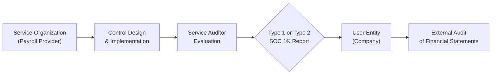

## 23.1 Objectives, Scope, and Applicability

Service Organization Control (SOC) 1® Examinations are designed to address the controls at a service organization that are likely to be relevant to user entities’ internal controls over financial reporting (ICFR). This chapter builds upon the introduction to SOC engagements (Chapter 22), focusing on the specific objectives, scope determinations, and industry applicability of SOC 1® reporting. Organizations that process financial transactions or impact significant accounts—such as payroll providers—are prime candidates for a SOC 1® engagement. By assessing controls that underpin financial statement accuracy, SOC 1® allows users of outsourced services to gain confidence that material misstatements, omissions, and fraud risks are appropriately mitigated.

Throughout this section, we will explore:  
• The primary objectives of SOC 1® engagements and how they align with financial reporting standards.  
• Components that determine the scope of evaluation, including subservice providers and user entity controls.  
• The applicability of SOC 1® engagements across diverse industries, with a focus on popular services like payroll.  
• Practical examples, diagrams, and best practices for achieving a balanced and effective SOC 1® examination.

Understanding what SOC 1® truly stands for, whether you are a seasoned CPA or new to IT audit, will help you design, oversee, and rely on SOC 1® reports with greater clarity.  

  
Understanding the Purpose of SOC 1® Engagements  
------------------------------------------------

SOC 1® engagements address the need for assurance over controls operating at a service organization that materially affect user entities’ financial statements. Quite often, this involves processes or systems that, if not effectively controlled, can lead to material misstatements in financial statement accounts. As widely referenced in financial, accounting, and regulatory contexts, the SOC 1® framework focuses on controls directly tied to transaction processing, reconciliation, and reporting.

Typical examples of service organizations that benefit from a SOC 1® report include:  
• Payroll processors, where accurate calculation of wages, taxes, and benefits is critical to financial statement accounts.  
• Loan servicing entities, which handle interest calculation or principal payments that flow into financial statements.  
• Claims processing centers in insurance, where timely and accurate claim disbursements can affect liability accounts.  
• Third-party administrators for pension or retirement plans, ensuring contributions and distributions are correctly recorded.  

When user entities rely on these outsourced activities, a deficiency in the service organization’s controls could create a downstream impact on financial statement reliability. This is precisely where a SOC 1® report comes into play—it helps user entities and their auditors determine whether they can rely on those controls.

  
Aligning With Financial Reporting Standards  
-------------------------------------------

SOC 1® reports exist within a broader context of U.S. Generally Accepted Accounting Principles (GAAP), International Financial Reporting Standards (IFRS), and other regulatory frameworks. In Chapter 3 of this guide, we introduced fundamental governance and regulatory environments (e.g., COSO, COBIT, PCI DSS). While frameworks like COBIT address IT governance broadly, SOC 1® zeroes in on controls that:

1. Contribute to the completeness, accuracy, and validity of financial transaction processing.  
2. Support fair presentation of account balances or disclosures in user entities’ financial reports.  
3. Provide reasonable assurance that errors or fraud in financial information will be prevented or detected promptly.

SOC 1® also aligns with Statements on Standards for Attestation Engagements (SSAEs) issued by the AICPA. In particular, SSAE No. 18 (which superseded SSAE No. 16) clarifies the requirements for a service auditor in performing SOC 1® engagements. These professional standards ensure a consistent, recognized approach to evaluating controls impacting financial reporting.

  
Scope Considerations in SOC 1®  
-------------------------------

Determining the scope of a SOC 1® engagement requires careful identification of which control systems, processes, and supporting infrastructure are relevant to user entities’ finance-related objectives. The scope typically addresses:

• Functional Areas:  
  – Payroll, accounts payable, accounts receivable, inventory management, or other financially significant processes.  
  – IT general controls (e.g., access, change management, system operations) that support financially significant applications.  

• Control Objectives:  
  – Management’s statements about the controls in place to meet ICFR requirements.  
  – Description of subservice organizations, if any, and how they integrate with the primary service.  

• Period Covered:  
  – Type 1 engagements evaluate the design of controls at a specific point in time.  
  – Type 2 engagements extend to operating effectiveness over a period (commonly six to twelve months).  

• Physical and Logical Boundaries:  
  – Data centers, networks, software applications, or other infrastructure the service organization directly controls.  
  – Evaluation of relevant subservice providers—either through the inclusive or carve-out method (further discussed in Chapter 23.5).  

  
Applicability Across Industries and Service Types  
-------------------------------------------------

Although payroll is a widely cited example of a process covered under SOC 1®, many other business functions fall under the purview of a SOC 1® examination if they feed into a user entity’s financial statements. Some common scenarios include:

• Fund Administration Services:  
  – Tracking net asset value (NAV), portfolio valuations, and investor allocations.  

• Healthcare Claims Processing:  
  – Ensuring accurate liability calculations for insurance carriers and policyholders.  

• Mortgage Loan Servicing:  
  – Proper recording of principal, interest, and escrow accounts.  

• Third-Party Revenue Cycle Management:  
  – Managing billing and collections functions for hospitals, clinics, or other businesses reliant on external providers.  

If the service organization’s operations significantly influence the user entity’s ability to prepare reliable financial statements, a SOC 1® is usually the recommended attestation report.

  
Real-World Example: Payroll Service Provider  
--------------------------------------------

Payroll processing is a classic use case for SOC 1®. Imagine a multinational corporation (the user entity) outsourcing payroll calculations, tax withholdings, and benefits management to a third-party provider (the service organization). Any miscalculation can lead to inaccuracies in wages payable or tax liabilities in the user entity’s general ledger. Moreover, employee compensation data often requires confidentiality and strong access controls—topics more deeply explored in Chapter 18.

Within a SOC 1® engagement focusing on payroll, the service auditor would typically evaluate controls such as:

• Authorization of new hires, pay rates, and changes in employee status.  
• Segregation of duties between payroll data entry, review, and payment authorization.  
• Reconciliation procedures ensuring wages and taxes reflect the correct amounts.  
• Contingency planning to safeguard data availability (see Chapter 9 for business continuity).  
• IT general controls, including proper user access management, patching, and change controls (see Chapters 8 and 10).

As a result, the user entity’s financial statement audit team could rely on the SOC 1® report to reduce or tailor the extent of testing performed directly on the service organization’s processes.

  
Key Roles and Responsibilities  
------------------------------

Achieving meaningful assurance through a SOC 1® engagement hinges on responsibilities shared among various parties:

• Management of the Service Organization:  
  – Defines objectives related to financial reporting.  
  – Designs and implements relevant controls.  
  – Prepares the system description and management assertion about the fairness of its presentation and design of controls.  

• Service Auditor (CPA Firm Performing the Engagement):  
  – Evaluates the controls, tests their operating effectiveness (for Type 2), and issues an independent opinion.  
  – Provides recommendations if control gaps pose material risks to the user entities’ financial statements.  

• User Entities and Their Auditors:  
  – Determine how the controls tested in the SOC 1® engagement align with their own financial statement audit requirements.  
  – Evaluate complementary controls that the user entity itself must operate effectively (commonly referred to as Complementary User Entity Controls, or CUECs).  

In many cases, subservice organizations—entities that a service organization depends on to deliver the end-to-end service—join the picture. Both the service organization and the service auditor must clarify whether subservice organizations are part of the scope (inclusive method) or excluded (carve-out method), as detailed in Chapter 23.5.

  
High-Level SOC 1® Engagement Flow (Mermaid Diagram)  
----------------------------------------------------

Below is a simplified Mermaid.js diagram depicting the high-level flow of a SOC 1® engagement for a payroll service scenario:



Explanation of the Diagram:  
• The service organization (Payroll Provider) designs and implements relevant controls.  
• The service auditor evaluates these controls, often including IT general controls, process-level controls, and subservice org relationships.  
• A SOC 1® report (Type 1 or Type 2) is issued.  
• The user entity (the outsourcing company) along with its external auditors, leverages the SOC 1® report when completing the financial statement audit.  

  
Table: Common Payroll Control Responsibilities  
---------------------------------------------

Below is an illustrative breakdown of responsibilities to clarify which controls might belong to the service organization and which must remain at the user entity level. This is just a sample; actual responsibilities vary depending on contracting arrangements.

| Control Category                              | Service Organization (Payroll)                      | User Entity (Employer)                              |
|-----------------------------------------------|----------------------------------------------------|-----------------------------------------------------|
| Employee Authorization & Pay Rate Approval    | Maintains system for capturing pay rate changes    | Approves pay rates, hires, and terminations         |
| Master Employee File Maintenance             | Updates employee data based on authorized requests | Provides accurate, timely data for updates          |
| Payroll Calculations & Tax Withholding        | Configures and executes payroll runs; calculates taxes, benefits | Reviews calculations periodically for accuracy       |
| Bank File Transmission                        | Transmits ACH files to bank for salary disbursement | Confirms receipt of advice, ensures bank info is accurate |
| Reconciliation & Reporting                    | Provides payroll summaries and tax reports         | Reconciles reports to the general ledger            |
| Disaster Recovery & Business Continuity       | Maintains backup systems for payroll data          | Defines business continuity for entire organization |

This table underscores that while the payroll service provider plays a critical role in data processing and reporting, the user entity retains ultimate liability for accuracy in its financial statements. Hence, certain controls remain in the domain of the employer (user entity), which is why Chapter 25 explores how user entity and service organization controls interlock in a SOC 1® engagement.

  
Type 1 vs. Type 2 SOC 1® Reports  
---------------------------------

SOC 1® engagements are further classified into two types:

• Type 1:  
  – Evaluates the design and implementation of controls at a point in time (the “as of” date).  
  – Assesses whether controls are suitably designed to achieve management’s control objectives.  
  – Does not provide assurance on operational effectiveness over a period.

• Type 2:  
  – Extends the examination period (often six to twelve months).  
  – Includes controls’ design suitability as well as testing of their operating effectiveness.  
  – User auditors can gain greater confidence because the service organization’s control environment operation is monitored over time.

Because user entities frequently rely on the sustained effectiveness of controls for an entire fiscal year, Type 2 reports offer a stronger basis for reducing or modifying substantive testing in a user entity’s financial statement audit.

  
Common Pitfalls and Best Practices  
----------------------------------

Despite the robust structure of SOC 1® engagements, organizations often encounter pitfalls that undermine the effectiveness of the report:

Pitfalls:  
• Overly Broad Scope: Attempting to encompass too many processes or subservice providers can dilute focus and inflate cost.  
• Overlooked Complementary User Entity Controls (CUECs): Failing to identify or implement required user-side controls weakens assurance.  
• Incomplete System Description: Providing an outdated or incomplete description of relevant applications, infrastructure, or control environment.  
• Insufficient Evidence of Operating Effectiveness: Relying on anecdotal findings rather than formalized, documented control evidence—leading to exceptions or qualifications in the report.

Best Practices:  
• Early Collaboration: Engage both internal subject matter experts and external service auditors early, setting realistic timelines and well-defined objectives.  
• Focused Scoping: Identify only those processes and supporting technology relevant to financial statement reporting.  
• Accurate Documentation: Maintain clear, up-to-date process documentation to streamline the readiness process and testing.  
• Subservice Organization Management: Clarify responsibilities and ensure subservice organizations are consistently monitored, particularly if the inclusive method is adopted.  
• Continuous Improvement: Treat SOC 1® readiness as an ongoing process, incorporating lessons learned from each reporting cycle to enhance controls and reduce future exceptions.

  
Practical Mermaid Diagram: Service Organization & Subservice  
------------------------------------------------------------

The relationship between a primary service organization (i.e., your main payroll provider) and a subservice is often critical in determining the scope of a SOC 1® report:

```mermaid
flowchart TB
    S1["User Entity <br/>(Employer)"] --> S2["Service Organization <br/>(Payroll Provider)"]
    S2 --> S3["Subservice Org <br/>(Data Center)"]
    S2 -> S4["Service Auditor <br/>(CPA Firm)"]
    S4 --> S5{"SOC 1® <br/>Reporting"}
    S5 --> S6["User Entity’s <br/>Financial Audit"]
```

Explanation:  
• The user entity contracts with the payroll provider, which relies on a subservice organization for data center hosting.  
• The service auditor must decide whether to adopt an inclusive or carve-out method for the subservice organization’s controls in the final SOC 1® report.  
• The final report feeds into the user entity’s financial audit, supporting the completeness and accuracy of payroll-related financial statement balances.

  
References and Further Reading  
------------------------------

For an in-depth look at the professional and technical requirements, explore:  
• AICPA’s “SOC 1® Guide”: Official resource on preparing, performing, and using SOC 1® reports.  
• “Statements on Standards for Attestation Engagements (SSAE) No. 18”: Foundation for SOC 1® reporting.  
• Chapter 22 (“Overview of SOC Engagements”) in this guide for a broad comparison of SOC 1®, SOC 2®, and SOC 3® reporting.  
• Chapter 23.5 (“Inclusive vs. Carve-Out Method for Subservice Organizations”) for details on determining subservice scope.  
• Chapter 25 (“Planning and Performing a SOC Engagement”) for hands-on guidance on scheduling, fieldwork, and evidence gathering.  

By understanding these foundational principles, you are well-prepared to delve deeper into the specific components of a SOC 1® examination—such as management’s description criteria, testing approaches, and reporting formats—covered in subsequent sections of this chapter. Whether you are evaluating a payroll provider, a revenue cycle manager, or a loan servicing firm, the clarity of SOC 1® objectives, scope, and applicability ensures you can confidently rely on the resulting attestation for your financial reporting assurance needs.


## Mastering SOC 1® Engagements: Test Your Knowledge



### Which of the following is the primary focus of a SOC 1® examination?  
- [ ] Evaluating cybersecurity controls for data privacy  
- [x] Assessing controls that affect user entities’ financial reporting  
- [ ] Verifying compliance with HIPAA regulations  
- [ ] Ensuring personal devices are permitted at work  

> **Explanation:** SOC 1® is specifically designed to evaluate controls that impact a user entity’s financial statements, typically focusing on transaction processing and reporting accuracy.

### Which process is a classic example of a service evaluated in a SOC 1® engagement?  
- [x] Payroll processing  
- [ ] Social media marketing  
- [ ] Customer relationship management (CRM) content scheduling  
- [ ] Hardware manufacturing  

> **Explanation:** Payroll processing directly affects financial statement accounts (e.g., wages payable, tax liabilities), making it a prime candidate for SOC 1® reporting.

### In a payroll SOC 1® engagement, which control is commonly considered a Complementary User Entity Control (CUEC)?  
- [x] The employer’s approval of pay rate changes  
- [ ] The payroll provider’s backup and data recovery protocols  
- [ ] The subservice organization’s data center environmental controls  
- [ ] The payroll provider’s system access review  

> **Explanation:** User entities must authorize pay rate changes for each employee. Though the payroll provider processes these changes, the user entity is responsible for verifying accuracy before submission.

### Which SOC 1® report type evaluates only the design and implementation of controls at a single point in time?  
- [ ] Type 2  
- [x] Type 1  
- [ ] SOC 2® Type 1  
- [ ] SOC 2® Type 2  

> **Explanation:** A SOC 1® Type 1 report describes the design and implementation of controls at a specified date but does not test operating effectiveness over a period.

### Which characteristic is most relevant for a payroll provider to be included in a SOC 1® report scope?  
- [x] The provider’s processes could lead to material misstatement in the user entity’s financial statements  
- [ ] The provider has more than 50 employees  
- [x] The provider calculates taxes and net pay affecting user entity liabilities  
- [ ] The provider is also compliant with PCI DSS  

> **Explanation:** SOC 1® is relevant only if the service organization’s controls can materially affect the user entity’s financial statement balances (e.g., payroll liabilities).

### What does the “inclusive method” imply in the context of subservice organizations within a SOC 1® report?  
- [x] The controls of the subservice organization are fully included in the primary service organization’s report  
- [ ] The subservice organization is excluded from the SOC 1® report  
- [ ] The user entity is responsible for auditing the subservice organization separately  
- [ ] The subservice organization is effectively invisible for the service auditor  

> **Explanation:** Under the inclusive method, the subservice organization’s controls are described and tested within the boundaries of the main service organization’s SOC 1® report.

### Which of the following is a best practice when defining the scope of a SOC 1® engagement?  
- [x] Identifying only processes and controls directly impacting financial reporting  
- [ ] Including all organizational processes, regardless of financial impact  
- [x] Partnering with the service auditor early to set a practical scope  
- [ ] Focusing primarily on social engineering risk  

> **Explanation:** Scoping should focus on controls that matter for financial reporting, and engaging the auditor early helps ensure the engagement is efficient and targeted.

### Which SSAE concept underlies the planning and performance of SOC 1® engagements?  
- [x] SSAE No. 18  
- [ ] IFRS No. 9  
- [ ] GAAP ASC 606  
- [ ] COSO Cube  

> **Explanation:** SOC 1® examinations follow the professional guidance under Statements on Standards for Attestation Engagements (SSAE) No. 18, issued by the AICPA.

### Which party ultimately remains responsible for accurate presentation of financial statements, even if services are outsourced?  
- [x] The user entity  
- [ ] The service auditor  
- [ ] The subservice organization  
- [ ] The data center hosting provider  

> **Explanation:** Regardless of outsourcing arrangements, responsibility for accurate financial statements ultimately resides with the user entity (the hiring company).

### True or False: A SOC 1® Type 2 report includes testing of control operating effectiveness over a period of time.  
- [x] True  
- [ ] False  

> **Explanation:** Type 2 reports verify both the design (like a Type 1) and the operating effectiveness of controls over a defined period, giving more robust assurance.



## For Additional Practice and Deeper Preparation

### [Information Systems and Controls (ISC)](https://www.udemy.com/course/isc-cpa-mock-exams/?referralCode=E1217303222935C5E464)  

**Information Systems and Controls (ISC) CPA Mocks:** 6 Full (1,500 Qs), Harder Than Real! In-Depth & Clear. Crush With Confidence!

- Tackle full-length mock exams designed to mirror real ISC questions.  
- Refine your exam-day strategies with detailed, step-by-step solutions for every scenario.  
- Explore in-depth rationales that reinforce higher-level concepts, giving you an edge on test day.  
- Boost confidence and minimize anxiety by mastering every corner of the ISC blueprint.  
- Perfect for those seeking exceptionally hard mocks and real-world readiness.

_Disclaimer: This course is not endorsed by or affiliated with the AICPA, NASBA, or any official CPA Examination authority. All content is for educational and preparatory purposes only._
