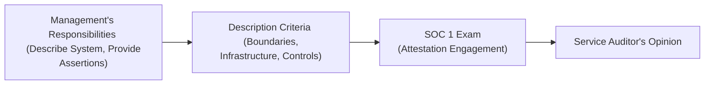

## 23.2 Management Assertions and Description Criteria

In a SOC 1® examination, management’s assertions lie at the heart of what the service organization claims about the design and operation of its controls, as well as how accurately the system is described. Whether you are an auditor evaluating these assertions for your clients or you are part of a service organization preparing your system for review, a solid understanding of what management must assert—and the underlying description criteria for making such assertions—remains essential.

This section explores:  
• The nature of management assertions in SOC 1® engagements  
• How service organizations describe their systems in line with specific criteria  
• Alignment with standard IT general controls (ITGCs), such as access and change management  
• Practical examples, diagrams, and references to other relevant chapters  

By detailing these concepts, we highlight best practices that ensure clear, consistent, and transparent representation of the controls in place—and ultimately provide user entities confidence in the service organization’s ability to support their financial reporting needs.

--------------------------------------------------------------------------------

### Overview of SOC 1® Management Assertions

A SOC 1® examination is governed by the AICPA’s attestation standards (notably AT-C Section 320). Management’s assertions are statements that the service organization’s management makes regarding:  
1. The fairness of the presentation of the system description.  
2. The suitability of the design of the controls.  
3. In Type 2 engagements, the operating effectiveness of those controls across a specified review period.

These assertions flow from the overarching principle that management, not the auditor, is responsible for the trustworthiness of the system and its controls. The service auditor’s role is to independently evaluate the claims and provide an opinion on whether these assertions are fairly stated based on controls relevant to user entities’ internal control over financial reporting (ICFR).

#### Why Are Assertions Needed?

Management assertions enhance accountability. When the service organization explicitly outlines what it is claiming, it makes the scope, boundaries, and objectives of the examination clear. This clarity allows user entities and other stakeholders to rely on the SOC 1® report with confidence. Moreover, these assertions set the framework for the service auditor’s testing procedures.

--------------------------------------------------------------------------------

### Key Assertions in a SOC 1® Engagement

Though worded in varying ways, the most common set of assertions for a SOC 1® Type 1 or Type 2 report typically include:

1. **System Description Is Fairly Presented**  
   Management asserts that the system’s description, including relevant control objectives, key aspects of the information flow, subservice organization relationships, and control boundaries, accurately reflects the services being provided to user entities.  
   
   • The description should include details of processes, applications, infrastructure, people, and procedures essential to meeting user entities’ financial reporting requirements.  
   • It should also cover dependencies on subservice organizations (whether included via the carve-out or inclusive method—see Section 23.5).  
   • The scope must be clearly defined so that stakeholders understand what is—and is not—part of the examination.

2. **Controls Are Suitably Designed**  
   Management asserts that the controls described are suitably designed to achieve stated control objectives. This reflects the idea that if the controls operated as intended, they would adequately mitigate the risks related to user entities’ financial statement assertions.  
   • Suitably designed controls often incorporate frameworks such as COSO, COBIT, or ITIL for structuring operational effectiveness and risk management.  
   • For instance, controls around change management, access security, data processing, system development, and IT operations must demonstrate that they can prevent or detect material errors tied to financial reporting.  

3. **Controls Are Operating Effectively (Type 2 Only)**  
   For a Type 2 SOC 1® report, management also asserts that the controls functioned effectively over a clearly defined period (typically six to twelve months).  
   • The difference from a Type 1 report, which is “as of” a point in time, is that a Type 2 provides assurance about ongoing operation.  
   • Evaluating operating effectiveness typically involves sampling transactions, records, or system logs to ensure controls worked as noted in the system description.

When management makes these statements, they must have sufficient evidence to support them—e.g., documentation of policies, incident logs, or risk assessments. It is not enough to present a high-level narrative. Detailed records, consistent processes, and documented reviews all play critical roles in supporting the assertions.

--------------------------------------------------------------------------------

### Description Criteria: Building Blocks of Transparency

Management’s description of the system is governed by established description criteria, which outline what to include to give user entities a complete, accurate, and useful picture of how the system is designed and operated. These criteria often mirror the structure used in SOC 2® but are adapted for financial reporting relevance specific to SOC 1®. While the AICPA does not impose identical frameworks on all SOC 1® engagements, the following general elements typically appear in the system description:

• **Nature of Services Provided**  
  A complete explanation of how the service organization’s operations affect user entities’ financial reporting. For instance, if a third-party payroll processor provides services to user entities, the description should clarify which payroll cycles, tax payments, or check disbursements the service organization carries out and how these tasks relate to financial statements.  

• **Infrastructure**  
  Hardware, operating systems, virtualization, network segmentation, and other IT infrastructure must be described in sufficient detail to demonstrate how data is processed and stored. If the service is cloud-based, the model (e.g., SaaS, IaaS) and hosting arrangements should be highlighted.  

• **Software and Applications**  
  Information about the primary applications (including any critical custom software components) used to deliver the service, including versioning strategies, release cycles, and key security features.  

• **People and Organizational Structure**  
  Notably the roles and responsibilities of individuals or departments who design, implement, or manage the controls. This might include oversight committees, IT security teams, accounts payable supervisors, etc.  

• **Policies and Procedures**  
  High-level policies (e.g., access provisioning, performance monitoring, vendor management) as well as more granular procedures (e.g., daily reconciliations, system logs reviews).  

• **Subservice Organizations**  
  If certain parts of the organization’s processes are outsourced, the description must address whether the subservice organization is carved out or included in the scope. This ensures clarity on where responsibilities begin and end.  

• **Relevant Control Objectives and Related Controls**  
  A thorough listing of specific control objectives tied to the system’s impact on financial reporting—along with the associated controls.  

To meet these criteria, management must not only describe “what” the system does, but also “how” it does it, and “why” certain design choices were made. It is a balance between not overwhelming the user of the SOC 1® report with excessive technical detail while ensuring enough information to evaluate the system’s design and alignment with the stated control objectives.

--------------------------------------------------------------------------------

### Overlap With IT General Controls

Both management assertions and the underlying description criteria are deeply connected to IT general controls (ITGCs). Traditional ITGC domains—discussed in Chapter 8—lay a foundation that supports system reliability, data integrity, and operational continuity. Below is how each of the standard ITGC domains can map to management’s assertions and the system description:

• **Access to Programs and Data (Chapter 8.1)**  
  – Management asserts that logical access controls around financial applications are in place, effectively designed, and functioning.  
  – The system description must clarify how user account provisioning/deprovisioning works, how privileged access is monitored, and how passwords or multi-factor authentication are enforced.  

• **Program Changes (Chapter 8.2)**  
  – Controls around change management ensure modifications to critical financial applications follow a documented process with appropriate authorizations and testing.  
  – Management’s description (and assertion for suitability of design) should reflect processes that mitigate unauthorized or erroneous changes.  

• **Program Development (Chapter 8.3)**  
  – If new functionalities or modules of the system that affect financial processes are developed, controls regarding project management, system development life cycle (SDLC), and quality assurance must be described.  
  – Management asserts that these controls are designed to align with user entities’ needs for accuracy and completeness.  

• **Computer Operations (Chapter 8.4)**  
  – Management describes incident response mechanisms, scheduled maintenance tasks, backups, disaster recovery, and daily routines that maintain system availability.  
  – The assertion covers the idea that these controls are suitably designed to ensure consistent operations of financial applications.  

In many cases, third-party service organizations handle these ITGC tasks, especially in cloud or outsourcing scenarios. Regardless, management must confirm the presence of robust IT general controls that tie back to the system’s financial reporting impact.

--------------------------------------------------------------------------------

### Practical Example: Payroll Processing Service

Consider a payroll processing service organization—an entity that handles payroll calculations and distributions for hundreds of user entities. The service organization’s management would typically provide the following description elements under the description criteria:

• **Services Provided**: Weekly, bi-weekly, and monthly payroll runs, tax statement generation, wage garnishment processes, direct deposit services, etc.  
• **Infrastructure**: Database servers, public or private cloud environment, virtualization layers, and how these are secured.  
• **Software**: The primary payroll application, with details on its major modules (e.g., time tracking, withholdings estimation), and how patches are deployed.  
• **People**: Roles such as payroll managers, HR data specialists, and system administrators who carry out or supervise tasks impacting payroll data.  
• **Policies**: For instance, a policy that all new hires are validated by the user entity’s HR manager before pay is generated, or a policy that direct deposit instructions can be changed only through a secure user portal.  
• **Subservice Organizations**: Outsourced check printing or tax filing subservice organizations. Are these included (inclusive method) or carved out of the system description (carve-out method)?  

Then, management’s assertions might look like this:

• **Fair Presentation of Description**: “Our firm makes available a payroll processing system that calculates wages, handles garnishments, and issues direct deposits, as described in our system description. We have included all relevant transactions that flow from user entities’ data inputs to final disbursements.”  
• **Suitability of Design**: “We have implemented controls around account provisioning, payroll calculation accuracy (reconciliation to prior period data), and data transmission security. These controls are designed to achieve the control objectives outlined in Section X of the report.”  
• **Operating Effectiveness (Type 2)**: “Across the period from January 1 to December 31, we have maintained logs, performed independent reviews, and verified that manual adjustments require management approval. No unauthorized or erroneous changes were detected.”

When the service auditor evaluates these claims, they will test and validate that the statements are backed up with tangible evidence—for example, reviewing user access logs, testing user provisioning processes, and re-checking payroll calculations over sample pay cycles. The success of the SOC 1® engagement hinges on thorough and transparent communication of these factors.

--------------------------------------------------------------------------------

### Diagram: Management’s Assertions and Description Criteria in Action

Below is a simple flow diagram illustrating how management’s assertions intersect with the process of describing the system and the auditor’s subsequent opinion:

• **A → B (Management’s Responsibilities → Description Criteria)**  
  Management must craft a detailed, accurate system description in line with the description criteria.  

• **B → C (Description Criteria → SOC 1 Exam)**  
  The service auditor uses the system description to scope the engagement, developing tests of controls and verifying the assertions.  

• **C → D (SOC 1 Exam → Opinion)**  
  The service auditor issues a formal opinion on whether management’s assertions (and the system description) are presented fairly and whether controls are suitably designed and, if Type 2, operating effectively.

--------------------------------------------------------------------------------

### Best Practices and Common Pitfalls

#### Best Practices
1. **Link Each Control to a Clear Control Objective**  
   Clearly map the controls to specified financial reporting control objectives. Ensure the rationale is apparent to the reader of the SOC 1® report.

2. **Keep the Description Updated**  
   Changes to software, hardware, or third-party providers should be promptly reflected in an updated system description. Stale descriptions are a frequent cause of exceptions.

3. **Ensure Internal Consistency**  
   The descriptions’ content (including policies, subservice organizations, or control boundaries) must align with the actual operation of the system.  

4. **Leverage Existing Frameworks**  
   Use established frameworks like COSO, COBIT 2019, and ISO 27001 to structure and demonstrate alignment. This helps external parties see the logic behind the service organization’s controls.

5. **Document Evidence Thoroughly**  
   To support Type 2 engagements, keep detailed records of control operation, such as access logs, incident response tickets, or approval forms for changes.

#### Common Pitfalls
1. **Insufficient Detail**  
   If the system description is vague, omitting key processes or ignoring subservice organizations, user entities and auditors cannot fully evaluate the controls.

2. **Overburdening Users with Technical Jargon**  
   The system description should be sufficiently technical to facilitate testing but written so that finance-oriented stakeholders can understand how controls protect financial data.

3. **Underestimating Dependencies**  
   Failing to address or even name subservice organizations leads to confusion about the true responsibility for controls. This often results in disclaimers or scope limitations in the final report.

4. **Outdated Policies**  
   If formal policies have changed or staff responsibilities have shifted, the system description must be revised to avoid misrepresentations that weaken management’s assertions.

--------------------------------------------------------------------------------

### Aligning Description Criteria with Other Chapters

The preceding chapters and standards that tie directly into crafting a solid foundation for management assertions and meeting description criteria include:  
• **COSO Internal Control – Integrated Framework (Section 3.1)**: Provides overarching principles for control environment, risk assessment, control activities, information and communication, and monitoring.   
• **IT General Controls (Chapter 8)**: Offers comprehensive guidance on standard ITGC areas that feed into SOC 1® examinations.  
• **Business Processes in Information Systems (Chapter 7)**: Highlights transaction processing cycles and business process flows, all of which you should integrate in your description.  
• **SOC 1® Reporting Details (Section 23.1, 23.3, 23.4)**: Explores the scope, applicability, and materiality principles for SOC 1® engagements.  

By revisiting these chapters, management can ensure alignment with the frameworks and processes that user entities and auditors expect.

--------------------------------------------------------------------------------

### References and Further Reading

Below are some resources that will deepen your understanding of SOC 1® management assertions and description criteria:  
• **AICPA Guide: Reporting on an Examination of Controls at a Service Organization Relevant to User Entities’ Internal Control Over Financial Reporting** (SOC 1® Guide)  
• **AT-C Section 320, Reporting on an Examination of Controls at a Service Organization Relevant to User Entities’ Internal Control Over Financial Reporting**  
• **COSO Internal Control – Integrated Framework**  
• **COBIT 2019** for deeper IT governance insights  

--------------------------------------------------------------------------------

## Quiz on Management Assertions and Description Criteria



### Which of the following is NOT a standard management assertion in a SOC 1® Type 2 engagement?  
- [ ] The system's description is fairly presented.  
- [ ] The controls are suitably designed.  
- [ ] The controls are operating effectively throughout a specified period.  
- [x] The controls meet all user entity requirements for GAAP compliance.  

> **Explanation:** SOC 1® management assertions do not guarantee compliance with Generally Accepted Accounting Principles (GAAP). Rather, they focus on fair presentation of the system description, suitability of control design, and effectiveness of controls.

### What best describes the purpose of the description criteria in a SOC 1® engagement?  
- [ ] To provide a list of all subservice organizations used by the service organization, including their financial statements.  
- [x] To guide the service organization in presenting a complete and accurate picture of its system, operations, and controls.  
- [ ] To ensure the service auditor focuses on testing only IT controls.  
- [ ] To limit the service auditor’s responsibility to a single functional department.  

> **Explanation:** Description criteria are designed to ensure that the service organization’s system is clearly and accurately described so that stakeholders can understand its boundaries, processes, and controls.

### Which of the following is an example of how IT general controls support management’s assertion about control suitability?  
- [x] Firewalls, access controls, and secure configuration help ensure the reliability and security of financial data processing.  
- [ ] They document all transactions for each user entity.  
- [ ] They ensure the service organization remains profitable.  
- [ ] They only pertain to front-end user interfaces.  

> **Explanation:** IT general controls (e.g., access security, change management) form a foundation for stable and secure processing of financial data, directly impacting the suitability of the controls.

### What is a key difference between Type 1 and Type 2 SOC 1® report assertions regarding control effectiveness?  
- [x] A Type 1 report addresses control design at a point in time, while a Type 2 also addresses operating effectiveness over a period.  
- [ ] Only a Type 1 report is concerned with operating effectiveness.  
- [ ] A Type 2 report does not include any operating effectiveness tests.  
- [ ] They are identical in scope but differ in the name only.  

> **Explanation:** Type 1 addresses design at a specific date; Type 2 includes testing of operating effectiveness over a defined time period.

### Which term best defines the concept of ensuring the system description remains consistent with any changes in the service organization’s environment?  
- [x] Continuous monitoring  
- [ ] Convergent testing  
- [x] Static system approach  
- [ ] Material deviation  

> **Explanation:** Continuous monitoring (or at least regular review) is essential so that management can update the system description in response to organizational changes or newly introduced risks.

### Which of the following best exemplifies a subservice organization scenario under the carve-out method?  
- [x] A payroll processing firm uses a third-party data center for hosting but excludes that data center’s controls from the SOC 1® report.  
- [ ] A service organization that includes all relevant subservice organizations in its own description.  
- [ ] A subservice organization that does not handle any portion of financial data.  
- [ ] A subservice organization that is responsible for the attestation engagement.  

> **Explanation:** Carve-out means the description notes the existence of the subservice, but the subservice’s controls are excluded from the scope of the SOC 1® engagement.

### Which domain of IT general controls most directly relates to preventing unauthorized changes to programs?  
- [x] Program Changes  
- [ ] Access to Programs and Data  
- [x] Program Development  
- [ ] Computer Operations  

> **Explanation:** The “Program Changes” domain includes controls and procedures specifically designed to prevent unauthorized or incorrect changes to software and systems.

### In a SOC 1® Type 2 engagement, when management asserts the controls “operated effectively,” it implies that:  
- [x] The controls were functioning as described over the entire specified period.  
- [ ] Manual controls existed, but no automation was needed.  
- [ ] User entities conducted regular audits on their own.  
- [ ] External regulators have confirmed the results for the entire period.  

> **Explanation:** “Operating effectively” means the controls were consistently applied and functioned as designed during the entire review period.

### Which of the following describes a common pitfall in preparing a system description?  
- [x] Failing to mention that part of the process is outsourced to a subservice organization.  
- [ ] Providing definitions of key terms used in the system.  
- [ ] Describing change management procedures.  
- [ ] Explaining how user access is granted and revoked.  

> **Explanation:** Omitting the role of subservice organizations can lead to confusion, misrepresentations, or scope limitations in the final report.

### True or False: SOC 1® management assertions guarantee that user entities’ financial statements are free from misstatements.  
- [x] True  
- [ ] False  

> **Explanation:** This is a trick question. The correct answer is False. SOC 1® management assertions only focus on describing the relevant system and its controls that impact financial reporting. They do not guarantee that user entities’ financial statements are entirely free from misstatements.



--------------------------------------------------------------------------------

## For Additional Practice and Deeper Preparation

### [Information Systems and Controls (ISC)](https://www.udemy.com/course/isc-cpa-mock-exams/?referralCode=E1217303222935C5E464)

Information Systems and Controls (ISC) CPA Mocks: 6 Full (1,500 Qs), Harder Than Real! In-Depth & Clear. Crush With Confidence!

- Tackle full-length mock exams designed to mirror real ISC questions.  
- Refine your exam-day strategies with detailed, step-by-step solutions for every scenario.  
- Explore in-depth rationales that reinforce higher-level concepts, giving you an edge on test day.  
- Boost confidence and minimize anxiety by mastering every corner of the ISC blueprint.  
- Perfect for those seeking exceptionally hard mocks and real-world readiness.

_Disclaimer: This course is not endorsed by or affiliated with the AICPA, NASBA, or any official CPA Examination authority. All content is for educational and preparatory purposes only._
