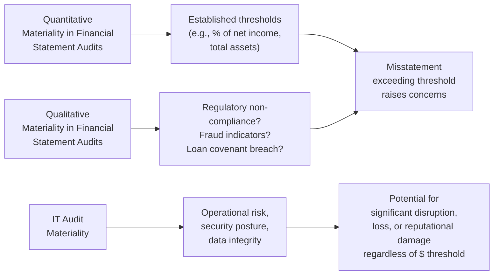

## 23.4 Distinguishing Materiality in IT vs. Financial Statement Audits

Organizations increasingly rely on complex information technology (IT) systems to manage their financial data and core business activities. Consequently, Certified Public Accountants (CPAs) and IT auditors must address the concept of “materiality” in two distinct ways: from a financial statement perspective and from an IT controls or information systems perspective. While traditional financial statement audits focus on whether misstatements exceed established quantitative thresholds (often tied to net income, revenue, or total assets), IT audits prioritize the operational and security conditions—factors that may be significant even if they seem immaterial from a purely monetary standpoint. This section explores how materiality is viewed in each context, examining why an IT misconfiguration can be business-critical even if the immediate dollar impact appears small.

-------------------------------------------------------------------------------
### Understanding Materiality in Financial Statement Audits

In a typical financial statement audit, “materiality” is rooted in Generally Accepted Auditing Standards (GAAS) and AICPA guidance. The overarching principle is that a misstatement is material if it could influence the economic decisions of users taken on the basis of the financial statements.

• Quantitative thresholds. CPAs commonly apply materiality thresholds based on a percentage of net income, total assets, or other benchmarks. For instance, an auditor might set overall materiality at 5% of a company’s net income, or between 1% and 2% of total assets.

• Qualitative considerations. Though quantitative metrics guide decisions, qualitative factors also come into play. A small misstatement can still be material if it impacts compliance with regulatory requirements, breaches covenants, or signals potential fraud.

• Objective of financial statement audits. The primary objective is to ensure the financial statements are free of material misstatement, whether caused by error or fraud. The audit processes—risk assessment, sampling, control testing—are aligned with uncovering errors in reported financial information.

-------------------------------------------------------------------------------
### Understanding Materiality in IT Audits

In the context of IT audits, especially those relevant to SOC 1® engagements or internal control evaluations, materiality extends beyond a narrow quantitative threshold. It encompasses:

• Operational and process-critical issues. An IT control deficiency may not result in a large dollar misstatement today, but it can disrupt critical business processes or compromise key data in the future. For instance, a minor server misconfiguration might allow unauthorized access to financial data, posing a massive regulatory and reputational risk.

• Availability, confidentiality, and integrity (CIA triad). In IT environments, these three security pillars are pivotal. Even if a misconfiguration appears insignificant in pure currency terms, it could gravely impact data integrity or system availability. A short downtime of a transaction processing system might lead to lost sales, customer dissatisfaction, or compliance penalties that far outweigh the immediate “financial error.”

• Reliability of underlying data. Financial audits often rely on data housed in complex information systems. If the system’s accuracy, completeness, or security is undermined by IT control flaws, stakeholders cannot place confidence in the financial statements.

• Regulatory and legal obligations. Various regulations (e.g., GDPR, HIPAA, Sarbanes-Oxley) mandate organizations maintain robust IT controls. Non-compliance—even with small-dollar exposures—can trigger fines or sanctions that significantly exceed any direct loss from a misstatement.

-------------------------------------------------------------------------------
### Why Small IT Issues Can Be Business-Critical

Organizations sometimes erroneously assume that if there is no large apparent amount of money at stake, an IT-related control deficiency is minor. In reality, small IT issues often cascade into larger problems. A single misconfiguration in user access privileges, for instance, may initially permit only a small population of unauthorized transactions, but it can become a major vulnerability if exploited for fraud or persistent data manipulation. The following examples illustrate this dynamic:

• Compounding effect of repeated errors. A small daily mistake in a data feed might appear immaterial at first. However, if unaddressed, it can accumulate across multiple periods, eroding the integrity of entire data sets and undermining confidence in the organization’s systems.  
• Reputational damage. The cost of eroded trust can be far greater than the cost of the specific error. One security breach or misconfiguration in an e-commerce platform can tarnish the brand, overshadowing the immediate financial cost.  
• Compliance exposure. Even minor lapses in IT controls can lead to non-compliance events. Regulatory fines and potential lawsuits resulting from privacy or security breaches can dwarf direct financial losses.  
• Stakeholder confidence. Investors, creditors, and business partners rely on trust that the company’s systems are secure and reliable. A small error, once exposed, may undermine the perceived competence of management and hamper the company’s ability to raise capital or expand operations.

-------------------------------------------------------------------------------
### Differentiating Materiality Thresholds in SOC 1® vs. Financial Statement Audits

A SOC 1® examination focuses on controls at a service organization relevant to user entities’ internal control over financial reporting. While the concept of materiality for the service auditor aligns with financial statement materiality in many respects, it is applied in the context of the specific user entities’ financial statements. The service auditor must evaluate whether control deviations at the service organization could lead to material misstatements for all of those user entities.

In contrast, a financial statement audit of a single organization narrows the lens to that entity’s specific financials. The difference is subtle but important:

• Broader user entity base. The materiality threshold may be considered collectively for many organizations relying on the service organization’s system and controls.  
• Focus on control objectives. The emphasis in a SOC 1® engagement is on evaluating how well controls meet stated control objectives, which may be operational or system-related. This approach often goes beyond a purely dollar-focused assessment.  
• Risk posture. The service auditor identifies IT control risks that could cause a material misstatement in user entities’ financial statements. Even if a single user might consider a deficiency immaterial, it can become material when aggregated across the entire population of user entities.

-------------------------------------------------------------------------------
### The Interaction of IT and Financial Reporting Risks

Materiality within IT environments cannot be viewed in isolation. Even routine business processes, like payroll runs or month-end close procedures, depend on configuration settings, software patch levels, and correct user permissions. The stability and security of IT systems underpin the accuracy of financial reporting. A risk that might initially appear inconsequential—like a missing database patch—can become crucial if it exposes the system to unauthorized data modifications.

#### Example: Access Controls
If a small local subsidiary’s system user has elevated privileges due to an IT misconfiguration, they might have the ability to adjust internal sales or expense data. Even if those transactions individually represent small amounts, over time the cumulative effect can become materially significant. More importantly, the potential for deliberate abuse or unintended errors could undermine the reliability of the entire financial reporting process.

#### Example: Cloud Misconfigurations
In many modern companies, critical financial data resides in cloud-based ecosystems. A single misconfiguration in a cloud storage environment might not visibly impact the financial statements right away. However, it can allow unauthorized data extraction, leading to compliance violations, reputational damage, and legal liabilities. The intangible cost of a data breach can be exponentially higher than any immediate measurable misstatement. Even if the actual monetary loss is limited, the intangible risk is often “material” when considering the full strategic, reputational, and legal context.

-------------------------------------------------------------------------------
### Visualizing the Conceptual Differences

Below is a Mermaid diagram illustrating how materiality thresholds for financial statement audits commonly differ from those used in IT audits. The diagram places the emphasis on what triggers a “red flag” in each domain.

In a financial statement audit (left side of diagram), materiality is typically measured by how big a misstatement might be relative to standard benchmarks. On the right side, IT audits ask different questions: What is the operational importance of this system or control? Could a failure lead to large-scale disruption or compliance issues, even if the immediate monetary misstatement is small?

-------------------------------------------------------------------------------
### Best Practices for Addressing IT Materiality

1. **Establish Multi-Factor Risk Criteria**  
   Go beyond a single numeric figure (e.g., 5% of net income). Include qualitative factors such as data sensitivity, regulatory impact, and potential for fraud. This broader view helps auditors pinpoint control deficiencies that, while monetarily small, carry extraordinary risk.

2. **Leverage a Holistic Risk Assessment**  
   Align IT risk assessments with enterprise-wide risk management, as described in frameworks such as COSO ERM (Chapter 3.2 of this Guide). By categorizing and prioritizing IT risks, organizations gain a clearer sense of their overall threat landscape.

3. **Scenario Testing**  
   Perform scenario analyses to assess “what if” a misconfiguration or deficiency occurred. For example, if an unauthorized user gains access to an ERP system for a brief time, demonstrate the potential ramifications—financial, reputational, and operational.

4. **Ongoing Monitoring and Continuous Assurance**  
   Systems, applications, and interfaces change constantly. To address emergent threats timely, adopt continuous monitoring tools and robotic process automation (RPA) for real-time data integrity checks. This strategy also reduces the lag between the emergence of a control deficiency and its detection.

5. **Incident Response Planning**  
   Even small issues can snowball if not addressed swiftly. Develop and test incident response procedures (see Chapter 20: Incident Response and Recovery) to ensure the organization can respond to IT-related risks quickly, preserving evidence and containing the breadth of impact.

6. **Communication with Stakeholders**  
   Educate management, boards, and external stakeholders about the non-linear relationship between minimal dollar-value exposures and major IT-related impacts. In many cases, intangible or long-tail effects of IT failures are the real concern.

-------------------------------------------------------------------------------
### Common Pitfalls and Challenges

Despite broad recognition that small IT errors can cause major disruptions, organizations continue to underinvest in robust IT governance. Below are frequent pitfalls:

• **Overreliance on Single Thresholds.** Organizations often define a single materiality threshold based purely on financial measures, ignoring intangible or forward-looking risks.  
• **Lack of Cross-Functional Collaboration.** IT leaders and finance leaders operate in silos, causing misaligned risk assessments.  
• **Insufficient Documentation.** Rapid changes in technology can outpace documentation updates, complicating audits and increasing the likelihood of control lapses.  
• **Underestimating Downstream Effects.** A seemingly minor system or database could be critical if it feeds data to more essential applications. Inadequate mapping of data flows raises the risk of ignoring “small IT issues” until it’s too late.  
• **No Formal Risk Posture for Emerging Tech.** With trends like cloud computing, blockchain, AI, and IoT (Chapters 6.4 and 28), organizations may lack standardized frameworks to evaluate new vulnerabilities.

-------------------------------------------------------------------------------
### Detailed Case Study: Small Application, Big Impact

Imagine a multinational firm that uses a niche application to process employee expense reimbursements. From a pure quantitative perspective, the total annual expenses processed through this application represent a small fraction of the firm’s net income or total assets—well below the typical materiality threshold in a financial statement audit.

However, an IT audit reveals a significant access control gap in the expense application: a simple misconfiguration in the Active Directory integration allows any staff member, not just authorized accounting personnel, to adjust reimbursements. This vulnerability might not spark immediate suspicion because these reimbursements sum to a seemingly negligible figure. But any user could repeatedly exploit the misconfiguration to process illegitimate expenses, quietly siphoning out funds over two or three accounting periods. Over time, such fraud can accumulate into a large sum and—more dangerously—shake stakeholder confidence in the organization’s internal controls.

Separately, the application is integrated with a corporate payroll system to handle reimbursements to employees, meaning even small anomalies could disrupt or pollute other data sets. Since reimbursements are also part of the general ledger, enabling changes in the expense application might result in inaccurate ledger entries and complicate the reconciliation process. The intangible cost of investigating the discrepancy, re-auditing accounts, and facing potential enforcement actions (if any employees violate expense policies for personal gain) far exceeds the raw monetary amount initially in question.

-------------------------------------------------------------------------------
### Practical Tips for Auditors and Accountants

• **Deepen IT Competence.** CPAs involved in IT audits or SOC engagements should continually update their knowledge of technology and systems controls.  
• **Cross-Check Continuity.** Link transaction trails and data flows back to front. Even if an application handles small volumes, ensure that its outputs do not flow into high-impact processes.  
• **Integrate Evidence Gathering.** Collect logs from source systems, validate interface accuracy, and test user access paths. The synergy of financial auditing and IT assessments profoundly reduces the risk of oversight.  
• **Address Root Causes.** If a deficiency is discovered, focus not only on immediate fixes but also on the deeper cause—be it a policy gap, ill-defined responsibilities, or untracked changes in the IT environment.  

-------------------------------------------------------------------------------
### Additional References and Further Exploration

• **AICPA.** Statements on Standards for Attestation Engagements (SSAE) for SOC 1® reports, especially SSAE No. 18.  
• **COSO.** Internal Control – Integrated Framework & Enterprise Risk Management Framework for deeper risk-based approaches.  
• **COBIT 2019.** Offers governance and management objectives specifically targeting IT processes.  
• **NIST Cybersecurity Framework.** A widely recognized set of standards and best practices for managing cyber-related risks.  
• **ISACA.** Guidance on information systems governance, risk, and compliance.  

These resources expand on how to align IT controls with broader organizational objectives and clarify how different definitions of materiality interplay within an organization’s overall risk landscape.

-------------------------------------------------------------------------------
## Test Your Knowledge: Materiality in IT vs. Financial Statement Audits



### Distinguishing Materiality Thresholds
- [ ] Quantitative thresholds in financial reporting are equivalent to IT materiality.  
- [x] IT materiality often focuses on business-critical operational risks that may not meet a high dollar threshold.  
- [ ] Only quantitative factors matter in determining materiality in IT.  
- [ ] There is no difference between IT materiality and financial statement materiality.  

> **Explanation:** IT materiality extends beyond numeric values to consider any disruptions, security, or compliance risks that could critically affect business operations or stakeholder trust.

### Operational Impacts
- [x] A small misconfiguration in an IT system can escalate into a major organizational disruption.  
- [ ] If an IT configuration error does not surpass a defined numeric threshold, it cannot be considered material.  
- [ ] IT controls only affect employee satisfaction, not financial reporting.  
- [ ] Materiality only applies to large software systems, not smaller niche applications.  

> **Explanation:** Even a minor misconfiguration can lead to unauthorized activities, compliance issues, or reputational risk, which may exceed traditional financial thresholds.

### SOC 1® vs. Financial Statement Audits
- [ ] SOC 1® only considers the service organization’s direct financial statements.  
- [ ] Financial statement audits use the subservice organization’s materiality threshold.  
- [x] SOC 1® engagements evaluate IT controls for their impact on user entities’ financial statements.  
- [ ] In SOC 1®, materiality considerations are unrelated to user entity controls.  

> **Explanation:** SOC 1® focuses on how the service organization’s controls affect the financial statements of user entities, making the concept of materiality broader in scope than a single entity’s assessments.

### Example of Intangible Cost
- [x] A reputational risk resulting from an IT breach can exceed the direct monetary loss.  
- [ ] Reputational risks can only be measured in a fixed table of intangible values.  
- [ ] Reputational damage is never material in financial statement terms.  
- [ ] Only brand managers worry about reputational risk, not auditors.  

> **Explanation:** The hidden or intangible costs (e.g., customer trust erosion, regulatory fines) can exceed any direct financial loss and are central to IT materiality considerations.

### Importance of Scenario Analysis
- [x] Scenario testing can reveal the broader repercussions of an IT issue before it becomes critical.  
- [ ] Scenario testing is not permitted under AICPA guidelines.  
- [x] Scenario testing enables auditors to model the potential impact of small, isolated issues over time.  
- [ ] Scenario testing only applies to large revenue streams.  

> **Explanation:** By performing “what-if” analyses, auditors and management gain insights into how small misconfigurations or weaknesses in IT infrastructure can cascade into critical incidents.

### Multi-Factor Risk Criteria
- [x] Look beyond a single numeric figure to assess materiality from multiple angles (compliance, data criticality, etc.).  
- [ ] Basing all materiality decisions solely on net income is sufficient.  
- [ ] Qualitative factors have no place in determining IT materiality.  
- [ ] All IT risks can be reduced to a single financial ratio.  

> **Explanation:** IT audits require a holistic view of risk—combining both quantitative and qualitative factors highlights vulnerabilities that might otherwise be overlooked.

### Cloud-Hosted Systems
- [x] A small cloud misconfiguration can be material because it may open the door to major data breaches.  
- [ ] Cloud services are always separate from financial processes.  
- [x] Cloud computing can escalate IT vulnerabilities due to multi-tenant environments and complex configurations.  
- [ ] Materiality thresholds do not apply to outsourced IT services.  

> **Explanation:** Cloud-based environments create unique risks. A minor flaw in configuring security settings can allow unauthorized access, yielding serious financial and reputational consequences.

### Focusing on Root Causes
- [x] Addressing the deeper root cause of an IT deficiency helps prevent recurrence.  
- [ ] Corrective actions should only address the immediate misstatement.  
- [ ] Root cause analysis only matters if the misstatement is material in dollar terms.  
- [ ] Incident response is irrelevant to materiality.  

> **Explanation:** A thorough root cause analysis ensures that the same deficiency or a similar variant does not arise again, thereby reducing future risk.

### Downstream Effects
- [x] A small IT system can feed data to critical financial or process-centric applications.  
- [ ] Niche applications are not relevant to materiality if they handle negligible financial amounts.  
- [ ] Downstream effects are too difficult to track, so they are typically disregarded.  
- [ ] All small systems are inherently immaterial.  

> **Explanation:** Auditors must map data flows to understand how a seemingly minor system function can affect the integrity of larger, more crucial processes.

### True or False: 
Small monetary amounts in an IT context can never be considered material.  
- [ ] True  
- [x] False  

> **Explanation:** In IT audits, materiality is not solely determined by dollar amounts. Operational impact, potential for fraud, reputational harm, and compliance issues are just as crucial.



-------------------------------------------------------------------------------
## For Additional Practice and Deeper Preparation

### [Information Systems and Controls (ISC)](https://www.udemy.com/course/isc-cpa-mock-exams/?referralCode=E1217303222935C5E464)

**Information Systems and Controls (ISC) CPA Mocks:** 6 Full (1,500 Qs), Harder Than Real! In-Depth & Clear. Crush With Confidence!

- Tackle full-length mock exams designed to mirror real ISC questions.  
- Refine your exam-day strategies with detailed, step-by-step solutions for every scenario.  
- Explore in-depth rationales that reinforce higher-level concepts, giving you an edge on test day.  
- Boost confidence and minimize anxiety by mastering every corner of the ISC blueprint.  
- Perfect for those seeking exceptionally hard mocks and real-world readiness.  

_Disclaimer: This course is not endorsed by or affiliated with the AICPA, NASBA, or any official CPA Examination authority. All content is for educational and preparatory purposes only._
