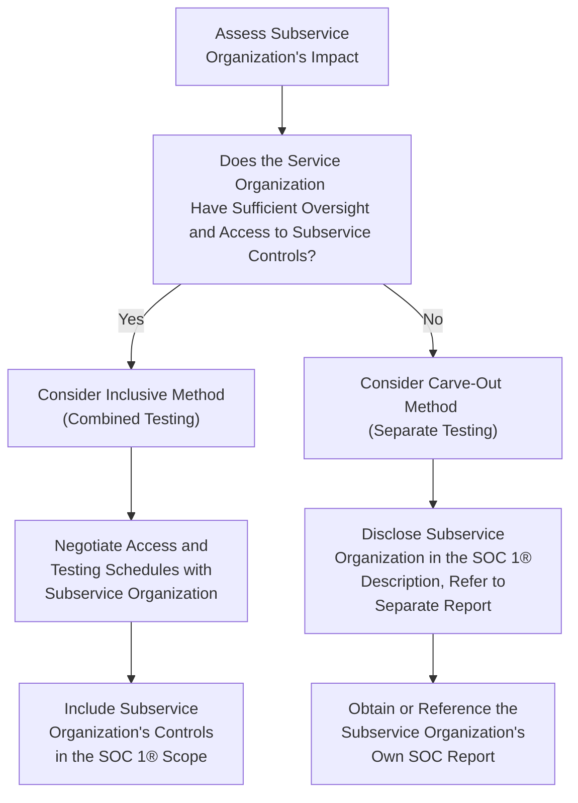

## 23.5 Inclusive vs. Carve‑Out Method for Subservice Organizations

In service organization control (SOC) examinations, the concept of subservice organizations emerges whenever a primary service organization relies upon another party to perform a specific function that impacts the user entities’ internal controls over financial reporting. Examples include data center hosting, payment processing, or specialized IT support. Subservice organizations are integral to understanding the overall control environment because they can directly affect the user entity’s financial statements.

Two approaches exist within the description of a SOC 1® report to handle subservice organizations: the inclusive method and the carve‑out method. Each approach has unique benefits, challenges, and implications for both the service organization and the user entities that rely on the report. This section explores these two methods in detail, providing practical illustrations, a flowchart comparison, best practices, and common pitfalls.

Introduction  
When determining how to address subservice organizations in a SOC 1® examination, management and the service auditor must decide whether controls at the subservice organization will be included and tested as part of the service organization’s own control environment (inclusive method) or excluded from testing and only referenced in the service organization’s system description (carve‑out method). This decision is driven by factors such as the service organization’s ability to monitor or oversee the subservice organization, contractual arrangements, materiality assessments, and user entity expectations.

Understanding Subservice Organizations  
A subservice organization is an entity engaged by the primary service organization to perform a function or process that impacts user entities’ internal controls over financial reporting. If a payroll service outsourced its database hosting to a data center, the data center is considered a subservice organization. Controls established by the data center (e.g., physical security, environmental safeguards) could directly affect the service organization’s ability to fulfill its obligations to user entities.

Common examples of subservice organizations include:  
• Hosting providers (cloud or physical data centers)  
• Payment processors and clearinghouses  
• Third-party IT helpdesks or cybersecurity providers  
• Logistics and shipping partners (if they affect financial transactions)  

Defining the Inclusive Method  
Under the inclusive method, the controls at the subservice organization become part of the service organization’s description of its system. Management of the primary service organization asserts that certain controls at the subservice organization are integral to its own system, and the service auditor tests those controls as if they were the service organization’s. Consequently, the subservice organization’s relevant controls appear in the service organization’s SOC 1® report.

This requires a cooperative arrangement, with the subservice organization agreeing to provide information, documentation, and direct access to its operations for testing by the service auditor. The inclusive method means the user entity receives a single SOC 1® report that covers not only the primary service organization’s controls but also the controls at the subservice organization. However, this arrangement can be challenging if the subservice organization is reluctant to share proprietary information or if logistical issues make direct testing impractical.

Key highlights of the inclusive method:  
• The subservice organization’s controls are included in the primary service organization’s system description and control testing scope.  
• The service auditor plans and performs procedures directly on the subservice organization’s controls.  
• The user entity sees all relevant control activities in one comprehensive report.  

Defining the Carve‑Out Method  
Under the carve‑out method, the subservice organization’s controls are excluded (“carved out”) from the scope of the service organization’s SOC 1® report. Instead, the primary service organization relies on the subservice organization’s own forms of assurance, which may take the form of a separate SOC report. The service organization’s description of its system will reference the existence of the subservice organization and indicate the nature of its services, but it does not include the subservice organization’s controls in its own report.

The justification for carving out the subservice organization’s controls often arises when the service organization does not have the necessary access or oversight to test these controls or when the subservice organization provides a separate SOC 1® or SOC 2® report that user entities can request. Many service organizations prefer this approach because it simplifies the scope of testing and eliminates logistical complexities involved in combining multiple operational environments.

Key highlights of the carve‑out method:  
• Subservice organization’s controls are excluded from the primary service organization’s SOC 1® testing.  
• The service organization’s system description acknowledges the subservice but relies on other assurances (e.g., the subservice organization’s SOC 1®).  
• Users must separately evaluate or obtain the subservice organization’s report to gain a complete picture of the control environment.  

Primary Considerations for Method Selection  
Determining whether to include or carve out a subservice organization’s controls is not merely an administrative step; it is a strategic decision. Key considerations include:

• Control Monitoring and Oversight: If the service organization has direct oversight or a high level of collaboration with the subservice organization, the inclusive method may be more feasible. Otherwise, the carve‑out method is generally preferred.  
• Materiality and Risk: If the subservice organization significantly impacts financial statement assertions (e.g., handling sensitive financial data), the user entities may demand a single combined report.  
• Contractual Arrangements: Service organizations may have contractual clauses that limit or grant auditor access to the subservice organization.  
• Industry Practice: Certain industries (such as payment processing) commonly use carve‑out because subservice providers often issue their own SOC reports.  
• User Entity Preferences: User entities may prefer one comprehensive report for simplicity or may be accustomed to obtaining separate subservice organization reports.  
• Timing and Cost: The inclusive method often increases costs as it expands testing procedures. The carve‑out method can reduce the scope but may require user entities to request a separate SOC examination from the subservice organization.  

Flowchart Comparing Inclusive and Carve‑Out Methods  

Below is a Mermaid flowchart illustrating the dual pathways that help guide whether an inclusive or carve‑out method might be selected:

Comparative Discussion  
Although both methods are acceptable under AICPA standards, the selection between inclusive and carve‑out methods can drastically influence the complexity of the SOC 1® report and overall assurance level. The inclusive method is advantageous when user entities need a single, unified assurance on end-to-end processes that include subservice operations. The carve‑out method, however, is often more practical if subservice organizations already have their own SOC reports or if logistical constraints prevent direct testing.

Key Judgment Areas  
The following areas frequently involve professional judgment:

• Scope Definition: Assessing whether subservice organization controls are material enough to require inclusion in the service organization’s coverage.  
• Access to Documentation: Weighing the feasibility of obtaining subservice organization documentation and direct test evidence.  
• Reliance on External Reports: Determining whether the subservice organization’s own SOC 1® or SOC 2® is reliable and how it aligns with the risk profile of the user entities.  
• Communication of Control Gaps: Deciding how to communicate any deficiencies identified at the subservice organization if using the inclusive method.  
• Timing and Coordination: Ensuring the subservice organization’s control testing occurs within the same time frame as the service organization’s testing period, if using the inclusive method.  

Practical Examples  
1. Data Center Hosting  
   A payroll service organization that outsources data center hosting may choose the inclusive method if it has direct operational oversight of the data center, including control over environmental safeguards, security protocols, and database change management. If, however, the data center is one of many large-scale hosting providers with its own comprehensive SOC 1® or SOC 2® report, the payroll service might opt for the carve‑out method.  
   
2. Payment Processing Subservice  
   A financial services company using an external payment processor often relies on that processor’s own SOC 1® or SOC 2® to provide assurance. Because payment processors frequently complete separate audits, it is typical for the financial services company to carve out the payment processor rather than attempt to conduct a combined audit.  

3. Specialized IT Helpdesk  
   A smaller organization may outsource IT helpdesk services to a specialized third party. If the helpdesk’s processes greatly influence user entities’ financial reporting (e.g., controlling user access permissions to financial applications), and if contractual arrangements permit auditor access, the service organization might find value in including that subservice organization in the scope (inclusive method). Otherwise, it will be disclosed and carved out of the scope.  

Common Pitfalls  
• Insufficient Communication: Failing to align expectations with the subservice organization can lead to misunderstandings about the scope of testing.  
• Overlooking Subservice Implications: Some service organizations neglect to disclose subservice organizations or the effect of their controls, creating informational gaps for user entities.  
• Lack of Timely Planning: Coordinating an inclusive approach too late may lead to cost overruns and incomplete audit coverage.  
• Misalignment with User Entity Needs: Some user entities require comprehensive details on subservice arrangements; choosing the carve‑out method without providing adequate references to separate reports can cause confusion.  

Best Practices  
• Early Coordination: Begin discussions about the intended method during the engagement planning phase and involve subservice organizations early.  
• Evaluate Accessibility: Confirm that the subservice organization will provide timely, sufficient documentation and allow direct auditor testing if an inclusive approach is selected.  
• Review Subservice SOC Reports: If using carve‑out, ensure management at the service organization obtains and reviews the subservice organization’s SOC reports to identify relevant control weaknesses that may impact user entities.  
• Transparent Disclosures: Clearly describe in the SOC 1® report the boundaries of the system and the rationale for either the inclusive or carve‑out method.  
• Document User Entity Impact: Articulate how subservice organization controls affect user entities, especially if reliance on separate subservice organization reports is required.  

Conclusion  
The inclusive and carve‑out methods represent two valid approaches to handling subservice organizations in SOC 1® examinations. Each method embodies distinct implications for the service organization, the subservice organization, and user entities who rely on the SOC 1® report. The inclusive method allows for a single, comprehensive analysis but requires extensive cooperation and shared oversight between the service and subservice organizations. Conversely, the carve‑out method offers clarity around who is accountable for which aspects of control testing, though user entities may need to seek additional assurance directly from the subservice organization.

Ultimately, the choice between inclusive or carve‑out depends on the nature of the subservice arrangement, the level of the service organization’s oversight, industry norms, and user entity needs. By understanding how these two methods differ—and by carefully evaluating the risks, contractual obligations, and logistical considerations—CPAs and service organization management can deliver robust, transparent, and decision-useful SOC 1® reports.

References for Further Exploration  
• AICPA, Statement on Standards for Attestation Engagements (SSAE) No. 18, Clarified.  
• AICPA SOC 1® Guide: Reporting on an Examination of Controls at a Service Organization Relevant to User Entities’ Internal Control Over Financial Reporting.  
• AICPA SOC 2® Guide: Reporting on an Examination of Controls at a Service Organization Relevant to Security, Availability, Processing Integrity, Confidentiality, or Privacy.  
• ISACA, COBIT 2019 Framework for IT Governance.  

## Test Your Knowledge: Inclusive vs. Carve-Out Method Quiz



### Which statement best describes the inclusive method?
- [x] Subservice organization controls are included and tested within the service organization’s SOC 1® report.
- [ ] The subservice organization performs its own audit independent of the service organization.
- [ ] Key controls of the subservice organization are always excluded from testing by the service auditor.
- [ ] The service auditor only makes an assertion about the subservice organization’s controls through a reference in the system description.

> **Explanation:** Under the inclusive method, the service auditor tests the subservice organization’s relevant controls as part of the service organization’s SOC 1® examination.

### Which factor commonly leads to choosing the carve‑out method?
- [ ] The subservice controls are easily accessible and directly overseen by the service organization.
- [x] The subservice organization already provides its own SOC report for user entities.
- [ ] The subservice organization’s controls are considered immaterial to the financial statements.
- [ ] User entities strictly request the inclusive method.

> **Explanation:** If the subservice organization has a separate SOC report, the carve‑out method becomes practical because user entities can obtain assurance through that separate report.

### Under the inclusive method, which of the following is typically true?
- [x] The service auditor directly performs procedures on the subservice organization’s controls.
- [ ] The subservice organization’s controls are excluded from the scope of the primary service organization’s system description.
- [ ] The subservice organization issues a separate SOC 1® report that user entities must consult.
- [ ] The subservice organization is not mentioned in the service organization’s SOC report.

> **Explanation:** In an inclusive approach, the subservice organization’s controls are tested and reported upon in the primary service organization’s SOC 1® report.

### Which of the following best describes a subservice organization?
- [ ] An entity that contracts user entities directly.
- [ ] An entity that provides only payroll services internally.
- [ ] A government agency overseeing financial statements.
- [x] An entity that a service organization engages to perform functions impacting the user entities’ internal control over financial reporting.

> **Explanation:** A subservice organization is an external party engaged by the service organization to perform significant tasks that affect the user entities’ controls.

### How does user entity preference typically influence the choice between inclusive and carve‑out methods?
- [ ] User entity preference has no influence on the service organization’s decision.
- [x] Some user entities prefer a single, comprehensive report while others are comfortable examining separate reports.
- [ ] User entities always require the inclusive method for maximum coverage.
- [ ] User entities only care about cost, regardless of coverage.

> **Explanation:** Depending on the complexity of their needs, user entities can significantly influence whether a service organization chooses inclusive or carve‑out to meet their assurance expectations.

### What is a common challenge when implementing the inclusive method?
- [ ] Having to request user entities to obtain additional reports from subservice organizations.
- [ ] Manually excluding subservice controls from the service organization’s scope.
- [ ] Not having to rely on subservice controls at all.
- [x] Coordinating testing and information sharing with the subservice organization.

> **Explanation:** Using the inclusive method often requires detailed coordination and cooperation with the subservice organization to allow for direct testing and evidence gathering.

### Which of the following best describes a key advantage of the carve‑out method?
- [x] It simplifies the service organization’s SOC report by focusing on controls under direct oversight.
- [ ] It guarantees a single, unified report that covers all controls.
- [ ] It requires fewer disclosures about subservice organizations.
- [ ] It can only be used if the service organization has direct operational control.

> **Explanation:** Carve‑out can streamline reporting by excluding controls and testing that reside within the subservice organization’s domain and referencing that organization’s separate SOC report.

### In which scenario is the inclusive method most beneficial?
- [x] When user entities prefer a single point of assurance and the service organization has access to the subservice organization’s controls.
- [ ] When the subservice organization refuses to cooperate with the audit.
- [ ] When all user entities demand disclosure of the subservice organization’s name only.
- [ ] When there is no risk impact from the subservice organization’s operations.

> **Explanation:** The inclusive method is most beneficial when the service organization can adequately test subservice organization controls and user entities want a combined, detailed look at all critical controls in a single report.

### What is a typical risk of carving out a subservice organization?
- [ ] Appearing more transparent to user entities.
- [x] User entities might need to request a separate SOC report to gain sufficient comfort with controls.
- [ ] Having the subservice organization’s controls automatically tested.
- [ ] Inability to release a SOC 1® report at all.

> **Explanation:** By removing the subservice organization’s controls from the primary SOC 1® report, user entities may lack essential visibility unless they separately obtain the subservice organization’s SOC 1® or SOC 2® report.

### True or False: When the inclusive method is used, the subservice organization’s controls become an official part of the service organization’s description of its system.
- [x] True
- [ ] False

> **Explanation:** In the inclusive method, the subservice organization’s relevant controls are included in the service organization’s system description and tested within the scope of the SOC 1® audit.



## For Additional Practice and Deeper Preparation

### [Information Systems and Controls (ISC)](https://www.udemy.com/course/isc-cpa-mock-exams/?referralCode=E1217303222935C5E464)

Information Systems and Controls (ISC) CPA Mocks: 6 Full (1,500 Qs), Harder Than Real! In-Depth & Clear. Crush With Confidence!

• Tackle full-length mock exams designed to mirror real ISC questions.  
• Refine your exam-day strategies with detailed, step-by-step solutions for every scenario.  
• Explore in-depth rationales that reinforce higher-level concepts, giving you an edge on test day.  
• Boost confidence and minimize anxiety by mastering every corner of the ISC blueprint.  
• Perfect for those seeking exceptionally hard mocks and real-world readiness.

_Disclaimer: This course is not endorsed by or affiliated with the AICPA, NASBA, or any official CPA Examination authority. All content is for educational and preparatory purposes only._
