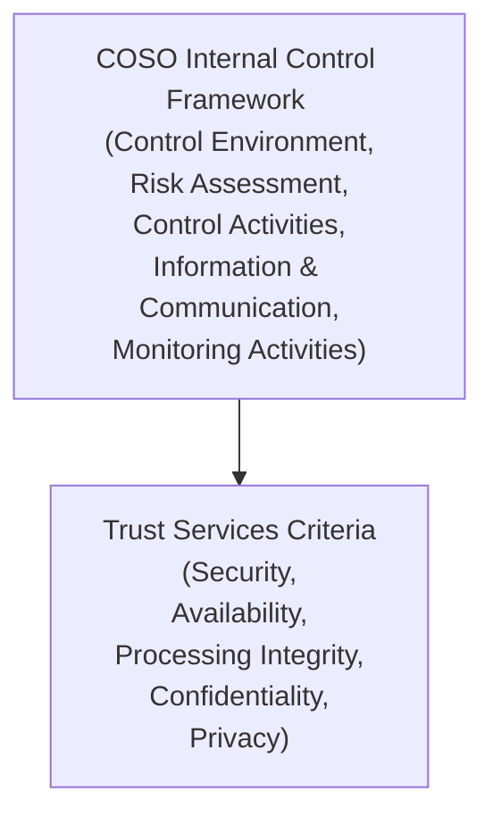

## 24.1 Trust Services Criteria (Security, Availability, Processing Integrity, Confidentiality, Privacy)

Trust Services Criteria (TSC) form the foundation for SOC 2® examinations and related assurance engagements. They serve as an essential benchmark for organizations seeking to demonstrate reliable controls over their systems and data. In today’s data-driven marketplace, stakeholders expect consistent and verifiable processes for safeguarding information. This section explores the five Trust Services Categories (Security, Availability, Processing Integrity, Confidentiality, and Privacy) and illustrates their relationship with the COSO Internal Control Framework. Mastering the TSC not only prepares CPAs for effective SOC 2® engagements but also strengthens organizations’ overall cybersecurity posture.

Many aspects of the TSC intersect with the concepts explored throughout this guide, particularly those in Chapter 4 (“Key Concepts of IT Audit and Assurance”) and Chapters 16–21 (“Foundations of Cybersecurity” through “Testing Security, Confidentiality, and Privacy Controls”). By leveraging these frameworks and best practices, CPAs can confidently deliver high-quality SOC 2® examinations.

  
Introduction to the Trust Services Criteria

The TSC are established by the AICPA’s Assurance Services Executive Committee (ASEC). They consist of control objectives and principles designed to provide reasonable assurance that an organization’s system meets stakeholder expectations. This is crucial for attestation movements, including SOC 2®—which specifically addresses non-financial controls relevant to Security, Availability, Processing Integrity, Confidentiality, and Privacy.

These criteria are grounded in the COSO framework to promote consistency and reliability. Each TSC reflects specific control objectives and sub-principles that guide how systems can be designed, implemented, and operated. Organizations can adopt one or more of the five categories depending on their environment and the needs or requests of stakeholders. However, Security—often called the “Common Criteria”—is always included, because it underpins the other four categories.

Below is a simplified Mermaid diagram illustrating the overarching alignment between the COSO Internal Control Framework and the TSC:  

By mapping the TSC to the five COSO components (Control Environment, Risk Assessment, Control Activities, Information and Communication, and Monitoring Activities), organizations gain a comprehensive lens through which to evaluate their systems.

  
Alignment with the COSO Internal Control Framework

The COSO Internal Control – Integrated Framework provides a robust structure for designing, implementing, and assessing internal controls. The five components of COSO (Control Environment, Risk Assessment, Control Activities, Information & Communication, and Monitoring Activities) form a continuous cycle ensuring ongoing effectiveness of controls. These COSO principles resonate within each TSC category. For instance:

• Control Environment: Management’s commitment to integrity, ethical values, and competence.  
• Risk Assessment: Identifying and analyzing potential threats to the achievement of objectives.  
• Control Activities: Actions established through policies and procedures to manage risks.  
• Information & Communication: Ensuring relevant information is identified, captured, and communicated effectively.  
• Monitoring Activities: Regular assessments of control operation and responsiveness to changing risks.

Each TSC category translates these components into criteria specific to system reliability. Let us examine each category in detail, including its primary objectives and alignment with COSO.

  
Security (Common Criteria)

Security—sometimes referred to as the Common Criteria—lies at the heart of every SOC 2® examination. Whether the scope includes Availability, Confidentiality, Processing Integrity, or Privacy, the Security category is mandatory. It provides a broad foundation of controls that address how organizations protect information and systems against unauthorized access, unauthorized disclosure, theft, or damage.

Definition and Key Objectives  
Security focuses on the safeguarding of systems and data. The organization must demonstrate controls designed to:  
• Restrict logical and physical access to systems and assets.  
• Manage system user access privileges, authentication, and session management.  
• Protect against external and internal threats such as malware, hacking, and insider threats.  
• Ensure ongoing monitoring for anomalies and potential breaches.

Alignment with COSO  
• Control Environment: Reinforces that senior leaders set a strong tone regarding disciplined security practices, such as consistent enforcement of security policies.  
• Risk Assessment: Involves identifying threats that can compromise systems or data (e.g., ransomware, phishing, unpatched vulnerabilities).  
• Control Activities: Could include enforcing multi-factor authentication (MFA), implementing intrusion detection systems, or using encryption protocols.  
• Information & Communication: Empowers the organization’s workforce with relevant security awareness training and communication channels for reporting issues.  
• Monitoring Activities: Regular security audits, continuous vulnerability scans, and log reviews detect anomalies promptly.

Real-World Scenario  
A financial services firm stores sensitive client data in a cloud-based SaaS platform. Security TSC coverage requires them to institute strong password policies, multi-factor authentication, network segregation for high-risk data, intrusion prevention systems, and employee training. Documented monitoring and escalation procedures ensure timely responses to suspected breaches.

  
Availability

Availability ensures that systems and services are operational and accessible as agreed upon or needed by enterprise stakeholders. While Security addresses the protection of data, Availability addresses the reliability of the underlying infrastructure.

Definition and Key Objectives  
Availability focuses on whether the system is available for operation and use. Key controls include:  
• Backup and recovery processes.  
• Capacity management.  
• Redundancy and failover solutions.  
• Business Continuity Planning.  
• Disaster Recovery strategies to maintain or promptly restore operations.

Alignment with COSO  
• Control Environment: Leadership establishes the importance of sustainable, continually available infrastructure.  
• Risk Assessment: Identifies potential disruptions that could impede system availability (e.g., hardware failure, power outages, distributed denial-of-service attacks, natural disasters).  
• Control Activities: Implementation of redundant data centers, load balancers, regular backup schedules, and resilient server configurations.  
• Information & Communication: Communication processes ensure staff know procedures during outages, how to escalate incidents, and how to reach alternative site resources if needed.  
• Monitoring Activities: Ongoing performance monitoring, incident response drills, and proactive system health checks to identify potential failures or capacity shortages before they escalate.

Real-World Scenario  
An e-commerce platform experiences a significant volume of sales transactions daily. To meet the Availability TSC, the company invests in secondary data centers, load-balanced server clusters, 24/7 support staff, and continuous CPU utilization monitoring to anticipate and address spikes in traffic.

  
Processing Integrity

Processing Integrity ensures system processing is complete, valid, accurate, timely, and authorized. It addresses the key question: does the system process data in a manner that is free from material errors or omissions?

Definition and Key Objectives  
Processing Integrity focuses on controls that ensure data transactions are processed as intended and without errors. Such controls might involve:  
• Validation checks to confirm data completeness and accuracy.  
• Automated and manual error handling components.  
• Input controls that verify the correct format and type of data.  
• Output controls to verify that system-generated results are consistent with business requirements.

Alignment with COSO  
• Control Environment: High-quality data processing standards and accountability are promoted by top management.  
• Risk Assessment: Identification of potential risks such as incorrect data uploads, incomplete transactions, or unauthorized changes to key records.  
• Control Activities: Integrity checks, balancing procedures, hashing or checksums for sensitive data, and reconciling output reports against source data.  
• Information & Communication: Data owners are informed about data processing procedures, error reporting, and resolution methods.  
• Monitoring Activities: Ongoing reconciliations, periodic test runs, transaction logging, and system-generated anomaly alerts to ensure ongoing accuracy.

Real-World Scenario  
Consider a payroll service provider handling direct deposit instructions for thousands of employees. Processing Integrity TSC coverage may require them to implement robust input validations, error-handling routines that detect incomplete account numbers, and reconciliation processes confirming net pay amounts match the total authorized by the client.

  
Confidentiality

Confidentiality emphasizes an organization’s ability to protect confidential information from unauthorized disclosure. While often used interchangeably with Security, Confidentiality specifically addresses the controls surrounding sensitive data handling, classification, and restriction.

Definition and Key Objectives  
Confidentiality focuses on limiting the use of confidential information only to authorized personnel and processes. Controls include:  
• Data classification policies that identify sensitive data.  
• Encryption for data at rest and in transit.  
• Access controls aligned with the principle of least privilege.  
• Non-disclosure agreements (NDAs) and other legal/contractual safeguards.  
• Procedures for secure data disposal at end-of-life.

Alignment with COSO  
• Control Environment: Management’s commitment to privacy and the appropriate handling of sensitive data fosters a culture of confidentiality.  
• Risk Assessment: Identifies potential data leakage points such as insecure transmission, storage, or disposal methods.  
• Control Activities: Implementation of data encryption, tight physical and logical access controls, and robust key management practices.  
• Information & Communication: Enterprise-wide policies ensuring staff awareness of data classification levels and handling requirements.  
• Monitoring Activities: Ongoing audits of user entitlements, file access logs, and escalation processes for any potential breach.

Real-World Scenario  
A law firm manages numerous client case files containing proprietary business information. Through the Confidentiality TSC, the firm applies encryption to client documents in transit, implements role-based access controls, and uses secure shredding or secure digital wiping at the conclusion of each matter.

  
Privacy

Privacy focuses on personal information—any data that can be used to identify an individual—and ensures it is collected, used, retained, disclosed, and disposed of in compliance with an organization’s privacy commitments and legal obligations.

Definition and Key Objectives  
Privacy addresses how personally identifiable information (PII) is managed. Controls help an organization:  
• Obtain, document, and respect individual consent.  
• Protect personal data during collection, use, retention, and disposal.  
• Comply with regional regulations (e.g., GDPR, CCPA, HIPAA).  
• Provide incident response and breach notifications when required by law.

Alignment with COSO  
• Control Environment: Leadership sets policies around ethical and lawful data handling, emphasizing data subjects’ rights.  
• Risk Assessment: Reviews exposure to privacy breaches or non-compliance with privacy regulations, including fines or reputational damage.  
• Control Activities: Strict roles-based permissions on personal data and processes for data subject requests (e.g., the right to be forgotten).  
• Information & Communication: Communication of privacy policies to data subjects and employees, plus established procedures for fulfilling data subject requests.  
• Monitoring Activities: Ongoing monitoring for policy deviations, periodic privacy impact assessments, and compliance reviews by internal or external auditors.

Real-World Scenario  
A health insurance company must align their collection, use, retention, and disposal of patient data with HIPAA regulations in the United States. Privacy TSC coverage ensures the organization enforces strict privacy controls such as HIPAA-compliant data transfers, standardized breach notifications, and data destruction protocols consistent with medical record retention laws.

  
Practical Considerations in Applying the TSC

In practice, organizations tailor the TSC to the specific scope of their system and the needs of stakeholders. For instance, a hosting provider might focus on Security and Availability, while a medical services company may add Confidentiality and Privacy to comply with HIPAA. A payment processor handling credit card data might center on Security, Availability, and Processing Integrity—plus a set of strict confidentiality controls to meet PCI DSS requirements.

Key steps when applying the TSC include:  
• Defining the system boundaries (e.g., networks, databases, cloud environments).  
• Documenting relevant controls that map to the TSC.  
• Periodically reviewing and testing these controls to ensure they remain effective.  
• Identifying and remediating any control gaps or deficiencies.  

  
Common Pitfalls and Best Practices

Pitfalls  
• Ignoring Subservice Organizations: Failing to address controls at cloud providers, payment processors, or other vendors can undermine the TSC.  
• Incomplete Scoping: Overlooking critical components of the IT environment leads to untested areas that might pose material risks.  
• Lack of Evidence: Documenting control operation is essential. If an organization cannot produce reliable logs and evidence, it may fail to meet TSC requirements.  
• Overlooking Staff Training: Even the strongest technical controls can be subverted by social engineering or misunderstandings if training is insufficient.

Best Practices  
• Establish Clear Policies and Procedures: Craft well-defined documents for security, confidentiality, privacy, and availability that align with your business processes.  
• Use Automation: Leverage automated monitoring, alerting, and reporting to quickly detect anomalies and reduce manual errors.  
• Conduct Continuous Risk Assessments: Maintain an ongoing cycle of identifying and evaluating risks. Update controls as your risk profile evolves.  
• Engage in Frequent Testing and Review: Whether through pen tests, vulnerability scans, or internal audits, these repeated evaluations help you stay ahead of threats.  
• Foster a Culture of Compliance: Train staff regularly, emphasize the importance of data integrity, and encourage secure practices across the organization.

  
Illustrative Case Study

A mid-sized technology startup, “DataSure Inc.,” needed a SOC 2® report to provide assurance to enterprise clients. DataSure Inc. delivers machine learning services using a cloud-based environment that ingests sensitive PII from its clients. After scoping, it was decided to include all five categories in their examination:  
• Security: Implementation of logging and intrusion detection systems, plus multi-factor authentication.  
• Availability: Continuous monitoring of server uptime, load balancing across geographically diverse data centers, and weekly backups stored offsite.  
• Processing Integrity: Automated checks verifying that machine learning training data is valid, with thorough review of any flagged data anomalies.  
• Confidentiality: Encryption of uploaded PII both in transit and at rest, combined with internal data classification.  
• Privacy: Formal program ensuring data subjects’ rights and compliance with international regulations (e.g., GDPR) including the right to erasure and data access.  

Mapping each TSC requirement to the COSO framework, DataSure Inc. designed robust controls that passed the SOC 2® examination with no major exceptions reported. This accomplishment greatly enhanced the trust prospective clients placed in the startup.

  
Summary and Conclusion

The Trust Services Criteria are a critical component of SOC 2® reporting, guiding organizations to implement and maintain structured controls that address data protection and system reliability. Each category—Security, Availability, Processing Integrity, Confidentiality, and Privacy—aligns with the five components of the COSO Internal Control Framework, reinforcing consistent oversight across business processes. By incorporating these criteria, organizations not only strengthen stakeholder confidence but also position themselves to adapt to changing regulatory environments, emerging cyber threats, and evolving customer expectations.

  
## Explore the Trust Services Criteria with Confidence: Knowledge Assessment



### Which of the following best defines the “Security” Trust Services Criterion in a SOC 2® engagement?

- [ ] Ensuring the system is accessible for operation and use as committed.  
- [ ] Safeguarding personal data and maintaining individuals’ rights.  
- [x] Protecting systems and data from unauthorized access, theft, or disruption.  
- [ ] Verifying that data is processed accurately and completely.  

> **Explanation:** Security (the Common Criteria) focuses on preventing unauthorized access, theft, or misuse of data and systems, forming a base requirement for every SOC 2® engagement.

### Which COSO component most directly addresses the process of ongoing vulnerability scans, security audits, and log reviews to detect anomalies?

- [ ] Information & Communication  
- [ ] Control Environment  
- [ ] Risk Assessment  
- [x] Monitoring Activities  

> **Explanation:** Monitoring Activities is the COSO component that involves ongoing or separate evaluations to ascertain whether the controls are present and functioning as intended.

### Why is Availability an essential TSC for an online retailer or e-commerce marketplace?

- [x] It ensures systems remain operational to handle transactions, preventing revenue loss.  
- [ ] It safeguards the handling of personal data by third-party service providers.  
- [ ] It focuses exclusively on encryption and key management practices.  
- [ ] It validates that data has been processed completely and accurately.  

> **Explanation:** Availability deals with maintaining system uptime and accessibility, which is critical for online retailers reliant on continuous operations to generate sales and maintain customer satisfaction.

### Under the Processing Integrity TSC, which control activity helps verify that data posted to a general ledger is not missing any transactions?

- [x] Input validation checks and reconciliations of transaction counts.  
- [ ] Encryption of the database containing transaction logs.  
- [ ] Strict capacity management of servers.  
- [ ] Privileged access controls for system administrators.  

> **Explanation:** Processing Integrity focuses on complete and accurate data processing. Reconciliations and validation checks ensure that no transactions are missing or duplicated.

### Which example best aligns with the Confidentiality TSC?

- [x] Encrypting sensitive customer contract PDFs at rest and in transit.  
- [ ] Maintaining a client-facing service with 99.99% uptime availability.  
- [x] Limiting physical access to offices housing confidential servers.  
- [ ] Implementing AI-driven process automation.  

> **Explanation:** Confidentiality requires guarding sensitive data from unauthorized disclosure, often involving encryption, secure physical access, and properly classifying data.

### What is one major distinction between Security and Confidentiality within the TSC?

- [x] Security focuses broadly on preventing unauthorized access, while Confidentiality addresses controls for sensitive data classification and handling.  
- [ ] Confidentiality is mandatory, while Security is optional.  
- [ ] Confidentiality deals exclusively with backups and recovery strategies.  
- [ ] Security is only relevant for e-commerce systems.  

> **Explanation:** Security is an overarching requirement dealing with secure system architecture. Confidentiality more specifically addresses the control and handling of sensitive data, such as data classification, encryption, and authorized use.

### Which TSC is most directly concerned with collecting, using, retaining, and disclosing personal information in accord with laws and commitments?

- [ ] Availability  
- [x] Privacy  
- [ ] Security  
- [ ] Processing Integrity  

> **Explanation:** Privacy focuses on handling PII in alignment with regulations (e.g., GDPR, CCPA) and stated commitments, including consent and data subject rights.

### According to COSO, which component ensures that policies and procedures are effectively communicated across the organization?

- [ ] Monitoring Activities  
- [x] Information & Communication  
- [ ] Risk Assessment  
- [ ] Control Activities  

> **Explanation:** Information & Communication ensures relevant information is captured and disseminated timely to those who need it, including training and policy updates.

### Why might an organization choose to include all five TSC categories in a SOC 2® engagement rather than only Security?

- [x] Comprehensive coverage can strengthen stakeholder trust and address broader risk areas.  
- [ ] Only certain industries are allowed to choose fewer than five categories.  
- [ ] It is a regulatory requirement for all SOC 2® reports.  
- [ ] None of the other categories outside Security provide meaningful value.  

> **Explanation:** While Security is mandatory, an organization can include Availability, Processing Integrity, Confidentiality, and Privacy to provide a more holistic assurance and address additional stakeholder concerns.

### Security TSC is always included in SOC 2® engagements.

- [x] True  
- [ ] False  

> **Explanation:** Security is considered the “Common Criteria” in SOC 2®. It underpins all other TSC categories and is therefore mandatory in every SOC 2® examination.



  
## For Additional Practice and Deeper Preparation

### [Information Systems and Controls (ISC)](https://www.udemy.com/course/isc-cpa-mock-exams/?referralCode=E1217303222935C5E464)  

**Information Systems and Controls (ISC) CPA Mocks:** 6 Full (1,500 Qs), Harder Than Real! In-Depth & Clear. Crush With Confidence!  

- Tackle full-length mock exams designed to mirror real ISC questions.  
- Refine your exam-day strategies with detailed, step-by-step solutions for every scenario.  
- Explore in-depth rationales that reinforce higher-level concepts, giving you an edge on test day.  
- Boost confidence and minimize anxiety by mastering every corner of the ISC blueprint.  
- Perfect for those seeking exceptionally hard mocks and real-world readiness.  

_Disclaimer: This course is not endorsed by or affiliated with the AICPA, NASBA, or any official CPA Examination authority. All content is for educational and preparatory purposes only._
