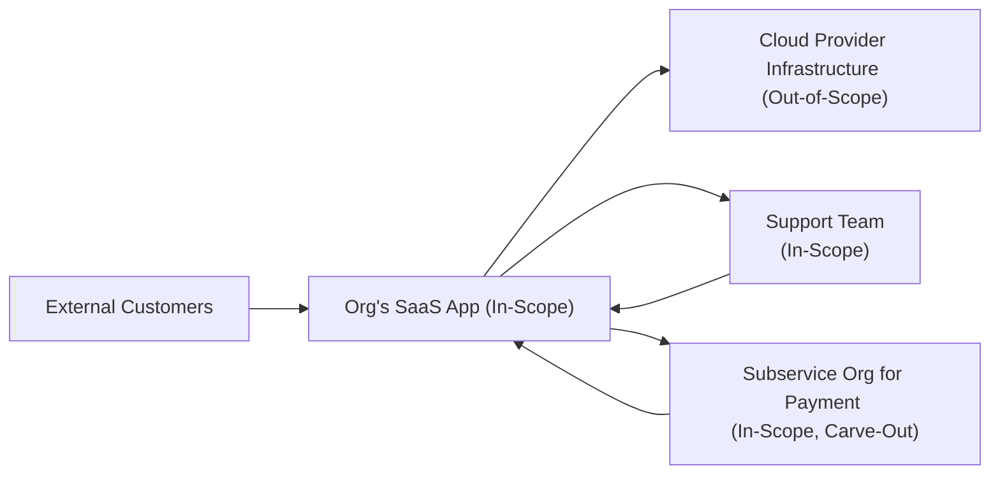

## 24.2 SOC 2® Description Criteria and System Boundaries

Establishing clear and accurate system boundaries is a cornerstone of any SOC 2® examination. The Description Criteria (DC) mandated by the AICPA require management to define and disclose critical aspects of the in-scope system. This process involves clarifying which hardware, processes, policies, procedures, personnel, and data flows uphold the Trust Services Criteria (TSC)—Security, Availability, Processing Integrity, Confidentiality, and Privacy. In this section, we will explore SOC 2® Description Criteria in detail, demonstrate how to define system boundaries to avoid misrepresentations, and provide practical scoping tips drawn from real-world experiences.

---
### Overview of the Description Criteria
The SOC 2® Description Criteria (often referred to as DC) help ensure that the service organization’s system is presented fairly in the description. These criteria cover the following key elements:

• Nature of the services provided  
• Components of the system used to provide those services (infrastructure, software, data, people, and processes)  
• Boundaries and specific exclusions from the description  
• System objectives, risks that threaten the achievement of those objectives, and applicable controls  
• Relevant subservice organizations and third-party providers, if any  
• Commitments, system requirements, or governance factors that guide how controls must be designed and operated  

These criteria ensure that all essential aspects of the organization’s system—particularly those relevant to the Trust Services Categories—are transparent to report users. As a CPA or system auditor, your objective is to verify that management’s description aligns with reality, provides accurate coverage of controls, and discloses limitations or exclusions in a manner consistent with achieving the defined system objectives.

---
### Key Components of a SOC 2® System Description
Because the Description Criteria mandate full transparency, the system description typically addresses the following components:

• Infrastructure: Physical and virtual infrastructure used to deliver the service (e.g., servers, cloud environments, firewalls, routers, data centers).  
• Software: Programs, applications, and operating systems that manage or support the services.  
• People: Roles and responsibilities of personnel who operate, maintain, or monitor relevant system components.  
• Processes and Procedures: Manual and automated workflows, change management protocols, service-level agreements (SLAs), and other operational processes that affect quality, security, and continuity.  
• Data: Information and documentation (e.g., customer data, system logs, backup data) relevant to the organization’s service commitments and system requirements.  

Each of these elements should be considered to ensure an accurate representation of how the system functions and how it addresses the organization’s commitments and requirements for security, availability, processing integrity, confidentiality, and privacy.

---
### Defining System Boundaries
System boundaries delineate the scope of the SOC 2® engagement and describe where the system’s responsibilities begin and end. Proper definition of boundaries helps avoid confusion about which processes are in scope, who is responsible for specific controls, and how subservice organizations interrelate.

Well-defined boundaries generally include:
1. A logical and/or physical perimeter that encompasses all system components used to provide the services.  
2. Definition of in-scope controls around access and change management for those components.  
3. Clarification on third-party systems—distinguishing between subservice organizations and user entities.  

#### Examples of System Boundaries to Avoid Misrepresentations

1) Fully Managed Data Center Model:  
   • In-scope: Rack-space, network equipment controlled by the organization, operating systems, and applications.  
   • Out-of-scope: Physical security controls at the colocation facility (handled by the colocation provider as a subservice organization).  

2) SaaS Application on a Public Cloud:  
   • In-scope: Custom code, configuration settings, user-facing application security, logical access controls.  
   • Out-of-scope: Underlying physical infrastructure, hypervisor security controls, physical security at the cloud vendor’s data centers (covered under the cloud vendor’s own SOC report).  

3) Multi-Service Organization with Shared Services:  
   • In-scope: Network segmentation for a specific business unit, user provisioning within that unit, cross-department data flows relevant to that service.  
   • Out-of-scope: Systems used exclusively by unrelated departments that do not store or process in-scope data.  

The ultimate goal is that report readers obtain a clear, consistent understanding of how the system is structured and secured. Inaccurate or incomplete boundary descriptions might lead users to misunderstand the scope of the controls tested or incorrectly assume coverage of areas that are not truly in scope.

---
### Practical Diagram: Visualizing System Boundaries
Below is a simple Mermaid diagram illustrating logical boundaries around a SaaS application. The in-scope boundary (in blue) includes only the environments and processes under direct control of the service organization.

• The “Org’s SaaS App (In-Scope)” node highlights modules and services for which the organization has direct operational control, potentially including code repositories, user provisioning, and data processing.  
• “Cloud Provider Infrastructure” is out of scope if the organization relies on the provider’s SOC report to cover physical and environmental controls.  
• A subservice organization such as a payment processor might be considered an in-scope carve-out if the organization depends on the subservice’s controls to meet service commitments, but those controls are tested separately by the subservice’s own SOC engagement.  

---
### Importance of Avoiding Under- and Over-Scoping
Striking the right balance in your system description can be challenging. Under-scoping occurs when critical processes or components that affect the Trust Services Criteria are inadvertently omitted, causing critical control gaps. Over-scoping involves including too many system elements, burying essential details among irrelevant information and creating confusion in the final report.

##### Under-Scoping Risks:
• Key third-party services that process or store sensitive data are left unmentioned.  
• Certain aspects of a new module or feature remain undisclosed, causing coverage gaps.  
• Material controls implemented by subservice organizations are not properly identified or described.  

##### Over-Scoping Risks:
• Including components not directly relevant to the service provided.  
• Overwhelming report readers with unnecessary details, making it difficult to pinpoint core controls.  
• Higher audit costs and increased time for both management and auditors, as they review extraneous systems.  

A balanced scope ensures that all relevant security and operational aspects are captured in the final SOC 2® report, without diluting the impact of key controls or misrepresenting the system’s risk profile.

---
### Balancing Description Criteria with Real-World Complexity
Many service organizations frequently adopt hybrid arrangements—where on-premises infrastructure blends with cloud services, or multiple subservice organizations operate in parallel. In such cases, fully describing system boundaries according to the Description Criteria can become complex.

Key considerations:
• Clearly state if the organization uses a carve-out or inclusive method to disclose subservice organizations (see also Chapter 23 on SOC 1® Examinations for details on inclusive vs. carve-out approaches).  
• Use flowcharts or diagrams to illustrate data flow across different providers.  
• Summarize major responsibilities around user-access provisioning, patch management, and other relevant IT general controls (refer to Chapter 8, “IT General Controls (ITGC) – Standard Domains,” for best practices).  
• Emphasize relevant portions of the system supporting key TSC aspects, such as encryption for confidentiality or system redundancy for availability.  

#### Real-World Example
Imagine a healthcare technology provider offering a cloud-based Electronic Medical Records (EMR) platform. The provider might rely on a third party for secure storage (object-based cloud storage) and on another HIPAA-compliant service for claims processing. Each of these subservice organizations must be clearly addressed in the system description:

• The EMR platform’s own code, user interface, data analytics, and direct interactions form part of the in-scope system boundaries.  
• The subservice organizations (e.g., secure cloud storage, claims processor) are recognized as carve-out subservice organizations, and their respective controls are not tested directly but disclosed as part of the overall system design.  
• The EMR provider references these subservice organizations’ SOC 2® or other third-party verifications to satisfy portions of the Trust Services Criteria.  

---
### Mapping Description Criteria to the Trust Services Categories
The AICPA’s TSC revolve around Security, Availability, Processing Integrity, Confidentiality, and Privacy. While your SOC 2® scope may focus on one or multiple categories, your system description should thoroughly explain how each relevant category is addressed. For instance:

• Security: Clarify boundary conditions for your firewall, intrusion detection systems, and user authentication mechanisms.  
• Availability: Describe redundancy, failover, and business continuity processes within the boundary.  
• Processing Integrity: Elaborate on relevant input validation protocols, job scheduling, and data processing checkpoints.  
• Confidentiality: Identify data protection methods for data-at-rest, data-in-transit, and disposal/destruction policies.  
• Privacy: Depending on the organization’s privacy commitments, specify how personal data is collected, processed, retained, and disclosed.  

By correlating each TSC with the respective system components, you produce a holistic portrait that underscores accountability and fosters trust among customers and stakeholders.

---
### Effective Scoping Tips
1. Perform a Formal Risk Assessment: Begin scoping by identifying the potential risks that could threaten your organization’s security, availability, integrity, confidentiality, or privacy objectives. The boundaries flow naturally from focusing on high-risk areas.  
2. Leverage System Inventories: Document hardware, software, and processes to create a baseline of in-scope components. Eliminating unrelated systems ensures you remain focused.  
3. Align with Stakeholders: Collaborate with system owners, security teams, and operational staff to confirm accuracy. Misaligned definitions can lead to critical oversight or duplicative efforts.  
4. Reference Subservice Organization Reports: Review and incorporate relevant information from subservice organizations’ SOC reports and ensure that any user entity controls or complementary subservice organization controls (CSOCs) are properly disclosed.  
5. Update Regularly: As systems evolve through new features, acquisitions, or migrations, scoping should remain dynamic. Routine reevaluation preserves SOC 2® relevance over time.

---
### Common Pitfalls and How to Overcome Them

1) Under-Communication of Scope Changes:  
   • Pitfall: Failing to inform the auditors about new technology stacks or additional service offerings reduces the effectiveness of the SOC 2®.  
   • Strategy: Maintain open communication with auditors and update your system description at key milestones (e.g., new data center, major software release).

2) Inadequate Documentation of Subservice Organizations:  
   • Pitfall: Overlooking subservice organizations undermines the credibility of the report, leading to confusion about control responsibilities.  
   • Strategy: Identify all pertinent third-party providers at the onset of the examination, specify whether an inclusive or carve-out method is used, and describe any complementary subservice organization controls.

3) Conflicting or Redundant Descriptions:  
   • Pitfall: Different teams produce inconsistent documents—resulting in contradictory claims about system coverage.  
   • Strategy: Leverage a structured framework, such as COBIT (see Chapter 3.3), to unify documentation and ensure consistency in describing governance philosophies and system operations.

4) Omission of Exceptions or Limitations:  
   • Pitfall: Neglecting to mention known deficiencies or known system limitations, leading to a misleading portrayal of the system.  
   • Strategy: Document all material exceptions in the system description, along with management’s remediation plans or compensating controls.

---
### Case Study: Defining Boundaries in a Growing SaaS Start-Up
A fast-growing SaaS start-up offering workflow automation capabilities decided to pursue a SOC 2® report covering Security and Availability. Initially, they stored customer data on a multi-tenant platform in a public cloud environment and used DevOps practices to manage frequent software releases.

• Key Challenge: Determining which aspects of the cloud infrastructure were in scope and how to address the shared responsibility model.  
• Approach: They mapped out logical boundaries that placed the customized infrastructure for their workflow automation in scope, while relying on the cloud provider’s SOC 2® for physical security and certain network controls.  
• Outcome: They published a concise SOC 2® report showing well-defined boundaries, referencing the host cloud provider’s coverage for lower-level controls, and focusing their own description on code, software pipelines, user authentication, encryption at rest, and relevant subservice organizations. This alignment provided customers with a robust understanding of how the SaaS platform secured their data, managed uptime, and handled incident response—without overwhelming them with the entire stack’s details.

---
### Conclusion
Crafting comprehensive and precise system boundaries in line with SOC 2® Description Criteria is essential for shaping an accurate portrayal of the controls and processes that safeguard critical data and maintain service reliability. By diligently determining inclusion and exclusion parameters, managing subservice organization relationships, and avoiding under- or over-scoping, service organizations and their CPAs can produce credible, transparent, and value-adding reports. Remember, your overall objective is to convey a balanced narrative of your system’s design, controls, and risks—thereby earning the trust and confidence of stakeholders who rely on the SOC 2® engagement’s findings.

An effective system description showcases mastery of technical, operational, and risk management considerations, underscoring the organization’s dedication to high-quality service delivery. As you progress through your SOC 2® engagements, you’ll find that meticulous scoping and boundary definition often become the bedrock of the entire SOC process, setting the stage for robust testing, accurate reporting, and meaningful insights into the effectiveness of your security and control environment.

---
## Test Your Knowledge: SOC 2® Description Criteria & System Boundaries



### Which of the following best describes “system boundaries” in a SOC 2® engagement?
- [ ] The corporate policies and procedures of the service organization.  
- [x] The logical and/or physical perimeter of the system in scope for the SOC 2®.  
- [ ] The contract agreements between the user entity and the subservice organizations.  
- [ ] The set of external compliance regulations that the service organization must satisfy.  

> **Explanation:** System boundaries define the logical and physical perimeter for what is included (or excluded) in the SOC 2® report and are essential for clarity about the controls in scope.

### What is a primary risk of under-scoping a SOC 2® examination?
- [ ] Overloading the report with unnecessary information.  
- [ ] Confusing report recipients with superfluous details.  
- [x] Omitting critical controls or processes that impact data security or reliability.  
- [ ] Shifting control accountability to subservice organizations.  

> **Explanation:** Under-scoping may exclude vital systems or processes, causing potential control gaps and undermining the SOC 2® report’s reliability.

### Which of the following elements is typically included in the in-scope system description for a SOC 2®?
- [x] Personnel roles and responsibilities for service delivery.  
- [ ] Financial statements of the service organization.  
- [ ] Non-essential administrative forms.  
- [ ] Only hardware owned by the service organization.  

> **Explanation:** A SOC 2® system description typically includes people, processes, and technology directly related to delivering and securing the services—principally roles and responsibilities for operating the system.

### A carve-out approach is used for:
- [ ] Including subservice organizations in the scope of the SOC 2®.  
- [ ] Excluding all cloud-based services from the system description.  
- [x] Specifying subservice organizations whose controls are not tested but are disclosed.  
- [ ] Consolidating multiple service organizations under one SOC 2® report.  

> **Explanation:** By using a carve-out approach, the service organization discloses subservice organizations but excludes testing the subservice’s controls, often referring to the subservice organization’s own SOC reports.

### When discussing system boundaries, “over-scoping” occurs when:
- [x] Excessive, unrelated systems are included alongside necessary ones.  
- [ ] Key controls are left out, making the scope too narrow.  
- [x] Subservice organizations are analyzed in detail, even if irrelevant.  
- [ ] The vendor management function is overlooked.  

> **Explanation:** Over-scoping leads to including components not essential to the service or the Trust Services Criteria, potentially overcomplicating the examination and confusing report users.

### Which of the following is generally out-of-scope for a SaaS provider’s SOC 2® examination?
- [x] Physical security controls at the public cloud data center if they rely on the cloud provider’s SOC report.  
- [ ] Application access controls and user provisioning managed by the SaaS provider.  
- [ ] Encryption of customer data handled by the SaaS provider.  
- [ ] Incident response procedures that the SaaS provider implements.  

> **Explanation:** If the SaaS provider relies on the cloud provider’s SOC report for physical security, those controls usually remain out of scope for the SaaS provider’s own SOC 2® report.

### What is a recommended first step in determining the boundaries of a SOC 2® system description?
- [ ] Submitting all relevant logs for external review.  
- [x] Conducting a formal risk assessment to identify high-risk components and processes.  
- [ ] Creating a purely theoretical model of the system’s architecture.  
- [ ] Completing a financial audit of the service organization’s annual statements.  

> **Explanation:** Starting with a risk assessment ensures the system scope includes critical components that directly impact the Trust Services Criteria.

### How can an organization ensure consistency in its SOC 2® system description?
- [ ] Assign each department to write its own section without a unified framework.  
- [ ] Introduce major changes after the examination has begun.  
- [x] Use a standardized framework (e.g., COBIT) for consistent documentation.  
- [ ] Focus only on the final auditor’s recommendations while ignoring other stakeholders.  

> **Explanation:** Employing recognized frameworks like COBIT helps maintain consistent language, structure, and detail, preventing contradictions and redundancy in the final description.

### Which statement about a “subservice organization” is correct?
- [ ] They are part of the user entity’s internal control structure.  
- [x] They provide essential services for the service organization but operate controls outside the immediate scope of the service organization’s SOC 2®.  
- [ ] They must undergo the same level of testing as the main service organization.  
- [ ] They typically have no impact on the overall SOC 2® scope or boundaries.  

> **Explanation:** Subservice organizations deliver functions on which the main service relies, hence affecting the Trust Services Criteria. Their controls may be tested indirectly or in a separate SOC examination.

### True or False: A service organization should regularly update its system boundaries and description to reflect major changes in processes, technology, or subservice relationships.
- [x] True  
- [ ] False  

> **Explanation:** Regular updates help preserve the accuracy, relevance, and credibility of the SOC 2® report and ensure alignment with any new risks or system updates.



---
## For Additional Practice and Deeper Preparation

### [Information Systems and Controls (ISC)](https://www.udemy.com/course/isc-cpa-mock-exams/?referralCode=E1217303222935C5E464)

**Information Systems and Controls (ISC) CPA Mocks:** 6 Full (1,500 Qs), Harder Than Real! In-Depth & Clear. Crush With Confidence!  

- Tackle full-length mock exams designed to mirror real ISC questions.  
- Refine your exam-day strategies with detailed, step-by-step solutions for every scenario.  
- Explore in-depth rationales that reinforce higher-level concepts, giving you an edge on test day.  
- Boost confidence and minimize anxiety by mastering every corner of the ISC blueprint.  
- Perfect for those seeking exceptionally hard mocks and real-world readiness.  

_Disclaimer: This course is not endorsed by or affiliated with the AICPA, NASBA, or any official CPA Examination authority. All content is for educational and preparatory purposes only._
