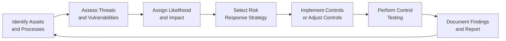

## 24.3 Risk Assessment and Testing Controls for SOC 2®

Risk assessment is a foundational component of any SOC 2® engagement, ensuring that an organization has properly identified and responded to threats, vulnerabilities, and exposures that could prevent it from meeting the Trust Services Criteria (TSC). Once risks are identified, testing the associated controls provides assurance that the systems, processes, and policies in place will effectively reduce those risks to acceptable levels. In this section, we discuss the essentials of risk assessment in a SOC 2® context, explore the different types of testing approaches, and highlight practical techniques and best practices that service auditors can leverage when conducting a SOC 2® engagement.

-------------------------------------------------------------------------------
## Understanding Risks in the Context of SOC 2®

A crucial first step in planning a SOC 2® examination is acknowledging that each entity has unique business objectives, operational contexts, and technology environments. Within that context, not all potential risks are equally significant. The pairwise alignment of risks to each TSC (Security, Availability, Processing Integrity, Confidentiality, and Privacy) ensures that the selection and design of controls truly address the most material risk factors.

• Security: Risks might involve unauthorized access, data breaches, and system tampering.  
• Availability: Risks involve downtime, denial-of-service (DoS) attacks, system outages, and other disruptions.  
• Processing Integrity: Risks relate to incomplete or inaccurate transaction processing and data manipulation.  
• Confidentiality: Risks include sensitive data exposure, unauthorized disclosure to third parties, and misclassification of confidential information.  
• Privacy: Risks center on the misuse or over-collection of personal data, lack of data subject consent, or non-compliance with privacy laws and regulations.

These categories are interconnected; a security threat such as a phishing scam can jeopardize both Security and Confidentiality. Hence, when identifying risks, it is crucial to understand how threats can propagate from one category to another if left unmitigated.

-------------------------------------------------------------------------------
## Risk Assessment Methodology

A formal, structured risk assessment methodology helps ensure that relevant risks are identified and documented in a consistent manner. Common methodologies used in practice include NIST SP 800-30, ISO 27005, or a custom in-house process aligned with COSO ERM. Below is a flexible four-step approach that can be applied broadly in SOC 2® engagements:

1. Identify Assets and Processes  
   Begin by cataloging the systems, data sets, and business processes within the scope of the SOC 2® examination. For example, an e-commerce provider might list its shopping cart application, database systems, fulfillment processes, and third-party integrations.

2. Identify Threats and Vulnerabilities  
   Brainstorm potential threats (e.g., malicious insiders, hackers, natural disasters, software bugs) and vulnerabilities (e.g., unpatched systems, weak access controls) applicable to these assets and processes. Consider relevant standards or frameworks (NIST CSF, COBIT) to ensure thorough coverage.

3. Evaluate Likelihood and Impact  
   Assess how likely each identified threat is to occur and the degree of business impact if it materializes. Impact considerations may be financial losses, reputational harm, or regulatory non-compliance. Weigh these factors to develop a preliminary priority level for each threat.

4. Determine Risk Response  
   For each high-priority risk, decide whether to accept, avoid, reduce, or transfer it—often known as the “risk response.” Reducing risk typically involves implementing or strengthening controls; transferring risk might entail cyber insurance coverage.

This assessment serves as the roadmap for deciding which controls (and trust service categories) warrant the greatest focus during the SOC 2® examination.  

-------------------------------------------------------------------------------
## Identifying Relevant Risks for Each Trust Service Category

While some risks extend across multiple categories, it is often helpful to evaluate them through the lens of each TSC. Below is a common breakdown of risk factors. Use this table as a starting reference, tailoring to the specific organizational environment.

| Trust Service Category | Example Risk Factors                                              |
|------------------------|--------------------------------------------------------------------|
| Security              | • Unauthorized system access   • Inadequate encryption   • Administrator privilege misuse |
| Availability          | • Hardware failures   • Network outages or bandwidth constraints   • Denial-of-Service attacks  |
| Processing Integrity  | • Erroneous processing logic causing data duplication or loss   • Transaction batch failures   • Unhandled exceptions in scripts and apps |
| Confidentiality       | • Accidental disclosure of confidential info in logs   • Insecure transmission of data   • Misconfigured SFTP servers allowing external access |
| Privacy               | • Lack of valid user consent for personal data collection   • Retention of personal data beyond established period   • Weak data subject access request (DSAR) process |

Each risk identified above should directly correlate to at least one control aimed at mitigating it. In practice, organizations may identify multiple controls per risk, depending on the severity or complexity of the underlying threat.

-------------------------------------------------------------------------------
## Control Documentation and Mapping

Before or during the formal risk assessment, it is often helpful to consolidate all relevant controls in a single repository (e.g., a controls matrix) keyed to the TSC requirements. This matrix typically identifies:

• The specific control objective or TSC principle (e.g., “Security principle: system protected against unauthorized access”).  
• The name or descriptive label of the control (e.g., “Multi-factor authentication for remote access to corporate network”).  
• The underlying process or IT system impacted by the control (e.g., Active Directory, privileged access management solution).  
• The risk(s) addressed by the control.  
• Evidence or documentation that will demonstrate the control’s operation.

This matrix not only serves as a reference for the auditor but also simplifies scoping decisions and alignment with the broader business objectives of the engagement.

-------------------------------------------------------------------------------
## Evaluating Control Design vs. Control Operation

SOC 2® engagements differentiate between:
• Type 1: Evaluation of the design and implementation of controls at a point in time.  
• Type 2: Evaluation of the design and operating effectiveness of controls over a specified period.  

If the engagement is Type 2, the auditor will need to assess:

1. Control Design: Were the controls appropriately designed to mitigate identified risks? Even if a control is well designed, improper implementation can undermine its effectiveness.  
2. Operating Effectiveness: Did the control function effectively throughout the audit period? For example, does a firewall rule set remain properly configured and monitored all year?

-------------------------------------------------------------------------------
## Typical Testing Approaches

Auditors typically use a combination of testing approaches—often called the “nature of testing”—to verify the operating effectiveness of controls. The most common procedures are:

1. Inquiry  
   • Gaining a high-level understanding of a process by interviewing key personnel.  
   • Helps form a baseline understanding of how a control is intended to operate.  
   • Example: Asking the system administrator to describe how patch management is performed, from receiving updates to deploying patches.

2. Observation  
   • Watching employees perform control activities or processes in real time.  
   • Useful for verifying physical controls (e.g., locked server rooms) or real-time tasks (e.g., employee log-in procedures).  
   • Example: Observing an access request process to ensure manager approval is indeed obtained prior to granting user privileges.

3. Inspection  
   • Reviewing documentation such as procedures, configurations, audit logs, or transaction records.  
   • Example: Inspecting firewall rule sets to confirm that only authorized ports and IP addresses are allowed.

4. Re-performance (or Re-execution)  
   • Independently repeating the process or control activity to validate that it yields consistent results.  
   • Example: Testing a sample of terminated user accounts in Active Directory to ensure they are truly disabled and removed from secure groups.

5. Data Analytics  
   • Using specialized tools to analyze large volumes of audit logs or transaction data for anomalies.  
   • Example: Running scripts to identify accounts with excessive privileges or unusual access patterns across hundreds of systems.

6. External Confirmation (Less Common)  
   • Reaching out to third parties for verification that certain controls or processes have been implemented.  
   • Example: Contacting a security vendor or subservice organization to confirm the scope of services provided and relevant responsibilities.

The auditor’s choice of testing methods depends on risk severity, control complexity, and sample volume. Typically, the auditor will combine multiple testing methods to gain sufficient evidence of control effectiveness.

-------------------------------------------------------------------------------
## Frequency and Sample Size

Determining how many samples to test—or how frequently to apply the testing procedures—is a key decisions auditors face in SOC 2® engagements. In general:

• The higher the risk factor, the larger the sample size or more comprehensive the testing coverage.  
• Highly automated controls often require less sampling than manual controls, provided the automated processes are robust and well-documented.  
• Periodic controls (e.g., monthly reviews) typically require review of multiple instances to ensure consistent, reliable application.

For instance, if an organization’s risk assessment reveals that user-access provisioning is a high-risk control domain, the auditor may opt for a larger sample of user provisioning requests across multiple months to ensure there are no overlooked exceptions.  

-------------------------------------------------------------------------------
## Coordinating Test Plans with Management and Other Stakeholders

Close collaboration with organizational stakeholders is essential for success in planning and executing the SOC 2® program. Typically, the following steps help streamline test activities:
  
• Engage the control owner or process owner early in the engagement to clarify the timing, scope, and sample criteria.  
• Document the populations (e.g., lists of user accounts, system updates, transactions) from which samples will be selected.  
• Consider the role of subservice organizations, verifying how their controls align with documented complementary subservice organization controls (CSOCs) or how they impact your overall scope.  
• Communicate any findings that require immediate remediation so that management can begin corrective action during the engagement rather than waiting for the final report.

A coordinated approach reduces confusion, rework, and stakeholder fatigue, and it often leads to more efficient evidence gathering.

-------------------------------------------------------------------------------
## Practical Examples and Case Studies

Below are two hypothetical examples illustrating risk assessment and testing controls in typical SOC 2® scenarios.

### Example 1: Cloud-Based Payroll Service

1. Risk Identification  
   The cloud service processes payroll for dozens of clients. Risks include unauthorized access to payroll records (Security), inability to run payroll on time (Availability), and inaccurate payroll calculations (Processing Integrity).

2. Control Identification  
   • MFA on all administrative accounts (Security).  
   • Redundant data centers for failover in event of hardware failure (Availability).  
   • Validation checks in payroll application to detect anomalies (Processing Integrity).

3. Testing  
   • The auditor inspects configuration settings in the identity management system and re-performs account lockouts.  
   • The auditor reviews documentation on data center redundancy and observes live failover tests (if feasible during the audit window).  
   • The auditor inspects sample pay runs and re-performs selected calculations to confirm correct data was used.

### Example 2: E-Commerce Retailer

1. Risk Identification  
   The retailer uses a third-party shipping interface and maintains personal data for marketing. Risks involve credit card theft (Security, Confidentiality), system outages during peak sales (Availability), incorrect shipping addresses (Processing Integrity), and improper handling of customers’ personal information (Privacy).

2. Control Identification  
   • Firewall and web application firewall rules (Security).  
   • Automatic scaling for web servers during surge traffic (Availability).  
   • Real-time address validation mechanism from a third-party partner (Processing Integrity).  
   • Privacy policy with explicit consent prompts for email marketing (Privacy).

3. Testing  
   • The auditor inspects firewall logs, re-performs address validation using test accounts, and reviews privacy consent screens.  
   • The auditor uses data analytics to search for anomalies in shipping address logs.  
   • The auditor examines evidence of scaling events during promotional periods, including system performance logs and relevant SLA reports.

-------------------------------------------------------------------------------
## Common Pitfalls and Best Practices

• Overlooking Subservice Organizations: When subservice organizations or outsourced IT components are in scope, it is essential to understand their controls (and any complementary user entity controls—CUECs) for accurate risk assessment.  
• Underestimating Non-Technical Risks: Controls are not always purely technical; assign appropriate weight to processes like incident response, employee awareness training, or vendor oversight.  
• Failure to Update Risk Assessments: The risk environment can change quickly, especially when new service offerings or infrastructures (e.g., cloud migrations, DevOps) are introduced mid-year. Keep the risk assessment continuous and current.  
• Coordination Among Stakeholders: Disjointed communication between internal audit, IT management, and process owners often leads to duplicative efforts or evidence gaps. Early and frequent communication fosters completeness and efficiency.  
• Right-Sizing Sample Sizes: Aim for a balanced approach to testing that reflects actual risk levels. Excessive sampling can delay the engagement, while insufficient sampling can yield incomplete evidence.

-------------------------------------------------------------------------------
## Visualizing the Risk Assessment Lifecycle

Below is a simple Mermaid diagram depicting a high-level flow of how risk assessment fits into the overall SOC 2® engagement process.  

In this diagram, you can see how the end of the testing phase loops back into future risk assessments, reinforcing a cycle of continuous improvement.

-------------------------------------------------------------------------------
## Bringing It All Together

Risk assessment, when carried out thoughtfully, ensures that SOC 2® engagements align with the highest-impact features of an organization’s environment and processes. The depth and scope of testing procedures—including inquiry, observation, inspection, re-performance, and data analytics—should be driven by the identified risks for each trust service category. Through effective planning, consistent communication, and a structured methodology, auditors and organizations can produce a SOC 2® report that delivers meaningful insights, addressing stakeholder concerns for security, availability, processing integrity, confidentiality, and privacy.

-------------------------------------------------------------------------------
## Test Your Knowledge: Crafting SOC 2® Risk Assessments and Control Tests



### A key difference between a SOC 2® Type 1 and Type 2 engagement is:
- [ ] The types of risk frameworks that can be used
- [x] Whether controls are evaluated at a single point in time or over a period
- [ ] The number of trust services categories required
- [ ] The necessity of including subservice organizations

> **Explanation:** A SOC 2® Type 1 report focuses on control design and implementation as of a specified date, while a Type 2 report assesses both design and operating effectiveness over a period.

### Which of the following is typically part of a risk assessment methodology for SOC 2®?
- [x] Identifying threats, vulnerabilities, and weighing likelihood and impact
- [ ] Eliminating all non-technical controls from the examination
- [ ] Focusing on low-risk controls first
- [ ] Establishing user entity controls for complementary service providers only

> **Explanation:** Risk assessment entails identifying threats and vulnerabilities, then determining likelihood and impact. This process drives the selection and prioritization of controls.

### What is the primary purpose of a controls matrix during a SOC 2® examination?
- [x] To list controls, tie them to specific TSC requirements, and document the risks each control addresses
- [ ] To provide auditors with a summary of historical testing results
- [ ] To record access credentials for all systems in the environment
- [ ] To track last year’s revenue data

> **Explanation:** A controls matrix is a tool that maps each control to its relevant trust services category, risk, and evidence, enhancing clarity and organization during the audit.

### Which testing approach is best for verifying that a monthly review control was consistently applied over six months?
- [ ] Observation
- [ ] Inquiry
- [x] Inspection of multiple months’ documentation
- [ ] External confirmation

> **Explanation:** Observing a real-time event only provides a snapshot, and inquiry offers limited evidence. Inspecting the documentation for multiple periods ensures the control operated as intended during each relevant month.

### Which risk is most closely associated with the Availability category?
- [x] Service disruptions caused by network outages
- [ ] Inaccurate transaction processing
- [ ] Unauthorized disclosure of confidential information
- [ ] Improper use of personal data

> **Explanation:** Availability addresses uptime and the ability to meet operational commitments. Risks to it typically involve system or network outages and resource constraints.

### What is one potential pitfall in assessing SOC 2® controls?
- [x] Ignoring changes to the environment mid-audit
- [ ] Scheduling routine stakeholder meetings
- [ ] Mapping risks to TSC categories
- [ ] Assigning sample sizes commensurate with risk

> **Explanation:** A risk environment can shift due to new projects or threats; failing to account for these changes can invalidate earlier assumptions or findings.

### Which step immediately follows the risk response decision in a typical risk assessment approach?
- [ ] Documenting lessons learned from prior audit cycles
- [x] Implementing or adjusting controls
- [ ] Performing employee training for data privacy
- [ ] Creating a monthly status email to management

> **Explanation:** After determining how to address a risk (accept, avoid, reduce, or transfer), the entity must implement or modify relevant controls, leading to subsequent testing.

### What is the primary objective of re-performance testing?
- [x] To replicate the control process independently and verify consistent results
- [ ] To interview employees about how they perform a control
- [ ] To photograph critical IT infrastructure
- [ ] To contact third parties for security certifications

> **Explanation:** Re-performance is a hands-on approach that involves executing the control (or a sample thereof) to ensure it produces predictable, accurate, or secure outcomes.

### What best characterizes the principle of “least privilege” in the Security TSC?
- [x] Users only receive the minimum necessary access rights
- [ ] Implicit trust between business units
- [ ] Full read and write permissions for all administrative staff
- [ ] Automatic remote access for all employees

> **Explanation:** Least privilege restricts user access to only what is needed for their role, reducing unauthorized data exposure or accidental misuse.

### Is it advisable for service organizations to periodically update their risk assessment?
- [x] True
- [ ] False

> **Explanation:** Because threat landscapes and business objectives evolve, updating the risk assessment helps to keep controls relevant and reflect new or heightened risks.



-------------------------------------------------------------------------------
## For Additional Practice and Deeper Preparation

### [Information Systems and Controls (ISC)](https://www.udemy.com/course/isc-cpa-mock-exams/?referralCode=E1217303222935C5E464)

Information Systems and Controls (ISC) CPA Mocks: 6 Full (1,500 Qs), Harder Than Real! In-Depth & Clear. Crush With Confidence!

- Tackle full-length mock exams designed to mirror real ISC questions.  
- Refine your exam-day strategies with detailed, step-by-step solutions for every scenario.  
- Explore in-depth rationales that reinforce higher-level concepts, giving you an edge on test day.  
- Boost confidence and minimize anxiety by mastering every corner of the ISC blueprint.  
- Perfect for those seeking exceptionally hard mocks and real-world readiness.  

_Disclaimer: This course is not endorsed by or affiliated with the AICPA, NASBA, or any official CPA Examination authority. All content is for educational and preparatory purposes only._
