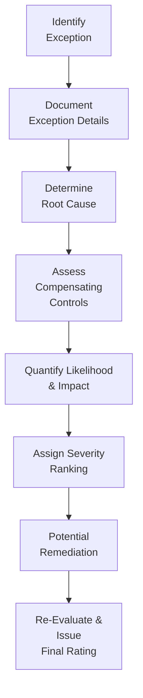

## 24.4 Evaluating Deviations, Exceptions, and Forming the Opinion

In a SOC 2® examination, achieving reliable, useful, and transparent reporting hinges on accurately identifying and evaluating any deviations or exceptions discovered during the audit fieldwork. The ultimate goal is to determine whether identified deficiencies within a service organization’s controls are severe enough to impact the auditor’s overall opinion. This section explores how to weigh exceptions from a risk-based standpoint, how to classify the severity of findings, and how the results align with appropriate trust services criteria. We will also walk through practical methods, real-world scenarios, and best practices drawn from industry experience.

### The Role of Deviations and Exceptions in SOC 2® Examinations
Before diving into severity and opinion formulation, it is essential to grasp the conceptual distinction between “deviations” and “exceptions.”

• Deviations: Often used to describe test deviations, these occur when evidence does not fully align with the requirements or parameters established by the audit test. A deviation is a specific instance in which a control operation or procedure does not match the auditor’s expected outcome or the control’s documented methodology.

• Exceptions: Generally defined as control failures or deficiencies, exceptions indicate that the control objective or intended outcome was not fulfilled. They can be discovered through observation, inspection, inquiry, or re-performance of the control. If a control fails to operate effectively for any period within the audit window, that lapse is often labeled as an exception.

Many auditors use “deviations” and “exceptions” interchangeably. However, for clarity in SOC 2® reports, an exception is typically communicated to readers as a negative observation rather than a mere variance from standardized procedures. Whether you call it a deviation or an exception, the key is understanding its qualitative and quantitative impact on the control environment.

### Key Factors Driving the Severity of Exceptions
Determining the severity of an exception is central to evaluating the potential impact on the trust services criteria (Security, Availability, Processing Integrity, Confidentiality, and Privacy). The following factors frequently come into play:

• Frequency and Duration  
  If a control fails consistently or for an extended period, the risk to the system’s reliability is higher. Repeated exceptions across multiple transactions or throughout the service period elevate the severity.

• Nature of the Exception  
  Does the exception stem from a design flaw (i.e., the control is fundamentally flawed and cannot address the relevant risk) or from operational issues (i.e., the control was designed properly, but you observed lapses in execution)? A design deficiency typically leads to a higher-severity issue because it implies that the control is unlikely to detect or prevent errors or issues effectively.

• Compensating Controls  
  Sometimes, an exception in one control is mitigated by another control. For example, if a user-provisioning process fails to remove terminated employees from the system promptly, there may be a compensating detective control that actively flags unidentified user IDs within 24 hours. Although not always guaranteed to eliminate the risk, compensating controls can reduce the severity.

• Potential or Actual Impact  
  If the exception has the potential to undermine the integrity of financial data, expose confidential or regulated information, disrupt operations, or violate privacy laws, it is taken more seriously. Exceptions that pose a material impact or show a likelihood of leading to material misstatements elevate the severity classification.

• Management’s Remediation Efforts  
  During the fieldwork or between the initial discovery phase and finalizing the report, management might have taken timely and effective remediation actions. Proactive measures could reduce an exception’s severity if tested or confirmed to be operating effectively before the end of the audit period.

### Evaluating and Classifying Exceptions: A Multi-Step Approach
A structured approach to analyzing exceptions ensures consistency and robustness in determining significance.

1. Document the Exception  
   Accurately and thoroughly record the nature, scope, and timing of each exception. Include information on which specific trust services criteria it relates to, who identified it, and how frequently it occurred.

2. Determine Root Cause  
   As with many internal control assessments, understanding whether the issue arises from a design flaw, incomplete control documentation, operational breakdown, or human error is crucial for assigning severity.

3. Assess Compensating Controls  
   Review if any other controls mitigate the identified exception’s impact. This step includes evaluating the design and operating effectiveness of the compensating control.

4. Measure Impact and Likelihood  
   Using a combination of quantitative and qualitative assessments, gauge how impactful the exception could be. Evaluate the worst-case scenario (“maximum foreseeable loss”) and the likelihood of it occurring frequently or pervasively.

5. Assign Severity Ranking  
   This could be “low,” “moderate,” or “high,” or a more granular scale such as “minor,” “significant,” and “material deficiency.” The latter classification often aligns with regulatory or professional standards and directly affects how the exception is disclosed in the report.

6. Formulate an Action Plan (Where Relevant)  
   If you are conducting the engagement in an advisory capacity or working closely with management, you may recommend remediation steps. Management should commit to deadlines for corrective actions, especially for high-severity exceptions.

7. Re-Evaluate and Update Findings  
   If management remediates the exception before the audit period ends, re-testing or updated inquiries may lead to a lower severity rating or removal from the final report.

### Diagram: Exception Analysis Workflow
Below is a simplified Mermaid diagram illustrating a typical sequence for evaluating exceptions’ severity in a SOC 2® examination:

This process helps ensure consistent analysis across multiple exceptions and promotes transparency and accountability in the final SOC 2® report.

### Forming the Opinion: Linking Exceptions to Overall Conclusions
Whether you are performing a SOC 2® examination under the provisions of AT-C Section 205 (applicable to examination engagements) or referencing broader AICPA standards, the final opinion hinges on the overall operating effectiveness of controls in meeting the relevant trust services criteria. The presence of exceptions, in and of itself, does not always necessitate a qualified or adverse opinion. Rather, the auditor must weigh each exception’s risk impact.

#### Types of SOC 2® Opinions
1. Unqualified (Clean) Opinion  
   Issued when controls are designed and operating effectively to meet all the stated trust services criteria during the review period, with no material exceptions. Minor deviations may exist, but they are not sizable enough to undermine the criteria.

2. Qualified Opinion  
   Issued when one or more material exceptions exist. For instance, the design or operation of a critical control might fail to meet the intended trust services criteria in a way that significantly raises the risk of a material deficiency. The remainder of the control environment may still be effective, but the identified deficiency is significant enough to warrant limitation on the overall assurance.

3. Adverse Opinion  
   A more severe conclusion, typically issued when the system contains pervasive deficiencies. The controls either fail entirely in design or are so poorly enforced in operation that they do not satisfy significant portions of the trust services criteria.

4. Disclaimer of Opinion  
   May be used when the auditor cannot gather sufficient evidence to provide any conclusion. This usually arises from a scope limitation or when management cannot or does not provide the necessary documentation and access for the auditor to evaluate the controls.

### Considering Materiality in a SOC 2® Context
Unlike a financial statement audit, materiality in a SOC 2® engagement may not strictly align with monetary thresholds. Instead, the concept of materiality considers the effect on the trust services criteria. For example, if a privacy control deficiency could potentially expose personal data for thousands of individuals, that deficiency might be material in the context of privacy. Conversely, failing to document a minor system change might not qualify as material if compensating controls exist and the omission has inconsequential impact on system security or availability.

### Real-World Example: Severity Assessment in a Cloud-Based Service
Scenario: A cloud-based payroll provider’s SOC 2® (Security and Confidentiality) engagement identified that terminated contractors did not have their credentials revoked for 72 hours.  
• Root Cause: Operational lapse in the HR offboarding process.  
• Potential Impact: Unauthorized access to confidential payroll data.  
• Frequency: This occurred in four out of 25 terminations tested.  
• Compensating Control: An automated security monitoring system would alert the security team if any external login attempts occurred from newly terminated credentials. Records show it identified and disabled suspicious activities within 24 hours.  
• Severity Conclusion: While the risk was meaningful, the manual lapses were partially mitigated by the automated monitoring tool. The exception was deemed moderate, leading to a recommendation for strengthening the offboarding procedure. The final opinion remained unqualified because the deficiency did not rise to a level of material compromise to the trust services criteria. Nonetheless, it was included in the final report as an observation calling for corrective action.

### Best Practices and Common Pitfalls
• Establish a Clear Escalation Process: When a potentially severe exception is identified, having an internal escalation and triage process ensures timely, consistent communication among the engagement team and service organization management.  
• Avoid Overlooking Compensating Controls: Failing to evaluate complementary controls may cause the auditor to overstate the exception’s risk. Thorough documentation and complete testing across the control environment are essential.  
• Confirm Management’s Assertions: While management may claim a quick fix or partial remediation, always verify through evidence-based testing or inquiry. Merely implementing a written policy does not guarantee operational effectiveness.  
• Beware of Scope Creep: If the examination scope expands mid-project (e.g., additional subservice organizations are included), new exceptions could emerge. Adjust the risk assessment and consider how these new findings might affect your final opinion.

### Analytical Model for Severity and Opinion
Some firms use a structured model that takes into account probability (p) and impact (i) for each exception. A simplified formula could be expressed as:


\text{Risk Score} = p \times i


• (p): Probability or likelihood that the control failure will lead to an incident.  
• (i): Magnitude of harm or loss that could result.  

When the Risk Score exceeds a certain threshold, the exception either elevates to a “material” status or pushes the auditor to consider a qualified or adverse opinion. Probability and impact, however, are influenced by the presence (or absence) of strong compensating controls and mitigating factors.

### Table: Illustrative Severity Matrix
Below is an example severity matrix you might use to classify exceptions:

| Severity         | Description                                                                 | Potential Opinion Impact                         |
|------------------|-----------------------------------------------------------------------------|-------------------------------------------------|
| Low              | Minor deviations; controls largely effective                                 | Typically remains unqualified                   |
| Moderate         | Notable exceptions; compensating controls partially reduce the risk         | Unqualified or qualified (depending on scope)   |
| High             | Material exception(s); significant or pervasive deficiency threatening TSC   | Likely qualified, possibly adverse              |
| Extremely High   | Broad or systemic control failure across critical trust services criteria    | Adverse or disclaimer of opinion                |

### Single vs. Multiple Exceptions
An isolated deficiency might be more easily contained. However, multiple minor exceptions—even if individually classified as low severity—could collectively indicate a broader control environment issue. Auditors should remain vigilant about the cumulative effect of small issues. 

### Communicating the Results in the SOC 2® Report
A SOC 2® report includes:  
• Management’s Assertion: Management’s representation that the description of the system fairly presents the system in place, and that controls are designed and operating effectively.  
• Auditor’s Opinion: The practitioner’s conclusion, reflecting whether controls are in compliance with the trust services criteria.  
• Description of Tests and Results: A table or narrative detailing each control tested, its objective(s), and whether any exceptions were found.  
• Other Information: May include user entity responsibilities, subservice organization discussions, and any significant changes in the controls during the reporting period.

When exceptions exist, the level of detail provided correlates with severity. For significant or material deficiencies, the auditor typically provides thorough commentary in the “Results of Tests” or “Exceptions Noted” sections. These details offer stakeholders transparency about the nature of the deficiency, its potential impact, and any remedial steps undertaken by management.

### Recommended Remediation Steps
1. Root Cause Analysis: Ensure that management fully understands the underlying issue.  
2. Action Plan: Develop a corrective action roadmap with timelines and responsibilities assigned.  
3. Control Redesign (If Applicable): Where a design flaw exists, re-engineer the control to properly mitigate the identified risk.  
4. Re-Testing Regime: If possible, re-test before the final issuance of the SOC 2® report to determine if remediation reduces or eliminates the exception.  
5. Continuous Monitoring: For the next SOC 2® examination period, ensure the newly implemented or enhanced controls are subject to ongoing oversight to prevent regression.

### Putting It All Together
Evaluating exceptions requires a nuanced understanding of the control environment, the relevant trust services criteria, and the service organization’s risk tolerance. Each exception must be carefully studied for its potential business, security, and compliance impacts. By gathering robust evidence, exercising sound professional judgment, and thoroughly communicating the findings, the auditor can provide a clear and meaningful opinion that benefits all stakeholders—service organization management, user entities, and regulators alike.

### Further Reading & References
• AICPA Guide: SOC 2® Reporting on an Examination of Controls at a Service Organization.  
• COSO’s Internal Control — Integrated Framework for an overarching set of internal control principles.  
• AICPA’s Trust Services Criteria for Security, Availability, Processing Integrity, Confidentiality, and Privacy.  
• ISACA’s COBIT 2019 for broader IT governance and control insights.  

For more in-depth information on specific scenarios and real-world applications, refer to Chapter 25: “Planning and Performing a SOC Engagement,” and Chapter 26: “Reporting and Opinions in SOC Engagements” within this guide.

## Challenge Your Knowledge: SOC 2® Deviations, Exceptions, and Opinion Formation



### An exception found in a SOC 2® examination is typically best described as:
- [ ] A type of control that operates perfectly.  
- [x] A noted deficiency where a control failed to operate as designed.  
- [ ] A test of how quickly management can respond to auditors’ demands.  
- [ ] A deviation that is reported only if it reaches a high-severity threshold.

> **Explanation:** In a SOC 2® engagement, an exception is any deficiency indicating the control did not operate effectively. This helps differentiate mere deviations from controls that fully fail their designed purposes.

### Which factor most strongly influences whether an exception might lead to a qualified opinion?
- [ ] The number of auditors performing the test.  
- [ ] The time of year the test was conducted.  
- [x] The severity and materiality of the exception.  
- [ ] Whether management works remotely.

> **Explanation:** The primary determinant of a qualified opinion is whether the exception is material or severe enough to undermine confidence in the system’s controls. Lesser issues typically do not lead to a qualified opinion.

### How could compensating controls affect the classification of an exception?
- [ ] They usually invalidate all findings.  
- [x] They can reduce the severity of an exception if verified.  
- [ ] They only apply to privacy-related criteria.  
- [ ] They escalate the severity of the exception automatically.

> **Explanation:** When another effective control helps mitigate an identified deficiency, the overall risk may be reduced, leading to a lower severity classification of the original exception.

### A material exception in a SOC 2® examination typically produces:
- [ ] An unqualified opinion.  
- [x] A qualified or adverse opinion, depending on pervasiveness.  
- [ ] An automatic disclaimer of opinion.  
- [ ] No effect on the final report.

> **Explanation:** If an exception is material, it erodes the system’s ability to meet one or more trust services criteria, potentially resulting in a qualified or adverse opinion.

### When determining severity, which of the following is least relevant?
- [ ] Frequency of the exception.  
- [x] The job title of the individual who discovered the exception.  
- [ ] Possible compensating controls.  
- [ ] The potential impact on security or confidentiality.

> **Explanation:** The job title of the person who identifies the issue generally does not affect severity. Severity depends on the nature, frequency, and potential impact of the control deficiency.

### In determining the final opinion for a SOC 2® report, minor deviations that do not undermine controls are likely to result in:
- [x] An unqualified opinion with noted observations.  
- [ ] A qualified opinion with remedial requirements.  
- [ ] An adverse opinion and revocation of the SOC 2® report.  
- [ ] A disclaimer of opinion.

> **Explanation:** Minor deviations, if effectively mitigated and unlikely to pose a significant risk to trust services criteria, often lead to an unqualified opinion, even though the auditor may note them as observations.

### Which statement about disclaimers of opinion is correct?
- [x] Disclaimers often arise when insufficient evidence exists to form a conclusion.  
- [ ] Disclaimers confirm controls are operating effectively.  
- [ ] Disclaimers are never used in SOC 2® reports.  
- [ ] Disclaimers are only issued if minor exceptions are discovered.

> **Explanation:** A disclaimer of opinion typically occurs if the auditor cannot gather enough evidence to make a definitive conclusion, often resulting from significant scope limitations or lack of access.

### If an exception is discovered, which step should the auditor perform next?
- [ ] Immediately issue a qualified opinion without further steps.  
- [x] Investigate root causes, frequency, and compensating controls.  
- [ ] Stop the engagement and report to external regulators.  
- [ ] Invalid all test results collected so far.

> **Explanation:** The auditor should always investigate the nature and severity of the exception, including potential mitigating controls and the underlying root cause, before reaching a conclusion about its overall impact.

### Why is management’s timely remediation significant during a SOC 2® examination?
- [x] It can lower the severity classification if re-tested and proven effective.  
- [ ] It automatically negates exceptions, removing the need to disclose them.  
- [ ] It forces the auditor to form an adverse opinion.  
- [ ] It removes the requirement for a final SOC 2® report.

> **Explanation:** Management’s remediation may reduce or rectify an exception within the assessment period, demonstrating that the deficiency is resolved and lowering its risk rating.

### The overall impact of multiple minor deviations within a SOC 2® engagement could:
- [x] Accumulate into a significant risk.  
- [ ] Remain at a minor level, regardless of frequency.  
- [ ] Render any material exception void.  
- [ ] Always lead to an adverse opinion.

> **Explanation:** Multiple minor exceptions can collectively indicate broader control weaknesses, potentially raising overall risk. They should be evaluated for cumulative impact before finalizing the opinion.



## For Additional Practice and Deeper Preparation

### [Information Systems and Controls (ISC)](https://www.udemy.com/course/isc-cpa-mock-exams/?referralCode=E1217303222935C5E464)

**Information Systems and Controls (ISC) CPA Mocks:** 6 Full (1,500 Qs), Harder Than Real! In-Depth & Clear. Crush With Confidence!

- Tackle full-length mock exams designed to mirror real ISC questions.  
- Refine your exam-day strategies with detailed, step-by-step solutions for every scenario.  
- Explore in-depth rationales that reinforce higher-level concepts, giving you an edge on test day.  
- Boost confidence and minimize anxiety by mastering every corner of the ISC blueprint.  
- Perfect for those seeking exceptionally hard mocks and real-world readiness.

_Disclaimer: This course is not endorsed by or affiliated with the AICPA, NASBA, or any official CPA Examination authority. All content is for educational and preparatory purposes only._
