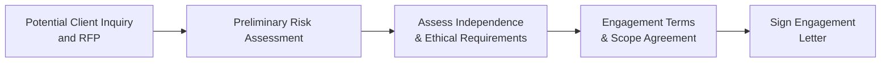

## 25.1 Engagement Acceptance and Ethical Considerations

Accepting a new System and Organization Controls (SOC) engagement requires careful analysis of multiple factors, including professional standards, independence rules, and ethical considerations. A well-structured acceptance process minimizes the risk of conflicts of interest, ensures compliance with the AICPA Code of Professional Conduct, and prepares the service auditor to provide high-quality attestation services. This section explores the key considerations CPAs should evaluate prior to accepting a SOC engagement, as well as the relevant ethical and professional requirements that guide decision-making.

Effective engagement acceptance lays a strong foundation for any SOC (SOC 1®, SOC 2®, SOC 3®, or SOC for Cybersecurity) examination, ensuring that the CPA firm has the necessary capabilities, knowledge, and independence to carry out the engagement responsibly.

  
Understanding the importance of engagement acceptance and ethical factors is essential before advancing through other steps in Chapter 25 (Planning and Performing a SOC Engagement). By thoroughly evaluating each acceptance criterion, CPAs can safeguard their professional integrity, protect the public interest, and demonstrate dedication to high-quality attestation services.

  
Consider the AICPA Code of Professional Conduct and Statement on Standards for Attestation Engagements (SSAE No. 18, AT-C sections 105, 205, 320, etc.) as guiding frameworks throughout this process.

  
Key areas covered in this section include:

• Professional standards and regulatory references  
• Independence principles and safeguards  
• Conflicts of interest and their implications  
• Engagement acceptance procedures and risk assessment  
• Documenting acceptance decisions and ethical considerations  

  
Below, we examine each area in more detail, complete with examples and practical guidance.

  
Preparing to Accept a SOC Engagement

The process of engagement acceptance for a SOC examination can be visualized in a high-level flowchart. While each firm may customize its procedures, the steps generally include conducting a preliminary risk assessment, confirming independence, and aligning on engagement terms with the client:

Each phase in this diagram involves critical evaluation of professional standards and ethical obligations.

  
Professional Standards and Regulatory References

1. AICPA Code of Professional Conduct  
   The AICPA Code of Professional Conduct underpins all engagements performed by CPAs, setting forth principles governing integrity, objectivity, professional competence, and due care. Specifically, the Independence Rule (ET §1.200.001) and related interpretations (e.g., ET §1.290) guide how firms must remain free from conflicts of interest and financial or other relationships that could impair independence.  

2. SSAE No. 18 (AT-C Sections 105 and 205)  
   SOC engagements for service organizations often follow SSAE No. 18 (AT-C Sections 105, 205, 320, etc.), which outlines attestation standards and requirements for planning, performing, and reporting. Section 105 deals with “Concepts Common to All Attestation Engagements,” emphasizing independence, professional skepticism, and professional judgment.  

3. Additional Ethics Requirements  
   • International Ethics Considerations: Firms operating globally may need to consider the International Ethics Standards Board for Accountants (IESBA) Code, which closely aligns with the AICPA Code but may contain nuanced differences.  
   • Firm Policies: Many CPA firms have stricter internal policies that go beyond minimum regulatory requirements, for example requiring more extensive conflict-of-interest checks or setting stricter thresholds on financial relationships with clients.  

  
Independence Principles and Safeguards

Independence is a cornerstone of any attestation engagement, including SOC assessments. According to the AICPA Code of Professional Conduct:

• Independence in Fact: The auditor must be free from any direct or indirect financial, business, or personal relationships that could impair, or appear to impair, objectivity.  
• Independence in Appearance: The auditor should avoid any situation that a reasonable and informed third party might interpret as a compromise to independence.  

Potential threats to independence can arise from:  
• Providing non-attest services (e.g., design or implementation of controls) that may overlap with management’s responsibilities.  
• Financial interests, such as stock ownership in the client company or significant loans.  
• Self-review threats if the firm has recently performed consulting or internal audit services for the client on the same processes or controls subject to attestation.  

  
Safeguards to Preserve Independence

• Clear Engagement Letters: Clearly delineate each party’s responsibilities, ensuring the client acknowledges its responsibility for internal controls.  
• Separate Engagement Teams: If non-attest services such as advisory or consulting are provided, segregate those teams from the SOC engagement team to reduce self-review risk.  
• Prohibition of Management Functions: Avoid situations where the CPA firm undertakes managerial roles in the client’s operations (e.g., deciding on control design).  
• Rotating Engagement Partners: Adhere to firm or regulatory rotation policies to maintain fresh perspectives and reduce familiarity threats.  

  
Conflict of Interest Considerations

Conflicts of interest occur when the CPA’s objectivity or loyalty to one party conflicts with responsibilities owed to another party. For instance, a firm providing comprehensive IT consulting for a service organization may be in a difficult position to attest to the services they helped design. The AICPA Code of Professional Conduct requires that CPAs:  

• Disclose and obtain consent from relevant parties when conflicts are identified.  
• Decline or withdraw from engagements where conflicts cannot be adequately mitigated or disclosed.  

Real-World Example of Conflict of Interest:  
A large CPA firm provided cloud migration strategy and network security consulting to a service organization. The same client then requested a SOC 2® engagement covering those newly implemented security controls. Accepting the engagement without implementing any safeguards (e.g., using separate engagement teams that do not overlap or spin-off the consulting project to a different firm) could raise significant independence threats.  

If it is determined that the self-review threat to independence is too high, the firm may have to relinquish one of the engagements. Where feasible, the firm might isolate the consulting and attestation teams entirely, accompanied by senior-level oversight to manage any residual risks.

  
Engagement Acceptance Steps

While each firm tailors its own acceptance and continuance procedures, common steps include:

Preliminary Risk Assessment  
This assessment looks at the nature of services provided by the service organization, any specialized or emerging technology in scope, client integrity issues, and the strength of the client’s compliance posture. High-risk scenarios might include highly complex IT environments or evidence that the client has had previous legal or regulatory issues affecting the reliability of their control environment.

Competence and Expertise  
The firm must evaluate whether it has the technical competence and capacity to perform the SOC engagement. For instance, a cloud computing–focused SOC examination may require in-depth knowledge of virtualization architectures, containerization, or serverless environments. If the firm lacks these specialized skills, it may need to designate or hire individuals with appropriate expertise.

Client and Scope Alignment  
Clearly define the scope of the engagement in writing. For instance, for a SOC 2® engagement, align with the client about which Trust Services Criteria (e.g., Security, Availability, Confidentiality) will be addressed. If subservice organizations are part of the system’s operation, determine whether to use the inclusive or carve-out reporting method (see §23.5 for more details on inclusive vs. carve-out approaches).

Ethical Requirements Review  
1. Independence Check: Confirm no independence violations exist for the prospective client.  
2. Confidentiality: Ensure the firm can maintain confidentiality of the client’s data and that proper measures are in place.  
3. Code of Conduct Review: Cross-check any previous engagements with this client or affiliated entities for potential conflicts of interest.  
4. Resource Allocation: Assess whether the firm can dedicate adequate resources to avoid quality compromises (e.g., understaffing).  

Engagement Contract and Acknowledgments  
After aligning on terms, the firm and the client sign a written agreement or engagement letter. This letter should outline:  
• The responsibilities of both parties.  
• Timelines, deliverables, and engagement objectives.  
• The scope of testing, including control objectives or Trust Services Criteria.  
• Fees, billing terms, and estimates of required resources.  

Documentation and Communication  
All acceptance decisions and ethical assessments should be documented in the firm’s engagement acceptance file. Frequent communication with the client prior to signing the engagement letter helps both parties remain clear on responsibilities, scope boundaries, timing, and fees.

  
Potential Challenges and Best Practices

Challenges  
• Navigating independence and consulting services with the same client.  
• Understanding specialized technology (e.g., IoT, container orchestration) when staff lacks expertise.  
• Balancing client timelines with the firm’s resource constraints, leading to potential staff overload.

Best Practices  
• Assign separate teams or outsource specialized tasks to a reputable firm under a well-defined agreement.  
• Conduct continuing professional education (CPE) in areas of emerging technology to maintain competence.  
• Maintain a robust acceptance checklist that covers all ethical and professional requirements.

  
Case Study Example

Case Background:  
A mid-sized CPA firm receives a request from a payment processing service organization to perform a SOC 1® Type 2 engagement. The firm’s IT consulting division had previously helped the client optimize its transaction processing platform.

Key Considerations:  
1. Self-Review Threat: The firm’s IT consulting team participated in the platform’s design.  
2. Service Coverage Overlap: The SOC 1® engagement would include controls around transaction processing that were redesigned during consulting.  
3. Independence Safeguards: The firm decides to appoint a completely different set of professionals, physically segregated from the consulting team, to handle the SOC 1® engagement.  
4. Engagement Letter: The letter explicitly clarifies the independence procedures, including no shared resources and a formal sign-off from the firm’s Ethics Review Board.

Outcome:  
The firm’s Ethics Review Board approves the plan, deeming that the segregation of teams with no overlap in reporting lines is sufficient to mitigate the self-review threat. The client and the CPA firm finalize the engagement letter. All acceptance steps are documented, preserving a clear audit trail of the ethical analysis.

  
References and Resources for Further Exploration

• AICPA Code of Professional Conduct, particularly ET §1.200.001 on Independence.  
• SSAE No. 18 (AT-C Sections 105 and 205).  
• “Guide to Independence” on the AICPA website.  
• IESBA Handbook of the International Code of Ethics for Professional Accountants (if operating internationally).  
• AICPA’s Professional Standards: AT-C Section 320 for SOC engagements and AT-C Section 205 for examination engagements.

By diligently following these engagement acceptance and ethical considerations, CPA firms performing SOC engagements can uphold their professional standards and maintain the trust of stakeholders who rely on accurate and objective attestation reports.

  
## Quiz on Engagement Acceptance and Ethical Considerations



### Which regulatory framework primarily governs independence requirements for CPAs performing SOC engagements?  
- [ ] Public Company Accounting Oversight Board (PCAOB) Interim Standards  
- [x] AICPA Code of Professional Conduct  
- [ ] International Accounting Standards Board (IASB) Guidelines  
- [ ] SEC Regulation S-X  

> **Explanation:** The AICPA Code of Professional Conduct sets forth ethical and independence requirements for CPAs, including those performing SOC engagements.

### When might a conflict of interest arise for a CPA firm engaged to perform a SOC examination?  
- [x] When the firm’s consulting division designed and implemented the very controls it is testing.  
- [ ] When the firm obtains client management’s representation letter.  
- [ ] When the client requests additional sample testing.  
- [ ] When the CPA firm uses a third-party subcontractor for a portion of the testing.  

> **Explanation:** Conflicts of interest often emerge if the same firm that conducts an independent review was involved in designing the controls, leading to potential self-review threats.

### Which of the following is a best practice to mitigate independence threats in a SOC engagement?  
- [ ] Offering discounted fees to incentivize timely signing of the engagement letter.  
- [x] Assigning separate engagement teams for advisory services and attestation engagements.  
- [ ] Implementing a single oversight manager for consulting and audit teams.  
- [ ] Allowing the same senior partner to lead both consulting and attestation engagements to ensure consistency.  

> **Explanation:** Separating engagement teams helps mitigate self-review and familiarity threats, preserving independence.

### A high-risk scenario exists if a potential SOC client has:  
- [x] A history of regulatory noncompliance or prior lawsuits regarding controls.  
- [ ] Provided the CPA firm full access to documentation.  
- [ ] Demonstrated a sound internal compliance mechanism.  
- [ ] Requested shorter fieldwork timelines than usual.  

> **Explanation:** A client’s history of legal or regulatory issues heightens risk, requiring a more stringent acceptance review process.

### What is a critical aspect to confirm before signing any SOC engagement letter?  
- [x] The CPA firm’s independence.  
- [ ] The presence of an internal audit department.  
- [x] The availability of relevant subject matter experts, if needed.  
- [ ] Whether the client will cover overage fees if testing scope expands.

> **Explanation:** Independence and availability of qualified resources are essential prerequisites to ensure a proper SOC engagement.

### Which ethical directive must CPAs observe throughout planning and performing a SOC engagement?  
- [x] Maintain integrity and due care as outlined in the AICPA Code of Professional Conduct.  
- [ ] Prioritize fee arrangements over professional skepticism.  
- [ ] Delegate full responsibility for controls design to an external consultant.  
- [ ] Assume that controls are functioning as intended without testing.  

> **Explanation:** The AICPA Code of Professional Conduct requires integrity and due care, fundamental principles in any attestation engagement.

### Identify a viable safeguard that reduces self-review threats in SOC engagements:  
- [ ] Disbanding the consulting division.  
- [x] Appointing different partners to lead consulting and SOC teams, with no overlap.  
- [ ] Eliminating written engagement letters to reduce formalities.  
- [ ] Sharing staff between advisory and SOC engagements to improve efficiency.  

> **Explanation:** A separate team or partner structure aimed at preventing overlap reduces the potential for self-review threats.

### What is one way to address a perceived conflict of interest if it’s deemed manageable?  
- [ ] Immediately decline the engagement with no further action.  
- [x] Disclose the conflict and obtain consent from all relevant parties.  
- [ ] Proceed as planned without disclosure.  
- [ ] Hire an external counsel to manage the entire client relationship.  

> **Explanation:** The AICPA Code of Professional Conduct allows for certain conflicts of interest to be disclosed and managed with consent, provided effective safeguards are in place.

### Which factor should be evaluated when assessing a CPA firm’s competence to perform a SOC engagement?  
- [x] The availability of staff with specialized IT knowledge for the controls in scope.  
- [ ] Whether the marketing budget is sufficient to promote the engagement.  
- [ ] The firm’s international presence and brand recognition.  
- [ ] The volume of other non-SOC clients.  

> **Explanation:** Competence includes having staff with the technical expertise necessary to assess specialized control environments or emerging technologies.

### True or False: A written engagement letter is not a requirement for SOC engagements but is usually considered “best practice.”  
- [ ] True  
- [x] False  

> **Explanation:** The AICPA requires written attest engagement letters to define responsibilities, scope, and limitations clearly. This is crucial not just as a “best practice,” but as an essential element in formally documenting engagement terms and ethical considerations.



## For Additional Practice and Deeper Preparation

### [Information Systems and Controls (ISC)](https://www.udemy.com/course/isc-cpa-mock-exams/?referralCode=E1217303222935C5E464)

Information Systems and Controls (ISC) CPA Mocks: 6 Full (1,500 Qs), Harder Than Real! In-Depth & Clear. Crush With Confidence!

• Tackle full-length mock exams designed to mirror real ISC questions.  
• Refine your exam-day strategies with detailed, step-by-step solutions for every scenario.  
• Explore in-depth rationales that reinforce higher-level concepts, giving you an edge on test day.  
• Boost confidence and minimize anxiety by mastering every corner of the ISC blueprint.  
• Perfect for those seeking exceptionally hard mocks and real-world readiness.

_Disclaimer: This course is not endorsed by or affiliated with the AICPA, NASBA, or any official CPA Examination authority. All content is for educational and preparatory purposes only._
