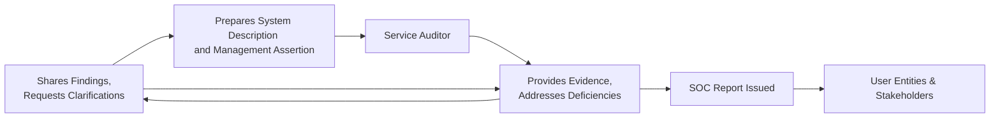

## 25.2 Independence and Responsibilities of Service Auditor and Management

Independence is a cornerstone of any attestation engagement, including System and Organization Controls (SOC) examinations. Just as independence upholds credibility in external financial statement audits, it also establishes the trustworthiness of SOC reports provided by service organizations. While the service auditor’s mandate includes forming an objective opinion on controls, management is equally responsible for designing, maintaining, and accurately representing those controls. This section explores both parties’ responsibilities, referencing relevant attestation standards under the AICPA Standards for Attestation Engagements (SSAE), particularly AT-C sections 105, 205, and 320. Understanding these principles is critical when planning and performing a SOC engagement, as it ensures each stakeholder operates within defined scopes and ethical boundaries.

The content here builds on concepts introduced in Chapter 22 (Overview of SOC Engagements) regarding the purpose and types of SOC reports, and expands upon the planning phase covered in earlier sections of Chapter 25. We will discuss how independence underpins the service auditor’s role, highlight management’s responsibilities in preparing for and supporting the engagement, and illustrate how alignment between these roles helps maintain the integrity of a SOC examination.

Independence in attestation engagements is governed primarily by the AICPA Code of Professional Conduct and the ethical requirements established by the profession. These requirements help guard against conflicts of interest, ensuring that users of SOC reports can place reliance on the assurance provided. Because a SOC report influences external stakeholders—such as user entities, external auditors, and regulatory bodies—the importance of clarity around the roles and responsibilities of the service auditor and management cannot be overstated.

The subsections below detail how independence applies to a SOC engagement and how responsibilities are assigned to each party. We also provide practical examples, real-world scenarios, and a visual diagram representing the interplay of these roles.

The objective is not only to clarify the formal requirements of independence but also to ensure both service auditors and management understand best practices, common pitfalls, and the strategic value of strong collaboration within well-defined ethical boundaries.

The following subtopics are designed to be read in sequence, but each can also stand alone as a reference for specific questions on independence, professional responsibilities, or the mechanics of SOC engagements.

Importance of Independence

Independence is crucial for upholding the credibility and reliability of SOC reports. In a SOC engagement, the service auditor is engaged to issue an opinion on a service organization’s controls relevant to specified objectives (e.g., effective design and operating effectiveness for SOC 1®, or meeting the Trust Services Criteria for SOC 2®). Users of the SOC report rely on the veracity of this opinion to make critical decisions, such as whether to outsource certain processes or how to monitor third-party risk.

Independence ensures that:  
• The service auditor’s judgment is free from bias, conflict of interest, or undue influence from the client (the service organization).  
• Professional standards and objectivity guide the engagement, supporting stakeholders’ confidence in the reported findings.  
• The resulting report can be used by user entities and other third parties (e.g., user entity auditors, regulators) as a credible basis for their own decision-making or assurance processes.

Relevant Attestation Standards

The AICPA’s Statements on Standards for Attestation Engagements (SSAE) govern the work performed by the service auditor. Key sections include:

• AT-C Section 105 – Concepts Common to All Attestation Engagements: Explains fundamental attestation principles, including the requirement for practitioner independence.  
• AT-C Section 205 – Examination Engagements: Establishes guidance for examinations in which the practitioner expresses an opinion on subject matter or an assertion about the subject matter.  
• AT-C Section 320 – Reporting on an Examination of Controls at a Service Organization Relevant to User Entities’ Internal Control over Financial Reporting (the foundation for SOC 1®).  

While these sections address different aspects of performing and reporting on attestation engagements, each one highlights the necessity for independence as defined by the AICPA Code of Professional Conduct. This code includes strict guidelines related to financial relationships, family relationships, and the range of non-audit services that can be provided without jeopardizing independence.

Service Auditor’s Responsibilities

The service auditor is responsible for examining the service organization’s controls and providing an opinion on their design and, if required, operating effectiveness. Key responsibilities include:

Maintaining Independence  
The service auditor must affirm that no relationship, financial interest, or management role impairs objectivity. This means not only the absence of conflicts of interest but also the perception of independence. For example, a CPA firm that assists directly with designing or implementing the same controls it later audits could find its independence compromised.

Planning and Scoping  
The service auditor designs the engagement scope and methodology in accordance with SSAE standards, including any relevant frameworks such as the COSO Internal Control – Integrated Framework or the Trust Services Criteria. Planning activities often involve obtaining an understanding of the service organization’s systems and assessing risk to focus testing procedures effectively.

Gathering and Evaluating Evidence  
Whether it is a SOC 1® or a SOC 2® engagement, the service auditor gathers evidence of control design and effectiveness. This typically includes:  
• Interviews with personnel to confirm processes and responsibilities.  
• Inspection of documentation such as policy manuals, system configuration logs, and control logs.  
• Observation of processes in real-time to verify operational compliance.  
• Re-performance of certain controls to validate reported outcomes.  

The service auditor must exercise professional skepticism and ensure test procedures are sufficient to support evidence-based conclusions.

Forming and Expressing an Opinion  
At the conclusion of fieldwork, the service auditor evaluates collected evidence and issues an opinion. In a SOC 1® Type 2 or SOC 2® Type 2 engagement, the opinion addresses both the design and operating effectiveness of controls over a specified period. If deficiencies are identified, the service auditor can modify the opinion or disclose exceptions. Importantly, any modifications to the opinion must be supported by evidence, maintaining independence, and a balanced perspective.

Management’s Responsibilities

Management at the service organization plays a critical role in a SOC engagement. Just as the service auditor must remain objective, management must be proactive in ensuring controls are correctly designed, implemented, and effectively operating.

Developing and Maintaining Controls  
Management is responsible for creating and maintaining the control environment that is subject to examination. This includes:  
• Establishing robust internal controls aligned with relevant frameworks (e.g., COSO or Trust Services Criteria).  
• Documenting policies, processes, and procedures that describe the operating environment.  
• Providing training and resources to employees so they understand their control responsibilities.

Preparing the Management Assertion  
In many SOC engagements, management is required to draft a written assertion describing the system, specifying the controls, and acknowledging responsibility for the design and operating effectiveness of those controls. The service auditor relies on this assertion to determine the accuracy and completeness of the description. Falsifying or omitting important facts in the assertion jeopardizes the integrity of the SOC report.

Cooperation with the Service Auditor  
Management must facilitate open communication within the engagement. Providing timely access to personnel, documentation, and system resources is a vital component of a successful examination. This also includes responding to requests for clarification or additional evidence and addressing any issues that arise during testing, such as deficiencies or system changes that prompt a reevaluation of risk.

Implementing Remedial Actions  
If control deficiencies are identified, management should swiftly implement corrective measures. In some cases, management may choose to wait until a future examination period to demonstrate remediated controls, especially if immediate fixes are not feasible. Regardless of timing, management is responsible for continuous improvement and ongoing risk management.

Independence in SOC Engagements: Key Considerations

When performing a SOC engagement, independence is enforced through multiple layers:

• Professional Relationships: The service auditor must not hold any financial stake—such as shares or profit interests—in the service organization.  
• Non-Audit Services: While CPAs can provide consulting services, the scope and nature of those services must not impair their ability to issue an impartial opinion.  
• Ongoing Monitoring: Firms often maintain internal independence and ethics functions to review potential engagements for independence concerns, especially when leveraging cross-functional teams (e.g., IT consulting and assurance).  

If independence is in doubt, the CPA firm should either clarify the scope of work to protect its objectivity or decline the engagement.

Collaboration vs. Conflict of Interest

It is common for the service auditor and management to collaborate on identifying areas of improvement during the engagement process. However, this collaboration must not descend into a conflict of interest that compromises the service auditor’s objectivity. The line can blur if the service auditor starts advising how to implement controls or becomes too deeply involved in decisions ordinarily made by management. Typically, providing “advisory” or “consulting” support on designing controls may be permissible if it does not exceed guidelines for independence, but the firm must be extremely cautious in doing so. The key is to follow the rules set forth in the AICPA Code of Professional Conduct and relevant SSAE guidance to ensure the scope of consulting does not reach a point where the service auditor is effectively auditing their own work.

Real-World Example: Cloud Hosting Services

Imagine a cloud hosting service that needs a SOC 2® report to demonstrate security, availability, and confidentiality controls to prospective clients. The company engages a CPA firm to perform the examination. Management’s responsibilities include:  
• Documenting governance policies on secure configuration and incident response to demonstrate controls are aligned with the Trust Services Criteria.  
• Designing and implementing a 24/7 monitoring process for suspicious traffic.  
• Providing the auditor with system logs, organizational charts, and network topology diagrams.

In parallel, the CPA firm, serving as the service auditor, must:  
• Assess potential conflicts of interest early on—does the same firm provide software development services to this cloud host? If so, independence could be jeopardized.  
• Perform planning procedures, including a risk assessment and a walkthrough of the key security and availability controls.  
• Collect and evaluate evidence of system security measures, such as encryption settings, identity and access management (IAM) policies, and penetration test results.  
• Maintain professional skepticism, investigating any anomalies in the logs or evidence that contradicts management’s assertion.  

If the service auditor identifies a deficiency in the encryption configuration, they must report it objectively. Management may need to remediate it promptly if an unqualified opinion is desired. However, the service auditor cannot design or implement the fix themselves if it threatens independence; they can only communicate the deficiency and recommend principles or best practices based on recognized criteria.

Practical Guidance and Best Practices

For Service Auditors  
• Establish rigorous independence screening early in the client acceptance process.  
• Document all steps taken to mitigate or eliminate potential conflicts.  
• Use engagement letters that clearly define responsibilities and allowable consulting, if any, under the AICPA Code of Professional Conduct.  
• Train team members to recognize independence threats; adopt ongoing monitoring procedures.

For Management  
• Maintain comprehensive documentation that eases the auditor’s review.  
• Engage in continual training and development for personnel to maintain a strong control environment.  
• Address control deficiencies immediately to decrease the likelihood of adverse opinions.  
• Communicate changes in operations or new service offerings as soon as possible, so the audit scope and testing procedures remain accurate.

Potential Pitfalls and Common Misconceptions

• Confusing Audit vs. Consulting: There is a common misconception that the service auditor can serve as both consultant and independent evaluator. While limited advisory services (e.g., high-level recommendations or frameworks) can be permissible, deep involvement in control design and implementation typically raises independence concerns.  
• Failing to Provide Timely Evidence: Some service organizations underestimate the complexity and breadth of requests; delayed or incomplete evidence can disrupt the engagement schedule and erode the relationship with the service auditor.  
• Overlooking Subservice Organizations: In an “inclusive” SOC 1® or SOC 2® report, the subservice organization’s controls might also be included. Management must ensure that these third parties cooperate, otherwise the service auditor may need to issue carve-out opinions or disclaimers.  
• Neglecting Ongoing Updates: Both the CPA firm and management should remain cognizant of operational changes, expansions, or newly identified risks. Failing to update the engagement scope can lead to incomplete or misleading reports.

Diagram: Roles and Responsibilities

Below is a Mermaid diagram that visually represents the relationship among the service auditor, management, and user entities during a SOC engagement. The diagram helps clarify each party’s core activities and the flow of information:

In this illustration:  
• Management prepares the system description and assertion to define the scope for the SOC engagement.  
• The service auditor obtains the necessary evidence, performs tests, and shares findings with management for clarification.  
• Once fieldwork is complete, the final SOC report is issued to user entities and stakeholders who rely on it for assurance.

Conclusion

Independence is non-negotiable in the realm of SOC engagements. Without it, the entire purpose of the attestation—to provide trustworthy insight into a service organization’s control environment—would be fundamentally undermined. Both management and the service auditor are entrusted with critical roles; by fulfilling their responsibilities with integrity, diligence, and ethical clarity, they ensure the SOC engagement achieves its objectives. Service organization management is responsible for designing and operating controls, while the service auditor must independently evaluate these controls in line with SSAE requirements. These responsibilities converge to create an environment of transparency and reliability that benefits all stakeholders.

References for Further Exploration  
• AICPA Code of Professional Conduct: https://www.aicpa.org/research/standards/codeofconduct.html  
• AICPA Statements on Standards for Attestation Engagements (SSAE): https://www.aicpa.org/interestareas/frc/assuranceadvisoryservices.html  
• AT-C Section 105, Concepts Common to All Attestation Engagements  
• AT-C Section 205, Examination Engagements  
• AT-C Section 320, Reporting on an Examination of Controls at a Service Organization Relevant to User Entities’ Internal Control Over Financial Reporting  
• Chapter 22: Overview of SOC Engagements (this volume)  
• Chapter 24: SOC 2® Examinations (this volume)

## Test Your Knowledge: Independence and Responsibilities Quiz



### Which professional guidance primarily governs the independence requirements for service auditors in SOC engagements?

- [ ] GAO Yellow Book
- [x] AICPA Code of Professional Conduct
- [ ] COSO Internal Control – Integrated Framework
- [ ] SEC Rules for Public Companies

> **Explanation:** The AICPA Code of Professional Conduct outlines the fundamental independence standards that CPAs must follow in all attestation engagements, including SOC engagements.

### In a SOC 2® engagement, which party is responsible for preparing the system description and assertion?

- [x] Management of the service organization
- [ ] The service auditor
- [ ] User entity management
- [ ] Internal audit staff at the service organization

> **Explanation:** Management of the service organization is responsible for designing, implementing, and documenting the system’s controls. The auditor relies on the accuracy of this management description during testing.

### What is the primary purpose of the service auditor’s independence in a SOC engagement?

- [ ] To reduce the engagement timeline
- [ ] To ensure management can accept the controls without changes
- [ ] To avoid internal resource constraints
- [x] To provide an objective and credible opinion on controls

> **Explanation:** Independence prevents conflicts of interest, thus cementing stakeholder confidence in the integrity of the SOC report.

### Which of the following activities would most likely impair the service auditor’s independence?

- [x] Designing and implementing the service organization’s new authentication controls
- [ ] Providing high-level recommendations for aligning policies with Trust Services Criteria
- [ ] Reviewing system logs and transaction records
- [ ] Conducting interviews with process owners

> **Explanation:** If the service auditor designs and implements controls, they would later be auditing their own work, causing a self-review threat that impairs independence.

### In an inclusive SOC 1® report, which of the following best describes management’s responsibility regarding subservice organizations?

- [ ] They have no responsibility for subservice organizations.
- [x] They must include and document controls at the subservice organization if it is included within the scope.
- [ ] They track any deficiencies identified but do not disclose them in the SOC report.
- [ ] They must hand over the full design of controls to the subservice organization.

> **Explanation:** In an inclusive method, management is responsible for describing the subservice organization’s controls and ensuring they are included in the overall control environment.

### If the service auditor discovers a critical control deficiency, how should they maintain independence?

- [x] Communicate the finding to management and allow them to remediate it
- [ ] Offer to fix the deficiency to expedite the engagement
- [ ] Include no mention of the deficiency in the final report
- [ ] Require the user entities to fix the deficiency

> **Explanation:** Independence dictates that the auditor only tests and reports on controls. Management retains responsibility for remediation.

### Which of the following statements is TRUE regarding cooperation between the service auditor and management?

- [x] It is essential, but must not cross the line into auditing one’s own work
- [ ] It must be avoided to preserve independence
- [x] Expressing potential best practices for improvement is permitted
- [ ] Only legal counsel should communicate with the service auditor

> **Explanation:** Cooperation and open communication are crucial for an efficient and accurate engagement. Management remains responsible for designing/maintaining controls, but the auditor can provide feedback without compromising independence if properly delineated.

### Which action by the service auditor best exemplifies maintaining professional skepticism?

- [x] Requesting additional logs when presented evidence is incomplete
- [ ] Accepting management’s explanation without inquiry
- [ ] Documenting all interviews without further testing
- [ ] Relying solely on third-party attestations

> **Explanation:** Professional skepticism involves critically assessing evidence. Asking for more complete data is an example of maintaining independence and objectivity.

### How might management’s failure to address control deficiencies identified by the service auditor affect the final SOC report?

- [x] It could lead to a modified or qualified opinion
- [ ] It automatically terminates the engagement
- [ ] It ensures an unqualified (clean) opinion
- [ ] It transfers responsibility to the subservice organization

> **Explanation:** If material deficiencies remain unaddressed, the service auditor may conclude that controls are not operating effectively, leading to a modified or qualified opinion rather than an unqualified opinion.

### The primary reason for a separate, written management assertion in a SOC engagement is:

- [x] To clarify management’s accountability for controls
- [ ] To provide a marketing tool for the service organization
- [ ] To limit the scope of the auditor’s testing
- [ ] To replace the service auditor’s report

> **Explanation:** Management’s assertion outlines its responsibility for the nature, completeness, and accuracy of the control environment being tested, thus reinforcing accountability.



## For Additional Practice and Deeper Preparation

### [Information Systems and Controls (ISC)](https://www.udemy.com/course/isc-cpa-mock-exams/?referralCode=E1217303222935C5E464)  

**Information Systems and Controls (ISC) CPA Mocks:** 6 Full (1,500 Qs), Harder Than Real! In-Depth & Clear. Crush With Confidence!

- Tackle full-length mock exams designed to mirror real ISC questions.  
- Refine your exam-day strategies with detailed, step-by-step solutions for every scenario.  
- Explore in-depth rationales that reinforce higher-level concepts, giving you an edge on test day.  
- Boost confidence and minimize anxiety by mastering every corner of the ISC blueprint.  
- Perfect for those seeking exceptionally hard mocks and real-world readiness.

_Disclaimer: This course is not endorsed by or affiliated with the AICPA, NASBA, or any official CPA Examination authority. All content is for educational and preparatory purposes only._
