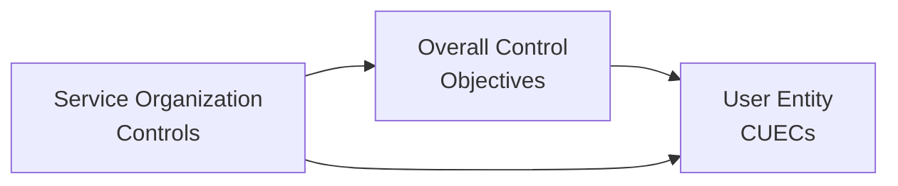

## 25.3 Identifying Complementary User Entity Controls (CUECs)

In a System and Organization Controls (SOC) engagement, a critical concept for all parties—service organizations, user entities, and auditors—is the identification and proper understanding of Complementary User Entity Controls (CUECs). CUECs are specific controls that a user entity (the organization receiving the service) must implement to meet the control objectives outlined by the service organization. Even if the service organization designs and operates its controls effectively, the overall control environment and related objectives may not be achieved without adequate user entity controls.

In this section, we will delve into the role and significance of CUECs, explain how to verify user entity reliance, and clarify disclaimers and caveats concerning user entity responsibilities in controlling risk. By the end of this chapter, you will have a clear perspective on how to identify, evaluate, communicate, and document CUECs within a SOC engagement context.

--------------------------------------------------------------------------------

### Understanding the Concept of CUECs

When a service organization provides a set of control activities—often referred to in a SOC examination as “system description” or “control activities”—some of these controls are dependent on or assume the presence of additional controls at the user entity. For example, a cloud services provider might manage all server patching processes effectively, but the user entity is responsible for ensuring that administrator passwords are robust, changed frequently, and never shared.

• “Complementary” implies that these user entity controls are designed to work in conjunction with the service organization’s controls.  
• “User Entity” refers to the organization that receives services from the service organization and benefits from the resulting control environment.  

An absence or deficiency in these user entity controls may lead to a breakdown in risk mitigation strategies. During a SOC engagement (particularly a SOC 1® or SOC 2® engagement), management of the service organization must disclose any required CUECs in the system description, making it clear what they expect the user entity to perform.

--------------------------------------------------------------------------------

### Significance in SOC Engagements

From a SOC engagement standpoint, CUECs are significant because they:

• Clarify the boundaries of the service organization’s responsibilities versus those of the user entity.  
• Convey how the user entity’s control environment interacts with the service organization’s controls.  
• Affect the completeness of the auditor’s assessment. If vital CUECs are not in place, the user entity may face heightened risk—even when the service organization’s controls are operating effectively.

#### Relationship of CUECs to Control Objectives

Consider a typical control objective such as “Ensuring only authorized personnel have access to financial transaction systems.” A service organization could have strong authentication, firewall, and monitoring controls in place. However, if the user entity does not implement background checks, timely revocation of user access rights, or proper segregation of duties, the overall objective of preventing unauthorized access might not be achieved. The user entity’s portion of the control environment—its own complementary controls—plays a decisive role in achieving the objective.

--------------------------------------------------------------------------------

### Key Steps in Identifying CUECs

Identifying CUECs is an interactive process that typically involves both the service organization and the user entity. Below are key steps to guide that process:

#### 1. Review the Service Organization’s Control Narratives
Service organizations typically include detailed control narratives within the SOC report. Within these narratives or descriptions, the organization will often state assumptions or prerequisites regarding user entity responsibilities. Carefully reading and mapping these narratives is often the first step toward identifying CUECs.

#### 2. Cross-Reference Control Objectives and Risks
Each control objective in a SOC engagement relates to certain risks, such as unauthorized access, data corruption, or inefficient transaction processing. Cross-reference these objectives with standard frameworks or the Trust Services Criteria (for SOC 2®). If you note that an objective presupposes or explicitly states that the user entity is responsible for providing certain security procedures (e.g., controlling physical access to onsite hardware, user-level password management), these become your identified CUECs.

#### 3. Conduct Management Interviews
Meet with the service organization’s management or key personnel to clarify any ambiguous areas. These conversations can unearth responsibilities that might not be explicitly documented but are assumed. For example, the service organization might assume that user entities regularly review audit logs or that they enforce a specific data classification standard. If such assumptions exist, they should be documented as CUECs.

#### 4. Verify Against User Entity Contracts
Often, service-level agreements (SLAs) or master service agreements (MSAs) outline certain user entity responsibilities (e.g., the user entity is responsible for restricting physical access to user devices, or for configuring user-specific firewalls). Reviewing these legal and contractual documents can provide further clarity on what controls the user entity must put in place.

#### 5. Validate with Risk Assessment
Finally, validate identified CUECs using a risk assessment lens. If the user entity fails to implement a certain control, will a significant risk materialize that the system objective might not be achieved? Such an analysis ensures that any CUECs included are relevant and necessary for overall risk mitigation.

--------------------------------------------------------------------------------

### Verifying User Entity Reliance on CUECs

A user entity’s reliance on the service organization’s controls hinges on those controls functioning effectively in tandem with the CUECs. Verifying this reliance typically involves:

1. **Gathering Evidence of Implementation**  
   The user entity should provide evidence (e.g., policies, documented procedures, logs) showing that the described complementary controls are in place. For instance, a user entity that is responsible for controlling logical access might show network access policies, role-based access control (RBAC) documentation, and evidence of periodic user access reviews.
   
2. **Assessing Design and Operating Effectiveness**  
   Just as the service organization’s controls are tested for design and operating effectiveness, the user entity should similarly test its own controls. If a user entity is too small to conduct extensive internal audits, even a limited-scope self-assessment or external advisory engagement might help verify the controls’ effectiveness.

3. **Mapping Controls to Overall Control Objectives**  
   Ensure that each identified CUEC maps to a relevant control objective. This mapping helps both user entity auditors and service auditors understand precisely which parts of the control structure belong to the user entity, simplifying the overall audit process.

4. **Ongoing Communication**  
   Continuous dialogue between the service organization and the user entity is critical, especially as systems, processes, and compliance expectations evolve. Failure to keep lines of communication open may result in outdated assumptions about user entity involvement.

--------------------------------------------------------------------------------

### Disclaimers About User Responsibilities

It is vital to understand that the service organization’s auditors do not opine or provide assurance on user entity controls. Service organizations typically insert disclaimers in the SOC report stating that:

• The service organization is not liable for events arising from the user entity’s failure to implement or maintain the necessary controls.  
• The overall risk environment is jointly shaped by both the service organization’s and user entity’s controls.  
• User entities must exercise due diligence in understanding their responsibilities outlined in the report and other contractual documents.

User entities, for their part, should be diligent in reviewing SOC reports, thoroughly understanding the disclaimers, and ensuring that all CUECs are implemented effectively. In many cases, user organizations incorrectly assume that outsourcing to a service organization absolves them of responsibility for certain risks, which can lead to severe consequences if an incident occurs.

--------------------------------------------------------------------------------

### Practical Example of CUECs

Below is a simplified example illustrating how a user entity’s controls might complement the service organization’s controls:

| Service Organization Control                         | Relevant Control Objective                           | Complementary User Entity Control (CUEC)                                                         |
|------------------------------------------------------|------------------------------------------------------|----------------------------------------------------------------------------------------------------|
| The service organization encrypts all data at rest within its cloud environment using 256-bit AES. | Data confidentiality and privacy.                | The user entity must classify its data properly and ensure only authorized data sets are uploaded. Also, the user entity must manage and protect the encryption keys it holds. |
| The service organization maintains a robust vulnerability management program, including monthly scans and prompt patching. | System security and availability.                | The user entity should regularly update operating systems, browsers, and plugins on user endpoints to prevent vulnerabilities from spreading into the service environment. |
| The service organization implements role-based access controls (RBAC) within its service platform, restricting administrative privileges to a limited circle. | Access security and authorization.             | The user entity must periodically review and revise roles assigned to its staff within the service platform, ensuring that employees leaving the organization or moving into new roles have their access revoked or updated globally. |

From this example, it is evident that while the service organization implements a series of strong controls, those controls presume complementary steps on the part of the user entity.

--------------------------------------------------------------------------------

### Diagram: How CUECs Integrate with Service Organization Controls

Below is a Mermaid diagram that visually represents how complementary user entity controls fit together with the service organization’s controls to support the overall control objectives:

Explanation of the diagram:  
• The service organization’s controls (A) and the user entity’s CUECs (C) both feed into the overall control objectives (B).  
• Arrows flow from both the service organization’s controls and CUECs toward the overall objectives, emphasizing their complementary nature.  
• A direct arrow between A and C underscores the interplay and coordination required for effective risk mitigation.

--------------------------------------------------------------------------------

### Assessing Risk When CUECs Are Not in Place

When CUECs are not effectively designed or operated, risk materializes in several ways:

1. **Exposure to Unauthorized Access**  
   If a user entity neglects to manage its own logical or physical access controls, the entire system environment can become vulnerable, even if the service organization’s perimeter defenses are robust.

2. **Inaccurate or Unreliable Data**  
   The user entity’s failure to maintain robust input validation controls or well-trained staff can introduce errors into systems managed by the service organization.

3. **Regulatory Compliance Failures**  
   Many regulatory frameworks (e.g., HIPAA, GDPR, PCI DSS) assign accountability not just to service organizations but also to the entities outsourcing processes. If data is mishandled by the user entity, both parties could fall out of regulatory compliance.

4. **Litigation and Reputational Damage**  
   In the event of a security incident or data breach, both the service organization and user entity could face legal claims. However, user entities may have limited recourse if they failed to implement the complementary controls specified in the SOC report.

--------------------------------------------------------------------------------

### Best Practices for User Entities

1. **Read SOC Reports Thoroughly**  
   Avoid viewing the SOC report as a mere check-the-box exercise. Instead, read it in its entirety—especially the sections that detail CUECs—to ensure you understand precisely where your responsibilities lie.

2. **Conduct a Gap Analysis**  
   Once you have identified all the CUECs, compare them against your existing control environment. Where there are gaps (e.g., you do not track firmware updates for user devices, or you have no procedures for ongoing log review), develop an action plan to bridge them.

3. **Document and Communicate**  
   Align your documentation with the controls set out in the SOC report, and communicate these responsibilities to relevant stakeholders within the user entity. This may include IT, HR, and compliance teams.

4. **Monitor on an Ongoing Basis**  
   Implement a regular schedule for internal testing of your complementary controls. If your user environment changes—such as new IT systems, reorganizations, or expansions—it is vital to revisit your controls and adjust them accordingly.

5. **Collaborate with the Service Organization**  
   Establish strong communication channels to stay informed about any updates to the service organization’s control environment. This will help ensure that your CUECs remain aligned with any changes or enhancements.

--------------------------------------------------------------------------------

### Common Pitfalls

• **Assuming the Service Organization Covers Everything**  
  Sometimes user entity staff believe their service provider manages all controls. In reality, the user entity typically retains significant responsibility in areas such as user provisioning, data classification, and endpoint protection.

• **Poor Documentation**  
  Even if user controls are in place, a lack of evidence or poorly maintained logs can make it difficult to prove effectiveness to auditors.

• **Failure to Communicate Internally**  
  Organizations that do not clearly assign ownership of each user-level control can inadvertently leave control gaps.

• **Overlooking Subservice Organizations**  
  Some services rely on additional third parties (subservice organizations). The user entity could have responsibilities related to these subservice providers if their systems are integrated or if data flows pass through them.

--------------------------------------------------------------------------------

### Assessing Materiality of CUECs in SOC 1® vs. SOC 2® Contexts

• **SOC 1®**  
  In a SOC 1® context, materiality is typically determined from a financial statement audit perspective. The user entity needs to verify that its controls (e.g., segregation of duties, approvals, reconciliations) operate in tandem with the service organization’s processes for accurate transactional and financial reporting.

• **SOC 2®**  
  In SOC 2® engagements, materiality is judged in relation to the Trust Services Criteria: Security, Availability, Processing Integrity, Confidentiality, and Privacy. CUECs may revolve around how user data is classified or accessed. For example, in fulfilling the Privacy category, the user entity may need to ensure it only uploads personal data for which it has proper consent.

--------------------------------------------------------------------------------

### Legal and Contractual Disclaimers

Service organizations’ responsibilities are guided by legal relationships and contractual obligations. Most SOC reports include disclaimers that, while the service organization implements a robust control environment, user entities are still expected to perform specific tasks. These disclaimers or disclaimers of liability may appear in:

• The SOC 1® or SOC 2® Description of the System.  
• The “Control Activity” or “Management Assertion” sections, referencing controls to be performed by the user entity.  
• Addendums or appendices describing user entity responsibilities.  

Ultimately, the user entity must carefully review these disclaimers and ensure that it adequately addresses all required CUECs.

--------------------------------------------------------------------------------

### Practical Tips for Auditors

Auditors evaluating whether CUECs are in place should:

• Request user entity documentation and evidence of operation.  
• Configure test procedures that align with the overall audit scope.  
• Use inquiry, observation, and re-performance to confirm the presence of controls.  
• Communicate findings to both user entity management and, as needed, the service organization—particularly if the absence of certain controls undermines the auditor’s ability to conclude on overall risk.

--------------------------------------------------------------------------------

### Example Case Study

Imagine a payment processing service organization that handles thousands of daily credit card transactions for user entities. The service organization’s SOC 1® report states: “The user entity is responsible for restricting physical and logical access to payment data at its own facilities.” In this scenario:

• The service organization implements a Payment Card Industry Data Security Standard (PCI DSS)-compliant environment.  
• The user entity is expected to maintain secure card readers, store receipts safely, and segregate any personal data from general business data on its local networks.  

If a particular user entity fails to fulfill these responsibilities—say, it lacks a dedicated secure area to store hardcopy receipts—this gap could expose credit card data. In a breach, the user entity bears significant responsibility, as it neglected to implement its CUECs.

--------------------------------------------------------------------------------

### Conclusion

Complementary User Entity Controls (CUECs) lie at the heart of the partnership between a service organization and its users under a SOC engagement. Effective risk mitigation and achievement of control objectives demand that both parties align their respective controls. By clarifying assumptions, verifying reliance, maintaining open communication, and respecting disclaimers about user responsibilities, stakeholders can bolster the control environment and navigate the complexities of today’s regulatory and technological landscapes.

--------------------------------------------------------------------------------

## Test Your Knowledge: Complementary User Entity Controls Quiz



### Which statement best describes the purpose of Complementary User Entity Controls (CUECs) in a SOC engagement?

- [ ] They are controls that service auditors test exclusively at the user entity’s request.
- [x] They are user entity controls that must work with the service organization’s controls to achieve control objectives.
- [ ] They are optional controls that service organizations recommend but do not require.
- [ ] They are emergency procedures only suitable during a security breach.

> **Explanation:** CUECs are those controls that the user entity is expected to implement to complement or “fill in” the control environment established by the service organization.  

### What is a common legal or contractual disclaimer regarding CUECs found in SOC reports?

- [ ] That user entities must undergo annual PCI audits.
- [ ] That service organizations assume all legal liability for user entity controls.
- [x] That user entities bear responsibility for implementing designated controls to mitigate risk.
- [ ] That CUECs automatically apply to sister companies of the user entity.

> **Explanation:** SOC reports typically clarify user entity responsibilities and state that failure to implement CUECs can undermine the overall control environment.  

### Why is it important for a user entity to thoroughly review the SOC report’s description of the system?

- [x] It specifies any controls that the user entity must implement to ensure the service organization’s control objectives are met.
- [ ] It provides detailed staff contact information for service organization managers.
- [ ] It contains the internal budget and accounting records for the service organization.
- [ ] It allows the user entity to direct the service auditor’s testing procedures.

> **Explanation:** The description of the system in a SOC report often outlines the controls and assumptions, including CUECs, needed from user entities.  

### Which method is most effective for verifying that user entities are implementing CUECs?

- [ ] Accepting the service organization’s statement without further inquiry.
- [ ] Providing a standard questionnaire to the user entity once every five years.
- [x] Reviewing documentation, conducting walkthroughs, and testing user entity controls.
- [ ] Assuming user entities have automatically implemented controls according to industry standards.

> **Explanation:** For assurance that CUECs are operating effectively, an auditor or the user entity’s internal team must inspect relevant documentation and potentially test the controls.  

### Which of the following is a likely consequence if a user entity fails to implement prescribed CUECs?

- [x] The overall control objective may not be achieved, resulting in potential security or compliance failures.
- [ ] The user entity will automatically pass its external compliance audits.
- [x] The service organization’s SOC opinion may be compromised or flagged.
- [ ] The user entity gains better performance results from the service organization’s system.

> **Explanation:** Inadequate CUECs create gaps in the overall control environment, elevating risk and potentially affecting both security and compliance outcomes.  

### How do CUECs differ in a SOC 1® engagement versus a SOC 2® engagement?

- [x] In SOC 1®, materiality is viewed from a financial statement perspective, while in SOC 2®, it focuses on Trust Services Criteria.
- [ ] SOC 1® user entity controls are exclusively related to data encryption.
- [ ] SOC 2® user entity controls only address physical security, while SOC 1® covers logical access.
- [ ] There is no difference; CUECs play no role in SOC 2® engagements.

> **Explanation:** SOC 1® focuses on controls relevant to financial reporting, whereas SOC 2® addresses Trust Services Criteria such as security, availability, confidentiality, processing integrity, and privacy. CUECs for each often differ in scope and focus.  

### Which of the following is the primary benefit of performing a gap analysis on identified CUECs?

- [x] It helps the user entity pinpoint where additional controls or improvements are necessary to align with SOC report requirements.
- [ ] It removes the need for auditor testing.
- [x] It clarifies any overlaps in the service organization’s and user entity’s responsibilities.
- [ ] It automatically guarantees successful compliance with all frameworks.

> **Explanation:** By comparing required CUECs against existing internal controls, the user entity can quickly determine which controls need enhancement and avoid duplicating responsibilities.  

### What is the service organization auditor’s responsibility regarding CUECs?

- [ ] To conduct a deep-dive audit at every user entity location.  
- [ ] To accept user entity assurances without verification.  
- [ ] To guarantee the user entity’s controls meet all regulatory standards.  
- [x] To disclose the necessity for user entity controls and clarify the boundaries of the audit scope.  

> **Explanation:** The service auditor typically details the user entity’s control requirements in the SOC report but does not opine on their presence or effectiveness at the user entity.  

### How can ongoing communication between a service organization and user entities benefit the control environment?

- [ ] It ensures all risk is assumed by the service organization.  
- [x] It keeps both parties informed about control changes, emerging threats, and evolving system requirements.  
- [ ] It reduces the burden of user entity controls.  
- [ ] It eliminates the need to test operating effectiveness.

> **Explanation:** Continual dialogue ensures that any revisions to systems, processes, or contractual obligations are swiftly understood and accounted for.  

### The service organization’s encryption control will be ineffective if the user entity fails to secure its endpoints and manage encryption keys properly.

- [x] True
- [ ] False

> **Explanation:** Encryption at the service organization’s level is only partly effective if the user entity does not manage encryption keys or secure endpoints, resulting in potential unauthorized access to data.



--------------------------------------------------------------------------------

## For Additional Practice and Deeper Preparation

### [Information Systems and Controls (ISC)](https://www.udemy.com/course/isc-cpa-mock-exams/?referralCode=E1217303222935C5E464)  

**Information Systems and Controls (ISC) CPA Mocks:** 6 Full (1,500 Qs), Harder Than Real! In-Depth & Clear. Crush With Confidence!  

- Tackle full-length mock exams designed to mirror real ISC questions.  
- Refine your exam-day strategies with detailed, step-by-step solutions for every scenario.  
- Explore in-depth rationales that reinforce higher-level concepts, giving you an edge on test day.  
- Boost confidence and minimize anxiety by mastering every corner of the ISC blueprint.  
- Perfect for those seeking exceptionally hard mocks and real-world readiness.  

_Disclaimer: This course is not endorsed by or affiliated with the AICPA, NASBA, or any official CPA Examination authority. All content is for educational and preparatory purposes only._
