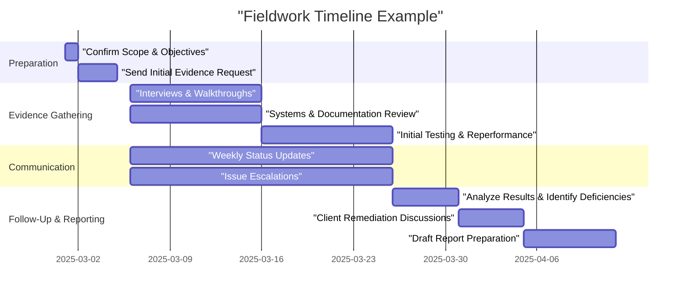

## 25.4 Fieldwork and Communication with Stakeholders

Effective fieldwork and clear communication strategies are vital components of any System and Organization Controls (SOC) engagement. During fieldwork, service auditors gather and examine evidence supporting the design and operating effectiveness of the service organization’s controls. Communication with stakeholders ensures transparency, alignment on objectives, timely resolution of issues, and sustained engagement from all parties. This section provides an in-depth view of how to structure and conduct fieldwork, manage evidence gathering, build strong client relationships, and provide meaningful updates throughout the SOC engagement lifecycle.

### The Significance of Fieldwork in SOC Engagements
Fieldwork is the heart of any SOC engagement. It involves gathering sufficient, appropriate evidence to assess controls over financial reporting (SOC 1® engagements) or over the Trust Services Criteria (SOC 2® engagements). If planned and performed effectively, fieldwork forms a sound basis for conclusions about control design and operating effectiveness.

• Reinforces the auditor’s independence while promoting confidence in the final results.  
• Ensures that testing is rigorous, adequately documented, and meets professional standards.  
• Informs stakeholders of key findings and complexities early in the SOC reporting process.

Fieldwork typically starts once the engagement team has completed planning and risk assessment activities (see Chapter 25: Planning and Performing a SOC Engagement for a full discussion on the planning phase). Although the extent of testing can vary based on the engagement scope, commonalities exist across SOC examination types. Consistent communication streams are essential to keep all parties on the same page regarding issues, timelines, and deliverables.

### Common Evidence Gathering Activities
Gathering evidence entails a careful review of the controls, procedures, and systems in place at the service organization. Evidence can be obtained using a variety of methods:

• Interviews and Walkthroughs: Conversations with management and process owners help the auditor confirm operational details and identify control gaps. Walkthroughs of key processes show how controls are implemented in real-world scenarios.  
• Inspection of Documents: Reviewing policies, procedures, system logs, audit trails, and change management tickets helps verify whether controls are formally documented and consistently applied.  
• Observation: Directly observing processes and activities in the production environment, such as access provisioning or batch job processing, can verify that controls operate effectively on a day-to-day basis.  
• Reperformance: The service auditor may replicate a client’s procedure using the client’s data and systems to validate the results. For example, reperforming user access reviews or reconciling a batch processing log helps ensure accuracy.  
• Data Analytics: Automated testing can evaluate larger populations of transactions or access rights more efficiently. For example, analyzing a sample set of database access logs to confirm that only authorized personnel have permission to modify sensitive tables.

Taken together, these evidence-gathering methods offer a broad yet in-depth look at the design and performance of an organization’s internal controls.

### Key Stakeholder Communication Touchpoints
Communication strategies should be designed to address the unique needs of each party involved in the SOC engagement. By establishing transparent and consistent interactions, you minimize confusion, reduce rework, and promote mutual understanding.

• Kickoff Meeting: At the start of fieldwork, hold a meeting with the service organization’s management and engagement team to revisit the scope, timeline, and necessary resources. This ensures that everyone understands what needs to be done before the evidence-gathering process commences.  
• Ongoing Status Updates: Provide frequent but concise updates through scheduled calls or emails. Topics might include evidence requests, open items, any pivots or additions to the testing scope, and early indications of exceptions or issues.  
• Issue Escalations: If deficiencies or unusual findings arise, promptly communicate them to the relevant client stakeholders. Early awareness enables timely remediation or clarifying discussions that can prevent confusion later.  
• Interim Deliverables and Review Sessions: Summarize preliminary findings or draft observations to the client during the engagement. This helps identify misunderstandings early and allows for timely corrective actions.

Timely and open communication not only fortifies relationships but also reduces the risk of unexpected issues as the engagement progresses.

### Practical Example: Fieldwork Timeline
The following example timeline offers an overview of how the fieldwork phase in a SOC engagement might unfold over the course of several weeks. Actual timelines vary depending on the size of the organization, the complexity of the environment, and the SOC engagement type.

1. Preparation Phase (Before 2025-03-06):  
   • Confirm that the scope derived from the engagement letter aligns with risk assessment findings.  
   • Send the first wave of evidence requests to the client.  

2. Evidence Gathering Phase (2025-03-06 to 2025-03-25):  
   • Conduct interviews of key process owners and walk through relevant systems.  
   • Collect policies, procedures, system logs, and other documents that support the controls.  
   • Begin initial testing (e.g., reperforming user access reviews) to validate control effectiveness.  

3. Ongoing Communication (2025-03-06 to 2025-03-25):  
   • Provide weekly status updates on fieldwork progress, outstanding items, and discovered issues.  
   • Schedule escalation calls or meetings when critical exceptions or areas of concern emerge.  

4. Follow-Up & Reporting Phase (2025-03-26 onward):  
   • Consolidate and analyze testing results to identify control gaps and deficiencies.  
   • Discuss possible remediation approaches with the client to address identified deficiencies.  
   • Start preparing the draft SOC report for management review and eventual distribution.  

### Best Practices for Streamlined Fieldwork
Because effective fieldwork can significantly impact the quality of the final SOC report, consider these best practices:

• Plan Thoroughly: Develop a clear testing plan outlining objectives, responsibilities, and timing. Consider referencing Chapter 4 (Key Concepts of IT Audit and Assurance) for aligning IT audit objectives with broader assurance strategies.  
• Designate a Central Point of Contact: Assign a single individual (or small team) at the client responsible for gathering evidence, scheduling interviews, and coordinating stakeholder schedules.  
• Employ Technology Tools: Use project management software to track requests and testing progress. Leverage data analytics tools to conduct testing on large populations.  
• Maintain Professional Skepticism: Approach all evidence with a questioning mind to avoid relying on unaudited management representations.  
• Document Thoroughly: Keep a detailed audit trail of testing and sampling procedures, including how you concluded on operating effectiveness.  

### Common Pitfalls and How to Avoid Them
1. Poor Integration of IT Testing and Business Processes: Failing to link IT controls to business-related risk can weaken conclusions. To avoid this pitfall, map each control to relevant financial or operational processes, ensuring alignment with the overall SOC objective.  
2. Inadequate Evidence Quality: Overreliance on self-reported data without corroborating evidence can undermine the integrity of the audit. Use direct observation, documentation, and reperformance whenever possible.  
3. Misaligned Timelines: Insufficient time allocated for both fieldwork and stakeholder reviews can lead to rushed conclusions and an incomplete audit trail. Work closely with management to finalize scheduling and resource needs well in advance.  
4. Lack of Clear Ownership: When multiple parties handle evidence, confusion over responsibilities can cause delays. Assign distinct roles explicitly, including who collects, reviews, and approves each piece of evidence.  
5. Delayed Resolution of Issues: Procrastinating on addressing exceptions or questionable findings can compound problems. Engage management as soon as issues surface to collaborate on remediation or corrective actions.

### Communication Approaches That Foster Trust
Throughout fieldwork, fostering a relationship of trust and respect goes hand-in-hand with gathering quality evidence. Consider:

• Empathy and Clear Context: Demonstrate an understanding of the client’s operational challenges. Encourage them to share any contextual factors that might affect control design.  
• Collaborative Problem-Solving: If issues are discovered, emphasize solutions that can realistically fit into the client’s existing framework rather than dictating rigid remedies.  
• Confidentiality: Reinforce the confidentiality of data gathering efforts, especially for sensitive information that can involve personal data or proprietary systems.  
• Feedback Loops: After fieldwork is complete, schedule a lessons-learned session to collect client feedback. Understanding their experience can improve engagement processes for future SOC examinations.

### Real-World Scenario: Mid-Engagement Discovery of a Control Deficiency
Imagine a SOC 2® engagement at a cloud service provider. The auditor, while performing a walkthrough of the client’s identity and access management processes, discovers that user access reviews have not been consistently documented for the last quarter. The client’s policy states monthly reviews, but the supporting evidence is incomplete. The auditor quickly communicates this deficiency to management, highlighting both the policy-reality gap and potential ramifications for compliance with the Security principle of the Trust Services Criteria. Management then re-initiates the monthly review process, retrieves partial historical evidence, and deploys an automated control within their ticketing system to ensure monthly reviews are logged. By promptly identifying the issue and collaborating on a remediation approach, the engagement remains on track, and the final report can include a note on management’s remediation measures without prolonging the fieldwork or releasing an incomplete or qualified opinion.

In such scenarios, swift and open communication ensures timely remediation. This transparency could prove crucial for building trust, avoiding scope creep, and maintaining a positive working relationship with the client.

### Conclusion
Fieldwork in SOC engagements is a methodical, detail-oriented process that demands strong project management and continuous engagement with stakeholders. By combining rigorous evidence-gathering techniques with transparent communication, CPAs and IT auditors can develop a well-supported opinion on the service organization’s control environment. Beyond merely fulfilling the requirements of an SOC examination, disciplined fieldwork and proactive communication instill confidence in the service organization, user entities, and other interested parties.  

For more insights into the broader methodology behind SOC engagements or to deepen your understanding of related processes—such as risk assessment, materiality considerations, and reporting—refer to Chapters 22 through 26 of this guide.

-----

## Fortify Your SOC Fieldwork Knowledge: A Comprehensive Quiz



### During fieldwork for a SOC engagement, which of the following evidence-gathering methods best helps verify that a control operates effectively on a daily basis?
- [ ] Conducting a management representation letter review
- [ ] Reviewing policy documents only
- [x] Observing the control in the production environment
- [ ] Examining user manuals
> **Explanation:** Observing a control’s real-time operation in the production environment provides direct evidence that it is functioning as intended on a day-to-day basis.

### What is the primary benefit of holding scheduled, frequent status update meetings with the client during fieldwork?
- [ ] To request additional service fees
- [x] To track progress, discuss open items, and mitigate issues in real time
- [ ] To simplify control testing
- [ ] To pre-review the final SOC report
> **Explanation:** Regular updates help both the service auditor and client address any issues quickly, align on testing progress, and avoid any unwelcome surprises late in the engagement.

### Which of the following is a best practice to ensure that client-provided evidence is appropriately documented and tested?
- [x] Maintain a detailed audit trail that references each evidence item to the testing steps
- [ ] Rely solely on client representations about control effectiveness
- [ ] Perform spot checks on only the largest or most critical processes
- [ ] Limit documentation to hardcopy records only
> **Explanation:** A detailed audit trail demonstrates how each piece of evidence was tested and supports conclusions regarding control effectiveness. It is one of the most effective ways to ensure completeness and quality.

### An organization’s policy states monthly user access reviews are required. Upon inspection, you discover only two random reviews over the last four months. What is the appropriate approach to address this deficiency?
- [ ] Disregard the deficiency if the reviews were at least performed once
- [ ] Immediately terminate the engagement
- [x] Communicate the deficiency to management and collaborate on remediation actions
- [ ] Issue a final qualified report without further discussion
> **Explanation:** Early communication of deficiencies allows management an opportunity to correct or mitigate the risk. This approach maintains trust and ensures the final SOC engagement report is accurate and reflects corrective actions.

### Which of the following most closely describes the role of risk assessment during fieldwork?
- [x] It guides the selection and extent of testing performed
- [ ] It only applies after a control deficiency has been identified
- [ ] It allows the auditor to omit scope items at will
- [ ] It replaces the need for formal testing procedures
> **Explanation:** Risk assessment helps the auditor focus on controls that are most likely to lead to material misstatements or service disruptions. This ensures a more efficient and relevant testing approach.

### Why is it important to have a single point of contact at the client organization for a SOC engagement?
- [x] To streamline communication and evidence collection
- [ ] To delegate audit tasks to multiple departments
- [ ] To negotiate lower audit fees
- [ ] To approve all changes to the audit scope
> **Explanation:** A single point of contact (or a small coordination team) avoids confusion and delays, ensuring fieldwork requests are properly handled and communication lines remain clear.

### What is one advantage of using automated data analytics in SOC fieldwork?
- [ ] It eliminates the need for interviews or walkthroughs
- [x] It allows testing of larger sample sizes or entire populations
- [ ] It replaces the need to issue an audit opinion
- [ ] It prevents clients from seeing the final testing results
> **Explanation:** Automated data analytics enable auditors to test large volumes of data, helping identify exceptions that might be missed in a smaller, manual sample. This can provide more robust, evidence-based conclusions.

### When significant exceptions or deficiencies are identified during fieldwork, what immediate action is generally recommended?
- [ ] Submitting a final audit report with qualified opinions
- [x] Escalating them to the client and discussing possible remediation steps
- [ ] Ignoring them until the reporting phase
- [ ] Terminating the audit and advising the client to hire another firm
> **Explanation:** Prompt escalation ensures that both auditor and client can work collaboratively to either fix the issues or document corresponding impacts in the final SOC report.

### Which factor primarily influences the complexity and duration of the evidence-gathering process during fieldwork?
- [ ] The personal preferences of the auditing team
- [x] The size and complexity of the client’s operations
- [ ] The preexisting relationship between auditor and client
- [ ] The length of the service agreement
> **Explanation:** The scale and intricacy of the client’s IT environment, controls, and processes significantly affect the scope and duration of the testing required.

### Fieldwork in a SOC engagement focuses on both design and operating effectiveness of controls. True or False?
- [x] True
- [ ] False
> **Explanation:** SOC engagements generally evaluate whether controls are suitably designed (i.e., capable of meeting the stated objectives) and whether they operated effectively over a specified period.



-----

## For Additional Practice and Deeper Preparation

### [Information Systems and Controls (ISC)](https://www.udemy.com/course/isc-cpa-mock-exams/?referralCode=E1217303222935C5E464)  

**Information Systems and Controls (ISC) CPA Mocks:** 6 Full (1,500 Qs), Harder Than Real! In-Depth & Clear. Crush With Confidence!

- Tackle full-length mock exams designed to mirror real ISC questions.  
- Refine your exam-day strategies with detailed, step-by-step solutions for every scenario.  
- Explore in-depth rationales that reinforce higher-level concepts, giving you an edge on test day.  
- Boost confidence and minimize anxiety by mastering every corner of the ISC blueprint.  
- Perfect for those seeking exceptionally hard mocks and real-world readiness.

_Disclaimer: This course is not endorsed by or affiliated with the AICPA, NASBA, or any official CPA Examination authority. All content is for educational and preparatory purposes only._
