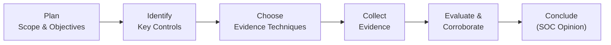

## 25.5 Gathering Evidence: Tools and Example Testing Techniques

Effective evidence gathering is at the heart of any successful System and Organization Controls (SOC) engagement. Whether you are conducting a SOC 1®, SOC 2®, SOC 3®, or SOC for Cybersecurity examination, the ultimate objective is to form an opinion on the design and operating effectiveness of the service organization’s controls. This requires obtaining sufficient, appropriate evidence to reduce the risk of issuing an incorrect opinion to an acceptably low level. In this section, we explore the types of evidence, techniques, and tools that can be used to gather it, and best practices for evaluating evidence reliability. We also provide real-world examples and practical advice that can be applied to your engagements immediately.

Beyond the specific guidance in this chapter, you may find it helpful to recall overarching standards and frameworks discussed in earlier chapters, such as COSO Internal Control – Integrated Framework (Chapter 3.1) and COBIT 2019 (Chapter 3.3), which provide valuable context for understanding control governance. Keep in mind that the rigorous nature of SOC engagements demands consistent, systematic, and well-documented evidence collection—an important part of the planning and performance stage (see Chapter 25).

-------------------------------------------------------------------------------

### Understanding Evidence in SOC Engagements

In a SOC engagement, evidence refers to any information used by the service auditor to support or contradict management’s assertions. Commonly, you will evaluate evidence related to the design of controls, their operating effectiveness, or both, depending on whether the engagement is Type 1 (design only) or Type 2 (design and operating effectiveness). Each piece of evidence you collect must meet two overarching criteria:

• Sufficient: The quantity of evidence must be enough to form a reasonable basis for your opinion.  
• Appropriate: The evidence must be relevant and reliable in supporting or refuting the control objectives or Trust Services Criteria (for SOC 2®) under examination.

The evidence typically takes the form of:  
1. Inspection of documents and records (e.g., logs, policies, system reports).  
2. Observation (real-time or recorded) of control operations (e.g., IT staff performing backups).  
3. Inquiry (interviews or written questionnaires) of personnel or third-party subservice organizations.  
4. Re-performance (executing processes or controls to verify results).  
5. Analytical procedures (trending analysis, ratio analysis, etc., particularly relevant where repeated transactions are tested).  

Combining these methods is crucial for ensuring evidence sufficiency. For example, an auditor reviewing user access controls might inspect system logs, interview the system owner, observe the password reset process, and re-perform an access provisioning exercise. Each strand of evidence bolsters the overall conclusion.  

-------------------------------------------------------------------------------

### Common Tools for Gathering Evidence

Selecting the right tools can streamline data collection and help detect anomalies and deficiencies more efficiently. Below is an overview of widely used tools that can assist in gathering valid and reliable evidence during a SOC engagement:

#### 1. Log Analysis Utilities
• Purpose: Examine application, database, or network logs for unusual activity, control exceptions, or patterns of normal operation.  
• Examples: Splunk, Graylog, LogRhythm, and open-source solutions such as the ELK Stack (Elasticsearch, Logstash, Kibana).  
• Benefits: Quick identification of suspicious activities, correlation of log events across multiple systems, and centralized management for large volumes of data.  

#### 2. Configuration Management Tools
• Purpose: Capture and compare system, application, or device configurations against baseline settings or prior states.  
• Examples: Chef, Puppet, Ansible, Microsoft Sysinternals, and built-in operating system utilities.  
• Benefits: Facilitates tracking of unauthorized or accidental configuration changes, captures system states for subsequent re-performance, and helps ensure alignment with baseline security benchmarks or compliance standards.  

#### 3. GRC (Governance, Risk, and Compliance) Platforms
• Purpose: Provide centralized repositories for policies, risks, controls, and compliance requirements. Automate workflows for issue tracking and remediation.  
• Examples: ServiceNow GRC, MetricStream, RSA Archer, and other integrated risk management software.  
• Benefits: Consolidated environment for documenting test procedures, tracking remediation, capturing evidence, assigning responsibilities, and producing final SOC reporting deliverables.  

#### 4. Data Analytics and Sampling Software
• Purpose: Conduct advanced analytics, identify patterns or anomalies in financial and operational data, and facilitate sampling approaches.  
• Examples: IDEA, ACL (Galvanize), Alteryx, or standard audit sampling modules in broad analytics platforms.  
• Benefits: Enables large-scale testing of entire populations or risk-based sampling, potential reduction in human error, and faster detection of outliers or exceptions.  

#### 5. Collaboration and Workflow Management Tools
• Purpose: Manage deadlines, tasks, and communication across geographically dispersed engagement teams and client personnel.  
• Examples: Microsoft Teams, Trello, Asana, or custom portals for document exchange (e.g., Box, SharePoint).  
• Benefits: Real-time collaboration, streamlined evidence requests, improved version control, more efficient data collection, and transparent progress tracking.  

-------------------------------------------------------------------------------

### Techniques for Testing and Gathering Evidence

Several testing techniques are available for SOC engagements, and each technique fits different objectives or control types. Effective engagements often rely on a combination of methods to maximize the reliability of conclusions.

#### Inspection of Documentation
Inspection is one of the most common and straightforward auditing procedures. You validate the existence and appropriateness of a control by reviewing formal documents including policies, procedures, system logs, configuration files, and records of transactions processed during the period under review.

• Example: For user access reviews, you might inspect lists of disabled or terminated user accounts, compare them to the most recent HR termination list, and verify timely revocation of credentials.

• Considerations: Ensure the documentation is complete and up-to-date. Cross-check system timestamps, version histories, or signature blocks to confirm authenticity.

#### Observation
Observation involves watching a control or process being performed. In IT environments, this may include seeing how employees handle data backups, monitor performance dashboards, or how help-desk employees verify user identities before password resets.

• Example: Observe how IT operators perform daily server health checks and note any anomalies or exceptions.  
• Considerations: Observation captures real-world control execution, but it is moment-in-time. Therefore, it might need to be supplemented by subsequent inquiries or inspection of logs to confirm consistent operation over the entire audit period.

#### Inquiry
Inquiry uses interviews, questionnaires, or direct communication with knowledgeable personnel to better understand processes, control environment, or undocumented aspects of an organization’s control activities. While inquiry can yield valuable context, it should rarely stand alone as the sole evidence source.

• Example: Interview the network administrator to clarify the nature of certain firewall rules or to confirm patch management workflows.  
• Considerations: Corroborate results from inquiries with at least one other form of evidence—inspection of network device configurations, logs of patch deployments, or direct observation—to rule out misunderstandings or unintentional misrepresentations.

#### Re-performance
Re-performance is a powerful technique where the auditor independently executes the same procedures performed by the organization’s personnel to confirm accuracy and completeness. This is widely used for evaluating transaction processes within an application, verifying configurations, or testing calculations in financial statements.

• Example: 
   1. You might re-perform a “new user setup” request in an enterprise resource planning (ERP) system to ensure the system enforces mandatory password complexity.  
   2. Re-run an automated calculation that posts transactions to the general ledger to confirm consistent results.

• Considerations: Require the same dataset or scenario to ensure results can be compared one-to-one. Ensure you obtain read-only credentials or a controlled test environment to avoid inadvertently changing production data.

#### Analytical Procedures
Analytical procedures include ratio analysis, trend identification, or predictive modeling. They are especially useful where large volumes of data are involved, such as high-frequency transactions. This may be supplemented with advanced data analytics techniques—time-series analyses, outlier detection, or machine learning–based clustering.

• Example: Compare monthly revenue to the prior year, adjusted for known business changes, to assess reasonableness. Outliers could signal unauthorized adjustments or system errors.  
• Considerations: While powerful, these methods require careful selection of data inputs and assumptions. The results are typically more instructive as indicators of possible issues rather than conclusive proof of control effectiveness.

-------------------------------------------------------------------------------

### Sampling of System Logs and Transactions

SOC engagements often cover large volumes of transactions or massive log files. Reviewing all data may be impractical, so sampling becomes a critical part of evidence gathering. Effective sampling strategies can help reduce engagement costs and time while retaining reliability.

#### Defining Your Population
Before sampling can begin, clearly define the population. For example:  
• All user access changes during the review period  
• All firewall configuration changes  
• All Journal Entry (JE) postings above a specific threshold  

#### Determining Sample Size
Sample size depends on factors such as desired confidence level, acceptable risk of errors, and the complexity of the population. A simplified (though not the only) formula for sample size determination is:


n = \dfrac{Z^2 \times p \times (1 - p)}{e^2}


Where:  
• n is the sample size.  
• Z is the Z-score for the desired confidence level.  
• p is your estimated or expected proportion of deviations in the population.  
• e is the acceptable sampling error (precision).

For example, if you need 95% confidence (Z ≈ 1.96), expect 5% deviations (p = 0.05), and can tolerate 3% margin of error (e = 0.03), you could approximate the required sample size for a homogeneous population. In practice, SOC engagements often use more nuanced statistical or non-statistical methods—both can be acceptable if properly justified.

#### Selecting and Testing Items
You might employ random, systematic, or judgmental sampling based on risk. For instance, if certain high-risk transactions or log types are more likely to reveal control deficiencies, a targeted sample approach might be warranted. Once selected:  
1. Obtain the logs or records for items in the sample.  
2. Compare recorded actions to documented policies or expected results.  
3. Investigate notable exceptions—lack of approvals, suspicious IP addresses, incomplete fields—before concluding.  

-------------------------------------------------------------------------------

### Re‑Performing System Configurations

Re‑performance of system configurations can be one of the most reliable ways to validate IT general controls (ITGCs), which aligns with Chapter 8 (IT General Controls) discussion. By manually or automatically checking the same configurations tested by the organization, you reduce reliance on an organization’s internal documentation alone.

**Example: Testing a Firewall Configuration**  
1. Export current firewall rules.  
2. Compare active configuration to a baseline ruleset or to the documented configuration.  
3. Re-run network scans (e.g., using Nmap or Nessus) to confirm open/closed ports match the firewall rule definitions.  

**Example: Testing a Database Configuration**  
1. Query system tables for settings such as password length, password history, or account lockout.  
2. Compare these settings to the organization’s security policy.  
3. Attempt to create a weak password (e.g., “Password1”) to verify if the database rejects it.  

**Considerations:**  
- Re-performance of configurations usually requires specialized access or test environments to avoid altering production data.  
- Keep precise timestamps and results to demonstrate when exactly you performed the test and confirm that no changes happened between the date of original configuration and the re-performance date.  
- Thoroughly document any deviations discovered and confirm their significance to the broader audit objectives.

-------------------------------------------------------------------------------

### Evidence Triangulation and Corroboration

Just as a geodesist uses triangulation for precise mapping, a service auditor should integrate multiple evidence sources to form a robust conclusion. Two or more types of evidence pointing to the same conclusion greatly enhance confidence.

Suppose you want to verify that termination procedures are functioning effectively within the HR and IT systems:  
1. **Inquiry:** Interview the HR manager on offboarding steps.  
2. **Inspection:** Review the HR policy that requires all terminations be communicated to IT within one business day.  
3. **Re-performance:** Obtain a sample of terminated employees. Re-create the process of removing access in a test environment, if feasible, or at least compare timestamps of user directory disablement to the termination date.  
4. **Observation:** Witness an actual in-process termination case (if available) or observe how IT help desk receives HR notifications.  

If all four evidence sources align, it strongly supports the conclusion. However, if you find conflict—for example, the logs show delayed account revocation or the help desk overlooked a termination request—further investigation is warranted.

-------------------------------------------------------------------------------

### Example Case Study: Analyzing an ERP’s Change Management Controls

To illustrate these concepts, consider a service organization using a popular ERP system. One of their control objectives is that all program changes are authorized, tested, and approved in a dedicated test environment prior to migration to production.

**Key Steps in Gathering Evidence:**

1. **Inquiry and Documentation Review**  
   - Interview the change manager about how tickets flow from “Open” to “Completed.”  
   - Review the formal change management policy, noting the required signatures for authorization.

2. **Sampling Change Tickets**  
   - From the complete ticket population, pull a random sample of 25 changes.  
   - Verify each ticket has a documented test plan, user acceptance testing sign-off, and final approval from the IT manager.

3. **Observation**  
   - Sit with a developer during a typical software patch deployment. Confirm the patch is applied first in the staging environment, tested with a designated test group, and only then promoted to production.

4. **Re-performance**  
   - Log into the staging environment to confirm a patch was tested on “Test Server 001.” Compare the date/time of the patch’s staging deployment to the date/time of deployment in production, confirming proper sequencing.

5. **Triangulation**  
   - Corroborate the developer’s statements (inquiry) with the change management policy (inspection) and your direct re-performance. Any discrepancy among these sources indicates a possible control deficiency.

-------------------------------------------------------------------------------

### Visual Overview of the Evidence-Gathering Process

Below is a Mermaid diagram summarizing the general flow of evidence gathering in a SOC engagement:

• A → B: Define engagement objectives and scope to determine which controls are in play.  
• B → C: Select testing strategies tailored to the controls’ nature (e.g., re-performance, inspection).  
• C → D: Execute the chosen procedures, using tools and best practices to gather evidence.  
• D → E: Analyze findings, investigate exceptions, and cross-validate with multiple sources.  
• E → F: Form conclusions on control effectiveness and craft your SOC report.

-------------------------------------------------------------------------------

### Common Pitfalls and Mitigation Techniques

1. **Overreliance on Inquiry**  
   - Pitfall: Accepting spoken or emailed explanations without corroboration can overlook errors or misstatements.  
   - Mitigation: Pair inquiries with inspection, observation, or re-performance to confirm accuracy.

2. **Inadequate Sampling**  
   - Pitfall: Using non-representative sampling or sampling too few items can lead to false comfort.  
   - Mitigation: Define your population carefully, use statistical or risk-based sampling where appropriate, and adjust sample sizes if your results indicate higher error rates than expected.

3. **Inconsistent Documentation**  
   - Pitfall: Failing to document exactly how evidence was obtained or link the evidence to the control objective.  
   - Mitigation: Use standardized templates and robust GRC tools to log each piece of evidence, date/time, who performed the procedure, and how it relates to the control in question.

4. **Ignoring System-Generated Evidence Integrity**  
   - Pitfall: Auditors often rely on system logs or automated reports without ensuring the system generating them has appropriate access controls.  
   - Mitigation: Evaluate IT general controls (Chapter 8) around system security, logging, and data integrity. Confirm logs or system reports cannot be altered without detection.

5. **Excessive Trust in Third-Party Attestations**  
   - Pitfall: Relying on subservice organizations’ reports without evaluating them can lead to coverage gaps.  
   - Mitigation: Incorporate bridging letters or evaluate subservice organizations’ SOC reports if they are material to your engagement.

-------------------------------------------------------------------------------

### Best Practices for Effective Evidence Gathering

• **Maintain Continuous Communication:** Keep open dialogues with key client personnel, especially when dealing with complex configurations or specialized software.   
• **Use Audit Trails and Automated Tools:** Automate as much as possible (e.g., log analysis, system configuration checks) to reduce manual effort and errors.  
• **Adopt a Risk-Based Approach:** Address high-impact, high-likelihood risk areas more extensively, while using standard sampling or observation for lower-risk controls.  
• **Validate System Reliability:** Confirm that the system producing your evidence is well-controlled, which underpins reliable evidence. See Chapter 8 on ITGC for guidance.  
• **Correlate Multiple Evidence Sources:** Strengthen conclusions by cross-verifying findings. Contradictory evidence suggests the need for deeper investigation.

-------------------------------------------------------------------------------

### References and Further Reading

• AICPA Guide: SOC 1® and SOC 2® Examinations – In-depth guidance on evaluating evidence and testing controls.  
• COBIT 2019 by ISACA – Provides governance and management guidance for ensuring relevant, reliable, and adequate information.  
• NIST SP 800-53 – Outlines controls for federal information systems, offering insights into best practices for security and evidence collection.  
• [ISACA Journal](https://www.isaca.org/resources/isaca-journal) – Frequent articles on IT auditing methodologies and emerging technologies for evidence gathering.

These resources reinforce how to integrate frameworks effectively, identify critical controls, and adopt a comprehensive approach to gather and evaluate evidence in SOC engagements.  

-------------------------------------------------------------------------------

## Evidence Gathering Tools and Testing Techniques: 10-Question Quiz



### Which statement best describes the main purpose of evidence in a SOC engagement?

- [ ] Provide an unverified source of client marketing materials.  
- [x] Support or contradict management’s assertions about controls.  
- [ ] Comply with internal HR policies.  
- [ ] Establish a basis for the client’s budgeting practices.  

> **Explanation:** Evidence is used in SOC engagements to assess whether management’s assertions (e.g., control design or operating effectiveness) are valid. It must be relevant and reliable to form a sound conclusion.

### What best characterizes re-performance as an auditing technique?

- [ ] Solely observing the client perform a control.  
- [ ] Relying on the client’s internal testing results.  
- [x] Independently executing the same procedures performed by the organization.  
- [ ] Only using questionnaires to confirm process accuracy.  

> **Explanation:** Re-performance requires the auditor to replicate the client's process or calculation independently, thereby obtaining direct evidence about a control's operation or computation.

### Which of the following tools is specifically designed for analyzing logs and detecting anomalies?

- [ ] GRC (Governance, Risk, and Compliance) platform.  
- [ ] Configuration management tools.  
- [x] Log analysis utilities like Splunk or the ELK Stack.  
- [ ] Data visualization software.  

> **Explanation:** Log analysis utilities (e.g., Splunk, ELK Stack) are specialized for collecting, correlating, and analyzing logs in real time or historically, facilitating quicker identification of security or operational anomalies.

### What is a major benefit of incorporating sampling into evidence collection?

- [x] It can reduce time and cost without compromising reliability if done correctly.  
- [ ] It guarantees finding all errors in the population.  
- [ ] It eliminates the need for any other testing procedures.  
- [ ] It is only applicable for financial statement audits.  

> **Explanation:** Sampling allows auditors to examine a smaller subset of the data while maintaining a reasonable assurance level. Proper sample design and execution are critical to preserving reliability.

### During a SOC 2® review, you find contradictory evidence between system logs and an employee’s testimony. What is the best response?

- [x] Investigate further by corroborating logs with additional documentation or re-performance.  
- [ ] Conclude that the logs are inaccurate and discard them.  
- [ ] Accept the employee’s testimony as definitive.  
- [ ] Immediately issue a qualified opinion without further steps.  

> **Explanation:** Contradictions should be investigated thoroughly, potentially requiring additional corroborative evidence to resolve discrepancies and ensure an accurate conclusion.

### In what situation is observation alone likely insufficient as evidence?

- [ ] Watching data backups being performed in real time.  
- [ ] Verifying that certain controls are operating at a given moment.  
- [x] Drawing broad conclusions about control operation throughout a multi-month audit period.  
- [ ] Inspecting an IT staff member performing an account lockout procedure in real time.  

> **Explanation:** Observation is valuable but captures only a moment in time. Additional evidence, such as logs or re-performance, is needed to confirm the consistency of control operation over the entire audit period.

### When re-performing a firewall rule configuration, which step is crucial?

- [ ] Rely solely on the organization’s configuration script.  
- [x] Export the current firewall rules and compare them to the documented baseline.  
- [ ] Defer all verification to another external audit report.  
- [ ] Perform the test on a personal laptop unconnected to the network.  

> **Explanation:** An auditor should extract the live firewall rules from the system and compare them to expected or previously authorized configurations, ensuring alignment with baseline security requirements.

### What is the primary goal behind evidence triangulation during testing?

- [x] Strengthen conclusions by confirming results from multiple independent evidence sources.  
- [ ] Minimize the time spent collecting evidence.  
- [ ] Avoid using system-generated data for testing.  
- [ ] Ensure that inquiries alone suffice to conclude on control effectiveness.  

> **Explanation:** Triangulating combines different procedures (inspection, inquiry, observation, re-performance) to validate findings, reducing the risk of drawing incorrect conclusions from a single evidence source.

### Which of the following is a key factor when defining a population for log sampling?

- [x] Clearly specifying the complete set of transactions or events relevant to the control.  
- [ ] Including only events from the last week to reduce complexity.  
- [ ] Pre-selecting only known error events to simplify analysis.  
- [ ] Excluding repeated transactions from the audit scope.  

> **Explanation:** Before sampling, you must define the entire population relevant to the control objective. Failing to define it properly can lead to inaccurate or biased results.

### True or False: Using a single type of audit evidence, such as inquiry, is generally sufficient to meet the evidence criteria for a SOC engagement.

- [ ] True  
- [x] False  

> **Explanation:** Inquiry alone often lacks reliability because it is anecdotal and may not fully reflect actual control operation. Multiple evidence types should be combined to provide adequate support for conclusions.



-------------------------------------------------------------------------------

## For Additional Practice and Deeper Preparation

### [Information Systems and Controls (ISC)](https://www.udemy.com/course/isc-cpa-mock-exams/?referralCode=E1217303222935C5E464)

**Information Systems and Controls (ISC) CPA Mocks:** 6 Full (1,500 Qs), Harder Than Real! In-Depth & Clear. Crush With Confidence!

- Tackle full-length mock exams designed to mirror real ISC questions.  
- Refine your exam-day strategies with detailed, step-by-step solutions for every scenario.  
- Explore in-depth rationales that reinforce higher-level concepts, giving you an edge on test day.  
- Boost confidence and minimize anxiety by mastering every corner of the ISC blueprint.  
- Perfect for those seeking exceptionally hard mocks and real-world readiness.  

_Disclaimer: This course is not endorsed by or affiliated with the AICPA, NASBA, or any official CPA Examination authority. All content is for educational and preparatory purposes only._
