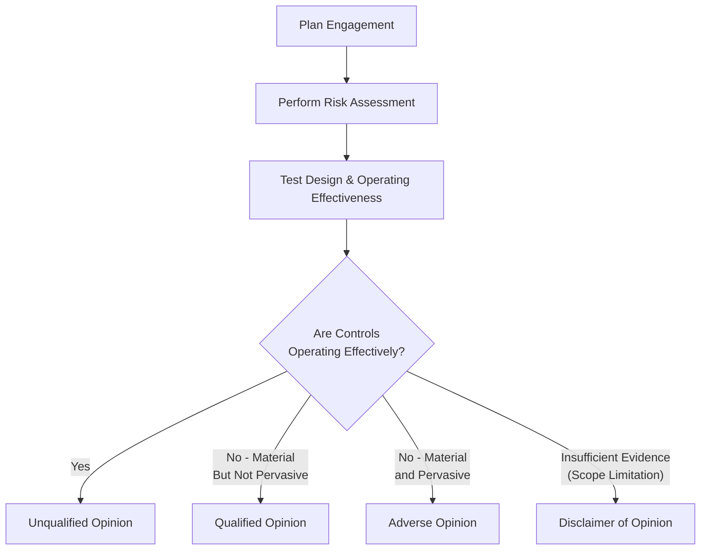

## 26.1 Types of Opinions and Report Modifications

In any System and Organization Controls (SOC) examination, the culminating deliverable is the service auditor’s report. Among the most critical components of this report is the opinion rendered by the service auditor regarding whether the service organization’s controls are (1) fairly presented in the description of the system, (2) suitably designed, and (3) operating effectively (in a Type 2 engagement). Just as with financial statement audits, SOC reports can yield different types of opinions. An understanding of these opinion types and possible report modifications is essential when evaluating the reliability and completeness of the information presented by a service organization.

This section explores the four main types of opinions—Unqualified, Qualified, Adverse, and Disclaimer—and outlines typical scenarios leading to each. We also consider modifications to standard SOC reports and highlight best practices for preparing and presenting the conclusions.

  
### Overview of SOC Opinions

SOC engagements share conceptual similarities with financial statement audits in that service auditors must render an opinion on whether controls meet specific criteria. Hence, many of the opinion types reflect those used in traditional financial audits. However, the context for SOC examinations is unique, focusing on the service organization's description of its system and the effectiveness of the underlying controls.

Below are the four standard opinion types in service auditor reporting:

• Unqualified Opinion  
• Qualified Opinion  
• Adverse Opinion  
• Disclaimer of Opinion  

  
### Unqualified Opinion

An unqualified opinion (often referred to as a “clean” opinion) states that, in the service auditor’s judgment, the service organization’s system description is fair, and the controls present within that system are suitably designed and, if relevant to the engagement type, operating effectively. This is the most favorable outcome for a service organization as it signals confidence in the reliability of its control environment.

Common reasons for issuing an unqualified opinion include:  
• No material exceptions found when testing controls.  
• Controls are appropriately designed to meet the defined criteria (such as COSO-based or Trust Services Criteria).  
• Controls are consistently operating effectively throughout the service period (for Type 2 engagements).  
• No limitations on the scope that would restrict the service auditor’s ability to gather sufficient, appropriate evidence.

  
### Qualified Opinion

A qualified opinion arises when the service auditor concludes that, except for certain specific deficiencies or deviations, the controls are fairly described, suitably designed, and operating effectively (if it is a Type 2 engagement). The key factor is that these deficiencies are not pervasive enough to undermine the entire control environment, but they are significant enough to warrant highlighting.

Typical scenarios leading to a qualified opinion include:  
• Limited exceptions or deficiencies in design or operating effectiveness, but those exceptions do not pervade the entire system.  
• A single significant control deviation in a pillar that is not central to the trust service principles (for a SOC 2) or the key control objectives (for a SOC 1).  
• Partial scope limitations or constraints where the service auditor can still gain sufficient evidence in most areas, but certain aspects remain restricted.

If a qualified opinion is issued, the service auditor’s report will prominently state the specific reasons for qualification and clarify that, barring these identified exceptions, the controls meet the applicable criteria.

  
### Adverse Opinion

An adverse opinion is the strongest expression of dissatisfaction with the service organization's control environment. It signals that:

• Material weaknesses or deficiencies exist, and  
• These deficiencies are both material and pervasive, meaning they significantly undermine reliability and are not limited to an isolated process.

Common examples that may lead to an adverse opinion include:  
• Discovery of overarching or systemic control failures that affect key aspects of the service organization’s environment.  
• Widespread security or confidentiality lapses that directly compromise the safeguarding of client data.  
• Ineffective governance or risk management such that the overall system cannot achieve its stated control objectives.  
• Repeated control failures across multiple trust services categories or multiple high-risk areas in a SOC 1.

An adverse opinion calls into question the ability of the service organization to ensure an acceptable control environment. This result often prompts immediate remediation efforts and heightened scrutiny from customers and other stakeholders.

  
### Disclaimer of Opinion

A disclaimer of opinion indicates that the service auditor was unable to obtain sufficient, appropriate evidence to provide a basis for an opinion—whether unqualified, qualified, or adverse. This does not necessarily mean the system or control environment is deficient; instead, the service auditor has concluded that significant restrictions or limitations prevented them from forming a conclusive opinion.

Instances leading to a disclaimer might include:  
• The service auditor’s inability to test key controls due to limited access or uncooperative personnel.  
• Situations in which certain records or reports are missing, incomplete, or otherwise unavailable, making it impossible to reach a conclusion.  
• Substantial scope restrictions, such as the service organization only allowing partial access or threatened legal constraints.

A disclaimer is somewhat unique in that it focuses on the auditor’s inability to form an opinion rather than the effectiveness or design of the controls themselves.

  
### Typical Scenarios Leading to Each Opinion

The following table summarizes the types of opinions, conditions under which they are typically issued, and potential effects on the service organization’s stakeholders:

| Opinion Type   | Condition(s) Underlying Issuance                                                                          | Example Scenario                                                                                                     | Impact on Report                                                                              |
|----------------|-----------------------------------------------------------------------------------------------------------|----------------------------------------------------------------------------------------------------------------------|------------------------------------------------------------------------------------------------|
| Unqualified    | No material exceptions or omissions in design or operating effectiveness of controls; no scope limitations| Thorough testing revealed properly designed and effectively operating controls; no significant data unavailable       | Clean opinion; boosts confidence among user entities                                          |
| Qualified      | A control deficiency of a limited nature, or partial scope issue that doesn’t pervade the entire engagement| A key control within a single process is not functioning effectively, but other controls are solid                   | A “qualified” statement highlighting the deficiency, but otherwise acknowledging controls are effective |
| Adverse        | Pervasive deficiencies that substantially undermine the reliability of controls                            | Controls across multiple key domains are either missing or ineffective, leading to high risk in data processing      | Withheld positive assurance; warns stakeholders that serious issues exist                       |
| Disclaimer     | Auditor unable to obtain sufficient, appropriate evidence to form an opinion                              | Significant scope restriction: management withholds certain logs, or records are unavailable due to system failures | No conclusion reached; stakeholders often interpret it as a red flag requiring further inquiry  |

  
### Report Modifications Beyond the Opinion

Besides selecting an overall opinion, service auditors can modify certain aspects of the SOC report to highlight unique circumstances. These modifications might include:

• Emphasis of Matter Paragraphs: These paragraphs direct readers to particularly important matters, such as the introduction of new systems or the impact of a major system migration.  
• Other Matter Paragraphs: Used to communicate information not presented or disclosed elsewhere in the report that is relevant to users’ understanding, such as upcoming changes in support services or enterprise resource planning (ERP) transitions.  
• Additional Consultation with User Auditors: In cases where user auditors require more information about the nature or impact of specific control deviations, the service auditor may reference how that information can be obtained.

While the overall opinion is the most prominent piece of the SOC report, these modifications provide deeper context and guide stakeholders in interpreting the findings.

  
### Decision Flow: Determining the Right Opinion

The following visual outlines a generalized decision logic employed by service auditors when determining the appropriate opinion to issue, highlighting key factors such as control deficiencies and scope limitations:

Explanation of Flow:  
1. Plan Engagement: The engagement team outlines the scope and objectives according to SOC guidelines.  
2. Perform Risk Assessment: Identify areas at higher risk of control failure.  
3. Test Design & Operating Effectiveness: Evaluate whether controls align with stated criteria and operate effectively for the assessment period (Type 2).  
4. Evaluate Results:  
   – If all controls are effective, or exceptions are immaterial → Unqualified Opinion.  
   – If controls have material exceptions but are not pervasive → Qualified Opinion.  
   – If controls have deficiencies that are pervasive and undermine the system → Adverse Opinion.  
   – If the auditor cannot obtain sufficient evidence → Disclaimer of Opinion.

  
### Practical Guidance and Best Practices

1. Engaging in Robust Planning: Clear definitions of control objectives, scoping boundaries, and responsibilities help prevent unexpected scope limitations that could lead to a disclaimer.  
2. Early Identification of Potential Deficiencies: Service organizations should conduct pre-audit assessments to catch control gaps. Timely remediation efforts often prevent material or pervasive issues from developing.  
3. Thorough Documentation: Well-organized documentation (e.g., policies, procedures, system configurations) ensures adequate audit trails, drastically reducing the risk of disclaimers.  
4. Clear Communication: Frequent dialogue with the service auditor can address misunderstandings early, ensuring that potential adverse issues are mitigated before they become pervasive.  
5. Engaging Stakeholders Post-Engagement: If the final opinion is qualified, adverse, or a disclaimer, immediate coordination with user entities and management fosters transparency and clarifies next steps.

  
### Common Pitfalls and Strategies to Overcome Them

• Pitfall: Underestimating the Importance of Evidence for Each Control  
  – Strategy: Maintain up-to-date logs, system reports, incident tracking records, and access records to prevent last-minute depositions that can lead to disclaimers.  

• Pitfall: Ignoring Isolated Deficiencies That Might Become Systemic  
  – Strategy: Investigate root causes of each found exception. If an issue occurs in one department, it may exist in another and become pervasive if unchecked.  

• Pitfall: Poor Communication of Reporting Needs  
  – Strategy: Align the scope and objectives from the outset. When a significant control deficiency is detected, proactively discuss potential outcomes, ensuring management has an opportunity to remediate.  

• Pitfall: Delaying Key Personnel Interviews  
  – Strategy: Schedule interviews and system walkthroughs early in the engagement to avoid last-minute scheduling conflicts that can hinder evidence gathering.

  
### Real-World Example: Managing Deficiencies

Suppose a technology outsourcing partner handles payroll processing for a large hospital network (SOC 1 engagement relevant to user entities’ internal control over financial reporting). During the testing, the service auditor discovers that user access rights are not consistently reviewed and updated when employees leave or change roles. This deficiency, while serious, is isolated to the payroll access management process; other controls such as data backup, transaction authorization, and payment approval function effectively.

• Potential Outcome: The deficiency’s impact is significant but not pervasive. Hence, the service auditor may issue a qualified opinion, specifying that access management is deficient but noting that overall control objectives are still met.  
• Mitigation: Management might implement a robust role-based access control system, re-perform user audits, and subject the area to retesting.  

  
### References and Further Exploration

For additional guidance, consult:  
• AICPA’s “SOC 1® Guide - Reporting on an Examination of Controls at a Service Organization Relevant to User Entities’ Internal Control over Financial Reporting.”  
• AICPA’s “SOC 2® Guide - Reporting on an Examination of Controls at a Service Organization Relevant to Security, Availability, Processing Integrity, Confidentiality, or Privacy.”  
• [COSO Internal Control – Integrated Framework](https://www.coso.org/Pages/ic.aspx) for designing and implementing robust internal controls.  
• [COBIT 2019](https://www.isaca.org/resources/cobit) for governance and management of enterprise IT, relevant to evaluating control environments.  

Staying informed about changes in auditing standards, frameworks, and best practices strengthens the likelihood of an unqualified opinion, improves stakeholder confidence, and streamlines successful SOC reporting.

  
## Test Your Knowledge: SOC Engagement Opinions and Modifications



### In which scenario would an unqualified opinion most likely be issued in a SOC 2® engagement?

- [x] All tested controls are effectively designed and operating with no significant deviations.  
- [ ] A material deviation occurred during one testing interval, but not pervasive.  
- [ ] Multiple significant control failures affect all major control domains.  
- [ ] The service auditor could not access certain logs due to confidentiality restrictions.

> **Explanation:** An unqualified opinion is given when the service auditor’s tests reveal no material exceptions in the design or operating effectiveness of the controls.

### Which statement best describes a qualified opinion?

- [x] Certain exceptions were found, but they do not pervade the overall control environment.  
- [ ] No significant deviations were found in the control environment.  
- [ ] The service organization’s control environment has pervasive failures significantly undermining reliability.  
- [ ] The service auditor was unable to gather sufficient evidence for an opinion.

> **Explanation:** A qualified opinion indicates that, except for specific identified exceptions, the controls are suitably designed and operating effectively.

### Which of the following is typically a red flag leading to a disclaimer of opinion?

- [x] Lack of sufficient, appropriate evidence due to severe scope limitations.  
- [ ] A single minor deficiency in data processing that was quickly remediated.  
- [ ] Widespread control failures in multiple domains.  
- [ ] Minor exceptions in the operating effectiveness of certain controls.

> **Explanation:** A disclaimer arises primarily when the auditor cannot gather necessary evidence, making it impossible to conclude on the controls’ overall effectiveness.

### An adverse opinion is issued when:

- [x] The control deficiencies are so material and pervasive that they undermine service organization’s overall reliability.  
- [ ] Service auditors identify a single, isolated deviation in an otherwise effective environment.  
- [ ] The environment is entirely free of any control deviations.  
- [ ] The service auditor lacks access to logs and evidence.

> **Explanation:** An adverse opinion indicates a systematic or pervasive breakdown in controls, rendering them ineffective.

### A service auditor can include an emphasis of matter paragraph to:

- [x] Highlight important details about specific changes, events, or uncertainties affecting the system.  
- [ ] Disclaim the entire report.  
- [x] Draw additional attention even though it does not affect the overall opinion.  
- [ ] Revoke previously issued unqualified opinions from past audits.

> **Explanation:** Emphasis of matter paragraphs alert readers to aspects needing special consideration without challenging the overall opinion itself.

### Which of the following statements about a qualified opinion is correct?

- [x] It usually includes an explanation of the specific control deviations or deficiencies.  
- [ ] It asserts no issues were discovered during the engagement.  
- [ ] It denotes a pervasive control failure across the service organization.  
- [ ] It means the auditor could not obtain sufficient evidence to form an opinion.

> **Explanation:** A qualified opinion necessitates disclosure of the nature and impact of the control exceptions in question.

### When deciding whether to issue a qualified or adverse opinion, what is the primary determining factor?

- [x] The degree to which identified control failures are material and pervasive.  
- [ ] The extent to which user entities rely on the controls.  
- [x] Whether the deficiencies are so severe that they undermine the entire system’s reliability.  
- [ ] The auditor’s professional working relationship with the client.

> **Explanation:** The cornerstone of differentiating between a qualified and adverse opinion is whether the deficiencies are widespread enough to invalidate the reliability of the entire system.

### In a SOC 1® engagement, which best describes a scenario needing a qualified opinion rather than a disclaimer?

- [x] The service auditor identifies a material but not pervasive deficiency in payroll access controls.  
- [ ] The auditor cannot obtain any evidence due to client restrictions.  
- [ ] The entire control environment for revenue recognition fails.  
- [ ] The client withheld key logging information for certain mainframe systems.

> **Explanation:** A qualified opinion is suitable when the service auditor finds notable, but not overarching, deficiencies. Where the scope is severely restricted, a disclaimer would be appropriate.

### Under which condition does the auditor typically issue an adverse opinion in a SOC 2® engagement?

- [x] When controls related to a key trust services category repeatedly fail testing periods, impacting the entire environment.  
- [ ] When a minor control gap is identified in a supporting area.  
- [ ] When no exceptions are noted.  
- [ ] When the service auditor cannot locate certain test logs due to confidentiality constraints.

> **Explanation:** Pervasive and material deficiencies that compromise one or more trust services categories usually lead to an adverse opinion.

### Is an emphasis of matter paragraph considered a type of modification or a separate opinion?

- [x] It is a modification, not a separate opinion, used to highlight specific matters in the report.  
- [ ] It is treated as a separate opinion category.  

> **Explanation:** Emphasis of matter paragraphs do not constitute a separate opinion. They instead draw readers’ attention to certain critical matters without altering the overall conclusion on controls.



---

## For Additional Practice and Deeper Preparation

### [Information Systems and Controls (ISC)](https://www.udemy.com/course/isc-cpa-mock-exams/?referralCode=E1217303222935C5E464)

**Information Systems and Controls (ISC) CPA Mocks:** 6 Full (1,500 Qs), Harder Than Real! In-Depth & Clear. Crush With Confidence!

- Tackle full-length mock exams designed to mirror real ISC questions.  
- Refine your exam-day strategies with detailed, step-by-step solutions for every scenario.  
- Explore in-depth rationales that reinforce higher-level concepts, giving you an edge on test day.  
- Boost confidence and minimize anxiety by mastering every corner of the ISC blueprint.  
- Perfect for those seeking exceptionally hard mocks and real-world readiness.

_Disclaimer: This course is not endorsed by or affiliated with the AICPA, NASBA, or any official CPA Examination authority. All content is for educational and preparatory purposes only._
