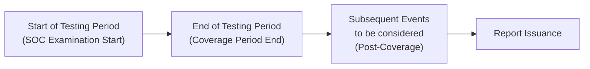

## 26.2 Subsequent Events in SOC Engagements

Subsequent events are occurrences—such as control changes, acquisitions, or major incidents—that take place after a service organization’s SOC examination period ends but before the SOC report is issued (or, in some cases, shortly afterward if their impact significantly affects management’s description). For user entities relying on a SOC 1®, SOC 2®, or SOC 3® report to make informed decisions about a service organization’s control environment, these events can introduce complexities regarding control effectiveness, data integrity, and overall risk posture.

This section explores the concept of subsequent events in the context of SOC engagements, outlines the responsibilities of service auditors and service organization management, and suggests best practices for handling such events in the final report. We will compare the approach to subsequent events in traditional financial audits and adapt it to the unique environment of SOC engagements. Throughout, we will address how to handle significant changes in controls, acquisitions, or major incidents that can impact the credibility or relevance of the SOC report to user entities.

--------------------------------------------------------------------------------
### Understanding the Nature of Subsequent Events

In the SOC context, a “subsequent event” is typically defined as any event that can affect the service organization’s controls or the auditor’s opinion about those controls, arising between:

• The end of the **examination period**, known as the “as of” date (Type 1 report) or “period covered” date (Type 2 report).  
• The date the SOC report is **issued** (the date the service auditor signs and releases the report).

Subsequent events might also include critical disclosures about events after the report release date, particularly if those events materially alter the operation or design of relevant controls.

#### Recognized vs. Non-Recognized Events (Adapted for SOC Engagements)
Borrowing terminology from financial reporting, SOC engagements sometimes differentiate between “recognized” events, which inform conditions that already existed as of the examination period end, and “non-recognized” events, which arise from new conditions or unexpected situations entirely after the period. However, the concept here is an adaptation, because a SOC engagement focuses on the adequacy and effectiveness of controls rather than on financial statement account balances.

--------------------------------------------------------------------------------
### Common Subsequent Events in SOC Engagements

1. **Changes in Key Controls**  
   • Major redesign of an existing control that affects user entity data.  
   • Decommission of crucial monitoring or automated control processes.  
   • Implementation of new tools or technologies that significantly alter the organization’s control activities.

2. **Business Acquisitions or Mergers**  
   • Merger with a third party that may expand the service organization’s systems and control environment.  
   • Acquisition of a smaller company whose controls have yet to be integrated, potentially leaving vulnerabilities or unassessed risks.  
   • Divestiture or sale of a product line that was, until recently, vital to the scope of the SOC engagement.

3. **Major Security Incidents or Breaches**  
   • Widespread malware infections that compromise user data.  
   • Insider threats leading to unauthorized system changes or data theft.  
   • Zero-day vulnerabilities discovered in software critical to the control environment.

Each of these events may impact how a reader interprets the SOC report, particularly around reliability and applicability of the previously tested controls. If a control has been drastically modified or retired, the user entity’s reliance on the old control design may need supplementary assurance.

--------------------------------------------------------------------------------
### Timeline of Subsequent Events: Coverage Period vs. Report Issuance

A key facet of SOC engagements is the time window in which controls are evaluated. For a **Type 2** SOC engagement, the coverage period may span several months (e.g., January 1 through December 31). Testing typically concludes shortly after the coverage period ends. The service auditor then forms an opinion on whether the system description and controls were fairly presented and operating effectively throughout that coverage period.

The time between the end of testing and the issuance of the report is often referred to as the “subsequent event window.” During this window, the service auditor should remain vigilant for any developments that could alter the view of the controls’ effectiveness as of the opinion date.

Below is a visual depiction of a typical timeline for subsequent event evaluation:

--------------------------------------------------------------------------------
### Auditor and Management Responsibilities for Subsequent Events

The responsibility for identifying subsequent events resides primarily with **service organization management**, who must alert the service auditor of any material developments. The service organization should implement protocols, such as:

1. Internal Control Monitoring  
   • Continued monitoring of control changes beyond the official coverage date.  
   • Maintaining logs of major incidents and system changes until the report is finalized.

2. Timely Communication  
   • Rapid escalation protocols for newly identified material control deficiencies or incidents.  
   • Regular check-ins with the service auditor to confirm that no undisclosed changes occurred.

3. Management Representation Letters  
   • Explicitly acknowledging in the representation letter that they have disclosed all relevant subsequent events to the best of their knowledge.

#### Responsibilities of the Service Auditor
• **Inquire**: The service auditor must inquire of management and possibly key personnel regarding any changes, acquisitions, or incidents affecting the control environment.  
• **Obtain a Written Statement**: Where necessary, ensure that management has documented these events in writing and the potential impact on controls is addressed.  
• **Assess Impact**: The service auditor determines whether the event affects the previously tested control environment in a way that could alter the auditor’s conclusion.  

--------------------------------------------------------------------------------
### Types of SOC Reports and Subsequent Events

#### Type 1 SOC Reports
A **Type 1** SOC report is as of a specific date and does not represent the operational effectiveness of controls over a period. Nevertheless, major changes, incidents, or acquisitions that occur after that date may require disclosure in the report’s description section to avoid misleading user entities. If the changes are so fundamental that the system described at the as of date no longer exists, the service organization and service auditor must carefully consider the disclaimers or modifications to the scope.

#### Type 2 SOC Reports
For a **Type 2** SOC report, subsequent events can be more complex because the report opines on whether controls were effectively designed and operated over a stated period. Here, the service auditor should assess whether:
1. The subsequent event calls into question the previously assessed operational effectiveness of the controls.  
2. The subsequent event is indicative of a deficiency that existed during the coverage period but was only discovered afterward.  
3. The subsequent event does not relate to the coverage period but is essential for user entities to know, because it signals a dramatic shift that might alter reliance on the current environment.

--------------------------------------------------------------------------------
### Handling Control Changes

Significant control changes might occur after the test period end. For instance, if a service organization deploys new software to replace a key transaction-processing module, the existing internal control environment that was tested no longer fully describes the system user entities will be interacting with.

#### Disclosure Options
• **Add a Subsequence of Events Disclosure**: Include an explanatory paragraph in the SOC report describing the nature and impact of the new control.  
• **Update the System Description**: If these changes occur before the report issuance and management is able to incorporate them accurately, consider updating the description of the system.  
• **Dual Dating**: In rare circumstances, the service auditor may opt to provide dual dating (e.g., “February 15, 20XX, except for the subsequent event described in Note X, as to which the date is February 25, 20XX”) if that event meaningfully alters the environment after the initial coverage period.

--------------------------------------------------------------------------------
### Handling Acquisitions and Mergers

An acquisition often introduces new operations, systems, and controls that lie outside the scope of testing performed during the SOC engagement coverage period. If the acquired entity’s controls are critical to the overall service environment, users of the report need to know whether they can still rely on the tested environment.

1. **Carve-Out or Inclusive Method**: If the main service organization used a subservice organization (the acquired entity, pre-acquisition), management can choose to use either the carve-out or inclusive method for the subservice organization’s controls.  
2. **Management’s Disclosures**: Updated organizational structure details should be added to the system description if legally or practically feasible before issuance.  
3. **Disclaimers**: The service auditor may disclaim coverage of the newly acquired environment, clarifying the original scope was limited to the pre-acquisition environment.

--------------------------------------------------------------------------------
### Handling Major Incidents

Major incidents such as a security breach can significantly affect the reliability of controls. If a breach that compromises systems directly related to the SOC engagement occurs after the coverage period but before issuance, the service auditor should:

1. **Gather Facts**: Understand the scope, cause, and control implications of the incident.  
2. **Evaluate Control Failure**: Identify if the incident reveals a flaw in the design or operating effectiveness of an existing control.  
3. **Assess Impact on the Report**: Decide whether the incident undocumented indicates a material misstatement of the control environment’s effectiveness. If so, an adverse or qualified opinion may be appropriate, or a disclaimer might be included.  

--------------------------------------------------------------------------------
### Communication and Reporting Approaches

There are generally two approaches to reflecting subsequent events in a SOC report:

1. **Standard Subsequent Event Treatment**  
   • The event is disclosed, but the overall opinion on the control environment remains unchanged if the service auditor deems it not to affect the previously tested period.  
   • An additional note or paragraph is added to discuss the nature and impact (if any) on user considerations.

2. **Adverse or Qualified Opinion**  
   • If the event reveals that one or more controls were not effective during the coverage period, the service auditor may issue an adverse or qualified opinion (depending on the severity and scope of the deficiency).  
   • The event might require management to revise the system description or disclaim coverage of newly integrated systems or controls.

--------------------------------------------------------------------------------
### Practical Example

Imagine a service organization, “XYZ Payroll Services,” releasing a SOC 1® Type 2 report covering January 1 through December 31 of a given year. On January 15—two weeks after period-end—XYZ completes a major merger with another payroll provider, “ABC Payroll Co.” Although the internal controls tested from January to December remain unchanged in principle, the newly merged environment introduces additional systems not tested in the SOC engagement. Management and the service auditor must consider the following:

1. **Description Update**: The system description might be updated if the primary environment significantly changed before the report issuance date. If changes emerged after issuance, the report could include a note stating that effective January 15, the environment changed.  
2. **Carve-Out vs. Inclusive**: If ABC was previously treated as a subservice organization under a carve-out arrangement, management may keep that approach. Otherwise, a separate SOC report might be needed for ABC’s environment until fully integrated.  
3. **User Impact**: User entities relying on the SOC report are informed that coverage does not extend to ABC’s environment; hence, they might require additional assurance if they rely heavily on services provided by ABC systems.

--------------------------------------------------------------------------------
### Best Practices and Common Pitfalls

**Best Practices**  
• **Implement Ongoing Monitoring**: Continuously monitor changes in your IT environment and keep lines of communication open with the service auditor.  
• **Be Explicit in Disclosures**: Clear, concise language about the subsequent event helps user entities. Vague or confusing language often leads to misinterpretation.  
• **Plan for Mergers and Integrations**: If possible, accelerate or delay the SOC engagement to capture critical organizational changes within the test period.

**Common Pitfalls**  
• **Late Discovery**: Failing to identify a major control deficiency until after the report is nearly complete can delay issuance or lead to disclaimers that undermine user confidence.  
• **Overlooking Material Impact**: Underestimating the significance of a cybersecurity event can result in user entities relying on a compromised or partially obsolete control environment.  
• **Ineffective Communication**: Breakdown in communication between management and the service auditor can lead to missed or underreported subsequent events, damaging the trust and reliability of the SOC report.

--------------------------------------------------------------------------------
### Diagrams and Tables for Clarity

For ease of reference, the table below provides a simplified overview of how key subsequent events might affect the SOC report’s content:

| Event Type       | Impact on Report                        | Potential Actions                                |
|------------------|-----------------------------------------|-------------------------------------------------|
| Control Change   | May require added disclosure            | Update System Description; Evaluate new control |
| Acquisition      | Might alter the scope & environment     | Disclose or Carve Out subservice organization   |
| Major Incident   | Could reveal a deficiency in controls   | Adjust Opinion; Provide additional disclosures  |

--------------------------------------------------------------------------------
### References and Further Reading

• AICPA: Attestation Standards (Clarified), especially regarding Subsequent Events for attestation engagements.  
• COSO Internal Control – Integrated Framework, focusing on monitoring controls and risk assessment.  
• SOC 1® Guide and SOC 2® Guide published by the AICPA.  

--------------------------------------------------------------------------------
### Conclusion

Subsequent events in SOC engagements demand careful attention from both management and the service auditor to preserve the integrity and informational value of the SOC report. Whether an organization is dealing with a new software rollout, a corporate acquisition, or a significant security breach, effective communication and transparent disclosures are critical. By proactively preparing for these events, updating system descriptions, and issuing disclaimers as necessary, service organizations help user entities and stakeholders maintain confidence in the reliability of reported controls.

By understanding the critical aspects of subsequent events, implementing robust monitoring, and collaborating closely with the service auditor, service organizations ensure their SOC reports remain as accurate, relevant, and trustworthy as possible—even when changes occur after the official examination period.

--------------------------------------------------------------------------------

## Test Your SOC Knowledge: Subsequent Events in SOC Engagements Quiz



### Subsequent events are best described as which of the following?
- [x] Events affecting controls that occur after the examination period but before report issuance.
- [ ] Events disclosed in the financial statements after year-end adjustments.
- [ ] Changes to the user entity’s environment that occur before the coverage period.
- [ ] Incidents that only occur in subservice organizations.
> **Explanation:** In a SOC engagement, subsequent events pertain to occurrences—control changes, mergers, or incidents—after the coverage period ends but before the opinion is issued.

### Which statement is TRUE about the service auditor’s responsibility for subsequent events?
- [ ] Conduct new detailed tests on all new systems implemented after the coverage period.
- [x] Inquire of management regarding major changes, acquisitions, and incidents that might affect controls.
- [ ] Automatically modify the opinion if there is any subsequent event.
- [ ] Postpone the report issuance until any event has been fully remediated.
> **Explanation:** The service auditor is primarily responsible for inquiring about and assessing the impact of subsequent events; they do not always retest or modify the opinion unless the event materially affects control effectiveness.

### What is a recommended approach if your organization acquires a new company after the coverage period but before SOC report issuance?
- [x] Disclose the acquisition in the system description or a separate paragraph, stating its limited coverage under the SOC examination.
- [ ] Completely re-perform all SOC testing for both organizations.
- [ ] Immediately exclude the new organization from all future engagements.
- [ ] Issue two separate opinions for each entity.
> **Explanation:** Disclosing the acquisition and clarifying its coverage in the SOC report is typically sufficient. Full re-testing is not generally required unless the event undermines prior testing results.

### In the event of a major cybersecurity incident discovered after the coverage period, what is the first step the service auditor should take?
- [x] Gather facts about the nature and potential scope of the incident.
- [ ] Issue an adverse opinion without further investigation.
- [ ] Withhold the report indefinitely.
- [ ] Refuse to consider it because it is after the coverage period.
> **Explanation:** The auditor should begin by understanding relevant details (scope, cause, controls affected) to determine whether the incident impacts the previously tested controls and how to reflect this in the SOC report.

### Dual dating in a SOC engagement refers to what?
- [x] Specifying two different dates in the report: one for the original opinion and one relating to the subsequent event.
- [ ] Issuing two separate SOC reports in a single engagement.
- [x] A disclosure technique used when a major event occurs after the initial opinion date but before formal issuance.
- [ ] A method of combining Type 1 and Type 2 engagements in one report.
> **Explanation:** Dual dating addresses significant events that arise after the standard coverage period but before issuance, safeguarding the auditor’s opinion regarding the original coverage period while addressing the new event.

### Which of the following events is most likely considered a subsequent event in a SOC engagement context?
- [x] A new CFO implements a major overhaul of the accounting software after the coverage period ends.
- [ ] A new regulatory requirement implemented mid-year before coverage period close.
- [ ] A pre-engagement reorganization that happened six months prior to the coverage period.
- [ ] A routine software patch completed before the last day of testing.
> **Explanation:** An event that takes place after the testing period is complete (e.g., major software overhaul) typically falls under the definition of a subsequent event.

### When a merger is finalized after the SOC coverage period, what is one likely impact on the SOC report?
- [x] A description note indicating that coverage does not extend to the merged environment.
- [ ] Automatic issuance of a qualified opinion.
- [x] The necessity to re-engage and restart the entire SOC process.
- [ ] No mention of the event because it is beyond the coverage scope.
> **Explanation:** Typically, the report will disclose the merger (e.g., in the system description or an additional note) to notify user entities that the merged environment was not part of the tested period.

### A new vulnerability discovered in a system critical to the SOC engagement after testing concludes may require which action?
- [x] Reassessment to determine if this vulnerability existed during the coverage period and if it impacts the auditor’s opinion.
- [ ] Immediate issuance of a SOC 3® only.
- [ ] Automatic withdrawal of the SOC report.
- [ ] Notifying the user entities that no further action is necessary.
> **Explanation:** The service auditor must evaluate whether the vulnerability was present and untested during the coverage period, potentially affecting the opinion.

### Which is NOT a best practice in handling subsequent events?
- [x] Maintaining lines of communication between service organization management and the service auditor.
- [ ] Relying on management’s representation letter for final disclosure of subsequent events.
- [ ] Providing an explicit note in the report about any significant control changes.
- [ ] Ignoring the event if it happened after the coverage period, regardless of impact.
> **Explanation:** Ignoring important events simply because they occurred after the coverage period is not a best practice. They must be evaluated for potential impact.

### Subsequent events may or may not require modifying the SOC auditor’s opinion. Is this statement true or false?
- [x] True
- [ ] False
> **Explanation:** Not all subsequent events affect the originally tested control environment. Some events may require no change in the opinion, while others might prompt an adverse or qualified opinion, or additional disclosure.



## For Additional Practice and Deeper Preparation

### [Information Systems and Controls (ISC)](https://www.udemy.com/course/isc-cpa-mock-exams/?referralCode=E1217303222935C5E464)  

**Information Systems and Controls (ISC) CPA Mocks:** 6 Full (1,500 Qs), Harder Than Real! In-Depth & Clear. Crush With Confidence! 

- Tackle full-length mock exams designed to mirror real ISC questions.  
- Refine your exam-day strategies with detailed, step-by-step solutions for every scenario.  
- Explore in-depth rationales that reinforce higher-level concepts, giving you an edge on test day.  
- Boost confidence and minimize anxiety by mastering every corner of the ISC blueprint.  
- Perfect for those seeking exceptionally hard mocks and real-world readiness.  

_Disclaimer: This course is not endorsed by or affiliated with the AICPA, NASBA, or any official CPA Examination authority. All content is for educational and preparatory purposes only._
