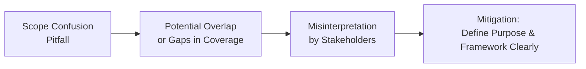

## 26.4 Common Pitfalls and Best Practices in SOC Reporting

System and Organization Controls (SOC) reporting is pivotal in demonstrating a service organization’s internal controls over financial reporting (SOC 1®) or controls relevant to Security, Availability, Processing Integrity, Confidentiality, and Privacy (SOC 2® and SOC 3®). However, various challenges can threaten the quality, reliability, and clarity of these reports. This section explores some of the most common pitfalls encountered in SOC reporting, along with practical best practices to deliver high-quality opinions that meet user needs and align with professional standards. We expand on several topics introduced in Chapter 25 (Planning and Performing a SOC Engagement) and connect them with critical reporting and opinion concepts from Chapters 22–24.

Organizations and practitioners who fully understand these pitfalls and follow best practices can enhance the credibility and value of their SOC reports. By doing so, they provide transparent, consistent, and useful information to user entities, management teams, external stakeholders, and regulators.

  
Pitfalls in SOC reporting often arise from misunderstandings of scope, insufficient coverage of subservice organizations, improperly drafted disclaimers, incomplete testing details, or ambiguous language in the final report. Let’s examine these areas more closely and outline strategies to mitigate each risk.

Pitfall 1: Scope Confusion

Scope confusion is a leading challenge, particularly when an entity is unclear about whether a SOC 1® or SOC 2® is more appropriate for its services—or if it attempts to merge the requirements for both frameworks without a sound rationale.

• Mixing SOC 1® and SOC 2® Scope  
  Companies might try to include security controls (common to SOC 2®) alongside controls over financial reporting (classic SOC 1® territory) without clearly explaining the boundaries. This can lead to overly complicated reports and confusion among readers.  

• Misalignment with User Needs  
  A SOC report that fails to align tests and controls with user entity expectations risks reducing the report’s usefulness. For instance, if user entities primarily need assurance about processing integrity, but the scope focuses on availability, the report may fall short in meeting user needs.  

Best Practice:  
• Conduct a thorough scoping exercise (see Chapter 25 for guidance), ensuring alignment with user entity requirements.  
• Identify which framework (SOC 1®, SOC 2®, or SOC 3®) best suits the services. Where multiple frameworks are necessary, maintain clear disclosures and well-defined boundaries.  
• Develop a matrix linking user requirements to the controls tested and the sections of your report.  

Below is a simple Mermaid diagram illustrating how scope confusion can lead to inaccurate or unclear results if not addressed early:

Pitfall 2: Incomplete Subservice Coverage

SOC engagements often involve one or more subservice organizations whose controls contribute to the overall control environment. Determining how to handle these subservice organizations—whether to use an inclusive or carve-out method—can lead to confusion, and errors may lead to partial or misleading reporting.

• Omitting Crucial Processes  
  If a key subservice organization’s processes are carved out without robust disclosure, user entities may mistakenly assume that those controls fall under the reporting entity’s tested environment.  

• Poor Coordination  
  Delayed communication or inconsistent understanding between the primary service organization and the subservice organization can result in incomplete testing or contradictory findings.  

• Insufficient Description of Subservice Roles  
  Vague or insufficiently detailed descriptions of subservice organization responsibilities can lead to misinterpretations about who is accountable for which portion of the process.  

Best Practice:  
• Determine early in the planning stage whether to use the inclusive or carve-out method (see Chapter 23, SOC 1®, and Chapter 24, SOC 2®).  
• In your description of the system, highlight each subservice organization’s role, along with the controls assumed to be in effect.  
• Obtain evidence of the subservice organization’s controls if using the inclusive method. If adopting the carve-out method, clearly disclose what is excluded and the potential impact on user entities.  
• Include disclaimers or references to any available SOC reports from subservice organizations.

  
Pitfall 3: Omitting or Improperly Drafting Disclaimers

Disclaimers in a SOC report clarify the boundaries of the auditor’s responsibilities and highlight management’s obligations. When disclaimers are missing or unclear, the end-user can easily misinterpret the scope, dependence on management assertions, or the effect of complementary user entity controls.

• Missing Disclaimer on User Responsibilities  
  A user entity reading a SOC 2® or SOC 1® might assume the listed controls are sufficient on their own, without applying their own complementary control procedures.  

• Inadequate Disclosure About Management Assertions  
  Management is responsible for the design and operating effectiveness of the controls described. The auditor’s report should clarify that the service auditor evaluates these controls against established criteria but does not design them.  

• Inconsistency Across Sections  
  Disclaimers in one section of the SOC report (e.g., the independent service auditor’s report) may conflict with disclaimers or clarifications in the management’s description.  

Best Practice:  
• Cross-check disclaimers among the entire SOC report to ensure consistency between management assertions and the service auditor’s opinion.  
• Ensure disclaimers clearly state whether user entities need to implement complementary controls for the system to function as intended.  
• Emphasize that subservice organizations (if carved out) are not included in the scope and that management remains responsible for monitoring the subservice organization.  

Pitfall 4: Lack of Clarity in Reporting Exceptions

Service auditors typically report exceptions found during testing. If these exceptions are vaguely worded or inconsistently documented, the overall reliability and clarity of the SOC report can suffer.

• Ambiguous Exception Descriptions  
  For instance, an exception might be described as “Control not operating effectively,” without clarifying whether it was only on certain dates or for a small subset of transactions.  

• Confusion Between Severity and Prevalence  
  Failure to distinguish the severity of the exception (material vs. minor deviation) can lead to disproportionate alarm among report readers.  

• Hidden Remediation Steps  
  If the service organization implements changes partway through the testing period, but the SOC report fails to note these corrective actions or re-tests, user entities cannot accurately interpret how issues were resolved.  

Best Practice:  
• Document exceptions in a separate section, or highlight them in the test procedures and results, providing context such as the date, nature, severity, and remedial actions taken.  
• Classify exceptions according to impact (e.g., high, moderate, low) and consider whether to incorporate relevant frameworks (see COSO or COBIT references in Chapter 3) for consistent descriptions.  

Pitfall 5: Unclear Language Regarding Control Periods and Testing

The period over which controls were tested is fundamental to a SOC examination, yet many organizations fail to communicate or document this period effectively.

• Unclear Start/End Dates  
  It is sometimes unclear when the examination period began or ended, making it difficult for third parties to trust the timeliness or accuracy of testing.  

• Inconsistent Descriptions of Interim Changes  
  If critical changes, patches, or upgrades occurred mid-examination, the report might lack clarity about how these changes were tested.  

• Failure to Mention Interim Testing  
  External users appreciate details on how the auditor handled interim testing—especially if significant events transpired between the test date and the report release.  

Best Practice:  
• Clearly specify the examination period in the auditor’s report and the management’s assertion.  
• Where relevant, disclose any significant changes that occurred during or after the testing period and how they were accounted for.  
• Provide details about interim or “point-in-time” testing, especially if certain controls were tested only on specific dates.  

Pitfall 6: Overlooking Complementary User Entity Controls (CUECs)

Complementary User Entity Controls (CUECs) are crucial in both SOC 1® and SOC 2® engagements, as they reveal which aspects of the internal control environment must be supplemented by the user entity’s controls to achieve overall control objectives. Failing to adequately describe or emphasize CUECs can result in misaligned expectations or even a breakdown in the intended control environment.

• Incomplete or Generic CUECs  
  Vague references such as “Management of the user entity is responsible for protecting user credentials” do not explain how user management processes might integrate with the service organization’s controls.  

• Lack of Guidance for Implementation  
  Simply listing CUECs without providing any directional statements or recommended best practices can be confusing for users.  

• Excluding CUECs from the Testing Narrative  
  If user entity controls are omitted from the test procedures and results discussion, stakeholders might overlook the fact that certain control objectives can only be met with user involvement.  

Best Practice:  
• Provide a clear table mapping each control objective to the relevant CUEC, specifying responsibilities for both service organization and user entity.  
• Offer guidance, if permissible, on how user entities can implement their complementary controls effectively.  
• Emphasize that the service organization’s controls do not operate in isolation; user entity cooperation is critical.

Pitfall 7: Lack of Coordination With Other Auditors or Specialists

Complex SOC engagements frequently involve multiple entities and specialized audits (e.g., IT security firms performing vulnerability assessments). If the lead engagement team does not adequately coordinate with these parties, conflicting or incomplete results can appear in the final SOC report.

• Inconsistent Findings  
  A vulnerability assessment performed by an external consultant might reveal high-risk findings never addressed in the service auditor’s SOC report since no one verified or reconciled the results.  

• Overlooked Specialist Requirements  
  Auditors must assess the professional qualifications, independence, and scope of work performed by third-party specialists contributing to the engagement.  

• Inadequate Communication of Limitations  
  Neither management nor the lead service auditor may clarify the limited scope under which a specialist performed testing, leading to overreliance by readers of the SOC report.  

Best Practice:  
• Introduce collaboration guidelines early in the engagement, specifying the required depth of specialist testing procedures.  
• Perform a robust assessment of each specialist’s methodology, credentials, and independence, ensuring alignment with applicable professional standards (see also Chapter 26.3, Coordination with Other Auditors and Specialists).  
• Disclose the areas covered by specialists in the SOC report, and reconcile material findings from specialist work with the main body of testing.

Pitfall 8: Non-Compliant Formatting and Lack of Standardized Terminology

A final, yet significant, issue arises when organizations produce SOC reports that deviate from the AICPA’s recommended structure, or use ambiguous terms that differ from commonly accepted definitions found in the Trust Services Criteria or internal control frameworks.

• Inconsistent Terminology  
  Terms such as “control objectives,” “criteria,” “risk,” “exception,” or “limitation” might be used inconsistently or interchangeably.  

• Redundant or Missing Sections  
  Key prescribed sections, like the description of tests of controls, might be omitted. Alternatively, extraneous sections with no direct link to the engagement may clutter the report.  

• Excessive Marketing or Promotional Content  
  Some service organizations include branding or marketing language as part of the SOC report. This can dilute the technical nature of the report and introduce confusion about the objectivity of its findings.  

Best Practice:  
• Use AICPA templates and guidelines as a baseline.  
• Ensure that terms like “exceptions,” “complementary user entity controls,” and “criteria” match the definitions set out in the professional standards.  
• Keep marketing or promotional statements separate from the primary audit and assurance sections of the SOC report.  
• Use the “Description Criteria” (e.g., DC 200 for SOC 2®) provided by the AICPA to structure management’s description section consistently.

  
Summary of Key Best Practices

1. Clarify and Document Scope Early  
   Before launching into fieldwork, define the reason for the SOC engagement, the service lines in-scope, and the specific controls tested. Doing so avoids last-minute surprises and misalignments.  

2. Address Subservice Organizations Properly  
   Whether using an inclusive or carve-out method, be explicit about subservice roles, responsibilities, and the reliance placed upon their controls.  

3. Maintain Consistency in Disclaimers  
   Confirm that disclaimers across the management assertion, system description, and the independent service auditor’s report align.  

4. Classify and Describe Exceptions Clearly  
   Provide factual and unambiguous details on each testing exception, noting its potential impact and any remedial measures taken.  

5. Highlight Complementary User Entity Controls  
   Show the reader how the system in question depends on both service organization and user entity controls to achieve objectives.  

6. Disclose the Examination Period Transparently  
   State the examination period (or point-in-time date if relevant) and detail how changes during testing were addressed.  

7. Foster Coordination Among Auditors and Specialists  
   Where multiple auditors, IT specialists, or external consultants are used, confirm that their scopes, timing, and outcomes are integrated.  

8. Adhere to Professional Standards  
   Align your final report with the structure, terminology, and framework of AICPA standards to maintain consistency and clarity.

  
Combining SOC Framework Requirements and COSO Principles (KaTeX example)

When evaluating controls, the service auditor may rely on the fundamental COSO premise that material misstatements will be minimized if the five components of internal control (Control Environment, Risk Assessment, Control Activities, Information and Communication, Monitoring Activities) are properly designed and operating effectively. A simplified risk tolerance formula that the auditor might conceptually consider is:


\text{Residual Risk} \le \text{Risk Tolerance}


Where “Residual Risk” is the level of risk remaining after controls, and “Risk Tolerance” is management’s or stakeholders’ acceptable level of risk. This concept applies to SOC 1® or SOC 2® engagements when deciding on testing depth and coverage.

  
References and Further Reading

• AICPA Guide: SOC 2® Reporting on an Examination of Controls at a Service Organization: Relevant to Security, Availability, Processing Integrity, Confidentiality, or Privacy.  
• AICPA, AT-C Section 205: Examination Engagements.  
• COSO Internal Control – Integrated Framework and COSO ERM Framework.  
• COBIT 2019 Framework for Governance and Management of Enterprise IT.  
• Chapters 22–25 of this book for more details on SOC reports foundational elements.

By understanding these pitfalls and applying best practices, service organizations and practitioners can build trust, transparency, and accuracy into every SOC engagement. Strengthening these components yields robust, user-friendly reports that accurately reflect the organization’s control environment and help user entities make informed decisions.

  
## Common Pitfalls and Best Practices in SOC Reporting – Knowledge Check



### When determining whether a SOC 1® or SOC 2® report is suitable, which factor is most critical?

- [ ] The budget for the audit.  
- [x] The nature of the controls and the user entities' needs.  
- [ ] The complexity of the service organization's IT environment.  
- [ ] The design of the subservice organization's systems.  

> **Explanation:** The selection of SOC 1® or SOC 2® (or another reporting framework) hinges primarily on the nature of the controls being examined and the requirements of the user entities.  

### Which method allows a service organization’s SOC report to include controls at a subservice organization within the same report?

- [ ] The carve-out method.  
- [x] The inclusive method.  
- [ ] The risk-based method.  
- [ ] The hybrid method.  

> **Explanation:** Under the inclusive method, the service organization includes the subservice organization’s controls in the description and the testing within the same SOC report.  

### What is a leading consequence of failing to mention Complementary User Entity Controls (CUECs) in the SOC report?

- [ ] Greater cost savings for the service organization.  
- [ ] Improvements in the subservice organization’s control posture.  
- [ ] Increased marketing opportunities for the service organization.  
- [x] Users might incorrectly assume the tested controls are sufficient without any additional controls on their part.  

> **Explanation:** CUECs are essential for clarifying which controls must be implemented by user entities. Omitting them can cause users to rely too heavily on the service organization’s controls.  

### Which of the following is a common pitfall related to documentation of exceptions in SOC reporting?

- [ ] Testing controls throughout the entire engagement period.  
- [x] Providing ambiguous details on the frequency or scope of control failures.  
- [ ] Documenting the severity level of exceptions.  
- [ ] Explaining remediation steps in precise detail.  

> **Explanation:** A frequent pitfall is failing to provide clear, detailed information about where, when, and how often a control operated ineffectively.  

### Which key best practice applies when addressing subservice organizations in a SOC report?

- [x] Choosing inclusive vs. carve-out approaches early and explaining the rationale.  
- [ ] Minimizing references to subservice organizations.  
- [ ] Copying all subservice audit data verbatim.  
- [ ] Signing subservice disclaimers after the SOC report is finalized.  

> **Explanation:** The service organization must decide whether to use an inclusive or carve-out method early in the engagement and clarify subservice organization responsibilities comprehensively.  

### What is one recommended way to mitigate scope confusion during a SOC examination?

- [x] Clearly link user requirements to tested controls in a scope matrix.  
- [ ] Perform only high-level testing for all controls.  
- [ ] Combine SOC 1® and SOC 2® into a single unstructured report.  
- [ ] Avoid describing which framework applies to each control.  

> **Explanation:** Constructing a scope matrix mapping user requirements to tested controls helps prevent misalignment and clarifies the boundaries of both SOC 1® and SOC 2® engagements.  

### What should a service auditor do if they find that a third-party specialist performed limited testing in certain areas?

- [ ] Exclude the specialist’s findings to maintain clarity.  
- [x] Analyze the specialist’s approach, scope, and qualifications, and disclose any limitations in the SOC report.  
- [ ] Re-perform all of the specialist’s testing independently.  
- [ ] Publish a disclaimer that the findings are unverified.  

> **Explanation:** The auditor should assess the specialist’s methodology and credentials, confirm that the scope aligns with the overall audit, and disclose any limitations to maintain transparency.  

### Which disclaimer is typically required in a SOC report to clarify management’s role?

- [x] Management is solely responsible for designing, implementing, and maintaining the controls.  
- [ ] Management is responsible only for the audit of the controls.  
- [ ] The auditor is responsible for designing, implementing, and maintaining the controls.  
- [ ] The user entity is solely responsible for designing all controls in the system.  

> **Explanation:** SOC reports must clarify that management is responsible for the design, implementation, and maintenance of controls, while the auditor evaluates their effectiveness.  

### Why is it important to clearly define the examination period in a SOC report?

- [ ] It helps the service organization justify higher audit fees.  
- [ ] It allows the service organization to omit certain testing results.  
- [x] It informs stakeholders exactly when the controls were tested and enables them to assess ongoing applicability.  
- [ ] It exempts the service auditor from providing updates.  

> **Explanation:** Clearly stating the start and end of the examination period ensures transparency and allows stakeholders to understand when the controls were operating and tested.  

### True or False: Marketing language or branding has no impact on the perceived objectivity of a SOC report.

- [ ] True  
- [x] False  

> **Explanation:** Including extensive marketing content in a SOC report can undermine its perceived objectivity, as the user may question whether the information is balanced or promotional.  



---

## For Additional Practice and Deeper Preparation

### [Information Systems and Controls (ISC)](https://www.udemy.com/course/isc-cpa-mock-exams/?referralCode=E1217303222935C5E464)

Information Systems and Controls (ISC) CPA Mocks: 6 Full (1,500 Qs), Harder Than Real! In-Depth & Clear. Crush With Confidence!  

- Tackle full-length mock exams designed to mirror real ISC questions.  
- Refine your exam-day strategies with detailed, step-by-step solutions for every scenario.  
- Explore in-depth rationales that reinforce higher-level concepts, giving you an edge on test day.  
- Boost confidence and minimize anxiety by mastering every corner of the ISC blueprint.  
- Perfect for those seeking exceptionally hard mocks and real-world readiness.  

_Disclaimer: This course is not endorsed by or affiliated with the AICPA, NASBA, or any official CPA Examination authority. All content is for educational and preparatory purposes only._
