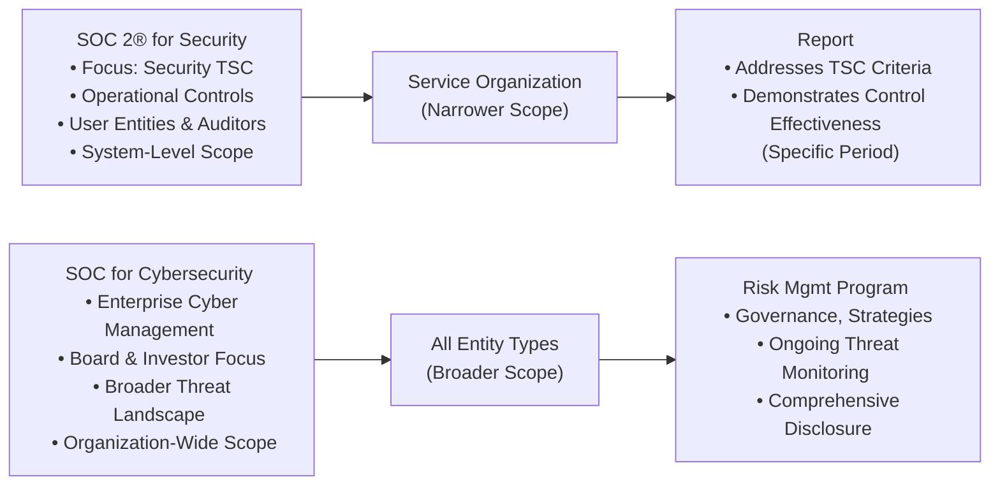

## 27.1 Key Differences Between SOC 2® for Security vs. SOC for Cybersecurity

Successfully evaluating and reporting on an organization’s cybersecurity posture requires an in-depth understanding of multiple reporting frameworks offered within the AICPA’s System and Organization Controls (SOC) suite. Two of the most frequently referenced frameworks are (1) SOC 2® for Security and (2) SOC for Cybersecurity. Although both reports aim to provide assurance over security-related issues, they substantially differ in scope, intended audience, and depth. In this section, we delve into the contrasts between SOC 2® for Security and SOC for Cybersecurity, emphasizing that cybersecurity often demands broader considerations than operational compliance alone. By the end of this section, you will have a clearer picture of which framework to apply, why, and how each can serve distinct organizational objectives.

-----------------------------------------------------------
  
Understanding the Foundations

Before discussing the key distinctions between SOC 2® and SOC for Cybersecurity, let us revisit their fundamental characteristics:  

• SOC 2® for Security:  
  – Developed around the Trust Services Criteria (TSC), specifically focusing on one or more of the five core categories: Security, Availability, Processing Integrity, Confidentiality, and Privacy.  
  – Often used by organizations (commonly service organizations) to build trust with customers—especially those concerned about consistent, demonstrable security controls around data handling and service performance.  
  – Typically narrower in scope, although “Security” is the baseline TSC that underpins all other criteria.  

• SOC for Cybersecurity:  
  – A framework designed to allow organizations (not limited to service organizations) to communicate about their comprehensive cybersecurity risk management program.  
  – Goes beyond evaluating internal controls related to operations or financial reporting; instead, it addresses an entity’s broader cybersecurity strategies, governance, incident response, continuity planning, and overall risk posture.  
  – Intends to inform a wider range of stakeholders, including boards of directors, investors, regulators, and customers, about how the organization manages cybersecurity risks across the enterprise.  

-----------------------------------------------------------

Intended Audience and Reporting Objectives

One of the most striking differences between SOC 2® for Security and SOC for Cybersecurity arises in their intended audiences and the underlying motivations for each report.

• SOC 2® for Security:  
  – Primary Audience: External clients (user entities and their auditors) who require assurance that the service organization is adequately safeguarding their data. Additionally, organizational insiders—such as compliance officers—review SOC 2® reports for evaluating operational controls.  
  – Reporting Objective: Demonstrates whether the organization’s description of its system and the controls supporting its operations meet the chosen Trust Services Criteria (at least the Security criterion). The output is typically used in business-to-business service engagements where trust in data protection is paramount.  

• SOC for Cybersecurity:  
  – Primary Audience: Potentially a much broader set of stakeholders (e.g., senior leadership teams, boards, regulators, institutional investors, the public).  
  – Reporting Objective: Allows the organization to present a holistic cybersecurity risk management program. This includes governance, threat intelligence processes, detection and response frameworks, third-party risk oversight, and how the organization’s risk appetite aligns to mitigating threats in the wild.  

In essence, SOC 2® for Security reports are often a validation to business partners that the service entity has adequate controls for safeguarding the data they handle. Meanwhile, a SOC for Cybersecurity can serve as evidence of enterprise-wide cyber resilience and is not restricted to a single data-handling system or line of services.  

-----------------------------------------------------------

Scope Variations: Operational Compliance vs. Enterprise Cyber Risk

When evaluating the breadth of each framework, it is clear that SOC 2® for Security highlights compliance for specific systems or services, whereas SOC for Cybersecurity extends beyond that domain to encompass the entirety of an organization’s cyber risk posture.

• SOC 2® for Security Scope:  
  – Typically includes controls over infrastructure, software, people, procedures, and data pertinent to delivering services.  
  – Emphasis revolves around the presence and effectiveness of operational controls: Are the controls designed and operating effectively to address the Security TSC?  
  – May or may not include privacy and confidentiality aspects, depending on whether the service organization chooses to include these additional categories in the scope of the report.  

• SOC for Cybersecurity Scope:  
  – Addresses an entity-wide program, focused on identifying, mitigating, and managing cybersecurity threats.  
  – Highlights interactions with and dependencies on third parties, how the organization controls vendor or subservice risk, and the overarching governance structure for cybersecurity.  
  – Analyzes the organization’s processes from a holistic, strategic perspective—considering dynamic threats, business continuity, crisis management, and long-term resilience.  

From a purely operational perspective, SOC 2® is narrower. By contrast, SOC for Cybersecurity is broader, offering a bird’s-eye view of all major processes that protect and respond to cybersecurity attacks, from end-user awareness training to advanced threat detection.

-----------------------------------------------------------

Emphasizing How Cybersecurity Is Broader Than Operational Compliance

SOC for Cybersecurity is not merely another compliance initiative. Rather, it is a more sweeping disclosure mechanism that compels leadership to articulate how they are safeguarding critical organizational assets against possibly existential cyber threats:

1. Risk Management That Spans Multiple Domains:  
   – SOC for Cybersecurity encourages organizations to discuss risk management principles across diverse aspects of the business, beyond IT operations. For instance, an organization might highlight how marketing data, intellectual property, and key business processes are all protected under the same cybersecurity risk management framework.  

2. Incident Response and Resiliency:  
   – SOC for Cybersecurity addresses how the entity prepares for, detects, and responds to attempted or actual security events. This includes response playbooks, crisis communications, and business continuity planning.  
   – While SOC 2® for Security may consider requirements for incident management under a more operational lens, it rarely covers strategic decisions, reporting lines to executive boards, or in-depth crisis response strategies.  

3. Organizational Culture and Governance:  
   – SOC for Cybersecurity typically scrutinizes whether cybersecurity is embedded in the organization’s culture and governance frameworks, including oversight by the board of directors and executive management.  
   – The focus is not limited to technical controls but also extends to managerial policies, staff training, workforce management, and holistic cybersecurity awareness across the enterprise.  

-----------------------------------------------------------

Framework Criteria and Assessment Methodologies

SOC 2® engagements generally revolve around evaluating controls according to the AICPA’s Trust Services Criteria for Security and potentially other TSC categories. SOC for Cybersecurity engagements leverages the AICPA’s Description Criteria and suitable control frameworks, often referencing well-known cybersecurity frameworks (COBIT, NIST CSF, ISO 27001, etc.) to communicate how the entity manages risks:

• SOC 2® for Security:  
  – Must meet or exceed the Security TSC.  
  – In a Type 2 report, the service auditor evaluates the design and operating effectiveness of the security controls over a review period (e.g., 6 or 12 months).  
  – The final deliverable includes a description of the system: boundaries, processes, control environment, metrics, and tests of operating effectiveness.  

• SOC for Cybersecurity:  
  – Uses the AICPA’s Description Criteria for Cybersecurity Risk Management plus the entity’s chosen control criteria, which might be the Trust Services Criteria or other recognized cybersecurity frameworks.  
  – Auditors evaluate the completeness of the description and the effectiveness of controls within the entity’s cybersecurity risk management program, providing users with broader visibility into how the program addresses specific threats.  

-----------------------------------------------------------

Differences in Intended Deliverables and Reporting

When you look at the final deliverables from SOC 2® for Security and SOC for Cybersecurity engagements, you similarly observe notable divergences:

• SOC 2® for Security:  
  – Produces a formal opinion with a summary of the testing performed and results for each control objective.  
  – Commonly used by service organizations to satisfy existing customer contracts and prospective client due diligence requests.  

• SOC for Cybersecurity:  
  – Delivers a more narrative-oriented description addressing the entire cybersecurity risk management framework along with an opinion from a licensed CPA.  
  – Emphasizes a public or private report that may be used in investor relations, board communications, or to assure regulators and the market.  
  – Tends to position a company’s “cyber maturity” more holistically, providing guidance on how they are managing advanced persistent threats, emerging attack vectors, or geopolitical factors.  

-----------------------------------------------------------

Case Studies: Illustrating the Differences

1. Software-as-a-Service (SaaS) Provider:  
   – The SaaS company undergoes an annual SOC 2® for Security examination to provide its clients confidence that user data is properly encrypted, access is well-governed, and infrastructure controls comply with recognized standards.  
   – While their SOC 2® addresses many important controls, the SaaS provider also wants to showcase their enterprise-wide cyber resilience to regulators and investors, so they pursue a SOC for Cybersecurity to demonstrate leadership involvement, advanced threat detection, and a robust incident response capability that extends beyond the product environment.

2. Global Manufacturing Firm:  
   – Although the manufacturing company does not handle external client data in the traditional “service organization” sense, they must assure supply chain partners, regulators, and shareholders that a ransomware attack or IP theft will not devastate their operations.  
   – Instead of opting for a SOC 2® for Security (which may not fully address complexities of global operations), the firm chooses SOC for Cybersecurity to comprehensively communicate their cybersecurity controls, risk management oversight, vendor stipulations, and crisis readiness.  

These examples demonstrate that SOC 2® does not lose relevance in today’s environment; it remains beneficial, especially where third-party service relationships call for the Security TSC. However, as organizations grow in size and complexity—or face more advanced threat landscapes—they may find SOC for Cybersecurity essential in demonstrating a more mature cybersecurity posture.

-----------------------------------------------------------

Visual Overview: SOC 2® vs. SOC for Cybersecurity

Below is a Mermaid diagram summarizing the differences:

• SOC 2® for Security focuses on narrower, service-based controls for the purpose of providing comfort regarding the specific environment that processes or stores user entity data.  
• SOC for Cybersecurity covers the entire organization’s cybersecurity risk management strategy, bridging security from the boardroom to operational details.  

-----------------------------------------------------------

Best Practices and Key Considerations

Determining which report best meets your entity’s needs depends on careful evaluation of external demands, scale, nature of operations, and the overall cybersecurity risk profile. Here are a few suggestions:

• Perform a Readiness Assessment:  
  – Map your existing security controls against the necessary TSC (for SOC 2®) or relevant cybersecurity framework (for SOC for Cybersecurity).  
  – Identify gaps, especially in areas such as governance, incident response, vendor management, or data flow mapping.  

• Align Reporting with Stakeholder Needs:  
  – If your primary audience is a specific set of user entities wanting assurance on data protection, SOC 2® for Security might suffice.  
  – If your organization intends to broadcast robust security posture to regulators, boards, or the public, SOC for Cybersecurity can serve as that strategic-level testimony.  

• Emphasize Governance and Culture:  
  – For many organizations, success in cybersecurity rests not only on technical controls but also on embedding security awareness within the corporate culture.  
  – Frequent training, cross-functional collaboration, and board-level engagement become essential aspects of a strong cyberrisk management program.  

• Use SOC for Cybersecurity to Communicate Broadly:  
  – Some organizations treat their SOC for Cybersecurity report as part of integrated ESG (Environmental, Social, Governance) or overall risk management disclosures, aligning with investor concerns over the financial and reputational impact of data breaches.  

-----------------------------------------------------------

References for Further Exploration

• AICPA: SOC 2® Guide – In-depth overview of the Trust Services Criteria and usage of SOC 2® in service organizations.  
• AICPA: SOC for Cybersecurity – Official guidelines on how to structure a cybersecurity risk management report, including criteria and best practices.  
• NIST Cybersecurity Framework – Widely embraced framework that many organizations use as a benchmark within SOC for Cybersecurity engagements.  
• Chapter 24 of this guide: SOC 2® Examinations – A deeper discussion on the Trust Services Criteria used in SOC 2® engagements.  

-----------------------------------------------------------

## Quiz on SOC 2® for Security vs. SOC for Cybersecurity



### Which statement best describes the primary audience for a SOC 2® for Security report?

- [ ] Boards of directors seeking a broad cybersecurity overview
- [ ] The public and regulators requiring full enterprise coverage
- [x] User entities and their auditors needing assurance over system-level controls
- [ ] Any organization managing enterprise-wide risk

> **Explanation:** SOC 2® for Security primarily serves user entities (i.e., clients) and their auditors who need assurance about specific controls within a service organization’s environment.

### Which of the following is a key difference between SOC 2® for Security and SOC for Cybersecurity?

- [ ] SOC 2® applies only to the Privacy Trust Services Criterion.
- [ ] SOC for Cybersecurity is limited to small organizations.
- [ ] Both are strictly limited to third-party reporting.
- [x] SOC for Cybersecurity addresses broader, entity-wide risk management.

> **Explanation:** SOC for Cybersecurity highlights enterprise-wide risk management, extending beyond the narrower system-level focus of SOC 2®.

### In SOC 2® for Security, which Trust Services Criterion must be included at minimum?

- [x] Security
- [ ] Privacy
- [ ] Availability
- [ ] Confidentiality

> **Explanation:** SOC 2® for Security mandates that the Security criterion always be addressed, though organizations can choose to include additional TSC categories like Availability or Privacy.

### SOC for Cybersecurity is most aligned with which of the following reporting objectives?

- [ ] Verifying specific operational controls in a single environment
- [x] Communicating the organization’s holistic approach to cyber risk management
- [ ] Pinpointing only data privacy compliance issues
- [ ] Meeting the minimal contractual obligations for one client

> **Explanation:** SOC for Cybersecurity aims to inform a wider audience about the entire enterprise’s cybersecurity risk management framework, transcending isolated system controls.

### Which standard is typically used as part of the control criteria for SOC for Cybersecurity?

- [x] NIST CSF
- [ ] FASB ASC 606
- [x] AICPA Trust Services Criteria
- [ ] IFRS 16

> **Explanation:** SOC for Cybersecurity can leverage well-known security frameworks such as NIST CSF or the AICPA Trust Services Criteria to outline and evaluate the cybersecurity risk management program.

### Which audience does SOC 2® for Security typically serve?

- [x] Clients concerned about data handling controls in a service organization
- [ ] The general public needing enterprise-level reporting
- [ ] Only internal employees
- [ ] Exclusively regulatory auditors

> **Explanation:** SOC 2® for Security primarily tackles the need for user entities to verify the security controls of a service organization, hence focusing on clients and their auditors.

### Which dimension does SOC for Cybersecurity address that SOC 2® might not fully capture?

- [x] Enterprise-wide cybersecurity governance and cultural factors
- [ ] Operational metrics for one system’s uptime
- [x] Third-party subservice provider’s broad legal obligations
- [ ] Very narrow focus on single compliance obligations

> **Explanation:** SOC for Cybersecurity emphasizes an all-encompassing approach, including governance, corporate culture, and a company-wide perspective on cyber threats.

### What is the main outcome of a SOC 2® for Security Type 2 report?

- [ ] A listing of external vulnerability scans with no testing details
- [x] An opinion on the design and operating effectiveness of internal controls over a defined period
- [ ] Only a short management assertion with no supporting evidence
- [ ] Verification that the entity is in compliance with all global privacy regulations

> **Explanation:** A SOC 2® for Security Type 2 report includes both an opinion and detailed testing results on the operating effectiveness of controls across a specified review period.

### Who can potentially benefit from the disclosures made in a SOC for Cybersecurity report?

- [x] Management, boards of directors, investors, and regulators
- [ ] Only direct clients who rely on a specific third-party service
- [ ] Only the internal audit function
- [ ] Social media followers interested in brand reputation

> **Explanation:** SOC for Cybersecurity aims to be comprehensive, benefiting a broader audience including oversight bodies and external stakeholders concerned with cyber risks.

### A broader organizational culture of security, including board engagement and employee training programs, is specifically emphasized in:

- [x] SOC for Cybersecurity
- [ ] SOC 2® for Security
- [ ] Both frameworks equally
- [ ] Neither of these frameworks

> **Explanation:** SOC for Cybersecurity prominently highlights enterprise-wide culture and board-level oversight, going beyond the narrower operational lens typically seen in SOC 2® for Security.



-----------------------------------------------------------

## For Additional Practice and Deeper Preparation

### [Information Systems and Controls (ISC)](https://www.udemy.com/course/isc-cpa-mock-exams/?referralCode=E1217303222935C5E464)

Information Systems and Controls (ISC) CPA Mocks: 6 Full (1,500 Qs), Harder Than Real! In-Depth & Clear. Crush With Confidence!

- Tackle full-length mock exams designed to mirror real ISC questions.  
- Refine your exam-day strategies with detailed, step-by-step solutions for every scenario.  
- Explore in-depth rationales that reinforce higher-level concepts, giving you an edge on test day.  
- Boost confidence and minimize anxiety by mastering every corner of the ISC blueprint.  
- Perfect for those seeking exceptionally hard mocks and real-world readiness.  

_Disclaimer: This course is not endorsed by or affiliated with the AICPA, NASBA, or any official CPA Examination authority. All content is for educational and preparatory purposes only._
