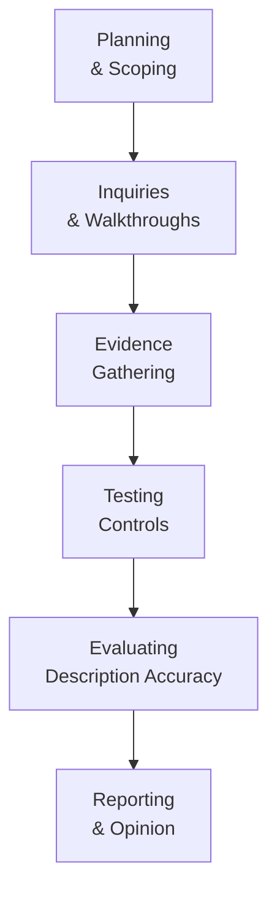

## 27.2 Description Criteria for Cybersecurity Risk Management

A cybersecurity risk management program is more than just a set of policies and tools—it is a holistic system designed to protect an organization’s information assets from an ever-evolving landscape of digital threats. For SOC for Cybersecurity engagements, CPAs and other professionals must understand how the entity’s cybersecurity program is documented, presented, and measured against defined standards. This section outlines the AICPA’s description criteria for cybersecurity risk management, explaining how an entity’s cybersecurity objectives, threat landscape, risk responses, and governance structures are articulated and tested.

A clear and concise description of the cybersecurity risk management program provides stakeholders—such as management, boards of directors, customers, and business partners—with insights into how the entity manages cybersecurity risks. Thus, this section also addresses how service auditors evaluate and test the completeness and accuracy of that description.

  
### Purpose and Context of the Description Criteria

SOC for Cybersecurity is fundamentally about providing confidence to external stakeholders that an organization’s cybersecurity risk management program is suitably designed and effectively operated to meet its cybersecurity objectives. The description criteria set the parameters for how management should present the components of the cybersecurity risk management program. These criteria:

• Establish a common language and structure for describing cybersecurity risk management processes.  
• Offer guidance on the key areas to be disclosed—ranging from risk assessment methodologies to monitoring activities.  
• Support comparability so that users of the SOC for Cybersecurity report can evaluate the nature of these cybersecurity protections across different organizations. 

A well-crafted description includes details about the entity’s environment, infrastructure, risk assessment processes, information and communication systems, and governance. By complying with an accepted set of description criteria, management ensures the presentation is sufficiently comprehensive and aligned with industry best practices and authoritative frameworks (e.g., NIST 800-53, ISO 27001, or COBIT 2019).

  
### Key Elements of a Cybersecurity Risk Management Program Description

Although the exact structure of each program varies by industry, size, regulatory environment, and risk tolerance, the following elements are typically necessary in a cybersecurity risk management program description for SOC for Cybersecurity.

#### 1. Nature of the Business and Environment
• Description of the organization’s primary activities, markets served, and significant regulatory requirements that shape its cybersecurity posture.  
• Discussion of the key operational aspects, including digital assets, significant data repositories, and business operations reliant on technology.  

#### 2. Cybersecurity Objectives
• Identification of the primary objectives guiding the program (e.g., preserving data integrity, protecting confidential information, ensuring system availability).  
• Alignment of cybersecurity objectives with broader business strategies, stakeholder expectations, and relevant legal or regulatory mandates (HIPAA, GDPR, PCI DSS, etc.).  

#### 3. Role of Governance and Risk Oversight
• Explanation of how board-level committees, executives, and senior management oversee cybersecurity strategies and plans.  
• Insight into how organizational leaders make decisions regarding the allocation of resources for cybersecurity initiatives.  
• Description of the reporting structure, including committees or teams responsible for reviewing cybersecurity matters and ensuring accountability.  

#### 4. Risk Assessment Process
• Detail on the methods used to identify, assess, and prioritize cybersecurity risks, referencing frameworks such as the COSO ERM framework or ISO 27005 for risk management.  
• Explanation of how the organization determines which assets are critical, estimates the likelihood of threat occurrences, and analyzes potential impacts.  
• Illustration of how the organization tracks and reassesses risks over time, adapting to emerging threats, vulnerabilities, and changes in technology.  

#### 5. Cybersecurity Communications and Policies
• Outline the formal policies and procedures that govern cybersecurity activities, including acceptable use, data classification, incident response, and privacy.  
• Discussion of training programs and awareness campaigns aimed at establishing a secure culture, referencing Chapter 16: Foundations of Cybersecurity and Chapter 19: Data Confidentiality and Privacy Controls.  
• Formal lines of communication to ensure employees and contractors are informed about relevant policies or changes to the cybersecurity program.  

#### 6. Control Environment and Control Activities
• Identification of control processes designed to mitigate identified risks—covering access controls, patch management, segregation of duties, and monitoring of third-party relationships.  
• An overview of how the control environment fosters ethical behavior and accountability.  
• Explanation of the organization’s approach to reviewing, testing, and auditing controls for ongoing improvement.  

#### 7. Information and Communication Systems  
• Description of the technology infrastructure supporting security operations, including network design, endpoint protection, firewall implementations, and intrusion detection/prevention systems.  
• Reference to relevant chapters such as Chapter 17: Security Architecture and Network Management and Chapter 18: Authentication and Access Management for deeper coverage of controls.  
• Details regarding key software applications or systems that store or process sensitive data.  

#### 8. Monitoring and Ongoing Assessment
• Description of how the organization measures, tests, and reports on the effectiveness of cybersecurity controls throughout the year.  
• Explanation of how anomalies, "red flags," or control gaps are identified, escalated, and addressed.  
• Use of metrics and key performance indicators (KPIs)—for instance, mean time to detect (MTTD), mean time to respond (MTTR), or frequency of vulnerability scanning.  

#### 9. Incident Response and Recovery 
• Reference to Chapter 20: Incident Response and Recovery.  
• Details of the procedures for detecting, responding to, and containing cybersecurity incidents, as well as for recovering from them if they occur.  
• Discussion of how lessons learned from incidents feed back into the overall cybersecurity strategy and updates to the risk management program.  

  
### Diagram: Cybersecurity Risk Management Description Flow

The following Mermaid diagram provides a visual overview of how a cybersecurity risk management program’s description might be structured and iterated:

Explanation of the diagram:  
1. The organization starts by describing its core business activities and environment (A).  
2. Based on that context, the cybersecurity objectives (B) are established and communicated.  
3. Governance and oversight processes (C) guide strategic direction and resource allocation.  
4. Risk assessments (D) identify vulnerabilities and threats, providing the basis for policies and controls (E).  
5. Monitoring and ongoing assessment (F) ensure controls are operating effectively.  
6. Incident response and recovery (G) emphasize readiness and resilience.  
7. Lessons learned from incidents foster continuous improvement and feed back into objectives (B) and subsequent steps.

  
### Management’s Responsibilities for the Description

While CPAs and other cybersecurity professionals may collaborate with management in developing the cybersecurity program documentation, **management ultimately bears responsibility** for:

• Preparing a complete and accurate description that meets the description criteria.  
• Determining the cybersecurity risks and related controls most relevant to the organization’s environment and stakeholder needs.  
• Establishing the policies, procedures, and governance practices that align with stated cybersecurity objectives and risk appetite.  

In compliance with professional standards (see Chapter 25: Planning and Performing a SOC Engagement), management asserts the fairness and completeness of the presented program description.  
  
  
### Testing the Description: The Service Auditor’s Role

For a SOC for Cybersecurity engagement, the service auditor (CPA firm or qualified audit team) evaluates whether the management-prepared description of the cybersecurity risk management program aligns with the description criteria. This evaluation entails:

1. **Inspection of Documentation**  
   • Examination of policies, procedures, network diagrams, and risk assessments to verify that the description accurately reflects the actual cybersecurity environment.

2. **Inquiry and Observation**  
   • Interviews with relevant personnel (IT managers, security analysts, compliance officers) to confirm the design and operation of the program.  
   • Observation of processes in place (e.g., how security patches are deployed, how access reviews are conducted).  

3. **Recalculation or Re-Performance**  
   • Testing specific controls—for instance, verifying that password complexity aligns with stated policies or confirming that firewall rule changes require appropriate approvals.  
   • Cross-referencing system configurations against management’s statement that particular security hardening guidelines have been implemented.  

4. **Comparison to Established Frameworks**  
   • Drawing on references to frameworks like COBIT 2019, NIST Cybersecurity Framework, or relevant Trust Services Criteria to assess completeness.  

5. **Assessing Completeness**  
   • Determining if all key components of an effective cybersecurity risk management program are included, and whether any significant omissions could mislead stakeholders.  

If the service auditor identifies inconsistencies or omissions, they discuss these with management to clarify, leading to updates in the final description or modifications to the service auditor’s opinion.   
  

### Real-World Case Study: Financial Services Organization

Consider a mid-sized financial services institution—call it "FinCorps Solutions"—that processes mortgage applications online and stores highly sensitive customer data. Management’s cybersecurity objectives focus on confidentiality of customer information, integrity of loan-processing data, and continuous availability of the system.

1. **Nature of the Business**: FinCorps offers mortgage processing services nationwide, heavily relying on a secure online portal.  
2. **Cybersecurity Objectives**: Protecting logs of financial transactions and ensuring the uninterrupted availability of the loan underwriting platform.  
3. **Governance**: A board-level cyber-risk committee meets quarterly, overseeing budgets for security investments.  
4. **Risk Assessment**: Uses an annual risk assessment aligned with NIST 800-30 to identify top threats (e.g., external hackers, internal fraud, vendor vulnerabilities).  
5. **Control Environment**: Formal segregation of duties, multi-factor authentication for key systems, and patch management processes measured weekly.  
6. **Incident Response**: Guidelines for triaging potential data breaches, real-time monitoring for suspicious access attempts, and tabletop exercises tested monthly.  
7. **Monitoring**: Continuous vulnerability scans, quarterly penetration tests, and monthly executive-level cybersecurity updates.  

When the service auditor reviewed FinCorps’s description of its cybersecurity risk management program, they found it consistent with reality. Controls such as two-factor authentication and encryption of sensitive data were indeed operational. The final SOC for Cybersecurity report attested to the company’s robust program, enhancing stakeholder confidence in the safety and reliability of FinCorps’s services.

  
  
### Common Pitfalls and Challenges

1. **Incomplete or Ambiguous Descriptions**  
   • Failing to explain how significant threats are identified or how controls specifically address those threats can reduce stakeholder confidence.  
2. **Misalignment with Leading Frameworks**  
   • A program that lacks reference to recognized frameworks (e.g., NIST CSF, COBIT 2019) may appear weak or incomplete.  
3. **Overgeneralized or Boilerplate Narratives**  
   • Generic language copied without adaptation to the entity’s unique environment can result in coverage gaps.  
4. **Lack of Regular Updates**  
   • Rapid shifts in technology and the threat landscape require frequent adjustments to policies, procedures, and program descriptions. Delayed updates risk leaving significant vulnerabilities unaddressed.  
5. **Failure to Involve All Relevant Stakeholders**  
   • Solely relying on the IT department ignores broader business inputs. Boards of directors, legal teams, finance managers, data owners, and other key groups should be part of the description process.  

  
### Enhancing the Description with Continuous Monitoring

In Chapters 14 and 20, we introduced the concepts of data analytics, continuous monitoring, and automated incident response. Integrating these approaches into the cybersecurity risk management program not only strengthens detection and response capabilities, but also provides real-time validation of management’s assertions in the description. For example:

• Automated logging of user activities and change management events, correlated to detect anomalies in real time.  
• Dashboard-based reporting aligned to the program description, enabling immediate comparison between established security baselines and ongoing performance.  
• Real-time updates to executive management and board committees, ensuring that any deviations from described controls quickly lead to remediation steps.  

  
### Practical Steps for Meeting Description Criteria

The table below summarizes practical actions management can take to align its cybersecurity risk management program with SOC for Cybersecurity description criteria:

| Action Step                         | Description                                                                                                    |
|------------------------------------|----------------------------------------------------------------------------------------------------------------|
| Align Objectives and Processes      | Articulate cybersecurity objectives. Map these objectives to existing processes and identify gaps.            |
| Categorize Assets and Data         | Develop an asset inventory and define data classification levels (see Chapter 11).                           |
| Engage Stakeholders and Specialists| Collaborate with the board, risk committees, external auditors, and domain experts for refined oversight.     |
| Document Policies & Procedures     | Establish documented policies detailing how cybersecurity is implemented and governed across the entity.       |
| Incorporate Testing & Scanning     | Use vulnerability assessments, penetration testing, and code reviews to validate the effectiveness of controls.|
| Report and Reevaluate              | Provide routine cybersecurity updates. Modify strategy and description as new threats, technologies, or regulations emerge.  |

  
### Mermaid Diagram: High-Level Testing Approach

Below is an outline of the high-level testing approach that a service auditor might follow when evaluating an entity’s cybersecurity risk management program against the description criteria:

Explanation of the diagram:  
• Planning & Scoping (A): Auditor defines objectives, identifies critical systems, and confirms the boundaries of the engagement.  
• Inquiries & Walkthroughs (B): Conversations with management, review of flowcharts, and initial observations of processes.  
• Evidence Gathering (C): Collection of policy documents, system configuration extracts, logs, and risk assessments.  
• Testing Controls (D): Verification through re-performance, inspection, or sampling to confirm the described processes are indeed in effect.  
• Evaluating Description Accuracy (E): Auditor compares the program description against the testing results and relevant frameworks.  
• Reporting & Opinion (F): The final stage where the service auditor forms their conclusion and issues the SOC for Cybersecurity report.

  
### Best Practices

• **Tie the description specifically to organizational risk appetite:** Aim for precision instead of broad statements.  
• **Use clear, consistent terminology:** Define acronyms and technical jargon for a non-technical audience.  
• **Reference established governance frameworks:** This ensures the program’s credibility and comprehensiveness.  
• **Maintain agility:** Review and update the cybersecurity program description at least annually—or more frequently during periods of rapid innovation or threat evolution.  
• **Incorporate third-party considerations:** Clarify how vendors, partners, or cloud providers fit into the entity’s cybersecurity controls and oversight (see Chapter 7.5 Third-Party and Vendor Risk Management).

  
### Conclusion

A strong cybersecurity risk management program—properly described and tested—reassures stakeholders that the entity is proactive in safeguarding digital assets and protecting against persistent cyber threats. By adhering to standardized description criteria and recognized frameworks, organizations elevate transparency, consistency, and effectiveness in communicating security posture to potential and existing clients, regulatory bodies, and the investing public. As we have seen, the service auditor’s testing process provides independently verified insights, reflecting the organization’s true cybersecurity capabilities and readiness to adapt to evolving threats.  

This structured approach to describing and evaluating a cybersecurity risk management program is the cornerstone of a successful SOC for Cybersecurity report. CPAs and other professionals involved in these engagements can thus offer high-value assurance services, bridging the gap between technical controls and stakeholder confidence in an increasingly interconnected digital world.

  
## Test Your Knowledge of Cybersecurity Risk Management Description Criteria



### Which of the following is a fundamental purpose of the SOC for Cybersecurity description criteria?

- [x] To provide a common structure and language for describing cybersecurity risk management processes.
- [ ] To detail every line of an organization's source code.
- [ ] To eliminate the need for continuous monitoring.
- [ ] To replace the COSO Internal Control – Integrated Framework in all respects.

> **Explanation:** The AICPA’s description criteria for SOC for Cybersecurity serve as a standardized way to present the organization's cybersecurity risk management program, ensuring consistency and clarity.  

### When describing an entity’s cybersecurity risk management program, management should:

- [x] Clearly outline the organization’s governance structure and decision-making processes for cybersecurity.
- [ ] Limit discussions of controls to physical security measures.
- [ ] Omit references to regulatory frameworks such as HIPAA or GDPR.
- [ ] Focus solely on external threat actors.

> **Explanation:** A comprehensive description includes governance, policies, and regulatory matters; cybersecurity must be approached holistically, covering both internal and external threats.  

### Which of the following best describes the service auditor’s responsibility in a SOC for Cybersecurity engagement?

- [x] Evaluating whether management’s description of the cybersecurity program aligns with the description criteria and is fairly presented.
- [ ] Writing the organization’s cybersecurity policies.
- [ ] Designing new security controls to mitigate critical threats.
- [ ] Eliminating the need for a board-level cyber-risk committee.

> **Explanation:** The service auditor’s role is to examine and opine on the fairness of management’s description. While an auditor may provide recommendations, designing controls is management’s responsibility.  

### In the context of SOC for Cybersecurity, incomplete or ambiguous descriptions typically result in:

- [x] Reduced stakeholder confidence and potential modifications to the auditor’s opinion.
- [ ] Immediate acceptance if the business has not suffered a breach.
- [ ] Increased clarity concerning potential threats.
- [ ] Exemption from compliance with industry standards.

> **Explanation:** A vague or incomplete description can lead to uncertainty for report users, and the auditor may highlight these weaknesses in the final opinion.  

### Which element of a cybersecurity risk management program focuses on identifying, evaluating, and prioritizing threats?

- [x] Risk Assessment
- [ ] Governance and Oversight
- [x] Incident Response
- [ ] Nature of the Business

> **Explanation:** Risk assessment aims to identify threats, vulnerabilities, and the potential impact on the organization, which then informs control activities and incident response procedures.  

### A key outcome of a service auditor’s testing during a SOC for Cybersecurity engagement is to:

- [x] Compare the actual cybersecurity program with the management-prepared description for consistency.
- [ ] Replace the organization’s existing access control policies with brand-new standards.
- [ ] Guarantee that no security incidents will occur in the future.
- [ ] Prepare the legal contracts for third-party vendors.

> **Explanation:** The service auditor assesses the accuracy and completeness of the organization’s program description, verifying that stated controls are in place and functioning as described.  

### Which of the following best describes the interaction between management’s description and established frameworks like NIST or ISO?

- [x] Management’s description often references these frameworks to demonstrate comprehensiveness and alignment with recognized best practices.
- [ ] These frameworks are not relevant to SOC for Cybersecurity.
- [x] They serve only to verify financial statements.
- [ ] They are exclusive to internal IT teams and never used for external reporting.

> **Explanation:** Frameworks like NIST 800-53 and ISO 27001 support the credibility of the cybersecurity program. While not mandatory, their use is widely accepted for aligning the security program with leading industry standards.  

### Why is it critical for an organization to regularly update its cybersecurity risk management program description?

- [x] Because the threat landscape evolves quickly, and static descriptions may no longer be accurate over time.
- [ ] To remove references to governance whenever possible.
- [ ] To shift responsibilities away from management to the auditor.
- [ ] To keep the board of directors uninformed of emerging threats.

> **Explanation:** As new threats, technologies, or regulations emerge, the organization must update its policies and descriptions to remain accurate and relevant.  

### In a SOC for Cybersecurity examination, the identification of material omissions in the entity’s description may lead to:

- [x] Revisions to the description or modifications to the examiner’s final opinion.
- [ ] Automatic pass of the SOC engagement.
- [ ] Suppression of the issues for confidentiality reasons.
- [ ] Removal of all incident response documentation from the report.

> **Explanation:** Material omissions can compromise the fairness of the presentation, and the auditor may require description adjustments or note deficiencies in the final opinion.  

### A well-structured cybersecurity risk management program description is designed to instill confidence primarily in:

- [x] True
- [ ] False

> **Explanation:** Stakeholders, including customers, partners, regulators, and investors, rely on the SOC for Cybersecurity report to gauge how robustly the entity is protecting its critical assets.  



---

## For Additional Practice and Deeper Preparation

### [Information Systems and Controls (ISC)](https://www.udemy.com/course/isc-cpa-mock-exams/?referralCode=E1217303222935C5E464)  

**Information Systems and Controls (ISC) CPA Mocks:** 6 Full (1,500 Qs), Harder Than Real! In-Depth & Clear. Crush With Confidence!

- Tackle full-length mock exams designed to mirror real ISC questions.  
- Refine your exam-day strategies with detailed, step-by-step solutions for every scenario.  
- Explore in-depth rationales that reinforce higher-level concepts, giving you an edge on test day.  
- Boost confidence and minimize anxiety by mastering every corner of the ISC blueprint.  
- Perfect for those seeking exceptionally hard mocks and real-world readiness.  

_Disclaimer: This course is not endorsed by or affiliated with the AICPA, NASBA, or any official CPA Examination authority. All content is for educational and preparatory purposes only._
